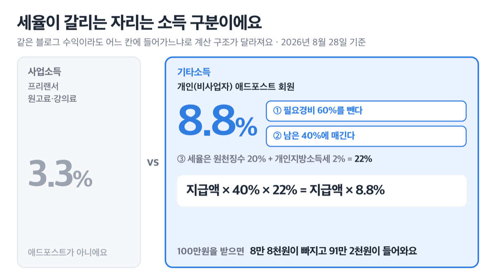
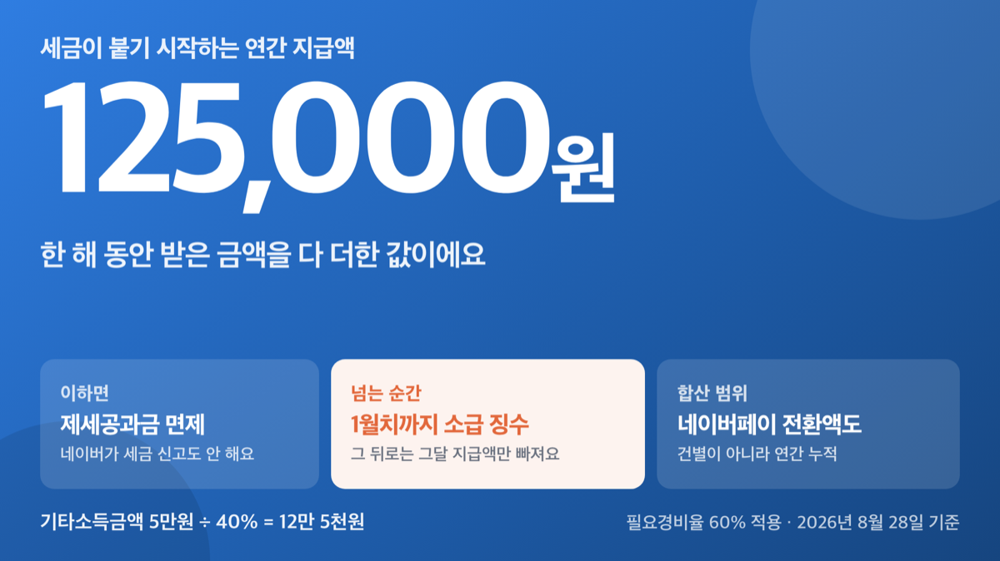
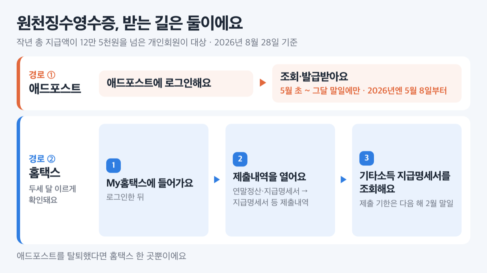
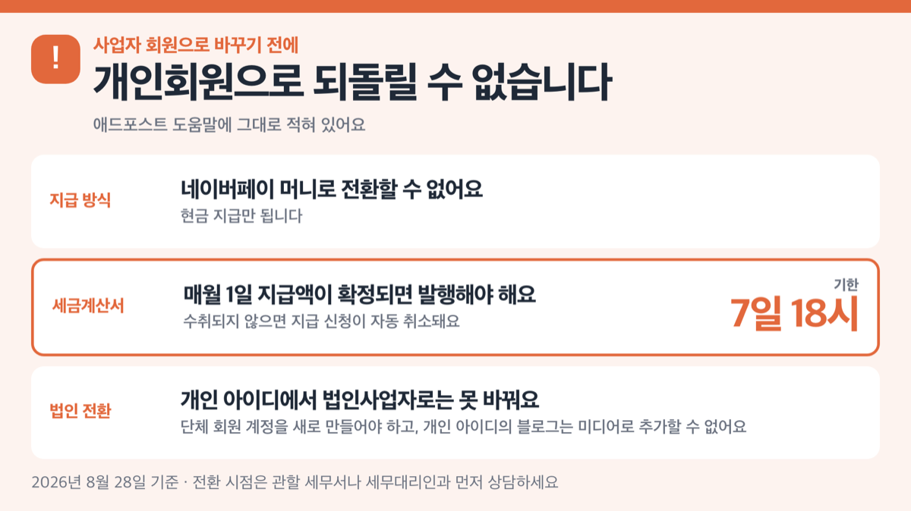

# 애드포스트 세금 8.8%, 12만 5천원 넘으면 소급돼요

📌 2026년 8월 28일 기준

애드포스트 세금은 3.3%가 아니라 8.8%예요. 검색하면 나오는 글 상당수가 3.3%라고 적어 뒀는데, 네이버 도움말 원문에는 8.8%라고 적혀 있어요.

**3줄 요약**

- 개인(비사업자) 애드포스트 회원의 수익은 기타소득이라, 지급액의 8.8%를 뗍니다. 소득세 8%에 개인지방소득세 0.8%를 더한 값이에요.
- 2018년 4월부터 필요경비율이 60%로 내려가면서, 세금이 붙기 시작하는 선이 연간 지급액 12만 5천원이 됐어요.
- 먼저 확인할 건 하나예요. 올해 받은 돈이 12만 5천원을 넘었는지.

얼마를 떼는지, 언제 소급되는지, 5월에 신고를 해야 하는지, 사업자등록은 어디서 달라지는지 순서로 짚을게요.

---

## 애드포스트 수익은 기타소득이에요 — 8.8%가 여기서 나옵니다

개인(비사업자) 애드포스트 회원의 수익은 사업소득이 아니라 **기타소득**이에요. 프리랜서 원고료나 강의료처럼 3.3%를 떼는 사업소득과는 다른 칸에 들어가요.

세율이 달라지는 이유는 계산 구조가 다르기 때문이에요. 기타소득은 받은 금액의 60%를 필요경비로 먼저 빼 주고, 남은 40%에 세금을 매겨요. 그 40%에 붙는 기타소득 원천징수세율이 20%, 여기에 소득세의 10%가 개인지방소득세로 따라붙어 22%가 됩니다.

| 무엇 | 값 |
|---|---|
| 소득 구분 (개인·비사업자 회원) | 기타소득 |
| 필요경비 의제 | 받은 금액의 60% |
| 기타소득 원천징수세율 | 20% |
| 개인지방소득세 | 소득세의 10% (=2%) |
| 지급액 기준 실효 공제율 | **8.8%** |

쉽게 말하면 ==지급액 × 40% × 22% = 지급액 × 8.8%== 예요. 100만원을 받으면 8만 8천원이 빠지고 91만 2천원이 들어와요.

네이버 도움말은 이 0.8%를 '주민세'라고 적어 뒀는데, 현행 법령상 이름은 개인지방소득세예요. 주민세는 따로 있는 별개의 세목이라, 세무서에 물어볼 때 이름을 그대로 옮기면 말이 안 통할 수 있어요.

그런데 이 8.8%가 처음부터 붙는 건 아니에요.

---

## 💰 12만 5천원을 넘는 순간, 1월치까지 소급해서 뗍니다

애드포스트는 연간 지급 금액이 **12만 5천원을 넘을 때부터** 세금을 뗍니다. 그 이하면 제세공과금이 면제되고, 네이버가 세금 공제도 세금 신고도 하지 않아요.

문제는 넘어가는 방식이에요. 12만 5천원을 초과하는 순간, 그해 1월부터 받은 모든 지급액의 세금을 한 번에 소급해서 뗍니다. 그 뒤로는 매달 그달 지급액의 세금만 빠져요.

> [!WARNING]
> 소급 징수액이 그달 지급액보다 크면 **지급 자체가 실패**합니다. 네이버 도움말에 예시까지 있어요 — 지급액 5만원에 발생 세금이 5만 5천원이면 그달은 입금되지 않습니다.

세금 계산에 들어가는 돈의 범위도 넓어요. 계좌로 받는 정기 지급과 탈퇴 지급뿐 아니라 **네이버페이 머니로 전환한 금액까지 모두 합산**합니다. 포인트로 바꿔 썼으니 소득이 아니라고 보면 계산이 어긋나요.

> 😕 **저는 한 번에 5만원도 안 받는데요?**
>
> 법이 정한 기타소득 과세최저한은 '건별 5만원'이 맞아요. 그런데 애드포스트는 이걸 **건별이 아니라 연간 누적**으로 운영합니다. 매달 3만원씩 받아도 다섯 달째에 15만원이 되면 그 시점에 1월치까지 세금이 붙어요. 법 조문과 플랫폼 운영이 겹치지 않는 대목이에요.

12만 5천원이라는 숫자도 그냥 정해진 게 아니에요. 법에 적힌 건 기타소득금액 5만원이고, 필요경비 60%를 빼기 전 지급액으로 되돌리면 5만원 ÷ 40% = 12만 5천원이 나옵니다. 산식 자체가 법에 쓰여 있는 건 아니지만, 필요경비율이 바뀔 때마다 기준선도 같이 움직인 걸 보면 계산이 맞아떨어져요.

| 필요경비율 | 세금이 시작되는 연간 지급액 |
|---|---|
| 80% (과거) | 25만원 |
| 70% (과거) | 166,666원 |
| **60% (현재)** | **125,000원** |

애드포스트 정책은 이렇게 소급해서 바뀐 적이 있어요. 지금 숫자를 외우는 것보다 계산 구조를 알아 두는 쪽이 오래 갑니다.

실제로 얼마가 빠지는지 보면 감이 잡혀요. 아래는 **1년 동안 받은 지급액 합계** 기준이에요.

| 연간 지급액 | 떼는 세금 (8.8%) | 손에 쥐는 돈 |
|---|---|---|
| 200만원 | 176,000원 | 1,824,000원 |
| 500만원 | 440,000원 | 4,560,000원 |
| 750만원 | 660,000원 | 6,840,000원 |

여기까지는 네이버가 알아서 떼 가는 돈이에요. 내가 직접 신고해야 하는 구간은 따로 있어요.

---

## 5월에 신고해야 하는 사람과 안 해도 되는 사람

기타소득금액이 **300만원 이하**이고 원천징수까지 끝났다면, 그 소득은 분리과세로 마무리됩니다. 종합소득 과세표준에 합산하지 않고, 확정신고를 하지 않아도 돼요. 회사에 다니면서 애드포스트를 하는 경우도 같아요. 근로소득과 분리과세 기타소득만 있으면 확정신고 대상에서 빠집니다.

여기서 헷갈리는 지점이 하나 있어요. **300만원은 지급액이 아니라 기타소득금액**이에요. 필요경비 60%를 뺀 뒤의 금액이라, 지급액으로 환산하면 300만원 ÷ 40% = 750만원이 됩니다.

| 연간 지급액 (필요경비 60% 적용 시) | 5월 종합소득세 신고 |
|---|---|
| 12만 5천원 이하 | 세금 자체가 없어요 |
| 12만 5천원 초과 ~ 750만원 이하 | 분리과세로 끝나요. 안 해도 됩니다 |
| 750만원 초과 | 합산해서 신고해야 합니다 |

다만 750만원은 **다른 기타소득이 하나도 없을 때** 기준이에요. 강연료나 원고료 같은 다른 기타소득이 있으면 그것까지 합쳐 300만원을 따집니다. 애드포스트 수입이 12만 5천원을 안 넘어도, 다른 기타소득이 있으면 신고 대상이 될 수 있어요.

신고 기간은 소득이 생긴 다음 해 **5월 1일부터 5월 31일까지**입니다. 마지막 날이 토요일이나 일요일, 공휴일이면 그다음 날까지로 하루 밀려요. 지금(2026년 8월) 애드포스트로 벌고 있는 돈은 **2027년 5월에 신고**하는 몫이에요. 그해 마감일은 국세청 신고 안내에서 한 번 더 확인하세요.

> **솔직히 말하면** — 750만원 아래인데도 합산 신고가 유리한 경우가 있어요. 8.8%는 지급액 기준 실효세율이라, 다른 소득이 적어서 내 종합소득세율이 낮은 사람은 이미 떼인 세금 일부를 돌려받을 수 있거든요. 법에도 '합산하려는 경우 분리과세에서 제외한다'는 선택 조항이 있어요. 저는 다른 소득이 거의 없는 해라면 합산 신고를 계산해 보는 쪽입니다. 어느 쪽이 유리한지는 다른 소득과 공제에 따라 달라지니, 홈택스 모의계산이나 세무서 상담으로 확인하세요.

경비 증빙을 챙기는 사람에게도 여지가 있어요. 필요경비 60%는 최소한으로 보장해 주는 값이고, **실제 쓴 경비가 60%를 넘으면 그 초과분도 필요경비로 넣을 수 있습니다.** 잘 안 알려져 있는데 시행령 단서에 그대로 있어요.

---

## 원천징수영수증 떼는 법 — 애드포스트는 5월에만 열려요

신고를 하든 안 하든, 얼마가 떼였는지는 서류로 확인해 두는 게 좋아요. 네이버가 발급하는 건 **기타소득 원천징수영수증**이고, 작년 총 지급액이 12만 5천원을 넘은 개인회원이 대상이에요. 받는 방법은 둘입니다.

1. **애드포스트에서 받기.** 매년 5월 초부터 그달 말일까지만 조회·발급 창구가 열립니다. 2026년에는 5월 8일부터 열렸어요.
2. **홈택스에서 받기.** 로그인한 뒤 `My홈택스 → 연말정산·지급명세서 → 지급명세서 등 제출내역 → 기타소득 지급명세서`로 들어가면 조회됩니다.
3. **애드포스트를 탈퇴했다면** 홈택스로만 조회할 수 있어요.

홈택스가 더 빠를 때가 많아요. 네이버가 국세청에 기타소득 지급명세서를 내는 기한이 **다음 해 2월 말일**이고, 국세청이 접수한 지급명세서를 납세자가 바로 확인할 수 있게 열어 주거든요. 애드포스트 창구가 5월에 열리는 것보다 두세 달 이르죠.

여기까지가 개인회원 이야기예요. 수익이 커지면 다음 질문이 나옵니다.

---

## 사업자등록, 애드포스트에서는 되돌릴 수 없어요

국세청은 콘텐츠로 **계속적이고 반복적으로** 수익을 내면 사업자등록을 하도록 안내합니다. 등록 기한은 사업 개시일부터 20일 이내예요. 그리고 사람을 고용했거나 스튜디오·전문 장비 같은 물적시설을 갖췄는지에 따라 업종이 달라집니다.

| 업종코드 | 어떤 경우 | 신고 의무 |
|---|---|---|
| 921505 (과세) | 직원 고용 또는 별도 사업장·장비 보유 | 부가가치세 신고 |
| 940306 (면세) | 고용도 물적시설도 없음 | 사업장현황신고 (다음 해 2월 10일까지) |

혼자 집에서 글을 쓰는 블로거는 대개 **면세사업자**(940306)에 해당하는데, 애드포스트 도움말에는 「면세사업자는 애드포스트 이용이 불가합니다」라고 적혀 있습니다. 국세청이 안내하는 유형과 플랫폼이 받아 주는 유형이 어긋나요.

전환에 붙는 제약도 가볍지 않아요.

- **사업자 회원으로 바꾸면 개인회원으로 되돌릴 수 없습니다** *(도움말에 그대로 적혀 있어요)*
- 네이버페이 머니로 전환할 수 없고 **현금 지급만** 됩니다
- 매월 1일 지급액이 확정되면 **7일 18시까지** 세금계산서를 발행해야 하고, 그때까지 수취되지 않으면 지급 신청이 자동 취소돼요
- 개인 아이디에서 법인사업자로는 못 바꿔요. 단체 회원 계정을 새로 만들어야 하고, **개인 아이디의 블로그는 그 계정에 미디어로 추가할 수 없습니다**

사업자 회원은 원천징수 대신 지급 예정액에 부가가치세 10%가 포함되어 나갑니다. 원천징수 대상이 되는 사업소득은 부가가치세 면세인 인적용역인데, 애드포스트 사업자 회원은 면세사업자가 될 수 없으니 그 범위에서 벗어나요. 다만 이건 법령 구조에서 나온 해석이고, 네이버가 「사업자 회원은 원천징수하지 않는다」고 직접 적어 둔 문장은 없습니다.

저라면 서두르지 않아요. 되돌릴 수 없다는 한 줄이 붙은 선택은 늦게 넘어가도 손해가 작고, 일찍 넘어가면 무를 방법이 없거든요. 사업자등록이 필요한 시점인지, 어떤 유형으로 내야 하는지는 관할 세무서나 세무대리인과 먼저 상담하세요. 네이버 도움말도 같은 안내를 덧붙여 뒀어요.

장부 없이 신고할 때 쓰는 경비율도 미리 알아 두면 좋아요. **2025년 귀속 기준**입니다.

| 업종코드 | 단순경비율 (기본율) | 기준경비율 |
|---|---|---|
| 940306 (1인미디어콘텐츠창작자) | 64.1% | 12.1% |
| 921505 (미디어콘텐츠창작) | 71.2% | 15.8% |

940306은 수입금액 4천만원까지 기본율 64.1%가 적용되고, 4천만원을 넘는 부분에는 49.7%가 붙습니다. 경비율은 해마다 고시로 바뀌니 신고할 때 그해 값을 다시 확인하세요.

---

## 애드포스트 세금에서 자주 걸리는 함정 셋

숫자 자체보다 여기서 더 많이 틀립니다.

1. **3.3%라는 숫자.** 이건 프리랜서 사업소득 원천징수율이에요. 애드포스트 개인회원은 기타소득이라 8.8%입니다. 심지어 「12만 5천원을 넘으면 사업소득세 3.3%를 뗀다」며 두 제도를 뒤섞어 놓은 요약도 돌아다녀요.
2. **네이버 도움말의 '연 2,400만원'.** 사업자등록 안내 문서에 「반기 매출 1,200만원, 연 2,400만원을 초과하면 신고·납부 의무가 있다」고 적혀 있는데, 현행 부가가치세법의 기준은 간이과세 적용 1억 400만원 미만, 납부의무 면제 4,800만원 미만이에요. 숫자가 맞지 않으니 이 문장을 기준으로 판단하지 마세요.
3. **12만 5천원을 건별로 아는 것.** 연간 누적이고, 네이버페이 머니 전환액도 그 합계에 들어갑니다.

플랫폼 안내는 그 플랫폼이 어떻게 정산하는지에 대해서만 1차 자료입니다. 세법 해석까지 맡기면 어긋나는 대목이 나와요.

---

## 애드포스트 세금 관련 궁금증 해결

**Q. 올해 애드포스트로 12만원을 받았어요. 세금 내야 하나요?**
A. 애드포스트에서는 떼지 않습니다. 12만 5천원 이하면 제세공과금이 면제되고 네이버가 세금 신고도 하지 않아요. 다만 원고료·강연료 같은 다른 기타소득이 있으면 그쪽과 합산해 신고 대상이 될 수 있습니다.

**Q. 8.8%를 떼였는데 돌려받을 수 있나요?**
A. 종합소득에 합산해서 5월에 신고하면 실제 세율로 정산되고, 이미 낸 세금이 많았다면 그 차액이 환급됩니다. 다른 소득이 많으면 반대로 더 낼 수도 있어요. 홈택스 모의계산이나 세무서 상담으로 어느 쪽이 유리한지 먼저 따져 보세요.

**Q. 네이버페이 머니로 받으면 세금을 피할 수 있나요?**
A. 아니요. 네이버페이 전환 금액도 연간 지급액에 그대로 합산되고, 12만 5천원을 넘으면 원천징수한 뒤 전환됩니다. 전환 신청액보다 발생 세금이 크면 전환 자체가 실패해요.

**Q. 사업자 회원이 되면 8.8%를 안 떼나요?**
A. 사업자 회원은 원천징수 방식이 아니라, 지급액에 부가가치세 10%가 포함되어 나가는 구조예요. 세금은 부가가치세 신고와 종합소득세 신고로 직접 정산하게 됩니다. 대신 개인회원으로 되돌릴 수 없고 네이버페이 전환도 막히니, 전환 전에 세무 상담을 받아 두세요.

---

## 그래서 지금 확인할 것

올해 1월부터 지금까지 애드포스트에서 받은 금액을 다 더해 보세요. 계좌로 받은 것과 네이버페이로 바꾼 것을 함께요. 12만 5천원을 아직 안 넘었다면 올해는 세금 얘기가 없고, 넘겼다면 8.8%가 이미 빠졌거나 곧 소급해서 빠집니다.

750만원까지는 5월 신고를 걱정하지 않아도 돼요. 넘겼다면 지금부터 경비 증빙을 모아 두세요. 실제 경비가 60%를 넘으면 그 초과분까지 인정받을 수 있으니, 영수증 한 장이 그대로 세금 차이가 됩니다.

세금은 다른 소득과 공제 상황에 따라 사람마다 결과가 달라집니다. 신고 방식이나 사업자등록 시점처럼 판단이 필요한 부분은 관할 세무서나 세무대리인, 홈택스 상담 창구에서 확인하세요.

이 글은 공개된 자료를 정리한 정보 제공 목적의 글이며, 세무 자문이 아닙니다. 특정 업체와의 제휴 관계는 없습니다.

참고: 네이버 애드포스트 도움말 「회원 유형별 세금 정산 안내」·「원천징수 영수증 발급 안내」·「사업자 등록을 안내받은 경우」·「회원 유형 변경 방법」·「수입 지급 조건과 절차 안내」 · 애드포스트 공지사항 「2025년도 원천징수영수증 조회 안내」·「기타소득 과세기준 변경」 · 국세청 「1인미디어 창작자 세무 안내」 · 국세청 고시 제2026-14호 「2025년 귀속 경비율 고시」 · 국가법령정보센터 소득세법·소득세법 시행령·부가가치세법·지방세법·국세기본법
