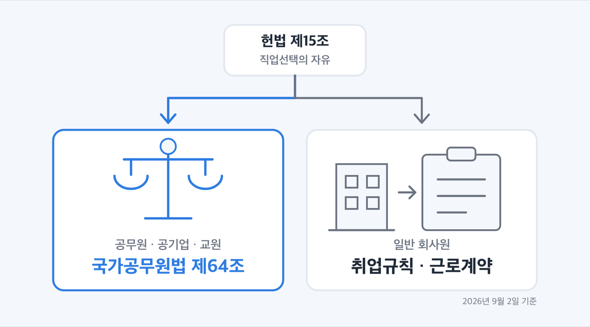
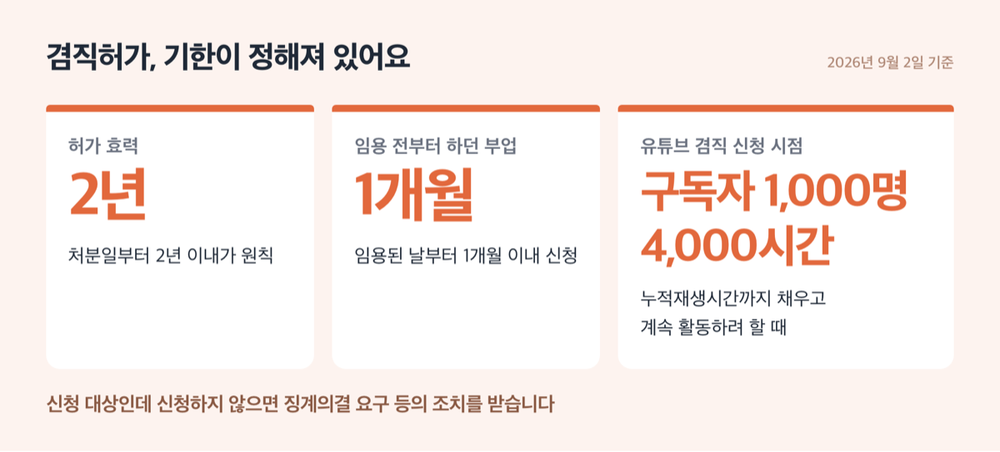
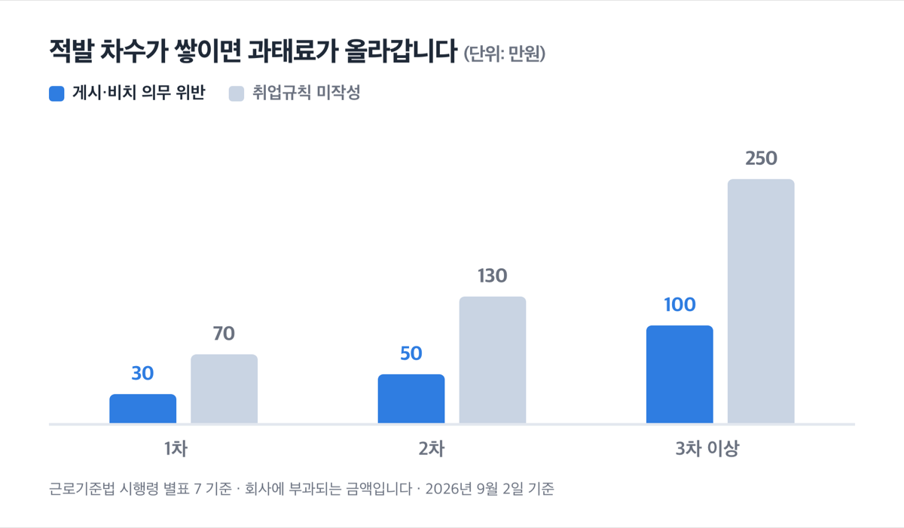
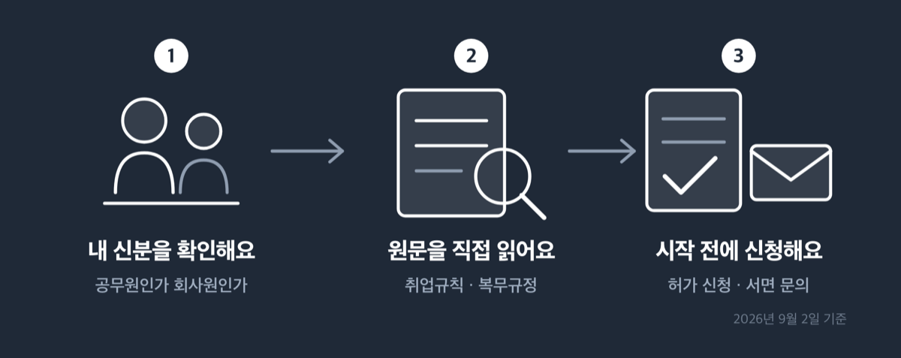
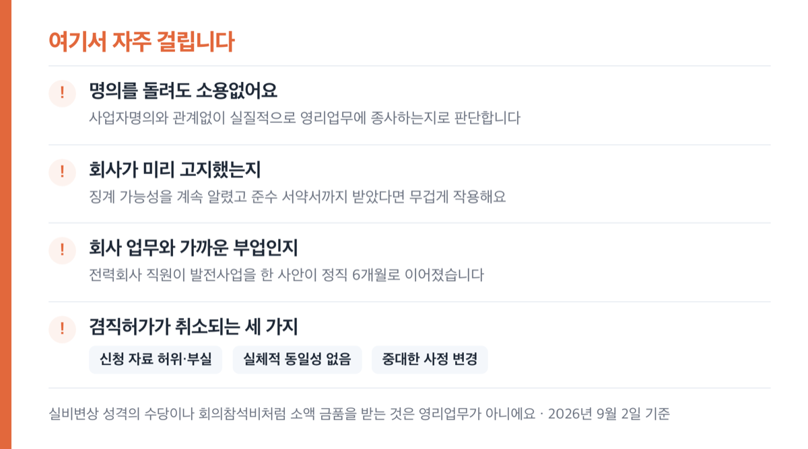

# 겸업금지 확인 3단계, 2026년 부업 전 정직 6개월 피하기

📌 2026년 9월 2일 기준

정직 6개월. 2025년 5월 법원이 그대로 유효하다고 본 징계예요. 배우자 명의로 태양광발전소를 운영한 공기업 직원 사건이었습니다.

**3줄 요약**

- 겸업금지는 근로기준법에 없어요. 공무원은 국가공무원법 제64조가, 일반 회사원은 회사 취업규칙이 근거입니다.
- 공무원·공기업 직원은 소속 기관장의 사전 허가가 필요하고, 허가 기간은 처분일부터 2년 이내가 원칙이에요.
- 부업을 시작하기 전에 내 취업규칙이나 복무규정 원문부터 확인합니다. 회사는 취업규칙을 열람할 수 있게 둘 의무가 있어요.

신분별 근거, 허가 기준과 기한, 실제로 징계가 확정된 사례까지 순서대로 적었어요.

> [!WARNING]
> 겸직허가 기간을 **1년**이라고 안내하는 글이 아직 많이 돌아다녀요. 인사혁신처 예규가 바뀌어 지금은 **처분일부터 2년 이내**가 원칙입니다. 회사 취업규칙과 기관 복무규정은 개정되니 신청 직전에 원문을 다시 확인하세요.

## ⚖️ 겸업금지는 근로기준법에 없습니다

겸업금지의 근거는 헌법, 법률, 회사 규칙 셋으로 나뉩니다.

먼저 헌법 제15조가 "모든 국민은 직업선택의 자유를 가진다"고 정해요. 이 자유를 제한하려면 헌법 제37조 제2항에 따라 **법률로써** 해야 하고, 제한하더라도 본질적인 내용은 침해할 수 없습니다.

그래서 확인해 봤어요. ==근로기준법 전문에 「겸직」과 「겸업」은 한 번도 나오지 않습니다.== 조문 목록을 훑은 게 아니라 법령 원문 전체를 검색한 결과예요.

그러면 회사는 무슨 근거로 부업을 막을까요? 법률이 아니라 **취업규칙과 근로계약**입니다. 근로기준법 제93조가 취업규칙에 표창과 제재, 근로자 전체에 적용될 사항을 담게 해 두었고, 회사가 그 칸에 겸업금지를 스스로 얹은 거예요.

| 내 신분 | 겸업금지 근거 (적용 법령·규칙) | 기관장 사전 허가 (부업 시작 전) |
|---|---|---|
| 공무원 | 국가공무원법 제64조, 국가공무원 복무규정 제25·26조 | 필요합니다 |
| 공기업·준정부기관 직원 | 공공기관의 운영에 관한 법률 제37조 | 필요합니다 |
| 사립학교 교원 | 사립학교법 제55조 (국공립 교원 규정을 준용) | 필요합니다 |
| 일반 회사원 | 회사 취업규칙·근로계약 | 회사 규칙에 따라 달라요 |

공기업 직원이 공무원과 같은 잣대를 적용받는 이유는 조문 하나 때문이에요. 공공기관의 운영에 관한 법률 시행령 제25조가 영리 목적 업무의 범위를 **국가공무원 복무규정 제25조를 준용**한다고 정해 두었습니다. 사립학교 교원도 마찬가지로 사립학교법 제55조가 국공립 교원 규정을 끌어옵니다.

> 😕 저는 공무원이 아닌데 그럼 상관없는 이야기 아닌가요?

그렇지 않아요. 법률이 없다는 건 **회사 규칙이 전부**라는 뜻이라 오히려 회사마다 편차가 큽니다. 아래에서 회사원 쪽을 따로 다뤄요.

## 공무원·공기업이면 숫자가 정해져 있어요

국가공무원법 제64조 제1항은 이렇게 정합니다.

> "공무원은 공무 외에 영리를 목적으로 하는 업무에 종사하지 못하며 소속 기관장의 허가 없이 다른 직무를 겸할 수 없다."

지방공무원법 제56조도 문언이 사실상 같아요. 허가권자만 지방자치단체의 장 또는 지방의회의 의장으로 달라집니다.

인사혁신처 예규는 영리업무를 **"계속적으로 재산상의 이득을 취하는 행위"** 로 정의해요. 여기서 판단이 나뉘는 건 금액이 아니라 **계속성**입니다. 한 번 받은 원고료는 영리업무가 아니고, 매달 받는 원고료는 영리업무예요.

계속성은 넷 중 하나에 걸리면 인정됩니다.

1. 매일·매주·매월처럼 주기적으로 하는 것 *(구독 서비스가 여기 걸려요)*
2. 계절적으로 하는 것
3. 명확한 주기는 없으나 계속되는 것
4. 지금 하는 일을 계속할 의지와 가능성이 있는 것 *(가장 넓은 그물이에요)*

애매할 때 어떻게 하라는 답도 예규에 적혀 있어요.

> "누가 보더라도 명백하게 계속성이 없는 행위라고 볼 수 있는 경우가 아니라면, 반드시 소속 기관의 장에게 겸직허가를 신청하여야 함"

### 시간 상한과 기한

허가가 나느냐는 결국 직무 능률을 떨어뜨리는지로 판단해요. 예규가 시간 기준을 숫자로 정해 두었습니다.

근무시간과 겸직업무 시간을 합해 **1주 52시간, 1일 12시간을 넘으면** 직무 능률을 떨어뜨릴 소지가 있다고 봐요. 이때 점심·저녁시간 각 1시간과 휴게시간은 빼고 세고, 시간외근무시간도 제외합니다. 자정 이후까지 일하는 심야업종도 같은 이유로 걸려요.

통상적인 주 40시간 근무를 대입하면 부업에 쓸 수 있는 시간은 주 12시간, 하루 4시간 안팎으로 계산됩니다. 다만 이건 예규가 보장하는 한도가 아니라 소정근로 40시간을 넣어 나눠 본 어림이에요. 소정근로시간은 직종과 기관마다 다르고, 허가 여부는 소속 기관장이 개별적으로 판단합니다.

| 어떤 상황인가 (공무원·공기업 직원) | 무엇을 해야 하나 | 기한 (기산일부터) |
|---|---|---|
| 겸직허가를 받은 뒤 | 허가 효력이 유지되는 기간 | 처분일부터 2년 이내가 원칙 |
| 임용 전부터 하던 부업이 있을 때 | 겸직허가 신청 | 임용된 날부터 1개월 이내 |
| 담당 직무가 바뀌었을 때 | 겸직허가 재심사 신청 | 직무 변경일부터 1개월 이내 |

기관장은 매년 1월과 7월 두 차례 겸직 실태를 조사해요. 1월은 전년 12월 31일 기준, 7월은 그해 6월 30일 기준입니다. **휴직 중이거나 공로연수 중이어도 공무원 신분을 보유하는 이상 그대로 적용됩니다.**

### 어떤 부업이 걸리나

예규가 유형별로 답을 적어 두었어요. 부업으로 자주 고르는 것부터 봅니다.

| 부업 유형 | 인사혁신처 예규 제213호의 판단 (2026년 6월 23일 시행) |
|---|---|
| 블로그로 수익 | 계속적으로 제작·관리해 수익을 얻으면 겸직허가 대상 |
| 앱·이모티콘 제작 | 계속적으로 제작·관리해 수익을 얻으면 겸직허가 대상 |
| 저술·번역 | 1회성은 대상이 아니고, 주기적이면 대상 |
| 부동산 임대 | 지속성이 없으면 대상이 아니고, 다수 소유·수시 매매면 대상 |
| 야간 대리운전 | 금지 |
| 사기업체 사외이사 | 금지 |
| 다단계 판매업 | 금지 (방문판매법 제15조 제2항) |
| 공동주택 입주자 대표 | 허가 후 가능, 임기 시작 전에 반드시 허가 |

블로그와 앱은 허가를 받아도 제약이 남아요. **업체 협찬을 받아 특정 물품을 홍보하고 금전이나 물품을 얻는 직·간접 광고는 금지**입니다. 변호사법 제38조처럼 관련 법령이 겸직금지나 전업의무를 정한 전문자격증도 공무원 신분 중에는 그 자격 관련 영리업무를 할 수 없어요.

### 유튜브 같은 인터넷 개인방송

기준이 따로 있습니다. 취미나 자기계발처럼 직무와 관련 없는 사생활 영역의 개인방송은 **원칙적으로 규제 대상이 아니에요.** 나뉘는 기준은 수익입니다.

| 플랫폼 유형 (인터넷 개인방송) | 겸직 신청이 필요해지는 시점 (채널별) |
|---|---|
| 수익창출 요건이 있는 곳 (유튜브 등) | 구독자 1,000명, 연간 누적재생시간 4,000시간을 채우고 계속 활동하려 할 때 |
| 수익창출 요건이 없는 곳 (SOOP 구독료 등) | 수익이 최초로 발생하고 계속 활동하려 할 때 |

신청은 **새로운 콘텐츠를 공유하기 전에**, 채널별로 합니다. 임용 전부터 운영하던 채널은 임용된 날부터 1개월 이내예요. 허가를 받아도 협찬 광고와 후원 수익은 금지되고, 동의 없이 타인이 등장하는 콘텐츠도 만들 수 없습니다. 기관은 연 2회 실태조사 때 개인방송 활동을 함께 점검해야 해요.

신청 대상인데 신청하지 않으면 징계의결 요구 등의 조치를 받습니다.

### 걸리면 어떤 징계를 받나

공무원 징계령 시행규칙이 「영리 업무 및 겸직 금지 의무 위반」을 따로 칸에 두고 있어요. 회사 내규가 아니라 국가공무원 전체에 적용되는 법정 기준입니다.

| 위반 정도와 과실 | 징계 수위 (공무원 징계령 시행규칙 별표 1) |
|---|---|
| 정도가 심하고 고의 | 파면-해임 |
| 정도가 심하고 중과실 / 약하고 고의 | 강등-정직 |
| 정도가 심하고 경과실 / 약하고 중과실 | 감봉 |
| 정도가 약하고 경과실 | 견책 |

고의로 판단되는 순간 파면까지 열려 있습니다.

## 일반 회사원이면 취업규칙부터 봅니다

법률이 없으니 확인할 문서는 하나예요. 내 회사의 취업규칙입니다.

상시 10명 이상 근로자를 쓰는 회사는 취업규칙을 만들어 고용노동부장관에게 신고해야 해요. 그리고 근로기준법 제14조 제1항이 **자유롭게 열람할 수 있는 장소에 항상 게시하거나 갖추어 두라**고 정합니다. 열람은 부탁이 아니라 권리예요.

안 보여주면 회사에 과태료가 부과됩니다.

| 몇 번째 적발인가 | 게시·비치 의무 위반 (회사 과태료) | 취업규칙 미작성 (회사 과태료) |
|---|---|---|
| 1차 | 30만원 | 70만원 |
| 2차 | 50만원 | 130만원 |
| 3차 이상 | 100만원 | 250만원 |

*(근로기준법 시행령 별표 7 기준, 회사에 부과되는 금액입니다)*

작성은 했는데 신고하지 않았거나 변경신고를 하지 않은 경우는 40만원, 80만원, 150만원이에요. 상한은 근로기준법 제116조 제2항의 500만원 이하입니다. 최근 1년간 같은 위반으로 처분을 받았으면 가중되고, 사소한 부주의나 시정 노력이 인정되면 2분의 1 범위에서 감경될 수 있어요.

### 국가가 권하는 표준안에는 겸업금지가 없어요

고용노동부가 2026년 2월에 게시한 표준 취업규칙을 열어 봤습니다. 본문 98개 조문에 ==「겸직」도 「겸업」도 「영리」도 한 번도 나오지 않아요.==

복무의무를 정한 제8조는 다섯 항목입니다. 직무 충실, 직무상 비밀 엄수, 제반규정 준수와 정당한 지시 이행, 품위 손상과 회사 명예 실추 금지, 그리고 이에 준하는 행위 금지예요. 고용노동부는 이 조문에 주석까지 붙여 두었어요. **경영·인사상 필요한 최소한의 범위에서 규정해야 한다**는 내용입니다.

표준안에 없다는 건 겸업이 허용된다는 뜻이 아니라, 국가가 권하는 기본형에는 없고 **회사가 스스로 얹은 조항**이라는 뜻입니다.

징계 종류는 견책, 감봉, 정직, 해고 넷이에요. 감급은 1회에 평균임금 1일분의 2분의 1을 넘을 수 없고 총액이 월 급여총액의 10분의 1을 넘지 못합니다. 표준안의 정직은 3개월 이내이고 그 기간에는 임금을 지급하지 않아요.

### 법원은 사안마다 다르게 봤어요

물론 취업규칙에 겸업금지가 있으면 회사가 유리해요. 그런데 판결을 열어 보면 결론이 한쪽으로만 나지 않았습니다.

겸직금지 이행을 위해 교수직을 휴직한 사람에게 사용자가 계약 해지를 통보한 사건이 있어요. 법원은 해지 통보일에 **원고가 겸직 상태에 있었다거나 의무 이행 조치를 하지 않을 것이 명백했다고 볼 수 없다**며 해고에 정당한 사유가 없다고 판단했습니다.

사전 승인 없는 겸직의 무게를 다룬 판결도 있어요. 법원은 사전 승인 없는 겸직이라도 **"해촉에 해당할 정도의 중대한 비위행위부터 비교적 가벼운 비위행위까지 구분될 것"** 이라고 판시했습니다. 징계사유가 될 여지는 별론으로 하고, 곧바로 계약 갱신을 거절할 사유가 된다고 단정하기는 어렵다고 봤어요.

부당해고나 부당 징계를 다투려면 기한이 있습니다. **노동위원회 구제신청은 부당해고등이 있었던 날부터 3개월 이내입니다.**

## 부업 시작 전 3단계

순서대로 하면 끝나요.

1. **내 신분을 확인합니다.** 공무원·공기업 직원·사립학교 교원이면 법률과 복무규정이 직접 적용돼요. 일반 회사원이면 회사 문서로 넘어갑니다.
2. **원문을 직접 읽습니다.** 회사원은 취업규칙의 복무의무 조항과 징계 조항, 그리고 근로계약서를 봐요. 공무원은 소속 기관 복무규정과 인사혁신처 예규 제9장을 봅니다. 회사가 취업규칙을 열람하게 하지 않으면 게시 의무 위반이에요.
3. **허가가 필요하면 시작 전에 신청합니다.** 공무원은 소속 기관장에게, 공기업 직원은 기관장에게 신청해요. 회사원은 규정 해석이 애매하면 인사 담당 부서에 서면으로 물어 **답변을 기록으로 남깁니다.**

3번을 서면으로 남기라고 적은 건 이유가 있어요. 뒤에서 다룰 판례에서 회사가 **미리 고지했는지**가 징계 정당성 판단에 무겁게 작용했거든요. 반대로 근로자 쪽에서도 사전에 물어 답을 받아 둔 기록은 같은 무게로 쓰입니다.

## 여기서 자주 걸립니다

앞에서 말한 정직 6개월 사건을 이제 봅니다. 한국전력공사 차장이 배우자 명의로 발전계약전력 493kW짜리 태양광발전소를 실질 운영한 사안이에요. 총사업비 약 10억 7,000만원 가운데 본인 명의 아파트 매각대금 1억 4,800만원이 들어갔습니다. 법원은 정직 6개월이 재량권을 일탈·남용했다고 보기 어렵다며 청구를 기각했어요.

판결문에서 읽을 것이 셋입니다.

1. **명의를 남에게 돌려도 소용없었어요.** 계약 과정 관여, 신청서에 본인 전화번호만 적힌 것, 자금 출처가 판단 근거가 됐습니다. 인사혁신처 예규도 같은 기준이에요. **"사업자명의와 관계없이 실질적으로 영리업무에 종사하는지 여부로 판단"** 합니다.
2. **회사가 미리 알렸는지가 무거웠어요.** 회사는 가족 명의 태양광 사업 방지 제도를 시행하고 징계 가능성을 계속 고지했고, 본인은 겸직금지 준수 서약서까지 낸 상태였습니다.
3. **회사 업무와 가까운 부업이었어요.** 전력회사 직원이 발전사업을 한 사안입니다.

여기에 자주 놓치는 것 셋을 더합니다.

- 겸직허가는 **신청 자료가 허위·부실**하거나, 실제 하는 일이 허가받은 업무와 **실체적 동일성이 없거나**, 기관장이 중대한 사정 변경으로 필요하다고 인정하면 취소돼요
- 실비변상 성격의 수당이나 회의참석비처럼 **소액 금품을 받는 것은 영리업무가 아닙니다** *(이 예외를 넓게 해석하다 걸리는 경우가 많아요)*
- 인터넷 개인방송·부동산 임대업·과도한 겸직수익·직무 관련 지식을 이용한 겸직은 **겸직심사위원회**가 따로 심사합니다

저라면 애매한 상태로는 시작하지 않습니다. 예규가 "명백하게 계속성이 없는 경우가 아니면 반드시 신청하라"고 적어 둔 이상, 판단을 본인이 하고 나중에 다투는 쪽은 불리해요. ==신청은 되돌릴 수 있고, 징계 기록은 되돌리기 어렵습니다.==

## 겸업금지 확인 관련 궁금증 해결

**Q. 근로기준법에 겸업금지가 없으면 회사가 부업을 막을 수 없나요?**

A. 막을 수 있어요. 근거가 법률이 아니라 취업규칙과 근로계약일 뿐입니다. 실제로 겸직금지 위반을 이유로 한 정직 6개월이 유효하다고 본 판결이 있어요. 다만 사안마다 경중이 나뉘어서, 겸직이 있었다는 사실만으로 해고가 곧바로 정당해지지는 않는다고 본 판결도 함께 있습니다.

**Q. 배우자나 가족 명의로 사업자를 내면 되나요?**

A. 그 방식이 정면으로 부정된 판결이 있습니다. 자금 출처와 계약 과정 관여가 드러나 실질 운영자로 인정됐어요. 인사혁신처 예규도 사업자명의와 관계없이 실질로 판단한다고 못박아 두었습니다.

**Q. 공무원인데 취미로 유튜브를 합니다. 신고해야 하나요?**

A. 직무와 관련 없는 취미·자기계발 방송은 원칙적으로 규제 대상이 아니에요. 유튜브 기준으로 구독자 1,000명과 연간 누적재생시간 4,000시간을 채우고 계속 활동하려는 시점부터 겸직 신청 대상이 됩니다. 신청은 그 뒤 새 콘텐츠를 올리기 전에 해요.

**Q. 겸직허가는 한 번 받으면 계속 유효한가요?**

A. 아니에요. 처분일부터 2년 이내가 원칙입니다. 담당 직무가 바뀌면 변경일부터 1개월 이내에 재심사를 신청해야 하고, 허가 자료가 허위이거나 실제 업무가 허가받은 내용과 달라지면 취소됩니다.

**Q. 회사가 취업규칙을 안 보여줍니다.**

A. 게시·비치 의무 위반이에요. 1차 30만원, 2차 50만원, 3차 이상 100만원의 과태료가 회사에 부과됩니다. 사업장 관할 고용노동청에 신고할 수 있어요.

## 그래서 저는 이렇게 봅니다

겸업금지 확인은 부업 아이템을 고르는 일보다 앞에 옵니다. 순서가 뒤집히면 이미 만든 채널이나 계약을 접어야 하는 상황이 오거든요.

공무원·공기업 직원이라면 판단이 단순해요. 계속성이 있으면 신청하고, 없다고 확신할 수 없어도 신청합니다. 예규가 그렇게 하라고 적어 두었어요.

일반 회사원이라면 오늘 할 일은 하나입니다. 취업규칙을 열어 복무의무와 징계 조항을 읽으세요. 열람을 막으면 그 자체가 위반이에요.

개별 사안의 징계 정당성이나 계약 해석은 사실관계에 따라 결론이 달라집니다. 실제 분쟁이 걸린 상황이라면 사업장 관할 고용노동청이나 노무사·변호사에게 확인하세요. 부당해고와 부당 징계는 있었던 날부터 3개월 안에 노동위원회에 구제를 신청해야 합니다.

참고: 대한민국헌법 · 근로기준법 및 같은 법 시행령 · 국가공무원법 · 국가공무원 복무규정 · 지방공무원법 · 인사혁신처 예규 제213호 「국가공무원 복무·징계 관련 예규」 · 공무원 징계령 시행규칙 · 공공기관의 운영에 관한 법률 · 사립학교법 · 고용노동부 「2026년 표준 취업규칙」 · 국가법령정보센터 판례
