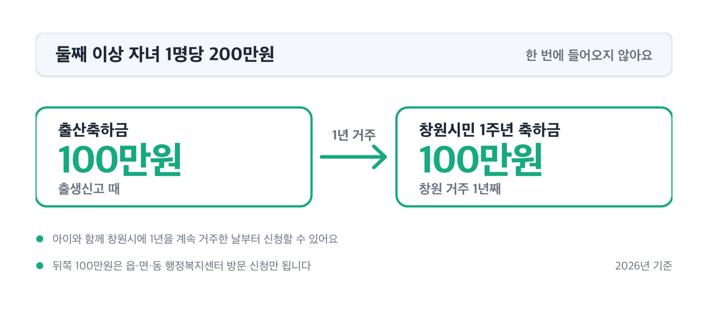
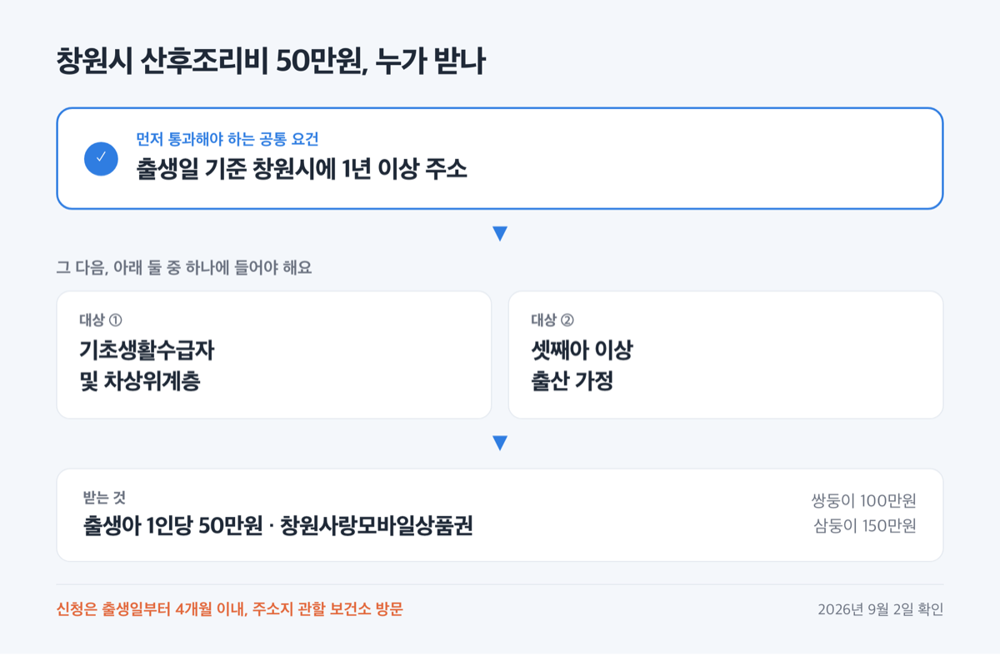
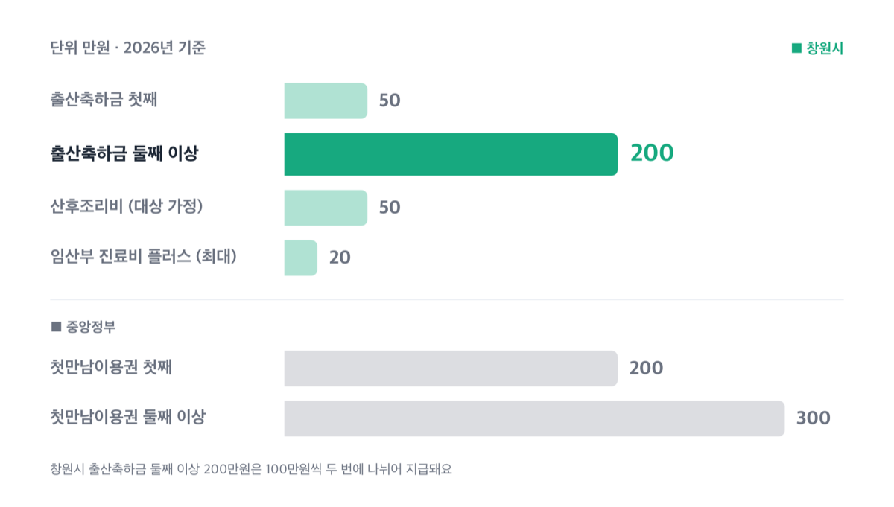
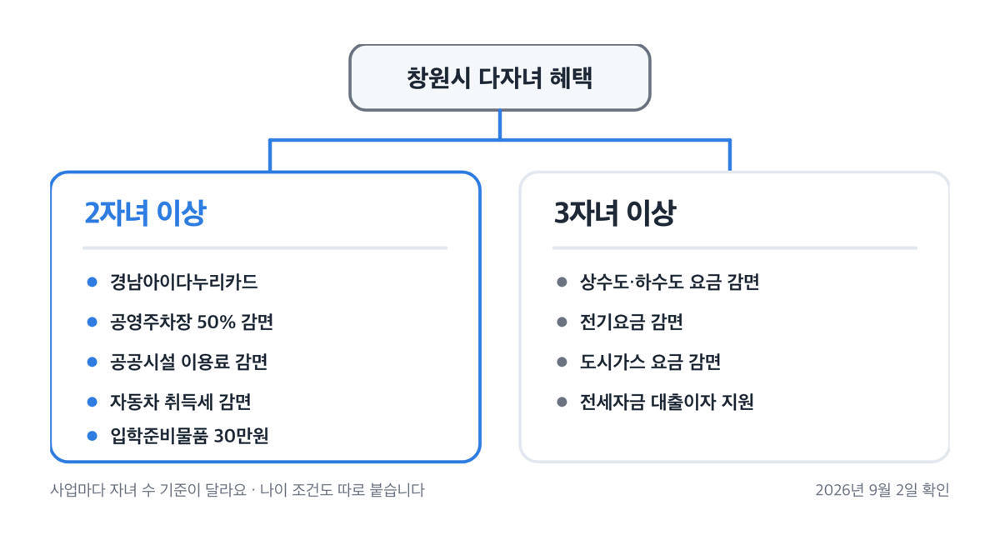
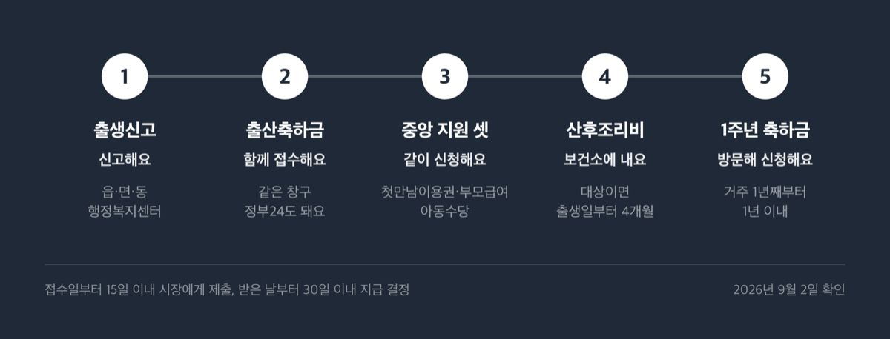
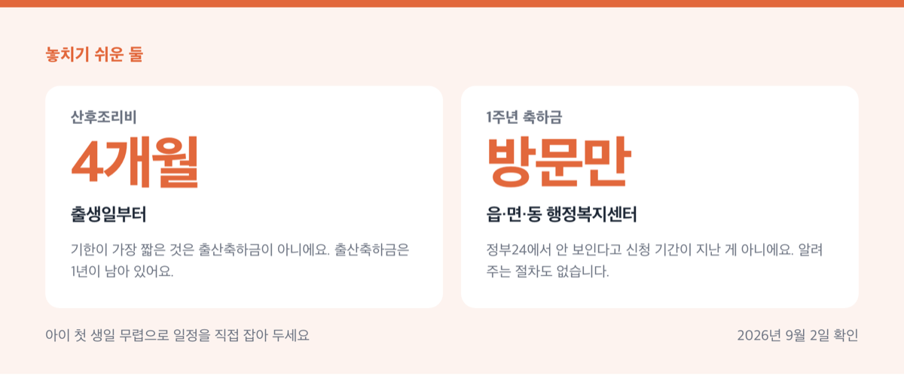

# 창원시 출산지원금 2026, 둘째 200만원 두 번에 받아요

📌 2026년 9월 2일 확인, 창원시 2026년 시책 기준

200만원이에요. 그런데 한 번에 들어오지 않아요. 100만원 받고, 1년을 더 살아야 남은 100만원이 나옵니다.

**3줄 요약**

- 창원시 출산축하금은 첫째 50만원, 둘째 이상은 자녀 1명당 200만원이에요.
- 200만원은 출생신고 때 100만원 + 창원 거주 1년째에 100만원으로 나뉘고, 뒤쪽 100만원은 온라인 신청이 안 됩니다.
- 첫 신청 기한은 출생신고일부터 1년, 산후조리비는 출생일부터 4개월이에요. 기한이 가장 짧은 것부터 처리하세요.

돈이 어디서 나오는지(창원시·경상남도·중앙정부), 얼마이고, 언제까지 신청해야 하는지를 한 번에 적었어요.

## 💰 출산축하금, 첫째 50만원 둘째부터 200만원

먼저 이름부터요. 창원시의 공식 명칭은 '출산장려금'이 아니라 **출산축하금**입니다. 창원시 출산장려 지원에 관한 조례에 그렇게 정의돼 있어서, 검색이나 문의할 때 이 이름을 쓰는 편이 빠릅니다.

| 자녀 순서 (창원시 출산축하금, 2026년) | 금액 |
|---|---|
| 첫째 | 50만원 (한 번에) |
| 둘째 이상 | 자녀 1명당 200만원 |
| 둘째 이상 지급 방식 | 출산축하금 100만원 + 창원시민 1주년 축하금 100만원 |

자녀 순서는 부모의 기억이 아니라 **가족관계등록부**로 정해져요. 「가족관계의 등록 등에 관한 법률」 제9조에 따른 등록부 기준이라, 이전 혼인에서 낳은 자녀나 등록부에 올라간 자녀가 모두 순서 계산에 들어갑니다.

왜 둘째 이상은 두 번에 나오는지는 뒤쪽 돈의 이름에 답이 있어요. 남은 100만원의 정식 이름이 '창원시민 1주년 축하금'이에요. 태어난 것에 주는 돈이 아니라 **아이와 함께 창원에서 1년을 더 살았을 때** 주는 돈이라, 1년 거주가 지급 조건이 됩니다.

> 😕 그럼 1년 안에 이사하면 뒤쪽 100만원은요?

1주년 축하금은 '자녀와 함께 창원시에 1년을 계속 거주한 날'부터 신청할 수 있어요. 그날이 오지 않으면 신청할 대상 자체가 생기지 않습니다. ==둘째 이상 200만원은 창원에 1년 더 산다는 전제가 붙은 금액이에요.==

## 누가 받고 언제까지 신청해야 하나

받는 사람은 자녀의 부 또는 모예요. 사망이나 이혼 등으로 부모 모두가 양육하지 못하면, 자녀와 함께 주민등록이 되어 있고 실제로 키우는 사람이 받습니다.

거주 요건이 핵심이에요. 세 줄로 정리하면 이렇습니다.

1. 자녀 출생신고를 하면서 주소지를 창원시로 등록해야 해요.
2. 부 또는 모가 **출생신고일 기준 3개월 전부터 신청일까지 계속** 창원시에 주민등록을 두고 살아야 해요.
3. 아직 3개월이 안 됐다면, 계속해서 3개월 이상 주민등록을 두고 거주하면 요건을 채운 것으로 봅니다.

창원으로 이사한 지 두 달 만에 아이를 낳았더라도 자격이 사라지지 않아요. 3개월을 채운 뒤 신청하면 됩니다. 국외에서 출산한 창원시 주민등록 가정도 같은 방식이에요. 입국 후 3개월 이상 거주하면 요건을 채웁니다.

| 기한 (창원시·경남 지원, 2026년 기준) | 언제까지 |
|---|---|
| 출산축하금 (첫 지급분) | 출생신고일부터 1년 이내 |
| 창원시민 1주년 축하금 | 1년 계속 거주한 날부터 1년 이내 |
| 산후조리비 지원 | 출생일부터 4개월 이내 |
| 임산부 진료비 플러스 | 분만일부터 6개월 이내 |
| 고위험 임산부 의료비 | 분만일부터 6개월 이내 |
| 산모·신생아 본인부담금 지원 | 서비스 종료 후 90일 이내 |

> [!WARNING]
> 기한이 가장 짧은 것은 출산축하금이 아니라 **산후조리비 4개월**입니다. 출생신고를 하러 간 날 산후조리비 대상인지도 같이 확인하는 편이 안전해요.

저라면 산후조리비를 출생신고와 같은 주에 처리합니다. 4개월은 신생아를 데리고 서류를 두 번 떼기에 짧은 기간이고, 출산축하금은 1년이 남아 있어 뒤로 미룰 여유가 있어요.

## 산후조리 지원 — 창원시 50만원은 조건이 붙어요

창원시 산후조리비 50만원은 모든 출산 가정에 주는 돈이 아니에요. 대상이 둘로 정해져 있습니다.

| 창원시 산후조리비 지원 (2026년) | 내용 |
|---|---|
| 대상 ① | 기초생활수급자 및 차상위계층 |
| 대상 ② | 셋째아 이상 출산 가정 |
| 공통 요건 | 출생일 기준 창원시에 1년 이상 주소 |
| 금액 | 출생아 1인당 50만원 (창원사랑모바일상품권) |
| 다태아 | 출생아 수만큼 배수 — 쌍둥이 100만원, 삼둥이 150만원 |
| 신청 | 출생일부터 4개월 이내, 주소지 관할 보건소 방문 |

현금이 아니라 **창원사랑모바일상품권**으로 나와요. 지역화폐로 지급하는 방식이라 쓸 수 있는 곳이 가맹점으로 한정됩니다.

준비물은 신분증과 주민등록등본(과거주소변동내역 포함) 1부예요. 등본에 주소 변동 내역을 넣어야 하는 이유는 1년 거주 요건을 그 서류로 확인하기 때문입니다. 해당자는 수급자증명서·차상위계층 확인서 또는 가족관계증명서(상세)를 함께 냅니다.

여기에 얹히는 게 둘 더 있어요.

- **임산부 진료비 플러스** — 신청일 기준 창원시 1년 이상 거주 임산부. 산부인과 진료비 영수증 합산액 중 국민행복카드 지원금(태아당 100만원)을 넘긴 금액에 대해 **최대 20만원** *(식대·제증명료·난임 시술비·산부인과 이외 진료는 빠져요)*
- **공공산후조리원 이용료 지원** — 밀양 공공산후조리원 이용료의 **70%**. 수급자·차상위, 다태아 또는 둘째 자녀 이상 출산 산모, 장애인 또는 그 배우자, 희귀난치성 질환 산모, 한부모가족 산모, 국가유공자·유족·가족 또는 그 배우자 *(예약은 온라인 추첨이에요)*

공공산후조리원은 돈보다 예약이 문턱이에요. 밀양공공산후조리원 누리집에서 출산예정일 3개월 전부터 매월 1~5일에 접수하고, 선정 인원은 감면 9명·일반 5명입니다. 대상 표기가 안내 페이지마다 조금씩 달라서, 예약 전에 관할 보건소에서 본인 해당 여부를 확인하세요.

경상남도가 얹어 주는 것도 있어요. 산모·신생아 건강관리 지원사업(가정방문 서비스)의 **본인부담금 90%를 최대 15일까지** 지원합니다. 신청일 기준 기준중위소득 180% 이하이고, 산모와 출산아의 주민등록 주소지가 경남 도내여야 해요. 15일을 넘겨 서비스를 쓰면 그 초과분은 보건소 지원 없는 순수 본인부담이 됩니다.

2026년 지원액은 유형과 일수로 달라져요. 단태아·첫째아 기준입니다.

| 유형 (단태아·첫째아, 2026년) | 표준 10일 / 연장 15일 지원액 |
|---|---|
| A-가-①형 (자격확인) | 269,100원 / 603,900원 |
| A-통합-①형 (중위 150% 이하) | 415,800원 / 803,700원 |
| A-라-①형 (150% 초과~180% 이하) | 630,000원 / 1,044,900원 |

신청은 서비스가 끝난 뒤 90일 이내, 주소지 관할 보건소 방문이에요. 서비스 자체의 신청 기간은 따로예요. **분만예정일 40일 전부터 출산일로부터 60일 이내**에 신청해야 합니다.

## 중앙 제도 — 첫만남이용권·부모급여·아동수당

여기서부터는 창원시가 만든 돈이 아니라 중앙정부 제도예요. 창구는 같은 행정복지센터라 섞이기 쉽지만, 금액이 바뀌는 이유도 문의처도 다릅니다.

| 중앙 현금성 지원 (2026년) | 금액 |
|---|---|
| 첫만남이용권 | 첫째 200만원 / 둘째 이상 300만원 |
| 부모급여 (0~11개월) | 월 100만원 (어린이집 이용 시 차액 41.6만원) |
| 부모급여 (12~23개월) | 월 50만원 (어린이집 이용 시 차액 없음) |
| 아동수당 | 월 10.5만원 (9세 미만) |
| 가정양육수당 | 월 10만~20만원 (24~86개월 미취학) |
| 임신·출산 진료비 바우처 | 임신 1회당 100만원, 다태아 기본 140만원 |

첫만남이용권은 출생일에 따라 적용이 달라요. **2024년 1월 1일 이후 출생 아동부터** 첫째 200만원·둘째 이상 300만원입니다. 국민행복카드 포인트로 들어오고, 사용 기간은 주민등록상 생년월일로부터 2년이에요. 유흥·사행·레저·성인용품·면세점 업종은 빠지고, 전자상거래상품권은 살 수 없습니다.

아동수당은 2026년에 값이 바뀐 항목이에요. 2026년 3월 20일 개정 아동수당법에 따라 지급 연령이 8세 미만에서 **9세 미만**으로 넓어졌고, 확대 지급은 **2026년 4월 24일**부터 시작됐습니다. 창원시 사업 기준으로 지원액은 월 10만원에서 **월 10.5만원**으로 올랐어요.

10.5만원은 전국 공통값이 아니에요. 5월 이후 월 지급액이 지역으로 나뉩니다. 수도권 10만원, 비수도권 10.5만원, 인구감소지역 우대지역 11만원, 특별지역 12만원이에요. 인구감소지역에서 지역사랑상품권으로 받으면 월 1만원 상당액이 더 붙어 우대지역 12만원·특별지역 13만원이 되는데, 이 상품권 추가 지원은 지방정부의 주민 의견 수렴과 조례 제·개정 절차를 거쳐 시행됩니다.

연령이 넓어지면서 소급분도 나갔어요. 2017년 1월~2018년 3월생 아동에게 2026년 1~3월분이 소급 지급됐고, 4월 지급 대상은 255만 명·총 3,892억원이었습니다. 창원시 2026년 아동수당 사업량은 42,170명이에요.

임신 단계 지원은 창원시 몫이 두껍습니다. 자주 찾는 것만 적어요.

1. **난임부부 시술비** — 체외수정 출산당 합산 최대 20회(신선 차수별 110만원, 동결 차수별 50만원), 인공수정 출산당 최대 5회(차수별 30만원)
2. **고위험 임산부 의료비** — 19대 고위험 임신 질환으로 입원 치료 시 전액 본인부담금과 비급여의 90%, 1인당 최대 300만원
3. **임신 사전건강관리** — 20~49세 남녀 중 희망자, 여성 13만원·남성 5만원
4. **미혼여성 난자냉동 시술비** — 28~40세, 난소기능검사 1.5ng/㎖ 이하이고 중위소득 180% 이하일 때 본인부담금의 50%, 최대 200만원

4번과 정관·난관 복원시술비(100만원 한도)는 **시술 전에 반드시 신청**해야 하고, 예산 소진 시까지만 지원합니다. 시술을 먼저 받고 나중에 청구하는 방식이 아니에요. 난자냉동은 신청 후 지원자격 결정통보를 받고 3개월 이내에 시술을 끝내야 청구할 수 있습니다.

## 다자녀 혜택, 기준이 2자녀와 3자녀로 나뉘어요

창원시 다자녀 혜택은 **사업마다 자녀 수 기준이 다릅니다.**

| 자녀 수 기준 | 해당 사업 |
|---|---|
| 2자녀 이상 | 경남아이다누리카드, 공영주차장 50% 감면, 공공시설 이용료 감면, 자동차 취득세 감면, 입학준비물품 30만원 |
| 3자녀 이상 | 상수도·하수도 요금 감면, 전기요금 감면, 도시가스 요금 감면, 전세자금 대출이자 지원 |

조례가 정한 다자녀가정은 '출산 또는 입양으로 둘 이상의 자녀를 실제로 양육하는 가정'이에요. 그래서 감면 계열은 2자녀에서 열리고, 요금 감면 계열은 3자녀로 좁아집니다. 나이 조건도 붙어요. 상하수도는 19세 미만 자녀 3명 이상, 공공시설 감면은 18세 이하 자녀 1명을 포함한 2명 이상입니다.

금액이 큰 것부터 짚으면 이래요.

- **자동차 취득세 감면** — 3자녀 이상은 6인승 승용차 100% 면제(140만원 상한), 2자녀는 50% 감면(70만원 상한) *(만 18세 미만 자녀 기준이에요)*
- **다자녀 학생 입학준비물품** — 두 자녀 이상 가정의 초·중·고 1학년 신입생 1인당 30만원 다자녀지원카드 포인트 *(재학 학교에 신청해요)*
- **전세자금 대출이자 지원** — 18세 이하 자녀 3명 이상, 기준중위소득 180% 이하 무주택 가구. 대출 잔액의 1.5% 이자, 연 1회 최대 100만원
- **요금 감면** — 상수도 매월 최대 10㎥, 하수도 매월 10톤, 전기 월 30%(월 16,000원 한도), 도시가스 12~3월 월 9,000원·4~11월 월 2,470원

공공시설 감면은 2023년 1월 1일부터 대상이 '18세 이하 자녀 1명 포함 2자녀 이상 가정의 부모와 그 자녀'로 하나로 정리됐어요. 적용 시설이 20곳입니다. 이순신리더십국제센터·창원과학체험관·마산문신미술관 관람료 면제, 장난감도서관 연회비 전액 감면, 체육시설·공영주차장 50%처럼 감면율이 시설별로 달라요.

전기요금은 자녀 수가 아니어도 열려요. 출생일로부터 3년 미만 영아 1인 이상을 포함한 출산가구도 월 30% 감면 대상입니다. 첫 아이만 있어도 해당된다는 뜻이에요.

## ✍️ 신청 순서와 자주 걸리는 것

출생신고를 기준으로 순서를 잡으면 헛걸음이 줄어요.

1. **출생신고** — 주소지 읍·면·동 행정복지센터에서 하고, 이때 주소지를 창원시로 등록해요.
2. **출산축하금 신청** — 같은 창구에서 함께 접수합니다. 온라인은 정부24로도 돼요.
3. **첫만남이용권·부모급여·아동수당** — 출생신고 때 같이 신청하는 게 가장 간단해요.
4. **산후조리비 (대상이면)** — 주소지 관할 보건소 방문. 출생일부터 4개월 이내입니다.
5. **창원시민 1주년 축하금** — 아이와 함께 1년을 계속 거주한 날부터 1년 이내에, **반드시 읍·면·동 행정복지센터 방문 신청**이에요.

돈이 들어오는 시점도 정해져 있어요. 읍면동장이 접수일부터 15일 이내에 시장에게 제출하고, 시장이 받은 날부터 30일 이내에 지급 여부를 결정해 계좌로 넣습니다. 신청한 주에 들어오는 돈이 아니라는 뜻이에요.

자주 걸리는 것 넷을 모았어요.

- **1주년 축하금은 온라인이 안 돼요.** 첫 출산축하금은 정부24로 되지만 1주년분은 방문만입니다. 정부24에서 안 보인다고 신청 기간이 지난 게 아니에요.
- **알림이 오지 않아요.** 1년 뒤를 알려 주는 절차가 조례에 없어요. 아이 첫 생일 무렵으로 직접 일정을 잡아 두는 편이 안전합니다.
- **'예산의 범위에서' 지급합니다.** 조례 제5조제1항이 그렇게 적고 있어요. 난자냉동·정관난관 복원처럼 예산 소진 시까지인 사업은 신청 전에 관할 보건소에 잔여 예산을 확인하세요.
- **전화번호가 안내물마다 달라요.** 시청 여성가족과 대표번호 ☎ 055-225-3985로 먼저 걸면 담당 구청으로 연결됩니다.

부정하게 받으면 되돌려줘야 해요. 허위·부정 수급이나 목적 외 사용이 확인되면 일부 또는 전부 반환 명령이 나올 수 있습니다.

교통 지원도 함께 챙길 만해요. 임산부와 출산 후 1년까지는 **교통약자 바우처택시**를 1인당 월 20만원 한도로 이용할 수 있어요. 경남특별 교통수단 앱이나 콜센터 608-8000으로 부르고, 회원등록은 읍·면·동 행정복지센터 방문입니다. 공영주차장은 임산부(임신 중이거나 분만 후 6개월 미만) 탑승 차량이면 주차요금 50% 감면이고, 산모수첩 같은 증빙과 신분증이 필요해요.

## 창원시 출산지원금 관련 궁금증 해결

**Q. 창원으로 이사한 지 두 달인데 출산축하금을 받을 수 있나요?**

A. 받을 수 있어요. 계속해서 3개월 이상 창원시에 주민등록을 두고 거주하면 요건을 채운 것으로 봅니다. 3개월이 되는 시점 이후에 신청하세요.

**Q. 둘째 200만원을 한 번에 받는 방법이 있나요?**

A. 없습니다. 출산축하금 100만원과 창원시민 1주년 축하금 100만원으로 두 차례 균등 분할 지급이에요. 뒤쪽 100만원은 아이와 함께 창원에서 1년을 살아야 신청 대상이 됩니다.

**Q. 산후조리비 50만원은 둘째를 낳아도 받나요?**

A. 셋째아 이상이거나 기초생활수급자·차상위계층일 때 받아요. 둘째만으로는 대상이 아니에요. 대신 둘째 이상 출산 산모는 밀양 공공산후조리원 이용료 70% 지원 대상에 들어갑니다.

**Q. 아동수당이 10.5만원이라는데 우리 아이는 다르게 들어와요.**

A. 지역에 따라 다릅니다. 수도권 10만원, 비수도권 10.5만원, 인구감소지역은 11만~12만원이에요. 지급액이 안내와 다르면 아동청소년과 ☎ 055-225-4186으로 확인하세요.

**Q. 첫만남이용권을 현금으로 받을 수 있나요?**

A. 안 돼요. 국민행복카드 포인트로 지급되고 사용 기간은 출생일로부터 2년이에요. 전자상거래상품권 구매도 막혀 있습니다.

## 마지막으로 정리하면

창원시에서 아이를 낳으면 출산축하금·산후조리비·임산부 진료비 플러스처럼 **거주 기간을 따지는 시 지원**과, 첫만남이용권·부모급여·아동수당처럼 **어디 살든 같은 중앙 지원**을 함께 받아요. 앞쪽은 3개월·1년 같은 거주 요건에서 걸리고, 뒤쪽은 출생일과 시행일에서 걸립니다.

기한만 다시 짚습니다. 산후조리비 4개월, 진료비 플러스와 고위험 임산부 의료비 6개월, 출산축하금 1년, 1주년 축하금은 1년 거주한 날부터 1년이에요.

지원금은 예산과 조례에 따라 바뀌고, 창원시 안내 책자는 매년 초에 새로 나옵니다. 본인 자격과 잔여 예산은 주소지 읍·면·동 행정복지센터, 보건 사업은 관할 보건소(창원 225-5783 · 마산 225-5946 · 진해 225-6492)에서 확인하세요.

참고: 창원특례시 「2026 창원 결혼·출산·육아 정책가이드」 · 창원시 출산장려 지원에 관한 조례(경상남도창원시조례 제1972호) · 창원시 「2026년 달라지는 시책」 · 창원시 분야별정보 출산축하금지급·첫만남이용권·각종출생장려시책현황·산후조리비용 지원·산모신생아건강관리 지원확대 · 보건복지부 「아동수당 대상·금액 확대, 4월부터 지급 시작」(2026.4.24.) · 보건복지부 임신·출산 진료비 지원사업 · 정부24 창원시 출산축하금 안내
