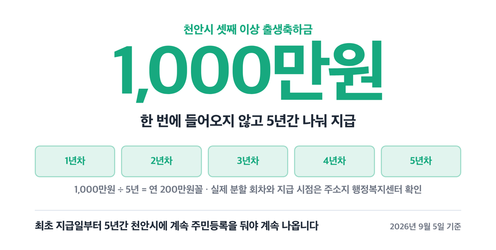
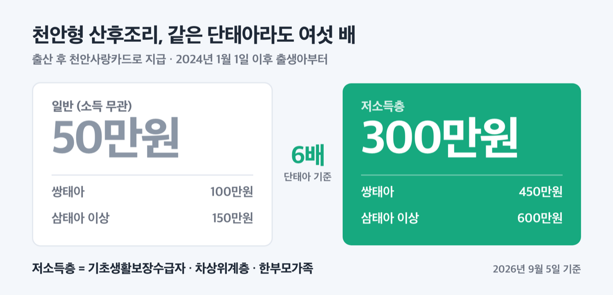
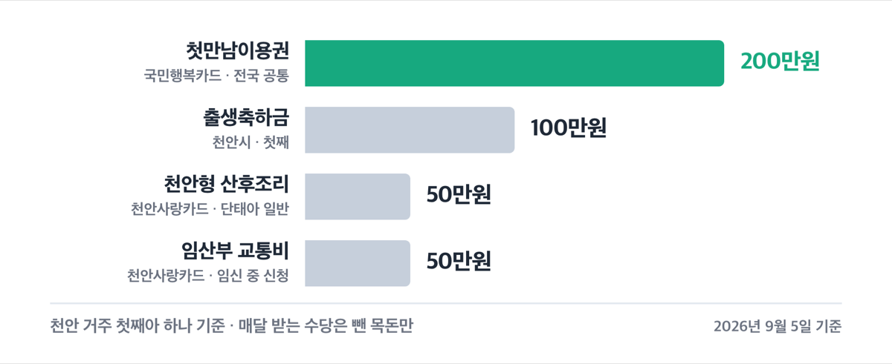
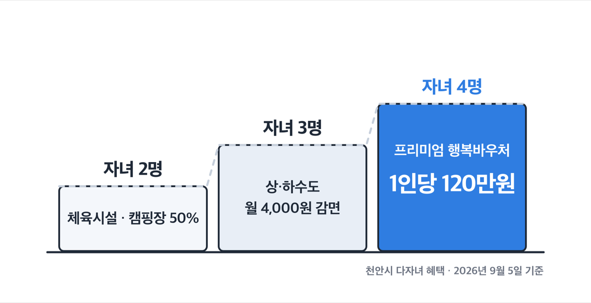
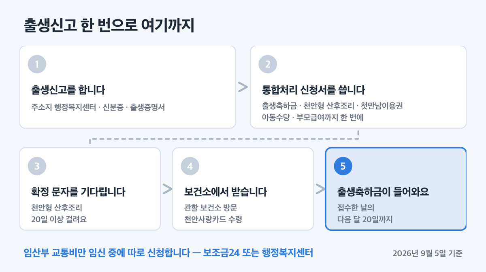
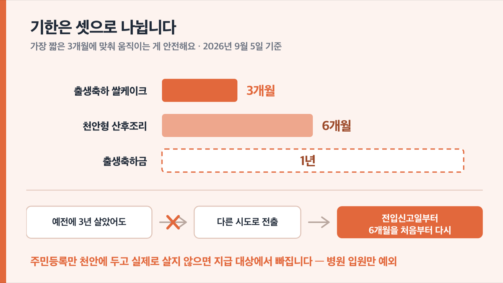

# '셋째 1000만원' 천안시 출산지원금 2026, 신청 기한이 달라요

📌 2026년 9월 5일 기준

천안시 출산지원금이 첫째 100만원이라고만 알려져 있는데, 받을 수 있는 돈은 그것만이 아니에요. 산후조리로 50만원이 더 나오고 임신 중에도 50만원이 나옵니다. 대신 항목마다 신청 기한이 따로 있고, 짧은 건 3개월이에요.

**3줄 요약**

1. 천안시 출생축하금은 첫째·둘째 각 100만원, 셋째 이상 1000만원이에요. 여기에 천안형 산후조리 50만원과 임산부 교통비 50만원이 따로 붙어요.
2. 2025년 12월 22일 조례 개정으로 출생축하금 금액이 지금 기준이 됐고, 아동수당은 2026년 5월분부터 비수도권 월 10만 5천원으로 올랐어요.
3. 먼저 확인할 것은 거주 기간입니다. 대부분 "6개월 이상 계속 거주"를 요구하고, 이 기간은 다른 지역에 살다 오면 합산되지 않아요.

천안시가 자체로 주는 돈부터 전국 공통 제도까지, 금액과 기한과 신청처를 한 번에 적었어요.

---

## 💰 천안시 출산지원금, 첫째 100만원 셋째 1000만원

천안시의 출생축하금은 자녀 순서에 따라 셋으로 나뉩니다. 근거는 「천안시 출산장려 및 입양가정 지원에 관한 조례」 제5조예요.

| 자녀 순서 | 출생축하금 (2026년 기준) |
|---|---|
| 첫째 | 100만원 |
| 둘째 | 100만원 |
| 셋째 이상 | 1,000만원 *(5년간 나눠 지급)* |

셋째 이상 1000만원은 한 번에 들어오는 돈이 아니에요. 최초 지급일부터 5년간 계속 천안시에 주민등록을 두고 살아야 계속 나옵니다. 조례에 연 단위 금액은 적혀 있지 않은데, 1000만원을 5년으로 나누면 연 200만원꼴이에요. 실제 분할 회차와 지급 시점은 주소지 행정복지센터에서 확인하세요.

> 🤭 **솔직히 말하면** — 1000만원이라는 숫자만 보고 이사를 결정하기엔 조건이 무거워요. 5년 사이에 직장 문제로 옮기면 남은 금액은 끊깁니다.

물론 1000만원은 큰돈이에요. 그런데 그 돈을 다 받으려면 ==5년간 계속 거주==라는 조건이 붙는다는 걸 같이 봐야 해요.

**거주 요건**을 채우는 건 영아의 출생월 기준 6개월 전부터 신청일까지 계속 천안시에 주민등록을 두고 사는 가정입니다. 출생 시점에 6개월이 안 됐어도 포기할 일은 아니에요. 천안시 거주 기간이 6개월을 넘기면 그때 신청할 수 있습니다.

> 😕 저는 천안 온 지 3개월밖에 안 됐는데요?

전입일부터 6개월이 지난 시점에 신청하면 됩니다. 다만 그 사이 출생 후 1년이 지나 버리면 그때는 방법이 없어요. 3개월 차에 아이가 태어났다면 6개월을 채우자마자 바로 접수하는 게 안전합니다.

신청 기한은 ==영아의 출생 후 1년 이내==예요. 이 기한은 시청 가이드북이 아니라 조례에 적혀 있습니다. 신청서를 접수한 다음 달 20일까지 지급돼요.

주민등록만 옮겨 두고 실제로 살지 않으면 지급하지 않습니다. 병원 입원은 예외예요.

재혼 가정은 부 또는 모의 자녀가 주민등록상 같은 세대에 올라 있을 때만 자녀 순서에 포함돼요. 부모가 사망하거나 이혼했거나 직업상 함께 살 수 없는 경우, 미혼부·미혼모 가정은 부모 중 한 명과 주민등록을 함께 두고 살면 대상이 됩니다.

**입양 가정**은 입양아동 1명당 300만원, 장애아동은 500만원이에요. 입양신고 후 1년 이내에 신청해야 하고, 출생축하금과 중복해서 받을 수는 없습니다.

---

## 임신 중에 받는 돈 — 교통비 50만원, 검진비 12만원

출산 뒤에만 돈이 나온다고 생각하기 쉬운데, 천안시는 임신 기간에도 지원이 붙어요. 액수가 가장 큰 건 임산부 교통비입니다.

| 지원 | 금액 |
|---|---|
| 임산부 교통비 | 1인당 50만원 |
| 첫아이 맞이 예비맘 종합건강검진 | 12만원 *(자궁경부암 검진 대상자는 10만원)* |
| 임신 사전건강관리 | 여성 13만원 · 남성 5만원 |
| 고위험 임산부 의료비 | 본인부담금의 90%, 300만원 한도 |
| 여성장애인 출산지원금 | 심한 장애 150만원 · 심하지 않은 장애 120만원 |

**임산부 교통비 50만원**은 천안사랑카드 바우처로 나와요. 대상은 임신 12주 이상부터 출산 후 3개월 이내이면서, 신청일 현재 6개월 이상 계속 천안시에 주민등록을 두고 사는 임산부입니다. 별도 접수 기간이 없어서 그 구간 안이면 언제든 신청하면 돼요.

금액이 30만원에서 50만원으로 오른 건 2025년 8월 1일 조례 공포일부터입니다. 공포일 이전에 신청한 사람은 소급해서 차액을 받지 못해요. 왜 그런가 하면, 이 조례 부칙에 경과조치가 따로 없어서 신청 시점을 기준으로 금액이 정해지기 때문입니다.

쓸 수 있는 곳은 택시비와 자가용 유류비(천안사랑카드 가맹점 주유소·LPG 충전소)예요. 천안시 안에서만 쓸 수 있고, 사용 기간은 바우처 지급일부터 1년입니다. 신청은 온라인으로 보조금24(gov.kr)에서 하거나 관할 읍·면·동 행정복지센터에 방문하면 돼요.

한 가지 유용한 점이 있어요. 임산부 교통비 천안사랑카드는 정책 수당이라 연 매출 30억원을 넘는 가맹점에서도 결제됩니다.

**난임 지원**도 함께 봐 두면 좋아요. 체외수정은 신선배아 최대 110만원, 동결배아 최대 50만원이고 인공수정은 최대 30만원입니다. 2024년부터 소득 기준이 없어졌고, 2024년 11월 1일부터는 지원 횟수를 난임 부부 단위가 아니라 출산 1회 단위로 셉니다. 한방 첩약비는 연 1회, 여성 최대 150만원·남성 최대 100만원입니다.

임산부는 천안시 관내 공영주차장 요금을 100% 감면받아요. 여기서 말하는 임산부는 임신 중이거나 분만 후 6개월 미만인 여성입니다.

그런데 여기서 자주 걸리는 게 있어요. 사업마다 "임산부"의 범위가 달라요.

---

## 천안형 산후조리 50만원, 저소득층은 300만원

「행복 출산을 함께하는 천안형 산후조리」는 출산 후 천안사랑카드로 지급되는 지원이에요. 소득과 관계없이 나오는 일반 금액과, 저소득층에게만 나오는 금액이 따로 있습니다.

| 태아 수 | 일반 (소득 무관) | 저소득층 |
|---|---|---|
| 단태아 | 50만원 | 300만원 |
| 쌍태아 | 100만원 | 450만원 |
| 삼태아 이상 | 150만원 | 600만원 |

여기서 저소득층은 기초생활보장수급자·차상위계층·한부모가족을 말해요. 단태아 기준으로 여섯 배 차이가 납니다.

대상은 아기 출생일 기준 6개월 전부터 천안시에 주민등록을 둔 부 또는 모이고, 신청일 현재까지 천안시에 주민등록이 있어야 해요. 출생아가 천안시에 출생 등록돼야 하고, 2024년 1월 1일 이후 출생아부터 적용됩니다. 부부 중 한 명은 한국 국적(결혼 이민자 포함)이어야 하고, 거주 6개월 요건에서 예외로 인정되는 건 군인 가족이에요.

신청 기한은 ==아기 출생일 기준 6개월 이내==입니다. 출생축하금(1년)보다 절반 짧아요. 산후조리 비용이 실제로 나가는 시기에 맞춰 잡은 기준이라 그렇습니다. 그래서 출생축하금 기한만 기억하고 있으면 이쪽을 통째로 놓칩니다.

절차에 시간이 걸린다는 것도 알고 계셔야 해요. 신청하고 대상자 확정 문자를 받기까지 20일 이상 걸리고, 문자를 받은 뒤에야 관할 보건소에 가서 천안사랑카드를 받을 수 있습니다.

카드는 천안사랑카드 가맹점 중 의생활·식생활·유통·주유·택시·의료미용·서비스·레포츠 업종에서 쓸 수 있어요. **산후조리원과 조산원도 포함**됩니다. 천안시 안에서만 결제되고 캐시백은 빠져요.

**산모·신생아 건강관리 서비스**는 정부 바우처와 천안시 환급이 겹쳐 있어요. 2026년 서비스 가격은 단태아 146,400원, 쌍태아는 인력 1명 183,000원·인력 2명 284,800원입니다. 신청은 출산예정일 40일 전부터 출산일 이후 60일까지 하고, 바우처 유효기간은 출산일부터 90일 이내예요.

여기서 낸 본인부담금은 천안시가 90%, 상한 40만원까지 돌려줘요. 출산일 기준 충남 도내 6개월 이상 거주에 기준중위소득 150% 이하면 되고, 둘째아 이상은 소득 기준이 없습니다. 환급 신청은 서비스 이용이 끝난 다음날부터 6개월 이내예요.

두 자녀 이상을 출산한 산모라면 **다자녀 맘 산후건강관리**도 있어요. 연 1회, 1인당 최대 20만원까지 산후 진료비·약제비·치료재료비 본인부담금을 지원합니다. 다만 국민행복카드 임신·출산 진료비를 0원으로 다 쓴 뒤에 발생한 진료비만 인정되고, 충청남도 안에 있는 의료기관에서 받은 진료여야 해요. 출산일 기준 1년 이내에 진료받고 신청하면 됩니다.

---

## 아이 키우는 동안 매달 — 아동수당은 10만 5천원입니다

아이가 태어나면 매달 통장에 들어오는 돈이 셋 있어요. 아동수당, 부모급여, 그리고 충남에만 있는 행복키움수당입니다.

| 수당 | 금액 (월) | 대상 연령 |
|---|---|---|
| 아동수당 | 10만 5천원 | 0~108개월 미만 |
| 부모급여 | 100만원 | 0세 (0~11개월) |
| 부모급여 | 50만원 | 1세 (12~23개월) |
| 행복키움수당 | 10만원 | 24~36개월 미만 |
| 가정양육수당 | 10만원 | 24~86개월 미만 |

**아동수당 금액이 2026년 5월분부터 바뀌었어요.** 2026년 3월 20일 개정된 아동수당법에 따라 사는 지역별로 금액이 나뉩니다. 수도권은 월 10만원, 비수도권은 월 10만 5천원, 인구감소지역은 월 11만원이에요.

천안시는 행정안전부가 지정한 인구감소지역 89곳에 들어 있지 않아요. 충남에서 지정된 곳은 공주시·금산군·논산시·보령시·부여군·서천군·예산군·청양군·태안군 아홉 곳입니다. 그래서 천안시는 비수도권 구간, ==월 10만 5천원==이에요.

> [!WARNING]
> 천안시청 안내 가이드북에는 아동수당이 아직 **월 10만원**으로 적혀 있어요. 개정 아동수당법 시행 전에 만든 안내라 그렇습니다. 금액 기준은 보건복지부가 2026년 4월 발표한 지역별 금액이 앞섭니다.

아동수당은 매월 25일에 통장으로 들어와요.

**부모급여**는 0세 월 100만원, 1세 월 50만원이고 2022년 이후 출생아부터 최대 24개월 받습니다. 어린이집에 다니면 현금이 아니라 보육료로 처리돼요. 0세반은 보육료 58만 4천원이 나가고 차액 41만 6천원만 현금으로 들어옵니다. 1세반은 보육료 51만 5천원이 나가고 현금은 없어요.

**행복키움수당** 월 10만원은 충남도 안에 주민등록을 두고 실제로 사는, 24~36개월 미만 자녀를 키우는 가정이 대상이에요. 신청한 달부터 매월 20일에 입금됩니다. 부모급여가 24개월에서 끊기는 바로 그 지점을 이어 주는 수당이라, 부모급여 마지막 달에 바로 신청해 두는 게 좋아요.

여기에 출생 직후 **첫만남이용권**이 국민행복카드로 나와요. 첫째아 200만원, 둘째아 이상 300만원입니다.

첫째아 기준으로 천안시가 자체로 주는 현금성 지원만 더하면 출생축하금 100만원에 천안형 산후조리 50만원, 최대 150만원이에요. 저소득층 단태아라면 100만원에 300만원을 더해 400만원이 됩니다. 여기 임산부 교통비 50만원은 임신 중에 따로 신청하는 것이라 뺐어요.

---

## 자녀가 셋, 넷이면 달라지는 것

천안시 다자녀 혜택은 자녀 수 기준선이 항목마다 달라요. 이 부분에서 헛걸음하는 경우가 많습니다.

| 자녀 수 | 받을 수 있는 것 |
|---|---|
| 2자녀 이상 | 공용주차장 감면, 체육시설 50%, 캠핑장 50%, 장난감도서관 무료 |
| 3자녀 이상 | 상·하수도 월 4,000원 감면, 전기·도시가스 감면 |
| 4자녀 이상 | 프리미엄 행복바우처 1인당 120만원 |

가장 큰 금액인 **프리미엄 행복바우처**는 네자녀 이상 가정만 대상이에요. 세자녀는 해당하지 않습니다. 초·중·고 입학연령(7세·13세·16세)에 도달하는 자녀 1인당 120만원을 천안시 지역화폐로 줘요. 연령별로 한 차례씩만 나오고, 2026년 대상자는 2026년 1월 2일부터 12월 31일까지 신청하면 됩니다.

보호자와 대상 자녀가 모두 신청일 현재 6개월 이상 계속 천안시에 주민등록을 두고 살아야 하고, 재혼 가정은 주민등록이 같고 실제로 함께 생활하는 자녀 수만 인정돼요.

**셋째 자녀 이상 상·하수도 요금 감면**은 상수도 2,000원과 하수도 2,000원을 합쳐 월 4,000원이에요. 세대별 주민등록표에 자녀가 3명 이상 올라 있고 그중 18세 이하가 한 명이라도 있으면 됩니다.

생활 감면은 두 자녀부터 시작해요. 공용주차장은 2시간 무료 뒤 50% 감면, 종합체육시설과 국민여가캠핑장은 50% 감면, 태학산자연휴양림은 40% 감면입니다. 육아종합지원센터 장난감도서관(차암·청룡·불당점)은 두 자녀 이상이면 연회비가 무료예요. 체육시설은 중복 할인이 안 되고 할인율이 높은 쪽 하나만 적용됩니다.

충청남도가 발급하는 **다자녀 행복키움카드**도 있어요. 충남 거주 만 18세 이하 두 자녀 이상 가구가 NH농협은행에서 발급받으면 가맹점별로 5%에서 30%까지 할인받습니다.

전국 공통으로는 자동차 취득세 감면이 큽니다. 세 자녀는 6인승 이하 승용차 140만원 한도로 100% 감면, 두 자녀는 70만원 한도로 50% 감면이에요. 만 18세 미만 자녀 두 명 이상, 1대에 한합니다.

---

## 신청 순서 — 행정복지센터 한 곳에서 시작합니다

천안시 지원은 대부분 출생신고를 할 때 한 번에 신청할 수 있어요. 읍·면·동장이 출생신고서를 받으면서 대상 여부를 확인하고 「출산 서비스 통합처리 신청서」로 신청하게 하는 구조예요. 창구를 여러 번 돌지 않아도 되게 묶어 둔 겁니다.

1. **출생신고**를 하러 주소지 행정복지센터에 갑니다. 신분증과 출생증명서를 챙기세요.
2. 창구에서 **「출산 서비스 통합처리 신청서」**를 씁니다. 출생축하금, 천안형 산후조리, 첫만남이용권, 아동수당, 부모급여를 여기서 함께 접수해요.
3. **천안형 산후조리 대상자 확정 문자**를 기다립니다. 20일 이상 걸려요.
4. 문자를 받으면 **관할 보건소에 방문**해 천안사랑카드를 받습니다.
5. **출생축하금**은 신청서를 접수한 날의 다음 달 20일까지 입금돼요.
6. 임산부 교통비는 임신 중에 **따로** 신청합니다. 보조금24(gov.kr) 온라인 또는 행정복지센터 방문이에요.

출생축하금 문의는 주소지 행정복지센터 주민복지팀이나 천안시 여성가족과(041-521-5374)로 하시면 됩니다. 산후조리 관련은 관할 보건소 영유아모성팀으로 문의하세요.

### 자주 놓치는 것 넷

첫째, **기한이 항목마다 다릅니다.** 출생축하금은 출생 후 1년, 천안형 산후조리는 출생일부터 6개월, 출생축하 쌀케이크는 출생일부터 3개월이에요. 가장 짧은 것에 맞춰 움직이는 게 안전합니다.

| 지원 | 신청 기한 |
|---|---|
| 출생축하 쌀케이크 | 출생일부터 3개월 |
| 천안형 산후조리 | 출생일부터 6개월 |
| 출생축하금 | 출생 후 1년 |

둘째, **거주 기간은 합산되지 않아요.** 천안에 살다가 다른 시도로 갔다가 돌아왔다면, 전입신고일부터 6개월을 처음부터 다시 채워야 합니다. 예전에 3년을 살았어도 이어 붙여 주지 않아요.

셋째, **인상된 금액은 소급되지 않습니다.** 임산부 교통비는 2025년 8월 1일 조례 공포일 이전에 신청한 사람에게 차액을 주지 않는다고 천안시가 못을 박았어요. 신청 시점이 곧 금액입니다.

넷째, **셋째 이상 1000만원은 거주가 끊기면 함께 끊깁니다.** 최초 지급일부터 5년간 계속 천안시에 주민등록을 두고 살아야 해요. 저라면 5년 안에 이사 계획이 있는 경우, 이 돈을 다 받는다고 가정하고 가계를 짜지는 않겠습니다.

> [!WARNING]
> 주민등록만 천안에 두고 실제로는 다른 곳에서 살면 지급 대상에서 빠집니다. 병원 입원만 예외로 인정됩니다.

---

## 천안시 출산지원금 관련 궁금증 해결

**Q1. 천안으로 이사 온 지 3개월인데 아이가 태어났어요. 출생축하금 못 받나요?**

A. 받을 수 있어요. 출생월 기준 거주 기간이 6개월이 안 돼도, 천안시 거주 기간이 6개월을 넘기는 시점에 신청하면 됩니다. 다만 출생 후 1년이라는 기한 안에 신청해야 해요.

**Q2. 셋째 1000만원은 한 번에 들어오나요?**

A. 아니에요. 5년간 나눠서 지급합니다. 최초 지급일부터 5년간 계속 천안시에 주민등록을 두고 살아야 계속 나와요. 회차별 지급 시점은 주소지 행정복지센터에서 확인하세요.

**Q3. 천안형 산후조리 카드로 산후조리원 비용을 낼 수 있나요?**

A. 됩니다. 천안사랑카드 가맹점 중 산후조리원과 조산원이 사용처에 들어 있어요. 다만 천안시 안에서만 결제되고, 카드를 받으려면 대상자 확정 문자부터 기다려야 합니다.

**Q4. 임산부 교통비를 예전에 30만원 받았는데 차액 20만원을 더 받을 수 있나요?**

A. 받을 수 없어요. 2025년 8월 1일 조례 공포일 이전에 신청한 건은 소급 적용되지 않는다고 천안시가 밝혔습니다.

**Q5. 천안 아동수당은 10만원인가요, 10만 5천원인가요?**

A. 2026년 5월분부터 10만 5천원입니다. 천안시는 비수도권이면서 인구감소지역이 아니어서 비수도권 구간을 적용받아요. 시청 가이드북에는 아직 10만원으로 적혀 있는데, 그건 법 개정 전에 만든 안내예요.

---

천안시 지원을 다 더하면 첫째아 하나에 자체 지원만 최대 150만원, 저소득 단태아 가정은 400만원까지 나옵니다. 여기에 첫만남이용권 200만원과 부모급여 24개월치가 별도로 붙어요. 금액은 적지 않은데, 정작 못 받는 이유는 소득이나 자격이 아니라 기한을 넘겨서인 경우가 많아요.

제가 이 자료를 다 훑고 나서 가장 주의해야 한다고 본 건 출생축하 쌀케이크의 3개월도, 산후조리의 6개월도 아니었어요. **거주 6개월이 합산되지 않는다**는 조건입니다. 친정에 잠시 주소를 옮겼다가 돌아오는 흔한 선택 하나로 여러 지원이 한꺼번에 초기화되거든요. 출산 전후로 주소를 옮길 일이 있다면 그 전에 행정복지센터에 한 번 물어보시길 권합니다.

여러 사업이 조례상 "예산의 범위에서" 지원하도록 돼 있어요. 신청 가능 여부와 잔여 예산은 주소지 행정복지센터(주민복지팀)와 관할 보건소 영유아모성팀에서 확인하세요.

참고: 천안시청 「임신·출산 지원」 가이드북 · 천안시 출산장려 및 입양가정 지원에 관한 조례 · 천안시 서북구보건소 안내 · 보건복지부 「아동수당 대상·금액 확대」 보도자료 · 행정안전부 인구감소지역 지정
