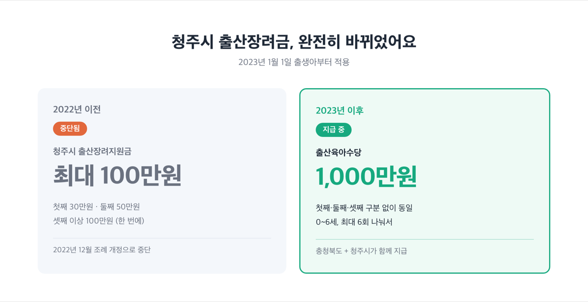
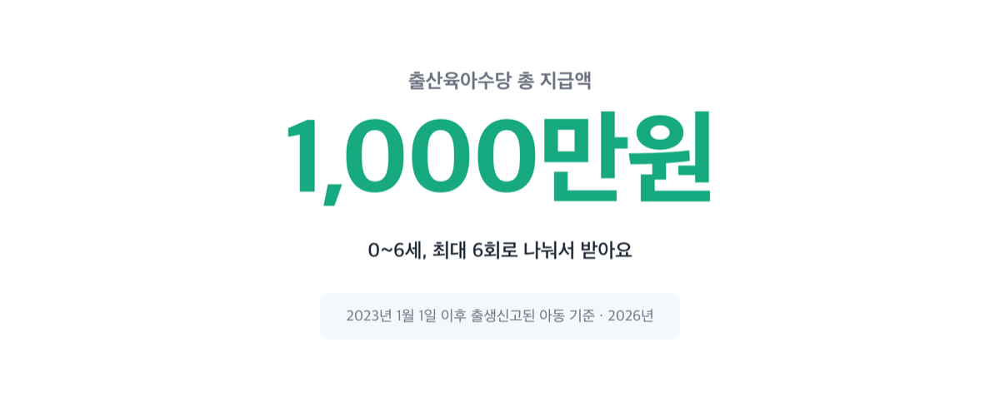
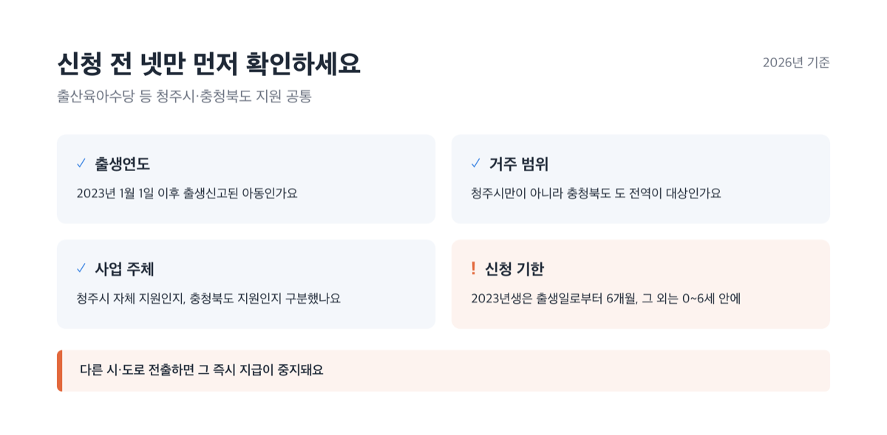
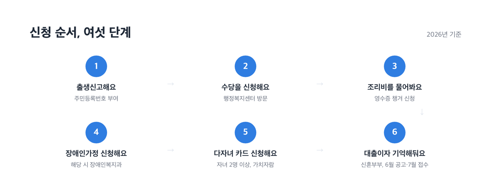
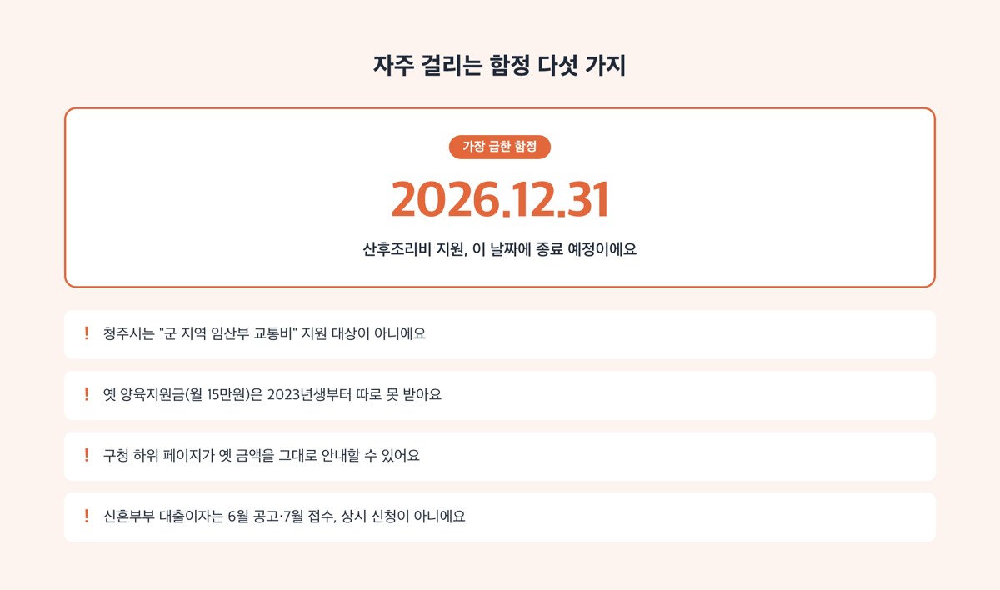
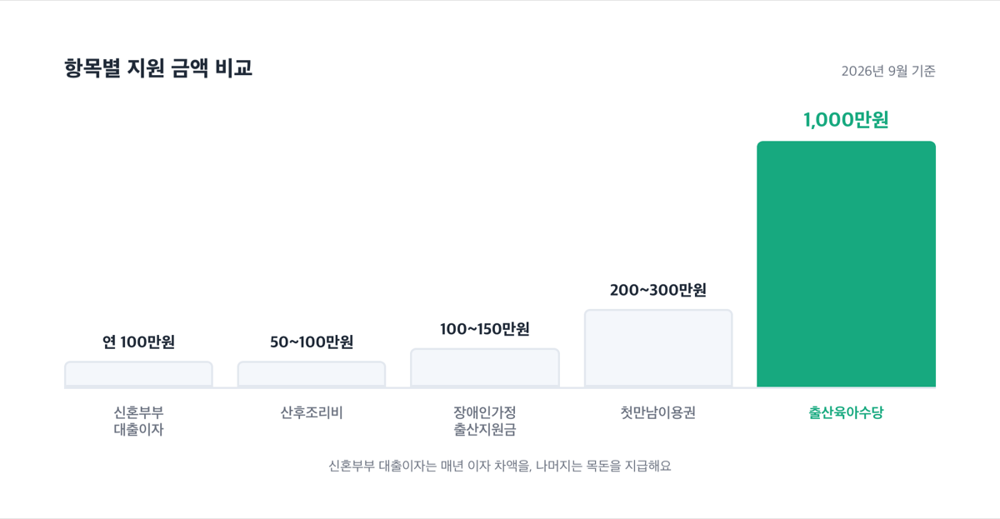

# 청주시 출산지원금 2026, 최대 1000만원 받는 법

📌 2026년 9월 1일 기준

청주시 출산장려금을 검색하면 아직도 "1자녀 30만원, 2자녀 50만원, 3자녀 이상 100만원"이라는 숫자가 나와요. 그런데 이 제도는 2022년 12월에 이미 끊겼습니다. 지금 청주에서 아이를 낳으면 받는 진짜 돈은 이름부터 다릅니다.

**3줄 요약**
- 청주시 자체 출산장려금은 없고, 지금은 충청북도와 청주시가 함께 주는 출산육아수당(1인당 1000만원, 0~6세 분할)이 핵심이에요.
- 2023년 1월 1일 이후 태어난 아이부터 이 방식으로 바뀌었고, 옛 양육지원금(월 15만원)은 이 수당과 중복으로 받지 못해요.
- 신청 전에 내 주민등록이 충청북도 안에 있는지, 이 지원이 청주시 자체 사업인지 도 사업인지부터 확인하세요.

이 글에서는 청주시가 직접 주는 지원과 충청북도가 주는 지원을 나눠서, 얼마를 언제까지 어디서 신청하는지 정리했습니다.

> [!WARNING]
> 청주시 구청 홈페이지 일부 하위 페이지는 2014~2015년 무렵 옛 제도를 그대로 안내하고 있어요. "청주시 출산장려지원금"이라는 이름이 보이면 최신 정보인지 꼭 다시 확인하세요.

## 청주시 출산장려금은 이미 끊겼어요 — 지금 받는 진짜 지원금

"청주시 출산장려지원금"이라고 불리던 제도, 그러니까 첫째 30만원·둘째 50만원·셋째 이상 100만원 하던 그 목돈은 2022년 12월 23일 조례 개정으로 지원이 중단됐습니다. 조례 개정이유에는 이렇게 적혀 있어요.

> "국가차원의 출산장려금인 첫만남이용권 사업의 시행으로 청주시 출산장려지원금 지원은 중단하고 … 셋째아 이상 양육지원금은 지속지원"

왜 중단됐을까요. 국가가 첫만남이용권으로 비슷한 성격의 돈을 전국에 주기 시작하면서, 청주시가 자체 예산으로 같은 돈을 중복해서 줄 이유가 없어졌기 때문이에요.

셋째 이상 자녀에게 주던 양육지원금(월 15만원, 출생 후 60개월까지)은 조문이 아직 남아 있습니다. 다만 시행규칙에 "2023년 1월 1일 이후 출생아에게 출산육아수당이 지급되는 경우 양육지원금을 중복 지급하지 않는다"는 단서가 붙었어요. 조문 하나만 보면 두 제도가 따로 있는 것처럼 보이지만, 실제로는 2023년생부터 아래 출산육아수당으로 넘어갔다고 보면 됩니다.

> 😕 그럼 저는 청주시에서 아무 목돈도 못 받는 건가요?

아니에요. 이름과 액수가 바뀌었을 뿐이에요. 2023년 이후 태어난 아이라면 출생순위와 상관없이 총 1000만원짜리 출산육아수당을 받습니다. 지금부터 이 돈이 핵심입니다.

## 출산육아수당 — 얼마를, 누가, 언제까지 받나

법적 근거는 두 겹입니다. 충청북도 조례가 "지급할 수 있다"는 근거를 만들고, 실제 금액과 지급 회차는 충청북도가 따로 만든 지급 지침이 정합니다. 조례는 큰 틀만 정하고 세부 금액은 예산 상황에 맞춰 지침으로 조정할 수 있게 열어둔 구조라 그렇습니다.

| 항목 | 2026년 기준 내용 |
|---|---|
| 총 지급액 | 1인당 1000만원 (첫째・둘째・셋째 구분 없이 동일) |
| 대상 | 2023-01-01 이후 출생신고된 아동, 부 또는 모가 충청북도에 계속 거주 |
| 거주 범위 | 청주시만이 아니라 충북 도 전역(청주・충주・제천・8개 군 공통) |

지급 회차는 태어난 해에 따라 다릅니다.

| 출생연도 | 지급 방식(연차별 금액) |
|---|---|
| 2023년생 | 0세 300만원 → 1세 100만원 → 2세・3세・4세 각 200만원 (총 5회) |
| 2024년생 이후 | 1세 100만원 → 2세・3세・4세・5세 각 200만원 → 6세 100만원 (총 6회) |

1000만원이라니 목돈처럼 들리지만, 한 번에 안 줍니다. 많아야 한 해에 200만원씩, 여섯 번에 걸쳐 나눠 받는 돈이에요. 저라면 이 돈을 "출생 직후 목돈"이 아니라 "0~6세 생활비 보태는 돈"으로 계산해 둡니다.

| 출생연도 구분 | 신청 기한 |
|---|---|
| 2023년생(1회차 한정) | 출생일(또는 거주요건 충족일)로부터 6개월 이내, 시행일(2023-05-01) 이전 출생은 2023년 10월 31일까지 |
| 2024년생 이후(2회차부터 공통) | 지원기간(0~6세) 안에 언제든 신청 가능하나, 신청일 이전 회차는 소급 지급하지 않음 |

신청은 주민등록상 주소지 읍・면・동 행정복지센터를 방문해 「출산서비스 통합처리 신청서」를 내면 됩니다. 대리인이 접수하려면 위임장이 추가로 필요해요. 지급은 보호자나 출생아동 명의 계좌로 현금 입금됩니다.

**중지되는 경우**도 알아두세요. 출생아동이 사망하거나 입양이 취소되면 물론이고, **다른 시・도로 전출하면 그 즉시 중지됩니다.** 청주에서 다른 지역으로 이사할 계획이 있다면 받을 회차를 미리 계산해 두는 게 낫습니다.

문의는 청주시 여성가족과(043-201-1762) 또는 충청북도 인구청년정책담당관 인구정책팀(043-220-4764)입니다.

## 청주시가 직접 주는 지원 셋 — 장애인가정・신혼부부・난임

앞의 출산육아수당은 충청북도와 청주시가 함께 주는 돈이었다면, 여기부터는 청주시가 자체 조례로 따로 운영하는 지원입니다. 주체가 다르다는 걸 기억해 두면 나중에 혼동하지 않아요.

**① 장애인가정 출산지원금** — 「청주시 장애인가정 출산지원금 지급 조례」 근거로, 부모 중 장애 등록을 한 사람이 있으면 신생아 1명당 목돈을 줍니다.

| 항목 | 2026년 기준 내용 |
|---|---|
| 금액 | 심한 장애 부모 150만원 / 심하지 않은 장애 부모 100만원 |
| 대상 | 출생일 기준 6개월 전부터 청주시에 주민등록을 두고 장애 등록을 한 부 또는 모 |
| 신청 기한 | 출생일부터 1년 이내 (부모가 지적・자폐・정신장애인이면 사유를 안 날부터 6개월 이내, 단 자녀가 3세 미만이어야 함) |

이 지원금은 출산육아수당과 근거 조례가 다르고, 조례에 별도의 중복지급 제한 조항이 없어서 함께 받을 수 있는 것으로 보입니다. 자세한 중복 지원 가능 여부는 신청할 때 장애인복지과(043-201-1894)로 문의하세요.

**② 신혼부부 주택자금 대출이자 지원** — 이 사업은 다자녀가 자격 요건인 지원이 아닙니다. **핵심 대상은 어디까지나 "신혼부부"이고, 자녀가 있으면 우대를 더 받는 구조**라 뒤에서 다룰 다자녀 전용 지원과 성격이 다릅니다. 왜 신혼부부 사업에 저출산 목적이 붙어 있냐면, 주거비 부담이 결혼과 출산을 늦추는 이유 중 하나라고 보고 대출이자를 깎아 그 부담을 줄이려는 설계이기 때문이에요.

| 항목 | 2025~2026년 기준 내용 |
|---|---|
| 대상 | 최근 7년 이내 혼인신고를 한 청주시 거주 무주택(또는 1주택) 신혼부부, 연 400가구 |
| 지원 금액(2025년 기준) | 가구당 연 100만원 이내(대출 잔액의 1.2%), 연 1회, 최대 5년 |
| 대상 주택 기준(2025년 기준) | 공급면적 85㎡ 이하, 전세보증금 2억 2천만원 이하, 매입자금 2억 8천만원 이하 |
| 2026년 신청 일정 | 6월 공고, 7월 접수 |

**2026년 9월인데 지금 신청하면 되나요?** — 안 됩니다. 2026년 접수는 7월에 이미 끝났어요. 내년을 노린다면 6월 공고를 미리 챙겨두는 게 낫습니다.

자녀 가구 지원 한도 확대 적용 여부는 신청 전 청주시청 여성가족과(043-201-1763)에서 확인하세요.

**③ 난임극복 지원** — 「청주시 난임극복 지원에 관한 조례」에 따라 청주시에 주민등록을 두고 실제 거주하는 난임진단 부부(사실혼 포함)에게 시술비 등을 지원하는 사업입니다.

| 항목 | 2026년 기준 내용 |
|---|---|
| 지원 내용 | 보조생식술(체외수정・인공수정) 건강보험 본인부담금, 배아동결비・착상유도제 등 비급여 비용, 한방 난임치료, 난임 상담・교육 |
| 중복지원 | 유사한 지원을 받고 있으면 차액만 지급하거나 지급하지 않을 수 있음 |

조례 원문에 있는 표현 그대로 옮기면 "지원기준 및 지원방법 등의 세부사항은 시장이 따로 정한다"예요. 구체적인 지원 금액은 조례에 나와 있지 않으니, 상당보건소 건강증진과(043-201-3625)에 문의하세요.

## 충청북도가 주는 지원 — 산후조리비와 다자녀 혜택

여기 나오는 지원은 전부 청주시가 아니라 **충청북도가 도 전체를 대상으로 운영하고, 청주시는 접수 창구 역할만 합니다.** 청주시 홈페이지 개별 페이지가 이 도 사업을 "우리 시 지원"인 것처럼 나란히 안내하는 경우가 있어서, 어디가 진짜 주체인지 조례를 보지 않으면 혼동하기 쉬워요.

**산후조리비 지원**

| 항목 | 2025~2026년 사업 기준 내용 |
|---|---|
| 금액 | 단태아 50만원, 다태아 이상 최대 100만원 |
| 대상 | 신청일 기준 충청북도에 주민등록을 두고 거주하는 산모, 출산일로부터 6개월 이내, 출생아를 충북 내에 출생신고 |
| 사용 범위 | 산후조리원, 한약・건강식품 구입, 산후 체형교정・마사지・요가(산후조리 목적 업소 한정), 산후우울 상담, 모유수유 관리 |
| 신청 방법 | 비용을 먼저 쓰고 영수증・매출전표를 챙겨 주민등록지 읍・면・동 행정복지센터 방문 또는 가치자람 온라인 신청 |
| 신청 기한 | 출산일로부터 6개월 이내 |

왜 사용 후 신청 방식이냐면, 실제 산후조리에 쓴 돈만 지원하려는 목적이라 영수증으로 확인하는 구조이기 때문이에요.

> [!WARNING]
> 이 사업의 공식 사업기간은 **2025년 1월 1일부터 2026년 12월 31일까지**로 명시돼 있어요. 올해 안에 출산일이 있다면 6개월 기한과 별개로 연말 종료 일정도 함께 챙기세요.

문의는 상당구보건소(043-201-3163)・서원구보건소(043-201-3270)・흥덕구보건소(043-201-3365)・청원구보건소(043-201-3492)입니다.

**다자녀・육아 관련 도 사업 넷**

| 사업 | 2026년 기준 핵심 내용 |
|---|---|
| 충북 다자녀 행복카드 | 2자녀 이상, 막내 만 18세 이하면 발급. 영화 1,500원 할인・농협 판매장 2% 청구할인・놀이공원 자유이용권 50% 할인 등 *(현금이 아니라 할인・적립 혜택이에요)* |
| 초 다자녀가정 지원 | 4자녀 이상 가구 연 100만원, 5자녀 이상이면 18세 이하 자녀 1명당 연 100만원 |
| 우리아이 먹거리 할인쿠폰 | 18세 이하 자녀 1명만 있어도 대상 *(다자녀 요건 없음)*, 6개월간 매월 온라인몰 할인쿠폰 문자 발송 |
| 다태아 출산가정 조제분유 지원 | 기준중위소득 120% 이하 다태아 가정의 12개월 이하 영아, 1명당 월 최대 10만원 |

다자녀 기준이 사업마다 2자녀・4자녀・18세이하1명으로 다른 이유는, 각 사업이 별도 조례・지침으로 따로 만들어졌기 때문이에요. 위 넷은 가치자람(gachi.chungbuk.go.kr) 온라인 신청이 기본이고, 어려우면 주소지 관할 시・군 담당부서를 방문해도 됩니다.

**청주시 상수도요금 감면**은 청주시 자체 제도예요. 출산가구(36개월 이하 자녀가 있으면)는 다자녀가 아니어도 대상이 되고, 3자녀 이상 가구는 감면량이 더 큽니다.

| 대상 | 감면량(월 기준) |
|---|---|
| 18세 미만 3자녀 이상 가구 | 가정용 1단계 요율 기준 월 10톤 해당량 |
| 출산가구(36개월 이하 자녀) 등 그 외 대상자 | 월 5톤 해당량 |

관할 읍・면・동 행정복지센터에 신청서를 내면 되고, 전출하거나 자격이 바뀌면 동사무소에 해지 신청을 해야 합니다.

## 신청 방법, 순서대로

지원이 여럿이라 혼동하기 쉬우니, 새로 아이를 낳았다면 이 순서로 확인하면 됩니다.

1. **출생신고부터 합니다.** 주민등록번호가 부여돼야 아래 신청이 전부 가능해집니다.
2. **주민등록지 읍・면・동 행정복지센터를 방문해 출산육아수당을 신청합니다.** 「출산서비스 통합처리 신청서」 한 장으로 처리됩니다.
3. **같은 방문에서 산후조리비도 함께 물어봅니다.** 다만 산후조리비는 조리 비용을 먼저 쓰고 영수증을 챙겨야 신청이 됩니다.
4. **부모 중 장애 등록이 있으면 장애인복지과에 장애인가정 출산지원금을 별도로 신청합니다.**
5. **자녀가 2명 이상이면 가치자람에서 다자녀 행복카드・먹거리 할인쿠폰을 함께 신청합니다.**
6. **신혼부부라면 매년 6월 공고를 기억해뒀다가 7월에 대출이자 지원을 신청합니다.**

## ⚠️ 자주 걸리는 함정 다섯

- **청주시는 "군 지역 임산부 교통비 지원" 대상이 아닙니다.** 이 지원은 보은・옥천・영동・증평・진천・괴산・음성・단양 8개 군에만 해당하고, 청주시는 "시"라서 빠집니다.
- **셋째 이상이라도 옛 양육지원금(월 15만원)을 따로 신청할 수 있는 게 아닙니다.** 2023년생부터는 출산육아수당과 중복 지급되지 않아서, 사실상 새 제도로 넘어갔습니다.
- **구청 하위 페이지가 본청보다 낡아 있을 수 있습니다.** 실제로 흥덕구청 페이지는 2014~2015년 무렵의 옛 출산장려지원금 금액을 지금도 그대로 안내하고 있었어요.
- **신혼부부 대출이자 지원은 연중 상시 신청이 아닙니다.** 6월 공고, 7월 접수로 기간이 짧아서, 이 시기를 놓치면 다음 해까지 기다려야 합니다.
- **산후조리비 지원은 2026년 12월 31일 종료 예정입니다.** 연장 여부가 아직 공식적으로 나오지 않았으니, 올해 출산 예정이라면 서두르는 게 낫습니다.

제 판단엔 이 다섯 중에서 산후조리비 종료일이 가장 급합니다. 나머지는 매년 반복되는 사업이지만, 이건 지금 명시된 종료일이 있으니까요.

**첫만남이용권・부모급여는 또 다른 돈입니다.** 첫만남이용권(첫째 200만원, 둘째 이상 300만원, 국민행복카드 이용권)과 부모급여(0세 월 100만원, 1세 월 50만원, 현금)는 보건복지부가 주는 중앙정부 지원이에요. 앞서 설명한 청주시・충청북도 지원과는 재원도 다르고 신청 창구도 정부24・행정복지센터로 따로 갑니다. 하나를 받았다고 나머지를 못 받는 게 아니니, 셋 다 확인해서 챙기세요.

## 청주시 출산지원금 관련 궁금증 해결

**Q. 청주시 출산장려금 30만원・50만원・100만원, 지금도 신청할 수 있나요?**
A. 아니요. 2022년 12월 조례 개정으로 중단됐습니다. 지금은 출산육아수당(1000만원, 0~6세 분할)으로 대체됐다고 보면 됩니다.

**Q. 청주시가 아니라 충청북도 다른 시・군에 살아도 출산육아수당을 받을 수 있나요?**
A. 네. 이 수당은 청주시만이 아니라 충청북도 도 전체가 대상입니다. 다만 신청은 각자 주민등록지 행정복지센터에서 합니다.

**Q. 산후조리비와 출산육아수당을 둘 다 받을 수 있나요?**
A. 네. 근거 조례가 다르고 중복 지급을 막는 조항이 없어서 함께 받을 수 있습니다.

**Q. 신혼부부 대출이자 지원은 아이가 없어도 신청할 수 있나요?**
A. 네. 이 사업은 신혼부부 전체가 대상이고 자녀는 조건이 아닙니다. 다만 언론 보도에 따르면 자녀가 있으면 한도가 더 늘어날 수 있다고 하니, 신청 전 여성가족과에 확인하세요.

**Q. 난임 시술비는 얼마까지 지원받나요?**
A. 조례에 구체적 금액이 없고 시장이 따로 정해서 공고합니다. 상당보건소 건강증진과에 문의하세요.

이 글에 나온 지원금은 전부 신청해야 나옵니다. 아무리 자격이 돼도 행정복지센터나 보건소에 가서 신청서를 내지 않으면 한 푼도 지급되지 않으니, 출생신고를 마쳤다면 바로 다음 순서로 넘어가세요.

참고: 청주시 출산장려 및 양육에 대한 지원 조례 · 청주시 출산장려 및 양육에 대한 지원 조례 시행규칙 · 청주시 저출산・고령사회 대응 및 지원에 관한 조례 · 청주시 장애인가정 출산지원금 지급 조례 · 청주시 난임극복 지원에 관한 조례 · 충청북도 임산부 예우 및 출생・양육 지원에 관한 조례 · 충청북도 다자녀가정 지원에 관한 조례 · 충청북도 가치자람 · 충청북도청 청년포털 · 충청북도 출산육아수당 지급 지침(4차 개정) · 청주시 상수도사업본부 · 복지로
