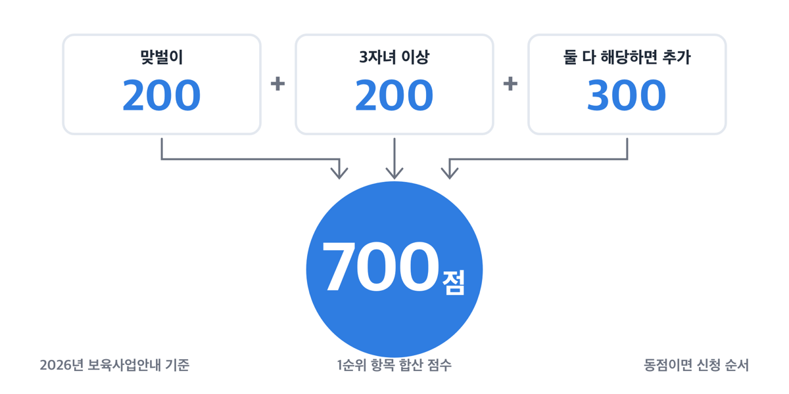
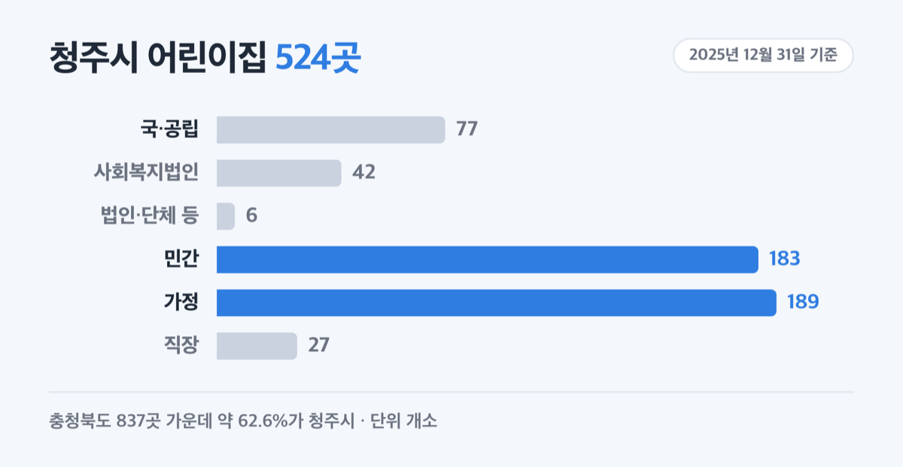
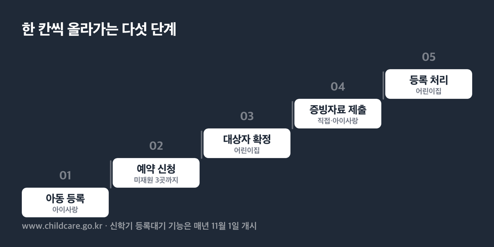
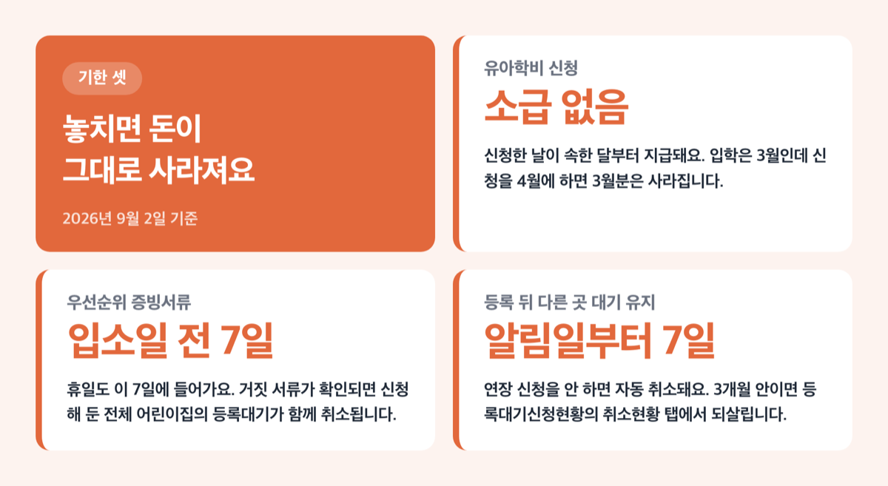

# 청주시 어린이집 입소, 2026년 맞벌이 200점 자녀 셋이면 700점

📌 2026년 9월 2일 기준

700점이에요. 맞벌이면서 자녀가 셋 이상인 가정이 어린이집 등록대기에서 받는 점수입니다. 같은 어린이집을 놓고 겨룰 때 이 숫자가 순서를 정해요.

**3줄 요약**

- 어린이집 입소는 순위표가 아니라 점수제예요. 1순위 항목은 하나당 100점, 맞벌이와 3자녀 이상은 각 200점입니다.
- 2026년 3월부터 3~5세 유아학비·보육료에 월 5만원이 더해져, 사립유치원과 어린이집은 월 40만원을 받고 있어요.
- 신학기 등록대기 기능은 매년 11월 1일에 열립니다. 점수가 같으면 신청한 순서로 정해져요.

어린이집 점수 계산법, 실제로 내는 돈, 유치원 추첨 방식, 청주시 창구 순서로 적었어요.

## 입소 우선순위는 순위표가 아니라 점수제입니다

어린이집 입소 우선순위의 근거는 「영유아보육법」 제28조와 시행규칙 제29조예요. 여기서 정한 1순위·2순위는 줄 세우기 표가 아니라 **합산 점수표**입니다. 항목에 여러 개 해당하면 점수가 더해지고, 높은 사람부터 명부가 만들어져요.

| 항목 (2026년 보육사업안내 기준) | 점수 |
|---|---|
| 1순위 항목 (하나당) | 100점 |
| 1순위 중 3자녀 이상 가구의 자녀 | 200점 |
| 1순위 중 맞벌이 | 200점 |
| 맞벌이이면서 3자녀 이상일 때 추가 | 300점 |
| 2순위 항목 (하나당) | 50점 |

그래서 맞벌이면서 자녀가 셋이면 200 + 200 + 300으로 **합계 700점**이 됩니다. 안내처에 따라 「추가 300점」으로 적힌 곳과 「700점」으로 적힌 곳이 있는데, 같은 값을 다르게 표기한 거예요.

여기서 원리 하나를 짚고 갑니다. ==2순위만 있는 사람은 점수가 아무리 높아도 1순위를 앞서지 못해요.== 2순위 점수는 1순위 항목 점수가 똑같을 때만 추가로 더해집니다. 즉 50점짜리 항목 세 개를 모아도 100점짜리 1순위 하나를 이길 수 없어요.

1순위 항목은 열여섯 가지입니다. 기초생활수급자, 한부모가족 지원대상자와 그 손자녀, 차상위계층 자녀, 중증 장애인의 자녀나 형제자매, 아동복지시설 생활 아동, **부모가 모두 취업 중이거나 취업을 준비 중인 영유아**, 다문화가족, 국가유공자 자녀, **자녀가 2명 이상인 가구**, 임신부의 자녀, 제1형 당뇨 아동, 산업단지 근로자 자녀, 북한이탈주민, 희귀·중증난치질환자의 자녀, 그리고 2025년 11월 24일부터 새로 들어온 **희귀·중증난치질환 아동의 형제자매**예요.

2순위는 셋입니다. 지원대상자 범위에 들지 않는 한부모·조손가족, 가정위탁 보호아동과 입양된 영유아, 같은 어린이집에 재원 중인 아동의 형제·자매.

> 😕 저희는 외벌이인데 그럼 아예 안 되나요?

아니에요. 자녀가 2명 이상이면 그것만으로 1순위 항목 100점입니다. 임신 중이어도 1순위고요. 다만 태아는 자녀 수에 바로 포함되지 않아요. 입소일 전에 출산 예정이라면 출산예정일이 적힌 진단서를 내고 자녀 수에 넣을 수 있습니다.

우선순위 해당 여부는 **신청일이 아니라 입소일 기준**으로 따져요. 신청할 때 맞벌이였어도 입소일에 한쪽이 퇴사했으면 그 200점은 사라집니다.

## 맞벌이 200점, 인정 기준이 생각보다 좁아요

맞벌이 가점은 그냥 「둘 다 일해요」라는 말만으로는 인정받지 못해요. 기준은 **월 60시간 이상 근로**이고, 재직증명과 소득증명을 함께 내야 해요. 두 가지를 요구하는 이유가 있어요. 재직증명서만으로는 실제 근로시간을 확인할 수 없어서, 소득 자료로 60시간에 준하는 수준인지를 봅니다.

인정되는 경우와 안 되는 경우를 나누어 정리했어요.

1. **휴직자는 인정됩니다.** 다만 육아휴직은 「남녀고용평등법」 제19조제2항이 정한 기간 안에서만 인정돼요.
2. **한부모 가구**는 부 또는 모 한 사람이 취업 중이거나 취업 준비 중이면 맞벌이로 봅니다.
3. **자영업자**는 사업자등록증명과 소득증명이 필요해요. *(부동산 임대업은 인정되지 않아요)*
4. **부부공동사업자**는 부부 모두 서류상 확인돼야 합니다. *(농어업 종사자는 부부 중 1인만 확인돼도 인정돼요)*
5. **예술인**은 예술인 활동증명서가 있으면 됩니다. 별도 소득증명이 필요 없어요.
6. **취업 준비 중**이라면 직업교육훈련을 단일 과정으로 3개월 이상 수강 중이거나, 구직등록을 입소일 직전 3개월 이상 유지해야 해요. *(출석수업만 인정됩니다)*
7. **무급가족종사자는 취업 중으로 보지 않습니다.**
8. **대학(원)생**은 재학증명서로 인정되지만, 휴학생과 방송통신대·사이버대는 인정되지 않아요.

여기서 자주 어긋나는 게 셋째와 여섯째예요. 가게를 막 연 자영업자는 매출 증빙이 없어 서류가 반려되고, 퇴사 후 곧바로 구직등록을 하지 않은 경우 3개월 요건을 못 채웁니다. 퇴직일과 입소일이 3개월 이내라면 **퇴직 후 7일 안에 구직등록**한 경우에만 예외로 인정돼요.

증빙은 입소가 확정된 뒤 **입소일 전 7일(휴일 포함) 안에** 내야 합니다. 그리고 거짓 서류를 낸 사실이 확인되면 그 어린이집만 취소되는 게 아니라 **신청해 둔 전체 어린이집의 등록대기가 함께 취소됩니다.**

## 실제로 내는 돈 — 0~2세는 0원, 3~5세는 어린이집 유형에 따라 달라져요

2026년 보육료는 0세부터 5세까지 **소득과 무관하게 전 계층 지원**입니다. 소득·재산 조사 자체가 없어요. 유아학비도 출생 연·월·일과 신청자만 확인해 자격을 만듭니다.

정부가 정한 부모보육료 단가는 이렇습니다.

| 반 (2026년 1월 1일 적용, 월) | 부모보육료 |
|---|---|
| 0세반 | 584,000원 |
| 1세반 | 515,000원 |
| 2세반 | 426,000원 |
| 3~5세반 | 280,000원 |
| 장애아 | 634,000원 |

여기서 흔히 뒤섞이는 게 있어요. 0세반 지원단가 총액은 1,277,000원인데, 이 가운데 **584,000원이 부모 몫(부모보육료)**이고 693,000원은 인건비를 지원받지 않는 어린이집에 정부가 따로 주는 기관보육료입니다. 두 값을 합쳐 「0세는 127만원 받는다」고 계산하면 어긋나요.

그럼 부모 지갑에서 실제로 나가는 돈은 얼마일까요. 어린이집 유형이 여기서 처음으로 달라집니다.

| 어린이집 유형 | 0~2세반 부모부담 | 3~5세반 부모부담 |
|---|---|---|
| 인건비 지원 어린이집 (국공립·사회복지법인·법인단체 등) | 0원 | 0원 |
| 기관보육료 지원 어린이집 (민간·가정 등) | 0원 | 수납액과 28만원의 차액 |

민간·가정 어린이집의 3~5세반만 차액이 생기는 이유는 이래요. 3~5세 지원금 28만원은 전국 공통 고시 금액인데, 어린이집이 실제로 받는 보육료는 **시·도지사가 정한 수납한도액** 안에서 원장이 학부모와 협의해 정합니다. 그 수납액이 28만원을 넘으면 넘는 만큼이 부모 몫이 돼요. 청주시의 경우 이 한도를 정하는 곳은 충청북도지사이고, 매년 1월 말에 정해져 **그해 3월부터 다음해 2월까지** 적용됩니다. 연도 중에는 바꿀 수 없어요.

다니려는 민간·가정 어린이집의 3~5세반 실제 부담금은 그 어린이집이 게시한 **실 수납액**으로 확인하세요. 어린이집은 수납한도액, 실 수납액, 보육료 지원내역, 반환 기준을 게시하고 안내할 의무가 있습니다. 금액이 게시돼 있지 않으면 청주시 여성가족과(043-201-1786)로 문의하세요.

법정저소득층과 장애아동은 민간·가정 어린이집의 3~5세반이라도 부모부담이 없습니다.

> [!WARNING]
> 0~23개월 아동이 어린이집에 다니면 부모급여를 **보육료(부모바우처)로 변경 신청**해야 합니다. 현금 상태로 두면 연장보육·장애아보육 지원을 받지 못해요. 부모급여에서 보육료를 뺀 차액은 현금으로 나옵니다. 2026년 기준 0~11개월 아동은 0세반 41만 6천원, 1세반 48만 5천원이 차액으로 들어오고, **12~23개월은 차액이 없습니다.**

퇴소할 때도 이 정산이 걸려 규칙이 하나 붙어요. 0~1세(0~23개월) 아동은 **퇴소 희망일 7일 전까지** 어린이집에 퇴소를 신청해야 합니다.

## 유아학비 월 40만원 — 3세 이야기는 두 가지를 섞으면 틀립니다

2026학년도 유아학비 지원 금액입니다. 2026년 3월 1일부터 2027년 2월 28일까지 적용돼요.

| 구분 (2026학년도, 월) | 구성 | 총 지원금 |
|---|---|---|
| 국·공립유치원 | 10만원 + 방과후 5만원 + 추가 5만원 | 200,000원 |
| 사립유치원·어린이집 | 28만원 + 방과후 7만원 + 추가 5만원 | 400,000원 |

대상은 3~5세, 2020년 1월 1일부터 2023년 2월 28일 사이에 태어난 유아예요. 방과후 과정비는 교육과정을 포함해 **1일 8시간 이상** 교육을 받을 때 나오고, 전액을 받으려면 월 출석일수가 **15일 이상**이어야 합니다.

이제 3세 이야기를 구분해서 짚어 볼게요. 요즘 「3세부터 확대됐다」는 말이 도는데, **서로 다른 두 사업이 하나로 뭉쳐진 말**입니다.

**① 지금 받고 있는 것 — 월 5만원 추가지원.** 2026년 1월 29일 발표된 「2026학년도 유아학비 지원계획」에 따라 **3세를 포함한 3~5세 전원**이 월 5만원을 더 받고 있어요. 2026년 3월 1일부터 이미 시행 중이고, 위 표의 20만원·40만원에 이 5만원이 들어가 있습니다. 재원은 누리과정 부담비용 고시와 별개로 추가 지원하기로 정한 몫이에요.

**② 아직 정해지지 않은 것 — 2027년 예산안의 3세 반 확대.** 2026년 9월 1일 나온 「2027년도 교육부 예산안」에 「유아 단계적 무상교육·보육 사업」 6,429억원(전년 대비 +1,726억원)이 담겼고, **지원 대상을 기존 4~5세에서 3세 반까지 확대**한다고 적혀 있어요. ①과는 재원도 사업 이름도 다른 별개 사업이고, **국회 심의 전이라 정부안 기준 계획입니다.**

정리하면 이렇습니다. **3세 5만원 추가지원은 이미 받고 있는 확정된 돈이고, 2027년 3세 반 확대는 아직 국회를 거치지 않은 다른 사업이에요.** 저라면 내년 살림을 짤 때 ②는 계산에 넣지 않습니다. 예산안은 국회 심의에서 규모가 바뀌는 일이 흔해서요.

사립유치원에 다니는 기초생활수급자·차상위계층·한부모 가정은 **월 최대 20만원**의 저소득층 유아학비 추가지원이 따로 있어요. 소득 요건이 붙는 건 이 항목 하나입니다.

> [!WARNING]
> 유아학비는 **신청한 날이 속한 달부터** 지급됩니다. 「유아교육법 시행규칙」 제4조제6항에 따라 **소급 지원이 없어요.** 입학은 3월인데 신청을 4월에 하면 3월분은 사라집니다. 2025년부터 이미 받고 있던 아동은 따로 신청하지 않아도 이어집니다.

## 청주시 어린이집 524곳, 국공립은 77곳이에요

2025년 12월 31일 기준 청주시 어린이집 현황입니다. 충청북도 전체 837곳 가운데 청주시가 524곳으로, 도내 어린이집의 약 62.6%가 청주에 있어요.

| 청주시 어린이집 유형 (2025년 12월 31일 기준) | 개소 |
|---|---|
| 국·공립 | 77 |
| 사회복지법인 | 42 |
| 법인·단체 등 | 6 |
| 민간 | 183 |
| 가정 | 189 |
| 직장 | 27 |
| **계** | **524** |

정원은 28,860명, 현원은 19,682명입니다. 국공립만 보면 정원 4,725명에 현원 3,652명이에요. 계산하면 청주시 어린이집 중 국공립은 개소 기준 약 14.7%, 정원 기준 약 16.4%이고, 국공립 정원 충족률은 약 77.3%, 전체 정원 충족률은 약 68.2%입니다.

이 비율은 통계 원문에 없고 위 숫자를 나눠서 얻은 값이라 참고용이에요. 그리고 여기서 반드시 짚어야 할 게 있습니다. **정원 충족률 68%를 「빈 곳이 3할이나 있다」로 읽으면 틀려요.** 정원은 반별 정원을 모두 더한 값이고, 실제 입소는 내 아이 나이에 맞는 반에 결원이 있느냐로 정해집니다. 0~2세반은 교사 한 명이 볼 수 있는 아동 수가 적어 반 정원 자체가 작아요. 숫자상 여유가 있어도 0세반은 대기가 길 수 있습니다.

저라면 국공립만 바라보지 않아요. 청주시 국공립은 전체의 15%도 되지 않는데, 인건비 지원 어린이집에는 사회복지법인 42곳과 법인·단체 6곳도 포함돼서 3~5세반 부모부담이 0원인 곳이 국공립 밖에도 있거든요. 국공립 한 곳과 사회복지법인 한 곳을 함께 걸어 두는 쪽이 낫다고 봅니다.

## 신청은 아이사랑, 유치원은 유보통합포털이에요

청주시 누리집에는 보육 안내 메뉴가 따로 없어요. 시설 목록 페이지만 있습니다. 입소 신청과 지원금 신청은 전부 국가 창구에서 이뤄져요.

**어린이집 등록대기 신청 순서**입니다. 예전 이름인 「입소대기」가 「등록대기」로 바뀌었지만 같은 것을 가리켜요.

1. 아이사랑(`www.childcare.go.kr`)에 접속해 **아동을 먼저 등록**합니다.
2. 어린이집을 검색해 예약을 신청해요. *(재원 중이면 2곳, 미재원이면 3곳까지 됩니다)*
3. 어린이집이 대상자를 확정합니다.
4. 우선순위 증빙자료를 어린이집에 직접 내거나 아이사랑에 올려요.
5. 어린이집이 아동 등록을 처리하면 끝납니다.

신청 자체는 연중 아무 때나 됩니다. 다만 **신학기 등록대기 관리기능은 매년 11월 1일에 열려요.** 그날이 토요일이나 공휴일이면 다음 주 월요일입니다. 지자체는 2월 말까지 신학기 입소예정자를 확정하도록 권장받아요.

저라면 11월 1일에 맞춰 걸어 둡니다. 같은 순위 안에서 경합하면 **등록대기 신청 순서**로 정해지기 때문이에요. 점수가 같은 두 가정이라면 하루 차이가 순번을 바꿉니다.

입소가 확정된 뒤에도 기한이 붙어요. **7일 안에 등원 여부를 결정하고 2주 안에 입소**해야 합니다. 신학기는 3월 2주 안이에요. 특별한 사유 없이 미루면 원장이 차순위자를 확정할 수 있습니다. 반대로 원장이 연락을 안 했다고 넘길 수도 없어요. 공휴일을 뺀 3일 이상, 총 3회 이상 연락한 근거가 있어야 차순위로 넘어갑니다.

이미 어린이집에 등록됐는데 다른 곳 대기를 유지하고 싶다면 **알림일로부터 7일 안에 연장 신청**을 해야 해요. 안 하면 시스템에서 자동 취소됩니다. 실수로 취소했다면 3개월 안에는 등록대기신청현황의 취소현황 탭에서 복구할 수 있어요.

**유치원은 방식이 완전히 다릅니다.** 창구는 유보통합포털(`www.go-firstschool.go.kr`), 옛 처음학교로예요. 우선모집 → 일반모집 → 추가모집 순으로 진행되고 **선착순이 아니라 마감 후 자동 추첨**입니다. 3곳까지 지원할 수 있고, 지금 다니는 유치원에 내년에도 다니겠다고 밝힌 재학생은 2곳이에요.

추첨 방식도 단계마다 다릅니다. 우선모집은 희망순 추첨이라 여러 유치원에 동시에 뽑힐 수 있고, 일반모집은 중복선발이 제한돼 상위 희망에 뽑히면 하위 희망 추첨에서 자동 제외돼요. **우선모집에 등록하면 등록을 포기하지 않는 한 일반모집에 접수할 수 없습니다.**

유치원 우선모집 자격은 어린이집과 기준이 완전히 달라요. 법정저소득층 가정 자녀, 국가보훈대상자 가정 자녀, 북한이탈주민 세 가지가 온라인으로 검증되고, **그 밖의 우선모집 조건은 유치원장이 정합니다.** 그래서 유치원별 모집요강을 반드시 봐야 해요. 맞벌이라는 이유만으로 우선모집 대상이 되지는 않습니다.

2027학년도 유아모집 일정은 유보통합포털 공지사항과 충청북도교육청 고시공고에서 확인하세요. 절차 문의는 학부모 콜센터 1544-0079, 어린이집 등록대기 문의는 아이사랑 헬프데스크 1566-3232입니다.

유아학비와 보육료 **지원금 신청 자체는 읍·면·동 행정복지센터 방문 또는 복지로(`www.bokjiro.go.kr`)** 에서 합니다. 결제 수단은 국민행복카드·아이행복카드·아이즐거운카드·아이사랑카드예요. 현금카드는 안 됩니다.

## 청주시가 따로 해 주는 것 — 시간제보육과 다자녀 혜택

「청주시 보육 조례」 제23조가 정한 비용 보조 대상 일곱 가지는 어린이집 설치·보수비, 보육교직원 인건비, 교재·교구비, 육아종합지원센터 운영비, 보수교육비, 취약보육 실시 비용, 그 밖에 시장이 인정하는 운영 비용입니다. **전부 어린이집과 보육교직원을 향한 항목이에요.** 학부모에게 직접 나가는 보육료 추가 지원이 따로 있는지는 청주시 여성가족과(043-201-1786)로 확인하세요.

대신 청주시가 학부모를 향해 운영하는 서비스가 시간제보육이에요. 종일제 보육을 쓰지 않으면서 필요한 시간만 맡기는 제도입니다.

| 청주시 시간제보육 (2026년 기준) | 내용 |
|---|---|
| 대상 | 6개월 이상 36개월 미만, 부모급여(현금)·양육수당 수급 아동 |
| 지원 시간 | 독립반·통합반 합산 월 최대 60시간 |
| 이용료 | 시간당 5,000원 (정부 3,000원 + 본인 2,000원) |
| 예약 | `cjtimecare.cjkids.or.kr`, 이용일 14일 전 09시부터 |
| 문의 | 청주시육아종합지원센터 043-222-6660 |

지원 대상이 부모급여(현금)나 양육수당을 받는 아동으로 정해진 이유는 단순해요. **보육료나 유아학비를 이미 받고 있으면 같은 아동에게 두 번 지원하는 셈이 되기 때문**입니다. 어린이집에 다니는 아동이 시간제보육을 쓰면 시간당 5,000원 전액을 본인이 냅니다.

> 🤭 **솔직히 말하면** — 결제 수단에서 헛돈 쓰는 경우가 제일 아까워요. 아이사랑카드나 아이행복카드로 결제해야만 정부보조금 3,000원이 붙습니다. 현금으로 내면 전액 본인 부담이에요.

첫 이용 전에는 아이사랑 PC 화면에서 **「시간제보육 아동등록」** 을 먼저 해야 하고, 제공기관 첫 방문 때 이용신청서와 운영규정 서약서, 가족관계증명서, 신분증을 냅니다. 청주시 제공기관은 동심의나라·예담·아이들세계·명지영아전담·맑은샘·고은별 어린이집이 예약 화면에 올라 있어요.

벌점도 있습니다. 예약시간 전 취소 -1점, 예약시간 내 취소 -2점, 미이용 -3점, 초과이용 -4점이고 **당월 누적 -7점이면 그달 사전 예약이 모두 취소되고 온라인 예약이 막혀요.**

청주시 다자녀가정 혜택 중 보육·교육에 걸리는 것도 있어요. 두 자녀 이상이면 **장난감 대여센터 연회비가 면제**되고, 기준중위소득 100% 이하 다자녀 가구는 기저귀 월 최대 9만원·조제분유 월 최대 11만원을 받습니다. 다태아 가정은 12개월 이하 영아에게 월 최대 10만원(쌍둥이 20만원), 4자녀 이상 가정은 초다자녀 지원으로 4자녀 최대 100만원·5자녀 최대 500만원이 있어요.

## 자주 걸리는 함정 넷

**첫째, 안내 화면마다 다자녀 기준이 다르게 적혀 있습니다.** 2026년 지침의 1순위 항목은 「자녀가 2명 이상인 가구의 영유아」로, 2023년 10월 19일 개정 이후 **나이 조건이 없어요.** 「만 8세 이하 자녀 2명 이상」처럼 나이가 붙은 설명은 옛 기준입니다. 헷갈리면 어린이집이나 청주시 여성가족과에 지침 기준으로 다시 확인하세요.

**둘째, 「우리 아이는 3순위」라는 말은 법령 용어가 아니에요.** 아이사랑 화면은 1·2순위에 해당하지 않는 아동을 3순위로 적지만, 지침 원문에는 1순위와 2순위만 있습니다. 실질은 같아요. 점수 합산으로 처리될 뿐입니다.

**셋째, 보육료와 유아학비는 함께 받을 수 없습니다.** 유치원에서 유아학비를 받는 중이면 어린이집 보육료가 나오지 않고, 반대도 마찬가지예요. 양육수당으로 바꾸려면 **어린이집을 퇴원하거나 유치원 학적을 중단**해야 합니다. 학적을 남겨 둔 채로는 대상이 되지 않아요.

**넷째, 해외 체류 기준일이 제도마다 다릅니다.** 보육료는 출국 후 91일째 되는 날, 유아학비는 **31일째 되는 날** 자격이 중지돼요. 한 달 넘는 해외 일정이 있으면 유치원 쪽이 먼저 걸립니다. 중지된 뒤에는 재신청을 해야 다시 나와요.

시간제보육 당일 예약 마감시각은 안내에 따라 12시와 14시로 다르게 적혀 있어요. 당일 예약이 필요하면 1661-9361로 먼저 전화하세요.

## 2027년에는 무엇이 달라질까요

2026년 9월 1일 발표된 2027년도 교육부 예산안은 총지출 117조 5,962억원으로, 2026년 본예산 106조 3,607억원보다 11조 2,355억원(10.6%) 늘었습니다. 영유아 관련 항목만 옮겨요.

| 2027년도 교육부 예산안 (정부안, 국회 심의 전) | 금액 |
|---|---|
| 유아 단계적 무상교육·보육 (3세 반까지 확대) | 6,429억원 |
| 교사 대 아동비율 개선 (1세 반까지 확대) | 5,269억원 |
| 영유아보육료 (0~2세 단가 3% 인상) | 3조 7,959억원 |
| 정부책임형 유보통합 추진 | 1조 1,698억원 |

청주시 학부모에게 실제로 걸리는 항목은 세 번째와 그 아래에 붙은 한 줄이에요. 0~2세 보육료 단가를 3% 올린다고 했으니 정부안 기준으로 계산하면 0세반 부모보육료는 약 60만 2천원, 1세반은 약 53만원, 2세반은 약 43만 9천원이 됩니다. **보도자료는 비율만 밝혔고 연령별 금액은 적지 않았어요.** 실제 단가는 「2027년도 보육사업안내」에서 확정되니 이 값은 어림으로만 보세요.

그리고 **「국공립 운영 인센티브」가 새로 들어갑니다.** 입소 대기가 많은 국공립 등 인건비 지원시설 어린이집이 **0~1세 반을 추가로 열도록** 지원하는 항목이에요. 앞에서 청주시 0세반 대기가 통계 숫자보다 길 수 있다고 적었는데, 정부가 손을 대려는 곳도 정확히 거기입니다.

다만 전부 정부안입니다. 국회 심의에서 규모가 바뀔 수 있어요.

## 청주시 어린이집 입소 관련 궁금증 해결

**Q. 어린이집도 선착순 아닌가요?**
A. 아니에요. 점수 합산으로 명부를 만들고, 점수가 같을 때만 등록대기 신청 순서를 봅니다. 반대로 유치원은 점수가 아니라 마감 후 자동 추첨이에요. 두 제도가 정반대입니다.

**Q. 육아휴직 중인데 맞벌이 200점을 받을 수 있나요?**
A. 받을 수 있어요. 휴직자는 맞벌이로 인정되고, 육아휴직은 「남녀고용평등법」 제19조제2항이 정한 기간 안에서 인정됩니다. 판단은 입소일 기준이라 그날 휴직 기간이 유효한지가 관건이에요.

**Q. 3세인데 월 5만원 추가지원을 지금 받고 있나요?**
A. 네. 2026학년도 유아학비 지원계획에 따라 2026년 3월 1일부터 3~5세 전원이 받고 있습니다. 2020년 1월 1일~2023년 2월 28일 출생이면 대상이에요. 뉴스에 나온 「3세 반까지 확대」는 2027년 예산안에 담긴 다른 사업이고 아직 국회 심의 전입니다.

**Q. 민간 어린이집 3~5세반은 얼마를 더 내나요?**
A. 어린이집이 정한 수납액에서 28만원을 뺀 차액입니다. 금액은 어린이집이 게시한 실 수납액에서 확인하세요. 인건비 지원 어린이집이면 3~5세반도 0원입니다.

**Q. 원장이 아이를 그만 보내라고 할 수 있나요?**
A. 보호자 뜻에 반하는 퇴소는 원칙적으로 안 됩니다. 영유아의 질병, 어린이집 폐지, 허위 증빙서류 입소, 학부모의 교직원 폭행 같은 정당한 사유가 있고 **시장·군수·구청장의 승인**을 받은 경우만 가능해요. 반대로 보호자가 퇴소를 요청하면 원장은 거부하지 못합니다.

## 마무리 — 지금 확인할 것 셋

첫째, 우리 집 점수를 계산해 보세요. 1순위 항목이 몇 개인지, 맞벌이 200점이 입소일 기준으로도 유지되는지가 핵심입니다.

둘째, 3월 입소를 노린다면 11월 1일을 달력에 적어 두세요. 동점일 때 신청 순서가 순번을 바꿉니다.

셋째, 지원금 신청을 미루지 마세요. 유아학비는 소급이 없어서 늦은 만큼 그대로 사라집니다.

참고: 교육부 「2026년도 보육사업안내」 · 교육부 「2026학년도 유아학비 지원계획」 · 교육부 고시 제2026-2호 「2026년도 누리과정 부담비용 고시」 · 교육부 「2025 보육통계」 · 교육부 보도자료 「2027년도 교육부 예산안 117.6조 원 편성」 · 아이사랑 임신육아종합포털 · 유보통합포털(유치원입학) · 「청주시 보육 조례」 · 청주시 다자녀가정 안내 · 청주시육아종합지원센터
