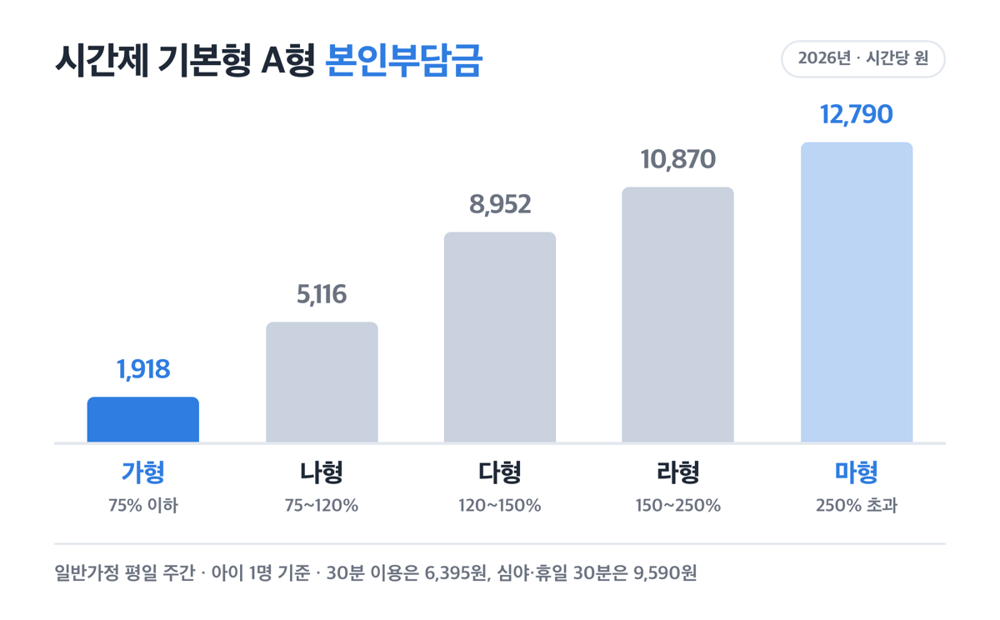
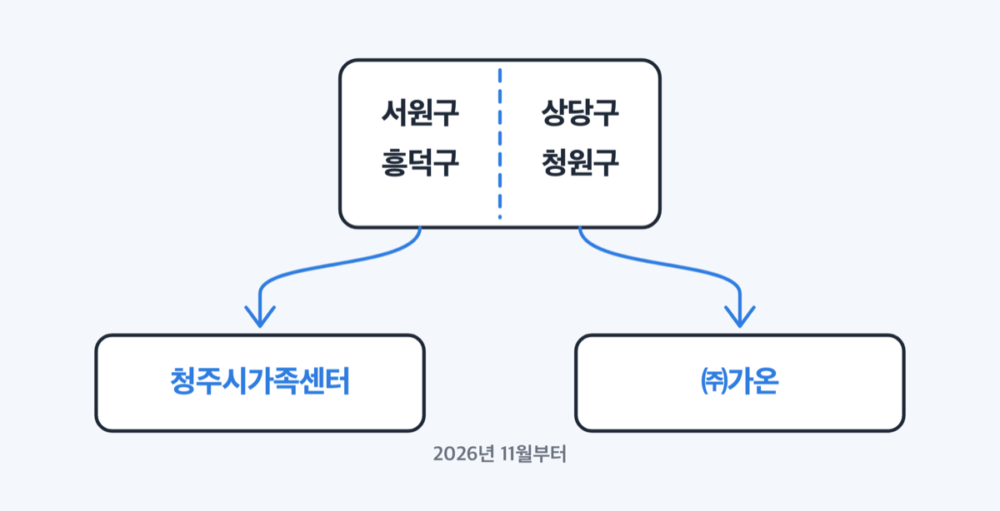
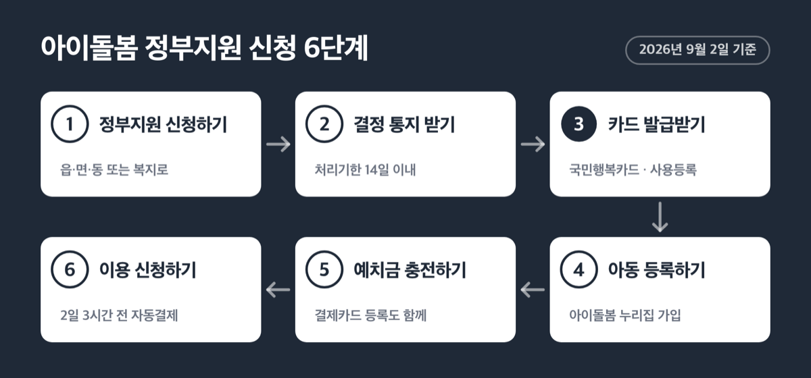
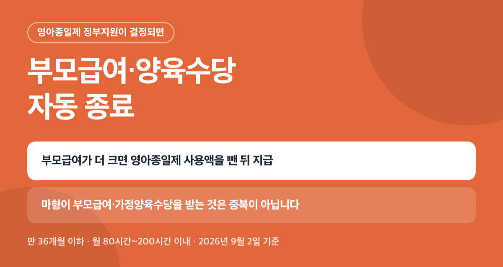

# 청주시 아이돌봄서비스 요금, 2026년 가형이면 시간당 1,918원

📌 2026년 9월 2일 기준

청주에서 아이돌봄서비스를 받는 방식이 올해 하반기에 하나 바뀝니다. 서비스 제공기관이 1개소에서 2개소로 늘고, 사는 구에 따라 접수하는 곳이 달라져요. 요금표는 전국이 같은데 이 부분은 청주 얘기입니다.

**3줄 요약**

1. 시간제 기본형은 시간당 12,790원이고, 소득유형 가형이면 본인부담이 시간당 1,918원입니다.
2. 2026년 1월 1일부터 정부지원 대상이 기준 중위소득 250% 이하로 넓어졌어요.
3. 청주는 9월 4일 협약을 거쳐 11월부터 제공기관이 둘로 운영돼요. 사는 구를 먼저 확인하세요.

요금표와 소득유형, 신청 순서, 그리고 청주에서만 달라지는 것을 차례로 적어요.

## 아이돌봄서비스, 청주에서도 요금은 같습니다

아이돌봄서비스의 종류는 시간제서비스, 영아종일제서비스, 질병감염아동서비스 셋입니다. 시간제는 필요한 시간만 불러 쓰는 것이고, 영아종일제는 생후 36개월 이하 영아를 월 단위로 맡기는 것이에요.

| 서비스 종류 (2026년, 시간당·원) | 시간당 이용요금 | 이용 대상 |
|---|---|---|
| 시간제 기본형 | 12,790원 | 생후 3개월 ~ 만 12세 이하 |
| 시간제 종합형 | 16,620원 | 생후 3개월 ~ 만 12세 이하 |
| 영아종일제 | 12,790원 | 생후 3개월 ~ 만 36개월 이하 |
| 질병감염아동 | 15,340원 | 생후 3개월 ~ 만 12세 이하 |

기본형과 종합형의 차이는 아이돌보미가 하는 일의 범위예요. 종합형은 아이와 관련된 집안일까지 포함하고, 그래서 시간당 3,830원이 더 붙습니다.

여기서 청주라고 요금이 싸지지 않는 이유가 나와요. 이 단가와 소득 기준은 성평등가족부가 고시로 전국에 똑같이 정하고, 시·군·구는 그 기준대로 집행해요. ==그래서 「청주시 아이돌봄서비스 요금」을 따로 찾아도 전국 요금표와 같은 숫자가 나와요.==

구분 기준이 하나 더 있습니다. 요금표가 A형과 B형으로 나뉘는데, 기준은 나이가 아니라 출생연도입니다. **A형은 2019년 1월 1일 이후 출생한 미취학 아동, B형은 2018년 12월 31일 이전 출생한 취학 아동입니다.**

## 소득유형별 시간당 본인부담금

가장 많이 쓰는 시간제 기본형부터 봅니다. 일반가정이고 평일 주간, 아이 1명 기준이에요.

| 시간제 기본형 본인부담금 (2026년, 일반가정, 평일 주간, 시간당·원) | A형(미취학) | B형(취학) |
|---|---|---|
| 가형 | 1,918원 | 2,558원 |
| 나형 | 5,116원 | 6,394원 |
| 다형 | 8,952원 | 9,592원 |
| 라형 | 10,870원 | 11,510원 |
| 마형 | 12,790원 | 12,790원 |

정부 지원액도 소득유형별로 함께 적어요.

| 소득유형 기준 (기준 중위소득 대비) | 소득기준 | 시간제 기본형 A형 정부지원(시간당) |
|---|---|---|
| 가형 | 75% 이하 | 10,872원 |
| 나형 | 75% 초과 ~ 120% 이하 | 7,674원 |
| 다형 | 120% 초과 ~ 150% 이하 | 3,838원 |
| 라형 | 150% 초과 ~ 250% 이하 | 1,920원 |
| 마형 | 250% 초과 | 없음 |

라형은 시간당 1,920원을 지원받아요. 시간제를 월 100시간 쓰면 본인부담이 108만 7천원입니다. 정부지원 대상에 들어갔다는 말과 요금이 싸진다는 말은 같은 말이 아니에요.

영아종일제도 시간당 단가와 지원액이 시간제 기본형 A형과 같습니다. 다만 월 80시간에서 200시간 이내로 쓰는 방식이라, 가형이 월 200시간을 쓰면 본인부담이 38만 3,600원쯤 됩니다. 이 값은 할증과 할인을 넣지 않은 단순 곱셈이에요.

> 🤭 **솔직히 말하면** — 종합형은 정부지원금이 기본형과 똑같아요. 늘어난 단가 3,830원은 전액 이용자 몫입니다.

그래서 저라면 종합형을 기본으로 고르지 않습니다. 집안일까지 맡길 이유가 분명할 때만 3,830원을 더 내는 쪽이 맞다고 봐요.

**할증과 할인이 적용되면 최종 요금 차이가 커집니다.** 야간(오후 10시~오전 6시)과 휴일은 기본요금의 50%가 증액돼요. 둘이 겹쳐도 중복되지 않아서, 휴일 야간에도 50%만 붙습니다.

- 동시 돌봄 할인 — 돌보미 1명이 같은 시간대에 2명을 보면 25%, 3명 33.3%, 4명 37.5%, 5명 40% *(아이가 둘이면 여기서 체감이 커요)*
- 다자녀 추가 지원 — 가·나·다·라형 중 만 12세 이하 아동 2명 이상 가정은 본인부담금의 10%를 더 지원 *(마형은 빠집니다)*
- 인구감소지역 추가 지원 — 본인부담금의 5% *(충북에서는 괴산·단양·보은·영동·옥천·제천이 대상이고, 청주시는 들어 있지 않아요)*

이용 단위에도 최소 기준이 있습니다. 시간제와 질병감염아동은 1회 2시간 이상, 영아종일제는 1회 3시간 이상이고 추가는 30분 단위입니다. 30분 요금은 시간제 기본형 A형이 6,395원, 심야·휴일이면 9,590원이에요.

## 누가 받고, 몇 시간까지 받나

정부지원을 받으려면 **대상아동 · 양육공백 · 자녀양육 정부지원 중복금지 · 가구소득** 네 가지 기준을 모두 충족해야 합니다.

양육공백은 맞벌이, 한부모(조손 포함), 장애부모, 다자녀, 다문화, 아동학대 피해위기 아동, 그 밖의 양육부담 가정으로 인정돼요. 맞벌이가 가장 흔한 경우입니다.

소득은 조금 다르게 봅니다. 통장에 들어오는 월급이 아니라 **건강보험료 본인부담금 납부액**(노인장기요양보험료 제외)으로 월평균 가구소득을 산정해요. 맞벌이는 합산소득의 25%를 감경해 줍니다.

> [!WARNING]
> 2026년 4인 가구 기준 중위소득은 월 6,494,738원입니다. 250%를 곱하면 1,623만원쯤이지만, 실제 판정은 건강보험료 납부액으로 하고 맞벌이 감경이 들어가서 이 금액을 문턱으로 보면 안 됩니다. 내 소득유형은 읍·면·동 접수 때 확정돼요.

지원 시간은 시간제가 연 960시간입니다. 왜 연 단위인가 하면, 정부지원 시간이 회계연도 안에서 소진되는 구조라 그래요. 그래서 하반기에 몰아 쓰려고 아껴 두면 해가 넘어가면서 사라집니다.

취약가구는 연 1,080시간으로 120시간이 늘어나요. 대상은 가~라형 중 한부모·조손가정·장애부모(중증과 경증 모두)·청소년부모(부모 모두 만 24세 이하)입니다.

영아종일제는 월 80시간에서 200시간 이내예요. 시간제와 영아종일제를 같은 아이에게 중복으로 지원받을 수는 없고, 종류를 바꾸면 시간제 80시간을 영아종일제 1개월로 환산해 서로 공제합니다.

> 😕 **저는 소득이 250%를 넘는데요?**

마형도 이용은 됩니다. 이용요금 전액을 본인이 부담하는 조건으로 신청해 쓸 수 있어요. 그리고 질병감염아동서비스는 마형에도 시간당 7,670원, 절반이 지원됩니다. 아이가 수족구나 독감으로 어린이집에 못 갈 때 쓰는 그 서비스예요.

## 청주시 제공기관이 둘로 나뉩니다

지금부터가 청주 사는 사람만 해당되는 내용이에요. 청주시는 아이돌봄서비스 제공기관을 1개소에서 2개소로 늘립니다. 충북 시·군에서는 처음이고, 전국에서 시흥·구미·경주에 이어 네 번째입니다.

| 청주시 아이돌봄서비스 제공기관 권역 (2026년 11월 본격 운영) | 담당 기관 |
|---|---|
| 서원구·흥덕구 | 청주시가족센터 |
| 상당구·청원구 | ㈜가온(사회적기업) |

일정은 이렇게 잡혀 있어요. **9월 4일 협약식을 하고, 10월까지 자료 이관과 신규 돌봄사 채용·직무교육을 거쳐, 11월부터 복수기관 체제를 본격 운영합니다.**

왜 굳이 기관을 늘리나. 지원 기준이 2024년 중위소득 150%에서 2025년 200%, 2026년 250%로 넓어지면서 최근 3년 사이 청주시 이용 아동 수가 약 58% 늘었어요. 한 기관이 4개 구를 다 맡는 구조로는 연계가 밀립니다. 특히 오송·오창 등 신도시와 평일 오후 4시~7시에 신청이 몰려요.

사업비는 총 99억여원을 확보했고 여기에 복수기관 지정 예산 14억여원이 들어 있습니다. 아이돌보미를 현재 288명에서 2027년까지 331명으로 약 15% 늘리는 것이 목표예요.

이용요금 자체는 앞에서 본 전국 요금표를 그대로 적용합니다. 본인부담금을 청주시가 별도 예산으로 더 지원하는 사업이 있는지는 청주시 여성가족과 건강가족팀(043-201-1783)에서 확인하세요. 접수 창구와 담당자 연결은 청주시가족센터 아이돌봄과(043-264-1817)가 구별로 나눠 맡고 있어요.

## 신청 순서와 처리 기한

절차가 두 갈래로 돌아갑니다. 하나는 정부지원 자격을 받는 행정 절차, 다른 하나는 실제로 돌보미를 연계받는 준비 절차예요. 순서대로 적습니다.

1. **정부지원 결정 신청** — 전국 읍·면사무소나 동주민센터를 방문하거나 복지로(www.bokjiro.go.kr)에서 온라인 신청합니다. 서식은 「사회보장급여 신청(변경)서」와 자격 증빙자료예요.
2. **결정 통지 받기** — 처리기한은 14일 이내입니다. 시·군·구가 「사회보장 급여결정 통지서」를 우편으로 보내 주고, 동의하면 문자나 전자우편으로도 옵니다.
3. **국민행복카드 발급** — 이 카드가 없으면 다음 단계로 넘어가지 못합니다. BC·롯데·삼성·KB국민·신한·현대에서 발급받아 사용등록까지 마쳐요.
4. **아이돌봄 누리집 회원가입과 아동등록** — 실명인증까지 하면 「대기 아동」이 되고, 제공기관이 승인하면 「정기 아동」으로 바뀌어 정기 이용이 시작돼요.
5. **결제카드 등록과 예치금 충전** — 누리집 회원정보에 카드를 등록하고 예치금을 채웁니다. 둘 중 하나라도 비어 있으면 결제가 막혀요.
6. **이용 신청** — 이용요금은 서비스일 2일 3시간 전에 등록한 카드로 자동 결제됩니다.

이름 셋이 같아야 하는 규칙이 있어요. **정부지원 신청자와 국민행복카드 명의자, 누리집 가입자가 모두 같은 사람이어야 합니다.** 아빠 이름으로 신청하고 엄마 카드를 등록하면 진행되지 않아요.

온라인 신청에도 문턱이 있습니다. 부모 모두 직장건강보험에 가입한 맞벌이와 「한부모가족지원법」상 등록 한부모(직장보험 가입)만 복지로에서 되고, 나머지는 방문 신청만 됩니다.

정부지원 시작 시점은 신청일이 아니에요. 전송된 결정정보의 적용일부터입니다. 시간제와 영아종일제 사이 유형 변경은 다음 달 1일부터 적용돼요.

## 놓치기 쉬운 것 넷

첫째, 영아종일제는 부모급여와 맞바꾸는 선택입니다. 정부지원이 결정되면 부모급여나 양육수당이 자동 종료돼요. 부모급여가 더 크면 영아종일제 사용액을 뺀 뒤 지급됩니다.

저라면 만 36개월 이하 아이에게 영아종일제를 신청하기 전에, 한 달에 실제로 몇 시간을 쓸지부터 적어 봅니다. 월 80시간 쓸지 200시간 쓸지에 따라 유리한 쪽이 뒤집히는 구조예요.

둘째, 어린이집이나 유치원에 다니면서 시간제를 쓸 때는 시간대가 막힙니다. 보육료나 유아학비를 받는 아동은 **어린이집 평일 09:00~16:00, 유치원 평일 09:00~13:00** 시간에는 정부지원을 못 받아요. 하원 후 시간대만 지원된다는 뜻입니다.

셋째, 취소 수수료가 셉니다.

| 취소 시각 (시간제 기본형 기준) | 수수료 |
|---|---|
| 시작 24시간 전 ~ 1시간 전 | 건당 12,790원 |
| 시작 1시간 전 ~ 시작 전 | 12,790원 × 연계 시간 × 50% (최소 12,790원) |
| 시작 이후 | 이용요금 × 연계 시간 × 100% |

==시작 72시간 이내 취소가 월 3건 이상이면 1개월 이용 제한이 걸려요.== 아이가 아파 급히 취소하는 일이 반복되면 서비스 자체가 막히는 구조입니다.

넷째, 결제 시점이 이용일보다 앞섭니다. 서비스일 2일 3시간 전에 자동 결제되니, 예치금이나 카드 한도가 그 시점에 비어 있으면 연계가 어긋나요.

## 청주시 아이돌봄서비스 관련 궁금증 해결

**Q. 청주시가 요금을 더 지원해 주나요?**
A. 이용요금과 소득기준은 성평등가족부 고시로 전국이 같습니다. 청주시가 별도 예산으로 본인부담금을 더 지원하는 사업이 있는지는 여성가족과 건강가족팀(043-201-1783)에서 확인하세요.

**Q. 상당구에 사는데 어디로 신청하나요?**
A. 정부지원 결정 신청은 사는 동주민센터나 복지로에서 합니다. 돌보미 연계를 맡는 제공기관은 11월부터 상당구·청원구가 ㈜가온, 서원구·흥덕구가 청주시가족센터로 나뉘어요. 창구 안내는 청주시가족센터 아이돌봄과(043-264-1817)에서 받으세요.

**Q. 아이가 둘이면 요금이 어떻게 되나요?**
A. 돌보미 1명이 같은 시간대에 2명을 보면 25% 할인입니다. 여기에 만 12세 이하 아동이 2명 이상이면 가·나·다·라형은 본인부담금의 10%를 추가로 지원받아요.

**Q. 소득유형이 마형인데 이용할 수 있나요?**
A. 이용요금 전액을 부담하면 신청과 이용이 됩니다. 질병감염아동서비스는 마형도 시간당 7,670원을 지원받고, 마형이 부모급여나 가정양육수당을 받는 것은 중복으로 보지 않아요.

**Q. 상담 전화는 어디로 하나요?**
A. 아이돌봄서비스 안내센터 1577-8136이 평일 09:00~18:00(점심 12:00~13:00) 운영됩니다. 청주 지역 연계 문의는 청주시가족센터 아이돌봄과 043-264-1817이에요.

지금 청주에서 아이돌봄서비스를 쓰려면 순서가 분명합니다. 소득유형을 확정받는 데 최대 14일이 걸리고, 국민행복카드 발급과 아동등록에 며칠이 더 붙어요. 11월에 기관이 둘로 나뉘며 연계가 재정비되는 만큼, 겨울에 쓸 생각이면 지금 1번 단계를 밟아 두는 편이 낫습니다.

숫자로 다시 정리하면 이렇습니다. 시간제 기본형은 시간당 12,790원, 가형이면 1,918원, 라형이면 10,870원, 마형이면 전액이에요. 이 요금표의 적용기간은 2026년 12월 31일까지입니다.

참고: 성평등가족부고시 제2025-12호 「2026년도 아이돌봄서비스 비용 및 지원가구 소득기준」 · 아이돌봄서비스 누리집 서비스 안내 · 2026년 아이돌봄 지원사업 요금표 · 보건복지부 「2026년도 기준 중위소득」 보도자료 · 청주시 보도자료(2026-08-27, 2025-12-31) · 행정안전부 인구감소지역 지정 현황
