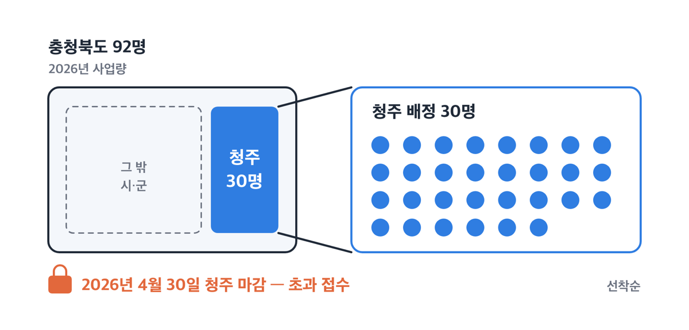
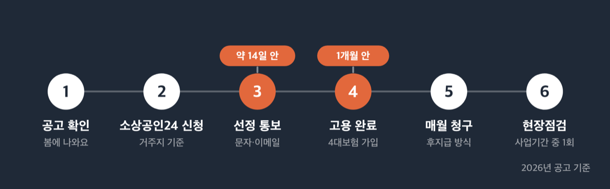
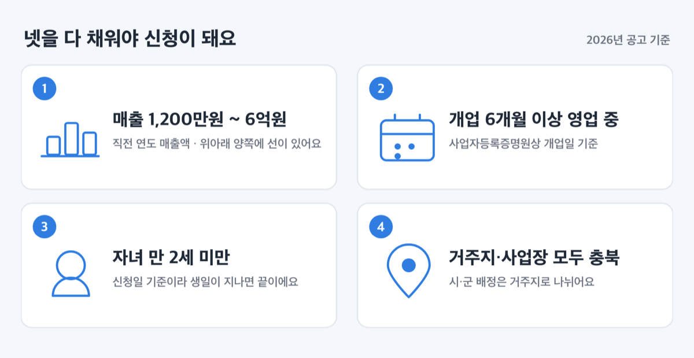
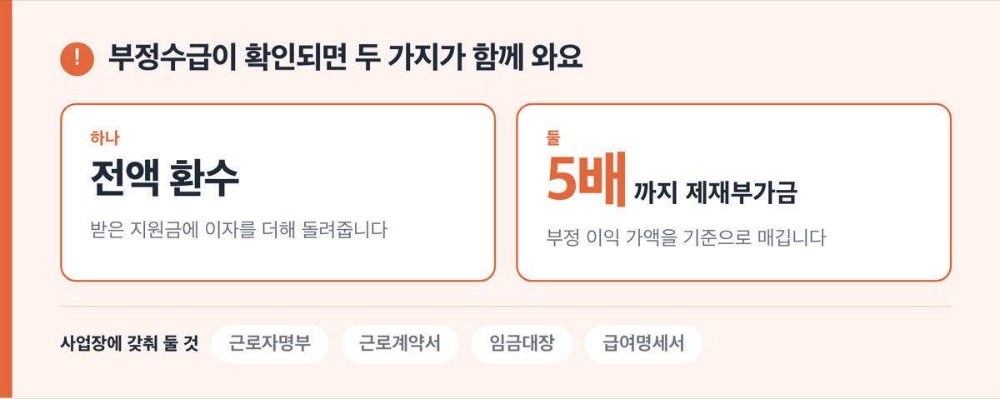

# 청주 소상공인 출산지원 월 200만원, 2026년 접수는 마감됐어요

📌 2026년 9월 2일 기준

청주 지역 접수는 2026년 4월 30일에 끝났어요. 소상공인24 공고 목록에는 아직 '신청가능'으로 떠 있지만, 같은 공고 본문에는 청주가 초과 접수로 마감됐다고 적혀 있습니다. 지금 넣으면 반려예요.

**3줄 요약**

- 충청북도가 하는 「2026년 소상공인 출산 지원사업」이에요. 만 2세 미만 자녀가 있는 소상공인이 대체인력을 쓰면 그 인건비를 월 최대 200만원, 최대 6개월까지 대신 내줍니다.
- 2026년 3월 13일 09시에 접수를 열었고, 청주 몫 30명이 다 차서 4월 30일에 청주만 먼저 닫혔어요.
- 지금 확인할 것은 신청 버튼이 아니라 요건 넷입니다. 매출·개업일·자녀 나이·주소지가 맞아야 내년 공고가 떴을 때 바로 넣을 수 있어요.

> [!WARNING]
> 소상공인24 공고 **목록** 화면은 접수기간을 2026년 12월 31일까지로 보여줘요. 그런데 공고를 눌러 들어가면 본문에 "청주(마감:4/30)지역은 초과 접수로 마감되었습니다"라고 적혀 있습니다. 같은 본문에 "신청 마감 이후에 접수된 건은 반려 처리됩니다"라는 문장도 함께 있어요. ==목록 상태값이 아니라 공고 본문이 기준입니다.==

올해 못 받는 이유부터 짚고, 금액과 요건은 내년에 다시 넣을 사람 기준으로 정리할게요.

## 청주는 왜 지금 접수가 안 되나

이 사업의 주인은 청주시가 아니라 충청북도예요. (재)충청북도기업진흥원이 2026년 3월 13일에 공고 제2026-59호로 도 전체 공고 하나를 냈고, 청주시는 그 안에서 배정 인원 30명을 받는 시·군입니다. 청주시가 따로 공고를 내지 않는 구조예요.

충북 전체 사업량이 92명이고 그중 30명이 청주 몫이에요. 창구는 충북소상공인지원센터가 맡고, 접수는 소상공인24 한 곳에서만 받습니다.

선정 방식은 선착순이 원칙이에요. 그래서 예산이 아니라 인원이 먼저 바닥나면 그 시·군만 닫힙니다. 3월 13일에 열어 4월 30일에 닫혔으니 청주 30명이 차는 데 걸린 시간은 약 7주예요.

쉽게 말하면 도 전체 창구는 12월 31일까지 열려 있는데, 청주 칸만 먼저 채워져 잠긴 상태예요.

| 청주시 배정 (2026년) | 값 |
|---|---|
| 배정 인원 | 30명 |
| 청주시 예산 | 3억 9,000만원 (도비 1.2억원, 시비 2.7억원) |
| 접수 시작 | 2026년 3월 13일 09:00 |
| 청주 마감 | 2026년 4월 30일 (초과 접수) |

청주 밖 시·군은 공고상 접수기간이 2026년 12월 31일 23시 59분까지이고, 마감 문구가 붙은 곳은 청주뿐이에요. 다른 시·군에 남은 인원이 있는지는 충북소상공인지원센터(043-230-9769)로 확인하세요.

저라면 지금은 소상공인24에서 신청 버튼을 누르지 않습니다. 반려되면 접수 이력만 남고 얻는 게 없거든요.

## 💰 얼마 받나 — 월 200만원은 상한선이에요

지원금은 대체인력에게 **실제로 지급한 세전 임금** 기준으로 나와요. 월 200만원은 그 위에 씌운 뚜껑이고, 실지급액이 200만원보다 적으면 적은 만큼만 나옵니다.

공고문에 계산 예시가 그대로 실려 있어요. 2026년 최저임금 시급 10,320원을 기준으로 잡은 값입니다.

| 대체인력 주 근로시간 | 월급 (세전) | 월 지원금 |
|---|---|---|
| 주 40시간 (월 209시간) | 2,156,880원 | 2,000,000원 |
| 주 35시간 (월 183시간) | 1,888,560원 | 1,888,560원 |
| 주 30시간 (월 157시간) | 1,620,240원 | 1,620,240원 |

*모두 2026년 최저임금 시급 10,320원으로 채용한 경우예요. 시급을 더 주면 월급은 오르지만 지원금은 200만원에서 멈춥니다.*

여기서 원리가 하나 보여요. 최저임금으로 주 40시간을 채워야 월급이 215만원이 되고, 그래야 200만원 뚜껑에 닿습니다. 주 35시간이면 지원금이 188만 8,560원, 주 30시간이면 162만 240원이에요.

저는 이 사업에서 가장 중요한 숫자가 200만원이 아니라 209시간이라고 봐요. 반나절만 쓸 사람을 구하면 200만원은 처음부터 남의 숫자예요.

6개월을 꽉 채우면 총액은 이렇게 됩니다.

1. 주 40시간 6개월 — 1,200만원 (업체당 총액 상한에 정확히 닿아요)
2. 주 35시간 6개월 — 약 1,133만원
3. 주 30시간 6개월 — 약 972만원

*중간에 대체인력이 들어오거나 나가면 일할 계산이라 위 총액이 아니에요.*

돈이 나오는 방식도 미리 알아 둬야 해요. **경영주가 인건비를 먼저 지급하고 매월 청구하는 후지급입니다.** 입금은 청구인 명의 통장으로 들어오고, 시·군 예산 상황에 따라 사전 협의로 일괄지급이 되기도 해요.

즉 인건비는 경영주 통장에서 먼저 나가고, 지원금은 그 뒤에 들어옵니다.

## 누가 받나 — 요건 넷과 제외 대상

공고문이 정한 지원 대상 요건은 넷이고, 하나라도 빠지면 안 돼요.

| 요건 | 놓치기 쉬운 것 |
|---|---|
| 거주지와 사업장 주소지가 모두 충북 | 시·군 배정은 **거주지**로 나뉘어요 |
| 신청일 기준 만 2세 미만 자녀 | 신청일 기준이라 생일이 지나면 끝이에요 |
| 사업자등록증명원상 개업일로부터 6개월 이상 영업 중 | 개업일 기준이지 매출 발생일이 아니에요 |
| 직전 연도 매출액 1,200만원 이상 6억원 이하 | 아래가 아니라 **위·아래 양쪽**에 선이 있어요 |

여기서 「소상공인」은 소상공인기본법과 시행령이 정한 뜻으로 봐요. 상시 근로자가 광업·제조업·건설업·운수업은 10명 미만, 그 밖의 업종은 5명 미만이면 해당돼요. 임원과 일용근로자, 3개월 이내로 기간을 정해 일하는 사람, 1개월 소정근로시간 60시간 미만 단시간근로자는 이 인원수에서 뺍니다.

> 😕 매장이 커져서 작년에 직원이 6명이 됐는데요. 그럼 이제 소상공인이 아닌가요?

법에 유예가 있어요. 소상공인에 해당하지 않게 된 사유가 생긴 연도의 **다음 연도부터 3년간은 소상공인으로 봅니다.** 규모가 커진 그 해에 바로 자격이 사라지지는 않아요.

한 가지 더 짚을 게 있어요. 이 사업은 **소상공인 본인이 출산휴가나 육아휴직을 썼다는 증빙을 요구하지 않아요.** 요건은 '만 2세 미만 자녀가 있을 것' 하나입니다. 사업주에게는 근로자용 휴가·휴직 제도가 적용되지 않으니 요건으로 걸 수가 없거든요.

### 요건을 다 채워도 걸리는 것

제외 사유가 따로 있어요. 이쪽에서 떨어지는 경우가 생각보다 많습니다.

1. 배우자나 직계존비속을 대체인력으로 쓴 경우 *(가족을 앉히면 그대로 탈락이에요)*
2. 본인 또는 배우자가 출산·육아 관련 경영지원 인건비를 이미 받고 있는 경우
3. 배우자가 유급 육아휴직 근로소득자인 경우 — 같은 기간 중복 지원 불가
4. 부부가 각각 사업장을 가진 경우 — 중복 지원 불가
5. 최근 1년 이내 임금체불 사업장, 중대재해 발생 업체, 고용지원금 부정수급 발생 사업장
6. 국세·지방세 체납 중인 경우
7. 최저시급 미만 임금 지급, 정당한 사유 없는 4대보험 미가입 *(보험료 연체 중도 포함이에요)*

업종 제한도 있어요. 「소상공인 정책자금 지원제외 업종」을 그대로 준용합니다. 약국·한약국, 금융업, 보험 및 연금업, 부동산업, 보건업, 법무·회계·세무 서비스업, 수의업, 골프장 운영업, 일반유흥주점업, 무도유흥주점업, 가상자산 매매·중개업, 담배 도매업, 성인용품 판매점, 점술 및 유사서비스업, 카지노 운영업 등이 빠져요.

다만 예외가 붙은 곳이 있어요. 부동산관리업, 같은 곳에서 6개월 이상 이어 온 부동산 중개·대리업과 분양 대행업, 공유오피스·공유주방을 하는 비주거용건물임대업은 신청할 수 있어요. 보건업 중 유사의료업, 시각장애인이 운영하는 안마원·안마시술소, 등록을 갖춘 다단계판매업도 마찬가지예요.

## 내년 공고를 대비해 지금 해 둘 것

2026년 공고는 3월 13일에 나왔고, 2025년 시범사업 공고는 4월 7일에 올라왔어요. 두 해 모두 봄이에요. 저라면 다음 공고도 3~4월로 보고 2월 말에 서류를 맞춰 둡니다.

접수가 열렸을 때 순서는 이렇게 갑니다.

1. 소상공인24(www.sbiz24.kr)에 접속해 지방정부 공고에서 충청북도 공고를 찾아요.
2. **거주지 기준으로** 신청해요. 사업장 소재지가 아니라 사는 곳이 배정 시·군을 정합니다.
3. 마이데이터 연동에 동의해요. 동의하지 않으면 사업 참여 자체가 안 됩니다.
4. 가족관계증명서 1부를 올려요. 신청일 기준 2주 이내 발급본만 인정돼요.
5. 신청 후 약 14일 안에 문자나 이메일로 선정 결과가 와요.
6. 선정 통보를 받으면 **1개월 안에 고용을 완료**해야 해요. 근로계약서를 쓰고 4대보험에 가입해 근로가 실제로 시작된 날이 기준입니다.

서류가 모자라면 문자나 이메일로 보완 기한을 정해 알려줘요. 그 기한을 넘기면 반려입니다.

미리 정리해 둘 것은 넷이에요.

1. 직전 연도 매출액 — 1,200만원 이상 6억원 이하인지 확인
2. 사업자등록증명원상 개업일 — 신청 시점에 6개월이 넘는지 확인
3. 자녀 나이 — 봄 공고 시점에 만 2세 미만인지 확인
4. 대체인력 후보 — 만 18세 이상이고 배우자·직계존비속이 아닌 사람

2027년 청주 모집 일정과 규모는 확정 공고가 나와야 알 수 있어요. 매년 1월쯤 충북소상공인지원센터(043-230-9769)나 소상공인24에서 공고 게시 여부를 확인하세요.

## 놓치기 쉬운 것 셋

첫째, **거주지와 사업장을 헷갈리면 배정 시·군이 달라져요.** 청주시 보도자료는 "청주시에 거주하면서 사업장을 운영 중인 소상공인"이라고 썼는데, 도 공고문은 "거주지 및 사업장 주소지가 모두 충북일 것"에 "반드시 거주지 기준으로 신청"을 더했어요. 1차 근거는 도 공고문입니다.

> 😕 사업장은 청주인데 저는 진천에 살아요. 그럼 청주 몫으로 들어가나요?

아니에요. 신청은 거주지 기준이라 진천 배정에서 나갑니다. 반대로 청주에 살면서 진천에 가게가 있으면 요건은 충족하되 **청주 30명에서 차감돼요.** 올해 청주가 먼저 닫힌 이유도 여기에 있어요.

둘째, **선착순이지만 초과 접수되면 가점표가 순서를 정해요.** 매출이 적을수록 점수가 높습니다.

| 직전 연도 연매출 | 가점 |
|---|---|
| 1,200만원 이상 ~ 3,000만원 이하 | 100점 |
| 3,000만원 초과 ~ 5,000만원 이하 | 90~80점 |
| 5,000만원 초과 ~ 1억원 이하 | 70~50점 |
| 1억원 초과 ~ 3억원 이하 | 40점 |
| 3억원 초과 ~ 6억원 이하 | 30점 |

*여기에 기초생활수급자·차상위계층, 한부모 가정, 장애인 사업자는 각각 10점이 더 붙고, 만 18세 이하 자녀가 3명 이상이면 10점·2명이면 7점이 붙어요. 동점이면 매출 가점이 높은 순으로 정합니다.*

매출 5억원대 사업자는 30점에서 출발해요. ==선착순 초반에 넣는 것 말고는 뒤집을 방법이 거의 없습니다.== 저라면 공고가 뜨는 날 오전에 접수합니다.

셋째, **중복 금지 목록에 이름이 적힌 사업들이 있어요.** 고용노동부 출산육아기 고용안정장려금 「대체인력지원금」, 충북 도시근로자 지원사업, 고용보험 미적용자 출산급여, 출산농가 영농도우미 지원사업, 각 시·군 인건비 지원사업 등이에요. 다만 수혜 기간과 인건비 지원 대상이 서로 다르면 지원이 가능하다는 단서가 붙어 있어요.

참고로 고용노동부 대체인력지원금은 **근로자에게** 출산전후휴가나 육아휴직을 30일 이상 준 사업주가 받는 제도예요. 월 최대는 30인 미만 사업장 140만원, 30인 이상 130만원이고, 육아기 근로시간 단축은 120만원입니다. 대체인력에게 준 임금의 80%를 넘길 수 없어요. 사업주 본인의 자녀를 요건으로 삼는 충북 사업과는 발동 조건 자체가 달라요.

점검도 있어요. 사업기간 중 1회 현장점검이 있고, 무작위 또는 부정수급 의심 사업장을 대상으로 불시점검이 따로 들어와요. 근로자명부·근로계약서·임금대장·급여명세서를 사업장에 갖춰 둬야 합니다. 부정수급이 확인되면 지원금과 이자를 전액 환수하고, 부정 이익 가액의 최대 5배까지 제재부가금이 붙어요.

## 청주 소상공인 출산 지원사업 관련 궁금증 해결

**Q. 소상공인24에 '신청가능'으로 뜨는데 지금 넣으면 안 되나요?**
A. 넣으면 반려됩니다. 공고 본문에 청주는 4월 30일 마감이라고 적혀 있고, 마감 이후 접수 건은 반려 처리한다는 문장도 함께 있어요. 목록 화면의 상태값보다 공고 본문이 우선입니다.

**Q. 올해 1월에 이미 사람을 뽑아 썼는데 소급이 되나요?**
A. 2026년 1월 1일부터 소급 적용이 됩니다. 다만 **사업 신청일 당시 이미 대체인력으로 고용 중인 근로자**의 인건비에만 해당해요. 이미 그만둔 사람 몫은 대상이 아니에요.

**Q. 친정어머니께 가게를 맡기고 있는데 인건비를 받을 수 있나요?**
A. 안 돼요. 사업자 본인과 배우자, 직계존비속은 대체인력으로 등록할 수 없어요. 등록되면 그 자체가 제외 사유가 됩니다.

**Q. 육아휴직을 쓴 적이 없어도 신청할 수 있나요?**
A. 됩니다. 공고문이 요구하는 것은 신청일 기준 만 2세 미만 자녀가 있다는 사실이고, 휴가나 휴직 사용 증빙을 내라는 조항은 없어요.

**Q. 대체인력이 3개월 만에 그만두면 어떻게 되나요?**
A. 중도에 입사하거나 퇴사하면 일한 날짜만큼 일할 계산해서 나와요. 6개월 상한 안에서 실제 근무한 기간만큼만 나옵니다.

## 정리하면

올해 청주에서 이 지원금을 받는 길은 닫혔어요. 남은 것은 요건을 미리 맞춰 두고 다음 공고 첫날에 접수하는 것뿐입니다.

준비의 핵심은 세 가지예요. 직전 연도 매출이 1,200만원과 6억원 사이에 있는지, 개업일로부터 6개월이 지났는지, 공고 시점에 자녀가 만 2세 미만인지. 여기에 대체인력을 주 40시간으로 쓸 수 있는지까지 계산하면 받을 금액이 200만원인지 162만원인지가 미리 나와요.

사업 내용은 충북소상공인지원센터(043-230-9769), 신청시스템 문제는 소상공인24(1644-5302)로 확인하세요.

참고: (재)충청북도기업진흥원 공고 제2026-59호 「2026년 소상공인 출산 지원사업」 참여자 모집 공고 · 소상공인24 지방정부 공고 상세(공고기관 충청북도) · 청주시 보도자료 「청주시, 소상공인 출산 지원사업 본격 시행」 · 소상공인기본법 및 같은 법 시행령 · 고용노동부 일생활균형 「대체인력지원금」 안내
