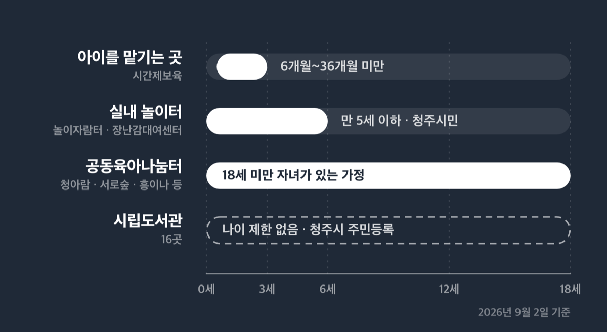
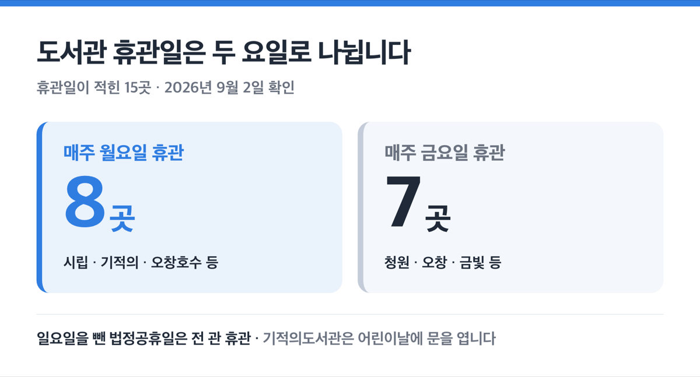
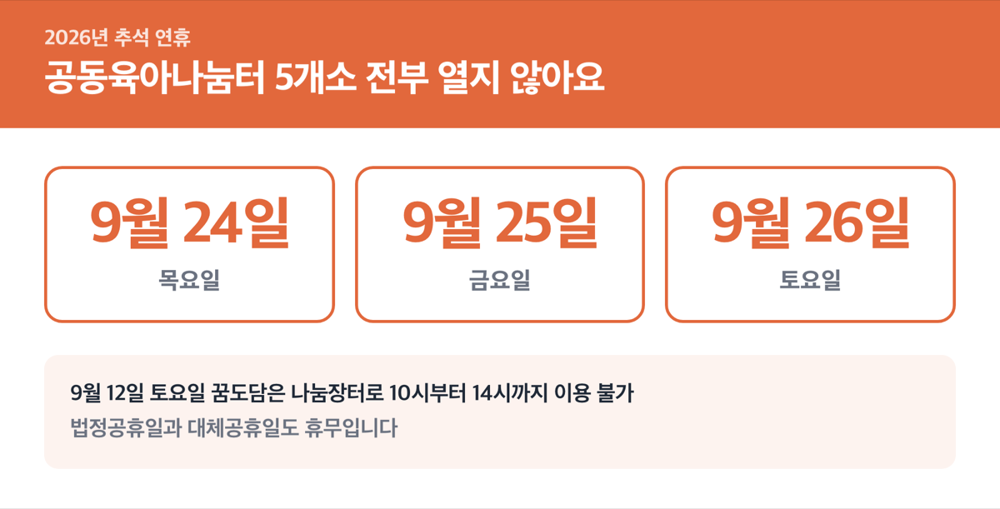
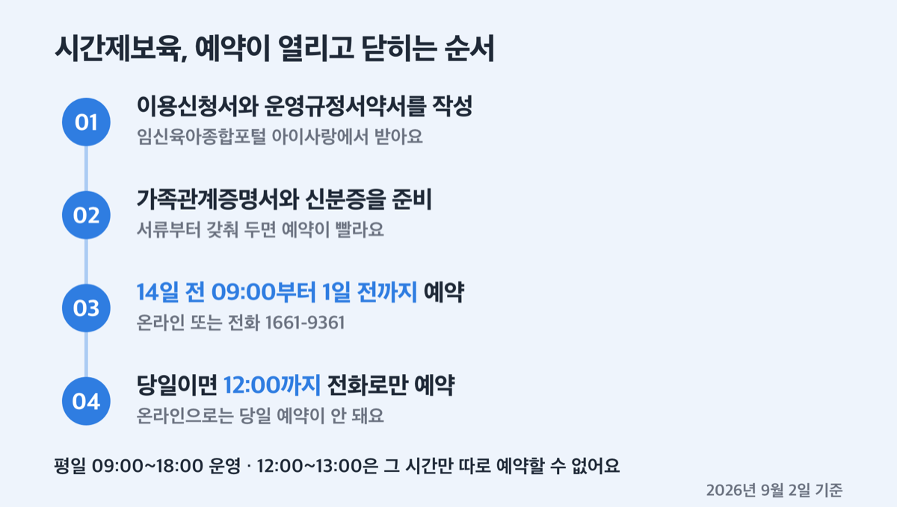

# 청주 아기랑 갈만한 곳, 2026 도서관 16곳과 실내 놀이터

📌 2026년 9월 2일 기준

청주 놀이자람터가 무료라고 알려져 있는데, 정확히는 연회비 1만원을 낸 정회원에게만 이용료가 없어요. 도서관 휴관일도 관마다 달라서 월요일에 쉬는 곳과 금요일에 쉬는 곳이 섞여 있습니다.

> [!WARNING]
> 아래 운영시간과 이용료는 2026년 9월 2일에 확인한 값이에요. 공동육아나눔터는 9월 운영시간이 일부 바뀐다고 공지돼 있어서, 10월 이후에 가실 때는 043-263-1817(내선 3번)로 다시 확인하세요. 도서관은 일요일을 뺀 법정공휴일에 전부 쉽니다.

**3줄 요약**

1. 청주에서 아기랑 갈 만한 실내 공간은 시립도서관 16곳, 육아종합지원센터 놀이자람터, 장난감대여센터 3개 지점, 공동육아나눔터 5개소, 국립청주박물관 어린이박물관이에요.
2. 2026년 9월 2일 기준으로 도서관 휴관일은 월요일과 금요일로 나뉘고, 놀이자람터와 장난감대여센터는 연회비 1만원(개인)을 낸 정회원에게 이용료가 없어요.
3. 출발 전에 확인할 것은 셋입니다 — 가려는 곳의 휴관일, 회원 가입 조건, 아이 나이 제한.

도서관 → 실내 놀이터 → 나눔터 → 아이를 맡기는 곳 순서로, 주소와 운영시간과 이용 조건을 함께 적었어요.

## 누구에게 맞고 누구에게 안 맞나

이 글은 **만 5세 이하 아이를 데리고 청주 안에서 움직이는 집**에 맞아요. 놀이자람터와 장난감대여센터가 만 5세 이하 영유아 자녀를 둔 청주시민을 대상으로 하고, 도서관 회원증도 청주시에 주민등록이 된 사람에게 나오기 때문이에요.

기준이 나이로 끊기는 곳과 주소로 끊기는 곳이 따로 있습니다.

- **나이로 끊는 곳** — 놀이자람터는 취학 전 영유아만 들어가요 *(초등학생은 형제라도 못 들어갑니다)*
- **주소로 끊는 곳** — 장난감대여센터는 청주시민 외에 청주시 소재 직장인도 가입돼요 *(등본에 재직증명서를 더 냅니다)*
- **가정양육수당으로 끊는 곳** — 시간제보육은 보육료·유아학비를 받지 않는 집만 대상이에요
- **자녀 나이만 보는 곳** — 공동육아나눔터는 18세 미만 자녀가 있는 가정이면 이용할 수 있어요

> 😕 우리 아이는 초등학생인데요?

그러면 이 글의 놀이자람터와 장난감대여센터는 맞지 않아요. 초등학생은 청주시 다함께돌봄센터가 맞습니다. 대상이 만 6~12세 아동이고, 이용료는 센터별 자율이지만 청주시가 운영하는 센터는 무료예요. 급식비와 간식비는 따로 냅니다. 문의는 043-201-1915입니다.

## 📚 어린이 도서관은 한 곳, 어린이자료실은 관마다 있어요

청주시 시립도서관 「도서관 현황」 목록에 오른 도서관은 16곳입니다. 그중 이름에 '어린이'가 붙은 곳은 청주신율봉어린이도서관 한 곳이에요. 나머지 관도 어린이자료실이나 아동자료실을 따로 두고 있고, 층은 관마다 달라요. 청주옥산도서관은 1층에 모자열람실이 있습니다.

이름을 보고 고르면 헛걸음이 됩니다. 목록은 이렇습니다.

| 도서관 (2026년 9월 2일 확인) | 주소 | 전화 |
|---|---|---|
| 청주시립도서관 | 상당구 용암로 55(용암동) | 043-201-4074 |
| 청주기적의도서관 | 서원구 구룡산로 356(수곡동) | 043-283-1845 |
| 청주오창호수도서관 | 청원구 오창공원로 102 | 043-201-4096 |
| 청주상당도서관 | 상당구 대성로 195(수동) | 043-201-4103 |
| 청주청원도서관 | 청원구 사뜸로 61번길 88-14(사천동) | 043-201-4129 |
| 청주오창도서관 | 청원구 오창읍 두릉유리로 1141-10 | 043-201-4144 |
| 청주금빛도서관 | 상당구 호미로 272(금천동) | 043-201-4136 |
| 청주내수도서관 | 청원구 내수읍 마산3길 49 | 043-201-4736 |
| 청주오송도서관 | 흥덕구 오송읍 오송생명1로 180 | 043-201-4167 |
| 청주서원도서관 | 서원구 분평로 35(분평동) | 043-201-4186 |
| 청주흥덕도서관 | 흥덕구 증안로90번길 34(복대동) | 043-201-4208 |
| 청주신율봉어린이도서관 | 흥덕구 신율로153번길 16(복대동) | 043-201-4225 |
| 청주강내도서관 | 흥덕구 강내면 가로수로 568 | 043-201-4196 |
| 청주옥산도서관 | 흥덕구 오산5길 10(오산리 250-3) | 043-201-4216 |
| 청주가로수도서관 | 흥덕구 서현서로 5(가경동) | 043-201-4235 |
| 청주열린도서관 | 청원구 상당로 314 문화제조창 본관 5층 | 043-241-0651 |

회원증은 두 갈래로 만듭니다. 홈페이지에서 회원가입한 뒤 '청주시민 거주지 확인' 절차를 거치면 모바일 회원증이 나오고, 방문 발급은 15개 시립도서관에서 해요. 목록은 16곳인데 회원증 발급처는 15곳으로 안내돼 있으니, 문화제조창 열린도서관에서 발급을 받으실 계획이면 043-241-0651로 먼저 물어보시는 게 빠릅니다.

영유아 회원증은 아이 서류만으로는 안 나와요. **보호자 신분증에 의료보험증이나 주민등록등본처럼 가족관계를 증명하는 서류를 함께 내야** 합니다. 아이 이름으로 만드는 카드인데 대리 발급이라, 보호자와 아이가 한 가족임을 확인하는 절차가 들어가서 그래요.

대출 규정은 아래와 같아요.

| 항목 | 값 (일반 회원 기준) |
|---|---|
| 대출 권수·기간 | 최대 10권, 대출일 포함 15일 |
| 연장 | 1회 7일 *(연체 도서나 예약된 책이 있으면 연장 불가)* |
| 예약 | 대출 중인 자료만, 관당 3권, 보관 3일 |
| 연체 | 연체일수만큼 대출 중지 |
| 분실·파손 | 같은 책으로 변상 |

주소를 같이하는 직계가족이 전원 정회원이면 모바일 가족회원을 신청할 수 있어요. 그러면 도서관별로 '가족 인원수 × 10권'을 빌립니다. 4인 가족이면 한 관에서 40권이 되는데, 이건 인원수에 10을 곱한 계산값이라 가족 수가 다르면 이 값이 아니에요. 신청 서류는 가족회원신청서와 신분증, 최근 3개월 이내 주민등록등본입니다. 문의는 도서관정책팀 043-201-4083이에요.

영유아 독서 사업 '청주아이러북'도 도서관에서 굴러갑니다. 책꾸러미는 그림책 2권과 양육자 가이드북, 가방으로 구성되고, 1단계(도리도리)는 **출생신고할 때 읍·면·동 행정복지센터 43개소에서 바로** 줘요. 2~4단계는 1~2세·3~4세·5~6세 유아 각 100명에게 가족그림책 독서축제 행사장에서 연 1회 배부합니다.

책놀이 프로그램은 3~4월과 9~11월에 각 8회씩 열려요. 대상은 8개월~4세(2022년생까지) 영유아와 양육자이고, 권역별 7개 도서관에서 운영하는데 안내문에 이름이 적힌 곳은 오송·시립·흥덕·가로수·오창호수·기적의도서관입니다. 신청은 각 도서관 홈페이지에서 **개강 2~3주 전 온라인으로** 받아요. 여기서 자주 놓치는 게 있습니다. 회차제라 개강일 기준으로 접수가 닫히고, 이수한 가정만 책놀이 품앗이 동아리로 이어져 도서와 재료, 모임 공간을 연중 지원받아요.

작은도서관도 선택지예요. 청주시에 등록된 작은도서관은 총 260곳이 등록됐고 152곳이 폐관해, 2026년 7월 기준으로 108곳이 남아 있습니다. 이 중 아파트가 운영하는 곳이 54곳이라 걸어갈 거리에 있을 가능성이 높아요. 등록 현황 문의는 043-201-4085입니다.

## 휴관일이 관마다 다릅니다 — 월요일이냐 금요일이냐

여기가 제일 많이 걸리는 대목이에요. 휴관일이 적힌 15곳 가운데 8곳은 월요일, 7곳은 금요일에 쉽니다. 한 도시 안에서 요일이 나뉘는 이유는 인접한 관이 같은 날 동시에 문을 닫지 않게 돌려 놓았기 때문이에요. 덕분에 월요일에도 갈 곳이 있습니다.

| 정기 휴관일 (2026년 9월 2일 확인) | 도서관 |
|---|---|
| 매주 월요일 | 시립·기적의·오창호수·상당·오송·옥산·내수·흥덕 |
| 매주 금요일 | 청원·오창·금빛·서원·강내·신율봉어린이·가로수 |

어린이·아동자료실 운영시간은 확인된 관 모두 09:00~18:00이에요. 다만 청주오창도서관 2층 아동자료실과 청주내수도서관 3층 아동자료실은 층별 시간이 따로 운영되니 043-201-4144, 043-201-4736으로 확인하고 가세요. 청주기적의도서관은 월요일 휴관이지만 **어린이날에는 문을 엽니다.**

공휴일 규칙은 전 관 공통이에요. 일요일을 제외한 법정공휴일에 쉬고, 설·추석 연휴가 일요일과 겹치면 그날도 휴관합니다.

오창호수도서관에는 아이 체험 공간이 두 개 더 있어요. 1층 창의공간 E.N.J.O.Y는 14:00~15:30과 16:00~17:30, 3층 호수상상놀이터 VROOM은 14:30~15:20과 15:30~16:20으로 운영하고 ==둘 다 일요일에는 열지 않아요==. 이용 대상 연령과 예약 방법은 043-201-4115로 확인하세요.

저라면 도서관은 가려는 관의 휴관일부터 보고 출발합니다. 요일이 두 갈래로 나뉘어 있으니, 아이 낮잠 시간에 맞춰 움직이는 집은 월요일 휴관 관과 금요일 휴관 관을 한 곳씩 정해 두는 편이 헛걸음을 줄여요.

## 실내 놀이터 — 연회비 1만원을 낸 정회원에게 이용료가 없어요

청주시육아종합지원센터 1층 놀이자람터가 아기 데리고 가는 실내 공간이에요. 주소는 청원구 내덕로 13-2, 전화는 043-222-6660입니다.

이용료 문구를 정확히 옮기면 이렇습니다. **회원가입과 연회비 납부, 구비서류 제출까지 마친 정회원에게 이용료가 없어요.** 연회비는 개인 1만원, 어린이집 같은 기관은 2만원입니다. 센터 안내 중 한 곳에는 이용료가 '무료'로만 적혀 있는데, 놀이자람터 이용안내와 장난감대여센터 이용수칙을 합쳐 읽으면 ==연회비 1만원을 낸 정회원== 기준이에요. 회원 카드 없이 가면 들어가지 못합니다.

| 항목 | 값 (2026년 9월 2일 확인) |
|---|---|
| 대상 | 만 5세 이하 영유아 자녀를 둔 청주시민 또는 어린이집 |
| 운영시간 | 화~금 09:00~18:00 / 토 09:00~17:00 |
| 점심시간 | 12:00~13:00 이용 불가 |
| 1회 이용 | 1일 1회 최대 2시간 *(평일 기관 이용은 09:30~11:30 한 타임)* |
| 휴관 | 일요일·월요일·법정공휴일·대체공휴일·소독기간 |
| 이용료 | 연회비 납부와 서류 제출을 마친 정회원은 없음 (연회비 개인 1만원 / 기관 2만원) |

규칙 넷을 미리 알고 가면 편해요. 보호자가 반드시 함께 있어야 하고, 감기나 전염성 질환이 의심되면 못 들어가요. 취학 전 영유아만 이용하고, 음식물은 반입 금지인데 **24개월 미만은 이유식만 '아기쉼터'에서 먹일 수 있습니다.** 놀잇감을 훼손하면 변상해야 해요.

같은 연회비로 장난감도 빌립니다. 지점이 세 곳이에요.

1. **내덕점** — 청원구 내덕로 13-2, 043-222-6660 *(놀이자람터와 같은 건물이에요)*
2. **오창점** — 청원구 오창읍 중심상업2로 32, 043-241-0121 *(택배 서비스를 이 지점이 운영해요)*
3. **성화점** — 서원구 성봉로 93, 관리동 2층, 043-237-2250

대여 조건은 개인 1회 2점, 기관 1회 3점이고 기간은 14일입니다. 홈페이지에서 7일 연장하면 최대 21일이에요. 연체료는 1일 1점당 500원이고 연체일수만큼 대여가 정지됩니다. 예약은 홈페이지에서 검색해 걸어 두고 당일 방문해 받는 방식이라, 당일에 안 가면 자동 취소돼요.

한 지점에 가입하면 세 지점 모두에서 빌릴 수 있어요. 다만 ==반납은 대여한 지점에서만== 되고, 대여 후 4일째부터 반납이 열립니다. 아이가 하루 만져 보고 흥미를 잃어도 그 주에 되돌릴 수 없다는 뜻이에요.

연회비가 면제되는 집도 있습니다. 국가유공자(부모)·장애인 가족·기초생활수급자·차상위계층·한부모가정·다문화가정, 그리고 두 자녀 이상 다자녀 가정은 증명서류를 내면 연회비 없이 씁니다. 그 밖의 집은 1만원을 냅니다.

저라면 청주에 살면서 만 5세 이하 아이를 키운다면 이 1만원은 먼저 냅니다. 장난감 대여료가 없고 놀이자람터 이용료도 정회원 기준으로 없으니, 장난감 한 점 값도 안 되는 금액으로 두 시설이 함께 열리기 때문이에요.

## 무료로 여는 곳 — 어린이박물관과 공동육아나눔터 5개소

국립청주박물관 어린이박물관은 입장료가 없어요. 상당구 명암로 143 청명관 안에 있고, 안내 전화는 043-229-6515입니다. 관람시간은 평일·주말·공휴일 09:30~17:30이고 매주 월요일과 1월 1일, 설날·추석 당일에 쉽니다. 월요일이 공휴일이면 그다음 첫 평일에 쉬어요.

예약제라는 점이 중요합니다. 온라인 예약과 현장 키오스크 예약으로 받고, 남은 인원만 현장에서 넣어 줘요. 아이 인원을 회차로 나눠 받는 구조라 주말 오후에 그냥 가면 들어가지 못할 수 있습니다.

영유아만을 위한 체험공간은 '꼬마 친구들의 박물관 운동회'예요. 반대로 '엉금엉금, 꼬마 친구들의 정글 탐험'은 성인과 만 4세 이하 어린이의 참여가 제한되니, 아기를 안고 들어가는 코스는 아닙니다. 야외에는 어린이놀이터가 있고 **높이 9m, 길이 25m 메가슬라이드**와 거울벽가든, 터널언덕, 모래마당이 놓여 있어요. 수유가 필요하면 상설전시실 로비 안 수유실이 화~일 09:00~18:00으로 열립니다.

공동육아나눔터는 18세 미만 자녀가 있는 가정이면 이용할 수 있어요. 운영시간 안에 방문해 자유롭게 쓰고, 장난감과 도서를 무료로 이용하며 '나눔터&joy 키트'를 매주 줍니다. 청주에는 5개소가 있어요.

| 나눔터 (2026년 9월 기준) | 운영시간 | 문의 |
|---|---|---|
| 청아람 | 평일 10~18시 | 043-211-1817 |
| 서로숲 | 평일 10~17시 30분 | 043-287-1817 |
| 흥이나 | 평일 10~18시 | 043-234-1817 |
| 상상해 | 평일 10~18시 | 043-296-1817 |
| 꿈도담 | 평일 10~18시, 토요일 10~16시 | 070-8856-1872 |

위치는 아래와 같아요.

1. **청아람** — 청원구 율량로 135, 대원칸타빌 3차 관리동 B3
2. **서로숲** — 서원구 산미로 143, 대원칸타빌 2차 관리동 2층
3. **흥이나** — 흥덕구 대신로 73번길 14, 금호어울림 1단지 관리동 B1
4. **상상해** — 상당구 목련로 27, 충북미래여성플라자 A동 202호
5. **꿈도담** — 서원구 무심서로 333, 청주시가족센터 2층 *(다섯 곳 중 토요일에 여는 유일한 곳이에요)*

토요일 계획이라면 저는 꿈도담부터 봅니다. 평일 10~18시만 여는 곳이 네 곳이라, 주중에 시간을 못 내는 집에는 선택지가 사실상 하나예요.

주의할 점이 둘 있습니다. 프로그램이 진행되거나 품앗이 그룹이 활동하는 시간에는 나눔터 이용이 제한돼요. 그리고 2026년 9월 24일(목)·25일(금)·26일(토)은 추석 연휴로 5개소 전부 열지 않고, 9월 12일(토) 꿈도담은 돌봄품앗이 나눔장터가 열려 10시부터 14시까지 이용할 수 없습니다. 법정공휴일과 대체공휴일도 휴무예요.

2~3가정 이상이 모이면 돌봄품앗이로 등록할 수 있어요. 월 1회 이상 모여 놀이·체험·교육 활동을 하면 그룹당 월 3만원 활동비와 나눔터 공간 대관을 지원합니다. 신청은 043-263-1817(내선 3번) 또는 rhdehddbrdk1817@naver.com으로 문의하세요.

## 아이를 시간 단위로 맡기는 곳과 자주 걸리는 것 넷

두 시간만 아이를 맡기고 싶을 때는 시간제보육이에요. 평일 09:00~18:00 운영이고 토·일요일과 법정공휴일에는 쉽니다. 12:00~13:00은 그 시간만 따로 예약할 수 없어요.

대상은 보육료나 유아학비를 지원받지 않고 **가정양육수당을 받는 6개월 이상 36개월 미만 영아**입니다. 어린이집에 다니지 않는 집을 위한 제도라 그래요. 지원 시간은 월 60시간이고, 이용단가는 시간당 5,000원인데 정부지원 3,000원과 본인부담 2,000원으로 나뉩니다.

시간당 본인부담 2,000원이니 월 60시간을 다 쓰면 12만원이에요. 단가에 시간을 곱한 값이라 실제 이용 시간이 적으면 그만큼 줄어듭니다.

결제 방식이 함정입니다. 아이사랑카드나 아이행복카드(국민행복카드)로 결제해야 정부보조금이 붙어요. 현금으로 내면 전액 본인 부담입니다.

예약 순서는 이렇습니다.

1. 임신육아종합포털 아이사랑(www.childcare.go.kr)에서 시간제보육 이용신청서와 운영규정서약서를 받아 작성해요
2. 가족관계증명서와 신분증을 준비합니다
3. **이용일 기준 14일 전 09:00부터 이용일 1일 전까지** 온라인이나 전화(1661-9361)로 예약해요
4. 당일 예약이 필요하면 전화로만, 이용 당일 12:00까지 넣습니다

마지막으로 공식 안내를 그대로 읽으면 놓치는 것 넷을 모았어요.

1. **'무료'라는 표기** — 놀이자람터와 장난감 대여료에 붙은 무료는 연회비 1만원을 낸 정회원 기준이에요. 회원 카드 없이 가면 이용하지 못해요
2. **한 가정에 한 명** — 장난감대여센터 회원가입은 한 가정당 한 명이고, 증명서류는 1년마다 다시 냅니다. 등본에 가입 아동이 올라 있어야 해요
3. **반납 지점과 반납 시점** — 대여한 지점에서만 반납되고, 대여 후 4일째부터 열려요. 회원카드를 잃어버려 재발급하면 1,000원이고 가입 지점에서만 됩니다
4. **연휴와 프로그램 시간** — 도서관은 일요일을 뺀 법정공휴일에 쉬고, 나눔터는 프로그램 중에 이용이 제한돼요

## 청주 아기랑 갈만한 곳 관련 궁금증 해결

**Q. 청주에 어린이 도서관이 몇 곳인가요?**

A. 이름에 '어린이'가 붙은 곳은 청주신율봉어린이도서관 한 곳입니다. 흥덕구 신율로153번길 16에 있고 1층이 유아·아동자료실이에요. 전화는 043-201-4225입니다. 나머지 관도 어린이자료실이나 아동자료실을 두고 있으니, 이름이 아니라 집에서 가까운 관의 휴관일로 고르시는 게 맞아요.

**Q. 아기 데리고 갔을 때 수유는 어디서 하나요?**

A. 확인된 곳은 넷이에요. 청주서원도서관 2층 어린이 자료실에 유아실과 수유실이 함께 있고, 청주옥산도서관 1층에는 모자열람실이 있습니다. 국립청주박물관은 상설전시실 로비 안 수유실을 화~일 09:00~18:00으로 열고, 청주시육아종합지원센터에는 아기쉼터가 있어요. 다른 관은 방문 전 해당 도서관 전화로 확인하세요.

**Q. 장난감을 택배로 받을 수 있나요?**

A. 오창점이 택배 서비스를 운영해요. 정회원 중 영유아 자녀가 있는 임산부 가정, 장애아 가정, 다자녀 가정(미취학 자녀 셋 이상 또는 36개월 이하 자녀 둘 이상)이 대상이고 배송지는 청주시 관내로 한정됩니다. 이용료는 배송비와 회수비를 합쳐 6,000원이에요. 중형 장난감 1점(최대 700×450×500mm)을 16일 빌리고 연장은 안 되며, 연체료는 1일 500원입니다. 전용 박스를 잃어버리면 8,000원, 충전재는 3,000원이 청구돼요.

**Q. 책은 한 번에 몇 권까지 빌리나요?**

A. 일반 회원은 최대 10권, 대출일 포함 15일이고 1회 7일 연장돼요. 가족이 모두 정회원이면 모바일 가족회원으로 도서관별 '가족 인원수 × 10권'을 빌립니다. 그림책은 얇아서 열 권이 금방 차니, 아이 책과 양육자 책을 같이 빌리려면 가족회원 신청을 먼저 하시는 게 좋아요.

**Q. 놀이자람터 예약은 꼭 해야 하나요?**

A. 평일 오전 이용은 예약이 필요하고 토요일은 예약제로 운영돼요. 1일 1회 최대 2시간 기준이라 회차로 나눠 받기 때문입니다. 예약 방법과 남은 회차는 043-222-6660으로 확인하세요.

청주는 시설 자체보다 요일이 문제인 도시예요. 도서관 휴관일이 월요일과 금요일로 나뉘고, 놀이자람터와 장난감대여센터는 일요일과 월요일에 쉬고, 나눔터 네 곳은 평일만 엽니다. 그래서 집 근처 세 곳의 휴관일을 냉장고에 적어 두는 것만으로 헛걸음이 줄어요. 연회비 1만원은 그다음에 결정하셔도 됩니다.

참고: 청주시 시립도서관 「도서관 현황」·「이용시간 및 휴관일」·「대출/반납/예약/연장」·「회원가입안내」·「청주아이러북」·「작은도서관 현황」 · 청주시육아종합지원센터 「놀이자람터 이용안내」·「시간제보육」 · 청주시장난감대여센터 「이용안내」·「이용수칙」·「택배서비스 이용안내」 · 청주시 가족센터 「공동육아나눔터」 안내 · 국립청주박물관 「관람안내」·「주요시설」·「편의시설」 · 청주시청 「다함께돌봄센터」 · 정부24 「공동육아나눔터 운영」
