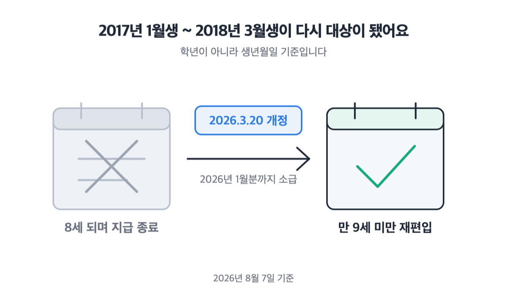
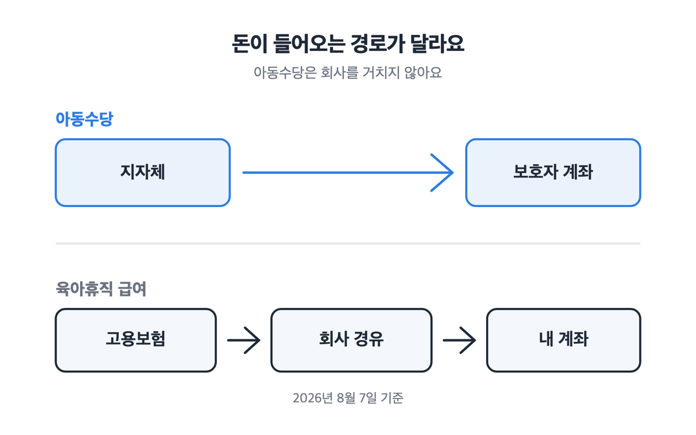
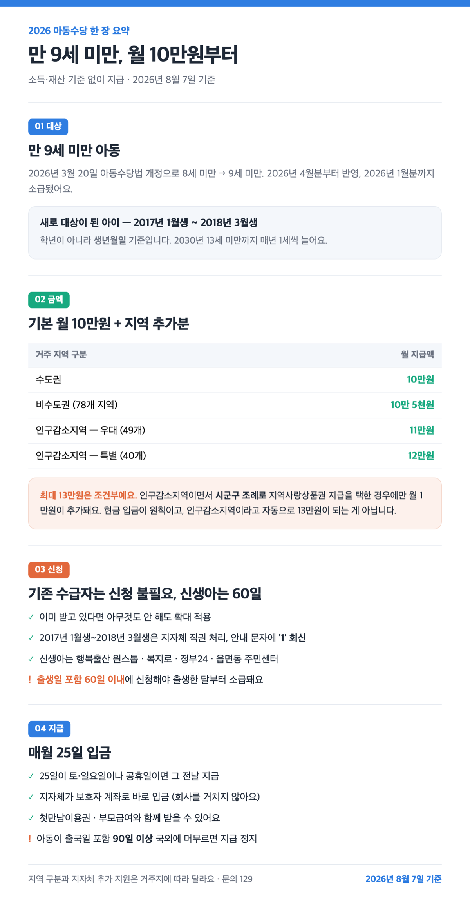

📌 2026년 8월 7일 기준
결론부터요. 2026년 아동수당은 ==만 9세 미만==이면 소득에 상관없이 월 10만원, 사는 지역과 지자체의 상품권 지급 여부에 따라 조건이 맞으면 최대 13만원이에요. 기존 수급자는 신청할 필요가 없고, **신생아는 출생일 포함 60일이 기한입니다.**

## 새로 받게 된 건 2017년 1월생~2018년 3월생이에요

2026년 3월 20일 아동수당법이 개정되면서 지급 연령이 8세 미만에서 9세 미만으로 올라갔어요. 실제 지급은 2026년 4월분부터 반영됐고, 2026년 1월분까지 소급됐고요.

여기서 헷갈리기 쉬운 게 하나 있어요. 기준은 학년이 아니라 **생년월일**입니다. 초등학교 1학년이라고 다 되는 게 아니라, ==2017년 1월생부터 2018년 3월생까지==가 이번에 다시 대상이 됐어요. 한 번 지급이 끝났다가 되살아난 경우죠.

2017년생은 특례가 따로 있어요. 단계적 확대 과정에서 지급이 중간에 끊기지 않도록, ==13세가 되기 전까지 이어서 받게 돼 있어요==.

## 2030년 13세 미만까지 매년 1세씩 늘어요

법에 2026년부터 2030년까지의 확대 일정이 이미 들어가 있어요. 매년 1세씩입니다.

| 연도 | 지급 대상 (만 나이) |
|---|---|
| 2025년 | 8세 미만 |
| **2026년** | **9세 미만** |
| 2027년 | 10세 미만 |
| 2028년 | 11세 미만 |
| 2029년 | 12세 미만 |
| 2030년 | 13세 미만 |

지금 아이가 9세라 대상에서 빠졌더라도 내년에 다시 들어올 수 있어요. 해마다 1월에 한 번씩 확인해 보세요.

")

## 수도권은 10만원, 최대 13만원이 되는 조건은 따로 있어요

기본 지급액은 전국 어디나 월 10만원이에요. 연령대별 차등은 없고요. 여기에 비수도권과 인구감소지역이면 지역 추가분이 더해져요.

| 거주 지역 구분 | 2026년 월 지급액 |
|---|---|
| 수도권 | 10만원 |
| 비수도권 (78개 지역) | 10만 5천원 |
| 인구감소지역 — 우대지역 (49개) | 11만원 |
| 인구감소지역 — 특별지역 (40개) | 12만원 |

> [!WARNING]
> 근데 "최대 13만원"에는 조건이 하나 더 있어요. 인구감소지역에서 아동수당을 지역사랑상품권으로 지급하는 경우에 매월 1만원어치가 추가돼요. 현금 입금이 원칙이고, 상품권 지급은 **시군구 조례로 정한 곳만** 해당해요. 주민 의견 수렴과 조례 제·개정을 거쳐 2026년 하반기부터 지역별로 자율 시행돼요. 인구감소지역이라고 자동으로 13만원이 되는 게 아닙니다.

")

## 내 지역 구분은 통장에 찍힌 금액으로 확인해요 💡

저희 집은 수도권 거주 기준으로 매달 10만원이 계좌에 들어와요. 회사 급여명세에는 아무것도 안 찍혀요. **지자체가 보호자 계좌로 바로 넣어주거든요.** 이 점이 [육아휴직 급여](/posts/childcare-childbirth/childcare-leave-2026/)와 달라요. 그쪽은 고용보험에서 나오고 회사를 거치는 절차가 있어요.

> [!TIP]
> 그래서 입금액을 보면 자기 지역 구분을 어느 정도 짐작해 볼 수는 있어요. 10만원이면 수도권, 10만 5천원이면 비수도권 쪽이겠죠. 다만 이걸로 확정할 수 있는 건 아니에요. 금액이 예상과 다르면 혼자 판단하지 마시고 주소지 읍면동 행정복지센터나 보건복지상담센터(129)에 문의하세요. 지역 구분과 지자체 추가 지원은 사는 곳에 따라 다르니 꼭 확인해 보시고요.

## 기존 수급자는 신청 불필요, 신생아는 60일이 기한입니다

이미 아동수당을 받고 있다면 아무것도 안 해도 확대가 적용돼요. 저희도 별도 절차 없이 그대로 들어왔어요.

지급이 끝났다가 다시 대상이 된 2017년 1월생~2018년 3월생은 지자체가 직권으로 신청 처리해 순차 지급해요. 기존 지급 정보를 바탕으로 보호자에게 문자가 가요. 바뀐 정보가 없으면 **'1'로 회신**하면 되고요. 계좌나 주소가 바뀌었으면 주소지 행정복지센터에 방문해 신청하면 돼요.

새로 태어난 아이는 이야기가 달라요.

1. 출생신고할 때 [행복출산 원스톱 서비스](https://www.gov.kr/portal/onestopSvc/happyBirth)로 함께 신청
2. 또는 [복지로](https://www.bokjiro.go.kr)·[정부24](https://www.gov.kr)에서 온라인 신청 (보호자가 부모인 경우만 가능해요)
3. 또는 전국 읍면동 주민센터 방문 — 신청서와 신분증을 챙기세요

안내 페이지 중에는 갱신이 늦어 개정 전 연령인 8세 미만이 아직 남아 있는 곳도 있는데, 2026년 기준 대상은 9세 미만이 맞아요.

> [!WARNING]
> **출생일을 포함해 60일 안에 신청해야 출생한 달부터 소급해서 받습니다.** 60일이 지나면 신청한 달부터만 나와요. 그 전 달분은 소급되지 않습니다.

")

## 지급일은 매월 25일, 부모급여·첫만남이용권과 같이 받아요

돈은 ==매월 25일==에 들어와요. 25일이 토·일요일이나 공휴일이면 그 전날에 지급되고요.

소득과 재산은 보지 않아요. 대한민국 국적에 주민등록번호가 정상 부여된 아동이면 됩니다. 다만 아이가 ==출국일을 포함해 90일 이상 국외에 머무르면 지급이 정지돼요.==

그리고 아동수당은 [첫만남이용권](/posts/childcare-childbirth/first-meeting-voucher-2026/), 부모급여와 함께 받을 수 있어요. 셋 중 하나를 골라야 하는 게 아니에요. 참고로 2026년 부모급여는 0세 월 100만원, 1세 월 50만원이고요. 아동수당은 이와 별개로 9세 미만까지 계속 나와요. 🍼

> [!ACTION]
> 아이가 2017년 1월생~2018년 3월생인데 아직 안내 문자를 못 받았다면, 주소지 행정복지센터에 지급 정보가 제대로 있는지 한 번 물어보세요.

참고: 보건복지부 「아동수당 지급」 정책 안내 및 2026년 4월 보도자료 · 국가법령정보센터 아동수당법 · 정부24 아동수당 · 행정안전부 인구감소지역 지정

