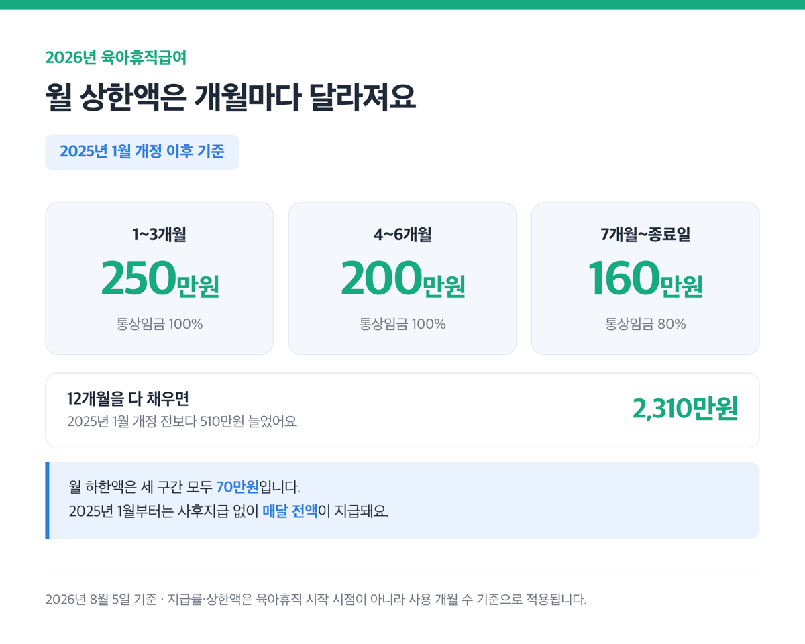
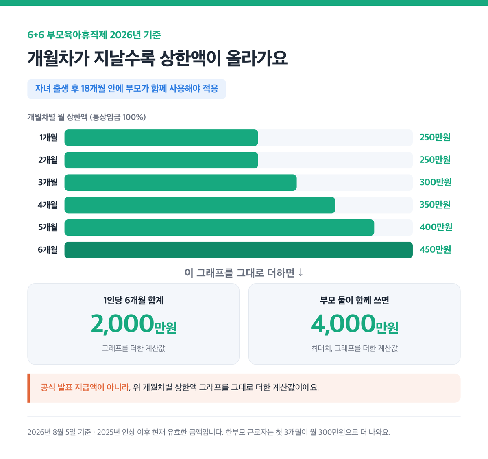
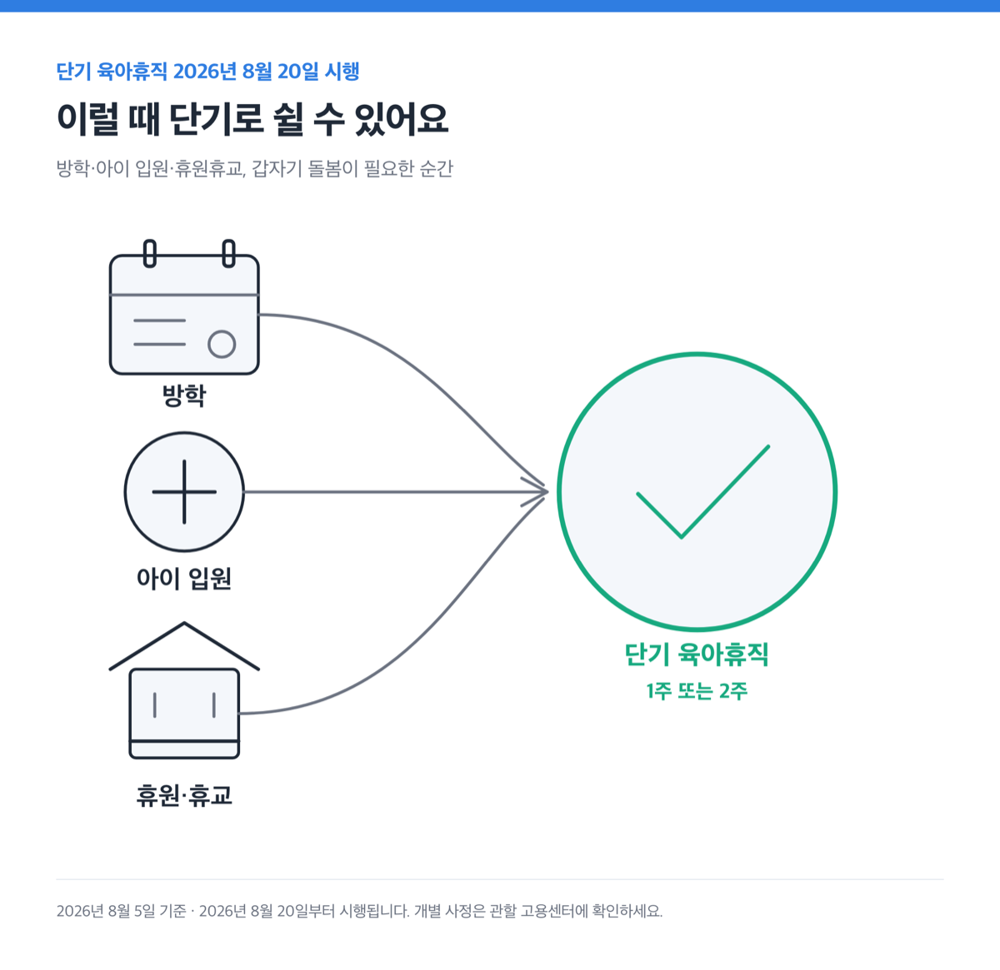
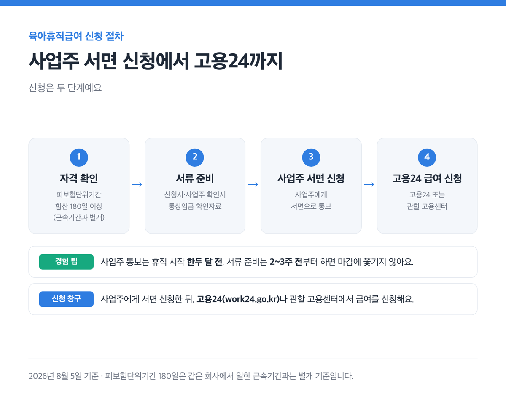
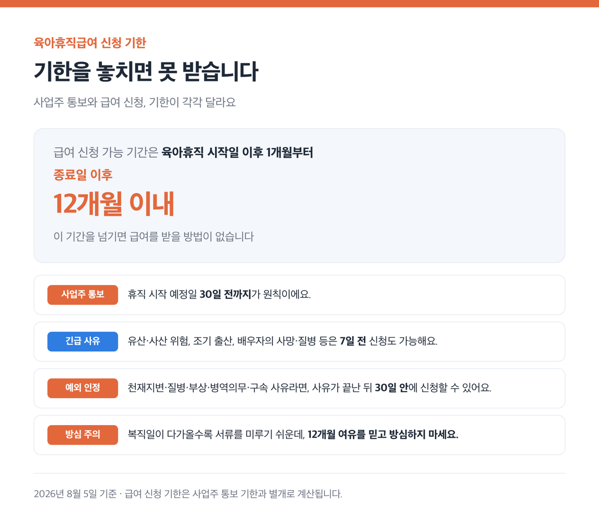

2026년 8월 5일 기준

> [!SUMMARY] 2026년 8월 5일 기준
> 결론부터요. 2026년 육아휴직급여는 최대 월 250만원이고, 만 8세 이하 자녀를 둔 근로자면 신청할 수 있어요. 오늘(8월 5일)로부터 보름 뒤인 8월 20일부터는 방학이나 아이가 아플 때 1~2주 쓰는 단기 육아휴직도 생깁니다.

근데 급여 구조는 개월 수마다 다르고, 부부가 같이 쓰면 계산법이 또 달라져요.

## ■ 급여와 사용기간, 얼마 받고 얼마나 쓰나요

육아휴직급여는 최대 월 250만원에서 시작해 개월이 지날수록 상한이 낮아져요.

| 기간 | 지급률 | 월 상한액 | 월 하한액 |
|---|---|---|---|
| 1~3개월 | 통상임금 100% | 250만원 | 70만원 |
| 4~6개월 | 통상임금 100% | 200만원 | 70만원 |
| 7개월~종료일 | 통상임금 80% | 160만원 | 70만원 |

2025년 1월 개정 전에는 전 기간 80%, 월 상한 150만원이었어요. 12개월을 다 채우면 지금은 ==총 2,310만원==으로, 개정 전보다 510만원 늘었어요.

예전엔 급여의 25%를 나중에 줬는데, 2025년 1월부터 매달 전액이 나옵니다.

실제로 신청해보니 급여가 일주일 안으로 계좌에 들어왔어요.

사용 기간은 부모 한 명 기준으로 기본 1년 이내예요. 부모가 각각 3개월 이상 썼거나 한부모, 중증장애아동 부모라면 6개월이 더해져 1년 6개월까지 늘어나요. 분할은 최대 4회까지 되는데, 기간 연장 여부와 상관없이 누구나 쓸 수 있어요.

근데 일부 페이지엔 아직 "최대 1년"으로만 나와요. 2025년 2월 개정 전 기준이 아직 남아있는 걸로 보이고, 지금은 조건을 채우면 1년 6개월까지 늘릴 수 있어요.

## ■ 부부가 같이 쓰면 6+6, 계산이 확 달라져요

부부가 같이 쓰면 최대 4,000만원까지 계산돼요. 자녀가 태어난 지 18개월 안에 부모가 함께 육아휴직을 써야 6+6 부모육아휴직제가 적용됩니다.

이름 때문에 헷갈리기 쉬운데, 2022년 3+3에서 2024년 1월 6+6으로 확대된 뒤 지금까지 이름이 그대로예요.

첫 6개월은 통상임금 100%를 받고, 개월마다 상한액이 달라요.

| 개월차 | 1개월 | 2개월 | 3개월 | 4개월 | 5개월 | 6개월 |
|---|---|---|---|---|---|---|
| 상한액 | 250만원 | 250만원 | 300만원 | 350만원 | 400만원 | 450만원 |

이 표를 그대로 더하면 한 사람당 6개월 합계가 2,000만원이에요. 부모 둘이 함께 쓰면 ==최대 4,000만원==까지 계산됩니다.

2024년 시행 초엔 1개월차 상한이 200만원이라 1인당 1,950만원·합산 3,900만원이었어요. 2025년 인상 후 지금은 2,000만원·4,000만원이 맞아요.

한부모 근로자는 첫 3개월 급여가 월 300만원으로 더 나와요. 2026년 상반기 기준 남성 육아휴직 수급자 비율도 38.8%까지 늘었어요.

실제로 저희 부부는 6+6을 동시에 썼는데, 통장에 찍힌 금액이 위 표와 그대로 맞아떨어졌어요. 1개월차 250만원, 3개월차 300만원까지 딱 표 그대로였어요.

계산기를 두드릴 필요도 없었어요.

## ■ 8월 20일부터 방학 중 단기 육아휴직이 생겨요 📅

2026년 8월 20일부터 단기 육아휴직이 새로 시행됩니다.

만 8세 이하 또는 초등학교 2학년 이하 자녀가 갑자기 입원하거나, 어린이집·학교가 휴원·휴교하거나, 방학을 맞았을 때 쓸 수 있어요.

연 1회, 1주 또는 2주 단위로 써요. 쓴 날만큼 육아휴직 기간에서 차감되지만, '4회 분할' 횟수에는 들어가지 않아요.

급여는 원래 받던 육아휴직급여를 7일이나 14일 분으로 환산해서 나와요.

방학 때마다 아이 맡길 곳이 마땅찮아 고민이셨다면, 8월 20일 이후로 이 제도를 확인해 보세요.

## ■ 신청은 이 순서로 하면 돼요

> [!WARNING]
> 급여를 받으려면 자격부터 확인해야 해요. 육아휴직 시작일 전 고용보험 가입기간(피보험단위기간)이 ==합산 180일 이상==이어야 하고, 이건 같은 회사에서 일한 근속기간과는 별개예요.

신청은 두 단계예요. 사업주에게 서면으로 신청한 뒤, [고용24](https://www.work24.go.kr/cm/c/f/1100/selecSystInfo.do?systId=SI00000402)나 관할 고용센터에서 급여를 신청해요.

신청서, 사업주가 작성하는 확인서, 통상임금 확인 자료가 필요해요.

저는 사업주 통보를 휴직 시작 한두 달 전에 했고, 서류 작업은 2~3주 전부터 준비했어요. 미리 움직이니 마감에 쫓기지 않았어요.

## ■ 기한을 놓치면 못 받습니다 ⏰

사업주 통보는 휴직 시작 예정일 30일 전까지가 원칙이에요. 유산·사산 위험이나 조기 출산, 배우자의 사망·질병 같은 긴급한 사유가 있으면 7일 전에 신청해도 돼요.

> [!WARNING]
> 급여 신청 기한은 따로 있어요. 육아휴직을 시작한 날 이후 1개월부터, ==끝난 날 이후 12개월 이내==에 신청해야 합니다.
>
> 이 기간을 넘기면 급여를 받을 방법이 없습니다.

근데 천재지변·질병·부상·병역의무·구속 같은 사유로 기한을 못 지켰다면, 사유가 끝난 뒤 30일 안에 신청할 수 있어요.

> [!TIP]
> 복직일이 다가올수록 서류를 미루기 쉬운데, 12개월 여유를 믿고 방심하지 마세요.

## ■ 대상 나이가 헷갈려요, 육아휴직과 육아기 근로시간단축은 달라요

두 제도는 이름이 비슷해서 자주 헷갈리는데, 대상 나이가 달라요.

| 제도 | 대상 자녀 나이 |
|---|---|
| 육아휴직(단기 육아휴직 포함) | 만 8세 이하 또는 초등학교 2학년 이하 |
| 육아기 근로시간 단축 | 만 12세 이하 또는 초등학교 6학년 이하 |

육아휴직은 입양 자녀도 포함돼요.

육아기 근로시간 단축은 2025년 2월 23일 개정으로 대상이 8세에서 12세로 넓어졌어요. 육아휴직 자체의 대상 나이는 이번 개정으로 바뀌지 않았습니다.

근데 급여 구조는 육아휴직급여와 조금 달라요. 신청 기한 구조(시작일 이후 1개월부터 종료일 이후 12개월 이내)는 육아휴직급여와 같아요.

## ■ 복귀했는데 자리가 없다면

법은 육아휴직을 이유로 한 해고나 불리한 처우, 휴직 중 해고를 금지하고 있어요.

복귀할 때는 휴직 전과 동등한 업무·임금으로 돌아가야 하고, 육아휴직 기간도 근속기간에 들어가요. 어기면 3년 이하 징역이나 3천만원 이하 벌금에 처해지고, 복귀를 거부하면 500만원 이하 벌금이 부과됩니다.

근데 현실은 다르게 흘러가기도 해요. 저도 육아휴직을 마치고 복귀하려던 시점에 돌아갈 자리가 없다는 얘기를 들었고, 회사는 저를 권고사직으로 처리했어요. 그 뒤로 실업급여(구직급여) 절차를 밟았어요.

> [!ACTION]
> 이런 상황을 겪었다면 혼자 판단하지 말고 관할 노동위원회나 고용노동부에 먼저 문의하세요. 개별 사정은 그쪽에서 확인받는 게 정확해요.
>
> 급여 신청과 제도 확인은 고용24에서 한 번에 돼요. 8월 20일부터 생기는 단기 육아휴직도 같은 곳에서 안내받을 수 있어요.

참고: 고용노동부 「육아지원제도 안내」 · 국가법령정보센터 고용보험법 시행령 · 정부24 부모 육아휴직 확대 정책 안내 · 찾기쉬운 생활법령정보(법제처)
