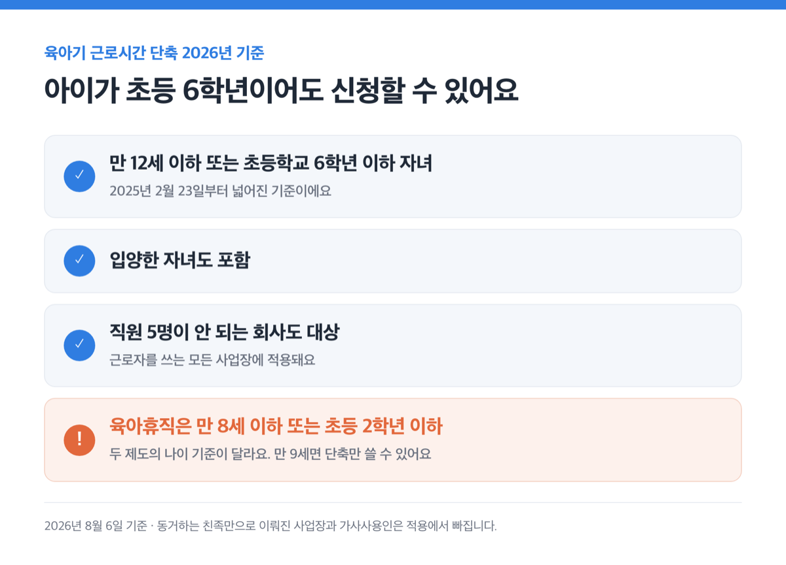
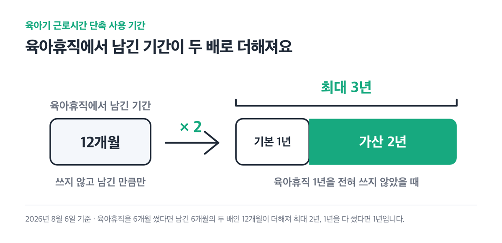
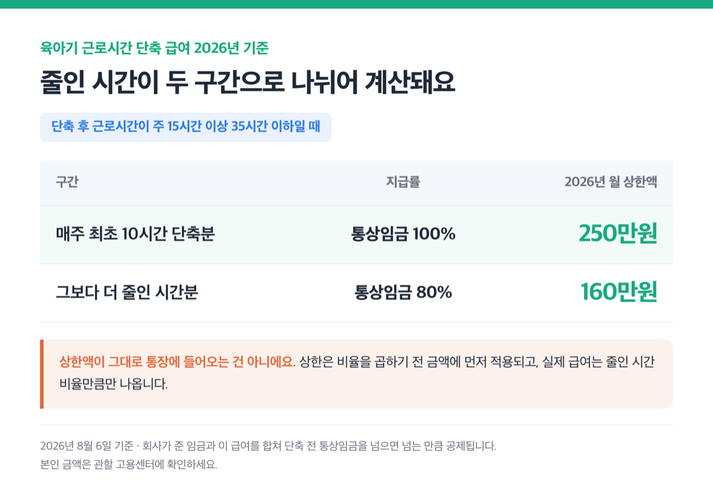
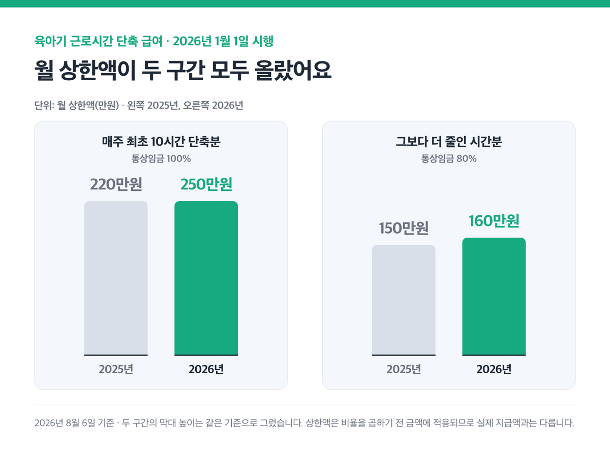
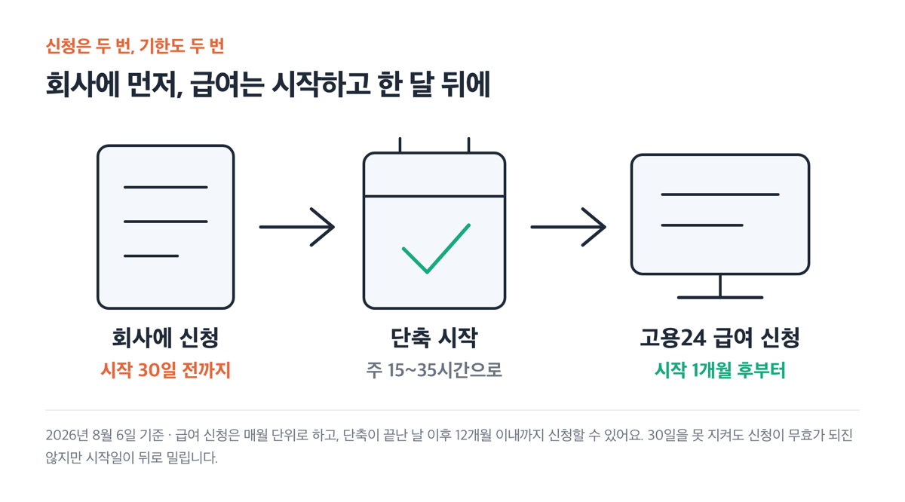
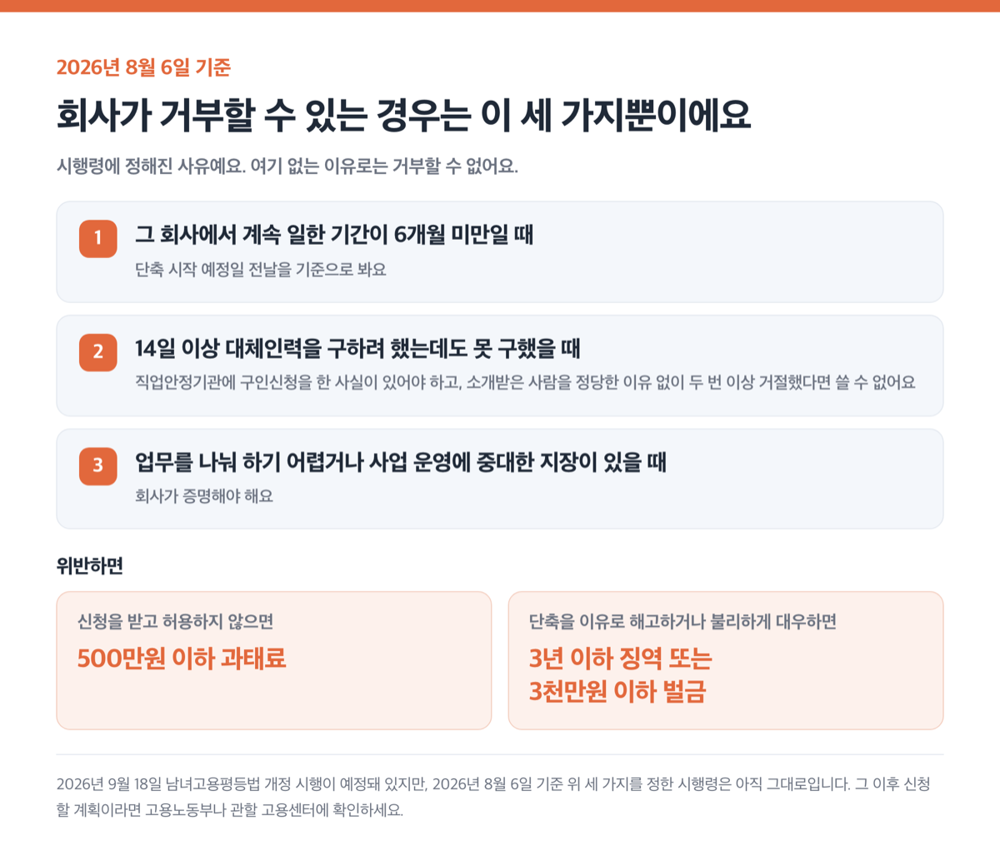
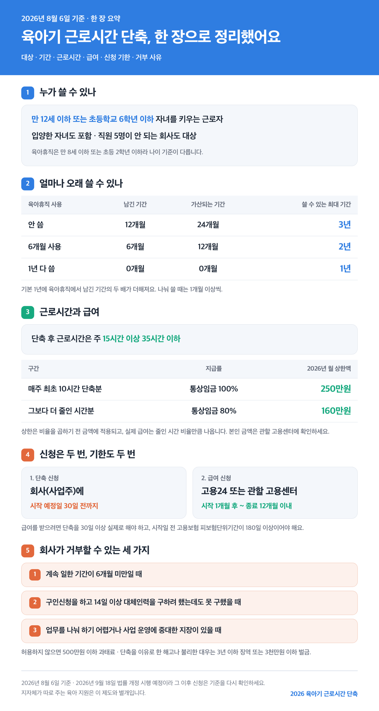

2026년 8월 6일 기준

> [!SUMMARY] 2026년 8월 6일 기준
> 결론부터요. 만 12세 이하 또는 초등학교 6학년 이하 자녀를 키우면 신청할 수 있어요. 다만 ==회사가 거부할 수 있는 사유가 따로 정해져 있습니다==. 2026년 급여는 매주 최초 10시간 단축분에 통상임금의 100%(월 상한 250만원)가 나오고, 신청은 ==시작 30일 전까지== 회사에 하셔야 합니다.

근데 이 제도에서 진짜 중요한 건 따로 있어요. 육아휴직을 얼마나 안 썼느냐가 단축을 얼마나 오래 쓸 수 있는지를 결정해요.

## 아이가 초등학교 6학년이어도 쓸 수 있어요

대상은 만 12세 이하 또는 초등학교 6학년 이하 자녀를 키우는 근로자예요. 입양한 자녀도 포함돼요.

원래는 만 8세 이하 또는 초등학교 2학년 이하였는데, 2025년 2월 23일부터 대상이 넓어졌어요.

근데 육아휴직은 아직 만 8세 이하 또는 초등학교 2학년 이하예요. 두 제도의 나이 기준이 다릅니다. 아이가 만 9세라면 육아휴직은 못 쓰지만 육아기 근로시간 단축은 쓸 수 있어요. 육아휴직 쪽 조건은 [2026 육아휴직 정리](/posts/childcare-childbirth/childcare-leave-2026/)에 따로 적어 뒀어요.

직원이 다섯 명이 안 되는 회사도 대상이에요. 법이 근로자를 쓰는 모든 사업장에 적용되고, 동거하는 친족만으로 이뤄진 사업장과 가사사용인만 빠지거든요.

## 육아휴직을 남겨 뒀다면 최대 3년까지 늘어나요

기본은 1년이에요. 여기에 육아휴직 1년 중 쓰지 않고 남긴 기간의 두 배가 더해져요.

| 육아휴직 사용 (1년 기준) | 남긴 기간 | 가산되는 기간 | 단축을 쓸 수 있는 최대 기간 |
|---|---|---|---|
| 안 씀 | 12개월 | 24개월 | 3년 |
| 6개월 | 6개월 | 12개월 | 2년 |
| 1년 다 씀 | 0개월 | 0개월 | 1년 |

2025년 2월 23일 전에는 남긴 기간을 그대로 더해 최대 2년이었어요. 같은 날부터 나눠 쓰는 최소 단위도 3개월에서 1개월로 줄었고요. 한 번에 1개월 이상씩 쪼개 쓸 수 있습니다.

> [!WARNING]
> 근데 순서를 잘못 잡으면 기간이 확 줄어요. 육아휴직을 1년 다 쓰고 나면 ==단축은 1년만 남아요==.

고용노동부가 [사용기간·잔여기간 계산기](https://www.moel.go.kr/policy/policydata/view.do?bbs_seq=20250500924) 엑셀 파일을 정책자료로 올려 뒀어요. 나눠 쓴 회차를 넣으면 남은 기간이 나와요.

## 주 몇 시간으로 줄이느냐가 곧 급여예요 💡

단축한 뒤 근로시간은 주 15시간 이상 35시간 이하여야 해요. 주 40시간 일하다가 36시간으로만 줄이면 이 제도에 해당하지 않아요.

급여는 두 구간으로 나눠 계산해요.

| 구간 | 지급률 | 2026년 월 상한액 |
|---|---|---|
| 매주 최초 10시간 단축분 | 통상임금 100% | 250만원 |
| 그보다 더 줄인 시간분 | 통상임금 80% | 160만원 |

2025년까지는 각각 220만원과 150만원이었고, 2026년 1월 1일부터 250만원과 160만원으로 올랐어요.

근데 이 상한액이 통장에 그대로 들어오는 건 아니에요. 상한은 비율을 곱하기 전 금액에 먼저 적용되고, 실제 급여는 줄인 시간 비율만큼만 나와요.

산정식에 숫자를 직접 넣어 볼게요. 통상임금이 월 250만원이고 주 40시간에서 20시간으로 줄인 경우예요.

- 최초 10시간분 → 250만원 × 10 ÷ 40 = 62.5만원
- 나머지 10시간분 → 250만원의 80%인 200만원에 상한 160만원이 적용, 160만원 × 10 ÷ 40 = 40만원
- 합계 → 월 102.5만원

이건 공식 산정식에 숫자를 대입해 직접 계산해 본 값이에요. 통상임금과 단축 시간에 따라 달라지니 본인 금액은 관할 고용센터에 확인하세요.

회사가 준 임금과 이 급여를 합친 금액이 단축 전 통상임금을 넘으면, 넘는 만큼은 급여에서 공제됩니다.

## 신청은 두 번, 기한도 두 번이에요 ⏰

회사에 내는 신청과 급여 신청이 따로예요.

| 순서 | 어디에 | 기한 |
|---|---|---|
| 1. 단축 신청 | 회사(사업주) | 단축 시작 예정일 30일 전까지 |
| 2. 급여 신청 | 고용24 또는 관할 고용센터 | 시작한 날 이후 1개월부터, 끝난 날 이후 12개월 이내 |

회사에 낼 문서에는 자녀 이름과 생년월일, 단축 시작일과 종료일, 단축 기간의 출근·퇴근 시각을 적어요.

> [!TIP]
> 30일을 못 지켰다고 신청이 무효가 되진 않아요. 다만 회사가 신청일부터 30일 이내에서 시작일을 정해 허용하게 돼요. 그만큼 시작이 뒤로 밀립니다.

단축 기간 중 근로조건은 회사와 서면으로 정해야 해요.

급여를 받으려면 단축을 30일 이상 실제로 해야 하는데, 출산전후휴가와 겹치는 기간은 이 30일에서 빠집니다. 그리고 시작일 전에 고용보험 피보험단위기간(보수 지급의 기초가 된 날을 합쳐 세는 기간이에요)이 180일 이상이어야 해요. 전에 실업급여를 받은 적이 있다면, ==그 실업급여와 연결된 고용보험 자격 상실일 이전 기간은 180일 계산에 들어가지 않습니다==. [고용24](https://www.work24.go.kr)에 로그인해 '육아기 근로시간 단축 급여 신청' 메뉴에서 매월 단위로 신청해요.

첫 신청에는 사업주가 작성한 확인서가 필요하고, 임금대장이나 근로계약서 같은 근로조건 확인 자료도 함께 내요. 수수료는 없고 처리기간은 5일 이내예요.

근데 단축 기간 중에 회사를 옮기면 그 뒤로는 급여가 나오지 않습니다.

## 회사가 거부할 수 있는 경우는 딱 세 가지예요

회사는 신청을 받으면 허용해야 해요. 거부할 수 있는 경우가 시행령에 세 가지로만 정해져 있어요.

1. 단축 시작 전날까지 그 회사에서 계속 일한 기간이 6개월이 안 될 때
2. 직업안정기관에 구인신청을 하고 14일 이상 대체인력을 구하려 했는데도 못 구했을 때
3. 업무 성격상 근로시간을 나눠 하기 어렵거나 정상적인 사업 운영에 중대한 지장이 있을 때

2번은 "사람을 못 구했다"는 말만으로는 안 돼요. 직업안정기관에 구인신청을 한 사실이 있어야 하고, 소개받은 사람을 정당한 이유 없이 두 번 이상 거절했다면 이 사유를 쓸 수 없어요. 3번은 회사가 증명해야 합니다.

> [!NOTE]
> 근데 예정된 변화가 하나 있어요. 2026년 9월 18일부터 시행되는 남녀고용평등법 개정으로, 법 조문 단서에 있던 '대체인력 채용이 불가능한 경우'라는 문구가 빠져요. 개정이유에도 허용 예외 사유를 줄여 제도를 활성화하려는 것이라고 적혀 있고요. 이 개정 규정은 시행일 이후에 단축을 신청한 경우부터 적용됩니다.
>
> 다만 거부 사유를 위 세 가지로 정해 둔 건 시행령인데, 2026년 8월 6일 기준으로 시행령은 아직 그대로입니다. 9월 18일 이후에 신청할 계획이라면 그때 기준이 어떻게 정리됐는지 고용노동부나 관할 고용센터에 한 번 확인해 보세요.

거부하더라도 회사는 그 사유를 서면으로 통보하고, 육아휴직 사용이나 출퇴근 시간 조정 같은 다른 방법을 근로자와 협의해야 해요.

> [!WARNING]
> 신청을 받고 허용하지 않으면 500만원 이하 과태료가 부과됩니다. 서면 통보나 협의를 빠뜨린 경우, 근로조건을 서면으로 정하지 않은 경우도 각각 500만원 이하 과태료예요.

단축을 이유로 해고하거나 불리하게 대우하면 3년 이하 징역 또는 3천만원 이하 벌금이에요. 연장근로는 근로자가 명시적으로 청구한 경우에만 주 12시간까지 시킬 수 있어요. 청구 없이 시키면 1천만원 이하 벌금입니다.

단축이 끝나면 회사는 단축 전과 같은 업무나 같은 수준의 임금을 받는 자리로 복귀시켜야 해요.

근데 회사가 손해만 보는 건 아니에요. 단축을 30일 이상 허용하고 대체인력을 채용한 우선지원대상기업(중소기업이 여기 들어가요) 사업주는 월 최대 120만원의 대체인력지원금을 받을 수 있어요(2026년 기준).

## 퇴직금과 육아휴직, 이 두 가지는 미리 확인하세요

단축 기간은 평균임금(퇴직금을 계산할 때 기준이 되는 임금이에요)을 산정할 때 빼고 계산해요. 그래서 단축하는 동안 임금이 줄어도 퇴직급여가 그만큼 깎이지 않습니다.

육아휴직과 동시에는 못 써요. 육아휴직이나 출산전후휴가가 시작되면 육아기 근로시간 단축은 그 시점에 종료됩니다. 30일 이상 이어지는 휴직이나 휴업이 생겨도 마찬가지예요.

근데 두 제도를 오가며 쓸 생각이라면 순서부터 그려 보세요. 육아휴직을 쓸수록 단축에 쓸 수 있는 기간이 줄어드니까요. [2026 육아휴직 정리](/posts/childcare-childbirth/childcare-leave-2026/)와 나란히 놓고 보면 계산이 쉬워요.

이 제도는 법으로 정해져 있어서 지역에 따라 내용이 달라지지 않아요. 다만 지자체가 따로 주는 육아 지원은 이것과 별개라, 사는 지역에 따라 다를 수 있으니 거주지 지자체에서 꼭 확인해 보세요.

> [!ACTION]
> 단축을 언제 시작할지부터 정하고, 그 날짜에서 ==30일을 거꾸로 세어== 회사에 신청서를 내세요. 급여 신청은 시작하고 한 달이 지난 뒤 고용24에서 하면 돼요.

참고: 국가법령정보센터 남녀고용평등법·고용보험법 · 찾기쉬운 생활법령정보(법제처) · 고용노동부 보도자료 · 대한민국 정책브리핑
