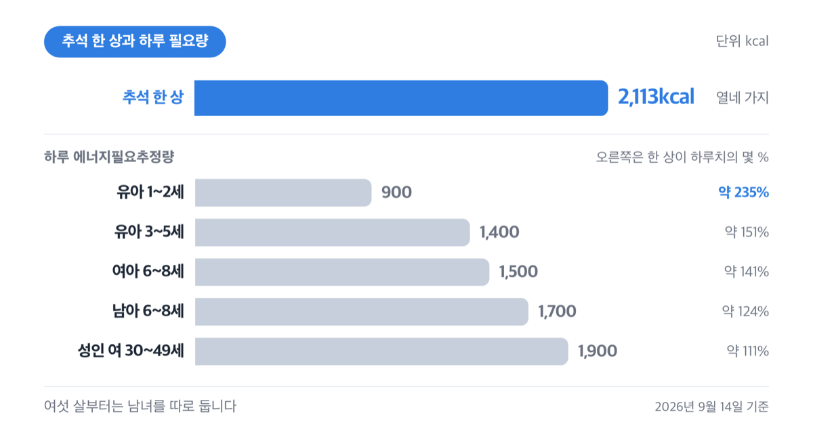
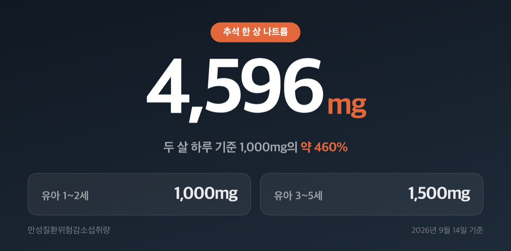
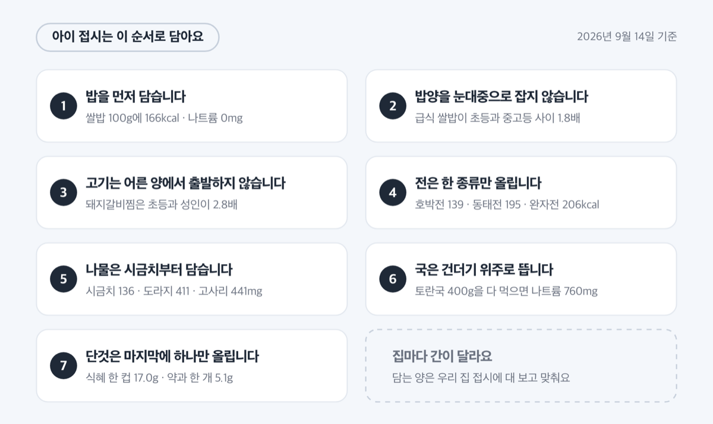
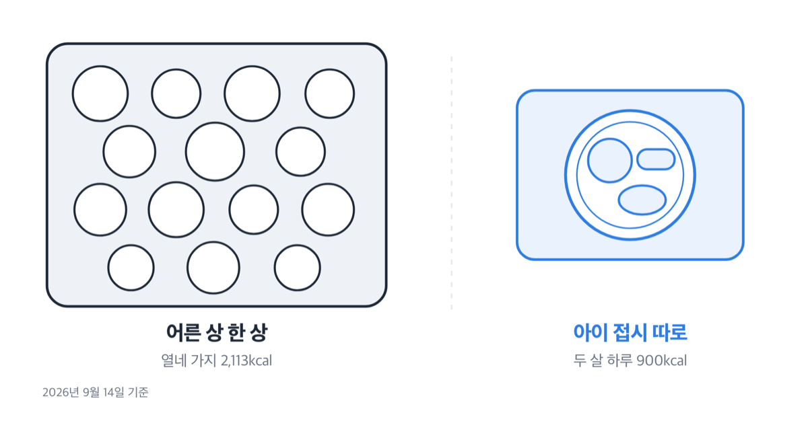

# '2,113kcal' 추석 음식 칼로리, 2026년 두 살 하루치의 2.3배

📌 2026년 9월 14일 기준

2,113kcal예요. 추석상에 흔히 오르는 열네 가지를 식품의약품안전처 음식 데이터베이스에 적힌 양만큼 담아 한 번에 다 먹었을 때의 계산값이거든요. 두 살 아이 하루 필요량 900kcal의 2.3배예요.

**3줄 요약**

1. 추석상 열네 가지를 데이터베이스에 적힌 양대로 담으면 2,113kcal, 나트륨 4,596mg이 나옵니다.
2. 2026년 추석은 9월 25일 금요일이고, 연휴는 24일 목요일부터 26일 토요일까지 사흘이에요.
3. 두 살은 하루 900kcal에 나트륨 1,000mg 아래, 다섯 살은 1,400kcal에 1,500mg 아래가 기준이에요.

음식별 100g당 숫자부터 보고, 나이별로 얼마가 하루치인지, 접시에 무엇을 먼저 올리면 되는지 순서로 갑니다.

돌 지난 아이부터 초등학생까지, 명절에 어른 상에서 같이 집어 먹는 아이를 둔 집에 맞는 글이에요. ==돌 전 아기는 여기 기준을 그대로 쓰면 안 됩니다.== 6~11개월은 하루 600kcal에 나트륨 충분섭취량이 370mg이라 기준 자체가 다르고, 간이 든 명절 음식은 애초에 대상이 아니에요.

> [!WARNING]
> 아래 열량과 나트륨은 모두 **100g당** 값입니다. 담는 양이 달라지면 숫자도 같이 달라져요.
> 나트륨은 기준이 둘이라 어느 쪽인지 매번 밝혔습니다 — 보건복지부의 건강 기준과 식약처의 포장 표시 기준이에요.

## 🍽 추석상 한 상 2,113kcal, 어떻게 나온 숫자인가

추석 음식 칼로리는 음식마다 100g에 든 열량이에요. 식품의약품안전처 음식 데이터베이스에 가정식과 외식을 분석한 100g당 열량과 나트륨이 실려 있어요. 아래는 2026년 8월 28일 버전에서 읽은 값입니다.

| 음식 | 100g당 열량 (kcal) | 100g당 나트륨 (mg) |
|---|---|---|
| 쌀밥 | 166 | 0 |
| 토란국 | 16 | 190 |
| 갈비찜(소고기) | 85 | 272 |
| 돼지갈비찜 | 194 | 478 |
| 산적(돼지고기) | 200 | 586 |
| 완자전(동그랑땡) | 206 | 369 |
| 동태전 | 195 | 318 |
| 채소전 | 194 | 322 |
| 배추전 | 160 | 218 |
| 호박전 | 139 | 185 |
| 잡채 | 146 | 360 |
| 도라지나물무침 | 130 | 411 |
| 고사리나물무침 | 90 | 441 |
| 시금치나물 | 69 | 136 |
| 나박김치 | 10 | 377 |
| 송편(깨) | 219 | 260 |

이 가운데 열네 가지를 데이터베이스에 적힌 총 내용량만큼 담아 한 번에 다 먹으면 2,113kcal, 나트륨 4,596mg, 당류 34g이 됩니다. 쌀밥 100g, 토란국 400g, 갈비찜 300g, 동태전 100g, 완자전 150g, 호박전 150g, 잡채 200g, 시금치나물 50g, 고사리나물 50g, 도라지나물 50g, 나박김치 100g, 송편 100g, 약과 30g, 식혜 150g을 더한 값이에요.

숫자가 커지는 이유는 한 가지가 무거워서가 아니라 가짓수가 쌓여서예요. 한 접시가 150~200kcal여도 열네 접시면 2,000kcal를 넘깁니다.

여기에 전제가 하나 붙어요. 데이터베이스는 음식마다 총 내용량을 적어 두는데, 그 무게가 1인분이라는 표시는 따로 없어요.

그러니까 2,113kcal는 상에 오른 총량이지, 한 사람이 반드시 먹는 양은 아니에요.

## 두 살 900kcal, 다섯 살 1,400kcal — 하루치부터 봅니다

에너지는 다른 영양소와 달리 권장섭취량을 두지 않고 '필요추정량' 하나로만 제시해요. 그래서 보건복지부 자료에는 '하루 권장 칼로리'라는 말 대신 에너지필요추정량이라는 이름이 적혀 있습니다.

| 대상 | 하루 에너지필요추정량 (kcal) | 한 상 2,113kcal의 비율 |
|---|---|---|
| 유아 1~2세 | 900 | 약 235% |
| 유아 3~5세 | 1,400 | 약 151% |
| 남아 6~8세 | 1,700 | 약 124% |
| 여아 6~8세 | 1,500 | 약 141% |
| 남아 9~11세 | 2,000 | 약 106% |
| 여아 9~11세 | 1,800 | 약 117% |
| 성인 여 30~49세 | 1,900 | 약 111% |
| 성인 남 30~49세 | 2,500 | 약 85% |

오른쪽 비율은 위 열네 가지를 총 내용량만큼 다 먹었다고 두고 나눈 계산값이에요.

1~2세와 3~5세는 남녀를 나누지 않고 한 값으로 두는데, 6세부터는 남녀를 따로 둡니다. 여섯 살 남매가 똑같은 접시를 받아도 오빠는 1,700kcal, 여동생은 1,500kcal 기준으로 계산이 달라진다는 뜻이에요.

같은 상을 나트륨으로 보면 비율이 더 올라갑니다.

## 나트륨 4,596mg — 두 살 기준의 네 배가 넘어요

나트륨은 평균필요량이나 권장섭취량을 두지 않고 충분섭취량과 만성질환위험감소섭취량 둘로 제시해요. 뒤엣것은 그 아래로 낮추면 만성질환 위험이 줄어드는 섭취량을 말합니다.

| 대상 | 만성질환위험감소섭취량 (mg/일) | 한 상 4,596mg의 비율 |
|---|---|---|
| 유아 1~2세 | 1,000 | 약 460% |
| 유아 3~5세 | 1,500 | 약 306% |
| 아동 6~8세 | 1,700 | 약 270% |
| 아동 9~11세 | 2,000 | 약 230% |
| 성인 19~64세 | 2,300 | 약 200% |

==두 살 1,000mg, 다섯 살 1,500mg== 이 두 숫자만 외워도 명절 상에서 쓸 곳이 많아요.

같은 상 안에서도 나트륨은 음식마다 크게 달라집니다. 시금치나물은 100g에 136mg인데 고사리나물무침은 441mg, 도라지나물무침은 411mg이에요. 산적(돼지고기)은 586mg으로 위 표에서 가장 높고, 쌀밥은 0mg입니다.

저라면 아이 접시에 나물을 담을 때 시금치부터 올려요. 같은 한 젓가락인데 136mg과 441mg이니까요.

> 😕 명절 하루쯤 짜게 먹는다고 뭐가 달라지나요?

하루면 저도 넘어갑니다. 그런데 2026년 추석은 9월 25일 금요일이고, 연휴는 전날인 24일 목요일부터 26일 토요일까지 사흘이에요. 상은 보통 그 사흘을 그대로 넘깁니다. 하루 이야기가 아니게 되는 지점이 여기예요.

## 식혜 한 컵에 당류 17g, 두 살 하루 상한은 45g

총당류는 하루 총 에너지의 20% 이내로 제한해요. 상한이 열량에 붙어 있어서, 하루 열량이 적은 아이일수록 당류 상한도 같이 내려갑니다.

| 대상 (하루 에너지 기준) | 하루 총당류 상한 (g) |
|---|---|
| 유아 1~2세 (900kcal) | 45 |
| 유아 3~5세 (1,400kcal) | 70 |
| 남아 6~8세 (1,700kcal) | 85 |
| 여아 6~8세 (1,500kcal) | 75 |
| 성인 여 19~29세 (2,000kcal) | 100 |
| 성인 남 19~29세 (2,600kcal) | 130 |

총 에너지의 20%에 당류 1g을 4kcal로 두고 나눈 값이에요.

명절 후식 쪽 숫자를 붙여 볼게요. 식혜는 100g에 당류 11.36g이라 150g 한 컵이면 17.0g이고, 약과는 100g에 16.89g이라 30g 한 개면 5.1g이에요. 둘을 합치면 22.1g, 두 살 하루 상한 45g의 약 49%예요. 유과는 100g에 424kcal, 당류 24.15g으로 후식 가운데 가장 높고요.

저라면 아이에게 식혜와 약과 중 하나만 줍니다. 둘 다 주면 그날 남은 당류가 절반밖에 안 되니까요.

## 아이 접시는 덜어 주는 게 아니라 따로 담아요

여기부터는 상 앞에서 바로 쓰는 순서예요. ==아이 접시는 따로 담습니다.==

1. **밥을 먼저 담습니다** — 쌀밥은 100g에 166kcal에 나트륨 0mg *(위 표에서 나트륨이 0인 것은 밥뿐이에요)*
2. **아이 밥양을 어른 눈대중으로 잡지 않습니다** — 학교급식 제공량을 보면 같은 쌀밥이 초등학생과 중고등학생 사이에 1.8배 차이가 나요 *(같은 '한 공기'가 아니라는 뜻이에요)*
3. **고기 반찬은 어른 양에서 출발하지 않습니다** — 돼지갈비찜은 초등학생 급식 제공량과 성인 급식 제공량이 2.8배 차이예요 *(어른 접시의 3분의 1쯤에서 시작하면 됩니다)*
4. **전은 한 종류만 올립니다** — 100g에 호박전 139kcal, 동태전 195kcal, 완자전 206kcal예요 *(두 살 하루가 900kcal입니다)*
5. **나물은 시금치부터 담습니다** — 100g당 나트륨이 시금치 136mg, 도라지 411mg, 고사리 441mg이에요
6. **국은 건더기 위주로 뜹니다** — 토란국은 100g에 16kcal로 낮지만, 400g을 다 먹으면 나트륨이 760mg이에요 *(두 살 하루 기준이 1,000mg입니다)*
7. **단것은 마지막에 하나만 올립니다** — 식혜 한 컵 17.0g, 약과 한 개 5.1g

음식별 값은 식품의약품안전처 식품영양성분 데이터베이스(https://various.foodsafetykorea.go.kr/nutrient/)에서 음식 이름으로 직접 찾아볼 수 있어요.

여기 숫자는 제가 저울로 달아 본 것이 아니라 식약처와 보건복지부가 공개한 값을 그대로 읽은 것입니다. 집마다 간이 다르니 담는 양은 우리 집 접시에 대 보고 맞추면 돼요.

## 여기서 자주 틀려요

**갈비찜은 숫자 하나로 잡히지 않아요.** 같은 갈비찜인데 소고기 갈비찜은 100g에 85kcal, 돼지갈비찜은 194kcal입니다. 소고기 쪽은 총 내용량이 300g이라, 저는 뼈와 국물까지 포함된 무게라고 봐요. 급식 산출값에서는 소갈비찜이 100g당 235kcal로 나오고요. 저는 갈비찜만큼은 열량 숫자를 기준 삼지 않고 국물을 덜어내는 쪽으로 봅니다.

**나트륨 기준은 둘이고 목적이 달라요.** 보건복지부 건강 기준은 성인 2,300mg이고, 과자 봉지 뒤 '나트륨 00%'를 계산할 때 쓰는 식약처 표시 기준은 2,000mg입니다. 서로 바꿔 쓰면 같은 음식이 다른 비율로 나와요.

**100g당 값과 총 내용량은 달라요.** 데이터베이스가 주는 것은 100g당 함량과 총 내용량 둘인데, 총 내용량은 그 음식을 담은 무게이지 1인분 표시가 아니에요.

**분석한 해가 음식마다 달라요.** 데이터베이스 갱신일은 2026년 8월 28일이지만, 개별 분석값은 완자전 2013년, 잡채 2018년, 송편과 갈비찜 2019년에 만들어진 것입니다. 갱신일과 분석 시점은 다른 값이에요.

## 추석 음식 칼로리 관련 궁금증 해결

**Q. 송편은 몇 개까지 괜찮나요?**
A. 송편(깨)은 100g에 219kcal입니다. 데이터베이스는 송편을 무게로만 싣고 개수로는 싣지 않아요. 개수로 잡고 싶으면 집에서 한 번 저울에 올려 한 개 무게를 재 두면 그다음부터 계산이 쉬워집니다.

**Q. 돌 전 아기도 조금은 괜찮나요?**
A. 6~11개월은 하루 600kcal에 나트륨 충분섭취량이 370mg이라 기준이 아예 다릅니다. 간이 든 명절 음식은 이 기준으로 보는 대상이 아니에요. 이유식 단계 조정은 영유아 건강검진이나 소아청소년과에서 확인하세요.

**Q. 나트륨 기준은 2,300mg인가요, 2,000mg인가요?**
A. 둘 다 맞고 쓰는 곳이 다릅니다. 건강 기준은 보건복지부의 성인 2,300mg, 포장 식품 뒷면 '%' 계산에 쓰는 식약처 표시 기준은 2,000mg이에요. 아이는 나이별로 따로 봅니다 — 1~2세 1,000mg, 3~5세 1,500mg.

**Q. 2026년 추석 연휴는 며칠인가요?**
A. 추석은 9월 25일 금요일이고, 전날인 24일 목요일과 다음 날인 26일 토요일이 함께 공휴일입니다. 사흘이에요.

**Q. 아이가 전만 먹겠다고 하면요?**
A. 전은 100g에 139~206kcal로 상에서 열량이 높은 편입니다. 호박전이 139kcal로 가장 낮고 완자전이 206kcal로 가장 높아요. 저라면 호박전을 먼저 담고 밥을 같이 올립니다.

추석상은 어른 기준으로 차려지고, 아이는 그 상에서 손에 잡히는 것을 집어 먹어요. 어른 한 상이 2,113kcal에 나트륨 4,596mg이면 두 살에게는 하루치의 두 배가 넘는 양입니다. 열량은 하루가 지나면 돌아오지만 나트륨은 사흘 내내 같은 상에서 쌓여요.

결론은 하나입니다. 아이 접시는 어른 상에서 덜어 내는 것이 아니라 처음부터 따로 담습니다.

참고: 보건복지부 「2025 한국인 영양소 섭취기준」 · 식품의약품안전처 식품영양성분 데이터베이스(음식) · 「식품 등의 표시·광고에 관한 법률 시행규칙」 별표 5 · 한국천문연구원 음양력 변환 · 「관공서의 공휴일에 관한 규정」
