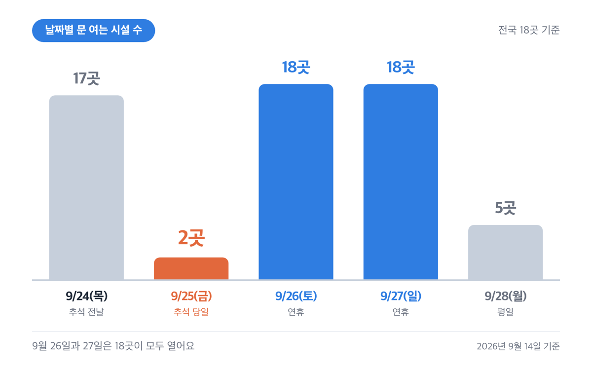
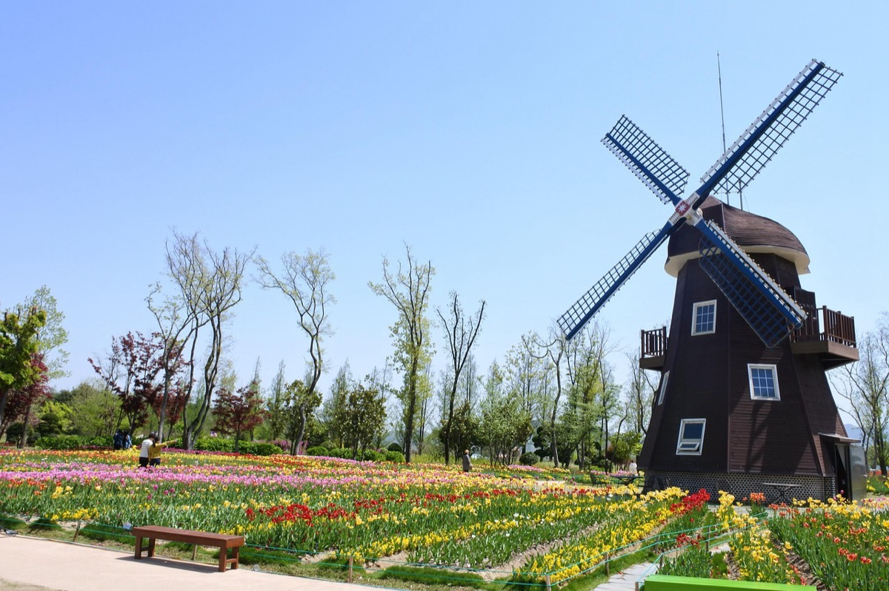
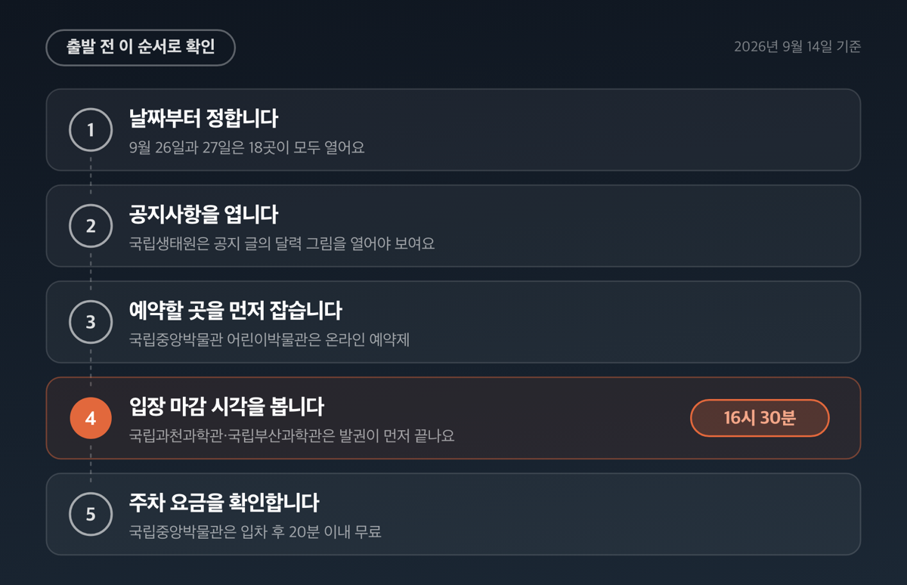
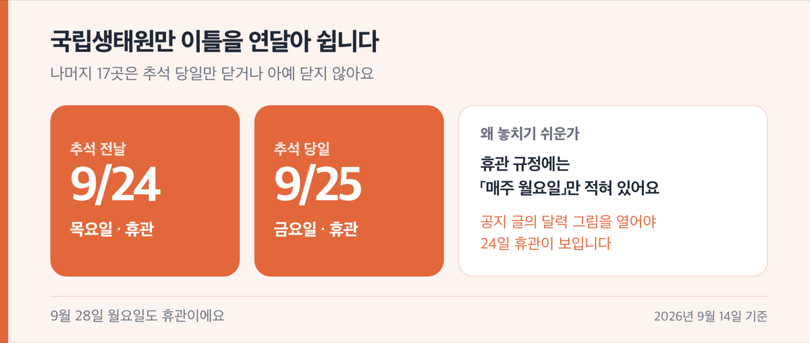
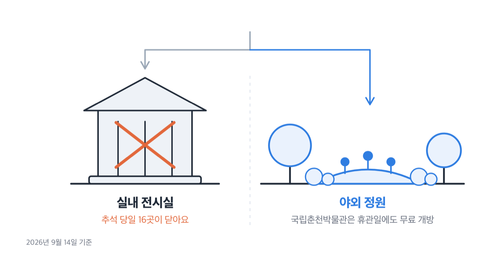

# 추석 아이와 갈만한곳 18곳, 2026 연휴 16곳이 닫는 날

📌 2026년 9월 14일 기준

9월 28일 월요일이 대체공휴일이라고들 하는데, 아니에요. 2026년 추석 연휴는 9월 24일 목요일부터 27일 일요일까지 나흘이고, 추석 당일인 ==9월 25일 금요일==에는 추석에 아이와 갈만한곳으로 꼽히는 18곳 중 16곳이 문을 닫습니다.

**3줄 요약**

- 2026년 추석은 9월 25일(금)이고, 연휴는 9월 24일(목)부터 27일(일)까지 나흘입니다.
- 추석 연휴 사흘이 목·금·토라서 일요일과 겹치는 날이 없어요. 대체공휴일이 생기지 않고 9월 28일 월요일은 평일입니다.
- 전국 18곳 중 9월 25일에 여는 곳은 두 곳뿐이에요. 가려는 곳의 휴관일부터 확인하세요.

전국 6권역 18곳을 한 곳씩 확인해서, 연휴 나흘 중 어느 날 문을 여는지, 아이가 몇 살부터 무료인지 담았어요.

## 2026 추석 연휴는 나흘, 대체공휴일이 없습니다

2026년 추석 연휴의 날짜는 아래 넷입니다. 한국천문연구원이 공개한 2026년 달력자료에 그대로 적혀 있어요.

| 2026년 9월 날짜 (요일) | 공휴일 여부 (관공서 공휴일 규정 기준) |
|---|---|
| 9월 24일(목) | 추석 전날, 법정 공휴일 |
| 9월 25일(금) | 추석 당일(음력 8월 15일), 법정 공휴일 |
| 9월 26일(토) | 추석 다음 날, 법정 공휴일 |
| 9월 27일(일) | 일요일 |
| 9월 28일(월) | **평일** |

연휴가 나흘로 끝나는 이유는 규정 한 줄에 있어요.

> **「관공서의 공휴일에 관한 규정」 제3조제1항제2호** (대통령령 제36290호, 2026년 5월 11일 시행)
> 설날 또는 추석의 공휴일이 **일요일**과 겹치는 경우에 대체공휴일을 준다.

설날과 추석은 **토요일과 겹칠 때가 아니라 일요일과 겹칠 때만** 대체공휴일이 붙어요. 2026년 추석 연휴 사흘은 목요일·금요일·토요일이라 일요일이 끼어들 곳이 없습니다. 어린이날이나 국경일은 토요일과 겹쳐도 대체공휴일이 생기는데, 명절만 기준이 다르게 짜여 있어서 생기는 차이예요.

그래서 ==9월 28일 월요일은 평일==입니다. 이 하루가 이번 연휴 나들이에서 가장 많이 어긋나는 대목이에요.

## 연휴 나흘 운영표 — 9월 25일에 여는 곳은 두 곳

18곳이 연휴 나흘과 그 다음 월요일에 어떻게 움직이는지 한 표로 담았어요. 표에 적힌 날이 **문을 닫는 날**입니다.

| 시설 (전국 18곳) | 9/24~27 중 닫는 날 | 9/28(월) |
|---|---|---|
| 국립과천과학관 | 9/25 | 휴관 |
| 국립중앙박물관 어린이박물관 | 9/25 | 개관 |
| 경기도어린이박물관 | 9/25 | 휴관 |
| 국립춘천박물관 | 9/25 | 휴관 |
| 애니메이션박물관·토이로봇관 | 9/25 | 휴관 |
| 삼척해양레일바이크 | 9/25 | 운행 |
| 국립중앙과학관 | 9/25 | 휴관 |
| 국립생태원 | **9/24·9/25** | 휴관 |
| 국립세종수목원 | 9/25 | 휴관 |
| 국립광주과학관 | 9/25 | 휴관 |
| 순천만국가정원 | **없음** | 휴무 |
| 국립전주박물관 | 9/25 | 개관 |
| 국립부산과학관 | 9/25 | 휴관 |
| 국립경주박물관 | 9/25 | 개관 |
| 국립대구박물관 | 9/25 | 휴관 |
| 국립제주박물관 | 9/25 | 휴관 |
| 제주민속자연사박물관 | 9/25 | 휴관 |
| 제주항공우주박물관 | **없음** | 개관 |

날짜별로 세어 보면 이렇게 나뉘어요. 9월 24일 목요일에 여는 곳이 17곳, 25일 금요일이 **2곳**, 26일 토요일과 27일 일요일이 각각 18곳 전부, 28일 월요일이 5곳입니다.

25일에 이렇게 몰려 닫는 이유는 시설들의 휴관 규정 문장이 거의 같아서예요. 국립 박물관과 과학관 대부분이 「1월 1일, 설날 및 추석 당일 휴관」을 상시 규정으로 두고 있습니다. 제도가 아니라 운영 규정에 같은 문장을 쓰고 있어서, 기관이 달라도 결과가 똑같이 나와요.

28일 월요일에 닫는 곳은 13곳인데, 그중 12곳은 25일과 닫는 이유가 다릅니다. 월요일 정기휴관을 두는 곳은 보통 「월요일이 공휴일이면 개관하고 다음 평일에 쉰다」는 예외를 함께 두는데, 9월 28일은 공휴일이 아니라서 그 예외가 작동하지 않아요. 평범한 월요일로 취급됩니다. 나머지 한 곳인 순천만국가정원은 연휴 나흘을 다 열고 28일에 정기휴무로 쉽니다.

> 😕 추석 당일에 문 여는 데가 정말 두 곳뿐인가요?

18곳 기준으로는 순천만국가정원과 제주항공우주박물관 둘입니다. 다만 야외 공간은 예외가 있어요. 국립춘천박물관은 야외정원을 휴관일에도 무료로 개방합니다. 전시실은 못 들어가도 아이가 뛸 데는 열려 있다는 뜻이에요.

**저라면 나들이 날짜를 9월 26일 토요일이나 27일 일요일로 잡습니다.** 이 이틀은 18곳이 모두 열어서, 가려는 곳이 어디든 닫힌 문 앞에서 되돌아올 일이 없어요.

> [!WARNING]
> 이 표에서 시설이 직접 연휴 운영을 고지한 칸은 국립생태원·서울상상나라·국립대구박물관 셋과, 연도별 휴관일에 9월 25일을 적어 둔 국립과천과학관·국립광주과학관·국립부산과학관·삼척해양레일바이크입니다. 나머지 칸은 각 시설의 상시 휴관 규정을 2026년 달력에 적용한 값이에요. 출발 전에 해당 시설 공지사항을 한 번 더 확인하세요.

## 수도권·강원 6곳, 입장료와 무료 입장 연령

수도권과 강원의 여섯 곳은 요금 구조가 서로 많이 달라요. 무료인 곳이 둘, 나이와 상관없이 같은 값을 받는 곳이 둘입니다.

| 시설 (주소) | 어른 1인 입장료 (2026-09-14 기준) | 아이 요금·무료 기준 |
|---|---|---|
| 국립과천과학관 (경기 과천시 상하별로 110) | 상설전시 4,000원 | 7세 미만 무료, 7~19세 2,000원 |
| 국립중앙박물관 어린이박물관 (서울 용산구 서빙고로 137) | 무료 (온라인 예약제) | 전 연령 무료, 전시실 주 대상 5~9세 |
| 경기도어린이박물관 (경기 용인시 기흥구 상갈로 6) | 4,000원 | 12개월 미만 무료, 유아·초등 모두 4,000원 |
| 국립춘천박물관 (강원 춘천시 우석로 70) | 무료 | 전 연령 무료 |
| 애니메이션박물관·토이로봇관 (강원 춘천시 서면 박사로 854) | 두 관 통합권 7,000원 | 24개월 미만 무료, 전 연령 같은 값 |
| 삼척해양레일바이크 (강원 삼척시 근덕면 궁촌정거장) | 2인승 25,000원·4인승 35,000원 (대당) | 최소 연령 규정 없음, 영유아도 정원에 포함 |

표에서 값이 가장 튀는 곳은 삼척해양레일바이크예요. 사람 수가 아니라 **차 한 대 값**이라서, 네 식구가 4인승 하나를 타면 35,000원입니다. 다만 품에 안고 타는 아기도 정원에 들어가서, 2인승은 두 명·4인승은 네 명을 넘길 수 없습니다.

경기도어린이박물관은 회차제로 움직여요. 1회차가 10시부터 13시 30분, 2회차가 14시부터 17시 30분이고 각 회차 종료 1시간 전에 입장이 마감됩니다. **재입장이 안 되니** 점심을 밖에서 먹고 돌아올 계획이면 회차를 나눠 끊어야 해요.

국립중앙박물관 어린이박물관은 무료지만 하루 5회차에 회차당 정원이 320명입니다. 1회차가 9시 30분, 마지막 5회차가 16시에 시작해요.

## 충청·전라·경상·제주 12곳, 입장료와 무료 입장 연령

남쪽 12곳에는 무료 시설이 다섯 들어 있어요. 국립박물관 네 곳과 국립중앙과학관의 주요 전시관입니다.

| 시설 (주소) | 어른 1인 입장료 (2026-09-14 기준) | 아이 요금·무료 기준 |
|---|---|---|
| 국립중앙과학관 (대전 유성구 대덕대로 481) | 어린이과학관 등 무료, 꿈아띠체험관 2,000원 | 꿈아띠체험관은 6세 이하만 입장, 유아 1,000원 |
| 국립생태원 (충남 서천군 마서면 금강로 1210) | 5,000원 | 만 4세 이하 무료, 만 5~12세 2,000원 |
| 국립세종수목원 (세종 수목원로 136) | 5,000원 | 만 7~12세 3,000원 |
| 국립광주과학관 (광주 북구 첨단과기로 235) | 본관 3,000원 | 6세 이하 본관 무료, 어린이과학관 2,000원(24개월 이상) |
| 순천만국가정원 (전남 순천시 국가정원1호길 47) | 10,000원 | 만 6세 이하 무료, 7~12세 5,000원 |
| 국립전주박물관 (전북 전주시 완산구 쑥고개로 249) | 무료 | 전 연령 무료 |
| 국립부산과학관 (부산 기장군) | 상설전시관 3,000원 | 영유아 무료, 새싹누리관 3~6세 1,000원 |
| 국립경주박물관 (경북 경주시 일정로 186) | 무료 | 전 연령 무료 |
| 국립대구박물관 (대구 수성구 청호로 321) | 무료 | 전 연령 무료 |
| 국립제주박물관 (제주시 일주동로 17) | 무료 | 전 연령 무료 |
| 제주민속자연사박물관 (제주시 삼성로 40) | 도외 거주 2,000원, 도민 1,000원 | 12세 이하 무료 |
| 제주항공우주박물관 (서귀포시 안덕면) | 10,000원 | 36개월 미만 무료, 만 3~12세 8,000원 |

가족 단위로 값이 가장 크게 벌어지는 곳은 제주항공우주박물관이에요. 어른 둘에 다섯 살 아이 하나면 28,000원인데, 19세 미만 자녀가 둘 이상인 다자녀 가정은 감경 대상이라 어른이 8,000원으로 내려갑니다. 주차는 무료고, 야외 항공기 전시장과 전망대도 따로 돈을 받지 않아요.

순천만국가정원은 입장권 하나로 7km 떨어진 순천만습지까지 들어갈 수 있어요. 7월부터 9월까지는 매표가 20시까지 이어지고 입장은 19시에 끊깁니다. 연휴 나흘 내내 여는 두 곳 중 하나예요.

**12곳 중 하나만 고르라면 저는 국립대구박물관입니다.** 연휴에 뭘 하는지 직접 고지한 몇 안 되는 곳이라서요. 9월 24일·26일·27일 10시부터 17시까지 해솔관 마당에서 전통 민화 딱지 만들기, 작호도 가방 걸이 꾸미기, 캐릭터 연 만들기, 자개소반 만들기를 무료로 열고 매일 선착순 500명을 받습니다. 26일 토요일에는 13시와 16시에 공연도 두 번 있어요. 다만 현장 선착순이고 비가 오면 줄이거나 취소합니다.

## 출발 전 이 순서로 확인하세요

연휴 나들이는 순서를 바꾸면 헛걸음이 됩니다. 저는 이 다섯을 이 차례로 봅니다.

1. **날짜부터 정합니다.** 9월 26일과 27일은 18곳이 모두 열어요. 25일에 움직여야 한다면 갈 수 있는 데가 두 곳으로 줄어듭니다.
2. **가려는 시설 누리집의 공지사항을 엽니다.** 첫 화면 배너나 팝업에 휴관 안내를 띄우는 곳이 많아요. *(국립생태원은 공지 글에 달린 달력 그림을 열어야 나옵니다)*
3. **예약이 필요한 곳을 먼저 잡습니다.** 국립중앙박물관 어린이박물관은 온라인 예약제이고, 경기도어린이박물관은 온라인 80%·현장 20%로 나눠 받아요. 국립대구박물관 어린이박물관은 하루 8회차를 온라인으로 받습니다.
4. **입장 마감 시각을 확인합니다.** 문 닫는 시각이 아니라 들어갈 수 있는 마지막 시각이 기준이에요. 국립과천과학관과 국립부산과학관은 17시 30분에 닫지만 발권이 **16시 30분**에 끝납니다.
5. **주차 요금과 무료 시간을 봅니다.** 아래 표에 요금이 공개된 여덟 곳을 담았어요.

| 시설 | 주차 요금 | 무료로 빠져나가는 시간 |
|---|---|---|
| 국립과천과학관 | 2시간 3,000원, 1일 최대 10,000원 | 없음 |
| 국립중앙박물관 | 기본 60분 1,000원, 1일 최대 30,000원 | 입차 후 20분 이내 |
| 경기도어린이박물관 | 1시간 1,000원, 1일 최대 8,000원 | 입차 후 30분 이내 |
| 국립중앙과학관 | 5시간 이내 4,000원 | 입차 후 30분 이내 |
| 국립광주과학관 | 1일 2,000원 정액 후불 (카드 전용) | 입차 후 30분 이내 |
| 국립부산과학관 | 1일 2,000원 정액 후불 (카드 전용) | 없음 |
| 제주민속자연사박물관 | 기본 1시간 1,000원, 초과 30분당 500원 | 입차 후 10분 이내 |
| 제주항공우주박물관 | 무료 | 해당 없음 |

국립중앙과학관은 한 가지를 더 봐야 해요. 1월 1일과 설날, **추석 당일에는 주차장 자체를 운영하지 않습니다.** 무료 개방도 하지 않아요. 나머지 열 곳의 주차 요금은 해당 시설 누리집의 「오시는 길」에서 확인하세요.

## 연휴 나들이에서 자주 걸리는 것 다섯

공식 안내를 다 읽어도 놓치기 쉬운 것을 다섯으로 추렸어요.

**1. 국립생태원은 추석 전날부터 닫습니다.**

==국립생태원만 9월 24일과 25일 이틀을 연달아 쉬어요.== 나머지 17곳은 추석 당일만 닫거나 아예 닫지 않는데 여기만 하루 먼저 문을 잠급니다. 게다가 이용안내 페이지의 휴관 규정에는 「매주 월요일」만 적혀 있어서, 공지사항에 붙은 달력 그림을 열어야 24일 휴관이 보여요.

**2. 서울상상나라는 연휴 닷새 중 하루만 엽니다.**

18곳에는 넣지 않았지만 수도권에서 가장 많이 찾는 어린이 시설이라 함께 적어요. 9월 24일부터 26일까지와 28일이 휴관이고, **27일 일요일 하루만 정상 운영**합니다. 설·추석 연휴 전체를 휴관일로 두는 규정이 있어서 다른 곳과 결과가 다르게 나와요.

**3. 9월 28일 월요일은 공휴일이 아니라 문 닫는 곳이 많습니다.**

연휴 끝에 하루를 붙여 쉬는 집이 많은데, 그날 13곳이 닫습니다. 여는 곳은 국립중앙박물관 어린이박물관, 국립전주박물관, 국립경주박물관, 제주항공우주박물관, 삼척해양레일바이크 다섯이에요. **저는 연휴 나들이 계획에서 이 하루를 가장 먼저 뺍니다.** 공휴일이 아닌데 사람들은 연휴처럼 움직이거든요.

**4. 나이에 걸려 못 들어가는 체험관이 있어요.**

입장료가 무료거나 싸도 연령 제한에 걸리면 들어갈 수 없습니다.

- 국립과천과학관 천체투영관 — **36개월 미만은 입장 불가** *(7세 미만은 보호자와 함께 들어가야 해요)*
- 국립부산과학관 새싹누리관 — 유아 전용이라 **7~18세는 입장 불가** *(13개월 이상이면 무료)*
- 국립중앙과학관 꿈아띠체험관 — **6세 이하 미취학 아동만** 들어갑니다

**5. 회차와 정원을 미리 따져야 해요.**

경기도어린이박물관은 재입장이 안 되고, 삼척해양레일바이크는 안고 타는 아기도 정원에 들어갑니다. 국립중앙박물관 어린이박물관은 회차당 320명이 차면 끝이에요.

> 🤭 **솔직히 말하면** — 저는 9월 25일 나들이를 아예 접는 쪽이에요. 두 곳으로 좁혀진 데다 그 두 곳에 사람이 몰릴 게 뻔해서, 차라리 26일에 움직이고 25일은 집에서 쉽니다.

## 추석 아이와 갈만한곳 관련 궁금증 해결

**Q. 9월 28일 월요일은 쉬는 날인가요?**

**A.** 평일입니다. 2026년 추석 연휴 사흘이 목·금·토라서 일요일과 겹치지 않고, 설날과 추석은 일요일과 겹칠 때만 대체공휴일이 붙어요. 그날 문 여는 시설은 18곳 중 다섯입니다.

**Q. 추석 당일에 아이랑 갈 만한 데가 정말 없나요?**

**A.** 18곳 중 순천만국가정원과 제주항공우주박물관 둘이 엽니다. 전시실 말고 야외만 보려면 국립춘천박물관 야외정원도 열려 있어요. 휴관일에도 무료로 개방합니다.

**Q. 36개월 아기를 데려가도 되나요?**

**A.** 시설마다 기준이 다르게 잡혀 있어요. 국립중앙박물관 어린이박물관의 「데굴데굴놀이터」는 36개월 이하 영유아 공간이고, 국립부산과학관 새싹누리관은 13개월 이상이면 무료입니다. 반대로 국립과천과학관 천체투영관은 36개월 미만이 못 들어가요.

**Q. 예약 없이 그냥 가도 되나요?**

**A.** 무료인 국립박물관 상설전시실은 대체로 그냥 들어가지만, 어린이박물관은 회차와 정원이 정해진 곳이 많아요. 국립중앙박물관 어린이박물관은 온라인 예약제이고, 경기도어린이박물관은 정원의 20%만 현장에서 받습니다.

**Q. 연휴에 특별한 행사를 하는 곳이 있나요?**

**A.** 국립대구박물관이 9월 24일·26일·27일 10시부터 17시까지 추석 맞이 문화행사를 엽니다. 체험 네 가지가 무료이고 매일 선착순 500명이에요. 26일에는 공연도 두 번 있습니다.

가장 확실한 이틀은 9월 26일 토요일과 27일 일요일입니다. 이 이틀은 18곳이 전부 열어서 고를 수 있는 폭이 가장 넓어요. 반대로 9월 25일과 28일은 갈 수 있는 곳이 각각 둘과 다섯으로 줄어드니, 그 이틀에 움직일 계획이라면 목적지를 먼저 정하고 나서 날짜를 맞추는 편이 안전합니다. 대중교통 편과 소요 시간은 각 시설 누리집의 「오시는 길」에서 확인하세요.

참고: 국가법령정보센터 「관공서의 공휴일에 관한 규정」 · 한국천문연구원 「2026년 달력자료」 · 우주항공청 「2026년 월력요항」 · 국립과천과학관 · 국립중앙박물관 어린이박물관 · 경기도어린이박물관 · 국립춘천박물관 · 애니메이션박물관 · 삼척해양레일바이크 · 국립중앙과학관 · 국립생태원 · 국립세종수목원 · 국립광주과학관 · 순천만국가정원 · 국립전주박물관 · 국립부산과학관 · 국립경주박물관 · 국립대구박물관 · 국립제주박물관 · 제주민속자연사박물관 · 제주항공우주박물관 · 서울상상나라 이용안내
