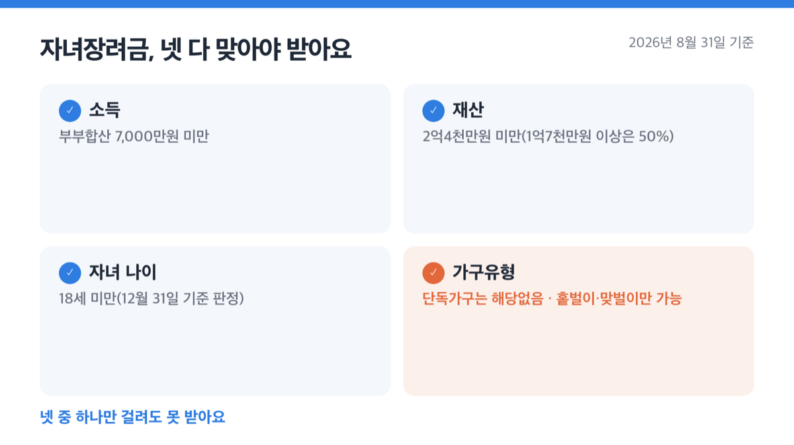
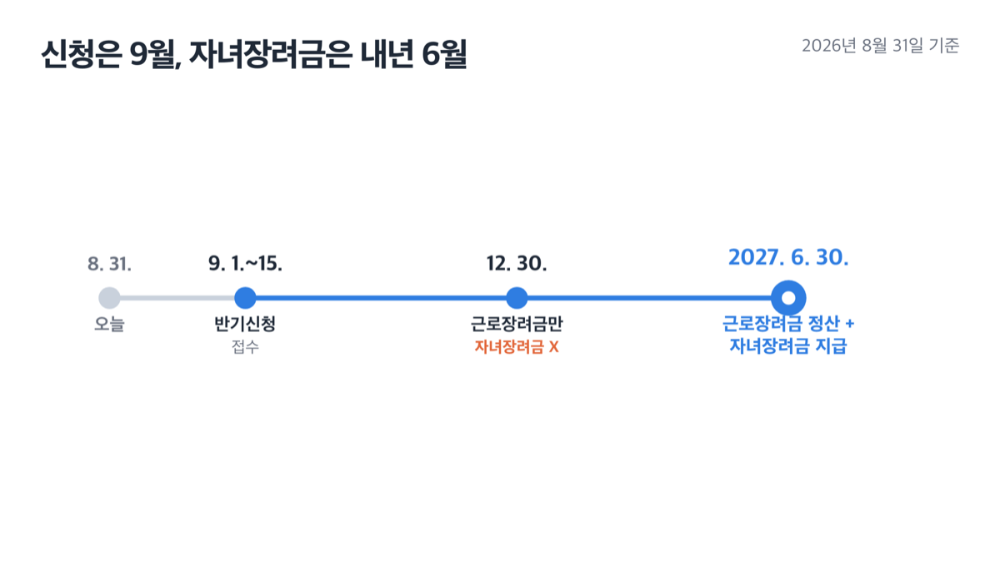
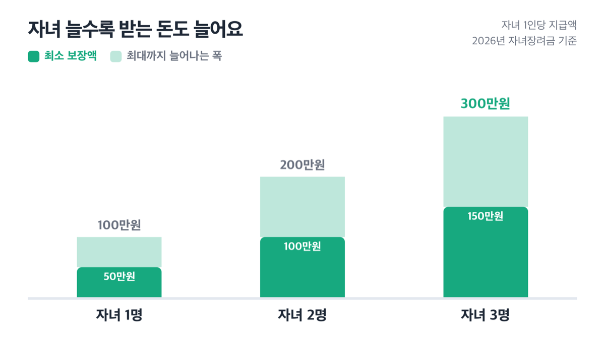
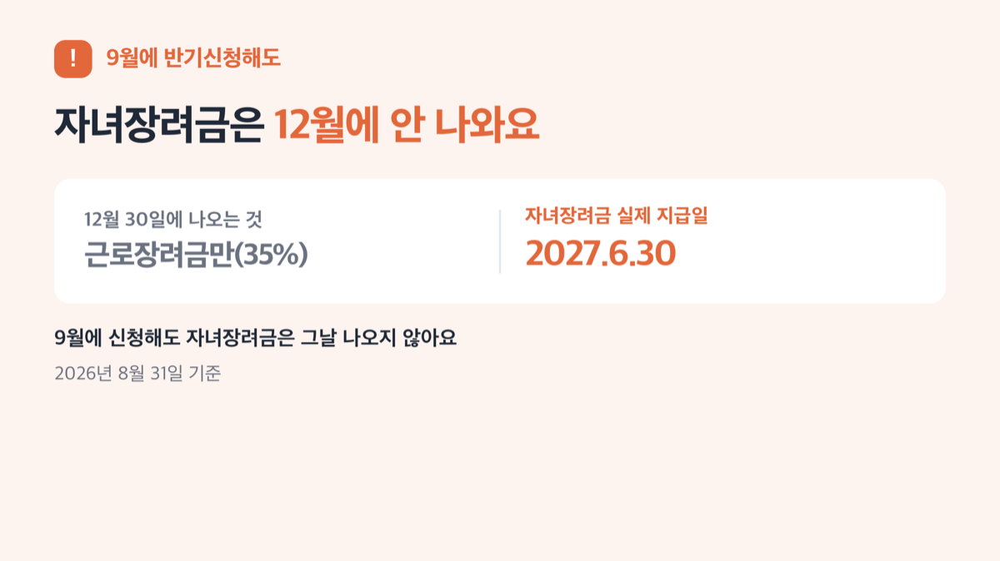

# 자녀장려금 반기신청, 2026년 9월 접수해도 12월엔 못 받아요

📌 2026년 8월 31일 기준

저도 올해 근로장려금 반기신청을 앞두고 찾아보다가, 9월에 신청하면 자녀장려금도 그때 같이 나오는 줄 알았어요. 그런데 확인해보니 아니었어요. 12월 30일엔 근로장려금만 들어오고, 자녀장려금은 내년 6월에 따로 나옵니다.

**3줄 요약**
- 자녀장려금은 부부합산 소득 7,000만원 미만이고 18세 미만 자녀가 있는 가구에 자녀 1인당 최소 50만원, 최대 100만원을 주는 제도예요.
- 2026년 하반기 반기신청은 9월 1일부터 15일까지이고, 이때 접수해도 12월 30일엔 근로장려금만 먼저 지급됩니다.
- 자녀장려금까지 받으려면 재산이 2억4천만원 미만인지부터 확인하고, 실제 지급은 내년 6월 정산 때라는 것도 미리 알아둬야 해요.

이 글에서는 자녀장려금 자격 요건과 지급액, 반기신청 일정을 정리하고 9월에 신청해도 자녀장려금은 왜 그때 나오지 않는지까지 짚어볼게요.

> [!WARNING]
> 9월 1일부터 15일까지가 이번 반기신청 기간이에요. 이 기간을 놓치면 다음 반기신청은 2027년 3월 1일부터 15일까지고, 그 전에는 2026년 5월 1일부터 6월 1일까지였던 정기신청 기간도 이미 지났어요.

## 자녀장려금이 뭔가요

자녀장려금의 지급 기준은 소득 7,000만원 미만, 재산 2억4천만원 미만, 부양자녀 18세 미만입니다. 근로장려금과 짝을 이루는 제도지만 소득 상한선이 달라요. 근로장려금은 단독가구 2,200만원, 홑벌이가구 3,200만원, 맞벌이가구 4,400만원 미만이어야 받는데, 자녀장려금은 홑벌이·맞벌이 가구 모두 부부합산 소득 **7,000만원 미만** *(가구 형태와 상관없이 같은 기준이에요)* 이면 받을 수 있어요.

| 가구유형 | 근로장려금 기준(부부합산 연소득) | 자녀장려금 기준(부부합산 연소득) |
|---|---|---|
| 단독가구 | 2,200만원 미만 | 해당없음 |
| 홑벌이가구 | 3,200만원 미만 | 7,000만원 미만 |
| 맞벌이가구 | 4,400만원 미만 | 7,000만원 미만 |

단독가구가 "해당없음"인 건 이상한 게 아니에요. 국세청이 정의한 단독가구는 애초에 배우자도 18세 미만 부양자녀도 없는 가구라서, 자녀장려금을 받을 자녀 자체가 없는 거예요.

자세한 반기신청 화면과 절차는 아래 국세청 공식 영상에 담겨 있어요. [「2026년 상반기분 근로장려금 신청하세요」](https://www.korea.kr/multi/mediaNewsView.do?newsId=148970756&pWise=sub&pWiseSub=C4)

> 국세청 · 대한민국 정책브리핑 · 2026년 8월 28일 게시

## 나도 받을 수 있나 — 소득·재산·가구유형

자녀장려금을 받으려면 소득, 재산, 가구유형, 자녀 나이 네 가지 요건을 모두 맞춰야 해요. 하나라도 걸리면 못 받아요.

**가구유형은 이렇게 나뉩니다.**
- 단독가구: 배우자, 부양자녀(18세 미만), 70세 이상 직계존속이 없는 가구
- 홑벌이가구: 배우자의 총급여가 300만원 미만이거나, 배우자가 없어도 부양자녀나 70세 이상 직계존속이 있는 가구
- 맞벌이가구: 거주자와 배우자 각각의 총급여가 300만원 이상인 가구

부양자녀 나이는 **18세 미만**이 기준이고, 판정 시점은 해당 소득연도 12월 31일이에요.

> 😕 저희는 맞벌이라 소득이 좀 되는데, 그래도 받을 수 있나요?

네, 자녀장려금은 맞벌이여도 부부합산 소득이 7,000만원 밑이면 받아요. 근로장려금(맞벌이 4,400만원 미만)보다 기준이 훨씬 넓어서, 근로장려금은 못 받아도 자녀장려금만 받는 가구도 있어요.

재산요건은 근로장려금과 같아요.

| 재산요건 항목 | 세부 내용 (2025년 6월 1일 기준 재산 합계) |
|---|---|
| 재산 기준일 (2026년 9월 반기신청 · 12월 지급분) | 2025년 6월 1일 현재 |
| 기본 기준 | 가구원 전체 재산 합계 2억4천만원 미만 |
| 감액 구간 | 1억7천만원 이상~2억4천만원 미만이면 산정액의 50%만 지급 |

저도 대출 끼고 산 집이 있어서, 이 재산 기준부터 걱정돼 직접 계산해봤어요. 재산에는 주택·토지·건축물, 자동차(영업용 제외), 전세금, 금융자산·유가증권 등이 다 들어가고, **부채는 빼지 않아요.** 빚이 많아도 자산 총액으로만 따진다는 뜻이라, 대출 끼고 산 집이 있으면 여기서 걸리는 경우가 꽤 있어요.

넷 중 하나만 걸려도 못 받습니다.

## 반기신청, 정기신청 — 언제 접수하나

저도 반기신청과 정기신청 중 뭐가 다른지, 저희 집엔 어느 쪽이 맞는지 처음엔 헷갈렸어요. 확인해보니 기준은 대상자예요 — 근로장려금은 반기 단위로도 신청할 수 있지만, 대상자는 **근로소득자로 한정**됩니다. 사업소득이나 종교인소득만 있는 가구는 정기신청으로만 받을 수 있어요.

| 구분 (신청 유형) | 대상 (소득 종류) | 신청 시기 (연도·월·일) |
|---|---|---|
| 정기신청 (2025년 소득 기준) | 근로·사업·종교인 소득자 전체 (자녀장려금도 여기로 함께 신청) | 2026년 5월 1일 ~ 6월 1일 |
| 반기신청·상반기분 | 근로소득자만 | 2026년 9월 1일 ~ 9월 15일 |
| 반기신청·하반기분 | 근로소득자만 | 2027년 3월 1일 ~ 3월 15일 |
| 기한후신청 (2025년 귀속분) | 정기신청을 놓친 경우 | 2026년 6월 2일 ~ 12월 1일 |

자녀장려금은 근로장려금과 **별도 신청서가 없어요.** 정기신청이든 반기신청이든 한 번만 접수하면 국세청이 심사해서 해당하는 장려금을 알아서 지급합니다.

## 9월에 신청해도 12월엔 못 받는 이유

국세청은 이 제도를 그냥 '반기신청'이라고만 불러요. 자녀장려금이라는 말이 표 어디에도 없는데도, 그 이름만 보고 자녀장려금도 반기 단위로 함께 나온다고 착각하기 쉬워요.

국세청 「심사 및 지급」 안내를 보면 이렇게 적혀 있어요. **"상반기분 지급 시엔 근로장려금만 지급하고, 자녀장려금도 해당될 경우 하반기분 정산 시 함께 지급합니다."** 즉 9월에 반기신청을 접수해도, 12월 30일엔 근로장려금만(예상 연간산정액의 35%) 먼저 나오고 자녀장려금은 이때 나오지 않습니다.

==자녀장려금이 실제로 지급되는 시점은 2027년 6월 30일이에요.== 이날 근로장려금 정산액(연간산정액에서 상반기 기지급분을 뺀 나머지)과 함께 자녀장려금이 처음 지급됩니다.

| 신청 종류 | 지급일 | 실제로 나오는 것 |
|---|---|---|
| 반기신청·상반기분 (2026.9.1~9.15 접수) | 2026년 12월 30일 | 근로장려금만 (연간산정액의 35%) |
| 반기신청·하반기분 정산 (자동 연계) | 2027년 6월 30일 | 근로장려금 정산액 + 자녀장려금 (여기서 처음 지급) |
| 참고 — 정기신청 (2026.5.1~6.1 접수 사례) | 2026년 8월 27일 | 근로장려금 + 자녀장려금이 같은 날 함께 지급 |

왜 이렇게 시점이 달라질까요? 반기신청은 아직 끝나지 않은 해의 소득 일부만 보고 근로장려금을 먼저 앞당겨주는 제도예요. 여기에 자녀장려금까지 얹어 주면, 나중에 연간 소득이 확정됐을 때 돌려받아야 할 몫이 더 커질 수 있어요. 그래서 소득이 확정되는 하반기 정산 시점에 자녀장려금을 한 번에 정리하는 쪽을 택한 걸로 보여요.

물론 신청 자체는 한 번으로 끝나요. 그런데 두 장려금의 지급 시점은 완전히 다르게 움직입니다.

결국 9월에 신청해도 자녀장려금은 그날 나오지 않아요.

제 판단으로는, 재산이나 소득이 경계선에 애매하게 걸려 있는 가구라면 반기신청보다 5월 정기신청이 더 낫습니다. 정기신청 쪽이 근로장려금과 자녀장려금을 같은 날 함께 받을 수 있어서, 자녀장려금을 9개월 더 기다리지 않아도 되거든요.

## 💵 자녀 1인당 얼마 받나

자녀장려금은 자녀 1인당 **최소 50만원, 최대 100만원**이에요. 홑벌이가구와 맞벌이가구 모두 같은 금액 범위가 적용됩니다.

| 자녀 수 (명) | 지급액 범위 (만원, 총액 기준) |
|---|---|
| 1명 | 50만~100만원 |
| 2명 | 100만~200만원 |
| 3명 | 150만~300만원 |

100만원 전액을 받는 소득 구간은 가구유형마다 달라요. 홑벌이가구는 총소득 0원~2,100만원 구간에서 자녀 1인당 100만원 전액이 나오고, 2,100만원을 넘어서면 7,000만원 미만까지 서서히 줄어들어 최소 50만원까지 감액돼요. 맞벌이가구는 총소득 600만원~2,500만원 구간에서 전액이 나오고, 2,500만원을 넘으면 역시 7,000만원 미만까지 감액됩니다.

자녀 3명이면 최대 300만원이라고들 하는데, 소득이 감액구간에 들어가면 300만원이 아니라 150만원까지 줄어들 수도 있어요. 표만 보고 최대금액으로 계산하면 실제 받는 돈과 차이가 날 수 있습니다.

## 신청은 어떻게 하나, FAQ까지

**신청 순서는 이렇게 진행해요.**

1. 먼저 우리 가구가 홑벌이인지 맞벌이인지, 부부합산 소득과 재산이 기준 안에 드는지 확인해요.
2. 반기신청 기간(9월 1일~15일)에 접수하거나, 이 기간을 놓쳤다면 다음 정기신청(다음 해 5월)이나 기한후신청(6월 2일~12월 1일, 산정액의 95%만 지급)을 이용해요.
3. 정확한 신청 화면과 절차는 국세청이 안내하는 신청 방법 페이지를 따라 진행하고, 헷갈리는 부분은 국세상담센터(126)나 관할 세무서에 문의해요.
4. 접수 뒤에는 심사 결과와 지급일을 국세청 안내에 맞춰 확인해요. 반기신청이면 12월 30일엔 근로장려금만, 자녀장려금은 내년 6월 30일에 나온다는 걸 미리 기억해 둡니다.

**자녀장려금 반기신청 관련 궁금증 해결**

**Q. 근로장려금 반기신청과 자녀장려금 반기신청은 따로 하나요?**
A. 아니에요. 반기신청 자체가 근로소득자 전용 제도라 자녀장려금만 따로 신청하는 창구는 없어요. 9월에 반기신청을 하면 자녀장려금 여부는 자동으로 함께 심사되고, 지급 시점만 뒤로 밀려요.

**Q. 9월에 반기신청을 안 하면 자녀장려금을 아예 못 받나요?**
A. 아니에요. 반기신청을 하지 않고 다음 해 정기신청(5월 1일~6월 1일)으로 넘어가면 근로장려금과 자녀장려금이 같은 날 함께 나와요. 반기신청은 근로장려금을 앞당겨 받는 대신 자녀장려금이 늦어지는 방식이에요.

**Q. 자녀가 4명이면 자녀장려금을 더 받나요?**
A. 국세청 안내표는 자녀 1명부터 3명까지만 보여줘요. 4명 이상인 경우는 국세상담센터(126)나 관할 세무서에서 직접 확인하는 게 정확해요.

**Q. 재산이 2억4천만원을 살짝 넘으면 아예 못 받나요?**
A. 2억4천만원 이상이면 못 받고, 1억7천만원 이상~2억4천만원 미만 구간이면 산정액의 50%만 받아요. 경계에 걸려 있다면 재산 평가 기준일(2025년 6월 1일)에 맞춰 미리 확인해 두는 게 좋아요.

**Q. 근로장려금 기준(맞벌이 4,400만원)은 넘는데 자녀장려금 기준(7,000만원)은 안 넘으면요?**
A. 그 경우엔 근로장려금 없이 자녀장려금만 받아요. 두 기준금액이 서로 달라 생기는 상황이고, 신청 자체는 여전히 한 번으로 끝나요.

결론은 하나입니다. 9월 반기신청은 근로장려금을 미리 받는 절차이고, 자녀장려금은 내년 6월 정산 때 함께 확정됩니다. 기한후신청은 5% 감액되고, 재산이 1억7천만원을 넘어서면 절반만 나온다는 것도 함께 기억해 두세요. 자녀세액공제와 자녀장려금을 중복 신청하면 세액공제금액이 차감되니, 연말정산이나 종합소득세 신고 때 자녀세액공제를 이미 받았다면 그 부분도 함께 따져봐야 합니다.

정확한 지급 여부와 금액은 가구 상황에 따라 다르게 정해지니, 신청 전에 국세상담센터(126)나 관할 세무서에서 한 번 더 확인하시길 권해요.

참고: 국세청 「자녀장려금 소개」·「신청자격」·「신청기간 및 방법」·「심사 및 지급」 · 국세청 카드뉴스 「2026년 근로장려금 반기 신청·지급제도」 · 국세청 리플릿 「2026년 신청 근로장려금 자녀장려금 제도안내」 · 대한민국 정책브리핑(korea.kr) 「근로장려금 최대 330만 원 지급…6월 1일까지 신청」 및 영상 「2026년 상반기분 근로장려금 신청하세요」
