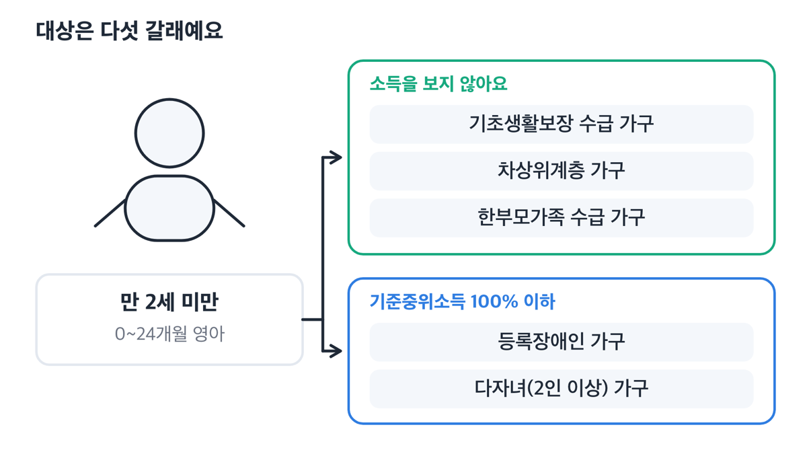
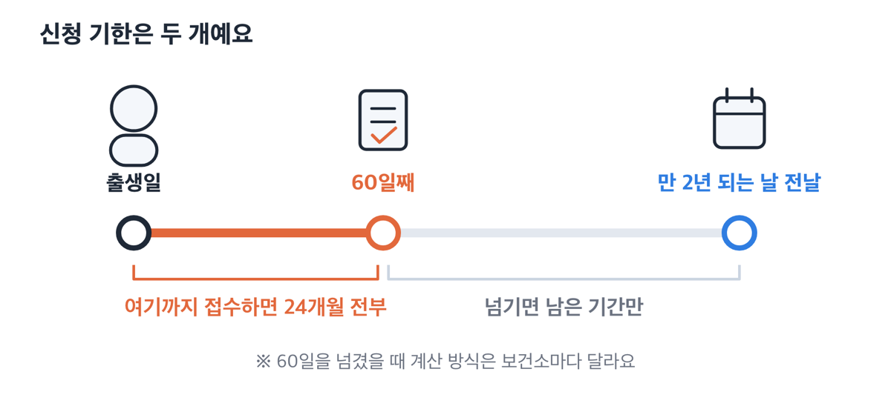

> [!SUMMARY] 2026년 8월 10일 기준
> 결론부터요. 저소득층 기저귀·조제분유 지원은 2026년 기준 영아 1인당 월 20만원까지 나와요. 2026년 7월 1일부터 장애인·다자녀 가구의 소득 기준이 기준중위소득 100%로 넓어졌고요. 신청은 ==출생 60일 안에== 하셔야 24개월치를 다 받습니다.

## 소득이 낮다고 다 받는 건 아니에요

이 지원은 아래 다섯 갈래 중 하나에 들어야 시작돼요. 소득은 그다음 문제고요.

기준중위소득은 전국 가구를 소득 순으로 줄 세웠을 때 한가운데 있는 가구의 소득이에요.

| 대상 가구 | 소득 기준 |
|---|---|
| 기초생활보장 수급 가구 | 따로 보지 않아요 |
| 차상위계층 가구 | 따로 보지 않아요 |
| 한부모가족 수급 가구 | 따로 보지 않아요 |
| 등록장애인 가구 (영아 본인 또는 부·모) | 기준중위소득 100% 이하 |
| 다자녀(2인 이상) 가구 | 기준중위소득 100% 이하 |

아이는 만 2세 미만, 0~24개월이어야 해요. 앞의 세 갈래는 자격 자체로 대상이 되고, 뒤의 두 갈래만 소득 심사를 받습니다.

저는 신청하기 전에 복지로에서 모의계산으로 먼저 확인해 봤어요. 대상이 아니라고 나왔고요. 보건소까지 갔다가 돌아오는 대신 집에서 미리 걸러낸 셈이에요.

공식 페이지에는 "여기서 먼저 확인해 보라"는 안내가 잘 안 보여요. 복지로([www.bokjiro.go.kr](https://www.bokjiro.go.kr))에서 우리 집 소득이 기준중위소득 어디쯤인지 가늠해 보는 데는 도움이 돼요.

다만 대상인지 아닌지를 확정해 주는 곳은 관할 보건소입니다. 모의계산 결과만 보고 접지 마시고, 보건소에 한 번 더 물어보세요.

근데 다자녀 가구는 자녀 수 계산에 예외가 있어요. 시설보호 중인 자녀는 다자녀로 세지 않는다고 안내하는 보건소가 있으니, 인정 범위는 관할 보건소에 확인하세요.

## 2026년 7월 1일, 소득 기준이 80%에서 100%로 올라갔어요

이번에 바뀐 건 소득 기준 하나예요. 장애인 가구와 다자녀 가구에만 해당하고요.

4인 가구로 보면 상반기까지 월 519만 6천원이던 기준선이 하반기부터 649만 5천원이 됐어요. 약 130만원이 올라간 거예요.

")

지원 금액과 아이 나이 조건, 신청 기한은 그대로예요.

| 가구원 수 | 2026년 하반기 소득 기준(월) |
|---|---|
| 2인 | 4,200,000원 |
| 3인 | 5,360,000원 |
| 4인 | 6,495,000원 |
| 5인 | 7,557,000원 |
| 6인 | 8,556,000원 |
| 7인 | 9,516,000원 |

소득은 신청일 기준 최근월 건강보험료 본인부담금으로 판정해요. 근데 2026년 하반기 기준선은 가입 형태에 따라 세 갈래로 나뉘어요.

| 가구원 수 | 직장가입자 | 지역가입자 | 혼합 |
|---|---|---|---|
| 3인 | 195,073원 | 137,279원 | 197,469원 |
| 4인 | 236,378원 | 172,901원 | 240,050원 |
| 5인 | 274,221원 | 220,149원 | 279,461원 |
| 6인 | 309,777원 | 264,935원 | 318,043원 |
| 7인 | 348,913원 | 308,246원 | 360,410원 |

4인만 봐도 직장가입자는 236,378원, 지역가입자는 172,901원이에요. 6만원 넘게 차이가 나죠. 위 표는 3~7인 가구 기준이라, 2인 가구를 비롯한 나머지는 관할 보건소 기준표에서 확인하세요.

> [!WARNING] 여기서 한 가지 꼭 짚고 갈 게 있어요
> 위 금액에는 노인장기요양보험료가 들어 있지 않아요.
>
> 장기요양보험료는 건강보험료 고지서에 함께 찍혀 나와요. 그래서 고지서 총액으로 비교하면 부담금이 실제보다 높아 보여요. ==총액 말고 건강보험료 항목만 떼어서 보셔야 합니다.==

> [!WARNING] 근데 지금 검색해서 나오는 안내가 서로 달라요
> 정부24 서비스 안내는 2025년 11월 28일이 마지막 수정이라 ==아직 80%로 적혀 있어요==. 반면 7월 이후 손본 보건소 페이지들은 100%로 바뀌어 있고요. 서울만 봐도 강남·금천·동대문·구로·성동·도봉 보건소가 100% 기준으로 안내해요.
>
> 낡은 페이지만 보고 포기하기 전에 관할 보건소에 한 번 물어보세요. 보건복지상담센터 129로도 확인할 수 있어요.

## 월 20만원은 기저귀와 분유를 둘 다 받을 때예요

2026년 기준 금액은 세 갈래로 나뉘어요.

| 유형 | 월 지원액 | 3개월 단위 |
|---|---|---|
| 기저귀만 | 90,000원 | 270,000원 |
| 기저귀 + 조제분유 | 200,000원 | 600,000원 |
| 조제분유 추가분 | 110,000원 | 330,000원 |

현금으로 주지 않아요. 바우처, 그러니까 국민행복카드 포인트로 3개월치씩 지급됩니다.

")

금액은 영아 1인당이고, 최대 24개월까지 받아요.

> [!TIP] 잘 안 알려진 규정이 하나 있어요
> 둘째가 태어날 때 첫째가 24개월 미만이면 ==첫째도 함께 지원받아요==. 기저귀만 받아도 두 아이면 월 18만원이 됩니다.

## 조제분유는 기저귀 대상자 중에서도 사유가 있어야 나와요

조제분유만 따로 신청하는 건 안 돼요. 기저귀 지원 대상자 가운데 아래 사유가 있어야 추가돼요.

첫째는 산모의 사망, 또는 질병으로 모유수유가 불가능한 경우예요. 항암화학요법 치료 중, 4주 이상 장기 입원, 중증 산후기 정신장애, 유방절제술로 인한 유선 손상 등이 들어가요. 이때는 의사 진단서를 함께 내야 합니다.

둘째는 아이의 양육 형태예요. 아동복지시설·공동생활가정·가정위탁 보호 아동, 입양 대상 아동, 영아 입양 가정, 한부모(부자·조손) 가정이 해당돼요.

> [!NOTE]
> 영양플러스나 선천성대사이상 환아관리 사업에서 조제분유를 받고 있다면 중복은 안 됩니다.

## 기한이 두 개예요 — 60일과 만 2년

여기가 제일 헷갈리는 대목이에요. 기한이 하나가 아니라 둘이거든요.

신청 자체는 아이가 태어난 뒤 만 2년이 되는 날의 전날까지 할 수 있어요. 다만 24개월치를 온전히 받으려면 출생일을 포함해 60일 안에 접수해야 합니다.

60일을 넘기면 남은 기간만 받아요. 신청일 기준으로 계산하는 곳도 있고 신청한 달부터 잡는 곳도 있어서, 관할 보건소에 확인하는 편이 정확해요.

신청은 아이 주민등록 주소지 관할 시·군·구 보건소나 읍·면·동 주민센터에서 받아요. 온라인은 복지로([www.bokjiro.go.kr](https://www.bokjiro.go.kr))고요. 지자체에 따라 정부24([www.gov.kr](https://www.gov.kr)) 접수를 함께 안내하는 곳도 있어요.

서류는 신청서, 개인정보 수집·이용 동의서, 주민등록등본, 신분증이 기본이에요. 여기에 해당하는 자격 증명서와 가족관계증명서(상세), 최근월 건강보험료 납부확인서가 추가되고요. 행정정보 공동이용에 동의하면 일부는 생략돼요.

국민행복카드를 새로 만들어야 하나 싶을 수 있는데, 저는 첫만남이용권을 받으려고 이미 발급해 둔 카드가 있었어요. 출산 지원을 한 번이라도 받았다면 이미 갖고 계실 가능성이 높아요.

## 바우처는 이월되지만 유효기간이 끝나면 사라집니다

포인트는 지원이 결정된 다음 날부터 쓸 수 있어요. 3개월 단위로 지급되고, 못 쓴 분량은 지원 종료일까지 이월돼요. 다만 유효기간이 끝난 다음 날부터는 소멸돼서 쓸 수 없습니다. 유효기간은 보건소가 주는 「사회보장급여 결정 통지서」에 적혀 있어요.

접수 창구 운영은 지자체마다 달라요. 송파구처럼 동주민센터 외에 산모건강증진센터에서도 방문 접수를 받는 곳이 있고요. 사는 지역에 따라 다를 수 있으니 꼭 확인해 보세요.

")

> [!ACTION] 할 일은 하나예요
> 관할 보건소에 우리 집이 대상인지, 100% 기준이 적용되는지 물어보세요. 아이가 태어난 지 60일이 안 됐다면 그 전에 접수하셔야 24개월치를 다 받습니다.

---

참고: 보건복지부 「2026년 보건·복지 정책 이렇게 달라집니다」(정책브리핑, 2025년 12월 17일) · 복지로 「저소득층 기저귀·조제분유 지원」 복지서비스 상세 · 정부24 서비스 안내(미갱신 확인용) · 각 시·군·구 보건소 공식 안내 (2026년 8월 10일 확인)
