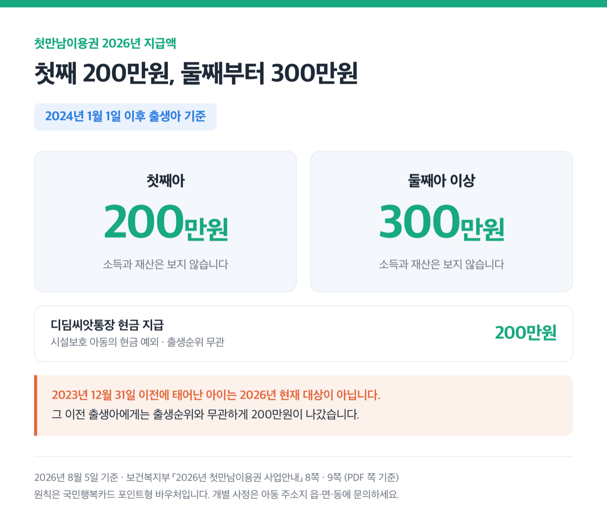
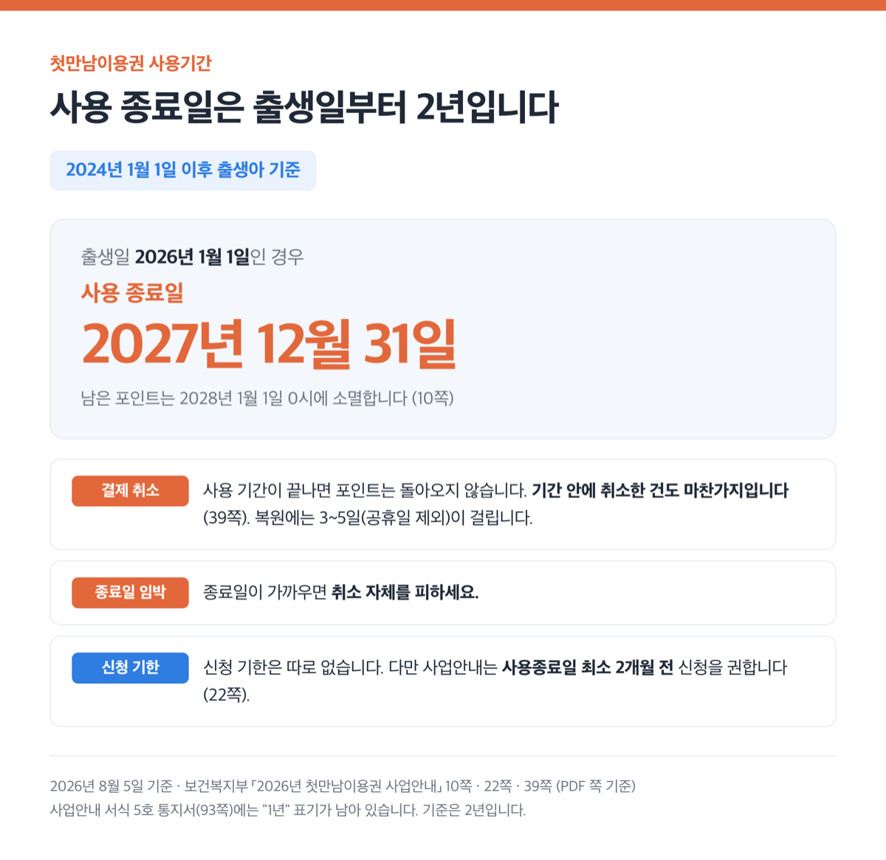
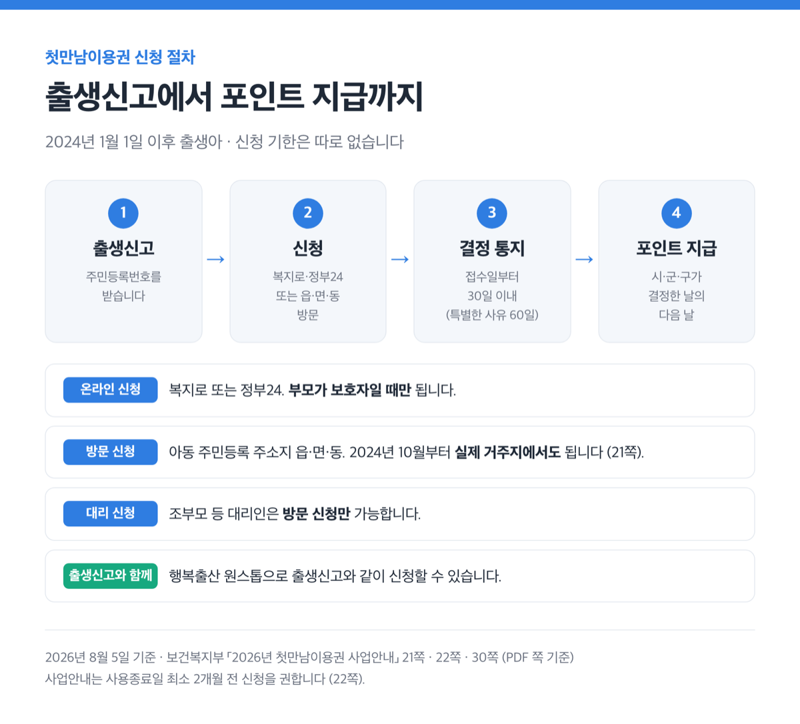
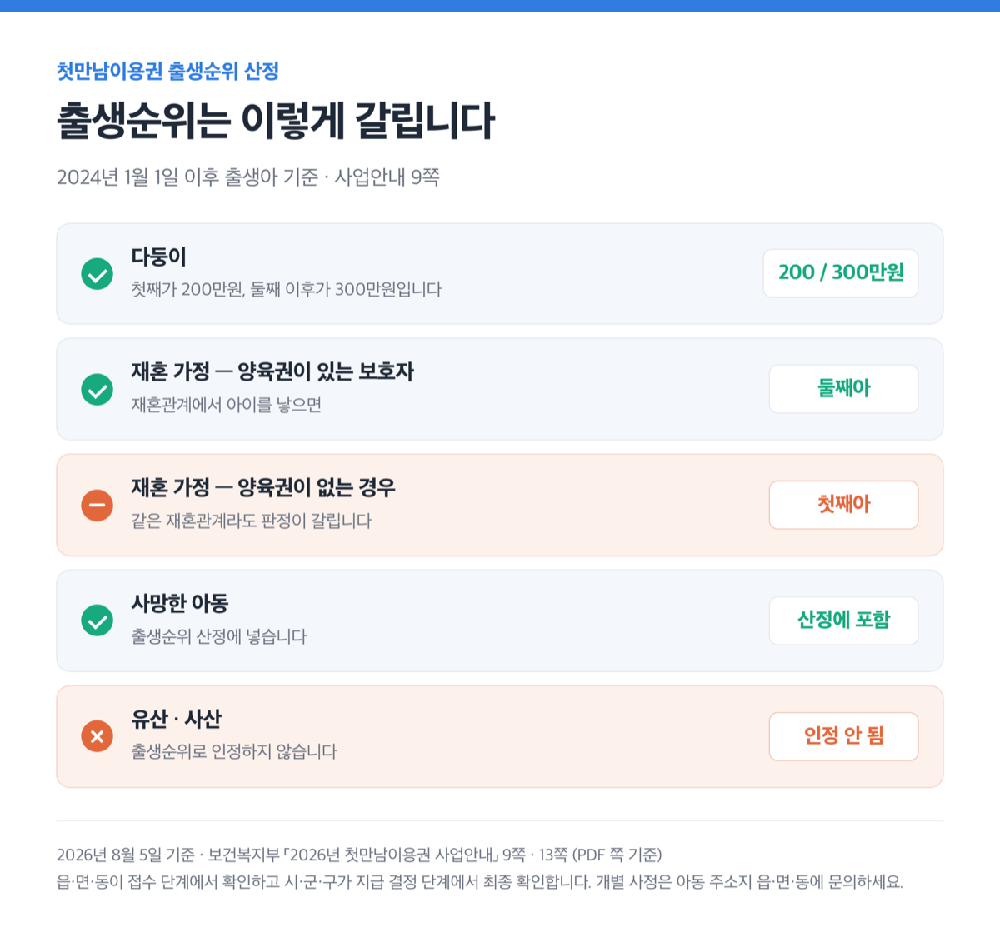
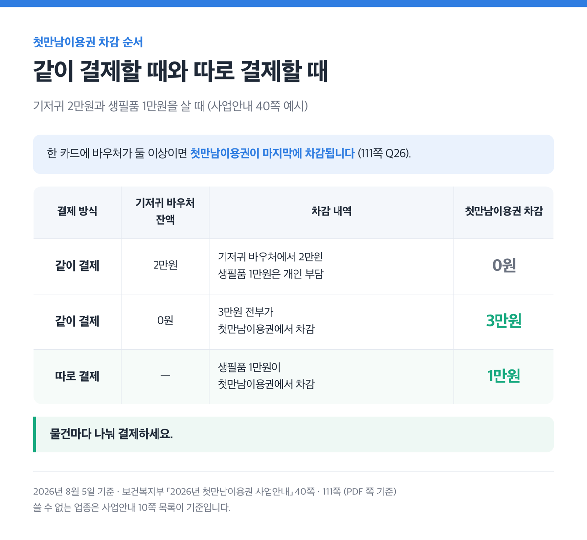

> [!SUMMARY] 2026년 8월 5일 기준
> 2026년 첫만남이용권은 첫째 200만원, 둘째 이상 300만원입니다. 대상은 2024년 1월 1일 이후 태어난 아이고, 소득은 안 봐요. 신청 기한은 따로 없지만 사용 기간은 출생일부터 ==2년==입니다.

근데 "1년"이라고 적힌 공식 안내도 남아 있어요.

## 2026년 금액은 첫째 200만원, 둘째부터 300만원입니다

보건복지부가 맡은 중앙정부 제도예요. 원칙은 바우처(쓸 수 없는 업종만 정해진 포인트형 이용권)고요.

현금으로 주는 건 두 경우만 예외로 인정해요. 하나는 시설보호 아동의 디딤씨앗통장이에요.

다른 하나는 보호자가 수형시설 안에서 아이를 키우는 경우예요. 수감 기간 중에 신청해야 하고 아동복지심의위원회 심의를 거쳐요. 시설 밖에서 키우면 보호자를 바꿔 바우처로 받아요.

| 구분 (2024.1.1. 이후 출생아) | 2026년 지급액 |
|---|---|
| 첫째아 | **200만원** |
| 둘째아 이상 | **300만원** |
| 디딤씨앗통장 현금 지급 | 200만원 (출생순위 무관) |

2023년 12월 31일 이전에 태어난 아이는 2026년 현재 대상이 아닙니다. 지원대상 정의가 "2024년 이후 출생아"라서 그래요. 그 이전 출생아에게는 출생순위와 무관하게 200만원이 나갔습니다.

공식 기준선은 "2024년 1월 1일 이후 출생한 아동부터"입니다.

소득과 재산은 보지 않아요.

2026년에 금액이 바뀌었다는 공식 문장은 없어요. 정책브리핑의 2026년 변경 목록에도 첫만남이용권은 없고요.

## 사용 기간은 2년인데 1년이라 적힌 안내가 남아 있어요

사용 종료일은 아이 출생일로부터 2년입니다. 2026년 1월 1일에 태어난 아이라면 2027년 12월 31일까지예요. 남은 포인트는 2028년 1월 1일 0시에 소멸합니다.

국민행복카드가 이미 있으면 지급 결정 다음 날 포인트가 채워지고, 그날이 사용 시작일이에요.

근데 1년이라 적힌 공식 안내가 남아 있어요.

| 문서 | 사용기간 표기 |
|---|---|
| 사업안내 본문, Q&A | 2년 |
| 사업안내 서식 5호 통지서 | 1년 |
| 정부24 지원대상란 | 1년 (2024년 이후 출생아는 2년 단서 병기) |

정부24 지원대상 정의는 "1년이 초과되지 않는 출생아"로 시작해요. 그 아래에 2024년 이후 출생아는 2년이라는 단서가 붙어 있고요. 앞 문장만 읽으면 1년으로 오해하기 쉬운 구조예요.

통지서 서식도 그래요. "사용기간은 아동 출생일로부터 1년"이라는 문장이 그대로 있어요. 다만 서식의 '이용권 유효기간' 란은 날짜를 직접 적게 돼 있어요.

기준은 **2년**입니다.

> [!WARNING]
> 결제를 취소해도 사용 기간이 끝나면 ==포인트는 돌아오지 않습니다==. 기간 안에 취소한 건도 마찬가지입니다. 복원에는 3~5일(공휴일 제외)이 걸려요.
>
> 종료일이 가까우면 취소 자체를 피하세요.

## 신청은 이 순서로 하면 돼요 📝

1. 출생신고를 하고 주민등록번호를 받아요.
2. 온라인은 [복지로](https://www.bokjiro.go.kr) 또는 [정부24 첫만남이용권](https://www.gov.kr/portal/service/serviceInfo/135200005015)에서 해요. 부모가 보호자일 때만 돼요.
3. 조부모 등 대리인은 방문 신청만 가능해요.
4. 방문지는 아동 주민등록 주소지 읍·면·동이에요. 2024년 10월부터 실제 거주지에서도 돼요. 다만 실거주지 신청은 상담이 제한되고 서류 이송에 시간이 들어요.
5. 출생신고와 같이 하려면 [행복출산 원스톱](https://www.gov.kr/portal/onestopSvc/happyBirth)을 쓰면 돼요.
6. 결정 통지는 접수일부터 30일, 특별한 사유가 있으면 60일 이내입니다.
7. 지급은 시·군·구가 결정한 날의 다음 날이에요.

신청 기한은 따로 없습니다.

> [!WARNING]
> 대신 사업안내는 사용종료일 **최소 2개월 전**에 신청하라고 권해요. 출생순위 확인에는 최대 30일이 걸릴 수 있다고도 안내하고요.

2026년 1월 2일 발간 시점 기준 발급 카드사는 5곳이에요. BC·삼성·롯데·KB국민·신한이고요. 같은 문서는 현대카드를 "'26.7.1.부터 추가(예정)"으로 적어요.

## 출생순위는 재혼과 다둥이에서 갈려요

담당자가 주민등록등본과 부모의 가족관계증명서로 출생순위를 확인해요. 부모와 자녀의 주민등록 주소지가 다르면 가족관계증명서(부모)를 따로 내야 해요.

다둥이는 첫째가 200만원, 둘째 이후가 300만원입니다.

재혼 가정은 양육권 유무로 판정이 나뉘어요.

양육권이 있는 보호자가 재혼관계에서 아이를 낳으면 **둘째아**로 봅니다. 양육권이 없으면 첫째아로 봅니다.

사망한 아동도 출생순위 산정에 넣습니다. 유산과 사산은 인정하지 않습니다.

읍·면·동이 접수 단계에서 확인하고, 시·군·구가 지급 결정 단계에서 최종 확인해요. 개별 사정은 아동 주소지 읍·면·동에 문의하세요.

## 기저귀 바우처가 먼저 빠집니다, 물건은 나눠 결제하세요

한 카드에 바우처가 둘 이상이면 첫만남이용권이 마지막에 차감됩니다.

다음 예시는 조건부예요. 기저귀 2만원과 생필품 1만원을 같이 결제하는 경우고요.

기저귀 바우처 잔액이 2만원이면 거기서 2만원이 빠져요. 생필품 1만원은 개인 부담이고요. 잔액이 0원이면 ==3만원 전부==가 첫만남이용권에서 빠집니다.

따로 결제하면 생필품 1만원이 첫만남이용권에서 차감돼요.

> [!TIP]
> 물건마다 나눠 결제하세요.

쓸 수 없는 업종은 사업안내 목록이 기준이에요.

- 유흥업소(일반 유흥 주점업, 무도 유흥 주점업, 생맥주 전문점, 기타 주점업), 사행업종(카지노, 복권방, 오락실), 레저업종(비디오방, 노래방)
- 위생업종(안마시술소, 마사지, 사우나) — 이미용실은 사용 가능
- 성인용품, 상품권, 면세점, 전자상거래상품권, **세금 및 공과금 납부**

원주시 복지포털 목록에는 카지노와 세금·공과금 납부가 빠져 있어요.

분실 신고가 늦으면 타인이 쓴 금액은 못 돌려받고, 차액만 지원받습니다.

## 잘못 지급되면 환수, 부정청구는 제재부가금까지 붙습니다

환수 주체는 관할 시·군·구청장이에요. 대상은 세 가지고요.

- 거짓이나 부정한 방법으로 청구한 경우
- 잘못 부여된 주민등록번호로 지급된 경우
- 행정 착오나 시스템 오류로 잘못 지급된 경우

부정청구에는 이자와 **부정이익 5배**의 제재부가금이 붙습니다. 사전 통지 전에 자진 신고하고 전액 반환하면 물리지 않아요.

결정에 이의가 있으면 60일 이내에 서면으로 냅니다. 통지받은 날부터 계산해요. 제출 대상은 특별자치시장·특별자치도지사·시장·군수·구청장이에요.

별도로 행정심판도 낼 수 있어요. 결정을 안 날부터 90일 이내입니다.

수급권은 양도·담보 제공·압류가 안 돼요.

## 지자체 출산지원금은 첫만남이용권과 별개예요 📍

첫만남이용권은 전국이 같아요. 지자체 출산지원금은 별도 제도고요.

행복출산 신청서에도 "지방자치단체 서비스" 칸이 따로 있어요. 금액과 조건은 사는 지역에 따라 다를 수 있으니 **거주지 지자체에서 꼭 확인해 보세요**.

문의는 보건복지상담센터 129, 한국사회보장정보원 1566-3232예요.

> [!ACTION]
> 아직 신청 전이라면 복지로나 정부24에서 바로 하세요. 출생신고와 같이 하면 신청서를 한 번만 쓰면 돼요.

참고: 보건복지부 「2026년 첫만남이용권 사업안내」
</content>
