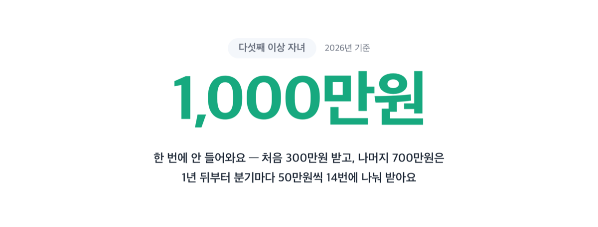
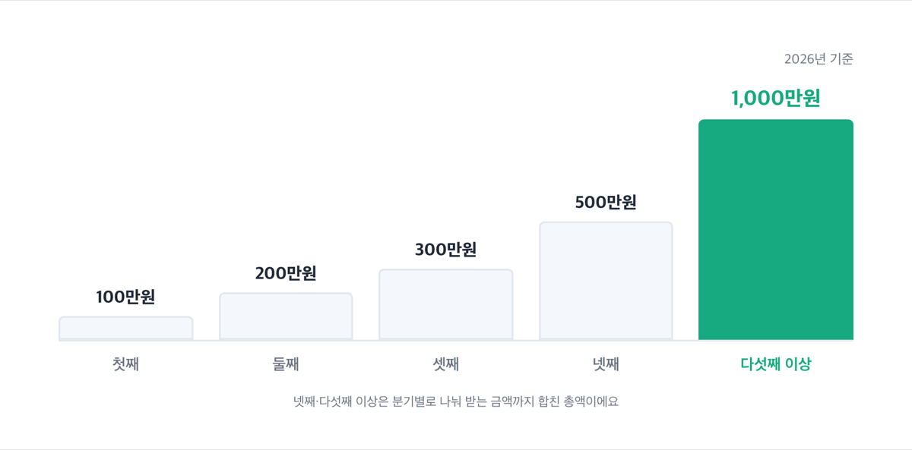
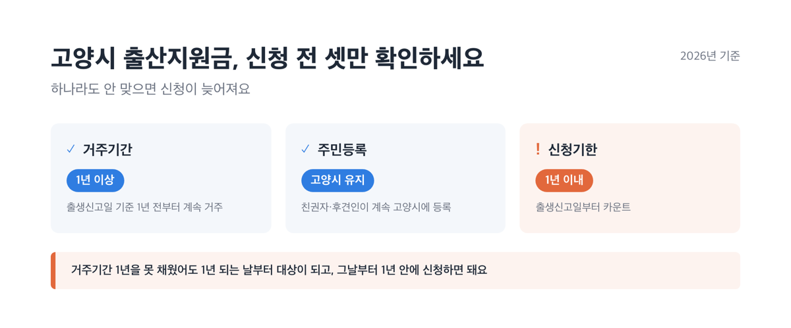
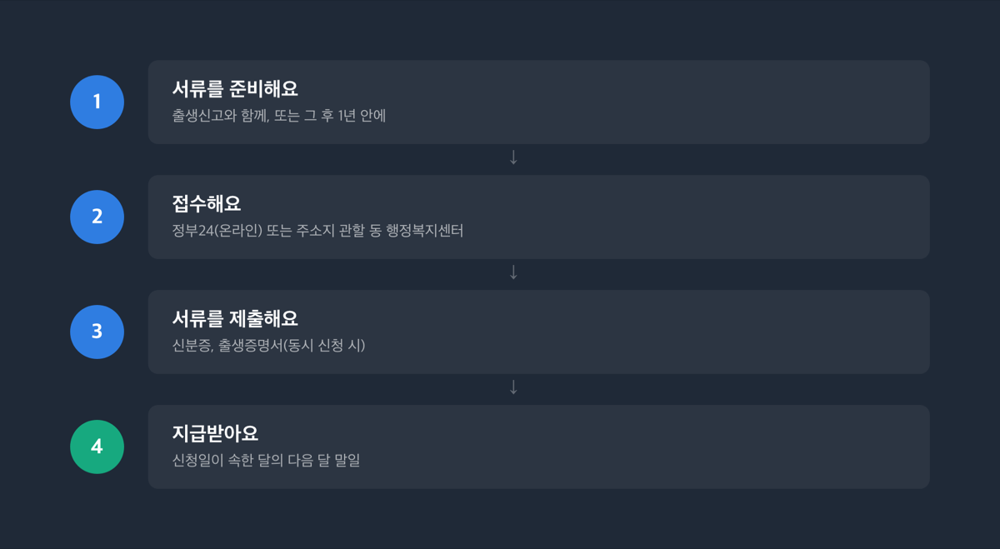
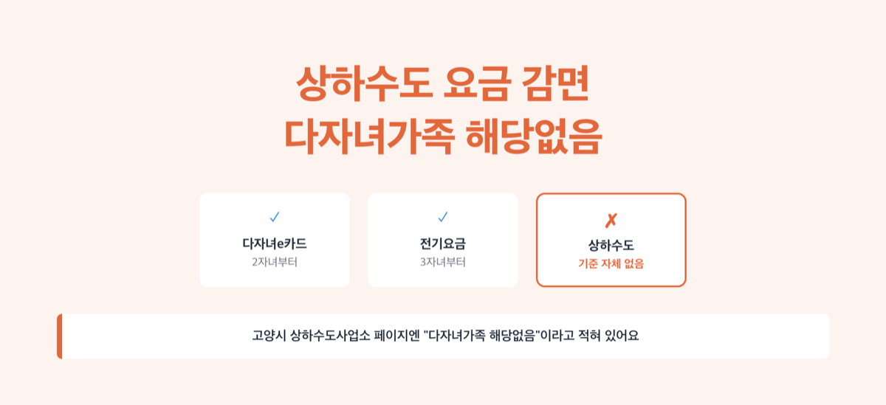
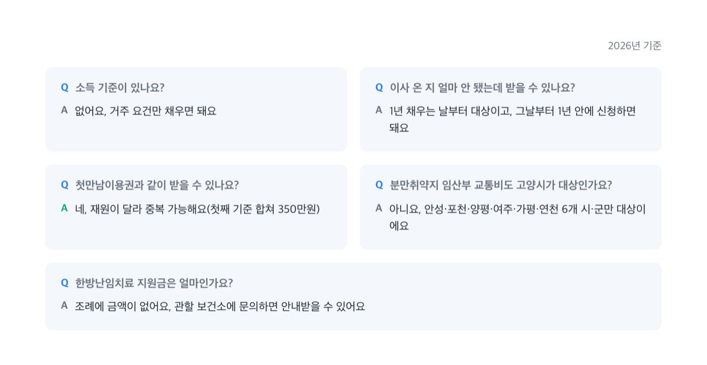

# 고양시 출산지원금 최대 1000만원, 2026년 얼마 받나

📌 2026년 9월 1일 기준

1,000만원이에요. 고양시에서 다섯째 이상 자녀를 낳으면 나오는 출산지원금 최대치인데, 통장에 한 번에 들어오는 돈은 아닙니다.

**3줄 요약**
- 고양시 출산지원금은 첫째 100만원부터 다섯째 이상 1,000만원까지 자녀 순서마다 달라져요.
- 산후조리비(경기도 매칭)·전월세자금 대출이자·장애인가정 출산지원금까지 고양시 자체 지원이 넷 더 있어요.
- 신청 전에 거주기간(1년)과 신청 기한부터 확인해야 나중에 손해를 안 봅니다.

여기 나온 지원은 전부 고양시에 실제로 살고 주민등록도 두고 있어야 나옵니다. 경기도 차원에서 공통으로 주는 지원(경기아이플러스카드 근거 조례 등)은 [화성시 임신·출산·육아 지원금 총정리](https://blog.onioniworks.com/posts/childcare-childbirth/hwaseong-benefits-2026/)에서 이미 정리했으니, 이 글은 고양시 자체 지원만 자세히 짚습니다.

## 💰 고양시 출산지원금, 자녀 순서마다 이렇게 다릅니다

고양시 출산지원금은 「고양시 출산·양육 지원에 관한 조례」에 따라 시가 출생아마다 주는 현금 지원입니다. 자녀가 몇째인지에 따라 금액이 달라져요.

| 자녀 순서 | 지원 금액 | 지급 방식 |
|---|---|---|
| 첫째 | 100만원 | 한 번에 |
| 둘째 | 200만원 | 한 번에 |
| 셋째 | 300만원 | 한 번에 |
| 넷째 | 500만원 | 300만원 먼저, 1년 뒤부터 분기별 50만원씩 4회 |
| 다섯째 이상 | 1,000만원 | 300만원 먼저, 1년 뒤부터 분기별 50만원씩 14회 |

다섯째 이상이면 최대치가 1,000만원이지만, ==한 번에 안 들어와요==. 처음엔 300만원만 받고, 나머지 700만원은 분기마다 50만원씩 14번에 나눠 받습니다.

> 「고양시 출산·양육 지원에 관한 조례」 제8조② — 넷째·다섯째 이상 자녀 신청인은 최초 신청일부터 분할 지급일까지 계속 고양시에 주민등록을 두고 거주해야 합니다.

왜 나눠서 주는지 조문에 정확한 이유가 적혀 있진 않지만, 받고 바로 다른 지역으로 옮기는 걸 막으려는 목적으로 보여요(추정). 계속 거주해야 나머지가 나온다는 조건이 같은 조문에 붙어 있거든요. 저라면 넷째 이후 계획이 있는 가정만 이 조례를 보고 이사를 늦춥니다. 분할 지급이 끝나는 데 최소 3년 넘게 걸리는데, 그 사이에 다른 시·군으로 옮기면 남은 돈을 못 받거든요.

자격 요건도 확인해야 합니다.

- 출생신고일 기준 **1년 전부터** 고양시에 주민등록을 두고 계속 살고 있는 친권자·후견인 *(거주기간이 1년이 안 되면 1년을 채우는 날부터 대상이 됩니다)*
- 신청 기한: 출생신고일부터 **1년 이내**
- 지급계좌: 친권자·후견인 또는 출생아 명의 계좌만 가능
- 조부모 대리신청 가능 *(신청인이 직접 하기 어려운 경우에 한해요)*

> 저희 집은 이사 온 지 8개월밖에 안 됐는데 못 받나요?
> 거주기간 1년을 못 채웠어도 괜찮아요. 1년이 되는 날부터 지원 대상이 되고, 그날부터 1년 안에 신청하면 됩니다. 신청이 막히는 게 아니라 시작 시점이 늦춰지는 것뿐이에요.

결국 핵심은 하나입니다. 이사 온 지 얼마 안 됐어도 서두르지 않아도 됩니다.

신청 방법은 이렇습니다.

1. 출생신고와 함께, 또는 그 후 1년 안에 신청 서류를 준비합니다.
2. 정부24(온라인) 또는 주소지 관할 동 행정복지센터를 방문합니다.
3. 신분증과 출생증명서(동시 신청 시)를 제출합니다.
4. 신청일이 속한 달의 다음 달 말일에 지급됩니다.

2026년 고양시가 출산 지원에 쓰는 예산은 전년보다 24억원 늘어난 231억원이에요. 같은 해 고양시 출생아 수도 5,522명으로 1년 전보다 4% 늘었습니다.

## 현금 말고 물품도 나옵니다 — 쌀케이크와 다복꾸러미

고양시는 출산지원금과 별도로 물품도 챙겨줍니다. 모든 출산가정에 주는 탄생축하 쌀케이크와, 셋째 이상을 낳은 가정에만 더 주는 다복꾸러미예요. 정확한 조례 조문으로 딱 짚긴 어렵지만, "홍보물품 등의 제작·배부"를 규정한 조례 제5조 7호에 준하는 사업으로 보입니다(추정).

- **탄생축하 쌀케이크** — 우리쌀·우리밀 케이크·쿠키류 13종 중 택1 + 고양 가와지쌀 150g *(케이크류는 고양시 안에서만 배송되고, 쿠키류는 전국 배송이 가능해요)*
- **다복꾸러미(셋째 이상만)** — 플레이매트+촉감놀이인형, 오가닉 아기옷 세트, 국산 들기름+담요, 큰 담요 중 택1

> [!WARNING]
> 두 가지 다 출생신고일로부터 **3개월 이내**에 신청해야 해요. 출산지원금(1년 이내)보다 기한이 훨씬 짧습니다.

신청은 주소지 관할 동 행정복지센터를 직접 방문하거나(우편·팩스는 안 돼요), 정부24 행복출산 원스톱서비스로 하면 됩니다.

> 솔직히 말하면 — 쌀케이크 신청 기한(3개월)과 출산지원금 기한(1년)을 혼동하는 경우를 종종 봅니다. 따로 챙기세요.

탄생축하 쌀케이크는 장애인 직업재활시설 '소울베이커리'가, 다복꾸러미는 노인 일자리 기관 '고양시니어클럽'이 만듭니다.

## 산후조리비 50만원, 사실은 경기도가 반을 냅니다

산후조리비 지원은 고양시 보건소 페이지에 다른 지원들과 나란히 있어서 고양시 사업처럼 보이는데, 근거를 따라가 보면 「경기도 산후조리비 지원 조례」가 만든 도-시 매칭사업이에요. ==이름은 고양시 같아도 재원은 경기도==입니다. 그래서 신청 창구도 고양시 자체가 아니라 경기도 시스템(경기민원24)이나 관할 행정복지센터입니다.

- 지원 금액: 출생아 1인당 **50만원** (쌍둥이 100만원, 세쌍둥이 150만원)
- 지급 형태: 고양시에서만 쓰는 지역화폐 '고양페이'
- 신청 기한: 출생일로부터 **12개월 이내**
- 대상: 출생일·신청일 현재 경기도에 주민등록을 두고 실제로 살고 있어야 함

경기도 차원의 산후조리비 조례 구조와 다른 시·군 비교는 [화성시 임신·출산·육아 지원금 총정리](https://blog.onioniworks.com/posts/childcare-childbirth/hwaseong-benefits-2026/)에 정리했으니, 여기서는 고양시에서 실제로 어떻게 쓰이는지만 짚을게요.

고양페이는 고양시 산후조리원, IC카드 단말기가 있는 산모·신생아 건강관리사 서비스 제공기관, 그 외 고양페이 가맹점에서 쓸 수 있어요. 대형마트·백화점·온라인몰 같은 곳은 안 됩니다.

> 이거 고양시에서 주는 거 아니었어요?
> 이름은 비슷해 보여도 재원은 경기도예요. 그래서 신청 창구도 고양시 자체 온라인 페이지가 아니라 경기민원24(gg24.gg.go.kr)입니다.

문의처는 사는 구에 따라 다릅니다. 덕양구보건소(031-8075-4033), 일산동구보건소(031-8075-4118), 일산서구보건소(031-8075-4195)에 확인하세요.

중앙정부 지원과는 완전히 다른 돈입니다.

| 지원 | 금액 | 소관 |
|---|---|---|
| 첫만남이용권 | 첫째 200만원·둘째 이상 300만원 | 중앙정부 |
| 부모급여 | 0세 월 100만원·1세 월 50만원 | 중앙정부 |
| 산후조리비 | 1인당 50만원(고양페이) | 경기도+고양시 |
| 고양시 출산지원금 | 100만~1,000만원 | 고양시 |

첫째를 기준으로 1회성 현금만 더하면 첫만남이용권 200만원 + 고양시 출산지원금 100만원 + 산후조리비 50만원, 합쳐서 350만원이에요. 다만 각각 기한과 거주 요건이 달라서 셋 다 받는다는 보장은 아닙니다.

## 고양시만 있는 조례 둘 — 장애인가정과 전월세자금

### 장애인가정 출산지원금

「고양시 장애인가정 출산지원금 지원에 관한 조례」로 따로 있는 지원이에요. 여성장애인 출산비용지원이나 국민기초생활보장법 해산급여, 앞서 본 고양시 출산지원금까지 받고 있어도 중복으로 더 받을 수 있습니다.

- 대상: 신생아 출생일 기준 부모가 모두 고양시에 주민등록을 두고, 그중 한 명은 1년 이상 계속 거주한 장애인가정 *(미혼모·한부모는 배우자 주소를 확인하지 않아요)*
- 금액: 신생아 1인당 **100만원 이내** *(장애 정도로 나누지 않는 단일 기준입니다)*
- 신청 기한: 출생일부터 1년 이내
- 지급: 접수 후 30일 이내 계좌 입금
- 문의: 장애인복지과 031-8075-3299

### 출산가구 전월세자금 대출이자 지원

2021년 전국 최초로 만든 고양시 자체 조례예요. 출산가구가 낸 전월세 대출 이자의 일부를 시가 돌려줍니다. 이자만 지원하는 구조라서, 대출을 다 갚고 나면 지원도 함께 끝나요.

- 대상: 출생·입양 연도 다음 해부터 4년 이내, 무주택, 가구소득 중위소득 150% 이하 *(생계·의료·주거급여 수급자나 공공임대주택 거주자는 제외돼요)*
- 금액: 대출 잔액의 1.8%, 연 1회 최대 100만원, 최대 4회
- 2026년 신청 기간: 1월 5일~1월 30일

> [!WARNING]
> 2026년 신청은 이미 1월에 끝났어요(1월 5일~30일). 오늘(9월) 이 글을 읽고 있다면 2027년 1월 공고를 기다려야 합니다.

2021년 이 조례가 생긴 뒤로 지금까지 4,431가구가 받았어요. 문의는 고양시민원콜센터(031-909-9000)로 하면 됩니다.

## 다자녀 혜택, 기준이 사업마다 다릅니다

다자녀 혜택은 하나로 뭉뚱그릴 수 없어요. 고양다자녀e카드는 2자녀부터, 전기요금은 3자녀부터, 상하수도는 아예 다자녀 기준이 없습니다.

| 항목 | 다자녀 기준 | 혜택 |
|---|---|---|
| 고양다자녀e카드·공영주차장 | 2자녀 이상(막내 19세 미만) | 공영주차장 50% 등 |
| 전기요금 | 3자녀 이상(또는 5인 이상 가구, 3년 미만 영아) | 요금 30%, 최대 16,000원 |
| 상하수도 | 기준 자체 없음 | 다자녀 대상 아님 |

기준이 이렇게 다른 이유는 각 사업이 서로 다른 시기, 다른 부서에서 따로 만들어졌기 때문으로 보여요(추정). 예산도 관리 부서도 서로 다른 거죠.

2025년 12월 17일부터는 고양다자녀e카드 전용 앱이 없어지고, 경기똑D 앱 안에서 도민카드를 추가하면 자동으로 발급돼요. 조부모가 세대주여도, 부모가 자녀와 세대가 나뉘어 있어도 따로 증빙서류를 낼 필요가 없어졌습니다. 카드 유효기간은 발급일로부터 3개월이라 지나면 다시 발급받아야 해요.

협력 가맹점 혜택 중 대표적인 네 가지만 추리면 이렇습니다.

- 4대궁·종묘·조선왕릉 입장료 전액 감면 *(카드 소지 부모 + 24세 이하 내국인)*
- 원마운트 입장료 60% 할인, 아쿠아플라넷일산 30% 할인
- 고양시 공영주차장 두자녀 이상 가정 50% 할인
- 목공체험장 50% 할인

화성시는 상하수도 요금도 다자녀(3인 이상)면 깎아주는데, 고양시는 다릅니다. 고양시 상하수도사업소 페이지에는 "차상위, 다자녀가족, 장애인 해당없음"이라고 분명히 적혀 있어요. 다자녀라고 상하수도 요금까지 자동으로 감면될 거라 기대하면 안 됩니다.

전기요금 감면은 한전이 전국 공통으로 운영하는 제도라서 고양시만의 혜택은 아니에요. 그래도 고양시에 사는 다자녀 가정도 그대로 적용됩니다.

## 이혼 후 양육비를 못 받았다면 — 이건 다른 얘기입니다

여기까지 나온 지원은 출산·다자녀 자체가 조건이었어요. 그런데 고양시에는 성격이 완전히 다른 지원이 하나 더 있습니다. 「고양시 한시적 양육비 지원에 관한 조례」인데, 대상이 신생아나 다자녀 가정 전체가 아니라 ==이혼 후 양육비를 못 받는 가정만== 좁혀서 대상으로 삼습니다.

법원이 양육비를 주라고 판결·명령했는데도 상대방(비양육 부모)이 안 주면, 자녀 복지가 위태로워질 수 있어요. 그럴 때 시가 대신 한시적으로 돈을 채워주는 구조입니다.

- 대상: 신청일 기준 1년 전부터 고양시 거주 + 양육비 직접지급명령·담보제공명령·일시금지급명령·이행명령 중 하나가 확정됐는데도 못 받은 경우 + 가구소득 중위소득 150% 이하
- 금액: 미성년 자녀 1인당 **월 20만원**, 한 차례에 한정해 최대 9개월(최대 180만원)
- 종료: 양육비 채무자가 실제로 지급하면 즉시 끝나고, 같은 자녀로는 다시 신청 못 함
- 문의: 여성가족과 031-8075-3327

출산지원금이나 다자녀 혜택과 혼동하지 마세요. 이 지원은 이혼 후 양육비를 못 받는 가정만을 위한 겁니다.

## ❓ 고양시 출산지원금 관련 궁금증 해결

**Q. 소득 기준이 있나요?**
A. 고양시 출산지원금 자체엔 소득 기준이 없어요. 거주 요건만 채우면 소득과 상관없이 받을 수 있습니다. 다만 전월세자금 대출이자 지원은 가구소득이 중위소득 150% 이하여야 해요.

**Q. 이사 온 지 얼마 안 됐는데 받을 수 있나요?**
A. 거주기간이 1년 미만이면 1년을 채우는 날부터 대상이 되고, 그날부터 1년 안에 신청하면 됩니다.

**Q. 첫만남이용권이랑 같이 받을 수 있나요?**
A. 네, 재원이 달라서 중복으로 받을 수 있어요. 첫째 기준으로 첫만남이용권 200만원, 고양시 출산지원금 100만원, 산후조리비 50만원을 더하면 350만원이에요. 다만 각각 기한과 요건이 달라서 셋 다 받는다는 보장은 아니에요.

**Q. 경기도 분만취약지 임산부 교통비도 고양시가 대상인가요?**
A. 아니요. 이 사업은 안성·포천·양평·여주·가평·연천, 6개 시·군만 대상이에요. 고양시는 분만이 가능한 병원이 있어서 빠져 있습니다.

**Q. 한방난임치료 지원금은 얼마인가요?**
A. 조례에 구체적인 금액이 나와 있지 않고, 시장이 정해서 지원하는 구조예요. 정확한 금액은 관할 보건소에 문의하면 바로 안내받을 수 있어요.

여기까지 정리한 걸 순서대로 보면, 저라면 이렇게 움직입니다. 출생신고를 하면서 동 행정복지센터에서 고양시 출산지원금과 탄생축하 쌀케이크(셋째 이상이면 다복꾸러미까지)를 한 번에 신청하고, 같은 방문에서 경기도 산후조리비도 접수합니다. 창구가 같아서 한 번에 끝나거든요. 전월세로 살고 있다면 다음 해 1월 공고를 놓치지 않는 게 핵심입니다.

참고: 국가법령정보센터 「고양시 출산·양육 지원에 관한 조례」·「고양시 장애인가정 출산지원금 지원에 관한 조례」·「고양시 출산가구 전월세자금 대출이자 지원 조례」·「고양시 한시적 양육비 지원에 관한 조례」·「경기도 산후조리비 지원 조례」 · 고양특례시청 「출산·양육지원」 페이지 · 고양특례시 보건소 「산후조리비지원」 페이지 · 경기도청 「출산장려금 및 양육비 지원현황」·「경기아이플러스(I-Plus) 카드」 페이지 · 복지로 「첫만남이용권」·「부모급여 지원」·「경기도 분만취약지 임산부 교통비 지원사업」 서비스 상세 · 한국전력공사 「대가족/다자녀/출산가구 요금 신청 업무안내」 · 고양시 상하수도사업소 「수도요금 감면안내」
