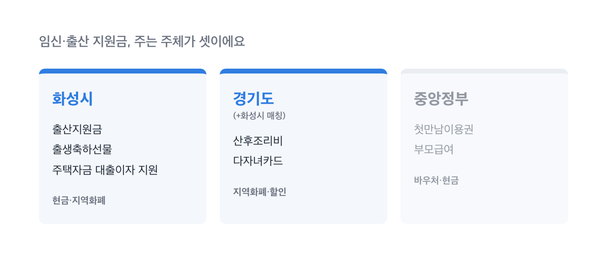
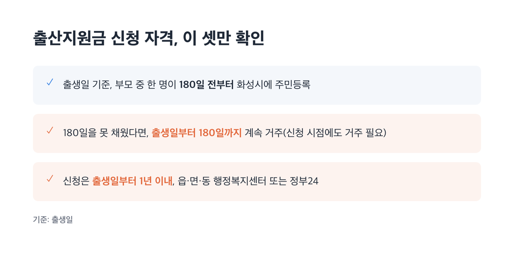
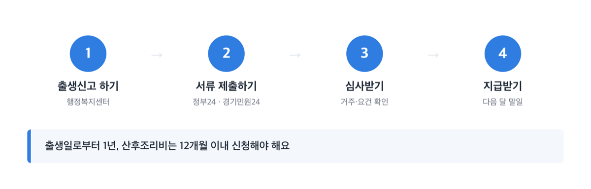
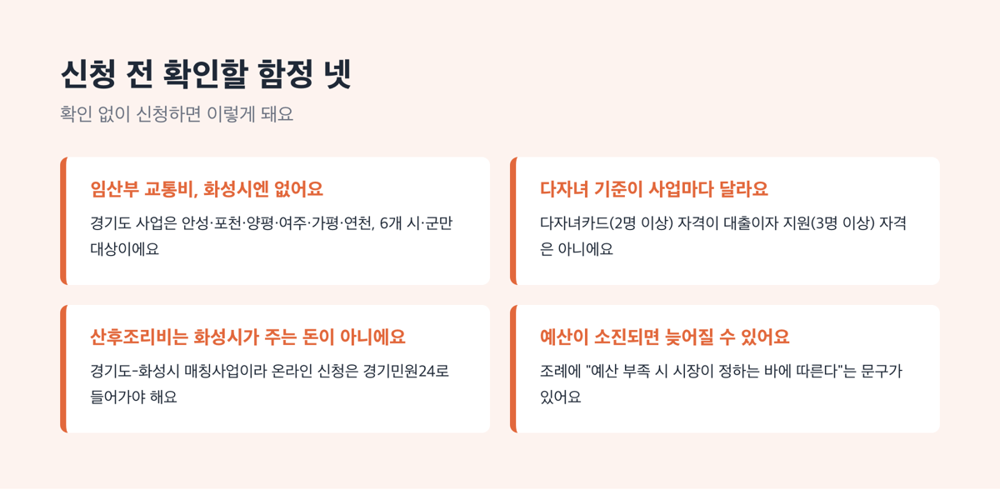

# 화성시 출산지원금, 2026년 첫째 100만~넷째 300만원

📌 2026년 8월 31일 기준

> [!WARNING]
> 화성시 출산지원금과 경기도 산후조리비는 둘 다 **출생일로부터 1년(12개월) 이내** 신청해야 해요. 기한을 넘기면 소급 지급이 안 됩니다.

360만원이에요. 첫째 아이를 낳았을 때 중앙정부·화성시·경기도가 주는 돈 중, 부모급여처럼 매달 나오는 돈은 빼고 한 번에 받는 돈만 더하면 나오는 숫자예요. 그런데 이 넷을 전부 챙기는 부모는 생각보다 많지 않아요.

**3줄 요약**
① 화성시가 직접 주는 돈은 출산지원금(첫째 100만~넷째 300만원)과 출생축하선물(10만원)이고, 경기도가 화성시와 함께 주는 산후조리비 50만원은 완전히 다른 돈이에요.
② 신청 기한은 둘 다 출생일로부터 1년(12개월) 이내이고, 화성시엔 임산부만을 위한 교통비 지원이 따로 없어요.
③ 다자녀 혜택은 카드·대출이자·요금감면마다 기준(2명/3명/3명+미성년)이 달라서 내 가구가 어디에 해당하는지부터 확인해야 해요.

이 글에서는 화성시·경기도·중앙정부가 각각 주는 돈을 주체별로 나눠 정리해요.

## 💰 화성시 임신·출산 지원금, 주는 주체가 셋이에요

화성시 공식 페이지를 보면 출산지원금·산후조리비·다자녀카드가 한 화면에 나란히 나와서 전부 화성시가 주는 돈처럼 보여요. 실제로는 이렇게 나뉩니다.

| 주는 주체 | 대표 지원 | 지급 형태 |
|---|---|---|
| 화성시 | 출산지원금, 출생축하선물, 주택자금 대출이자 지원 | 현금·지역화폐 |
| 경기도(+화성시 매칭) | 산후조리비, 다자녀카드 | 지역화폐·할인 |
| 중앙정부 | 첫만남이용권, 부모급여 | 바우처·현금 |

중앙정부 지원인 첫만남이용권·부모급여는 지난 「아이맞이지원금」 글에서 이미 다뤘어요. 여기서는 화성시·경기도 지원과 겹치지 않도록 구분하는 용도로만 다시 짚습니다.

한 가지 미리 밝혀 둘 게 있어요. 화성시에는 임산부만을 위한 교통비 지원이 따로 없습니다. 자세한 이유는 아래 함정 항목에서 짚어요.

## 화성시 출산지원금·출생축하선물, 얼마를 언제까지 받나

**출산지원금**은 「화성시 출산 지원에 관한 조례」에 따라 지급됩니다. 자녀 순위별 금액은 이렇습니다.

| 자녀 순위 | 지급 금액(1인당 상한액) | 지급 방식 |
|---|---|---|
| 첫째 | 100만원 이내 | 시장이 정하는 기준에 따라 지급 |
| 둘째·셋째 | 1명당 200만원 이내 | 〃 |
| 넷째 이후 | 1명당 300만원 이내 | 실제로는 2회 나눠서 지급 |

조례 원문은 "예산의 범위에서 지급할 수 있다"고 씁니다. '할 수 있다'는 표현, 법령에서는 재량이 있다는 뜻이에요. 그래도 화성시는 지금까지 이 기준대로 지급해 왔고, 조례·화성시 공식 페이지·경기도청 비교표 세 곳의 금액이 정확히 일치합니다.

신청 자격은 다음 셋을 봐야 해요.

1. 출생일 기준으로 부모 중 한 명이 **180일 전부터** 화성시에 주민등록을 두고 살아야 해요
2. 180일을 채우지 못했다면, 출생일부터 180일이 지날 때까지 계속 화성시에 살면 대상이 됩니다 *(신청 시점에도 화성시에 살고 있어야 해요)*
3. 신청은 **출생일부터 1년 이내**에 읍·면·동 행정복지센터나 정부24에서 합니다

> 저는 임신 8개월 때 화성시로 전입했는데, 출산 시점엔 거주 기간이 180일이 안 되는데요?
>
> 조례 제4조 제2항을 보면 됩니다. 출생일부터 180일이 지날 때까지 화성시에 계속 살고, 그 시점에도 화성시 주민등록을 유지하고 있으면 지원 대상이 돼요. 다만 신청일 현재도 화성시에 살고 있어야 한다는 조건은 그대로예요.

지급 시기는 신청한 달의 다음 달 말일입니다. 출생 순위는 가족관계증명서 등재 기준으로 판정하고, 재혼가정의 전혼 자녀는 주민등록상 같은 세대에 등재된 경우에만 순위에 들어갑니다.

문의처: 만세구청 031-5189-1172 · 효행구청 031-5189-7652 · 병점구청 031-5189-4284·4304 · 동탄구청 031-5189-5203 (저출생대응과 031-5189-3971)

**출생축하선물**은 출산지원금과는 다른 돈이에요.

**솔직히 말하면** — 출생축하선물 10만원이라는 숫자, 화성시 홈페이지 본문에는 직접 나오지 않아요. 근거 조례인 「화성시 인구정책 기본 조례」 제18조에도 금액은 없고, 경기도청이 31개 시·군 자료를 모아 만든 비교표에서 10만원으로 확인했어요.

출생축하선물은 출생 순위와 관계없이 10만원, 지역화폐로, 1회 지급됩니다. 화성시에 주민등록을 두고, 화성시에 출생신고(또는 입양신고)를 마친 경우가 대상이에요. 출산지원금과 신청 창구는 같지만, 근거 조례와 금액 산정 방식이 완전히 다른 사업입니다.

## 경기도 산후조리비 50만원, 화성시가 주는 돈이 아니에요

화성시 공식 페이지를 보면 산후조리비가 출산지원금과 나란히 적혀 있지만, 재원과 근거 조례는 전부 경기도 것입니다.

「경기도 산후조리비 지원 조례」 제2조는 산후조리비를 "경기도와 시·군이 협력하여 출산가정에 지급하는 사회보장적 금전"이라고 정의합니다. 도지사가 시·군에 경비를 내려보내고, 실제 지급은 화성시가 하는 구조예요.

| 항목 | 경기도 산후조리비 지원 내용 |
|---|---|
| 지급 금액 | 출생아 1인당 50만원, 지역화폐(카드형), 1회 |
| 대상 요건 | 부모 중 1명이 출생일·신청일 현재 경기도 주민등록 + 신청일 현재 실제 거주 |
| 신청 기한 | 출생일로부터 12개월 이내 |
| 신청 방법 | 읍·면·동 행정복지센터 또는 경기민원24 |
| 환수 | 대상이 아닌데 지급됐거나 부정수급이면 시·군이 환수 |

물론 신청 창구가 화성시 읍·면·동이라 화성시 사업처럼 느껴질 수 있어요. 그러나 온라인으로 신청할 때는 정부24가 아니라 **경기민원24**로 들어가야 한다는 점이 이 사업의 성격을 보여줍니다.

화성시 지원금, 경기도 산후조리비, 중앙정부 첫만남이용권은 재원이 각각 다릅니다.

문의처: 만세구보건소 031-5189-3559·3563 / 효행구보건소 031-5189-6265 / 병점구보건소 031-5189-4440 / 동탄구보건소 031-5189-5085·4370·5076·6944

**중앙정부 지원과도 겹쳐 보기 쉬워요.** 첫만남이용권과 부모급여는 화성시·경기도가 아니라 전국 공통으로 나오는 돈입니다.

| 제도(운영 주체) | 금액(자녀 순위·연령 기준) | 지급 형태 |
|---|---|---|
| 첫만남이용권(중앙, 보건복지부) | 첫째아 200만원, 둘째아 이상 300만원 | 바우처(포인트) |
| 부모급여(중앙, 보건복지부) | 0세 월 100만원 (2세부터 가정양육수당 전환) | 현금 |
| 산후조리비(경기도+화성시) | 1인당 50만원, 1회 | 지역화폐 |
| 출산지원금+출생축하선물(화성시) | 첫째 110만원 / 둘째·셋째 210만원 / 넷째 이상 310만원 | 현금+지역화폐 |

==200(첫만남이용권)+110(출산지원금+출생축하선물)+50(산후조리비)=360만원==이 나와요. 매달 나오는 부모급여(월 100만원)는 한 번에 받는 돈이 아니라서 이 합계에는 넣지 않았어요. 넷을 전부 받는다고 보장하는 숫자도 아니에요. 신청 기한과 거주 요건이 항목마다 달라서, 하나라도 놓치면 그만큼 빠집니다.

## 다자녀가구 혜택, 기준부터 다시 봐야 해요

다자녀 혜택은 셋인데, "다자녀"의 기준이 사업마다 다릅니다. 이걸 같은 기준으로 생각하면 자격이 있는 줄 알았다가 없는 경우가 생겨요.

| 사업 | 다자녀 기준 | 운영 주체 |
|---|---|---|
| 경기도 다자녀카드 | 미성년 자녀 1명 포함 2명 이상 | 경기도(발급은 화성시) |
| 화성시 주택자금 대출이자 지원 | 자녀 3명 이상, 그중 1명 이상 만 18세 이하 | 화성시 |
| 공공요금 감면(전기·가스·난방·상하수도) | 자녀(손자녀 포함) 3인 이상 | 창구는 화성시, 기준은 대부분 전국 공통 |

**경기도 다자녀카드**는 미성년 자녀 1명을 포함해 자녀 2명 이상이면 신청할 수 있어요. 공연 관람료 50% 감면, 문화센터 이용료 감면, 공영주차장 요금 감면 같은 할인 혜택이지 현금은 아닙니다. 경기똑D 앱으로 모바일 카드를 바로 받거나, 읍·면·동 행정복지센터에서 실물카드를 신청하면 약 3주 걸려요. 모바일 앱카드는 막내 자녀가 만 18세가 될 때까지 자동으로 연장됩니다.

문의처: 화성시 저출생대응과 031-5189-3928

**화성시 다자녀가구 주택자금 대출이자 지원**은 자녀 3명 이상을 키우면서 그중 1명 이상이 만 18세 이하인 무주택세대구성원이 대상이에요. 주택자금 대출 잔액의 1.5% 이내, ==최대 150만원==까지 이자를 지원합니다. 2026년 접수는 4월 15일부터 28일까지였고, 오늘(2026년 8월 31일) 기준 이미 마감됐어요. 다음 공고 일정은 화성시 홈페이지 공지사항에서 확인하시면 됩니다.

**공공요금 감면**은 세대주 기준 자녀(또는 손자녀) 3인 이상이면 아래 넷을 받을 수 있습니다. 상하수도요금을 뺀 나머지 셋은 화성시만의 정책이 아니라 전국 공통 기준이에요.

| 요금 항목 | 감면 내용(자녀 3인 이상 가구, 월 기준) | 문의처 |
|---|---|---|
| 전기요금 | 월 최대 30%, 월 16,000원 한도 | 한국전력공사 123 (전국 공통) |
| 도시가스요금 | 취사전용 월 420원 / 취사·난방용 동절기(12~3월) 월 6,000원, 비동절기(4~11월) 월 1,650원 | ㈜삼천리 1544-3002 (전국 공통) |
| 지역난방비 | 월 4,000원, 매년 8월 1회 지급(전년 3월~해당연도 2월분) | 한국지역난방공사 1688-2488 (전국 공통) |
| 상하수도요금 | 상수도 월 최대 10㎥ 감면(최대 6,600원), 하수도 월 최대 10㎥ 감면(최대 7,710원) | 화성시 맑은물운영과 031-5189-3272 (화성시 자체) |

전기요금은 "월 최대 30%"라는 말만 보면 커 보이지만, 상한이 월 16,000원이라 원래 요금이 낮은 집은 실제로 그보다 훨씬 적게 깎여요.

## 신청 방법 — 어디서, 언제까지

화성시 출산지원금·출생축하선물은 이렇게 신청합니다.

1. 아이 출생신고를 하면서 읍·면·동 행정복지센터를 방문하거나, 정부24에서 온라인으로 신청해요
2. 신청서, 신청인 신분증, 통장 사본을 준비합니다
3. 출생일로부터 1년 이내에 신청을 마쳐야 해요
4. 신청한 달의 다음 달 말일에 지정한 통장으로 입금됩니다

경기도 산후조리비는 창구가 다릅니다.

1. 출생일로부터 12개월 이내에 주소지 읍·면·동 행정복지센터를 방문하거나, 경기민원24에서 온라인으로 신청해요 *(정부24가 아니에요)*
2. 심사를 거쳐 지역화폐(카드형)로 50만원이 지급됩니다

저라면 출생신고를 하러 가는 날 출산지원금·출생축하선물·산후조리비를 한꺼번에 신청해요. 신청 창구(정부24·경기민원24)가 따로 있어서, 미뤄서 준비하면 서류를 두 번 떼야 하거든요.

## ⚠️ 자주 걸리는 함정 넷

1. **"경기도가 임산부 교통비를 준다"는 말만 보고 신청하려 하면 헛수고예요.** 경기도 분만취약지 임산부 교통비 지원사업은 안성시·포천시·양평군·여주시·가평군·연천군, 이렇게 6개 시·군에서만 신청할 수 있어요. 화성시는 이 목록에 없고, 화성시 자체적으로 임산부만을 위한 교통비 지원도 따로 없습니다
2. **다자녀 기준을 하나로 착각하기 쉬워요.** 다자녀카드(2명 이상)를 받았다고 주택자금 대출이자 지원(3명 이상)까지 자격이 있는 건 아닙니다
3. **산후조리비를 "화성시가 준다"고 오해하기 쉬워요.** 실제론 경기도-화성시 매칭사업이고, 온라인 신청은 경기민원24로 들어가야 합니다
4. **예산이 소진되면 지급이 늦어질 수 있어요.** 조례에는 "확보된 예산이 없거나 부족한 경우 시장이 정하는 바에 따른다"는 문구가 있습니다. 제 생각엔 이런 문구가 있다는 사실 자체가, 출생신고 시즌이 몰리는 달에는 서둘러 신청하는 편이 안전하다는 신호예요. 신청 전에 관할 구청에 전화로 예산 상황을 먼저 물어보세요

## [화성시 출산지원금] 관련 궁금증 해결

**Q. 화성시 출산지원금과 경기도 산후조리비, 둘 다 받을 수 있나요?**
A. 네. 두 사업은 근거 조례도, 신청 창구도 다른 별개의 지원금이라 요건만 채우면 각각 신청해서 둘 다 받을 수 있어요.

**Q. 신청 기한을 며칠 넘기면 어떻게 되나요?**
A. 화성시 출산지원금은 출생일로부터 1년, 경기도 산후조리비는 12개월이 신청 기한입니다. 하루라도 넘기면 소급해서 받을 방법이 없어요.

**Q. 재혼가정의 전혼 자녀도 출생 순위에 들어가나요?**
A. 가족관계증명서에 등재돼 있고, 주민등록상 같은 세대에 올라 있는 경우에만 순위에 포함됩니다.

**Q. 다자녀카드와 공공요금 감면은 같은 기준인가요?**
A. 다릅니다. 다자녀카드는 미성년 자녀 1명을 포함해 2명 이상이면 되지만, 공공요금 감면은 자녀 3인 이상이어야 해요.

**Q. 산후조리비는 어디서 신청하나요?**
A. 주소지 읍·면·동 행정복지센터를 방문하거나 경기민원24 온라인으로 신청합니다. 화성시 자체 온라인 창구가 아니라는 점을 기억해 두세요.

화성시 출산지원금은 첫째 100만원부터 넷째 300만원까지, 자녀가 늘수록 금액이 커지는 구조입니다. ==신청 기한 1년==을 넘기지 않는 게 가장 먼저 확인할 일이고, 그다음은 산후조리비·다자녀 혜택처럼 주체와 기준이 서로 다른 돈들을 하나씩 따로 챙기는 일이에요.

참고: 국가법령정보센터 「화성시 출산 지원에 관한 조례」 · 「화성시 인구정책 기본 조례」 · 「경기도 산후조리비 지원 조례」 · 화성특례시청 공식 홈페이지 · 화성시 아이사랑키움 · 복지로 · 경기도청 공식 홈페이지 「출산장려금 및 양육비 지원현황」
