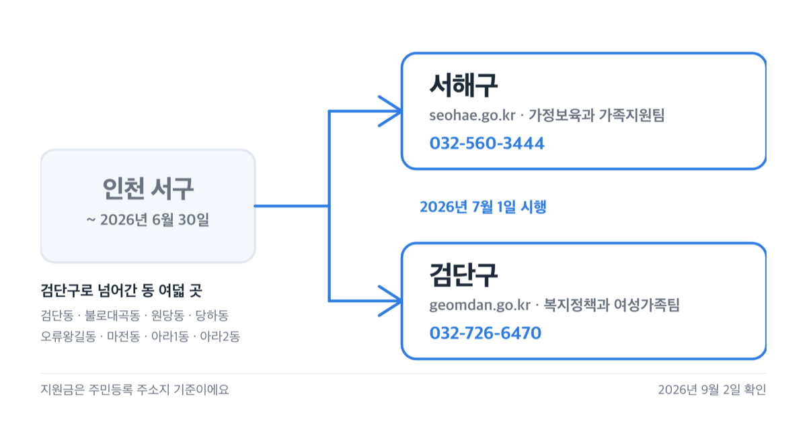
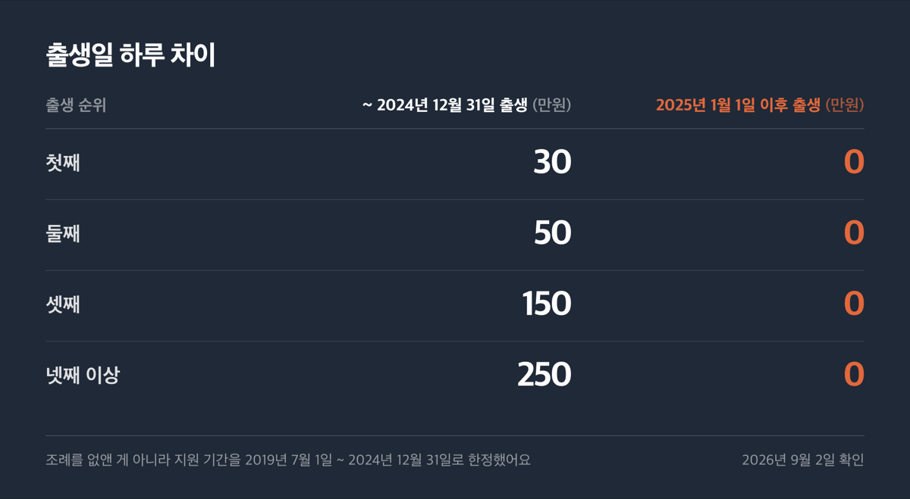
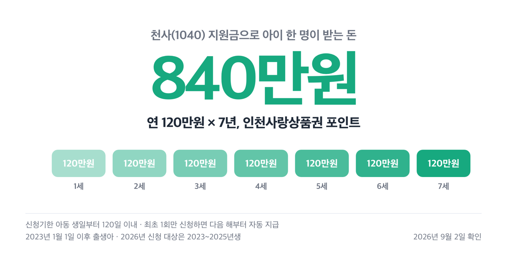
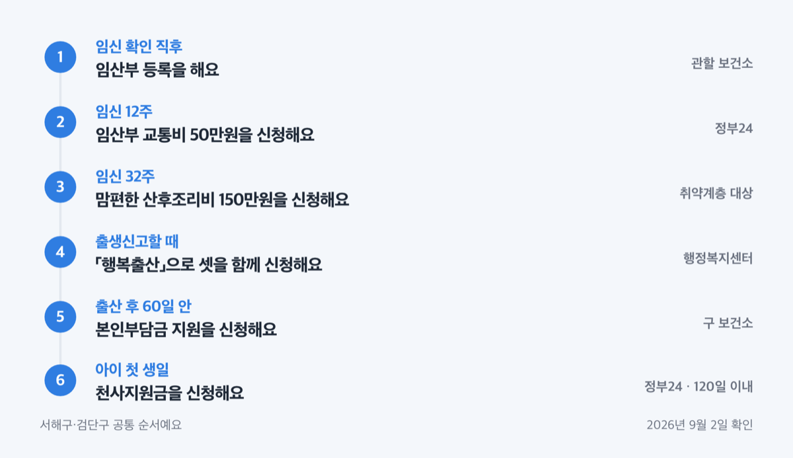
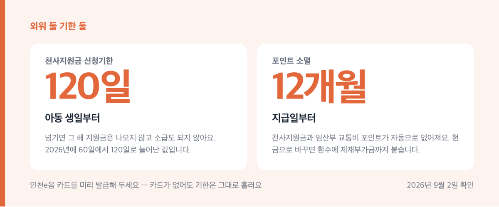

# 인천 서구 출산장려금 폐지, 2026년 천사지원금 840만원

📌 2026년 9월 2일 기준

인천 서구에서 아이를 낳으면 구청이 첫째 30만원, 셋째 150만원을 준다고 알려져 있어요. 그 돈은 2025년 1월 1일 이후 출생아부터 끊겼습니다. 구 이름도 지난 7월에 서해구와 검단구로 나뉘었어요.

**3줄 요약**

- 서구 자체 출생·입양축하금(첫째 30만원 ~ 넷째 이상 250만원)은 2024년 12월 31일 출생아까지만 지급됩니다.
- 2026년 7월 1일부터 서구가 서해구와 검단구로 나뉘어, 사는 동에 따라 신청 창구가 달라졌어요.
- 지금 실제로 받는 큰 금액은 인천시 통합 정책 「아이플러스(i+) 1억드림」이고, 천사지원금은 아이 생일 뒤 120일이 기한입니다.

구에서 남은 것, 인천시에서 나오는 것, 국가에서 나오는 것을 순서대로 갈라 적었어요.

## 「인천 서구」는 둘로 나뉘고, 구 장려금은 없어졌어요

2026년 7월 1일에 두 가지가 한꺼번에 바뀌었어요. 하나는 구 이름과 구역이고, 하나는 지원금의 근거인 조례입니다.

| 무엇이 바뀌었나 | 언제부터 | 지금 상태 (2026-09-02 확인) |
|---|---|---|
| 서구 → 서해구 명칭 변경 | 2026-07-01 시행 | 홈페이지 주소가 seohae.go.kr로 이동 |
| 서구에서 검단구 분리 신설 | 2026-07-01 시행 | 검단구 자치법규 523건 제정, geomdan.go.kr 신설 |
| 구 출생·입양축하금 | 2025-01-01 출생아부터 | 지급하지 않음 (조례 부칙 경과조치) |
| 구 자체 산후조리비 | 2022-01-01 출생아부터 | 지급하지 않음 |

검단구로 넘어간 동은 여덟 곳입니다.

1. 검단동 · 불로대곡동 · 원당동 · 당하동 *(옛 서구 검단 쪽 전역이에요)*
2. 오류왕길동 · 마전동 · 아라1동 · 아라2동 *(아라동은 시천·검암·오류 일부 구역을 포함해요)*

나머지 검암경서동·연희동·청라1~3동·가정1~3동·신현원창동·석남1~3동·가좌1~4동은 서해구예요. 지원금은 대부분 주민등록 주소지 기준이라, ==사는 동이 어느 구인지 금액보다 먼저 확인해야 해요.==

축하금이 없어진 방식도 알아 두면 헷갈리지 않아요. 조례를 통째로 없앤 것이 아니라, 지원 기간을 2019년 7월 1일부터 2024년 12월 31일까지로 한정해 뒀어요. 그래서 출생일 하루 차이로 결과가 달라집니다. 현행 조례에 남은 현금성 지원은 저소득 대상 출산축하용품비 30만원 하나뿐이고, 검단구가 새로 만든 조례도 같은 구조예요.

> **😕 그럼 2024년에 낳고 아직 신청을 못 한 축하금은 끝인가요?**

아니에요. 서해구 조례 부칙에는 미신청자 경과조치가 남아 있어서, 종전 규정에 따라 신청할 수 있어요. 다만 검단구 조례에는 그 경과조치 조항이 없습니다. 검단 쪽에 사시면 검단구청 복지정책과 여성가족팀(032-726-6470)에 신청 가능 여부를 먼저 확인하세요.

## 구에서 지금 주는 돈 — 30만원과 아빠 육아휴직 장려금

구가 자기 예산으로 주는 현금성 지원은 둘입니다. 소득 요건이 있는 30만원, 그리고 아빠가 육아휴직을 쓸 때 나오는 장려금이에요.

먼저 저소득 복지대상자 출산축하용품비를 봅니다.

| 항목 | 내용 (서해구·검단구 조례 제9조) |
|---|---|
| 금액 | 출생아 1인당 30만원, 지역화폐로 지급 |
| 지급수단 | 서해구사랑상품권(서로e음) / 검단구 지역사랑상품권 |
| 신청기한 | 출생신고일(입양신고일)부터 60일 이내 |
| 신청처 | 거주지 동 행정복지센터 또는 정부24 「행복출산」 |

대상은 출산일 현재 세 갈래입니다.

1. 국민기초생활보장법상 수급자
2. 차상위계층 *(가구원 중 일부만 차상위여도 조사대상 가구원에 들면 포함돼요)*
3. 한부모가족지원법에 따른 한부모가족

여기에 거주 요건이 하나 더 붙어요. 출산일 기준 1년 이전부터 그 구에 계속 주민등록이 있고, 신청일까지 계속 살고 있어야 합니다. 1년이 안 됐다면 탈락이 아니라 대기예요. 1년이 지난 날부터 대상이 되고, 그날부터 60일 안에 신청하면 됩니다. 아이 한 명당 한 차례만 나와요.

두 번째는 아빠 육아휴직 장려금이고, 이쪽은 금액이 소득에 따라 달라져요. 구청이 2024년 12월 26일에 공고한 기준으로는 육아휴직 급여를 적게 받는 사람에게 더 많이 줍니다. 육아휴직 급여 상한액 250만원 안에서 6개월간 차등 지원하는 구조예요.

| 구분 | 육아휴직 급여 월 수급액 | 월 지원액 |
|---|---|---|
| 1~3개월차 | 150만원 이하 | 100만원 |
| 1~3개월차 | 191~200만원 | 60만원 |
| 1~3개월차 | 241만원 이상 | 10만원 |
| 4~6개월차 | 150만원 이하 | 50만원 |
| 4~6개월차 | 171~180만원 | 30만원 |
| 4~6개월차 | 191만원 이상 | 10만원 |

*(구청 공고 첨부 산정표에서 구간을 줄여 옮긴 값이에요. 실제 표는 10만원 단위로 더 촘촘해요.)*

6개월을 최저 급여 구간으로 채우면 합계 450만원, 최고 급여 구간이면 60만원입니다. 이 두 숫자는 산정표 단가를 6개월분 더한 추정값이에요. 공고에는 월 단가만 있고 총액이 없거든요. 육아휴직 급여는 보통 1~3개월차와 4개월차 이후 단가가 다르니, 달마다 수급액이 바뀌면 합계도 달라집니다.

걸리는 것이 셋 있어요.

1. 육아휴직자와 대상 자녀가 신청일 기준 그 구에 주민등록이 있어야 해요 *(육아휴직자는 1년 이상 계속)*
2. 고용보험 미가입자는 신청할 수 없어요 *(공무원·사학연금 가입자가 여기서 막혀요)*
3. 공고에 "예산 소진시까지 지원"이라고 적혀 있어요

신청은 육아휴직 시작일 이후 1개월부터 종료일 이후 12개월 이내이고, 동 행정복지센터 방문 접수예요. 육아휴직급여 지급결정통지서가 필요해서 급여를 먼저 받아야 순서가 맞아요.

> **🤭 솔직히 말하면** — 저는 예산 소진 문구가 붙은 사업은 단가를 다 계산하기 전에 서류를 먼저 넣습니다.

산후조리 쪽에서 구 보건소가 받아 주는 것도 하나 있어요. 산모·신생아 건강관리서비스 이용권을 쓴 뒤 본인부담금 일부를 인천시가 돌려주는 사업입니다.

| 서비스 유형 (10~15일) | 인천시 지원금 | 최종 본인부담금 |
|---|---|---|
| 단태아 첫째아 10일, 자격확인 | 18만 6천원 | 11만 3천원 |
| 단태아 첫째아 10일, 중위 150% 이하 | 20만원 | 26만 2천원 |
| 단태아 셋째아 이상 단축 10일 | 9만~26만 9천원 | 0원 |

셋째아 이상이 단축형으로 쓰면 본인부담금이 0원이 됩니다. 신청은 바우처 이용 종료 후 60일 이내, 창구는 서해구 보건행정과(032-718-0431) 또는 검단구 건강증진과(032-718-2262)예요.

그런데 금액만 보면 구에서 주는 돈은 조연이에요.

## 실제로 큰 돈은 인천시 「아이플러스(i+) 1억드림」

아이플러스 1억드림은 인천시가 임신기부터 학령기까지의 지원을 하나로 묶어 붙인 이름이에요. 서해구·검단구 주민이 손에 쥐는 금액은 대부분 여기서 나옵니다.

| 제도 | 금액 | 신청 기한 |
|---|---|---|
| 천사(1040) 지원금 | 연 120만원 × 7년, 총 840만원 | 아동 생일부터 120일 이내 |
| 임산부 교통비 | 1인당 50만원 | 임신 12주 ~ 출산 후 90일 |
| 맘편한 산후조리비 | 150만원 (취약계층) | 임신 32주 ~ 출산 후 90일 |
| 아이 꿈 수당 | 월 5만원 | 수시 (2026년은 2016년생) |

천사지원금이 이 중 가장 큰 금액이에요. 2023년 1월 1일 이후 출생아가 1세부터 7세까지 매년 120만원을 인천사랑상품권 포인트로 받고, 2026년 신청 대상은 2023~2025년생입니다. 2026년에 두 가지가 편해졌어요. 신청기한이 생일 기준 60일에서 120일로 늘었고, 최초 1회 신청·지급이 끝나면 다음 해부터는 별도 신청 없이 자동 지급됩니다.

기한을 넘기면 그 해 지원금은 나오지 않고 소급도 되지 않습니다.

왜 생일이 기준이냐 하면 자격을 아동 생일마다 다시 보기 때문이에요. 부 또는 모와 주민등록을 같이 두고 인천시에 1년 이상 계속 살았는지를 그 시점으로 판정해요. 그래서 이사한 해에는 생일이 오기 전에 거주 기간이 채워지는지 세어 봐야 합니다. 신청은 정부24(보조금24) 온라인이 원칙이고, 지급은 신청 다음 달 말까지예요.

임산부 교통비 50만원은 인천시가 2025년에 안내한 기준으로 인천e음 포인트로 나와요. 신청일 기준 인천시에 6개월(180일) 이상 주민등록을 두고 실제로 살고 있어야 하고, 임신 12주부터 출산 후 90일까지 정부24로 신청합니다. 전기차를 쓰는 임산부는 2025년 10월부터 현금 50만원으로 받을 수 있어요. 지급일은 매달 15일이고, 신청 뒤 지급일 전에 인천 밖으로 나가면 제외됩니다.

맘편한 산후조리비 150만원은 「산후조리비 지자체 추가지원」의 본체인데, 대상이 취약계층으로 좁아요. 기초생활수급자·차상위·한부모·다태아 출산 산모·청소년 부모·희귀성질환 산모 등이고, 소득으로 들어가는 길은 기준중위소득 60% 이하 가정입니다. 다문화가족은 65% 이하예요.

| 가구원 수 | 기준중위 60% 월 소득 | 기준중위 65% 월 소득 |
|---|---|---|
| 2인 | 2,519,575원 | 2,729,540원 |
| 3인 | 3,215,422원 | 3,483,373원 |
| 4인 | 3,896,843원 | 4,221,580원 |
| 5인 | 4,534,031원 | 4,911,867원 |

*(2026년 기준, 인천시 게재 판정표. 건강보험료로도 판정하며 노인장기요양보험료는 뺍니다.)*

이 사업에는 서류가 하나 더 붙어요. 중앙육아종합지원센터 e-러닝 부모 교육 수료증을 내야 합니다. 인천시에 1년 이상 연속 주민등록도 필요하고, 신청은 정부24 또는 주소지 보건소예요.

국가에서 나오는 것도 함께 세어야 총액이 보여요. 첫만남이용권은 첫째아 200만원, 둘째아 이상 300만원이고 국민행복카드 바우처로 받습니다. 사용 종료일은 아이 출생일로부터 2년이에요. 아동수당은 2026년 3월 20일 법 개정으로 원칙이 13세 미만 월 10만원이 됐지만, 부칙에 연도별 특례가 있어 2026년은 9세까지입니다. 여기에 부모급여가 1세 미만 월 100만원, 1세 이상 2세 미만 월 50만원 얹혀요.

지역 추가 지급은 인천에 해당하지 않아요. 인천은 수도권이고, 인구감소지역으로 지정된 곳은 강화군과 옹진군뿐입니다.

## 신청 순서 — 임신 12주부터 아이 첫 생일까지

시기마다 창구가 다르니 순서대로 적어요. 아래 여덟 단계가 서해구·검단구에 공통입니다.

1. **임신 확인 직후** — 관할 보건소에 임산부 등록을 해요. 신분증과 산모수첩(또는 임신확인서)을 가져가면 철분제·엽산제와 임신축하선물을 받습니다.
2. **임신 12주** — 정부24에서 임산부 교통비 50만원을 신청해요. 전기차 미사용자는 구비서류가 없어요.
3. **임신 12주 안** — 예비맘 건강검진을 보건소에서 받아요. 연 1회 제한이고 6시간 이상 금식이 필요해요.
4. **임신 32주** — 취약계층에 해당하면 맘편한 산후조리비 150만원을 신청해요. e-러닝 부모 교육 수료증을 먼저 떼 두세요.
5. **출생신고할 때** — 행정복지센터에서 「행복출산」 원스톱으로 첫만남이용권·아동수당·부모급여를 함께 신청해요. 저소득 대상이면 출산축하용품비 30만원도 이 창구예요.
6. **출산 후 60일 안** — 산모·신생아 건강관리서비스 본인부담금 지원을 보건소에 신청해요. 바우처 이용이 끝난 뒤부터 60일입니다.
7. **육아휴직 급여를 받은 뒤** — 아빠 육아휴직 장려금을 동 행정복지센터에 방문 신청해요. 지급결정통지서가 필요해요.
8. **아이 첫 생일** — 천사지원금을 정부24에서 신청해요. 생일부터 120일 안이고, 한 번만 하면 이후는 자동입니다.

인천시 지원금은 [인천시 영유아 누리집](https://www.incheon.go.kr/earlychild)에서 사업별 안내를 볼 수 있어요.

여기까지가 순서대로 하면 되는 일이고, 다음이 실제로 사람들이 걸리는 것들이에요.

## 여기서 자주 걸려요 — 카드 종류와 12개월 소멸

가장 먼저 짚을 것은 안내문 자체예요. 서해구 홈페이지에는 아직 첫째 30만원·둘째 50만원·셋째 150만원·넷째 이상 250만원이 적힌 옛 안내 페이지가 남아 있어요. 첨부 이미지 파일 이름이 2023년이고 로고도 「인천광역시 서구」입니다. ==조례 부칙이 안내 페이지보다 앞섭니다.==

카드 종류에서 헛걸음이 잘 나요. 천사지원금과 교통비는 서해구 신청자에게 지역e음 카드(서로e음)로 들어가고, 다른 인천e음 카드로는 지급되지 않아요. 대중교통에 쓰려면 교통카드 겸용 카드를 따로 발급해야 해요. 검단구는 분리된 지 두 달째라 카드 분류가 안내 페이지마다 다르게 적혀 있어요. 신청 전에 인천e음 앱에서 발급 가능한 카드를 확인하거나 검단구청 복지정책과(032-726-6470)에 물어보세요.

저라면 아이 생일이나 임신 12주가 오기 전에 인천e음 앱 가입과 카드 발급을 먼저 끝냅니다. 카드가 없으면 지급이 미뤄지는데, 기한은 그대로 흐르니까요.

나머지 함정은 넷이에요.

1. **포인트 12개월 소멸** — 천사지원금과 교통비 포인트는 지급일로부터 12개월이 지나면 자동으로 없어져요
2. **현금화 금지** — 정책수당을 현금으로 바꾸면 환수에 더해 지원금 5배 이내의 제재부가금이 붙습니다
3. **중복 금지** — 맘편한 산후조리비 150만원은 산모·신생아 건강관리 제공기관에서 쓸 수 없어요 *(위반이면 전액 환수예요)*
4. **전출** — 아빠 육아휴직 장려금은 수급자나 자녀가 관할구역 밖으로 나가면 그 시점부터 끊겨요

기간을 잘못 아는 것도 있어요. 첫만남이용권 사용기간을 1년으로 적어 둔 안내가 남아 있는데, 2024년 이후 출생아는 출생일로부터 2년입니다. 2025년 1월 1일 출생아라면 2026년 12월 31일까지 쓰고, 2027년 1월 1일 0시에 바우처가 사라져요. 아동수당을 「만 8세 미만」으로 적어 둔 구 안내도 옛 기준이에요. ==2026년은 9세까지입니다.==

무료로 받을 수 있는 검사는 서두르는 편이 나아요. 인구보건복지협회 인천지회가 하는 Non-Stop 출산지원사업은 임산부 건강검진과 유아 알레르기 검사를 무료로 하는데, 안내문에 조기 마감될 수 있다고 적혀 있어요. 방문 당일 전화(032-451-4077)로 확인하고 가세요.

## 인천 서구 출산 육아 지원금 관련 궁금증 해결

**Q. 2024년 12월에 낳았는데 축하금을 아직 신청하지 않았어요. 받을 수 있나요?**

A. 서해구 조례 부칙에 미신청자 경과조치가 있어서 종전 규정에 따라 신청할 수 있어요. 2019년 7월 1일부터 2024년 12월 31일 사이 출생·입양이 대상입니다. 검단구 조례에는 이 조항이 없으니 검단 쪽 주민은 구청에 먼저 확인하세요.

**Q. 검단구가 새로 생겼는데 신청은 어디로 가야 하나요?**

A. 주민등록 주소지가 속한 구예요. 서해구는 가정보육과 가족지원팀(032-560-3444, 3445), 검단구는 복지정책과 여성가족팀(032-726-6470)입니다. 보건소 사업은 서해구 보건행정과(032-718-0434), 검단구 보건행정과(032-718-2262)로 나뉘어요.

**Q. 올해 인천으로 이사 왔어요. 천사지원금을 받을 수 있나요?**

A. 아동 생일이 오기 전에 인천시 1년 이상 거주 요건이 채워지면 다음 연도부터 신청할 수 있어요. 올해 전입한 아동은 2027년부터 조건을 보고, 채운 기간만큼 월 단위로 계산해 줍니다.

**Q. 공무원인데 아빠 육아휴직 장려금이 되나요?**

A. 안 됩니다. 고용보험법 제70조 육아휴직 급여 지급조건을 충족해야 해서, 공무원·사학연금 가입자처럼 고용보험에 가입하지 않은 경우는 신청할 수 없어요.

**Q. 산후조리비 150만원과 산모·신생아 건강관리서비스를 같이 쓸 수 있나요?**

A. 두 사업을 각각 받을 수는 있지만, 산후조리비 포인트를 산모·신생아 건강관리 제공기관에서 결제하는 것은 막혀 있어요. 산후조리원이나 등록된 산후건강관리 가맹점에서 쓰세요.

## 그래서 지금 챙길 것

구 장려금이 없어졌다는 소식만 보고 인천의 지원이 줄었다고 판단하면 손해예요. 구에서 빠진 것은 최대 250만원인데, 시에서 나오는 천사지원금만 아이 한 명당 840만원입니다. 대신 시 사업은 거주 기간과 신청 기한을 더 깐깐하게 봅니다.

셋 중 하나만 먼저 하라면 저는 인천e음 카드 발급을 고릅니다. 교통비도 천사지원금도 이 카드로 들어오고, 카드가 없으면 기한 안에 신청해도 돈이 늦게 도착해요.

소득 요건이나 개별 자격 판정은 창구에서 확정합니다. 서해구는 032-560-3444, 검단구는 032-726-6470, 보건소 사업은 각 구 보건행정과에 물어보시면 됩니다.

참고: 「인천광역시 서해구 행복한 출산·양육 환경 조성을 위한 조례」 · 「인천광역시 검단구 행복한 출산·양육 환경 조성을 위한 조례」 · 「인천광역시 서해구 아빠 육아휴직 장려금 지원 조례」 · 「인천광역시 서해구 취약계층 산후조리비용 지원에 관한 조례」 · 「아동수당법」 및 같은 법 시행령 · 보건복지부 「2026 첫만남이용권 사업안내」 · 인천시 영유아 누리집 · 인천시 보도자료(천사지원금 개선, 2026-04-02) · 서구청 새소식(아빠 육아휴직 장려금, 2024-12-26 / 임산부 교통비, 2025-09-22) · 행정안전부 인구감소지역 지정
