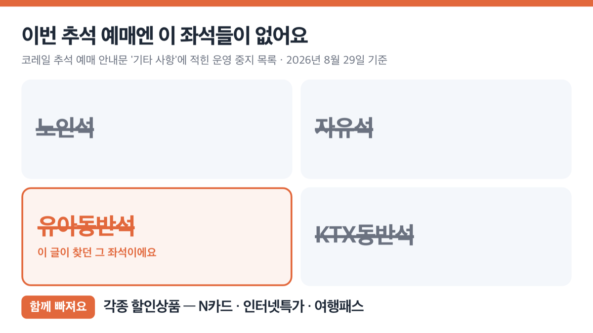
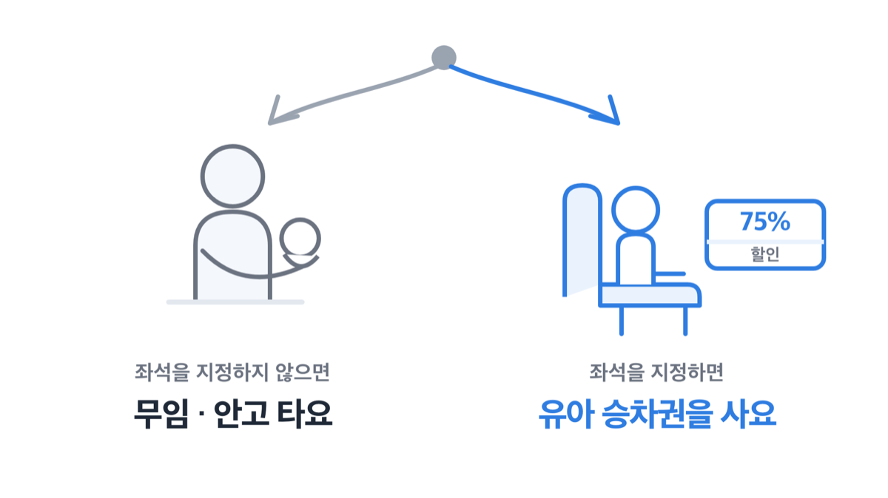
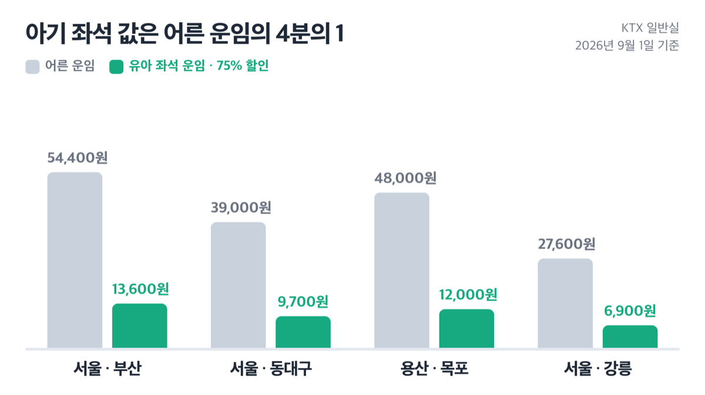
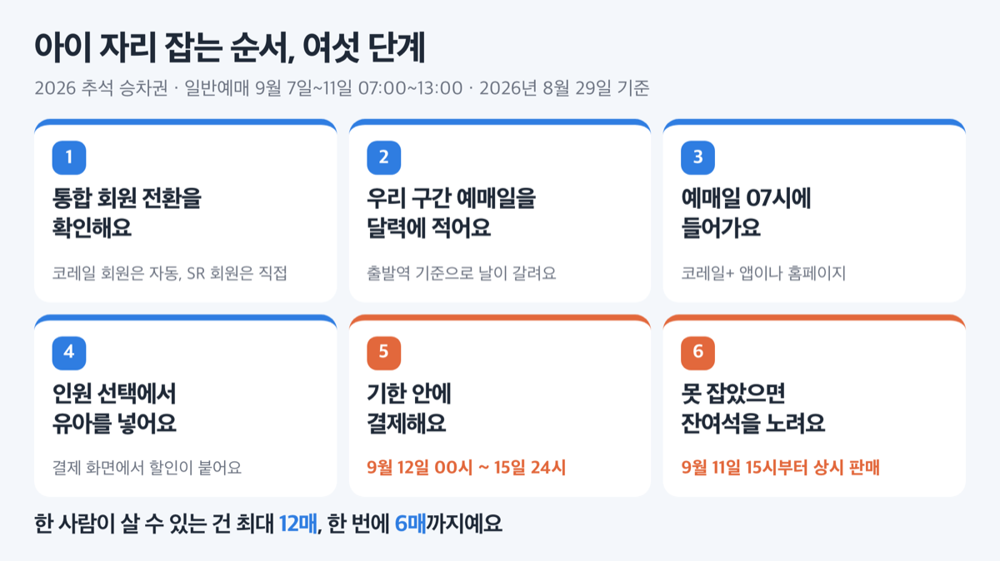
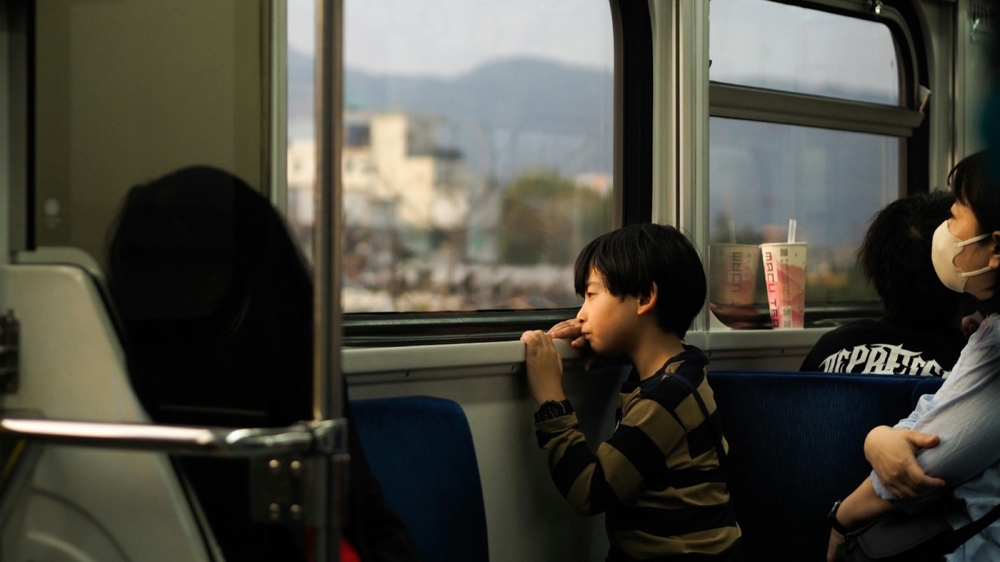
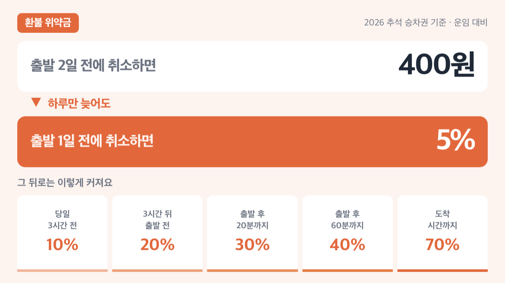

# KTX 유아동반석 2026 추석 중지, 아기 좌석은 75% 할인

📌 2026년 8월 29일 기준

결론부터요. 2026년 추석 승차권 예매에는 유아동반석이 아예 열리지 않아요. 6세 미만 아이를 좌석에 앉히려면 어른 운임의 4분의 1짜리 유아 승차권을 따로 사야 합니다.

**3줄 요약**

- 유아동반석은 코레일이 쓰는 공식 좌석 이름인데, 2026년 추석 예매에서는 노인석·자유석·KTX동반석과 함께 운영되지 않아요.
- 유아 무임은 보호자 1명당 1명까지고, 그것도 좌석을 지정하지 않을 때만이에요.
- 좌석을 쓰려면 운임 75% 할인 승차권을 사면 되고, 일반예매는 9월 7일부터 11일까지 노선별로 날짜가 달라져요.

아래에서 무임 조건, 좌석을 잡았을 때 실제 금액, 예매 날짜, 그리고 나란히 앉지 못하는 상황까지 순서대로 짚을게요.

## 2026년 추석엔 유아동반석이 열리지 않아요

유아동반석은 코레일이 안내문에 그대로 쓰는 공식 명칭이에요. 검색해 보면 "유아동반석 잡는 법" 같은 후기가 줄줄이 나오죠. 그런데 ==2026년 추석 예매에는 그 좌석이 열리지 않아요.==

코레일 추석 예매 안내문의 '기타 사항'에는 이번 예매에서 운영하지 않는 좌석과 상품 이름이 그대로 적혀 있어요.

- **노인석 · 자유석 · 유아동반석 · KTX동반석** *(좌석 종류 넷이 통째로 빠져요)*
- **각종 할인상품** — N카드, 인터넷특가, 여행패스 등 *(평소 쓰던 할인 경로가 막힌다는 뜻이에요)*

명절 예매는 평소 예매와 규칙 자체가 다르게 굴러가요. 좌석 종류를 골라 잡는 기능과 할인상품이 함께 빠지고, KTX 마일리지와 일반열차 할인쿠폰 적립 대상에서도 제외돼요. 승차 후 도중역에서 내려도 남은 구간 운임은 돌려주지 않고요.

**저는 이번 추석 계획에서 유아동반석은 아예 지워 두는 게 맞다고 봅니다.** 있을지도 모른다고 기대하면서 예매 화면을 뒤지는 3분이, 이번 예매에서는 가장 비싼 3분이거든요.

## 무임은 '좌석 없이'가 조건이에요

이 글을 찾은 분이 진짜 궁금한 건 하나일 거예요. 무임으로 타는 아기도 자리에 앉히려면 표를 사야 하는지 말이에요.

답은 여객운송약관에 그대로 적혀 있어요.

> **한국철도공사 여객운송약관 제7조 제2항**
> 철도공사는 13세 이상의 보호자 1명당 좌석을 지정하지 않은 유아 1명은 운임을 받지 않습니다. 다만, 1명을 초과하는 경우에는 철도공사에서 따로 정한 유아 운임을 받습니다.

무임의 조건이 '무료'가 아니라 '좌석을 지정하지 않을 것'이에요. ==좌석을 지정하는 순간 무임이 아니게 돼요.== 그래서 아기를 자리에 앉히려면 유아 승차권을 사야 합니다.

> **"무임이면 좌석도 그냥 주는 거 아닌가요?"**

아니에요. 무임은 보호자 무릎에 안고 가는 것을 전제로 한 조건이에요. 무임 유아의 운송계약도 발권 시점이 아니라 **보호자와 함께 여행을 시작한 때** 성립하는 것으로 약관에 적혀 있어요. 표를 끊는 순간이 아니라 함께 탄 순간이 기준이라는 뜻이죠.

나이 경계부터 정리하면 이래요.

| 구분 | 나이 |
|---|---|
| **유아** | 6세 미만 |
| **어린이** | 6세 이상 13세 미만 |
| **어른** | 13세 이상 |

예매 화면에는 '어린이(6~12세)'로 적혀 있는데, 약관의 '6세 이상 13세 미만'과 같은 범위예요.

하나 더요. 유아가 13세 이상 보호자 없이 혼자 타면 철도공사가 운송을 거절하거나 다음 정차역에서 내리게 할 수 있습니다. 아이만 먼저 보내는 선택지는 규정상 없어요.

## 💰 좌석을 잡으면 어른 운임의 4분의 1이에요

유아 좌석 승차권은 **운임 75% 할인**이에요. ==75% 할인은 어른 운임의 4분의 1을 낸다는 뜻이에요.== 4분의 3을 내는 게 아니고요. 어린이는 50% 할인이라 절반이에요.

2026년 9월 1일 기준 운임표로 계산하면 이렇게 나와요.

| 구간 | 어른 운임 (KTX 일반실, 2026.9.1. 기준·원) | 유아 좌석 운임 (75% 할인 적용, 원) |
|---|---|---|
| 서울 ↔ 부산 | 54,400원 | 13,600원 |
| 서울 ↔ 동대구 | 39,000원 | 9,700원 |
| 용산 ↔ 목포 | 48,000원 | 12,000원 |
| 서울 ↔ 강릉 | 27,600원 | 6,900원 |

*(어른 운임은 KTX 일반실 기준이에요. 유아 좌석 운임은 코레일이 금액으로 고시하지 않아서, 할인율 75%를 적용해 계산한 값입니다.)*

서울~동대구가 9,750원이 아니라 9,700원인 이유가 있어요. 약관 제8조 제1항이 할인 계산에서 나온 100원 미만 금액을 50원까지는 버리고 50원을 넘으면 100원으로 올리도록 정하고 있거든요. 그래서 끝자리가 항상 00원으로 떨어져요.

주의할 게 둘이에요.

1. **할인은 운임에만 붙어요.** 특실·우등실에 붙는 요금에는 할인이 없어서, 특실을 잡으면 위 표보다 많이 나와요.
2. **최저운임 이하로는 할인하지 않아요.** 짧은 구간은 계산값보다 덜 깎여요.

**저라면 서울~부산처럼 먼 구간은 13,600원을 내고 좌석을 삽니다.** 어른 운임의 4분의 1이고, 명절 열차에서 아이를 안은 채 통로에 서 있을 위험을 그 값에 넘기는 셈이니까요.

> **솔직히 말하면** — 이번 추석엔 무임과 유상 사이에서 고민할 여지가 크지 않아요. 유아동반석이 빠진 상태에서 자리를 확보하는 길은 유아 승차권 하나거든요.

## 추석 승차권 예매, 노선마다 날짜가 달라져요

2026년 추석 예매 대상은 **9월 23일(수)부터 27일(일)까지 5일간** 운행하는 열차예요. 추석 당일은 9월 25일(금)이고요.

> [!WARNING]
> 일반예매는 노선과 출발역에 따라 날짜가 다릅니다. 서울~동대구처럼 여러 노선이 겹치는 구간은 예매 가능한 날이 이틀이에요. 날짜를 하루 잘못 잡으면 그날은 화면에 열차가 안 뜹니다.

**교통약자 사전예매**는 9월 3일(목)~4일(금), 09:00~15:00이에요. 65세 이상 고령자, 등록 장애인, 국가유공자, 그리고 **이번 추석부터 임산부**가 대상이에요. 정부 저출생 정책과 연계해 새로 들어왔어요. 접속 뒤 5분 안에 끝내야 하고, 중증장애인 회원은 30분이 주어져요.

**일반예매**는 9월 7일(월)~11일(금), 07:00~13:00입니다. 접속 뒤 **3분 이내**에 완료해야 해요.

| 날짜 | 예매하는 열차 |
|---|---|
| 9/7(월) | 일반열차 전 노선 (ITX-마음·ITX-새마을·무궁화호 등) |
| 9/8(화) | 서울·청량리 출도착 KTX (경전·강릉·동해·중앙·중부내륙선) |
| 9/9(수) | 용산 출도착 KTX (호남선·전라선) |
| 9/10(목) | 수서 출도착 KTX (경부·경전·동해·호남·전라선) |
| 9/11(금) | 서울 출도착 KTX (경부선) |

수서역이 따로 하루를 차지한 건 올해만의 사정이에요. KTX와 SRT가 9월 1일부터 노선 구분 없이 통합 운행에 들어갔고, 이번 추석이 통합 이후 첫 명절 대수송이거든요. 그래서 **코레일 통합 회원만 명절 예매를 할 수 있고**, SR에만 가입해 둔 회원은 통합 회원 전환을 먼저 마쳐야 해요.

아이와 함께 앉을 좌석을 잡는 순서는 이렇게 정리돼요.

1. **통합 회원 전환부터 확인해요.** 기존 코레일 회원은 자동 전환이고, SR 회원은 직접 전환해야 해요.
2. **우리 구간의 예매일을 달력에 적어요.** 위 표에서 출발역 기준으로 찾으면 돼요.
3. **예매일 07시에 코레일+ 앱이나 홈페이지로 들어가요.** 일반예매는 전화 예매가 없어요.
4. **인원 선택에서 유아를 넣어요.** 유아를 선택하면 결제 화면에서 할인이 반영돼요.
5. **9월 12일 00시부터 15일 24시 사이에 결제해요.** 결제하지 않으면 자동 취소되고 예약 대기자에게 넘어가요.
6. **못 잡았으면 9월 11일 15시부터 잔여석을 노려요.** 코레일+·홈페이지·역 창구에서 상시 판매해요.

한 사람이 살 수 있는 건 **최대 12매, 한 번에 6매까지**예요. 사전예매분은 9월 18일(금)까지 결제하면 되고 고객센터 ARS 1588-7788로도 결제할 수 있어요.

임산부라면 '맘편한 코레일'도 챙길 만해요. 임산부 본인과 동행 1명이 대상이고, KTX 특실·우등실 요금이 면제돼 일반실 가격으로 탈 수 있어요. 일반실과 일반열차는 운임 40% 할인이고요. **동행인이 유아나 어린이면 그쪽은 유아·어린이 할인이 적용돼요.** 신청은 정부24 '맘편한임신'이나 역 창구, 읍면동행정복지센터, 보건소에서 하고 할인은 출산예정일로부터 1년까지 써요. 다만 다른 할인과 중복은 안 되고, 열차 출발 24시간 전까지 사야 해요.

## ⚠️ 나란히 앉는다는 보장은 없어요

유아 승차권을 샀다고 아이 자리가 내 옆에 붙는 건 아니에요. 붙은 좌석이 있으면 연접 좌석으로 배정되지만, 없으면 떨어진 좌석으로도 배정돼요. 국토교통부가 밝힌 좌석 배정 방식이 그래요.

명절 열차는 남는 자리가 적어서 이 상황이 더 자주 나와요. 예매를 마쳤으면 좌석 번호가 붙어 있는지를 결제 전에 눈으로 확인하세요.

무임으로 태울 계획이라면, 예매 화면 인원 선택에서 좌석 없이 발권하는 방법을 **철도고객센터 1588-7788**에 미리 물어보세요. 명절 예매 기간에는 전용 번호 1544-8545도 열려요.

환불할 때 붙는 위약금도 미리 봐 두면 좋아요. 아이 컨디션에 따라 일정이 흔들리는 일이 흔하니까요.

| 환불 시점 (열차 출발 시각 기준) | 위약금 (2026 추석 승차권 기준, 원·운임 대비 %) |
|---|---|
| 출발 2일 전 | 400원 |
| 출발 1일 전 | 5% |
| 출발 당일~3시간 전 | 10% |
| 3시간 경과 후~출발 전 | 20% |
| 출발 후 20분까지 | 30% |
| 출발 후 60분까지 | 40% |
| 도착시간까지 | 70% |

하루 차이로 5%와 400원이 달라져요. 취소할 마음이 조금이라도 섰다면 전날을 넘기지 않는 게 낫습니다.

## KTX 유아동반석 관련 궁금증 해결

**Q. 무임으로 태우는데도 승차권이 필요한가요?**
A. 좌석을 지정하지 않는다면 보호자 1명당 유아 1명은 운임을 받지 않아요. 무임 유아의 운송계약은 보호자와 함께 여행을 시작한 때 성립해요.

**Q. 유아가 둘이면 어떻게 되나요?**
A. 무임은 13세 이상 보호자 1명당 유아 1명까지예요. 보호자가 두 명이면 각자 한 명씩 무임이 되고, 보호자 한 명이 유아 둘을 데려가면 초과분에는 철도공사가 따로 정한 유아 운임이 붙어요.

**Q. 빈자리에 잠깐 앉히면 안 되나요?**
A. 빈자리도 그 자리 승차권을 산 사람의 자리예요. 명절 열차는 만석이라 빈자리를 기대하기 어렵고요. 자리를 쓸 생각이면 유아 승차권을 사는 쪽이 규정에 맞아요.

**Q. 특실을 타면 유아도 75% 할인되나요?**
A. 할인은 운임에만 적용돼요. 특실·우등실에 붙는 요금에는 할인이 없어서 일반실 계산값보다 많이 나와요.

**Q. 이번 추석에 유아동반석을 예매할 방법이 정말 없나요?**
A. 추석 예매 안내문의 운영 중지 목록에 유아동반석이 이름으로 들어 있어요. 일반 좌석을 유아 승차권으로 확보하는 것이 이번 예매에서 쓸 수 있는 방법이에요.

## 마무리 — 오늘 할 일은 하나예요

정리하면 이래요. 유아동반석은 이번 추석 예매에서 빠졌고, 아이 자리는 어른 운임의 4분의 1인 유아 승차권으로 잡아요. 서울~부산이면 13,600원이에요.

**저라면 오늘 통합 회원 상태부터 확인합니다.** 예매일 07시에 로그인이 막히면 3분은 그 자리에서 끝나거든요.

운임과 좌석 조건은 열차 종류와 구간에 따라 달라질 수 있어요. 예매 전에 코레일+ 앱이나 철도고객센터 1588-7788에서 확인하세요.

이 글은 공개된 자료를 정리한 정보 글이며, 실제 운임과 예매 조건은 코레일 안내를 따릅니다.

참고: 한국철도공사 여객운송 약관 및 부속약관(2026.8.1. 시행) · 코레일 2026년 추석 연휴 승차권 예매 안내문 · 코레일 승차권예매 자주찾는 질문 · 코레일 할인제도 안내 맘편한 코레일 · 코레일 KTX 운임표(2026.9.1. 기준) · 국토교통부·코레일·에스알 공동 보도자료(2026.8.27.)
