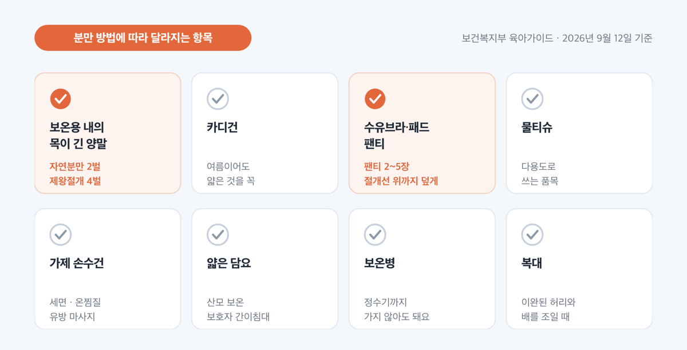
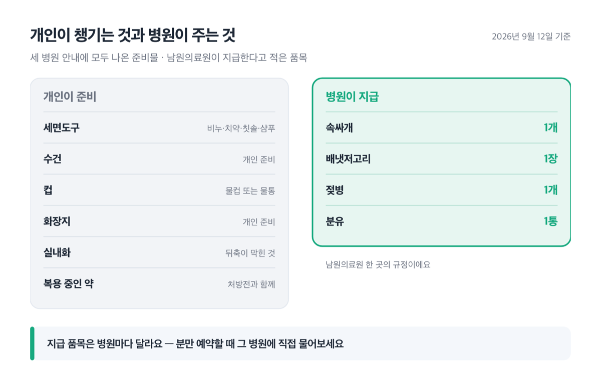
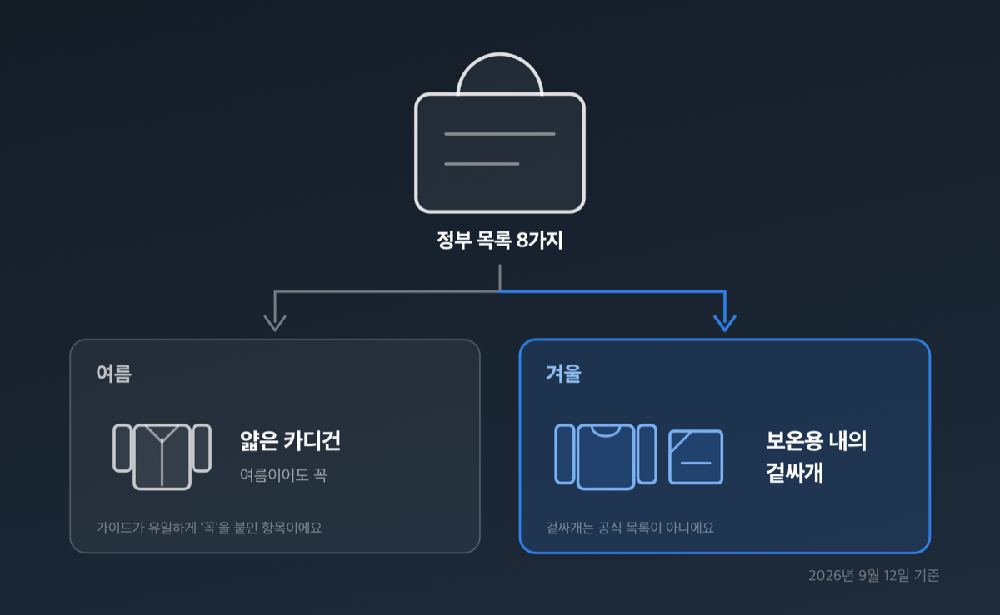
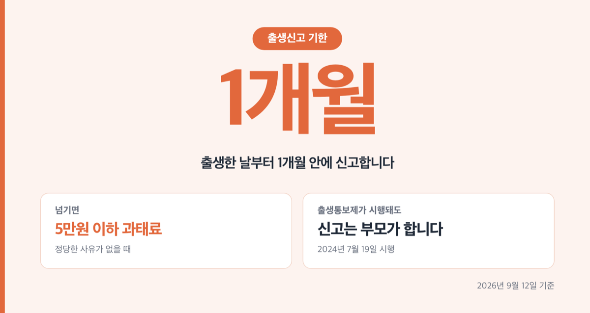

# '4벌' 출산가방 리스트 2026, 제왕절개면 내의부터 달라져요

📌 2026년 9월 12일 기준

4벌입니다. 출산가방에 넣을 보온용 내의 얘기인데, 자연분만이면 2벌이에요. 보건복지부가 배포한 「초보아빠를 위한 육아가이드」에 수량까지 그렇게 적혀 있습니다.

**3줄 요약**

- 정부가 만든 출산가방 목록은 보건복지부 「초보아빠를 위한 육아가이드」 2024년 배포판이고, 산모 물품 8가지가 적혀 있어요.
- 2024년 배포판에는 수량이 분만 방법별로 나뉩니다. 보온용 내의와 목이 긴 양말이 자연분만 2벌, 제왕절개 4벌이에요.
- 가방 안쪽에는 산모수첩과 신분증, 국민행복카드(임신 1회당 100만원)를 넣고, 출생신고는 출생 후 1개월 안에 해야 합니다.

아래에 정부 목록 8가지, 병원이 따로 요구하는 것, 조리원 목록과의 차이, 계절 짐, 서류 순으로 적었어요.

> [!WARNING]
> 준비물은 분만 병원과 산후조리원이 각자 정해서 고지합니다. ==정부 목록을 다 챙겨도 병원이 따로 요구하는 것이 남아요.== 입원 예약할 때 그 병원 안내문을 꼭 따로 받으세요.

## 📋 정부가 적어 둔 산모 물품 8가지

보건복지부 「초보아빠를 위한 육아가이드」가 적어 둔 산모용 입원 준비물은 옷, 위생용품, 보온용품 세 갈래예요. 아래는 2024년 2월 배포판에 실린 여덟 항목 전부입니다.

| 항목 | 2024년 배포판에 적힌 설명·수량 |
|---|---|
| 보온용 내의, 목이 긴 양말 | 자연분만 2벌, 제왕절개 4벌 |
| 카디건 | 여름이어도 얇은 카디건을 꼭 |
| 수유브라, 패드, 팬티 | 팬티는 2~5장 넉넉히. 제왕절개면 절개선 위까지 덮는 크기 |
| 물티슈 | 다용도로 쓰는 품목 |
| 가제 손수건 | 세면 말고도 온찜질, 유방 마사지에 씀 |
| 얇은 담요 | 산모 보온, 보호자가 간이침대에서 쉴 때 |
| 보온병 | 매번 정수기까지 가지 않아도 됨 |
| 복대 | 출산 뒤 이완된 허리와 배를 조일 때 |

제왕절개에서 두 배가 되는 건 내의와 양말 하나뿐이 아니에요. 팬티도 '절개선 위까지 덮는 크기'라는 조건이 따로 붙습니다.

가이드는 수량만 적고 왜 두 배인지는 밝히지 않았어요. 다만 입원 기간을 보면 짐작이 됩니다. 전북특별자치도 남원의료원은 자연분만 2박 3일, 제왕절개 7박 8일로 안내해요. 나눠 보면 약 2.7배입니다. **두 자료를 견준 제 추정이고, 어느 원문에도 「입원이 길어서」라고 적혀 있지는 않아요.**

저라면 분만 방법이 확정되기 전에는 4벌 기준으로 쌉니다. 2벌이 남는 쪽보다, 모자라서 보호자가 집에 다녀오는 쪽이 더 번거로우니까요.

> 😕 인터넷에 도는 목록이랑 다른데요?

임신육아종합포털 아이사랑에 실린 준비물 목록은 출처를 「2018 초보아빠를 위한 육아가이드」라고 적어 두고 있어요. 보건복지부가 2024년 2월에 배포한 같은 책과 견주면 수량이 빠져 있고, 얇은 담요 설명도 '산모 보온'까지만 나옵니다. 정부 포털이라도 인용한 원본이 낡으면 목록이 달라져요.

그런데 여기서 끝이 아닙니다.

## 병원이 요구하는 것과 병원이 주는 것

병원 준비물은 정부 목록과 별개로 그 병원이 정해서 고지해요. 아래는 분당서울대학교병원, 삼성서울병원, 국민건강보험 일산병원 세 곳의 입원 안내에서 **모두** 나온 것만 추린 것입니다. 분만 특화 안내가 아니라 입원 일반 안내예요.

| 항목 | 세 병원 안내에 적힌 조건 |
|---|---|
| 세면도구 | 비누·치약·칫솔·샴푸 |
| 수건 | 개인 준비 *(남원의료원은 6장을 적었어요)* |
| 컵 | 물컵 또는 물통 |
| 화장지 | 개인 준비 |
| 실내화 | 뒤축이 막히고 미끄럽지 않은 것 |
| 복용 중인 약과 처방전 | 쓰던 그대로 지참 |
| 매니큐어·젤네일 | 지우고 올 것 *(일산병원은 피어싱도 포함)* |

실내화 조건이 유독 구체적이에요. 분당서울대병원은 '밑창이 얇고 무늬가 있어 미끄러지지 않는, 뒤꿈치가 막힌 운동화 형태'라고 적었고, 일산병원도 뒤축이 있는 실내화나 운동화를 요구합니다. 슬리퍼를 사 두면 입구에서 걸릴 수 있어요.

반입이 막히는 것도 있습니다. 삼성서울병원은 **감염 예방**을 이유로 가습기를 제한해요. 커피포트·전기장판·찜질팩은 **화재와 화상 예방** 항목으로 묶여 쓸 수 없습니다. 일산병원은 칼·가위·일회용 면도기 같은 날카로운 물건을 금지하고, 분당서울대병원도 과도와 수동 일회용 면도기를 막습니다. 막는 이유가 감염과 화재·부상이라서, 병원을 바꿔도 비슷한 물건이 걸린다고 저는 봐요.

병원이 무엇을 주는지까지 적어 둔 곳으로는 남원의료원이 있어요. 지급 품목은 속싸개 1개, 배냇저고리 1장, 젖병 1개, 분유 1통입니다. 같은 병원이 보호자에게 요구한 아기 물품은 배냇저고리 4~5장, 젖병 3~4개, 속싸개 3장 이상, 겉싸개 1장, 신생아용 일자형 기저귀 1통이에요. 받는 쪽보다 가져가는 쪽이 훨씬 깁니다.

이건 한 병원의 규정이라 다른 병원에 그대로 옮길 수 없어요. 분만 예약할 때 지급 품목을 그 병원에 직접 물어보세요.

보호자 몫도 챙겨야 합니다. 분당서울대병원과 삼성서울병원은 보호자 침구류를 제공하지 않는다고 적어 뒀어요. 육아가이드가 얇은 담요를 '보호자가 간이침대에서 쉴 때'라고 설명한 것과 정확히 겹치는 대목입니다.

신분증은 환자와 상주보호자 둘 다 필요해요. 미성년자는 학생증, 여권, 주민등록등본, 가족관계증명서로 대신할 수 있습니다.

정부 목록은 최소한이고, 그 위에 병원 목록이 한 겹 더 있습니다.

## 조리원 가방은 목록이 다릅니다

산후조리원 준비물은 병원 준비물에서 아기 옷이 빠지고 수유 용품이 들어가는 목록이에요. 공공산후조리원 두 곳이 공개한 원문은 이렇습니다.

| 공공산후조리원 | 준비물로 적어 둔 것 |
|---|---|
| 서대문구 「품애가득」 | 내의·속옷, 양말, 개인 화장품·세면도구, 텀블러, 물티슈, 모유저장팩(필요시), 산모패드, 수유패드, 생리대, 편한 바지 |
| 경기 여주 | 세면도구, 물컵, 양말, 휴지, 수유패드, 모유저장팩, 신생아 물티슈, 실내용 슬리퍼 |

두 목록을 병원 목록과 견주면 세 가지가 달라요. **이건 제가 목록을 대조해 뽑은 것이고, 어느 안내문에도 「차이는 이것이다」라고 적혀 있지는 않습니다.**

1. 아기 옷이 없어요. 배냇저고리·속싸개·겉싸개는 병원 목록에는 있고 조리원 두 곳 목록에는 없습니다.
2. 모유저장팩과 수유패드가 들어가요. 육아가이드 병원 목록에는 모유저장팩이 없고, 조리원 두 곳에는 모두 있어요.
3. 산모패드·수유패드·실내용 슬리퍼는 시설이 주기도 합니다. 서대문구는 '제공' 품목으로 적었고 여주는 '준비물'로 적었어요.

3번에서 짐이 달라집니다. 물론 조리원이 챙겨 주는 게 많으면 짐이 줄어요. 그런데 같은 공공조리원인데도 두 곳이 서로 다르게 적었습니다. ==조리원이 패드와 슬리퍼를 준다고 일반화할 수 없어요.== 공공산후조리원은 지자체가 운영해서 제공 품목이 시설마다 달라요. 거주지 조리원 안내를 꼭 따로 확인하세요.

짐을 정할 때 배경이 하나 더 있어요. 조리원 실내는 계절과 상관없이 따뜻합니다. 보건복지부 「산후조리원 감염·안전 관리 매뉴얼」은 신생아실 온도를 24~28℃, 습도를 30~60%로 잡아요. 조리장 실내온도는 28℃ 이하 권장이고요. 두꺼운 겉옷 하나보다 덧입고 벗기 쉬운 옷을 챙기는 게 좋은 이유예요.

생활 규정도 미리 알아 두면 짐이 줄어요. 여주는 면회인 입실을 막고 지정된 곳에서만 면회하게 하며 자녀 입실도 제한합니다. 서대문구도 면회인 입실 제한은 같아요. 여주는 귀중품을 보관해 주지 않고 도난 시 본인 책임이라고 밝혔습니다.

모자동실도 짚고 갑니다. 「2026년 모자보건사업 안내」는 모자보건법에 모자동실 운영 **권장** 조항이 추가됐다고 적었어요. 권장이지 의무가 아닙니다.

## 계절에 따라 바뀌는 짐

계절 짐은 겉옷 한 겹과 보온 용품에서 달라져요. 정부 발간물에서 계절을 직접 언급한 문장은 셋뿐입니다.

1. 카디건 — '여름이어도 얇은 카디건을 꼭 챙기세요' *(가이드가 유일하게 '꼭'을 붙인 항목이에요)*
2. 보온용 내의와 목이 긴 양말 — 자연분만 2벌, 제왕절개 4벌
3. 얇은 담요 — 산모 보온 및 보호자가 간이침대에서 쉴 때

여름에도 카디건을 넣으라는 이유는 가이드에 적혀 있지 않아요. **다만 신생아실 기준 온도가 24~28℃인 것과 견주면 냉방 때문이라고 저는 봅니다. 두 자료를 이어 붙인 추정이에요.**

겨울에 챙기기 쉬운 것들이 오히려 막힙니다. 가습기, 전기장판, 찜질팩은 삼성서울병원에서 제한 품목이에요. 보온은 전기 제품이 아니라 내의와 담요로 해결해야 합니다.

여기서부터는 공식 자료가 아니라 육아 정보 사이트들이 쓴 이야기예요. 베이비페어 일정을 정리하는 도담플라와 산부인과 전문의 추성일이 운영하는 forhappywomen.com은 여름에 얇은 가디건을 덧입을 수 있게 챙기라고 적었어요. 가을·겨울에는 겉싸개를 하나 더 넣으라는 이야기가 도담플라와 맘맘(mom-mom.net)에 나옵니다. 겨울 조리원복만으로는 추울 수 있어 내의를 챙기면 좋다는 글은 forhappywomen.com과 베베헤븐(bebeheaven.co.kr)에 있어요. 공식 목록에 오른 항목은 아니니 참고로만 보시면 됩니다.

## 서류와 카드 — 가방 안쪽에 먼저 넣어요

출산가방에 넣는 서류는 산모수첩, 신분증, 국민행복카드 셋입니다. 옷보다 이쪽을 먼저 넣으세요.

**산모수첩(표준모자보건수첩)** — 모자보건법 제9조와 같은 법 시행규칙 제3조 제1항에 따라 발급되는 수첩이에요. 대상은 임산부와 0~36개월 영유아의 부모입니다. 안에는 임신 시기별 정보와 분만 방법, 출산 이후 정보가 들어 있어요. 남원의료원은 분만 시 산모수첩을 지참해 오라고 안내문에 따로 적어 뒀습니다.

아직 못 받았다면 순서는 이렇습니다.

1. 임신 또는 출생 사실이 확인되면 보건소나 진료받는 의료기관에서 발급받아요. 의료기관에서 받았으면 보건소에서 또 받을 필요가 없습니다.
2. 그래도 없으면 정부24, 맘편한 임신, 아이마중에서 임산부가 직접 신청해요. 배송은 착불입니다.
3. 종이 수첩이 늦으면 아이마중 앱 안의 임산부·아기수첩을 먼저 씁니다.
4. 점자수첩은 읍면동 주민센터, 다국어수첩은 다문화지원센터에서도 받아요.

**신분증** — 환자와 상주보호자 둘 다 챙깁니다. 입원 수속과 출생증명서 발급에 써요.

**국민행복카드(임신·출산 진료비 이용권)** — 가방에 넣는 이유는 지원 범위에 임산부 진료 본인부담금이 들어 있어서예요. 급여도 비급여도 됩니다. 2세 미만 아기의 진료비와 처방된 약제·치료재료 본인부담금에도 써요.

| 항목 | 2026년 3월 31일 최종수정 기준 |
|---|---|
| 지원금액 | 임신 1회당 100만원 |
| 다태아 | 기본 140만원, 태아 당 100만원이 되도록 추가 지급 |
| 분만취약지 | 20만원 추가 |
| 사용 종료 | 분만예정일 또는 출산일(유산·사산일)부터 2년 |

다태아 추가 지급에는 조건이 붙어요. 2024년 1월 1일 이후 임신주수 20주 이상의 다태아 임신을 유지 중이거나 다태아를 출산한 임산부가 대상입니다. 2025년 1월 1일 이후 신청자는 기본 지급금과 함께 추가 지급금 60만원이 자동으로 신청돼요.

이미 국민행복카드가 있다면 새로 발급받지 않아도 됩니다. 신청일에 포인트가 생기고 그날부터 써요.

**출생신고** — 출생 후 1개월 이내에 해야 합니다. 정당한 사유 없이 넘기면 5만원 이하 과태료가 붙어요. 혼인 중 출생자는 아버지 또는 어머니가, 혼인 외 출생자는 어머니가 신고합니다. 두 사람이 못 하면 동거하는 친족, 그다음 분만에 관여한 의사·조산사 순이에요.

1. 출생증명서를 분만한 병원에서 받아요.
2. 출생지, 또는 아이의 등록기준지나 신고인의 주소지·현재지 관할 시(구)·읍·면 사무소로 갑니다. 신고인 본인의 주민등록 관할 동사무소에서도 돼요.
3. 신고서에 아이의 성명·본·성별과 등록기준지, 출생 연월일시와 장소, 부모의 성명·본·등록기준지·주민등록번호를 적어요. 어머니의 성과 본을 따르기로 협의했다면 그 사실도 적습니다.
4. 출생증명서, 신고인의 신분증명서, 부모의 혼인관계증명서 등을 냅니다. 행정정보공동이용으로 확인되면 제출이 빠져요.

> [!WARNING]
> 2024년 7월 19일부터 출생통보제가 시행됐어요. 의료기관이 출생 정보를 통보하지만, 대법원은 **부모가 기존과 같이 출생신고를 해야 한다**고 밝혔습니다. 신고하지 않으면 시(구)·읍·면의 장이 감독법원 허가를 받아 직권으로 출생등록을 해요.

**첫만남이용권** — 이건 가방에 넣을 게 아니라 출생신고 뒤에 신청합니다. 2024년 1월 1일 이후 출생아부터 첫째 200만원, 둘째 이상 300만원이고 국민행복카드 바우처로 나와요. 사용기간은 출생일로부터 2년입니다.

필요한 서류는 사회보장급여(사회서비스이용권) 신청(변경)서예요. 출산 지원 서비스를 한 번에 신청하려면 출산서비스 통합처리신청서를 씁니다. 이때 부모와 아이의 주민등록 주소지가 다르면 부모 가족관계증명서를 확인해요. 유흥·사행업종, 마사지 같은 위생업종(이미용실은 됩니다), 레저업종, 성인용품 등 기타업종, 면세점만 빼고 쓸 수 있습니다.

## 자주 걸리는 것 넷

**첫째, 첫만남이용권 사용기간이 1년이라고 적힌 안내를 보게 돼요.** 보건복지부 페이지에도 옛 기준 문장이 같은 칸에 남아 있습니다. 2024년 1월 1일 이후 태어난 아이는 2년이에요. 시행일과 출생일을 헷갈리면 안 되는 대목입니다.

**둘째, 출생통보제가 생겼으니 신고를 안 해도 된다고 보시면 안 됩니다.** 통보는 의료기관이 하는 것이고, 신고 의무는 부모에게 그대로 남아 있어요.

**셋째, 조리원이 패드와 슬리퍼를 준다고 미리 빼 놓지 마세요.** 서대문구는 제공, 여주는 준비물로 적었습니다. 두 곳이 다르다는 것 자체가 확인된 사실이에요.

**넷째, 매니큐어와 젤네일입니다.** 삼성서울병원, 일산병원, 남원의료원이 모두 지우고 오라고 적었어요. 남원의료원은 화장과 장신구까지 함께 적었고, 일산병원은 피어싱도 포함합니다. 세 곳이 공통으로 요구한 몇 안 되는 것이라, 저는 이걸 짐 싸기보다 먼저 처리합니다.

## 출산가방 리스트 관련 궁금증 해결

**Q. 출산가방은 언제까지 싸 두면 되나요?**
A. 병원으로 출발하는 기준이 정해져 있어요. 초산은 5분 간격, 경산은 10분 간격으로 규칙적인 진통이 오면 즉시 병원에 갑니다. 양수가 터지면 세균 감염 위험이 있어 더 서둘러야 해요. 그 시점에 가방을 싸기는 어려우니 저는 그 전에 끝내 둡니다.

**Q. 병원 갈 때 차 안에서 주의할 게 있나요?**
A. 육아가이드는 산모를 반드시 뒷좌석에 앉히고, 무릎 위에 쿠션을 올려 그 위에 엎드리게 하라고 적었어요.

**Q. 산모수첩을 아직 못 받았는데 어떡하죠?**
A. 정부24, 맘편한 임신, 아이마중에서 임산부가 직접 신청할 수 있어요. 배송은 착불입니다. 종이 수첩이 늦어지면 아이마중 앱 안의 임산부·아기수첩을 먼저 쓰시면 돼요.

**Q. 병원이 아기 물건을 어디까지 주나요?**
A. 병원마다 다릅니다. 남원의료원은 속싸개 1개, 배냇저고리 1장, 젖병 1개, 분유 1통을 지급한다고 적어 뒀어요. 분만 예약할 때 그 병원에 지급 품목을 물어보세요.

**Q. 입원은 며칠이나 하나요?**
A. 남원의료원 기준으로 자연분만 2박 3일, 제왕절개 7박 8일이에요. 한 병원의 안내이니 분만 예정 병원에 확인하세요.

출산가방은 목록 하나로 끝나지 않아요. 정부 목록 8가지가 바닥이고, 그 위에 분만 병원 목록이 한 겹, 조리원에 간다면 또 한 겹이 얹힙니다. 세 겹 중 전국이 같은 건 정부 목록뿐이고 나머지 둘은 시설이 정해요.

저라면 순서를 이렇게 잡습니다. 산모수첩과 신분증, 국민행복카드를 안쪽 주머니에 먼저 넣고, 정부 목록 8가지를 제왕절개 기준으로 채운 다음, 분만 병원 안내문을 받아 빠진 것만 더합니다. 조리원 짐은 퇴원 전에 보호자가 따로 꾸리면 돼요.

분만 방법과 입원 기간, 복용 중인 약은 담당 의사에게 확인하세요. 지원금 자격과 금액은 관할 보건소나 주민센터에서 확인하시면 됩니다.

참고: 보건복지부 「초보아빠를 위한 육아가이드」(2024-02-07 배포) · 보건복지부 「2026년 모자보건사업 안내」 · 보건복지부 「산후조리원 감염·안전 관리 매뉴얼」 · 보건복지부 임신·출산진료비지원사업 · 보건복지부 임신·출산 지원(첫만남이용권) · 대법원 보도자료 「2024. 7. 19.부터 출생통보제 및 보호출산제 최초 시행」 · 법제처 찾기쉬운 생활법령정보(출생신고하기, 임산부 건강 챙기기) · 분당서울대학교병원 입원 준비물 · 삼성서울병원 입원준비 · 국민건강보험 일산병원 입원안내 · 전북특별자치도 남원의료원 분만실 · 서대문구 공공산후조리원 「품애가득」 · 경기 여주공공산후조리원 · 임신육아종합포털 아이사랑 · 도담플라 · 맘맘 · forhappywomen.com · 베베헤븐
