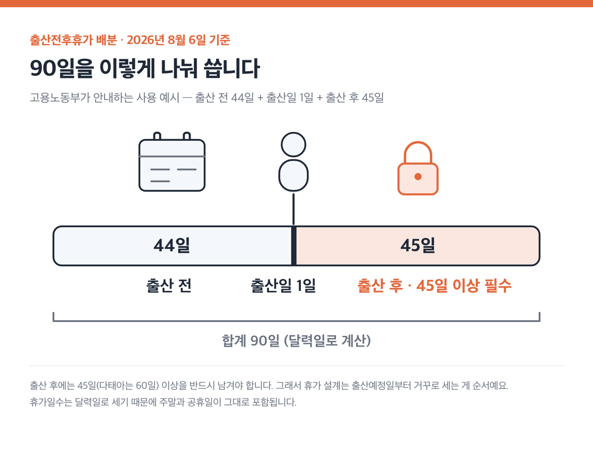
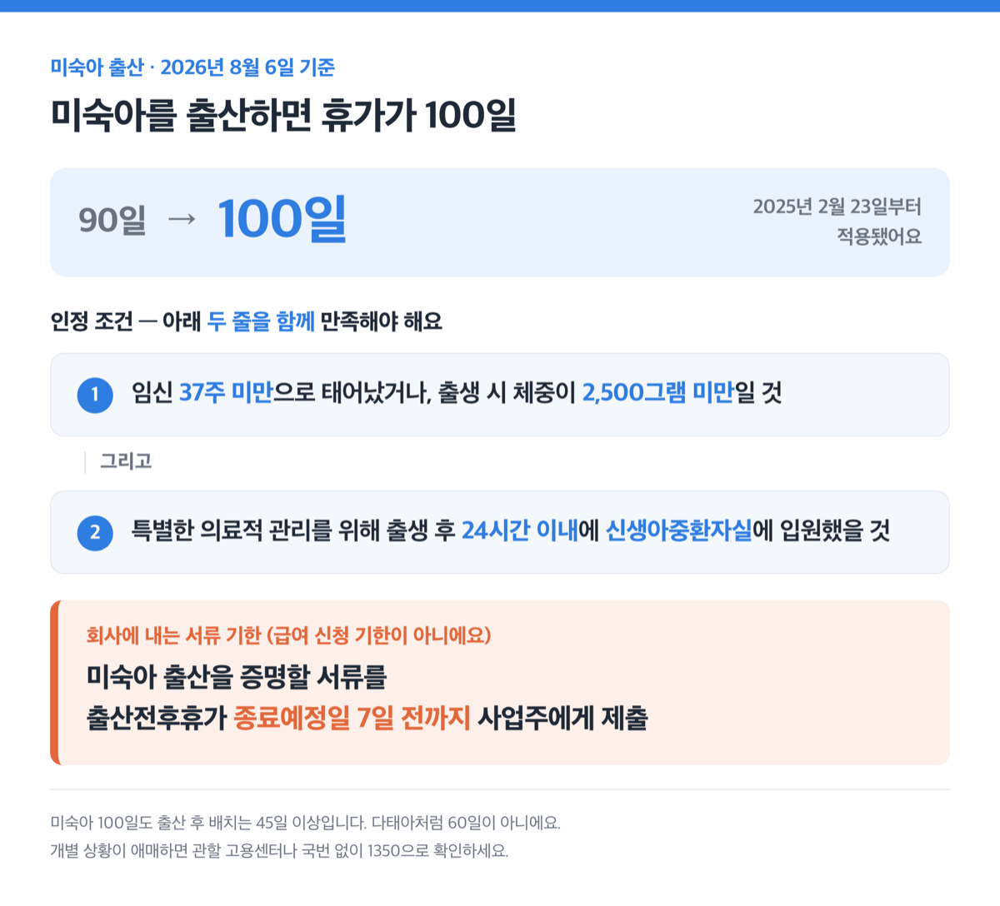
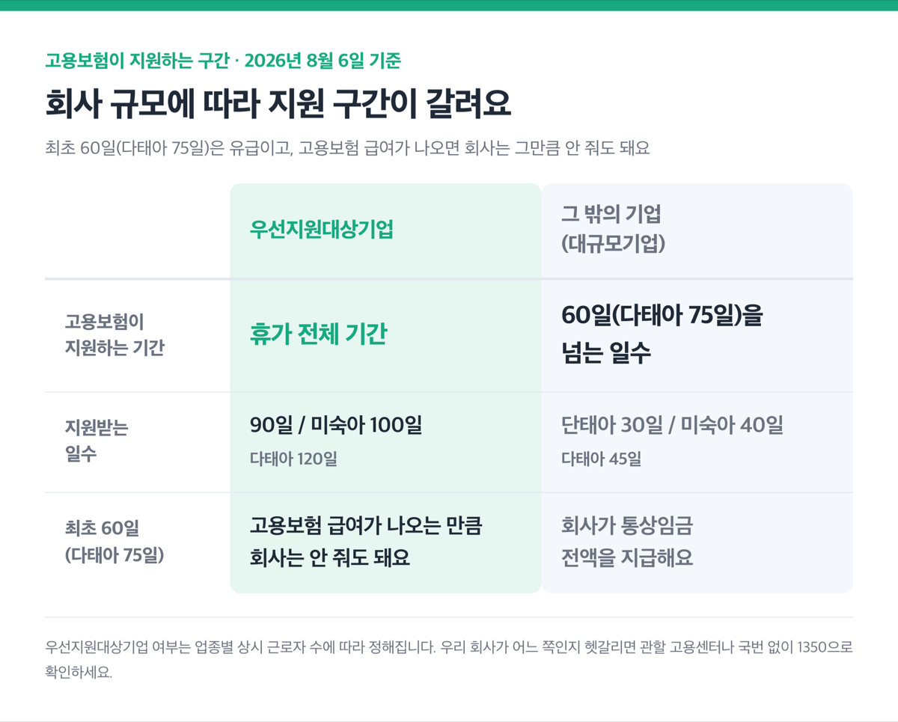
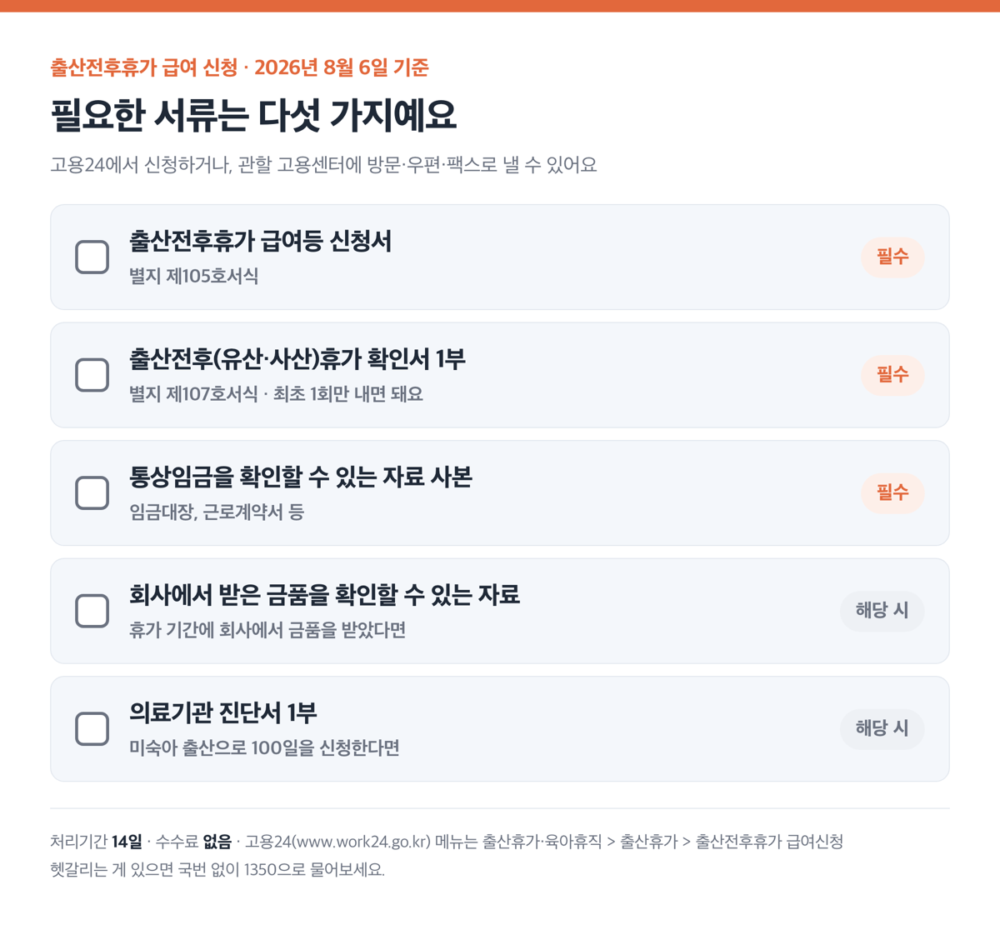
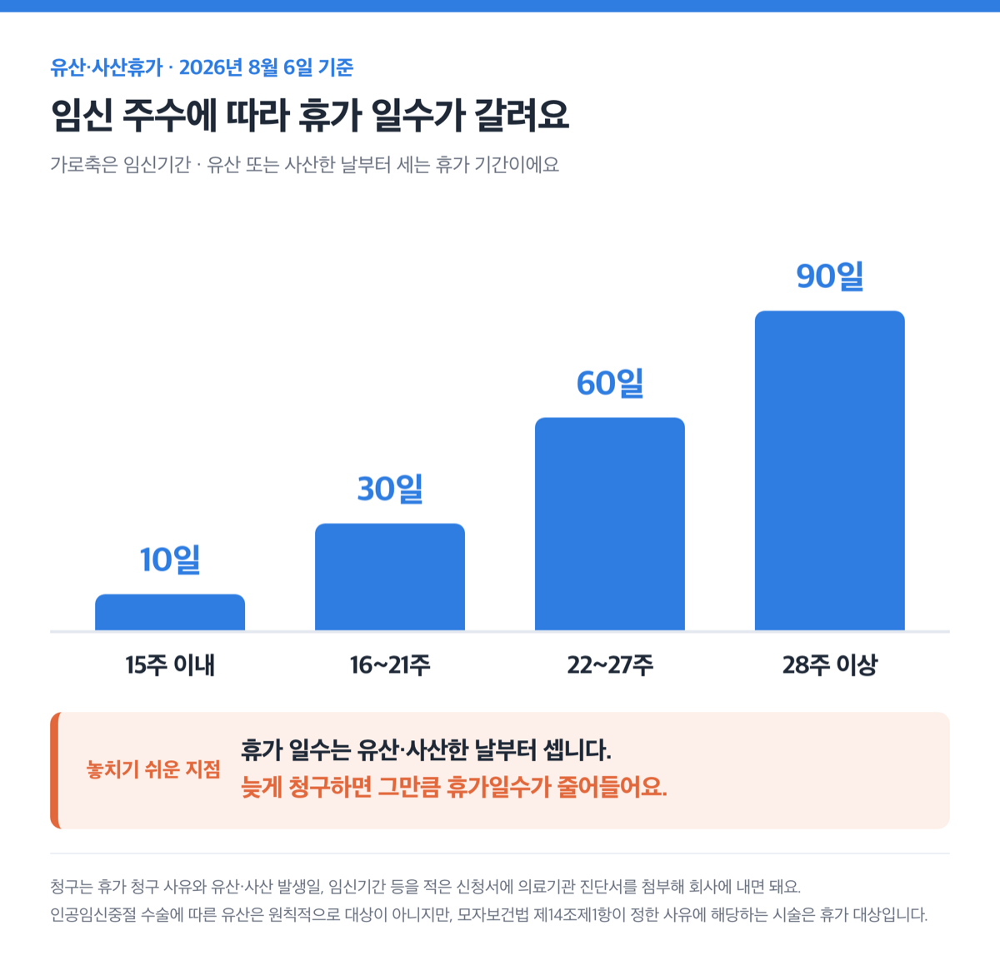
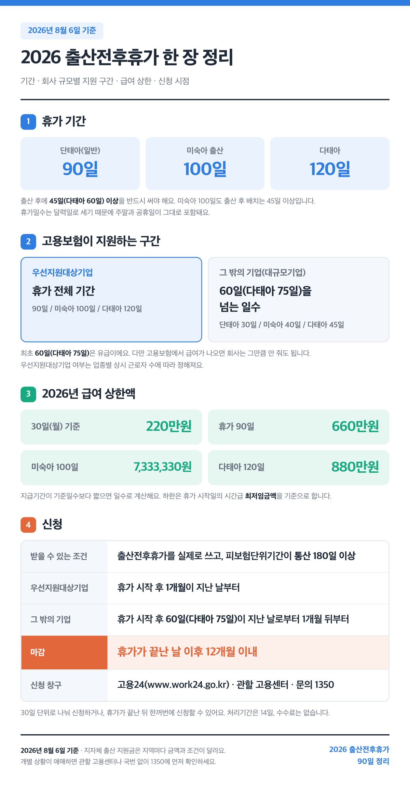

> [!SUMMARY] 2026년 8월 6일 기준
> 결론부터요. 2026년 출산전후휴가는 90일, 미숙아를 낳으면 100일, 쌍둥이 이상이면 120일이에요. 급여 상한은 30일 기준 220만원이고요. 신청은 휴가가 끝난 날 이후 ==12개월 안에== 해야 합니다.

근데 급여를 언제부터 신청할 수 있는지는 회사 규모에 따라 갈려요. 우선지원대상기업이냐 아니냐가 기준이에요.

## ■ 90일이 기본, 출산 후 45일은 반드시 남겨야 합니다

휴가 일수는 세 가지로 갈려요.

| 구분 | 총 휴가일수 | 출산 후 써야 하는 일수 |
|---|---|---|
| 단태아(일반) | 90일 | 45일 이상 |
| 미숙아 출산 | 100일 | 45일 이상 |
| 다태아(한 번에 둘 이상 임신) | 120일 | 60일 이상 |

출산 후에 45일, 다태아면 60일 이상을 꼭 써야 한다는 게 법으로 정한 조건이에요. 그래서 휴가 설계는 출산예정일부터 거꾸로 세는 게 순서예요.

고용노동부가 안내하는 사용 예시는 이래요. 출산 전 44일 + 출산일 1일 + 출산 후 45일 = 90일.

여기서 착각하기 쉬운 게 하나 있어요. 휴가일수는 달력일로 셉니다. 주말과 공휴일이 그대로 포함돼요.

근데 출산 전 구간은 나눠 쓸 수 있는 경우가 있어요. 아래 세 가지 사유 중 하나에 해당할 때예요.

- 유산이나 사산을 경험한 적이 있는 경우
- 휴가를 청구할 당시 만 40세 이상인 경우
- 유산·사산 위험이 있다는 의료기관 진단서를 낸 경우

이때도 출산 후 휴가는 연속으로 45일(다태아 60일) 이상이어야 해요. 나눠 쓸 수 있는 건 출산 전 구간뿐이에요.

회사가 출산전후휴가를 주지 않으면 2년 이하의 징역 또는 2천만원 이하의 벌금에 처해집니다.

참고로 9월에 제도가 바뀐다는 뉴스를 보고 오셨을 수도 있어요. 8월 20일 단기 육아휴직이 새로 생기고, 9월 18일 배우자 유산·사산휴가 신설과 배우자 출산휴가 사용 시기 확대가 이어져요. 11월 27일에는 난임치료휴가급여가 확대되고요. 전부 배우자 휴가와 육아휴직 쪽입니다. 본인 출산전후휴가 90일·100일·120일은 바뀌지 않아요.

## ■ 미숙아 100일은 종료 7일 전까지 서류를 내야 합니다

미숙아를 출산하면 휴가가 100일로 늘어나요. 2025년 2월 23일부터 적용됐어요.

근데 여기서 말하는 미숙아의 범위가 법에 정해져 있어요. 아래 두 줄을 함께 만족해야 해요.

- 임신 37주 미만으로 태어났거나, 출생 시 체중이 2,500그램 미만일 것
- 특별한 의료적 관리를 위해 출생 후 24시간 이내에 신생아중환자실에 입원했을 것

기한도 따로 있어요. 미숙아 출산 사실을 증명할 수 있는 서류를 출산전후휴가 종료예정일 ==7일 전까지== 사업주에게 제출해야 합니다.

> [!WARNING]
> 이건 급여 신청 기한이 아니라 회사에 내는 서류 기한이에요. 미숙아 출산으로 100일을 쓰려면 이 절차가 조건입니다.

미숙아 100일도 출산 후 배치는 45일 이상이에요. 다태아처럼 60일이 아니고요.

## ■ 급여는 회사 규모로 갈리고, 상한은 30일에 220만원입니다

먼저 누가 주는 돈인지부터 정리할게요.

휴가 중 최초 60일, 다태아면 75일은 유급이에요. 다만 고용보험에서 출산전후휴가급여가 나오면 회사는 그만큼은 안 줘도 돼요.

그래서 실제 구조는 이렇게 갈려요.

| 구분 | 고용보험이 지원하는 기간 |
|---|---|
| 우선지원대상기업 | 휴가 전체 기간(90일 / 미숙아 100일 / 다태아 120일) |
| 그 밖의 기업(대규모기업) | 60일(다태아 75일)을 넘는 일수 |

대규모기업이면 고용보험 지원이 단태아 기준 최대 30일, 미숙아 기준 40일, 다태아 기준 45일이에요. 최초 ==60일(다태아 75일)==은 회사가 통상임금 전액을 지급해요.

그럼 우리 회사는 어느 쪽일까요. 업종별 상시 근로자 수에 따라 정해져요.

| 업종 | 상시 사용하는 근로자 수 |
|---|---|
| 제조업 | 500명 이하 |
| 광업, 건설업, 운수·창고업, 정보통신업, 사업시설 관리·사업 지원 및 임대 서비스업, 전문·과학·기술 서비스업, 보건업·사회복지 서비스업 | 300명 이하 |
| 도매·소매업, 숙박·음식점업, 금융·보험업, 예술·스포츠·여가 서비스업 | 200명 이하 |
| 그 밖의 업종 | 100명 이하 |

예외가 두 개 있어요. 제조업 중 산업용 기계 및 장비 수리업, 그리고 사업시설 관리·사업 지원 및 임대 서비스업 중 부동산 이외 임대업은 '그 밖의 업종'으로 봐서 100명 이하가 기준이에요.

중소기업기본법상 중소기업이면 이 표에 안 맞아도 우선지원대상기업으로 봐요. 회사가 커져서 기준을 넘어도, 그 사유가 생긴 연도의 다음 연도부터 5년간은 계속 우선지원대상기업으로 봅니다.

업종 구분은 한국표준산업분류를 따라요. 우리 회사가 어느 쪽인지 헷갈리면 관할 고용센터에 확인하세요.

2026년 급여 상한액은 아래와 같아요.

| 기준 기간 | 상한액 (우선지원대상기업 기준) |
|---|---|
| 30일(월) 기준 | 220만원 |
| 출산전후휴가 90일 | 660만원 |
| 미숙아 100일 | 7,333,330원 |
| 다태아 120일 | 880만원 |

지급기간이 기준일수보다 짧으면 일수로 계산해요.

하한도 있어요. 휴가 시작일에 적용되는 시간급 최저임금액이 본인의 시간급 통상임금보다 높으면, 최저임금액을 시간급 통상임금으로 보고 급여를 계산합니다.

## ■ 신청은 언제부터? 여기서 또 회사 규모가 갈려요

급여를 받으려면 요건 두 가지를 채워야 해요.

- 근로기준법에 따른 출산전후휴가나 유산·사산휴가를 실제로 쓸 것
- 휴가가 끝난 날 이전에 피보험단위기간(고용보험에 가입해 일한 기간을 모두 더한 기간이에요)이 통산 180일 이상일 것

180일은 한 회사에서 채운 근속기간이 아니라 통산이에요. 이직을 했어도 합쳐서 계산해요.

> [!TIP]
> 신청 시점은 회사 규모에 따라 이렇게 갈려요.
>
> | 구분 | 신청 개시 시점 |
> |---|---|
> | 우선지원대상기업 | 휴가 시작 후 1개월이 지난 날부터 |
> | 그 밖의 기업 | 휴가 시작 후 60일(다태아 75일)이 지난 날로부터 1개월 뒤부터 |

마감은 양쪽 다 같아요. 휴가가 끝난 날 이후 ==12개월 이내==에 신청해야 합니다.

여기에 예외가 있어요. 천재지변, 병역법에 따른 의무복무, 구속이나 형 집행, 본인이나 배우자의 질병·부상으로 신청하지 못했다면 그 사유가 끝난 후 30일 이내에 신청할 수 있어요. 본인이나 배우자의 부모·자녀가 아프거나 다친 경우도 같은 예외예요. 시부모처럼 배우자 쪽 부모도 여기 들어가요.

30일 단위로 나눠 신청할 수도 있어요. 사용 기간이 30일 미만이면 그 기간만큼만 신청하고, 휴가가 끝난 뒤에는 한꺼번에 신청할 수 있어요.

지급 제한 사유도 두 가지 알아두세요. 휴가 중에 이직하거나 새 사업장에 취업하면 그 시점부터 급여가 나오지 않아요. 거짓이나 부정한 방법으로 신청한 경우에도 지급되지 않습니다.

 지나고 1개월 후부터입니다")

## ■ 고용24에서 이 순서대로 하면 끝납니다

순서를 정리하면 여섯 단계예요.

1. 출산 후 45일(다태아 60일)을 먼저 확보하고, 남는 일수를 출산 전에 배분해요.
2. 회사가 우선지원대상기업인지 확인해요. 신청 시점이 여기서 갈려요.
3. 회사에 출산전후휴가를 신청해요. 회사는 휴가 확인서를 준비해요.
4. [고용24](https://www.work24.go.kr)에서 급여를 신청해요. 메뉴는 출산휴가·육아휴직 > 출산휴가 > 출산전후(유산,사산,배우자,난임치료)휴가 급여신청이에요.
5. 서류를 갖춰 제출해요.
6. 30일 단위로 나눠 받거나, 휴가가 끝난 뒤 한 번에 받아요.

방문·우편·팩스로 내려면 거주지나 사업장 소재지의 관할 고용센터로 가면 돼요. 헷갈리는 게 있으면 국번 없이 1350으로 물어보세요.

필요한 서류는 다섯 가지예요.

- 출산전후휴가 급여등 신청서(별지 제105호서식)
- 출산전후(유산·사산)휴가 확인서 1부(별지 제107호서식) — 최초 1회만 내면 돼요
- 통상임금을 확인할 수 있는 자료(임금대장, 근로계약서 등) 사본
- 휴가 기간에 회사에서 금품을 받았다면 그것을 확인할 수 있는 자료
- 미숙아 출산으로 100일을 신청한다면 의료기관 진단서 1부

처리기간은 14일이고 수수료는 없어요.

## ■ 유산·사산휴가는 하루 늦으면 하루가 줄어듭니다

유산이나 사산을 한 경우에도 휴가가 있어요. 임신기간에 따라 일수가 갈려요.

| 임신기간 | 휴가 기간 |
|---|---|
| 15주 이내 | 유산·사산한 날부터 10일까지 |
| 16주 이상 21주 이내 | 유산·사산한 날부터 30일까지 |
| 22주 이상 27주 이내 | 유산·사산한 날부터 60일까지 |
| 28주 이상 | 유산·사산한 날부터 90일까지 |

여기가 진짜 중요한 지점이에요.

휴가 일수는 유산 또는 사산한 날부터 세기 시작해요. 청구가 늦어져도 시작일이 뒤로 밀리지 않아요.

> [!WARNING]
> 늦게 청구하면 그만큼 휴가일수가 줄어듭니다.

청구는 휴가 청구 사유와 유산·사산 발생일, 임신기간 등을 적은 유산·사산휴가 신청서에 의료기관 진단서를 첨부해 회사에 내면 돼요.

인공임신중절 수술에 따른 유산은 원칙적으로 대상이 아니에요. 다만 모자보건법 제14조제1항이 정한 사유에 해당하는 시술은 휴가 대상이에요. 유전성 질환, 전염성 질환, 강간, 모체 건강 위험 등이 여기에 들어가요.

## ■ 180일을 못 채웠어도 길은 두 개 있어요

피보험단위기간 180일을 못 채웠다고 여기서 끝나는 게 아니에요. 상황에 따라 두 갈래가 있어요.

첫째는 기간제나 파견 근로자인데 휴가 중에 근로계약이 끝난 경우예요. 「출산전후휴가 급여 등에 상당하는 금액」이라는 별도 제도가 있어요. 조건은 네 가지예요.

- 기간제근로자 또는 파견근로자일 것
- 출산전후휴가나 유산·사산휴가 기간 중에 근로계약기간이 만료될 것
- 근로계약 종료일까지 피보험단위기간이 180일 이상일 것
- 휴가 종료 후 12개월 이내에 신청할 것

지급 기간은 근로계약이 끝난 다음 날부터 해당 출산전후휴가 종료일까지고요. 통상임금의 100%가 나오는데, 상한은 30일 기준 220만원, 하한은 최저임금액 기준이에요. 대규모기업 근로자도 기업 규모와 관계없이 받을 수 있어요. 신청은 고용24 온라인으로 하고, 사업주가 대신 신청할 수는 없어요.

둘째는 고용보험 미적용자 출산급여예요. 자영업자(1인 사업자), 특수형태근로종사자와 프리랜서, 180일 요건을 못 채운 근로자, 고용보험 적용제외 사업장 근로자가 대상이에요.

정상 출산은 150만원이에요. 유산·사산이면 15주까지 30만원, 16~21주 50만원, 22~27주 100만원, 28주 이상 150만원이고요. 신청 기한은 출산일부터 1년 이내입니다. 2026년 2월부터는 소득을 인정하는 기준이 세금신고 기준으로 바뀌었어요.

출산 후에 받는 지원금은 이 휴가급여와 별개예요. [첫만남이용권](/posts/childcare-childbirth/first-meeting-voucher-2026/)처럼 따로 신청해야 하는 제도가 있어요.

> [!ACTION]
> 지자체가 따로 주는 출산 지원금도 있는데, 금액과 조건이 지역마다 달라요. 사는 지역에 따라 다를 수 있으니 꼭 확인해 보세요. 개별 상황이 애매하면 관할 고용센터나 1350에 먼저 물어보는 게 정확해요.
>
> 출산전후휴가가 끝나면 다음은 육아휴직이에요. 요건도 신청 창구도 같으니, [2026 육아휴직 정리](/posts/childcare-childbirth/childcare-leave-2026/)를 미리 읽고 휴가 신청과 함께 일정을 잡아두세요.

참고: 고용노동부 일생활균형 「출산전후휴가 급여」 · 국가법령정보센터 「근로기준법」 제74조 · 「고용보험법」 제75조·제76조 · 법제처 찾기쉬운 생활법령정보 · 정부24 「출산전후(유산·사산)휴가 급여」 안내 · 고용24
