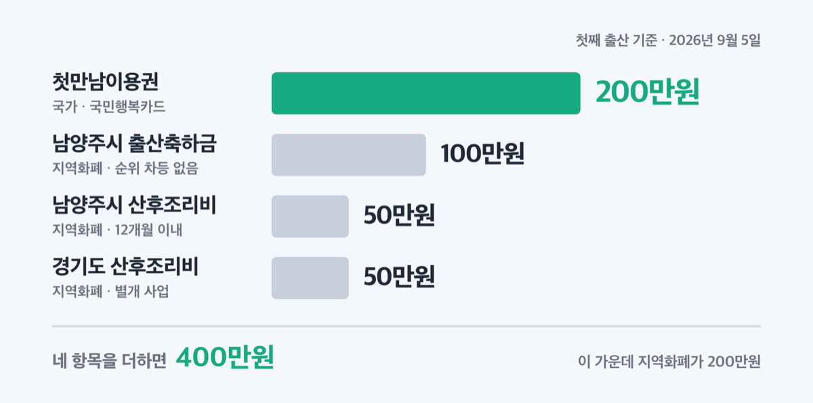
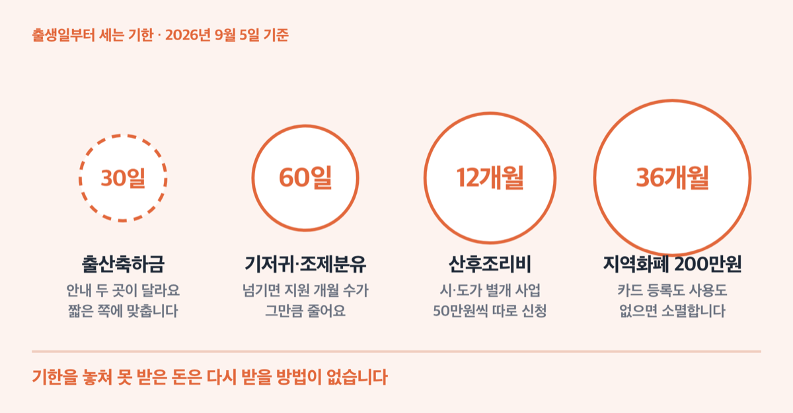
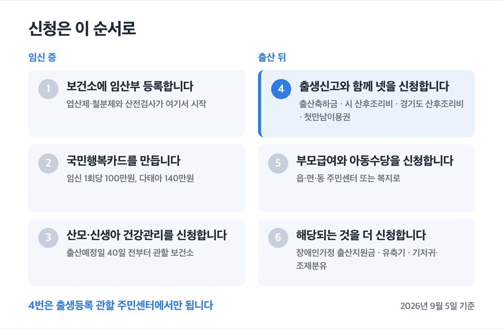

# 남양주시 출산지원금 2026, 첫째 400만원 기한 놓치면 끝

📌 2026년 9월 5일 기준

400만원이에요. 남양주시에서 첫째를 낳고 받을 수 있는 일시금을 다 더한 값입니다. 그런데 이 돈은 넷으로 나뉘어 있고, 신청 창구도 기한도 제각각이에요.

**3줄 요약**

- 남양주시는 출산축하금 100만원과 시 산후조리비 50만원을 지역화폐로 주고, 여기에 경기도 산후조리비 50만원이 따로 더해집니다.
- 2026년 1월부터 다자녀 종량제봉투 지원 대상에 2자녀 가정이 들어왔고, 4월 24일부터 아동수당이 9세 미만 아동으로 확대됐어요.
- 출산축하금 신청 기한은 남양주시 안내문 두 곳에 서로 다르게 적혀 있어요. 신청 전에 보건소 전화 확인이 먼저입니다.

받을 수 있는 돈을 시가 주는 것과 나라가 주는 것으로 나눠 보고, 신청 순서와 자주 걸리는 함정까지 짚어 볼게요.

> [!WARNING]
> 출산축하금 신청 기한이 남양주시 안내 두 곳에서 다르게 적혀 있어요. 보건소 안내는 출생일로부터 1년, 시 사전행정정보 게시물은 주민등록번호 부여일로부터 30일입니다. 신청 전에 **남양주보건소 031-590-4476** 으로 기한을 확인하고 움직이세요.

## 💰 남양주시가 직접 주는 돈 — 지역화폐로 200만원

남양주시의 현금성 출산 지원은 출산축하금, 시 산후조리비, 경기도 산후조리비 셋입니다. 셋 다 현금이 아니라 남양주사랑상품권, 즉 지역화폐로 나와요.

| 지원금 (출생아 1인당, 지역화폐) | 금액 | 신청 기한 |
|---|---|---|
| 남양주시 출산축하금 | 100만원 | 보건소 안내 기준 출생일로부터 1년 |
| 남양주시 산후조리비 | 50만원 | 출생일 포함 12개월 이내 |
| 경기도 산후조리비 | 50만원 | 출생일 포함 12개월 이내 |

출산축하금은 ==출산 순위에 따른 차등이 없습니다==. 첫째든 다섯째든 100만원이고, 아이 한 명당 1회 지급이에요. 거주 기간 요건도 없어요. 출생신고일 기준으로 남양주시에 주민등록이 있고, 신청일 현재도 주민등록을 두고 실제로 아이를 키우는 부 또는 모, 사실상 양육자가 대상입니다.

> 😕 남양주에 이사 온 지 얼마 안 됐는데 받을 수 있나요?

출산축하금은 됩니다. 거주기간 제한이 없다고 경기도 시군별 현황표에 명시돼 있어요. 다만 **남양주시 산후조리비는 다릅니다.** 이쪽은 출생일부터 신청일까지 계속 남양주시에 주민등록을 두고 있어야 해요.

여기가 두 산후조리비가 나뉘는 대목이에요. 경기도 산후조리비는 출생일과 신청일, 두 시점에 경기도 주민등록이 있으면 됩니다. 그 사이에 도내 다른 시·군에 살았어도 상관없어요. 반면 시 산후조리비는 그 사이가 한 번이라도 끊기면 안 됩니다. **중간에 다른 시·군에서 전입했다면 도 지원은 되고 시 지원은 막힐 수 있습니다.**

시 산후조리비는 아이의 출생등록을 남양주시에 해야 하고, 2023년 2월 16일 이후 출생아부터 적용돼요. 신청은 출생등록 관할 주민센터 방문만 됩니다. 다른 주민센터에서는 접수가 안 돼요.

경기도 산후조리비는 다태아면 출생아 수만큼 배수로 나옵니다. 쌍둥이면 100만원이에요. 출생 후 영아가 사망한 경우에도 지원합니다.

세 상품권 모두 유효기간이 36개월이에요. 신청하고 3년 안에 카드 등록이나 사용을 하지 않으면 소멸합니다.

부모 중 한 명이 장애인이면 별도 사업이 하나 더 있어요. 장애인가정 출산지원금입니다. 장애 정도가 심한 장애인은 150만원, 심하지 않은 장애인은 100만원이고, 출산 순위 구분 없이 1회 지급합니다. 쌍둥이 이상이면 추가되는 아이 한 명마다 지원액의 50%를 더 줘요.

이 지원금은 출산축하금과 별개 사업이에요. 담당 부서도 다릅니다. 신청은 관할 주민센터 복지팀에서 하고, 신분증·신청서·통장사본·주민등록등본을 챙겨 가세요. 신청 기한은 **장애인지원팀 031-590-2667** 로 미리 확인하고 방문하시는 게 안전합니다.

한 가지 짚고 갑니다. 남양주시에는 ==매달 나오는 시 자체 양육비가 없어요==. 경기도에서 시군 자체 양육비를 주는 곳은 성남·안산·평택·광주·이천·여주·과천 일곱 곳이고, 남양주시는 여기에 들어 있지 않습니다.

## 나라가 주는 돈 — 남양주 거주자도 그대로 받습니다

시 지원금과 별개로 정부 제도가 겹쳐 들어옵니다. 이게 금액으로는 더 커요.

| 정부 제도 (2026년 9월 기준) | 지원 금액 (아동 1인당) | 대상·기한 |
|---|---|---|
| 첫만남이용권 | 첫째 200만원 / 둘째 이상 300만원 | 출생일로부터 2년 안에 사용 |
| 부모급여 | 0세 월 100만원 / 1세 월 50만원 | 2세 미만(0~23개월) 아동 |
| 아동수당 | 월 10만원 | 9세 미만 아동 |

첫만남이용권은 국민행복카드 포인트로 나옵니다. 신청 기간은 따로 정해져 있지 않아요. 대신 사용 기한이 아이 출생일로부터 2년으로 고정돼 있습니다. **늦게 신청할수록 신청이 막히는 게 아니라 쓸 기간이 줄어드는 구조예요.** 그래서 공식 안내도 사용종료일 최소 2개월 전에는 신청하라고 적혀 있습니다. 신청은 주민등록 주소지 읍·면·동 행정복지센터 방문, 또는 복지로·정부24 온라인으로 하면 돼요.

다둥이는 첫째 200만원에 둘째 이후 300만원씩 각각 계산합니다. 쌍둥이 첫 출산이면 500만원이에요. 유흥·사행·성인용품·상품권·면세점 업종만 빼면 온라인 포함 거의 모든 업종에서 씁니다.

「아동수당법」 개정이 2026년 3월 20일 공포되면서 대상이 9세 미만 아동으로 넓어졌고, 확대 지급은 4월 24일부터 시작됐습니다. 앞으로 매년 한 살씩 올라가 2030년에는 13세 미만이 됩니다.

> 아동수당이 11만원, 12만원이라던데 남양주도 그런가요?

아닙니다. 남양주시는 월 10만원이에요. 금액을 더 얹어 주는 건 비수도권과 인구감소지역인데, ==경기도 안에서 인구감소지역은 가평군과 연천군 둘뿐입니다==. 남양주시는 수도권이라 기본액 10만원입니다.

정리하면 아이가 0세인 1년 동안 부모급여 100만원에 아동수당 10만원, 매달 110만원이 들어옵니다. 1세가 되면 부모급여가 50만원으로 줄어 매달 60만원이 되고요. 두 해를 합치면 2,040만원입니다. 다만 이 합계는 어느 공식 문서에도 적혀 있지 않아요. 제가 제도별 금액을 그대로 더한 값이고, 요건을 다 채우고 모두 신청했을 때 나오는 숫자입니다.

## 임신 준비부터 다자녀까지, 더 챙길 것

현금 말고도 남양주보건소를 거쳐 받는 게 꽤 있습니다. 임신 전부터 순서대로 볼게요.

1. **임신 사전건강관리 검사** — 20~49세 남녀 중 검사를 원하면 결혼이나 자녀 여부와 관계없이 받습니다. 여성 최대 13만원(난소기능검사·부인과 초음파), 남성 최대 5만원(정액검사)이에요. 나이대별로 주기를 나눠 최대 3회까지 지원합니다.
2. **신혼부부 건강검진** — 남양주시에 사는 미출산 신혼부부와 예비부부는 12개 항목을 생애 1회 무료로 받아요. 접수비 1,100원만 냅니다.
3. **난임부부 시술비** — 체외수정 신선배아는 회당 최대 110만원, 동결배아 50만원, 인공수정 30만원입니다. 출산당 총 25회까지 되고 **소득 기준이 없어요.** 연령 구분도 없습니다.
4. **엽산제·철분제** — 보건소에 임산부 등록을 하면 엽산제는 임신 12주까지 최대 2개월분, 철분제는 임신 16주부터 분만 시까지 최대 5개월분을 받습니다.
5. **산전검사** — 임신 10주 이전에 보건소 등록 임산부가 받으면 12개 항목이 무료예요.

여기서 놓치기 쉬운 게 소급입니다. 엽산제와 철분제는 임신 주수에 맞춰 주는 지원이라 소급이 안 돼요. **임신 16주가 한참 지나서 등록하면 그 사이 몫은 그냥 사라집니다.** 임신 사전건강관리도 검사의뢰서를 먼저 발급받은 뒤에 받은 검사만 지원하고, 예산이 소진되면 선착순 마감이에요.

임신 중 입원했다면 고위험 임산부 의료비를 봅니다. 19대 고위험 임신질환으로 진단받고 입원치료를 받았다면 전액본인부담금과 비급여의 90% 범위에서 최대 300만원까지 지원해요. 병실입원료와 환자특식은 빠집니다. 신청은 분만일로부터 6개월 이내입니다.

만 19세 이하 산모라면 청소년산모 임신·출산의료비가 따로 있어요. 소득·재산 기준 없이 임신 1회당 120만원 이내입니다.

출산 뒤에는 산모·신생아 건강관리사 파견이 큰 몫을 합니다. 건강보험료 합산액이 기준중위소득 150% 이하면 기본지원이고, 그 밖의 출산가정도 예외지원으로 받을 수 있어요. 소득이 넘어도 받는다는 뜻입니다.

| 첫째아 표준 10일 · 단태아 (서비스가격 1,464,000원) | 정부지원금 | 본인부담금 |
|---|---|---|
| A-가-1형 (자격확인) | 1,165,000원 | 299,000원 |
| A-통합-1형 (중위 150% 이하) | 1,002,000원 | 462,000원 |
| A-라-1형 (예외지원) | 764,000원 | 700,000원 |

서비스 가격은 보건복지부가 정한 범위 안에서 제공기관이 각자 정합니다. 본인부담금은 그 가격에서 정부지원금을 뺀 차액이라, 어느 기관을 고르느냐에 따라 실제로 내는 돈이 달라져요. 남양주시 관내 등록 제공기관은 24곳입니다.

신청은 출산예정일 40일 전부터 출산일로부터 60일까지고, 바우처 유효기간은 출산일로부터 90일 이내입니다. 저라면 출산 전에 미리 신청합니다. 신청 기한과 사용 기한이 다르게 잡혀 있어서, 60일을 꽉 채워 신청하면 90일까지 남은 30일 안에 10일이나 15일치 서비스를 다 밀어 넣어야 하거든요.

그 밖에 유축기는 출산일로부터 3개월 이내에 신청하면 2개월간 무상 대여하고 소모품 한 세트를 줍니다. 관할 보건소에 전화로 미리 예약해야 해요. 임산부 바우처 택시는 분만 후 6개월인 산모까지 쓸 수 있고, 수도권 전역에서 기본 1,700원에 10km까지 갑니다.

아이가 둘 이상이면 여기서 더 붙습니다. 2026년 1월부터 다자녀 종량제봉투 지원 대상이 넓어졌어요. 3자녀 이상만 되던 것이 2자녀 가정까지 됩니다. 당해년도 막내 자녀가 18세 이하이고 부 또는 모와 함께 남양주시에 주민등록을 두고 실제 거주하면 됩니다.

- 2자녀 — 20L 20매 또는 10L 40매 *(용량을 골라 받아요)*
- 3자녀 — 20L 30매 또는 10L 60매 *(예전 48매 안내문이 아직 남아 있는데 2026년 기준은 30매입니다)*
- 4자녀 이상 — 20L 40매 또는 10L 80매

세대당 연 1회이고, 주소지 행정복지센터 복지담당부서에 신분증을 들고 방문 신청합니다.

경기아이플러스카드도 같이 챙기세요. 경기도에 주소를 두고 막내 자녀가 만 18세 이하인 2자녀 이상 가정이면 부모나 조부모 중 한 명이 발급받습니다. 가까운 농협에서 신분증과 주민등록등본을 내면 돼요. 남양주시 공영주차장은 2자녀·3자녀 이상 모두 2시간 무료 뒤 50% 감면이고, 타 시·군 거주자도 감면받습니다.

아이가 자라면 초등학교 입학축하금 10만원이 남양주 지역사랑상품권으로 나오고, 만 6~18세는 경기도 어린이·청소년 교통비로 분기 6만원, 연 24만원 한도까지 돌려받아요.

저소득층 기저귀·조제분유 지원은 기저귀 90,000원, 조제분유 110,000원이 국민행복카드 바우처 포인트로 생성됩니다. 최대 24개월 동안 3개월 주기로 생성되는 구조라 월 지급액으로 읽는 게 맞아요. 다만 어느 공식 페이지에도 '월'이라고 적혀 있지는 않습니다. 기초생활보장·차상위·한부모가족 수급 가구가 기본이고, 장애인 가구와 2자녀 이상 다자녀 가구도 대상이에요.

장애인·다자녀 가구의 소득 기준은 안내가 엇갈립니다. 남양주시 페이지는 중위소득 100% 이하, 중앙 운영기관 페이지는 80% 이하로 적혀 있어요. 신청 전에 읍·면·동 담당자에게 기준을 물어보고 서류를 준비하세요.

## 자주 걸리는 함정 넷

**하나, 출산축하금 기한이 안내마다 다릅니다.** 보건소 안내는 출생일로부터 1년, 시 사전행정정보 게시물은 주민등록번호 부여일로부터 30일이에요. 소관 부서가 관리하고 갱신일이 더 최근인 보건소 기준으로는 1년입니다. 그래도 저라면 30일 안에 신청합니다. 짧은 쪽에 맞춰 두면 어느 안내가 맞든 기한을 놓치지 않으니까요. 신청 전에 남양주보건소 031-590-4476으로 확인하세요.

**둘, 산후조리비 두 개를 하나로 알고 한 번만 신청합니다.** 경기도 것과 남양주시 것은 근거도 요건도 다른 별개 사업이에요. 50만원씩 따로 신청해야 100만원이 됩니다.

**셋, 기저귀·조제분유는 60일이 분기점입니다.** 신청일을 기준으로 지원하는 게 원칙인데, 출생일 포함 60일 이내에 신청하면 24개월분을 전액 지원해요. 하루라도 늦으면 그만큼 지원 개월 수가 줄어듭니다.

**넷, 지역화폐 36개월을 흘려보냅니다.** 출산축하금과 산후조리비 200만원이 전부 상품권이에요. 신청 후 3년 안에 카드 등록이나 사용을 하지 않으면 소멸합니다.

기한을 놓쳐 못 받은 돈은 다시 받을 방법이 없습니다.

## 신청은 이 순서로 하면 됩니다

창구가 보건소, 주민센터, 온라인으로 나뉘어 있어서 순서를 잡아 두는 게 편해요.

1. **임신을 확인하면 보건소에 임산부 등록을 합니다.** 엽산제·철분제와 산전검사, 임산부 엠블럼이 여기서 시작돼요.
2. **국민행복카드를 만듭니다.** 요양기관에서 임신확인서를 받아 건강보험공단 지사나 카드사 온라인으로 신청하면 임신 1회당 100만원, 다태아는 140만원이 들어옵니다.
3. **출산예정일 40일 전에 산모·신생아 건강관리를 신청합니다.** 관할 보건소에서 접수해요.
4. **출생신고를 하면서 주민센터에서 한 번에 처리합니다.** 출산축하금, 시 산후조리비, 경기도 산후조리비, 첫만남이용권을 출생등록 관할 주민센터에서 함께 신청하세요. 시 산후조리비는 다른 주민센터에서 안 됩니다.
5. **부모급여와 아동수당을 신청합니다.** 읍·면·동 주민센터나 복지로 온라인으로 하면 돼요.
6. **해당되면 추가 신청을 겁니다.** 장애인가정 출산지원금은 주민센터 복지팀, 유축기는 관할 보건소 전화 예약, 기저귀·조제분유는 읍·면·동 담당자와 상담 후 방문입니다.

## 남양주 출산지원금 관련 궁금증 해결

**Q. 경기도 산후조리비와 남양주시 산후조리비를 둘 다 받을 수 있나요?**
A. 됩니다. 별개 사업이라 각각 50만원씩, 모두 100만원이에요. 다만 각각 신청해야 합니다.

**Q. 둘째를 낳으면 출산축하금을 더 주나요?**
A. 아닙니다. 남양주시 출산축하금은 출산 순위 차등이 없어요. 첫째부터 다섯째 이상까지 모두 출생아 1인당 100만원이고 1회 지급입니다.

**Q. 남양주시가 매달 주는 양육비가 있나요?**
A. 없습니다. 경기도에서 시군 자체 양육비를 주는 곳은 일곱 곳이고 남양주시는 빠져 있어요. 매달 들어오는 돈은 정부의 부모급여와 아동수당입니다.

**Q. 출산축하금을 현금으로 받을 수 있나요?**
A. 안 됩니다. 남양주사랑상품권으로 나오고, 남양주시 안에 있는 지역화폐 가맹점에서만 써요. 유효기간은 36개월입니다.

**Q. 소득이 많으면 산모·신생아 건강관리사를 못 쓰나요?**
A. 쓸 수 있어요. 기준중위소득 150% 이하는 기본지원이고, 그 밖의 모든 출산가정은 예외지원으로 신청합니다. 본인부담금이 더 클 뿐입니다.

## 정리하면

남양주시에서 아이를 낳으면 지역화폐로 200만원, 첫만남이용권까지 더해 첫째 기준 400만원이 일시금으로 들어옵니다. 둘째부터는 500만원이에요. 매달 들어오는 돈은 시가 아니라 정부 몫으로, 0세에 110만원, 1세에 60만원입니다.

금액보다 기한을 챙기는 게 더 중요해요. 산후조리비는 12개월, 기저귀·조제분유는 60일, 산모·신생아 건강관리는 출산 60일, 유축기는 3개월입니다. 특히 출산축하금은 시 안내 두 곳이 어긋나 있으니 출생신고를 하러 가기 전에 보건소에 전화 한 통을 넣는 게 가장 확실합니다.

문의처는 사는 곳에 따라 나뉩니다. 남양주보건소 031-590-4476, 남양주풍양보건소 031-590-6978, 동부보건소 031-590-1318이고, 산후조리비는 모자보건팀 031-590-4480입니다. 개별 자격 판정과 서류 확인은 관할 보건소와 읍·면·동 주민센터에서 받으세요.

참고: 남양주시 보건소 임신·출산 지원사업 안내 · 남양주시 생애든든패키지 · 경기도청 출산장려금 및 양육비 지원현황('26.7.1. 기준) · 보건복지부 「2026년 첫만남이용권 사업안내」 · 보건복지부 아동수당 확대 보도자료(2026.4.23.)
