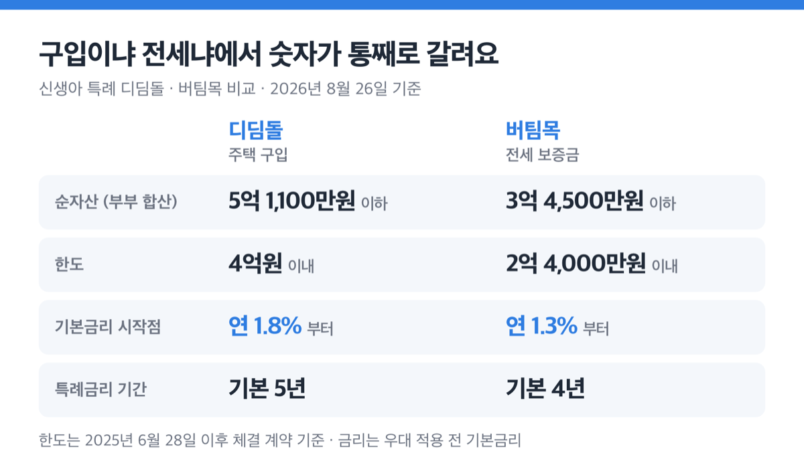
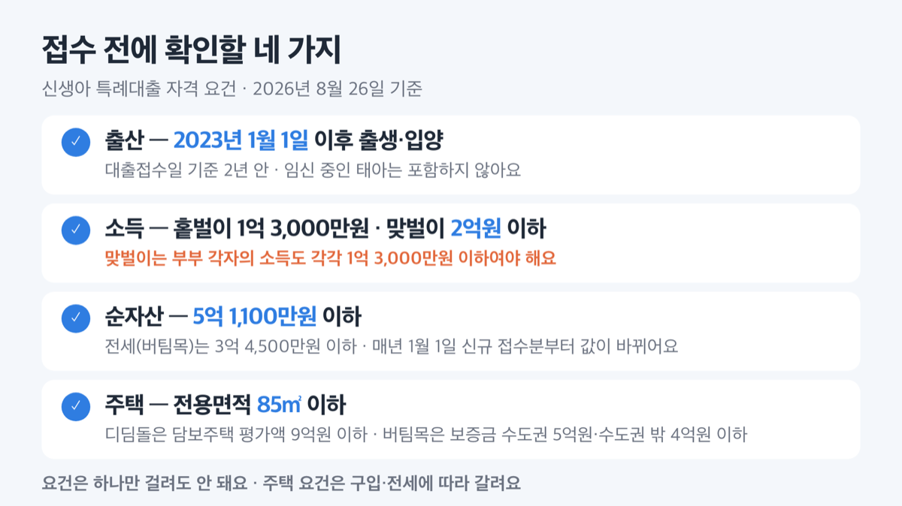
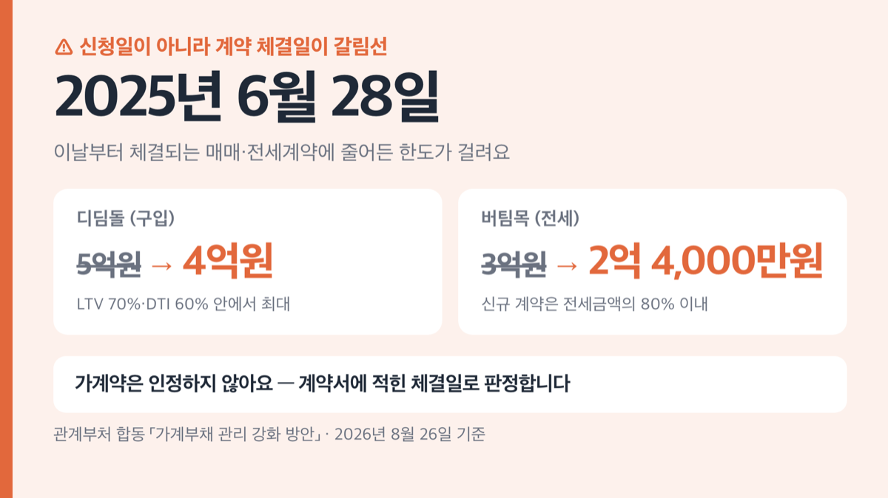
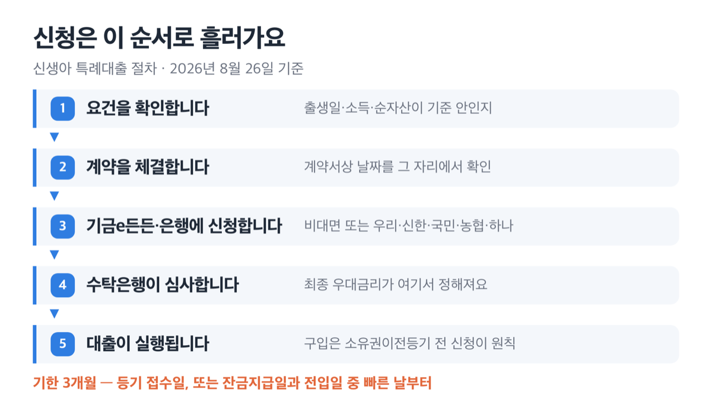

# 2026 신생아 특례대출 금리 1.8%부터, 맞벌이 2억까지 받아요

📌 2026년 8월 26일 기준

결론부터요. 2023년 1월 1일 이후 출산했고 부부 합산 소득이 2억원 이하면 대상이에요. 금리는 구입용 연 1.8%, 전세용 연 1.3%부터 시작합니다. 다만 한도는 2025년 6월에 한 번 줄었어요.

**3줄 요약**

1. 대출접수일 기준 2년 안에 아이를 낳은 가구에게, 집을 살 때는 디딤돌, 전세를 얻을 때는 버팀목으로 낮은 금리를 주는 주택도시기금 대출이에요.
2. 2024년 12월 2일 신청분부터 맞벌이 소득 한도가 2억원까지 넓어졌고, 2025년 6월 28일부터 체결된 계약은 대출 한도가 4억원(전세 2억 4,000만원)으로 줄었어요.
3. 먼저 확인할 건 셋입니다 — 출생일이 2023년 1월 1일 이후인지, 부부 합산 순자산이 5억 1,100만원(전세는 3억 4,500만원) 이하인지, 계약일이 2025년 6월 28일 앞인지 뒤인지.

아래에서 자격·금리·한도·신청 기한을 차례로 짚고, 마지막에 자주 걸리는 자리를 따로 모았어요.

## 신생아 특례대출은 구입용과 전세용, 둘로 갈려요

저도 이 제도를 정리하면서 제일 먼저 막힌 게 금리가 왜 두 줄로 나오느냐는 거였어요. 1.8%부터라는 줄과 1.3%부터라는 줄이 따로 있는데, 확인해 보니 아예 다른 상품이더라고요.

신생아 특례대출의 갈래는 주택 구입용 「신생아 특례 디딤돌대출」과 전세용 「신생아 특례 버팀목대출」 둘입니다. 운영은 국토교통부 주택도시기금이 하고, 실제 취급은 우리·신한·국민·농협·하나 다섯 은행이 해요.

두 갈래는 이름만 다른 게 아니라 요건 숫자가 통째로 달라요. 순자산 기준도, 한도도, 특례금리가 유지되는 기간도 갈려요.

왜 이렇게 갈라 놨을까요. 집을 사는 돈은 담보가 잡히는 장기 대출이고 전세보증금은 계약 기간이 정해진 단기 자금이라, 애초에 원금을 굴리는 방식이 다르기 때문이에요. ==그래서 "신생아 특례대출 금리"를 검색해 나온 숫자 하나를 그대로 내 경우에 대입하면 어긋납니다.== 내가 살 집인지 얻을 전세인지부터 갈라야 해요.

## 누가 받나 — 출산 2년 이내, 소득 2억, 순자산 5억 1,100만원

신생아 특례대출의 자격은 출산 요건, 소득 요건, 순자산 요건 셋으로 이뤄집니다. 셋을 다 넘어야 하고, 하나만 걸려도 안 돼요.

| 요건 | 디딤돌(구입) | 버팀목(전세) |
|---|---|---|
| 출산 | 대출접수일 기준 2년 내 출산·입양 (2023년 1월 1일 이후 출생아) | 왼쪽과 같음 |
| 소득 (부부 합산 연) | 홑벌이 1억 3,000만원 이하 / 맞벌이 2억원 이하 | 왼쪽과 같음 |
| 순자산 (부부 합산) | 5억 1,100만원 이하 | 3억 4,500만원 이하 |

맞벌이 2억원에는 조건이 하나 더 붙어요. ==부부 각자의 소득이 각각 1억 3,000만원 이하여야 합니다.== 한 사람이 1억 5,000만원이고 다른 한 사람이 3,000만원이면 합산 1억 8,000만원이어도 걸립니다.

혼인신고를 하지 않고 출산한 경우에도 대출이 됩니다. 이때 소득은 신생아 기준 가족관계증명서에 올라 있는 부모의 소득을 합산해서 봐요.

임신 중인 태아는 포함하지 않습니다. 이 제도가 "출산 가구 지원"이라 출생 사실이 기록으로 남은 뒤에야 요건이 성립하기 때문이에요.

순자산 기준은 매년 바뀌어요. 통계청 가계금융복지조사의 소득분위별 평균값을 그대로 가져다 쓰거든요. 5억 1,100만원과 3억 4,500만원은 2026년 1월 1일 신규 접수분부터 적용된 값이고, 직전에는 4억 8,800만원과 3억 3,700만원이었어요. 매년 12월 초에 조사 결과가 나오고 이듬해 1월 1일부터 새 값이 걸려요. 그래서 연말·연초 신청은 시기 하나로 결과가 갈릴 수 있어요.

집도 조건이 있어요. 디딤돌은 전용면적 85㎡ 이하이면서 담보주택 평가액 9억원 이하, 버팀목은 임차 전용면적 85㎡ 이하에 보증금이 수도권 5억원·수도권 밖 4억원 이하여야 합니다. 수도권 밖이면서 도시지역이 아닌 읍·면이면 100㎡까지 늘어나요.

## 금리는 1.8%부터 — 소득 구간으로 갈립니다

금리는 부부 합산 연소득과 만기에 따라 정해져요. 아래는 우대금리를 붙이기 전 기본 금리예요.

**신생아 특례 디딤돌대출 기본금리 (2026년 8월 26일 확인, 우대 적용 전, 연 %)**

| 부부 합산 연소득 | 만기 10년 | 만기 30년 |
|---|---|---|
| 2천만원 이하 | 1.80 | 2.05 |
| 2천만~4천만원 | 2.15 | 2.40 |
| 4천만~6천만원 | 2.40 | 2.65 |
| 6천만~8,500만원 | 2.65 | 2.90 |
| 8,500만~1억원 | 2.90 | 3.20 |
| 1억~1억 3,000만원 | 3.20 | 3.50 |
| 1억 3,000만~1억 5,000만원 (맞벌이) | 3.50 | 3.80 |
| 1억 5,000만~1억 7,000만원 (맞벌이) | 3.85 | 4.15 |
| 1억 7,000만~2억원 (맞벌이) | 4.20 | 4.50 |

만기 15년과 20년은 위 두 값 사이에 놓여요. 만기가 길수록 조금씩 올라가는 구조예요.

**신생아 특례 버팀목대출 기본금리 (2026년 8월 26일 확인, 우대 적용 전, 연 %)**

| 부부 합산 연소득 | 보증금 5천만원 이하 | 보증금 1억 5,000만원 초과 |
|---|---|---|
| 2천만원 이하 | 1.30 | 1.60 |
| 2천만~4천만원 | 1.60 | 1.90 |
| 4천만~6천만원 | 1.90 | 2.20 |
| 6천만~7,500만원 | 2.20 | 2.50 |
| 7,500만~1억원 | 2.55 | 2.85 |
| 1억~1억 3,000만원 | 2.90 | 3.20 |
| 1억 3,000만~1억 5,000만원 (맞벌이) | 3.25 | 3.55 |
| 1억 5,000만~1억 7,000만원 (맞벌이) | 3.60 | 3.90 |
| 1억 7,000만~2억원 (맞벌이) | 4.00 | 4.30 |

보증금이 5천만~1억원, 1억~1억 5,000만원인 경우는 위 두 열 사이 값이 적용돼요. 보증금 구간이 한 칸 올라갈 때마다 금리도 한 칸씩 올라가요.

여기에 우대금리가 붙어요. 디딤돌은 청약저축 가입 기간에 따라 0.3~0.5%p, 부동산 전자계약 0.1%p, 2년 내 추가 출산 자녀 1명당 0.2%p, 만 2세를 넘긴 미성년 자녀 1명당 0.1%p 같은 항목이 있어요. 버팀목은 전자계약 0.1%p, 추가 출산 0.2%p, 자녀 0.1%p, 신청금액이 심사 산정액의 30% 이하일 때 0.2%p입니다.

다만 ==우대금리를 아무리 쌓아도 적용 상한이 0.5%p예요.== 그리고 최종금리가 디딤돌은 연 1.2%, 버팀목은 연 1.0% 밑으로는 내려가지 않습니다. 계산상 최저 실효금리는 디딤돌 연 1.30%, 버팀목 연 1.00%예요. 다만 이 두 숫자는 포털이 직접 적어 둔 값이 아니라 기본금리에서 상한 0.5%p를 뺀 계산값이에요.

저는 이 상한이 우대 항목을 고르는 기준이 된다고 봐요. 어차피 0.5%p에서 잘리니, 청약저축 가입 기간 하나만 채워도 상한 대부분을 채울 수 있어요. 다섯 개를 다 챙기려고 서류를 늘리는 것보다 확실한 하나를 확인하는 편이 낫다고 판단해요.

그리고 지방 소재 주택은 0.2%p 인하가 따로 있습니다. 이게 우대금리 상한 0.5%p 안에 포함되는지는 원문에 명시돼 있지 않아 단정하지 않겠습니다.

## 한도는 4억원, 전세는 2억 4,000만원 — 2025년 6월 28일에 줄었어요

> [!WARNING]
> 한도 축소는 대출 신청일이 아니라 **계약 체결일** 기준입니다. 2025년 6월 28일부터 체결되는 매매·전세계약에 적용되고, 가계약은 인정하지 않습니다.

| 구분 | 2025년 6월 27일 이전 계약 | 2025년 6월 28일 이후 계약 |
|---|---|---|
| 디딤돌(구입) | 5억원 이내 | 4억원 이내 |
| 버팀목(전세) | 3억원 이내 | 2억 4,000만원 이내 |

관계부처 합동 「가계부채 관리 강화 방안」에 따라 줄어든 거예요. 정책대출도 가계부채의 일부라 총량을 조이는 흐름에 함께 들어간 거예요.

한도 숫자만 보면 안 돼요. 비율도 함께 걸려요. 디딤돌은 LTV 70%·DTI 60% 안에서 최대 4억원이고, 생애최초 구입자는 LTV 80%까지 올라가되 수도권·규제지역 주택은 그대로 70%입니다. 버팀목은 신규 계약이면 전세금액의 80% 이내예요.

그래서 한도를 꽉 채우려면 집값 자체가 일정 수준을 넘어야 해요. 전세 2억 4,000만원을 다 받으려면 보증금이 3억원은 돼야 하고, 구입 4억원을 LTV 70%로 채우려면 담보평가액이 5억 7,000만원대는 나와야 해요. 이 두 숫자는 포털에 적힌 값이 아니라 비율에서 거꾸로 계산한 추정치입니다.

## 신청은 기금e든든이나 은행 다섯 곳, 기한은 3개월

신청은 두 갈래예요. 기금e든든(https://enhuf.molit.go.kr)에서 비대면으로 넣거나, 우리·신한·국민·농협·하나 영업점에 가면 돼요.

1. 출생일이 2023년 1월 1일 이후이고 대출접수일 기준 2년 안인지 확인합니다.
2. 부부 합산 소득과 순자산이 요건 안인지 계산합니다. 소득은 근로소득자면 건강보험자격득실확인서, 사업소득자면 사업자등록증으로 현재 직장·현재 사업 기준으로 봅니다.
3. 계약을 체결하고 계약서상 날짜를 확인합니다.
4. 기금e든든에서 비대면 신청하거나 취급 은행 다섯 곳 중 한 곳을 방문합니다.
5. 수탁은행이 서류를 심사하고, 최종 우대금리는 이 심사 결과로 정해집니다.

구입은 소유권이전등기 전에 신청하는 게 원칙이에요. 이미 등기를 마쳤다면 등기 접수일로부터 3개월 안이어야 해요. 전세는 잔금지급일과 전입일 중 빠른 날로부터 3개월, 갱신이면 계약갱신일로부터 3개월입니다.

왜 3개월일까요. 이 대출은 이미 치른 돈을 나중에 메워 주는 게 아니라 그 거래에 들어가는 자금을 대는 것이라, 거래가 끝난 지 오래되면 신청할 수 없기 때문이에요. ==기한을 넘기면 요건을 다 갖춰도 그 계약으로는 다시 받을 방법이 없습니다.==

1주택자 대환은 신청 시기 제한이 없어요. 다만 대환은 부부 합산 연소득 1억 3,000만원 이하만 가능합니다. 신규 대출은 2억원까지 되는데 대환은 1억 3,000만원에서 끊긴다는 게 여기서 가장 자주 어긋나는 지점이에요.

## ⚠️ 여기서 자주 걸립니다

**첫째, 특례금리는 영원하지 않습니다.** 디딤돌은 기본 5년, 버팀목은 기본 4년이에요. 2년 안에 아이를 더 낳으면 1명당 5년(전세는 4년)씩 늘어 최장 15년(전세 12년)까지 갑니다. 저는 이게 이 상품의 가장 큰 함정이라고 봐요. 30년 만기로 빌리고 5년짜리 금리를 30년치로 계산하면 상환 계획이 통째로 어긋나거든요.

**둘째, 특례가 끝난 뒤 금리는 산식으로만 정해져 있습니다.** 소득 8,500만원 이하는 신혼부부 디딤돌 최저금리 수준으로 붙고, 그 위는 한국은행과 은행연합회 고시 금리 중 작은 값을 따라갑니다. 그때의 시장금리에 달렸다는 뜻이라, 5년 뒤 금리를 지금 숫자로 못 박아 둘 수는 없어요.

**셋째, 맞벌이 2억원에는 각자 1억 3,000만원 조건이 붙습니다.** 합산만 보고 신청했다가 개인 소득에서 걸리는 경우가 여기입니다.

**넷째, 순자산은 소득과 별개로 걸립니다.** 소득이 낮아도 자산이 5억 1,100만원(전세 3억 4,500만원)을 넘으면 안 돼요. 전세 쪽 기준이 3억 4,500만원이라 생각보다 빡빡해요.

**다섯째, 입양으로 받으면 1년은 유지해야 합니다.** 구입 대출을 입양 자녀 기준으로 받았다면 대출받은 날부터 1년 이상 입양 상태를 유지해야 하고, 파양하면 기한의 이익을 잃습니다. 쉽게 말하면 만기까지 나눠 갚을 권리가 없어진다는 뜻이에요.

맞벌이 소득 요건을 2억 5,000만원으로 올린다는 이야기가 돌지만, 지금 포털에 걸린 기준은 2억원입니다.

## 신생아 특례대출 관련 궁금증 해결

**Q. 혼인신고를 아직 안 했는데 신청할 수 있나요?**
A. 됩니다. 혼인신고 없이 출산하거나 입양한 경우에도 대출이 가능해요. 다만 소득은 신생아 기준 가족관계증명서에 등재된 부모의 소득을 합산해서 심사합니다.

**Q. 지금 임신 중인데 미리 신청해 둘 수 있나요?**
A. 안 됩니다. 임신 중인 태아는 포함하지 않아요. 출생 이후, 대출접수일 기준 2년 안에 신청해야 합니다.

**Q. 집을 사고 등기까지 마쳤는데 늦었을까요?**
A. 등기 접수일로부터 3개월 안이면 아직 됩니다. 이미 다른 주택담보대출이 있는 1주택자라면 대환 쪽을 보시면 되는데, 대환은 부부 합산 소득 1억 3,000만원 이하만 가능해요.

**Q. 둘째를 낳으면 뭐가 달라지나요?**
A. 두 가지가 같이 움직여요. 대출접수일 기준 2년 안의 추가 출산이면 특례금리 적용 기간이 자녀 1명당 5년(전세 4년) 늘고, 우대금리도 1명당 0.2%p 붙어요.

**Q. 표에 있는 금리가 제가 받을 금리인가요?**
A. 아니에요. 표는 우대금리를 붙이기 전 기본 금리이고, 최종 우대금리는 수탁은행이 서류를 심사해 정해요. 지방 소재 주택이면 0.2%p 인하가 따로 있고요.

---

정리하면 이 대출의 승부처는 금리표가 아니라 날짜 세 개입니다. 아이가 태어난 날, 계약서에 도장 찍은 날, 잔금이나 등기를 넘긴 날. 이 셋이 요건 안에 들어와 있으면 나머지는 서류 문제고, 하나라도 벗어나면 금리가 아무리 좋아도 못 받습니다.

금리와 요건은 바뀝니다. 위 숫자는 2026년 8월 26일에 확인한 값이니, 신청 직전에 기금e든든이나 취급 은행에서 다시 확인하세요. 이 글은 정보 제공이고 개별 승인 여부나 최종 금리를 보장하지 않습니다. 내 조건에 실제로 얼마가 나오는지는 취급 은행 다섯 곳이나 주택도시기금 상담 창구에서 확인하시는 게 정확합니다.

참고: 주택도시기금 「신생아 특례 디딤돌대출」·「신생아 특례 버팀목대출」 안내 · 주택도시기금 공지사항 「가계부채 관리 강화 방안에 따른 공지사항」·「기금 순자산기준 변경 안내」 · 국토교통부 보도자료(2024-11-28) · 마이홈포털 신생아 특례 디딤돌대출 안내
