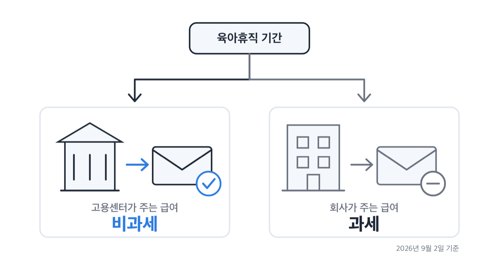
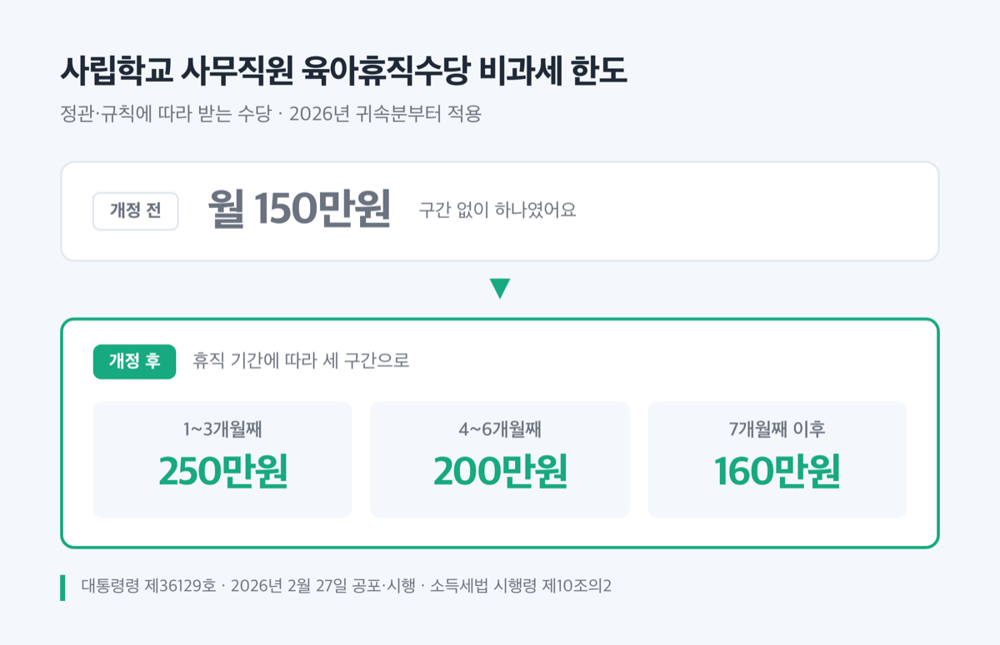
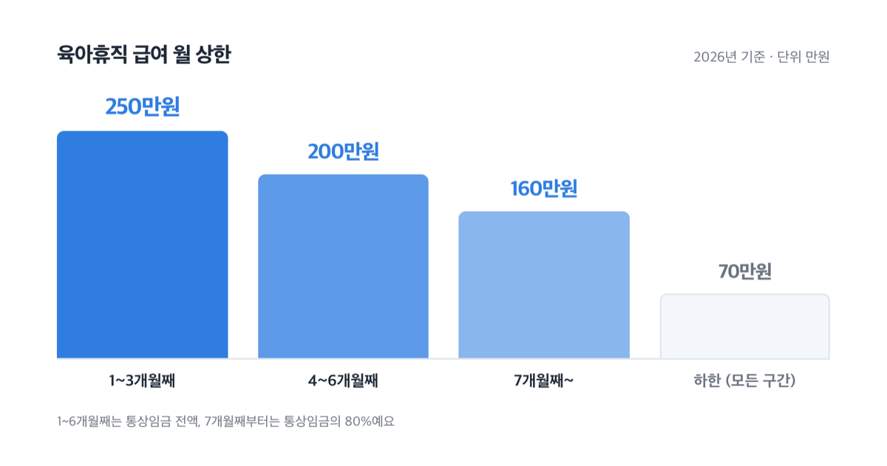

# 육아휴직급여 비과세, 2026년 월 250만원 세금 0원

📌 2026년 9월 2일 기준

육아휴직급여도 일정 금액까지만 세금을 안 뗀다는 말이 돌아요. 고용보험에서 받는 육아휴직급여에는 그 한도가 없어요. 월 250만원을 받든 160만원을 받든 전액 비과세입니다.

**3줄 요약**

1. 고용보험에서 받는 육아휴직급여는 소득세법 제12조 제3호 마목에 따라 ==한도 없이 전액 비과세==예요. 육아기 근로시간 단축 급여와 출산전후휴가 급여도 같은 칸에 들어 있어요.
2. 이 조문은 2026년 1월 1일 시행이고, 사립학교 사무직원 등이 정관·규칙에 따라 받는 육아휴직수당의 비과세 한도는 월 150만원 단일 금액에서 250·200·160만원 구간제로 바뀌었어요.
3. 먼저 확인할 것은 그 돈을 누가 줬느냐입니다. 고용센터가 주면 비과세, 회사가 근로기준법에 따라 주는 출산전후휴가 급여는 과세예요.

근거 조문이 무엇인지, 한도가 붙는 경우는 따로 있는지, 사후지급금과 연말정산은 어떻게 처리하는지 순서대로 적어요.

## 육아휴직급여에 세금이 안 붙는 근거

육아휴직급여가 비과세되는 근거는 소득세법 제12조 제3호 마목에 나와 있어요. 「고용보험법」에 따라 받는 급여여야 하고, 시행일은 2026년 1월 1일입니다.

> **소득세법 제12조(비과세소득) 제3호 마목**
> 「고용보험법」에 따라 받는 실업급여, 육아휴직 급여, 육아기 근로시간 단축 급여, 출산전후휴가 급여등, … 「국가공무원법」·「지방공무원법」에 따른 공무원 또는 「사립학교교직원 연금법」·「별정우체국법」을 적용받는 사람이 관련 법령에 따라 받는 육아휴직수당

왜 세금이 안 붙느냐면, 이 돈이 회사가 주는 임금이 아니기 때문이에요. 고용보험 기금에서 나와 고용노동부장관이 지급하는 급여라서 실업급여와 같은 칸에 묶여 있어요. 그래서 ==누가 줬느냐==가 과세와 비과세를 나누는 첫 번째 기준이 됩니다.

효과는 한 칸 더 갑니다. 소득세법 제20조 제2항에 따라 총급여액을 계산할 때 비과세소득을 빼게 돼요. 세금을 안 뗄 뿐 아니라 연말정산에서 소득으로도 잡히지 않는다는 뜻이에요.

법률 제21221호 부칙 제3조는 이 개정 조문을 시행 이후 지급받는 소득분부터 적용하도록 했습니다. 휴직을 언제 시작했는지가 아니라 돈을 언제 받았는지가 기준이에요.

## 💰 비과세 한도, 두 경우로 나뉘어요

> 😕 저는 상한인 250만원을 다 받는데도요?

네, 그대로 비과세예요. 소득세법 제12조 제3호 마목은 고용보험법에 따라 받는 급여에 금액 한도를 두지 않았어요. 조문에 한도 문구 자체가 없습니다.

한도가 붙는 경우는 따로 있어요. 사립학교법 제70조의2에 따라 임명된 사무직원, 사학연금법 제60조의4에 따라 교직원으로 보는 사람이 소속기관의 정관이나 규칙에 따라 받는 육아휴직수당이에요. 이쪽은 고용보험이 아니라 소속기관이 주는 돈이라 법이 상한을 정해 뒀어요.

**받는 돈에 따른 비과세 한도 (2026년 귀속 기준)**

| 무엇을 받나 | 비과세 한도 | 근거 |
|---|---|---|
| 고용보험 육아휴직급여 | 한도 없이 전액 | 소득세법 §12 3호 마목 |
| 육아기 근로시간 단축 급여·출산전후휴가 급여등 | 한도 없이 전액 | 같은 마목 |
| 공무원·사립학교교직원 육아휴직수당 | 관련 법령에 따라 받는 금액 전액 | 같은 마목 |
| 사립학교 사무직원 등이 정관·규칙에 따라 받는 육아휴직수당 | 1~3개월째 월 250만원, 4~6개월째 월 200만원, 7개월째 이후 월 160만원 | 소득세법 시행령 §10의2 |

맨 아랫줄 숫자는 대통령령 제36129호(2026년 2월 27일 공포·시행)로 바뀐 값이에요. 부칙 제2조가 시행일이 속하는 과세기간, 그러니까 2026년 귀속분부터 적용하도록 했어요. 그전에는 구간 없이 월 150만원 하나였습니다.

### 그래서 2026년에 얼마를 받나

세금이 붙지 않는다는 것과 별개로 원금이 얼마인지도 확인해야 해요. 고용보험법 시행령 제95조 제1항이 정한 금액입니다.

**2026년 육아휴직 급여 (일반, 월 기준)**

| 휴직 기간 (몇 개월째) | 월 지급액 (육아휴직 시작일 기준 통상임금) | 월 상한·하한 (2026년, 원) |
|---|---|---|
| 1~3개월째 | 월 통상임금 전액 | 상한 250만원 / 하한 70만원 |
| 4~6개월째 | 월 통상임금 전액 | 상한 200만원 / 하한 70만원 |
| 7개월째~종료일 | 월 통상임금의 80% | 상한 160만원 / 하한 70만원 |

한 달을 꽉 채우지 못한 달은 그 달에 휴직한 일수에 비례해서 계산해요. 15일만 쉬었다면 그 달 지급액도 절반이 됩니다. 그래서 휴직 시작일을 월 중간에 잡으면 첫 달과 마지막 달이 둘 다 쪼개져요.

부모가 둘 다 쓰면 상한이 달라져요. 자녀 출생 후 18개월 이내에 부모 모두 육아휴직을 쓰면 6개월까지 상한이 올라가요.

| 사용 개월 수 | 부모 모두 사용 특례 상한 (월) |
|---|---|
| 1~2번째 달 | 250만원 |
| 3번째 달 | 300만원 |
| 4번째 달 | 350만원 |
| 5번째 달 | 400만원 |
| 6번째 달 | 450만원 |

7개월째부터는 통상임금의 80%, 상한 160만원으로 돌아가고 하한은 모두 70만원이에요. 한부모는 1~3개월째 상한이 300만원, 4~6개월째 200만원, 7개월째부터 80%·상한 160만원입니다.

이 금액이 전부 비과세예요. 부모 모두 사용 특례로 6번째 달에 450만원을 받아도 원천징수되는 세금은 없습니다.

## 사후지급금, 나중에 몰아 받으면

사후지급금은 2025년 1월 1일부터 없어졌어요. 고용보험법 시행령 제95조 제4항이 2024년 12월 24일 자로 삭제됐습니다(대통령령 제35100호).

없어지기 전 규칙은 이랬어요. 육아휴직 급여의 75%만 매월 주고, 나머지 25%는 휴직이 끝난 뒤 같은 사업장에 복직해 6개월 이상 계속 근무해야 일시불로 줬어요. 복직을 유도하려고 돈의 일부를 뒤로 미뤄 둔 구조였습니다.

지금은 육아휴직 중에 전액을 받아요.

> [!WARNING]
> 다만 2025년 1월 1일 전에 육아휴직을 시작한 사람의 「2025년 1월 1일 전 육아휴직 기간」에 대한 급여는 종전 규정을 따릅니다. 그 기간분에는 사후지급금이 그대로 남아 있어요.

과세 여부는 조문 두 개를 이어 보면 답이 나와요. 사후지급금은 구 시행령 제95조 제4항에 따른 육아휴직 급여의 일부이고, 소득세법 마목은 「고용보험법」에 따라 받는 육아휴직 급여를 지급 시기나 금액 조건 없이 비과세로 정하고 있어요. 나중에 몰아 받았다는 사실만으로 비과세가 깨지는 구조가 아닙니다.

한도 있는 육아휴직수당을 두고 국세청이 내놓은 해석도 같은 방향이에요. 복직 후 잔여분을 일시에 받는 경우 지급한 시점이 아니라 ==귀속되는 달==을 기준으로 한도를 본다고 했습니다. 개별 사안의 최종 판정은 국세청 국세상담센터나 관할 세무서에서 확인하세요.

## 연말정산 때 뭘 해야 하나

육아휴직급여를 받은 해의 연말정산은 순서대로 따라가면 끝나요.

1. 원천징수영수증에 육아휴직급여가 적혀 있는지 봅니다. 안 적혀 있는 게 정상이에요. 비과세 코드 E01(「고용보험법」 등에 따라 받는 육아휴직급여 등)은 지급명세서 작성 대상이 아닙니다. 공무원·사립학교 육아휴직수당은 코드 E02이고 역시 작성 대상이 아니에요.
2. 그해 회사에서 받은 급여가 있으면 그 급여만으로 연말정산을 합니다. 육아휴직급여는 총급여액에 들어가지 않아요.
3. 육아휴직 기간에 쓴 신용카드 사용액을 공제 자료에 넣습니다. 휴직기간이 근로기간에 들어가서 공제받을 수 있어요. 입사 전이나 퇴사 후에 쓴 금액은 안 되는 것과 다른 대목이에요.
4. 건강보험료는 급여에서 원천공제한 날이 속하는 과세기간에 공제합니다. 정산보험료는 정산한 연도에 넣어요.
5. 배우자가 그해 육아휴직급여만 받았다면 배우자 기본공제를 따져 봅니다. 연간 소득금액 100만원 판단에서 비과세·분리과세 소득은 빼고 계산해요.

5번이 은근히 큰돈입니다. 배우자가 1년 내내 휴직해서 고용센터 급여만 받았다면 그 급여는 소득금액 계산에 들어가지 않아요.

저라면 연말정산 서류를 넣기 전에 원천징수영수증부터 열어 봅니다. 육아휴직급여가 총급여에 섞여 들어가 있으면 그 자체가 잘못 처리된 것이라 회사에 바로 말해야 하거든요.

## 여기서 자주 걸려요

같은 출산·육아 관련 돈인데 세금이 붙는 것이 섞여 있어요. 네 가지를 짚어 둡니다.

1. **회사가 근로기준법에 따라 주는 출산전후휴가 급여는 과세 대상 근로소득입니다.** 고용보험에서 나오는 출산전후휴가 급여등과 이름이 비슷해서 헷갈리기 쉬워요. 다만 사업주가 먼저 주고 대위신청한 금액은 비과세입니다.
2. **보육수당은 2026년 1월 1일 이후 지급분부터 자녀 1명당 월 20만원이에요.** 2025년 귀속까지는 자녀 수와 상관없이 근로자 1명당 월 20만원이었어요. 6세 이하인지는 해당 과세기간 개시일을 기준으로 봅니다.
3. **출산지원금은 자녀 출생일 이후 2년 이내에 최대 두 차례까지 전액 비과세입니다.** 2021년 1월 1일 이후 출생 자녀에 대해 2024년 한 해 동안 받은 금액도 포함돼요. 사용자와 특수관계에 있는 사람은 제외됩니다.
4. **배우자 출산휴가 급여는 2020년 귀속 소득분부터 비과세예요.** 2026년 배우자 출산휴가 급여(20일)는 1,684,210원입니다.

> **솔직히 말하면** — 공개된 안내 화면 가운데 아직 옛 숫자가 남아 있는 곳이 있어요. 보육수당을 월 10만원이라고 적어 둔 화면, 사립학교 사무직원 육아휴직수당 한도를 월 150만원이라고 적어 둔 자료가 그렇습니다. 숫자가 서로 다르면 저는 국가법령정보센터의 법령 원문 쪽을 봅니다.

## 육아휴직급여 비과세 관련 궁금증 해결

**Q. 육아휴직급여도 연말정산을 따로 해야 하나요?**
A. 육아휴직급여만 놓고 따로 할 것은 없어요. 비과세 코드 E01은 지급명세서에 적지 않아서 신고 대상 소득이 아닙니다. 그해에 회사 급여를 받은 기간이 있으면 그 급여로 연말정산을 하면 돼요.

**Q. 육아휴직 중에 쓴 신용카드도 소득공제가 되나요?**
A. 됩니다. 휴직기간은 근로기간에 포함되기 때문이에요. 입사 전이나 퇴사 후에 쓴 금액은 공제되지 않지만, 휴직 중 사용분은 공제 대상입니다.

**Q. 배우자가 올해 육아휴직급여만 받았어요. 배우자공제를 받을 수 있나요?**
A. 연간 소득금액 100만원 기준은 종합소득금액·퇴직소득금액·양도소득금액을 더해서 보고, 비과세와 분리과세 소득은 빼고 판단해요. 육아휴직급여는 비과세소득이라 이 계산에 들어가지 않습니다. 다른 소득이 있다면 그 소득까지 합쳐 따져 보세요.

**Q. 2024년에 시작한 육아휴직의 사후지급금을 최근에 받았습니다. 세금이 붙나요?**
A. 사후지급금은 고용보험법 시행령에 따른 육아휴직 급여의 일부이고, 소득세법 마목은 지급 시기를 따지지 않고 비과세로 정하고 있어요. 받은 금액이 원천징수영수증에 근로소득으로 잡혀 있다면 지급 기관과 회사에 확인하세요.

**Q. 육아휴직급여는 언제까지 신청해야 하나요?**
A. 육아휴직 시작일 이후 1개월부터 육아휴직이 끝난 날 이후 12개월 이내에 신청해야 합니다. 육아휴직을 30일 이상(고용보험법 제19조 제6항에 따른 육아휴직은 7일 이상) 부여받고, 휴직 시작 전 피보험 단위기간이 합산 180일 이상이어야 해요. 신청은 관할 고용센터에서 받습니다.

## 정리하면

고용보험에서 받는 육아휴직급여에는 비과세 한도가 없습니다. 월 250만원이든 부모 특례로 받는 450만원이든 전액 그대로예요. 한도를 따져야 하는 쪽은 소속기관이 정관·규칙에 따라 주는 육아휴직수당이고, 그 금액은 2026년 귀속분부터 250·200·160만원 구간제로 바뀌었어요.

제가 보기에 가장 많이 틀리는 것은 세 번째 줄입니다. 같은 출산·육아 관련 돈인데 고용센터가 주면 비과세, 회사가 근로기준법에 따라 주면 과세예요. 원천징수영수증을 열어 그 금액이 어느 쪽으로 들어가 있는지부터 확인해 보세요.

개인별 소득 상황에 따라 결론이 달라지는 부분은 국세청 국세상담센터나 세무 전문가에게 확인하시는 편이 안전합니다.

참고: 국가법령정보센터 「소득세법」 제12조·제20조 · 「소득세법 시행령」 제10조의2 · 「고용보험법」 제70조 · 「고용보험법 시행령」 제95조·제95조의3 · 국세청 「2025년 원천징수의무자를 위한 연말정산 신고안내」 · 국세청 국세상담센터 연말정산 Q&A · 고용노동부 「2025년 1월 1일부터 달라지는 육아지원제도」 · 고용노동부고시 제2025-124호
