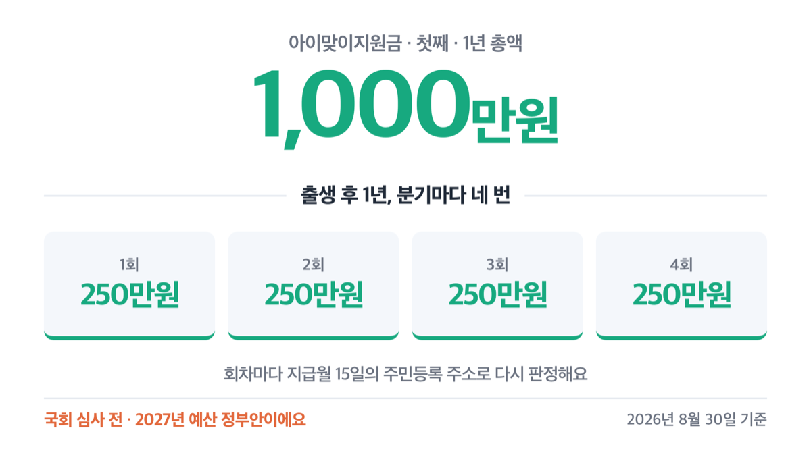
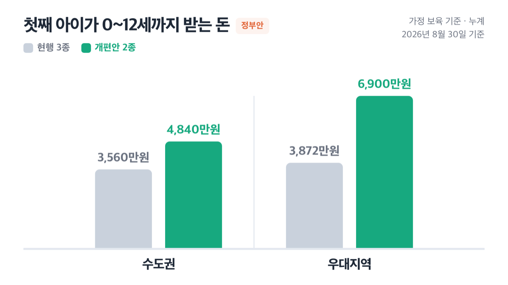
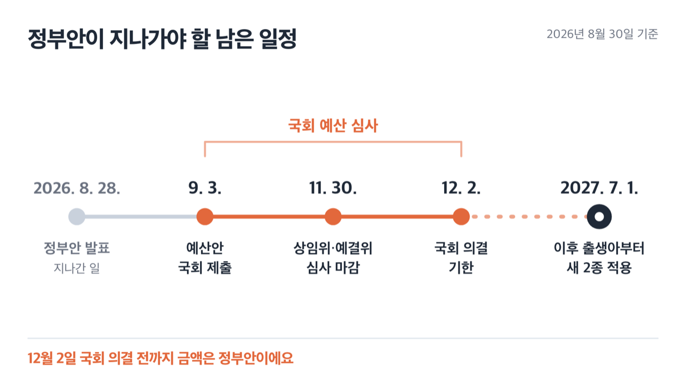

# 아이맞이지원금 첫째 1000만원, 2027년 7월생부터 갈려요

📌 2026년 8월 30일 기준

2027년 6월 30일과 7월 1일, 딱 하루 차이예요. 이 하루를 두고 아이가 평생 받는 지원이 통째로 갈립니다. 갈리는 기준은 소득도 재산도 아니고 ==출생일 하나뿐==이에요.

**3줄 요약**

1. 아이맞이지원금은 첫만남이용권을 대신하는 출생아 현금 지원이고, 아동기본수당은 아동수당과 부모급여를 대신하는 매월 수당이에요.
2. 2027년 7월 1일 이후 출생아부터 새 2종으로 바뀌고, 6월 30일까지 출생아는 기존 3종을 끝까지 받습니다.
3. 먼저 확인할 것은 출산 예정일과 등본상 출생순위, 그리고 지급월 15일의 주민등록 주소예요.

> [!WARNING]
> 아래 금액과 지급 방식은 2026년 8월 28일 정부가 발표한 **2027년 예산 「정부안」**입니다.
> 국회 예산 심사와 「아동수당법」 개정을 둘 다 거쳐야 확정돼요. 숫자는 심사 과정에서 바뀔 수 있습니다.

얼마를 언제 어떻게 받는지, 우대지역이라는 말이 무슨 뜻인지, 지금 뭘 확인해 둬야 하는지 순서대로 적었어요.

## 2027년 7월 1일, 여기서 갈립니다

개편의 구조는 단순해요. 지금 있는 첫만남이용권·부모급여·아동수당 셋을 아이맞이지원금과 아동기본수당 둘로 묶는 겁니다. 정부는 이걸 "개편"이라고 적었고, 기획예산처 안건은 "통합"이라고 적었어요.

기존 제도가 없어지느냐는 질문의 답은 "이미 태어난 아이에게는 남는다"입니다.

| 출생일 | 받는 제도 |
|---|---|
| **2027년 6월 30일까지** | 첫만남이용권 + 부모급여 + 아동수당 (기존 3종 그대로) |
| **2027년 7월 1일부터** | 아이맞이지원금 + 아동기본수당 (새 2종) |

2027년 6월 30일까지 태어난 아이는 경과조치대로 끝까지 받아요. 첫만남이용권은 출생 후 2년 안에 쓰면 되고, 부모급여는 만 2세 미만(1세 마지막 달)까지, 아동수당은 만 13세 미만(12세 마지막 달)까지 나옵니다. 새 제도로 갈아타는 절차는 따로 없어요.

정부가 밝힌 개편 이유는 둘이에요. 급여 종류가 많은 데다 현금과 바우처로 지급 방식이 갈려서 체감이 낮았고, 아이가 클수록 양육비는 느는데 지원은 오히려 줄어든다는 지적이 있었습니다.

그럼 새로 생기는 두 제도가 각각 얼마인지 봅니다.

## 💰 아이맞이지원금, 첫째 1000만원을 네 번에 나눠서

아이맞이지원금은 첫만남이용권을 대체하는 출생아 대상 현금 지원금입니다. 첫만남이용권이 카드에 얹어 주는 바우처였다면, 이건 사용처도 사용기한도 제한이 없는 현금이에요.

기본 지급액은 출생순위로 갈리고, 우대지역이면 순위와 무관하게 500만원이 정액으로 붙습니다.

| 출생순위 | 기본 지급액 (1년 총액) | 우대지역 지급액 (1년 총액) |
|---|---|---|
| 첫째 | 1,000만원 | 1,500만원 |
| 둘째 | 1,200만원 | 1,700만원 |
| 셋째 이상 | 1,500만원 | 2,000만원 |

한 번에 들어오지는 않아요. **출생 후 1년 동안 분기별로 네 번 나눠 지급합니다.**

| 출생순위 | 기본 1회분 | 우대지역 1회분 |
|---|---|---|
| 첫째 | 250만원 | 375만원 |
| 둘째 | 300만원 | 425만원 |
| 셋째 이상 | 375만원 | 500만원 |

지급 시점은 출생월을 기준으로 돌아갑니다. 2027년 7월에 태어나면 27년 7월·10월, 28년 1월·4월 이렇게 네 번이에요. 8월생이면 27년 8월·11월, 28년 2월·5월입니다.

네 번으로 쪼갠 것이 그냥 편의는 아니에요. **거주지를 회차마다 다시 봅니다.** 판정 기준은 분기별 지급월 15일의 주민등록 주소예요.

그래서 중간에 이사하면 받는 총액이 달라집니다. 정부가 든 예시를 그대로 옮기면, 2027년 7월에 수도권에서 태어나 12월 31일에 우대지역으로 전입한 경우 7월·10월은 250만원씩, 28년 1월·4월은 375만원씩 받아 총 1,250만원이 됩니다.

출생순위는 주민등록등본과 부모의 가족관계증명서상 순위로 봐요. 이혼이나 재혼이 얽히면 기본증명서·법원 판결문 등으로 판정하는데, 여기가 갈리는 지점입니다. 양육권이 있는 보호자가 재혼관계에서 아이를 낳으면 둘째로, 양육권이 없는 보호자 쪽이면 첫째로 봅니다.

## 아동기본수당, 매달 20만원인데 절반은 지역사랑상품권

아동기본수당은 아동수당과 부모급여를 대체하는 매월 수당이에요. 기본은 월 20만원인데, 여기에 조건이 둘 붙습니다.

첫째, 20만원 전액이 현금은 아니에요. **현금 10만원 + 지역사랑상품권 10만원**입니다. 우대지역이면 월 30만원(현금 15만원 + 상품권 15만원)이고요.

둘째, 0~1세 아동이 어린이집을 이용하지 않으면 가정 보육 가산금 30만원이 매월 더 붙어요.

| 구분 (월 지급액) | 기본 | 우대지역 |
|---|---|---|
| 0~1세, 어린이집 미이용 | 50만원 | 60만원 |
| 0~1세, 어린이집 이용 | 20만원 | 30만원 |
| 2세 이상 | 20만원 | 30만원 |

거주지는 매월 15일 주소로 봅니다. 2027년 7월에 수도권에서 태어난 아이가 9월 20일에 우대지역으로 전입하면 7~9월은 수도권 기준, 10월분부터 우대지역 기준이에요. 전입일이 15일을 넘겼기 때문입니다.

> 😕 그래서 결국 지금보다 나아지는 건 맞나요?

정부가 내놓은 0~12세 누계 비교표가 답인데, 조건이 붙어 있어요. 아래 값은 전부 **가정 보육을 하는 경우** 기준입니다.

| 구분 (0~12세 누계, 가정 보육 기준) | 현행 | 개편안 |
|---|---|---|
| 첫째 · 수도권 | 3,560만원 | 4,840만원 |
| 첫째 · 우대지역 | 3,872만원 | 6,900만원 |
| 둘째 · 수도권 | 3,660만원 | 5,040만원 |
| 둘째 · 우대지역 | 3,972만원 | 7,100만원 |
| 셋째 이상 · 수도권 | 3,660만원 | 5,340만원 |
| 셋째 이상 · 우대지역 | 3,972만원 | 7,400만원 |

정부는 우대지역에서 가정 보육하는 첫째의 경우 현행보다 3,028만원을 더 받게 된다고 밝혔어요. 6,900에서 3,872를 뺀 값입니다.

물론 늘어나는 건 맞아요. 그런데 저는 이 3,028만원을 그대로 받아들이지 않습니다. 근거는 아래 조문이에요.

> **아동수당법 제4조제7항** — 인구감소지역에서 아동수당을 지역사랑상품권으로 지급하는 경우 월 1만원 상당을 추가로 지급한다. (2026년 3월 20일 신설)

정부 비교표의 '현행' 값은 인구감소 특별지역을 월 12만원으로 잡고 계산했는데, 위 조항대로 상품권으로 받으면 월 13만원이 됩니다. 현행 쪽 누계가 그만큼 올라가면 차이는 3,028만원보다 줄어들어요. 그래도 개편안 쪽이 크게 앞선다는 결론은 바뀌지 않습니다.

## 500만원이 붙는 우대지역, 목록은 아직 없습니다

여기가 이 개편에서 가장 큰 변수예요. 아이맞이지원금 +500만원, 아동기본수당 월 +10만원이 전부 우대지역이냐 아니냐에 달려 있는데, ==어느 지역이 우대지역인지는 아직 정해지지 않았습니다.==

복지부가 밝힌 것은 두 가지뿐이에요. 행정안전부의 「지방우대지수」를 고려해 구분한다는 것, 그리고 인구감소지역 등이 포함된다는 것입니다. 원문은 "우대지역 적용 지역은 조정 중"이라고 적었어요.

지방우대지수는 행안부가 "서울에서 먼 지역일수록 더 두텁게 지원하기 위한 기준"으로 마련해 각종 정부 정책에 적용하겠다고 밝힌 지수입니다.

참고로 이미 시행 중인 인구감소지역은 89개 시군구예요. 「지방자치분권 및 지역균형발전에 관한 특별법」에 따라 5년 단위로 지정하고, 연평균인구증감률·인구밀도·청년순이동률 등 8개 지표로 산정합니다.

> [!WARNING]
> **이 89곳이 곧 우대지역은 아닙니다.** 복지부 원문은 "인구감소지역 **등이 포함**된다"고만 적었어요.
> 우대지역 목록은 예산안이 확정되는 과정에서 별도로 발표됩니다. 그 전까지 특정 지역의 지급액을 단정할 수 없어요.

이사를 고민 중이라면 목록이 나온 뒤에 판단하세요. 회차마다 15일 주소로 다시 보니, 늦게 옮겨도 그다음 회차부터는 우대지역 금액이 적용됩니다.

## 지금 확인해 둘 것 다섯

신청 창구와 방법은 아직 안내되지 않았어요. 복지부가 시행에 앞서 「아동수당법」 개정과 관련 시스템 정비를 추진하겠다고 밝힌 단계입니다. 그래도 지금 미리 해 둘 수 있는 것이 있어요.

1. **출산 예정일이 2027년 6월 말인지 7월 초인지 확인한다** — 하루 차이로 받는 제도가 통째로 갈립니다.
2. **주민등록등본과 가족관계증명서를 떼어 출생순위를 확인한다** *(재혼·입양이 얽혀 있으면 여기서 순위가 달라져요)*
3. **분기 지급월 15일의 주민등록 주소를 계산해 둔다** — 이사 예정이면 전입일이 15일 전인지 후인지가 갈립니다.
4. **출생신고와 계좌 정보를 서둘러 정리한다** — 늦더라도 주민등록번호와 계좌가 확인되면 출생월분부터 소급 지급합니다.
5. **국회 예산 심사 결과를 지켜본다** — 확정 전까지 금액은 정부안입니다.

정부는 회계연도 개시 120일 전까지 예산안을 국회에 내야 하고(「국가재정법」 제33조), 국회는 회계연도 개시 30일 전까지 의결해야 합니다(「대한민국헌법」 제54조제2항). 2027 회계연도로 계산하면 제출은 2026년 9월 3일, 의결은 2026년 12월 2일이에요.

상임위와 예산결산특별위원회는 매년 11월 30일까지 심사를 마쳐야 하고, 못 마치면 그다음 날 본회의에 자동으로 올라갑니다(「국회법」 제85조의3). 예산안에 대한 무제한토론은 12월 1일 밤 12시에 종료돼요.

## 아이맞이지원금 관련 궁금증 해결

**Q. 2027년 6월에 태어나면 손해인가요?**

A. 기존 3종을 경과조치대로 끝까지 받습니다. 첫만남이용권은 첫째 200만원·둘째 이후 300만원을 출생 후 2년 안에 쓰고, 부모급여는 1세 미만 월 100만원·1세 이상 2세 미만 월 50만원, 아동수당은 월 10만원(비수도권 10만 5천원, 인구감소지역 11만원, 복지부 장관이 고시한 인구감소지역 12만원)이 나와요.

**Q. 이사하면 받는 돈이 달라지나요?**

A. 달라집니다. 아이맞이지원금은 분기 지급월 15일, 아동기본수당은 매월 15일의 주민등록 주소로 회차마다 다시 판정해요.

**Q. 지금 아동수당을 받는데 정말 13세까지 나오나요?**

A. 법에는 13세 미만으로 적혀 있지만 부칙이 나이를 해마다 한 살씩 올립니다. 2026년 9세, 2027년 10세, 2028년 11세, 2029년 12세이고 2030년부터 13세 미만이 적용돼요. 2017년생은 2026~2029년에 나이 도래와 관계없이 해당 연도 1월분부터 12월분까지 매월 받습니다.

**Q. 쌍둥이는 출생순위를 어떻게 보나요?**

A. 다둥이도 주민등록등본과 가족관계증명서상 출생순위로 판정합니다. 우리 아이가 몇째로 잡히는지는 두 서류를 미리 떼어 확인하고, 애매하면 관할 주민센터에 확인하세요.

**Q. 출산·혼인 세액공제가 없어진다던데 맞나요?**

A. 지원 방식이 바뀌는 겁니다. 정부는 출산·입양세액공제(첫째 30만원·둘째 50만원·셋째 이상 70만원)와 혼인세액공제(부부 각 50만원, 생애 1회)를 조세지출에서 재정지원으로 전환한다고 밝혔어요. 세액공제는 면세자가 아예 못 받는다는 이유예요. 대신 혼인신고를 마친 부부에게 소득 제한 없이 생애 1회 100만원을 주는 혼인지원금이 정부안에 들어갔습니다.

## 그래서 지금 무엇을 봐야 하나

이 개편에서 확정된 것은 방향이고, 숫자는 아직 국회 앞에 있어요. 그래서 저라면 6월 말 출산 예정이라고 날짜를 미루는 선택은 하지 않겠습니다. 정부안이 그대로 통과한다는 보장이 없고, 6월 30일까지 태어난 아이도 기존 3종을 끝까지 받으니까요.

지금 할 일은 딱 둘이에요. 등본으로 출생순위를 확인해 두는 것, 그리고 12월 초 국회 의결 결과를 한 번 확인하는 것입니다.

우대지역 목록은 그 뒤에 나옵니다. 지역별 금액을 미리 계산하기보다 목록 발표를 기다리는 편이 낫습니다.

개별 가구의 지급액과 순위 판정은 가족관계에 따라 달라져요. 우리 집에 어떻게 적용되는지는 관할 주민센터나 보건복지상담센터(129)에서 확인하세요. 이 글은 정보 제공용이고 개별 판정을 대신하지 않습니다.

참고: 보건복지부 「2027년 핵심 청년 예산 발표」 보도참고자료(2026-08-28) · 기획예산처 「청년 성장단계별 종합투자 추진전략」(2026-08-28) · 기획예산처 「출산·혼인세액공제 재정지원 전환」 보도참고자료(2026-08-07) · 「아동수당법」 및 같은 법 시행령 · 「저출산·고령사회기본법 시행령」 · 행정안전부 「인구감소지역 지정」
