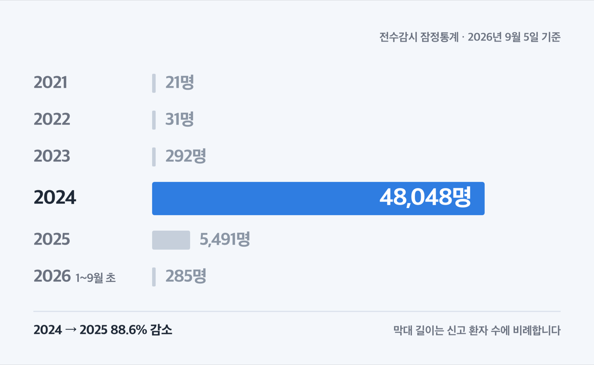
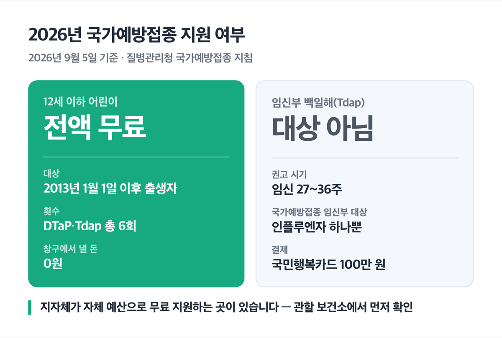
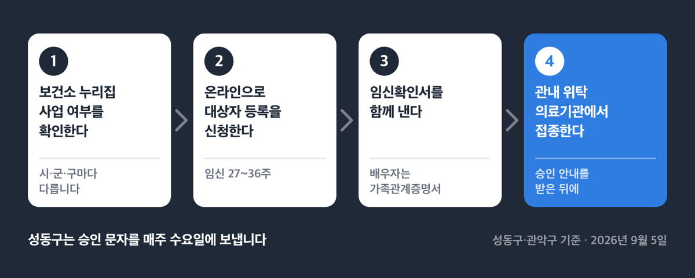
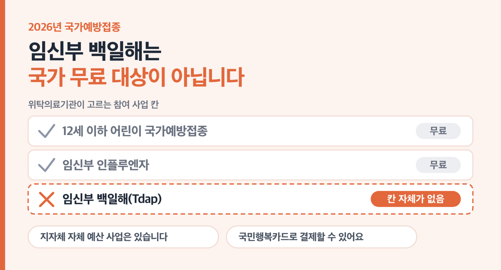

# 백일해 예방접종 어린이 6회 무료, 임신부는 2026년 제외

📌 2026년 9월 5일 기준

285명이에요. 2026년 1월부터 9월 초까지 신고된 백일해 환자 수입니다. 2024년 48,048명에서 크게 줄었는데, 가족 안에서 옮는 비율은 여전히 80%예요.

**3줄 요약**

1. 백일해 예방접종은 **12세 이하 어린이(2013년 1월 1일 이후 출생자)**가 생후 2개월부터 만 12세까지 **총 6회를 전액 무료**로 맞습니다.
2. 임신부는 **임신 27~36주**에 Tdap 접종을 권고받지만, **2026년 국가예방접종에서 임신부가 대상인 백신은 인플루엔자 하나뿐**이라 백일해는 국가 무료 대상이 아닙니다.
3. 임신부 접종비는 **국민행복카드(임신·출산 진료비 100만 원)**로 결제할 수 있고, 사는 시·군·구가 따로 무료 지원을 하는 곳도 있으니 **관할 보건소를 먼저 확인**하세요.

아래에서 어린이 6회 일정, 임신부와 가족의 접종 시기, 그리고 검색하면 가장 헷갈리는 '임신부 백일해 무료접종'의 실체까지 순서대로 정리했습니다.

## 백일해는 어떤 병인가

백일해의 병원체는 그람음성간균 Bordetella pertussis이고, 기침이나 재채기로 나온 호흡기 분비물을 통해 사람에서 사람으로 옮습니다. 잠복기는 7~10일이고, 카타르기에서 발작기를 거쳐 회복기로 갑니다. 발작기에 기침이 터지고 숨을 들이쉴 때 "웁" 하는 소리가 나는 게 특징이에요.

문제는 어른입니다. 성인은 증세가 가볍고 그 특징적인 소리도 잘 안 나요. 그래서 감기인 줄 알고 지나가는 동안 집 안에 옮깁니다. ==가족 안에서 옮는 2차 발병률이 80%예요.==

합병증도 가볍지 않아요. 무호흡, 이차감염에 의한 세균성 폐렴, 경련과 뇌증 같은 신경계 합병증, 중이염, 탈수, 기흉 등이 따라올 수 있습니다.

유행 규모가 해마다 얼마나 흔들리는지는 숫자로 보는 게 빠릅니다.

| 연도 | 신고 환자 수 (전수감시, 잠정통계) |
|---|---|
| 2021 | 21명 |
| 2022 | 31명 |
| 2023 | 292명 |
| 2024 | 48,048명 |
| 2025 | 5,491명 |
| 2026 (1월~9월 초 누계) | 285명 |

2024년에서 2025년으로 넘어오며 88.6% 줄었어요. 다만 2026년 285명 가운데 0~4세가 28명입니다. 계절성은 명확히 밝혀지지 않았지만 여름과 가을에 늘어나는 경향이 있어요.

## 어린이 접종 시기 — 생후 2개월부터 만 12세까지 6회

기초접종 3회와 추가접종 3회, 합쳐서 **6회**입니다. 생후 6개월까지 세 번을 몰아서 맞히는 데는 이유가 있어요. 기초접종을 마치기 전, 그러니까 면역체계가 아직 여물지 않은 0세 영아가 백일해 고위험군이라 그렇습니다. 그래서 일정이 앞쪽으로 쏠려 있어요.

| 차수 | 접종 시기 | 백신 |
|---|---|---|
| 1~3차 (기초) | 생후 2개월 · 4개월 · 6개월 | DTaP 또는 DTaP 포함 혼합백신 |
| 4차 (추가) | 생후 15~18개월 | DTaP 또는 혼합백신 |
| 5차 (추가) | 만 4~6세 | DTaP 또는 혼합백신 |
| 6차 (추가) | 만 11~12세 | Tdap |

DTaP(디프테리아·파상풍·백일해)는 12세 이하가 맞는 백신이고, Tdap(디프테리아·파상풍·백일해)은 만 11세 이상과 성인이 맞는 같은 성분의 백신이에요. 항원 함량이 달라 이름이 나뉩니다. 혼합백신은 DTaP-IPV(4가), DTaP-IPV/Hib(5가), DTaP-IPV-Hib-HepB(6가)가 있고, 이걸 맞으면 폴리오·뇌수막염·B형간염 접종까지 한 번에 들어가요.

접종은 0.5mL 근육주사입니다. 영유아는 대퇴부 전외측, 소아는 삼각근 부위에 놓아요.

**기초접종 3회는 같은 제조사 백신으로 맞습니다.** 병원을 옮기게 되면 이전에 무엇을 맞았는지 꼭 확인하세요.

**접종이 밀렸을 때**

일정이 늦어져도 처음부터 다시 맞지 않습니다. **밀린 차수부터 이어서 맞으면 돼요.** 다만 표준 일정 밖으로 나가면 지켜야 하는 최소 연령과 최소 간격이 있습니다.

| 차수 | 최소 접종 연령 | 다음 접종까지 최소 간격 |
|---|---|---|
| 1차 | 생후 6주 | 4주 |
| 2차 | 생후 10주 | 4주 |
| 3차 | 생후 14주 | 6개월 |
| 4차 | 생후 12개월 | 6개월 |
| 5차 | 만 4세 | — |
| 6차 | 만 11세 | — |

7세 이전에 한 번도 접종하지 않은 청소년이나 성인은 **0, 1, 6개월 간격으로 3회**를 맞습니다. 그중 적어도 한 번은 Tdap이어야 하고, 가급적 첫 번째를 Tdap으로 맞는 것이 권장돼요.

성인이 되고 나서는 **10년마다 Tdap 또는 Td 추가접종**입니다.

## 임신부와 가족은 27~36주에 맞습니다

임신 중 Tdap 접종 시기는 **임신 27~36주 사이**입니다. 질병관리청이 2024년 11월 호흡기감염병 대책반을 가동하며 전한 의료계 전문가 제언에서도 "백일해 고위험군인 영아(0세) 보호를 위해서는 임신부(27주~36주) 백일해 접종이 가장 중요하다"고 짚었어요.

여기서 순서가 뒤집힙니다. 임신부가 맞는 이유는 산모 자신보다 **태어날 아기를 지키려는 것**이에요. 아기는 생후 2개월이 돼야 첫 접종을 합니다. 그 전 구간이 비어 있고, 그 구간이 정확히 가장 위험한 때예요.

- Tdap 접종력이 없는 가임기 여성 *(임신 전에 미리 맞아 두면 임신 중 일정에 쫓기지 않아요)*
- 임신 중 맞지 못한 경우 *(분만 후 신속하게 접종합니다)*
- 생후 12개월 미만 영아와 밀접하게 접촉하는 사람 *(부모·형제·조부모·영아 도우미·의료인·산후조리업 종사자)*
- 보육시설 종사자 *(아이를 여럿 접하는 직업군입니다)*

이전에 접종을 완료한 성인은 **Tdap으로 1회 맞고, 이후 10년마다 Td**를 맞습니다.

> 아기 아빠랑 할머니까지 맞아야 하나요, 좀 과한 것 아닌가요?

과하지 않아요. 앞에서 본 가족 내 2차 발병률 80%가 그 답입니다. 성인은 증세가 가벼워 자기가 백일해인 줄 모르고, 그 상태로 신생아를 안습니다. 질병관리청은 0세 영아 동거인(부모·조부모·형제)과 산후조리원 근무자, 영유아 돌보미를 '고위험군 전파가능자'로 따로 묶어 두고 있어요.

## 💰 비용 — 어린이는 0원, 임신부는 국가 무료가 아닙니다

어린이와 임신부의 비용 지원 기준은 서로 달라요.

**어린이는 전액 무료입니다**

2026년 기준 지원 대상은 **2013년 1월 1일 이후 출생자, 즉 12세 이하 어린이**입니다. 백신 비용과 시행 비용을 합쳐 **전액 지원**이라 창구에서 낼 돈이 없어요. 근거는 「감염병의 예방 및 관리에 관한 법률」 제24조이고, 백일해를 포함해 총 19종 백신이 이 사업에 듭니다.

대상 생년은 **해가 바뀌면 한 살씩 밀립니다.** 2026년은 2013년 1월 1일 이후 출생자예요. 그래서 인터넷에서 "2012년 1월 1일 이후"라고 적힌 안내를 만나도 그건 지난해 기준입니다. ==연도와 생년을 항상 같이 보세요.==

**나라가 대신 내주는 금액**

무료라는 말이 '싸다'는 뜻이 아니라는 걸 숫자로 보면 감이 옵니다. 2026년 1월 1일 기준으로 정부가 위탁의료기관에 상환하는 단가예요.

| 백신 | 백신비 (1회) |
|---|---|
| DTaP | 12,470원 |
| Tdap | 24,310원 |
| DTaP-IPV (4가) | 25,750원 |
| DTaP-IPV/Hib (5가) | 37,780원 |
| DTaP-IPV-Hib-HepB (6가) | 40,680원 |

여기에 시행비가 따로 붙습니다. 일반백신은 1세 미만 22,380원, 1~5세 20,750원, 6세 이상 19,610원이에요. 6가 혼합백신은 1세 미만이 59,670원입니다.

둘을 더해 보면 생후 2개월 DTaP 1회에 34,850원, 만 11~12세 Tdap 1회에 43,920원이 됩니다. 6가 혼합백신을 1세 미만에 맞으면 100,350원이고요. 지침이 백신비와 시행비를 따로 적어 둔 값을 더한 것이라, 실제로 어떤 백신을 몇 개월에 맞느냐에 따라 달라집니다.

> [!WARNING]
> 위 금액은 **정부가 병원에 상환하는 계약 단가**이고, 자비로 낼 때 창구에서 받는 가격이 아닙니다. 두 값은 다릅니다.

**임신부 백일해는 국가 무료접종 대상이 아닙니다**

'임신부 백일해 무료접종'을 검색하면 지자체 보도가 줄줄이 나옵니다. 그래서 전국 어디서나 되는 국가 제도처럼 보여요.

> 😕 그럼 저 기사들은 다 뭔가요? 무료라고 적혀 있던데요.

지자체가 자기 예산으로 하는 사업입니다. **2026년 국가예방접종에서 임신부가 대상으로 적힌 백신은 인플루엔자 한 줄뿐이에요.** 백일해(Tdap)는 그 표에 임신부 대상으로 들어 있지 않습니다. 위탁의료기관이 참여 사업을 고르는 계약 서식에도 '임신부 인플루엔자' 칸은 있지만 '임신부 백일해' 칸 자체가 없어요.

정리하면 이렇게 나뉩니다.

| 구분 | 2026년 국가예방접종 |
|---|---|
| 12세 이하 어린이 DTaP·Tdap | 전액 무료 |
| 임신부 인플루엔자 | 무료 |
| **임신부 백일해(Tdap)** | **대상 아님** |
| 성인 Tdap (배우자·조부모 포함) | 대상 아님 |

Tdap 자체는 국가예방접종에 들어 있습니다. 다만 그건 **만 11~12세 어린이의 6차 접종**으로 들어 있는 것이지, 임신부나 성인 몫이 아니에요. 이 둘이 섞이면서 오해가 생깁니다.

**그럼 임신부는 어떻게 부담을 더나 — 길이 둘입니다**

**첫째, 국민행복카드로 결제합니다.** 임신·출산 진료비 지원은 임신·출산이 확인된 건강보험 가입자 또는 피부양자가 받고, 단태아 **100만 원**입니다. 다태아는 140만 원을 기본으로 받고, 2024년 1월 1일 이후 임신 20주 이상이면 태아당 100만 원이 더 붙어요. 분만취약지는 20만 원이 추가됩니다.

쓸 수 있는 범위가 **급여·비급여를 가리지 않는 본인부담금 결제**라, 백일해 접종비에 쓸 수 있습니다. 질병관리청도 임신부 접종을 독려하며 이 길을 안내해 왔어요. 사용 기한은 이용권 발급일부터 **분만예정일 또는 출산일로부터 2년**입니다.

**둘째, 사는 시·군·구가 무료로 놔 주는 곳이 있습니다.** 전국 사업이 아니라 지자체 사업이라, 있는 곳과 없는 곳이 나뉩니다. 서울 두 곳의 예를 보면 얼개가 보여요.

| 구분 (2026년 9월 5일 기준, 지자체 자체 예산 사업) | 서울 성동구 | 서울 관악구 |
|---|---|---|
| 대상 | 관내 거주 27~36주 임신부와 배우자 | 관내 거주 임신 27~36주 또는 출산 2개월 이내 임산부와 배우자 |
| 지원 | 임신부는 매 임신 시마다 지원, 배우자는 접종력 확인 후 결정 | 임산부는 매 임신 시마다 Tdap 1회, 배우자는 최근 10년 이내 접종력 없으면 1회 |
| 기간 | 2025년 3월 4일 시작 | 2026년 2월 23일부터 예산 소진 시 마감 |

두 곳 모두 **보건소에서는 접종하지 않고 관내 위탁의료기관에서만** 맞습니다. 그리고 미리 온라인으로 대상자 등록을 하고 승인을 받은 뒤에 병원에 가야 해요.

병원에서 자비로 맞을 때의 가격은 비급여라 의료기관마다 다릅니다. 접종 전에 해당 병원에 직접 물어보세요.

## 어디서 어떻게 맞나

어린이 접종은 순서가 단순합니다.

1. 예방접종도우미 누리집에서 **예방접종관리 > 위탁의료기관 찾기**로 집 근처 병원을 찾습니다.
2. 보건소나 그 위탁의료기관을 방문합니다.
3. 아이 신분을 확인하고 접종합니다. 비용은 내지 않습니다.
4. 기초접종 중이라면 **이전에 맞은 백신 제조사**를 접수 때 함께 확인합니다.

임신부가 지자체 지원을 받을 때는 단계가 하나 더 붙어요. 아래는 성동구·관악구 기준이고, 지역마다 다릅니다.

1. 사는 시·군·구 보건소 누리집에서 **임신부 백일해 지원 사업이 있는지** 먼저 확인합니다.
2. 있으면 **온라인으로 대상자 등록**을 신청합니다. 임신확인서(출산예정일이 보이는 것) 또는 건강보험 임신·출산 진료비 지급 신청서를 냅니다.
3. 배우자까지 신청하면 **가족관계증명서 또는 혼인관계증명서**를 더 냅니다. 외국인은 거소사실증명서예요.
4. **승인 안내를 받은 뒤에** 지정된 관내 위탁의료기관에서 접종합니다.

성동구는 승인 문자를 매주 수요일에 보내고, 전주 수요일부터 금주 화요일까지 신청분은 목요일부터 접종할 수 있어요. **즉시 처리가 아니라 주 단위로 돕니다.**

저라면 임신 26주가 되는 달에 보건소 누리집부터 열어 봅니다. 27주에 알아보기 시작하면 승인 대기에 며칠이 들어가면서 36주까지의 구간을 쫓기듯 쓰게 되거든요.

## 놓치기 쉬운 것

여섯 가지를 짚습니다. 하나씩 짧게 봐요.

**1. 7세 미만에 총 6회를 넘겨 맞히지 않습니다.** DTaP는 접종 횟수가 늘수록 국소 이상반응이 함께 늘어요. 그래서 횟수 상한이 안전 문제로 걸립니다.

**2. 만 4세 이후에 4차를 맞았다면 5차는 생략합니다.** 일정이 밀려 4차가 늦어진 경우인데, 표만 보고 5차까지 챙기면 불필요한 접종이 됩니다.

**3. 3차와 4차 사이 간격을 확인하세요.** 4차가 생후 12개월 이상에서 3차와 4개월 이상 간격을 두고 이뤄졌다면 그 접종은 유효합니다.

**4. 정부 계약 단가를 병원 가격으로 착각하지 않습니다.** 앞에서 본 Tdap 24,310원은 나라가 병원에 주는 값입니다. 자비 접종 가격은 별개예요.

**5. 지자체 안내문은 갱신 연도를 먼저 봅니다.** 2024년에 올라온 구청 안내에는 지원 대상이 "2011년 1월 1일 이후 출생자"로 적혀 있어요. 그해 기준으로는 맞았지만 지금은 틀린 값입니다.

**6. 만 11~12세 Tdap을 빠뜨리기 쉽습니다.** 2025년 기준 13세 Tdap 접종률은 89.7%인데, 1~6세 DTaP 접종률은 94.7~96.7%예요. 5~7%p 낮습니다. 저라면 초등학교 5~6학년 건강검진을 챙길 때 Tdap 접종 이력을 같이 확인합니다. 그맘때가 예방접종을 챙기던 습관이 끊기는 구간이거든요.

## 백일해 예방접종 관련 궁금증 해결

**Q1. 접종이 몇 달 밀렸어요. 처음부터 다시 맞아야 하나요?**

A. 아닙니다. 처음부터 다시 접종하지 않고 **밀린 차수부터 이어서** 맞습니다. 다만 차수별 최소 접종 연령과 최소 간격은 지켜야 해요. 위 표를 병원에서 함께 확인하시면 됩니다.

**Q2. 임신부 백일해 접종이 무료라던데 맞나요?**

A. 국가예방접종으로는 무료가 아닙니다. 2026년 국가예방접종에서 임신부가 대상인 백신은 인플루엔자 하나예요. 다만 **사는 시·군·구가 자체 예산으로 지원하는 곳이 있고**, 국민행복카드로 결제할 수 있습니다. 관할 보건소에서 확인하세요.

**Q3. 임신 중에 맞아도 되나요?**

A. 2026년 국가예방접종 지침의 백신별 금기·주의 표에서 DTaP·Tdap·Td 항목에는 '임신'이 금기로도 주의로도 적혀 있지 않습니다. 참고로 IPV·MMR·수두·일본뇌염·HPV·장티푸스에는 임신이 주의로 적혀 있고, 신증후군출혈열은 임신부 금기예요. 본인 상태에 맞는 접종 여부와 시기는 **진료하는 의사와 상의**하세요.

**Q4. 배우자와 조부모도 무료로 맞을 수 있나요?**

A. 성인 Tdap은 국가예방접종 지원이 없습니다. 다만 성동구·관악구처럼 배우자까지 지원하는 지자체가 있어요. 조부모까지 포함하는지는 지역마다 다르니 관할 보건소에 문의하세요.

**Q5. 아이가 이미 6회를 다 맞았으면 끝인가요?**

A. 6차(만 11~12세 Tdap) 이후에는 **10년마다 Tdap 또는 Td 추가접종**이 이어집니다. 성인이 되고 나서도 주기가 계속돼요.

---

정리하면 이렇습니다. 어린이는 고민할 게 없어요. 2013년 1월 1일 이후 출생자면 6회 전부 0원이고, 위탁의료기관에서 일정만 지키면 됩니다. 판단이 나뉘는 곳은 임신부와 가족 쪽이에요.

임신부 백일해는 2026년에도 국가 무료접종이 아닙니다. 그래서 순서가 중요해요. 27주가 되기 전에 관할 보건소 사업을 확인하고, 없으면 국민행복카드 잔액으로 결제할 계획을 세우면 됩니다. 접종 가능 여부와 시기는 진료 의사와, 지원 여부와 신청 절차는 관할 보건소에서 확인하세요.

참고: 질병관리청 「2026년 국가예방접종 지침(의료기관용)」 · 질병관리청 예방접종도우미 「백일해」 및 「2026 표준예방접종일정표」 · 질병관리청 「성인 예방접종 안내서 제2판」 · 질병관리청 감염병포털 전수감시 통계 · 질병관리청 보도자료 「2025년 전국 어린이 예방접종률 현황 발표」 · 보건복지부 「임신·출산진료비지원사업」 · 서울 성동구 「임신부 및 배우자 백일해 무료 예방접종 지원신청 안내」 · 서울 관악구 「임산부 및 배우자 백일해 무료 예방접종」
