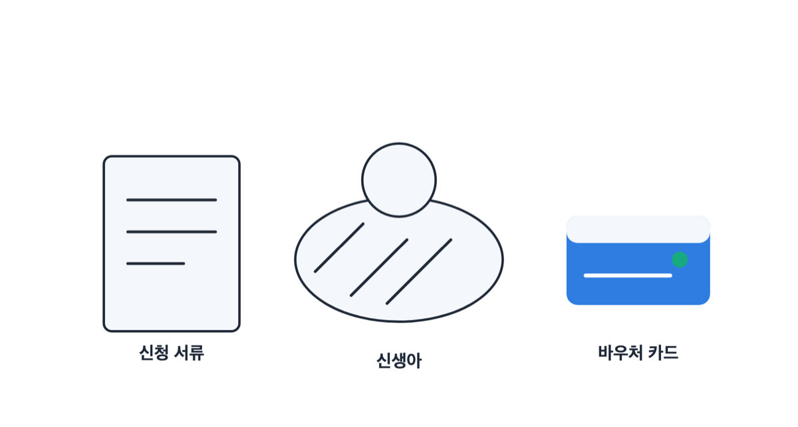
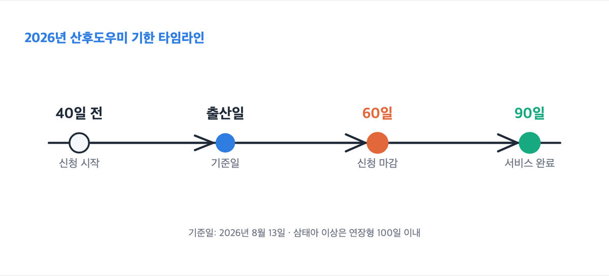
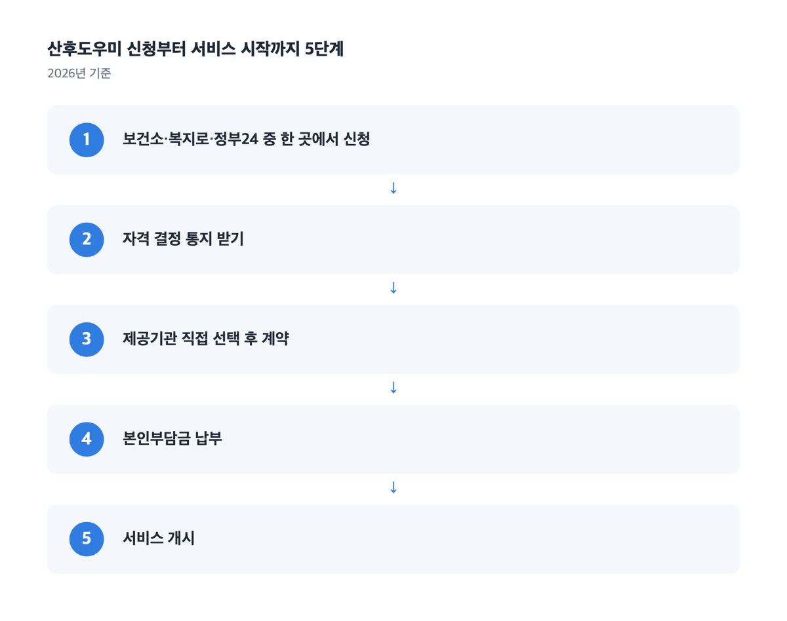
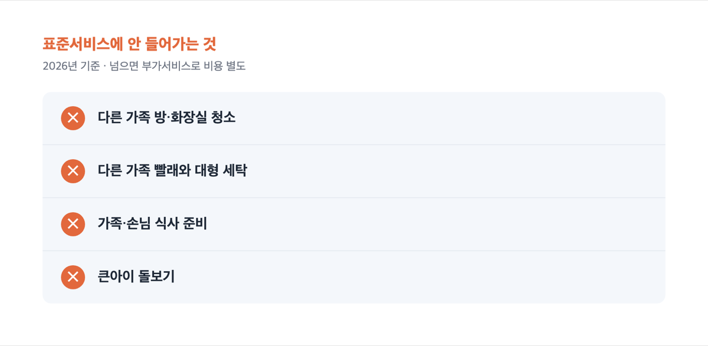

📌 2026년 8월 13일 기준
결론부터요. 정부지원 산후도우미는 출산예정일 40일 전부터 ==출산일로부터 60일까지== 신청합니다. 대상은 건강보험료 합산액으로 정해지고요. 단태아 첫째아가 표준형 10일을 고르면 2026년 기준 본인부담금이 46만 2천원이에요.

## 신청 기한이 30일과 60일로 나뉘어 있어요

이 제도에서 가장 자주 혼선을 주는 정보가 신청 기한이에요.

사업을 운영하는 사회서비스 전자바우처, 법제처 찾기쉬운 생활법령정보, 그리고 보건소 아홉 곳 이상이 "출산예정일 40일 전부터 출산일로부터 60일까지"로 안내해요. 경기 광주시는 여기에 '출산일 미포함'이라는 단서를 붙여 뒀고요.

그런데 정부24의 '산모·신생아 건강관리 지원' 페이지는 다르게 적혀 있어요. 최종수정일이 2026년 5월 13일인 이 페이지의 신청기한 항목은 "출산일로부터 30일까지"예요.

> [!WARNING]
> 숫자가 다른 두 안내가 같이 떠 있는 상태예요.

기한은 60일로 보시면 돼요. 다만 두 곳 표기가 다르니 관할 보건소에 한 번 더 확인하세요. 서둘러 접수하면 어느 쪽 기준이든 걸릴 일이 없고요.

'30일'이라는 숫자가 실제로 쓰이는 곳도 따로 있어요. 특례 두 가지예요.

| 상황 | 2026년 기준 신청 기한 |
|---|---|
| 일반 출산 | 출산예정일 40일 전 ~ 출산일로부터 60일까지 (출산일 미포함) |
| 미숙아·선천성 이상아로 입원한 경우 | 신생아 퇴원일로부터 30일 이내 |
| 임신 16주 이후 유산·사산 | 확인일로부터 30일 이내 |

특례는 서류가 더 붙어요. 입·퇴원 확인서, 의사 소견서나 사산증명서를 함께 내야 해요.

저는 기한을 헷갈린 적이 없어요. 보건소에서 받은 안내 하나로 신청 시점이 정리됐거든요. 검색해서 숫자를 맞춰 보는 것보다 관할 보건소에 전화 한 번이 빠릅니다.

**기한이 하나 더 있어요. 신청 기한과 사용 기한은 다른 값이에요.** 🗓️

바우처(현금 대신 정해진 서비스에만 쓸 수 있는 이용권이에요)는 ==출산일로부터 90일 이내에 서비스를 끝내는== 것이 원칙이에요. 삼태아 이상이 연장형을 고르면 100일 이내고요. 미숙아나 선천성 이상아로 입원했다면 퇴원일을 기준으로 계산하니, 정확한 날짜는 관할 보건소에서 확인하세요.

그러니까 60일 안에 신청하고, 90일 안에 다 써야 합니다.

여기서 산후조리원 일정이 걸려요. 저는 조리원 입소 기간을 감안해서 신청 시점을 정했어요. 관리사님은 약속된 날짜에 정확히 오셨고요. "신청하고 며칠 만에 온다"가 아니라 계약한 날짜에 맞춰 오는 방식이에요.

> [!TIP]
> 출산일로부터 2년이 지나면 바우처 자체가 소멸합니다.

## 소득은 태아까지 세서 봐요

대상은 두 갈래예요. 기초생활보장 생계·의료·주거·교육급여 수급자나 차상위계층 출산가정, 그리고 건강보험료 본인부담금 합산액이 기준중위소득 150% 이하인 출산가정이에요.

기준중위소득은 전국 가구를 소득 순으로 줄 세웠을 때 한가운데 있는 가구의 소득이에요.

가구원 수를 세는 방식이 좀 특이해요. 태어난 아기는 물론이고 ==태아도 가구원으로 포함==해요. 그래서 첫아이를 낳는 부부는 보통 3인 가구로 판정돼요.

산모, 배우자(사실혼 포함), 미혼 자녀, 그리고 주민등록과 건강보험에 함께 등재된 직계혈족이 가구원에 들어가요.

| 가구원 수 (태아 포함) | 2026년 소득 기준 (기준중위소득 150%, 월) | 직장가입자 건보료 (본인부담금, 월) | 지역가입자 건보료 (본인부담금, 월) | 혼합 (본인부담금, 월) |
|---|---|---|---|---|
| 2인 | 6,299,000원 | 229,357원 | 164,508원 | 232,890원 |
| 3인 | 8,039,000원 | 290,169원 | 240,352원 | 296,127원 |
| 4인 | 9,743,000원 | 360,410원 | 322,443원 | 374,300원 |
| 5인 | 11,336,000원 | 410,439원 | 378,691원 | 432,308원 |

부부 중 한 명이 직장가입자, 다른 한 명이 지역가입자면 '혼합' 기준을 봐요.

건강보험료는 본인부담금 기준이고, 노인장기요양보험료를 뺀 금액이에요. 판정은 신청일 기준 직전월 부과액으로 해요.

맞벌이는 계산할 게 하나 더 있어요. 부부 중 낮은 쪽 건강보험료를 절반으로 깎은 다음 합산합니다.

근데 150%를 넘어도 이용이 막히는 건 아니에요. 이때는 '라형'으로 분류돼 정부지원금이 가장 적게 지급돼요. 서초구는 대상을 아예 '소득제한 없음'으로 안내하고 있고요.

희귀질환·중증난치질환 산모, 장애인 산모, 장애 신생아, 쌍생아 이상, 셋째아 이상, 미혼모, 결혼이민 산모, 분만취약지 산모, 미숙아 출산가정도 예외지원 대상이에요.

다만 예외지원은 시·도지사가 승인한 범위 안에서 적용돼요. 우리 집이 되는지는 관할 보건소에서 확인하세요. 부부가 모두 외국인인 경우도 지자체 안내가 달라지는 대목이라 꼭 물어보셔야 해요.

## 단태아 첫째아 표준형 10일이면 46만 2천원이에요

금액은 태아 유형, 출산 순위, 소득 유형, 며칠을 고르는지 네 가지로 나뉘어요. 2026년 기준으로 가장 흔한 조합부터 볼게요.

단태아 첫째아는 단축 5일, 표준 10일, 연장 15일 중에서 골라요. 서비스가격은 각각 73만 2천원, 146만 4천원, 219만 6천원이에요.

| 단태아 첫째아 표준형 10일 (2026년 기준) | 정부지원금 | 본인부담금 |
|---|---|---|
| 가형 (수급자·차상위) | 1,165,000원 | 299,000원 |
| 통합형 (기준중위소득 150% 이하) | 1,002,000원 | 462,000원 |
| 라형 (기준중위소득 150% 초과) | 764,000원 | 700,000원 |

본인부담금은 서비스가격 146만 4천원에서 정부지원금을 뺀 금액이에요.

")

기간을 늘리면 부담이 확 뛰어요. 통합형 첫째아는 단축 5일이 16만 3천원, 표준 10일이 46만 2천원, 연장 15일이 89만 3천원이에요. 5일 늘릴 때 30만원, 다시 5일 늘릴 때 43만원이 더 붙어요. 뒤로 갈수록 부담이 더 커집니다.

둘째아부터는 고를 수 있는 기간 자체가 달라요.

| 태아 유형·출산 순위 (2026년 기준) | 단축 | 표준 | 연장 |
|---|---|---|---|
| 단태아 첫째아 | 5일 | 10일 | 15일 |
| 단태아 둘째아·셋째아 이상 | 10일 | 15일 | 20일 |
| 쌍태아 | 10일 | 15일 | 20일 |
| 삼태아 이상 | 15일 | 25일 | 40일 |

장애의 정도가 심한 장애인 산모와 이른둥이 출산은 단태아라도 쌍태아 기준을 적용해요. 미숙아로 태어나 중환자실이나 신생아집중치료실 치료를 받은 경우에는 한 단계 높은 서비스를 고를 수 있어요. 유형이 바뀌면 본인부담금도 함께 달라져요.

**며칠을 고를지는 계약 전에 정해야 합니다.** 제공기관과 계약해서 바우처가 만들어진 뒤에는 ==선택한 서비스 기간을 바꿀 수 없어요==.

## 신청하고 나면 업체는 직접 골라야 해요

신청 창구는 세 곳이에요.

1. 산모의 주민등록 주소지 관할 시·군·구 보건소 방문
2. [복지로](https://www.bokjiro.go.kr) 온라인 — 서비스신청 → 복지서비스 신청 → 로그인 → 임신·출산 → 산모신생아 건강관리 신청하기
3. [정부24 산모·신생아 건강관리 지원](https://www.gov.kr/portal/service/serviceInfo/PTR000050390) 온라인

서류는 산모 신분증, 임신확인서나 산모수첩 또는 출생증명서, 주민등록등본, 가족관계증명서, 건강보험증 사본과 건강보험료 납부확인서가 기본이에요. 맞벌이면 부부 두 사람의 납부확인서가 다 필요해요. 휴직 중이면 휴직증명서, 사실혼이면 사실혼 확인보증서처럼 상황에 따라 붙는 서류가 있어요. 온라인으로 신청하면 서류 스캔본과 이메일 주소가 필요하고요.

접수 창구 운영은 지자체마다 달라요. 서대문구는 보건소 본소에서만 접수하고 분소에서는 받지 않아요. 대리 신청에 위임장 서식을 요구하는 곳도 있어요. 사는 지역에 따라 다를 수 있으니 꼭 확인해 보세요.

자격 결정 통지를 받으면 그다음은 제공기관을 직접 골라 계약하는 순서예요. 주소지와 상관없이 이용이 편한 곳을 고를 수 있어요. 기관 검색은 [사회서비스 전자바우처](https://www.socialservice.or.kr)에서 해요. 서비스기관 검색 → 제공기관 검색으로 들어가 시·도와 시·군·구를 고르고, 사업구분에서 '산모신생아건강관리지원'을 선택하면 돼요.

저는 제도 안내와 제공기관 정보를 보건소에서 받았어요. 공식 안내는 '직접 선택'이라고 적혀 있지만, 신청하러 간 곳에서 함께 물어보면 검색하는 시간을 줄일 수 있어요.

> [!WARNING]
> 등록되지 않은 업체가 정부지원 업체를 사칭하는 사례가 있어요. 출산박람회나 베이비페어에서 계약을 권하는 경우가 특히 그래요. 계약 전에 보건소나 사회서비스 전자바우처에서 ==등록기관인지 확인==하세요.

상담할 때 바우처 이용자라는 사실을 먼저 알리는 것도 중요해요. 안 알리면 정부지원에서 빠질 수 있어요. 관리사님이 맞지 않으면 정당한 사유가 있을 때 변경을 요청할 수 있고, 계약을 해지하고 다른 기관과 다시 계약할 수도 있어요.

본인부담금은 서비스 개시일 전까지 제공기관이 지정한 계좌로 내는 것이 원칙입니다.

저는 업체가 청구한 금액을 먼저 직접 결제하고, 나중에 관련 기관에서 정산을 받았어요. 결제와 정산 방식은 제공기관과 거주지 지원 제도에 따라 달라질 수 있어요. 계약서에 사인하기 전에 얼마를 언제 어떻게 내는지 물어보시는 게 좋아요.

서비스 기간에는 매일 국민행복카드 단말기 체크나 앱 본인인증을 해야 해요.

## 청소와 빨래는 산모·아기 것만 해요 🧺

표준서비스 범위를 모르면 현장에서 서로 난감해져요.

산모 쪽은 신체 상태 조사, 유방관리, 산후 부종관리, 산후 체조 지원, 영양관리와 식사 준비, 좌욕과 위생관리, 수유·산후회복 교육, 응급상황 대응이 들어가요. 아기 쪽은 건강상태 확인, 청결·위생관리, 수유 지원, 예방접종 지원, 감염 예방, 응급상황 대응이고요.

여기에 산모와 아기가 주로 쓰는 공간 청소, 산모와 아기 의류 세탁까지가 표준이에요.

근데 이 선을 넘으면 부가서비스가 되고 비용을 따로 냅니다.

큰아이를 함께 봐 달라는 요청이 여기 들어가요. 다른 가족 방과 화장실, 베란다·창고·유리창 청소, 침구나 커튼 같은 대형 빨래, 가족이나 손님 식사 준비, 김치나 장아찌 같은 저장식품도 표준 밖이에요.

저는 서비스 기간만큼만 받았고 따로 더한 부분은 없었어요. 표준 범위 안에서 끝내면 계약한 금액에서 늘어날 일이 없어요.

시간도 정해져 있어요. 1주 5일, 하루 9시간이 원칙이고 휴게시간 1시간이 그 안에 들어가요. 09시부터 18시까지, 점심시간 12시부터 13시까지가 예시로 안내돼요. 관리사님 식사는 산모가 준비해요.

토요일과 공휴일은 휴무가 원칙이에요. 요일과 시간은 제공기관과 협의해 조정할 수 있어요. 다만 22시부터 07시 사이에는 바우처 서비스를 받을 수 없습니다.

## 사는 지역에 따라 본인부담금을 돌려받기도 해요

여기서부터는 중앙정부 사업이 아니에요. 지자체가 자기 예산으로 따로 하는 제도라 있는 곳과 없는 곳이 달라져요.

인천시는 산모신생아 건강관리 서비스 이용자의 본인부담금을 일부 지원해요. 셋째아 이상이 단축형을 이용하면 전액을 지원하고요. 대상은 기준중위소득 150% 이하 출산가정, 둘째아 이상, 희귀난치성질환 산모, 미혼 산모, 장애인 산모, 쌍태아 이상 등이에요. 신청은 관할 보건소 방문이고요.

기한 기산점이 중앙 사업과 달라요. 인천시 본인부담금 지원은 서비스가 끝난 뒤 60일 이내에 신청해요. 출산일이 아니라 서비스 종료일 기준이에요.

서울시는 산후조리경비를 따로 줘요. 첫째 100만원, 둘째 120만원, 셋째 이상 150만원이고, 다태아 유산·사산 산모는 단태아 기준 100만원이에요. 신청 기한은 출산일로부터 180일 이내, 사용 기한은 출산일로부터 1년이 되는 달의 말일까지예요. 사용처에 산모·신생아 건강관리가 들어가요.

신청은 탄생응원 서울 프로젝트 '몽땅정보만능키' 누리집에서 온라인으로 해요. 산모 본인 명의 휴대폰으로 인증해야 하고, 대리 신청은 안 돼요. 산후도우미 본인부담금에 함께 쓸 수 있는지는 서울시나 관할 자치구에 확인하세요.

두 제도 모두 사는 지역에 따라 다를 수 있으니 꼭 확인해 보세요. 우리 지역에 비슷한 지원이 있는지는 관할 보건소나 시·군·구청에 물어보면 돼요.

")

## 자주 묻는 질문

### Q. 기준중위소득 150%를 넘으면 아예 못 받나요?

이용은 가능해요. 라형으로 분류되고 정부지원금이 가장 적게 붙어요. 단태아 첫째아 표준형 10일이면 정부지원금 76만 4천원, 본인부담금 70만원이에요. 다만 예외지원 승인 범위가 시·도별로 정해지니 관할 보건소에 확인하세요.

### Q. 며칠 쓸지 나중에 바꿀 수 있나요?

제공기관과 계약해서 바우처가 만들어지면 못 바꿔요. 단축·표준·연장 중 무엇을 고를지는 계약 전에 정해야 합니다. 미숙아로 태어나 중환자실이나 신생아집중치료실 치료를 받은 경우에는 처음 고를 때 한 단계 높은 서비스를 선택할 수 있어요. 계약 뒤 변경이 되는 건 아니에요.

### Q. 큰아이 돌봄이나 가족 식사도 부탁할 수 있나요?

표준서비스에 들어가지 않아요. 바우처 대상 아기 외에 큰아이나 다른 가족을 돌보는 일, 가족·손님 식사 준비, 대형 빨래는 부가서비스라 비용을 따로 내야 해요.

### Q. 출산하고 60일이 지났으면 어떻게 하나요?

일반 출산의 신청 기한은 출산일로부터 60일까지예요. 미숙아·선천성 이상아로 입원했다면 퇴원일로부터 30일 이내, 임신 16주 이후 유산·사산이면 확인일로부터 30일 이내가 따로 적용돼요. 특례는 기한을 늘려 주는 게 아니라 세는 시작점이 다른 별도 기한이에요. 우리 경우가 어디에 드는지는 관할 보건소에서 확인하세요.

> [!ACTION]
> 오늘 할 일은 하나예요. 관할 보건소에 우리 집 소득 유형과 신청 기한을 확인하세요. 출산예정일 40일 전이 지났다면 그때부터 신청할 수 있고, 이미 출산했다면 60일 안에 접수해야 합니다.

---

이 글은 2026년 8월 13일에 확인한 공식 안내를 정리한 거예요. 금액과 기준은 지침 개정으로 바뀔 수 있고, 지자체 추가 지원은 지역마다 달라요. 개별 수급 여부는 관할 기관이 판단하니 신청 전에 관할 보건소에 확인하세요.

참고: 보건복지부 「2026년 산모신생아 건강관리 지원사업 안내」 · 사회서비스 전자바우처 사업 안내 · 법제처 찾기쉬운 생활법령정보 · 정부24 산모·신생아 건강관리 지원 · 김포시보건소 「2026년 산모·신생아 건강관리 서비스 이용 안내문」 · 각 시·군·구 보건소 공식 안내 (2026년 8월 13일 확인)
</content>
