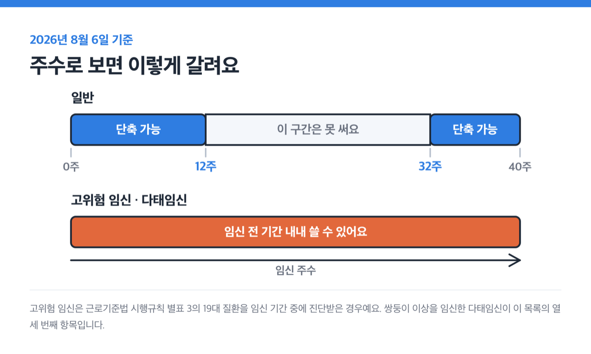
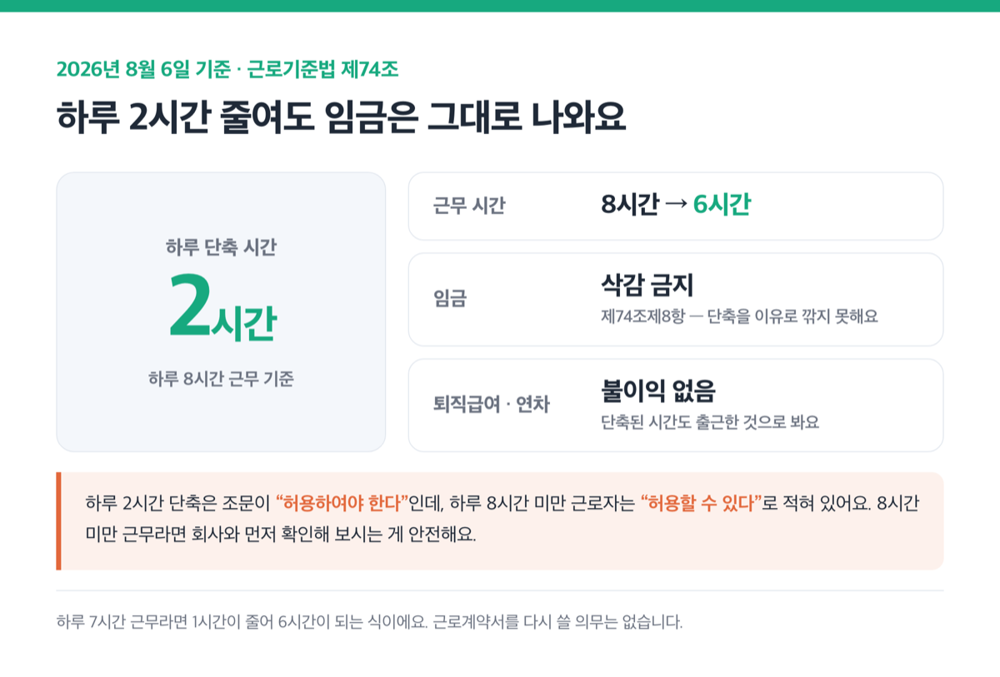
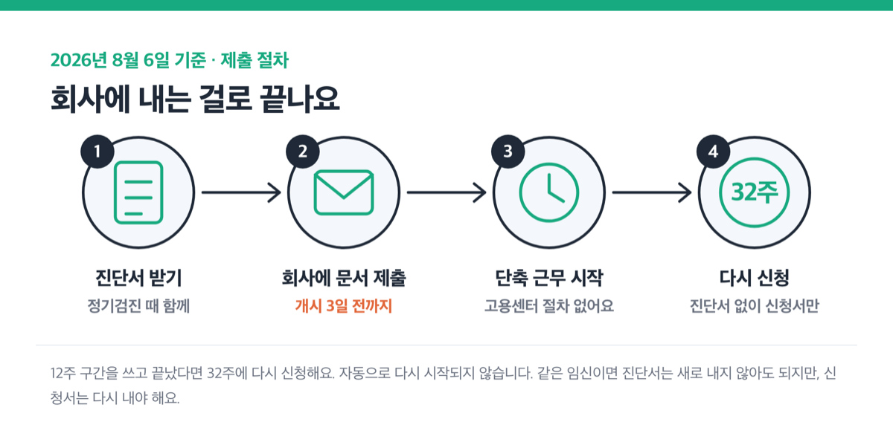
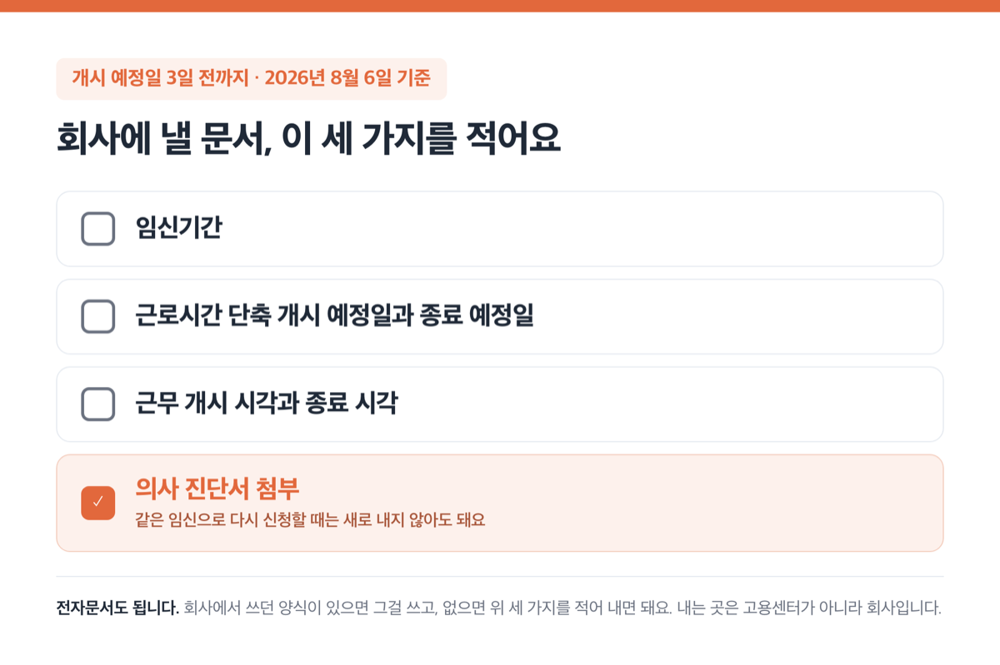
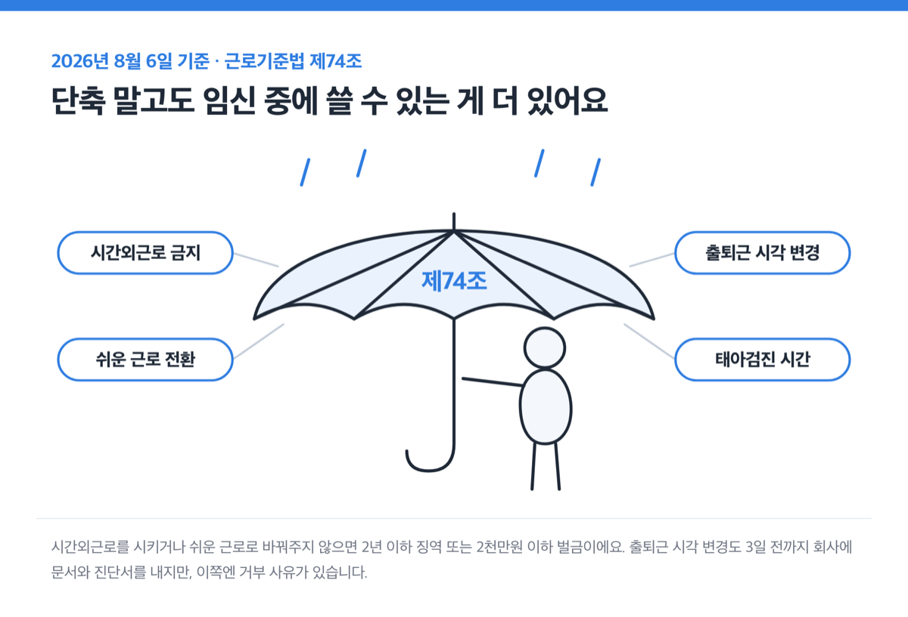
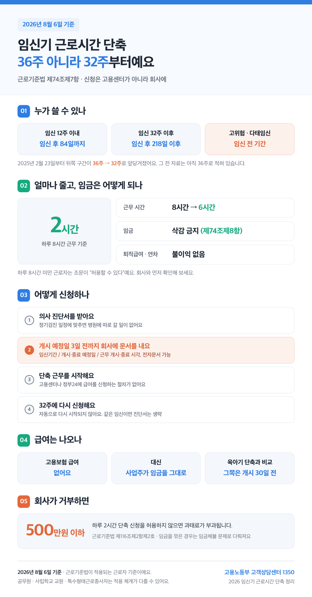

2026년 8월 6일 기준

📌 결론부터요. 임신 12주 이내이거나 32주 이후면 하루 2시간을 줄여서 일할 수 있어요(하루 8시간 근무 기준). 임금은 깎이지 않고요. 신청은 고용센터가 아니라 회사에, 시작하려는 날 ==3일 전까지== 하시면 됩니다.

근데 아직도 "36주"로 안내하는 자료가 많아요.

## 36주로 적힌 안내문, 지금 보면 틀린 정보예요

2025년 2월 23일부터 후기 구간이 ==32주 이후로 앞당겨졌어요==.

원래는 임신 12주 이내 또는 36주 이후였어요. 근로기준법 제74조제7항이 2024년 10월 22일 개정되면서 뒤쪽 구간이 4주 늘어난 거예요. 조산 위험에서 임산부와 태아의 건강을 지키자는 취지였고요.

| 구간 | 일수로 보면 |
|---|---|
| 임신 12주 이내 | 임신 후 84일까지 |
| 임신 32주 이후 | 임신 후 218일 이후 |

2026년 8월 6일 현재도 이 기준이 그대로입니다.

> [!WARNING]
> 근데 인터넷에는 아직 36주로 적힌 안내가 많아요. 고용노동부 상담 답변 중에도 2024년에 작성된 건 36주로 답하고 있고요. 2025년 2월 23일 이전 자료는 그대로 믿으면 안 됩니다.

내 구간을 직접 셀 필요는 없어요. 고용노동부가 배포하는 [임신기 근로시간 단축 대상기간 계산표](https://www.moel.go.kr/policy/policydata/view.do?bbs_seq=20250201644)에 출산예정일을 넣으면 나와요.

 또는 32주 이후(218일 이후), 2025년 2월 23일부터 4주 앞당겨졌어요")

## 다태임신도 들어가요, 고위험이면 임신 전 기간 씁니다

근로기준법 시행규칙 별표 3의 19대 질환을 임신 기간 중에 진단받으면 임신 전 기간에 신청할 수 있어요.

① 조기진통 ② 분만관련 출혈 ③ 중증 임신중독증 ④ 양막의 조기파열 ⑤ 태반조기박리 ⑥ 전치태반 ⑦ 절박유산 ⑧ 양수과다증 ⑨ 양수과소증 ⑩ 분만전 출혈 ⑪ 자궁경부무력증 ⑫ 고혈압 ⑬ 다태임신 ⑭ 당뇨병 ⑮ 대사장애를 동반한 임신과다구토 ⑯ 신질환 ⑰ 심부전 ⑱ 자궁 내 성장 제한 ⑲ 자궁 및 자궁의 부속기 질환.

눈여겨볼 게 ⑬번이에요.

다태임신, 그러니까 쌍둥이 이상을 임신한 경우입니다. 12주와 32주 사이가 비는 게 아니라 ==임신 전 기간을 이어서 쓸 수 있다는 뜻==이에요. 이 목록은 2025년 2월 23일 시행된 시행규칙 개정으로 새로 생겼어요.

근데 진단서에 조건이 붙어요. 별표 3의 제2호·제3호 질환이라면 진단서에 임신·출산 관련 질환명과 질병코드(O10-O16, O20-O48)가 적혀 있어야 해요. 어디에 해당하는지는 진료받는 의료기관에서 확인하시는 게 정확해요.

## 하루 2시간 줄여도 임금은 그대로 나옵니다

근로기준법 제74조제8항에 따라 회사는 단축을 이유로 임금을 깎지 못해요. 삭감하면 임금체불 문제가 됩니다.

하루 8시간을 일한다면 2시간이 줄어요. 8시간보다 짧으면 조문이 달라지고요. 사용자는 하루 근로시간이 6시간이 되도록 단축을 허용할 수 있다고 정해져 있어요. 하루 7시간 근무라면 1시간이 줄어 6시간이 되는 식이에요.

> [!WARNING] 8시간 미만 근무라면 다릅니다
> 근데 여기서 조문의 표현이 갈려요. 하루 2시간 단축은 "허용하여야 한다"인데, 8시간 미만 근로자는 "허용할 수 있다"로 적혀 있어요. 8시간 미만 근무라면 회사와 먼저 확인해 보시는 게 안전해요.

퇴직급여도 임금이 깎이지 않으니 산정에 영향이 없어요. 연차유급휴가는 단축된 근로시간을 출근한 것으로 보고요. 2025년 10월 23일 시행된 근로기준법 제60조제6항제5호에 들어간 내용이에요. 근로계약서를 다시 쓸 의무는 없고, 필요하면 노사가 협의해 작성할 수 있어요.

## 급여는 안 나와요, 신청할 곳은 고용센터가 아니라 회사입니다

이 제도에는 고용보험에서 나오는 급여가 없어요. 대신 사업주가 임금을 그대로 주는 구조예요.

육아기 근로시간 단축과 가장 크게 갈리는 지점이 여기예요.

| 항목 | 임신기 근로시간 단축 | 육아기 근로시간 단축 |
|---|---|---|
| 근거법 | 근로기준법 제74조제7항 | 남녀고용평등법 |
| 단축 폭 | 하루 2시간 | 단축 후 주 15~35시간 |
| 임금 | 삭감 금지 | 근로시간에 비례해 감소 |
| 고용보험 급여 | 없음 | 있음 |
| 신청 기한 | 개시 3일 전 | 개시 30일 전 |
| 사업주 거부 사유 | 조문에 없음 | 근속 6개월 미만 등 세 가지 |

육아기 근로시간 단축과 육아휴직은 [2026 육아휴직 정리](/posts/childcare-childbirth/childcare-leave-2026/)에 따로 적어 뒀어요.

근데 지원금이 아예 없는 건 아니에요. 다만 받는 쪽이 근로자가 아니라 회사예요.

워라밸일자리 장려금은 소정근로시간(근로계약에서 일하기로 정한 시간이에요)을 줄여준 사업주에게 주는 고용보험 지원금이에요. 임신 사유로는 주 35시간 이상 일하던 근로자를 주 15~30시간으로 줄인 경우가 대상이에요. 금액은 단축 근로자 1인당 월 최대 50만원이고요. 중소·중견기업 사업주가 대상이라 신청도 회사가 [고용24](https://www.work24.go.kr)에서 해요.

요건이 서로 다른 별개 제도예요. 임신기 근로시간 단축을 썼다고 회사가 자동으로 장려금을 받는 건 아닙니다.

## 개시 3일 전까지, 이 순서대로 내면 끝나요

신청 기한은 단축을 시작하려는 날의 3일 전까지입니다.

육아휴직과 육아기 근로시간 단축은 개시 30일 전까지예요. 두 제도의 기한을 섞어서 기억하면 시작일이 통째로 밀려요.

1. **내 구간을 확인해요.** 12주 이내인지 32주 이후인지 보고, 고위험 임신이면 임신 전 기간이에요.
2. **의사 진단서를 받아요.** 정기검진 일정에 맞추면 병원에 따로 갈 일이 없어요. 고위험 임신으로 신청한다면 진단서에 질환명과 질병코드가 있어야 해요.
3. **개시 예정일 3일 전까지 회사에 문서를 내요.** 전자문서도 됩니다.
4. **단축 근무를 시작해요.** 고용센터나 정부24에 급여를 신청하는 절차가 없어요. 회사에 내는 걸로 끝이에요.
5. **12주 구간을 쓰고 끝났다면 32주에 다시 신청해요.** 자동으로 다시 시작되지 않습니다.

문서에 들어갈 항목은 세 가지예요. ① 임신기간 ② 근로시간 단축 개시 예정일과 종료 예정일 ③ 근무 개시 시각과 종료 시각. 여기에 의사 진단서를 첨부해요. 회사에서 쓰던 양식이 있으면 그걸 쓰고, 없으면 이 세 가지를 적어 내면 돼요.

> [!TIP]
> 같은 임신으로 다시 신청할 때는 진단서를 새로 내지 않아도 돼요. 시행령에 "같은 임신에 대하여 근로시간 단축을 다시 신청하는 경우는 제외한다"고 적혀 있거든요. 다만 신청서는 다시 내야 합니다.

## 회사가 거부하면 500만원 이하 과태료입니다

조문이 "허용하여야 한다"로 돼 있어요. 회사가 허용 여부를 고르는 구조가 아니에요.

근로시간 단축 신청을 허용하지 않으면 근로기준법 제116조제2항제2호에 따라 ==500만원 이하의 과태료가 부과됩니다==.

근데 더 눈여겨볼 게 있어요. 육아기 근로시간 단축에는 사업주가 거부할 수 있는 사유가 정해져 있는데, 임신기 근로시간 단축에는 조문상 거부 사유가 없어요. 같은 제74조 안에서도 출퇴근 시각 변경(제9항)에는 거부 사유가 붙어 있는데, 제7항에는 그런 단서가 없고요.

임금을 깎은 경우는 과태료가 아니라 임금체불 문제로 다뤄져요.

⏰ 상황이 애매하면 고용노동부 고객상담센터에 물어보세요. 국번 없이 1350이에요.

## 단축 말고도 임신 중에 쓸 수 있는 게 더 있어요

근로기준법 제74조에는 근로시간 단축만 들어 있는 게 아니에요.

| 제도 | 내용 | 사업주 의무 |
|---|---|---|
| 시간외근로 금지 | 임신 중 여성에게 시간외근로를 시킬 수 없어요 | 근로자가 원해도 안 돼요 |
| 쉬운 종류의 근로 전환 | 근로자가 요구하면 전환해야 해요 | 의무 |
| 출퇴근 시각 변경 | 하루 소정근로시간을 유지하면서 시작·종료 시각을 바꿔요 | 원칙 의무, 예외 있음 |
| 태아검진 시간 | 임산부 정기건강진단에 필요한 시간을 청구하면 허용, 임금 삭감 금지 | 의무(상시 5명 이상 사업장) |

※ 표에 사업장 규모가 적힌 건 태아검진 시간 하나예요. 다른 항목에 규모 요건이 없다는 뜻은 아니고요. 5인 미만 사업장이라면 고용노동부 고객상담센터 1350에 먼저 확인해 보세요.

시간외근로를 시키거나, 근로자가 요구했는데도 쉬운 근로로 바꿔주지 않으면 2년 이하 징역 또는 2천만원 이하 벌금이에요. 근로시간 단축 거부보다 제재가 무겁습니다.

출퇴근 시각을 바꿀 때도 변경 예정일 3일 전까지 회사에 문서와 의사 진단서를 내요. 근데 이쪽엔 거부 사유가 있어요. 정상적인 사업 운영에 중대한 지장을 초래하는 경우, 그리고 시각을 바꾸면 임신 중인 근로자의 안전과 건강에 관한 법령을 위반하게 되는 경우예요.

32주 이후 구간이 끝나면 다음은 출산전후휴가예요. 90일이고 미숙아를 출산하면 100일, 한 번에 둘 이상을 임신했다면 120일이에요. 그다음 단계인 육아휴직 급여는 [2026 육아휴직 정리](/posts/childcare-childbirth/childcare-leave-2026/)에 있어요.

> [!NOTE]
> 여기까지는 근로기준법이 적용되는 근로자 기준이에요. 공무원·사립학교 교원, 특수형태근로종사자(노무제공자)는 적용 체계가 다를 수 있으니 소속 기관에 확인해 보세요.

임신·출산 지원금 중에는 지자체가 따로 주는 것도 있어요. 그쪽은 사는 지역에 따라 다르니 거주지 지자체에서 꼭 확인해 보세요.

> [!ACTION]
> 오늘 할 일은 두 가지예요. 계산표에 출산예정일을 넣어 내 구간을 확인하고, 다음 정기검진 때 진단서를 받아 오세요. 회사에는 개시 3일 전까지만 내면 됩니다.

참고: 국가법령정보센터 근로기준법·시행령·시행규칙 · 법제처 찾기쉬운 생활법령정보 · 고용노동부 일생활균형 · 고용24
