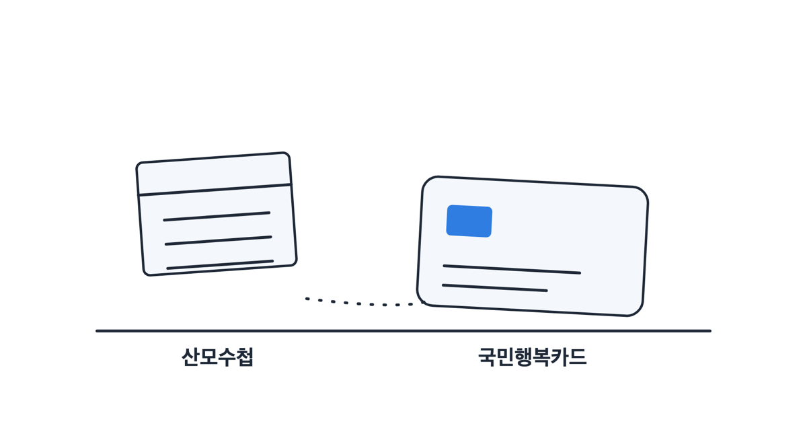
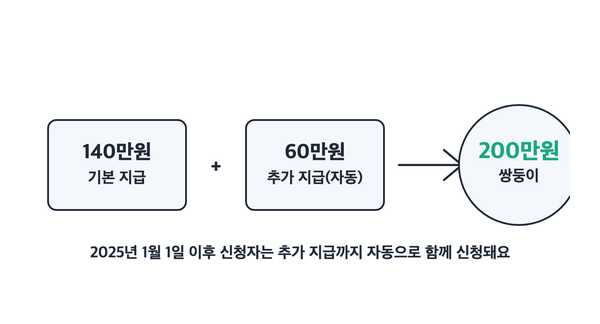
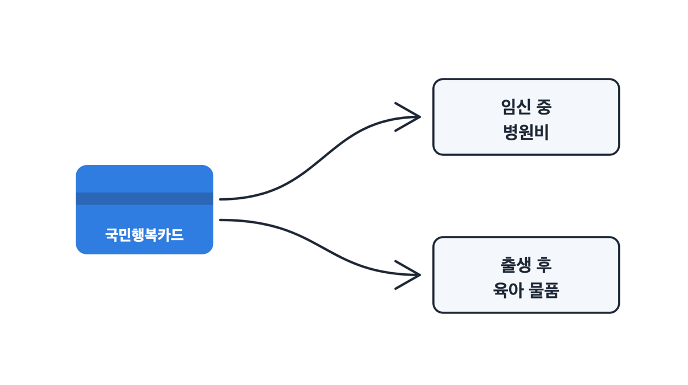

> [!SUMMARY] 2026년 8월 13일 기준
> 결론부터요. 2026년 기준 임신·출산 진료비 지원은 임신 1회당 100만원이에요. 대상은 임신·출산이 확인된 건강보험 가입자와 피부양자고요. 쓸 수 있는 기간은 ==분만예정일이나 출산일로부터 2년==입니다.
>
> 첫만남이용권과 같은 국민행복카드로 받지만, 아예 다른 제도예요.

## 2026년 기준 금액은 임신 1회당 100만원입니다

먼저 이 돈의 정체부터요. 복지 예산에서 나오는 수당이 아니라 **건강보험이 주는 급여**예요. 국민건강보험법 제50조의 부가급여, 그러니까 건강보험 가입자와 피부양자에게 주는 몫이죠.

그래서 창구가 주민센터가 아니라 국민건강보험공단이에요. 여기가 첫만남이용권과 갈리는 첫 지점이고요.

지급 방식은 현금이 아니라 바우처(현금 대신 정해진 곳에서만 쓸 수 있는 이용권이에요)예요. 국민행복카드에 포인트로 들어옵니다.

| 구분 (2026년 기준) | 지원액 |
|---|---|
| 단태아 (태아 한 명) | 임신 1회당 **100만원** |
| 다태아 — 기본 지급 | 140만원 |
| 다태아 — 추가 지급까지 합치면 | 태아당 100만원 |
| 분만취약지 거주 | 20만원 추가 |

태아 수로 따지면 쌍둥이 200만원, 세쌍둥이 300만원, 네쌍둥이 이상 400만원이에요. 그보다 늘어나면 100만원씩 더해지고요.

")

근데 다태아 금액이 헷갈리게 적혀 있어요. 공식 안내가 "140만원 기본 지급"과 "태아당 100만원이 되도록 추가 지원"으로 두 단으로 나뉘어 있거든요.

쌍둥이를 예로 들면 기본 140만원에 추가 60만원이 더해져 ==태아당 100만원==이 돼요. 다태아 지원이 이렇게 넓어진 건 2024년 1월 1일부터고요.

그리고 **쌍둥이의 경우 추가 지급금 60만원이 자동으로 함께 신청됩니다.** 따로 한 번 더 신청할 필요가 없어요. 세쌍둥이 이상은 태아당 100만원이 되도록 추가돼요.

## 같은 카드로 받는데 첫만남이용권과는 다른 제도예요

둘 다 국민행복카드로 받아서 같은 돈으로 아는 경우가 많아요. 근데 근거부터 창구, 시점, 쓰는 곳까지 전부 달라요.

| 구분 (2026년 기준) | 임신·출산 진료비 지원 | 첫만남이용권 |
|---|---|---|
| 무슨 돈인가 | 건강보험 부가급여 | 출산 축하와 초기 육아 지원 |
| 언제 받나 | 임신 중부터 | 출생신고로 주민등록번호를 받은 뒤 |
| 금액 | 임신 1회당 100만원 | 첫째 200만원, 둘째 이상 300만원 |
| 세는 단위 | 임신 1회당 | 출생아 1명당 최초 1회 |
| 창구 | 국민건강보험공단 | 읍·면·동 주민센터, 복지로, 정부24 |
| 쓸 수 있는 곳 | 병·의원과 약국 | 육아 물품·서비스 구매 |
| 사용 기한 | 분만예정일·출산일부터 2년 | 2024년 1월 1일 이후 출생아는 생년월일부터 2년 |

한 문장으로 가르면 이래요. 임신·출산 진료비 지원은 "임신했으니 **병원비**를 건강보험이 대준다"는 것이에요. [첫만남이용권](/posts/childcare-childbirth/first-meeting-voucher-2026/)은 "아이가 태어났으니 **초기 육아 비용**을 보태준다"는 것이고요.

저는 이 둘을 헷갈린 적이 없어요. 받는 시점이 아예 다르니까요. 🍼

> [!WARNING]
> 두 제도는 신청 창구가 달라요. 임신·출산 진료비는 국민건강보험공단이고, 첫만남이용권은 읍·면·동 주민센터와 복지로·정부24입니다. 둘은 동시에 받을 수 있어요.

## 신청 경로가 넷인데 임신 중이면 맘편한임신이 편해요

절차 자체는 두 단계예요. 임신·출산 사실을 확인받고, 그다음에 이용권을 신청해요.

1. **산부인과에서 시작** — '건강보험 임신·출산 진료비 지급 신청서'를 발급받아 공단 지사나 카드 발급 금융사에 신청해요. 병원이 온라인으로 임신 정보를 입력해 주면 이후 카드사에서 바로 신청할 수 있고요.
2. **국민건강보험공단 온라인** — [공단 온라인 신청 안내](https://www.nhis.or.kr/nhis/minwon/minwonServiceBoard.do?mode=view&articleNo=10946946)를 보고 민원서비스 > 서비스 찾기 > 임신출산 진료비 온라인 신청으로 들어가요.
3. **정부24 맘편한임신** — [맘편한임신 통합처리 신청](https://www.gov.kr/portal/service/serviceInfo/174100000015) 한 번으로 엽산제·철분제, 표준모자보건수첩, KTX·SRT 할인까지 같이 신청돼요.
4. **카드사 직접 신청** — 전담 금융기관 홈페이지나 앱, 전화로도 돼요.

정부24의 [건강보험 임신·출산 진료비 지원 안내](https://www.gov.kr/portal/service/serviceInfo/SD0000007672)에서 신청 화면으로 바로 갈 수도 있어요.

저는 카드사에서 신청했어요. 일반 카드를 새로 만들 때와 비슷한 기간이 걸렸어요.

3번이 제일 편하지만 조건이 하나 있어요. 맘편한임신은 신청일 기준 임산부가 쓰는 창구라서 ==임신 중에만 신청할 수 있어요==. 이미 출산했다면 공단이나 카드사 경로로 가야 해요.

서류는 온라인으로 임신·출산 사실이 확인되면 따로 낼 게 없어요. 남이 대신 신청하는 경우엔 주민등록표 등본이나 가족관계증명서 같은 관계 입증 서류가 필요해요.

카드는 2026년 기준으로 BC·롯데·삼성·KB국민·신한카드와 15개 회원사에서 발급받아요. 2026년 7월에 현대카드가 더해졌고요.

> [!TIP]
> 제도 자체를 물을 곳은 국민건강보험공단 1577-1000, 보건복지콜센터 129예요. 카드 발급과 신청은 BC 1899-4651, 삼성 1566-3336, 롯데 1899-4282, KB국민 1599-7900, 신한 1544-8868로 물어보면 되고요. 현대카드는 카드사 안내를 확인하세요.

### 의료급여 수급자는 창구가 달라요

이건 건강보험 쪽 제도라서 못 받는 경우가 있어요. 의료급여 수급권자, 건강보험 적용배제를 신청한 국가유공자 의료보호 대상자, 자격상실자, 급여정지자는 대상이 아닙니다.

그렇다고 지원이 없는 건 아니에요. 의료급여 수급자는 창구가 다른 제도로 가면 돼요.

그리고 만 19세 이하 산모는 이 100만원과 별개로 청소년산모 의료비 120만원을 추가로 신청할 수 있어요. 임신·출산 진료비를 신청할 때 추가로 신청하는 방식이에요.

| 구분 (2026년 기준) | 제도 | 대상 | 금액 | 창구 |
|---|---|---|---|---|
| 의료급여 수급자용 | [의료급여 임신·출산 진료비 지원](https://www.gov.kr/portal/service/serviceInfo/SD0000012326) | 의료급여 수급자 | 태아당 100만원 (분만취약지 20만원 추가) | 시군구청·읍면동 행정복지센터 방문 |
| 만 19세 이하 추가 지원 | [청소년산모 임신·출산 의료비 지원](https://www.gov.kr/portal/service/serviceInfo/SD0000006936) | 만 19세 이하 산모 | 임신 1회당 120만원 범위 내 | 사회보장정보원 바우처사업본부, [socialservice.or.kr](https://www.socialservice.or.kr) |

청소년산모 지원은 소득·재산 기준을 보지 않아요. 임신확인서상 임신확인일 기준으로 만 19세까지면 됩니다. 요양기관에서 신청서 겸 임신확인서를 받고 주민등록등본을 함께 내면, 전담 금융기관이 국민행복카드를 따로 보내줘요.

## 병원비만이 아니라 감기·치과에도 쓸 수 있어요 💳

이 카드로 쓸 수 있는 범위가 생각보다 넓어요. 임산부 본인의 진료비와 약값, 치료재료 본인부담금에 쓰고요. 급여든 비급여든 상관없어요.

여기에 **2세 미만 영유아**의 진료비와 처방 약값에도 쓸 수 있어요. 태어난 아이 병원비까지 같은 카드로 결제되는 거예요.

2022년 1월 1일부터는 임신·출산과 무관한 진료도 됩니다. 감기나 치과 치료처럼 그냥 아파서 간 진료도 되고, 한의원도 돼요. 사용처는 약국을 포함한 모든 요양기관이에요.

유산이나 사산도 대상이라 유산 수술 진료비에 쓸 수 있어요. 자궁외 임신도 2019년 7월 1일부터 대상에 들어왔고요.

반대로 안 되는 것도 정해져 있어요.

| 쓸 수 없는 항목 | 예 |
|---|---|
| 미용 목적 성형외과 진료 | 질병·건강증진 목적에 맞지 않는 항목 |
| 의약외품 | 건강보조식품 등 |
| 소모성 재료 | 당뇨소모성재료 등 |
| 서류 발급비용 | 진단서 등 |

결제는 어렵지 않아요. 저는 병원 수납창구에서 일반 카드처럼 내밀었고, 바우처로 받은 금액에서 자동으로 차감됐어요. 따로 말하거나 챙길 게 없었어요.

잔액은 공단 홈페이지와 정부24 홈페이지·모바일앱에서 볼 수 있어요. 카드사 고객센터 전화나 문자 알림 서비스로도 확인돼요.

근데 카드를 남에게 빌려주면 안 돼요. **도용·대여 같은 부정사용이 확인되면 그 금액을 환수합니다.**

## 기한이 두 번 걸려 있어요 — 신청도 2년, 사용도 2년

이 제도는 기한 기준이 두 가지인데, 끝나는 날은 같아요.

| 무엇에 걸린 기한 | 2026년 기준 |
|---|---|
| 신청 기한 | 임신·유산(사산)·출산이 확인된 날부터 분만예정일·출산(유산·사산)일 이후 2년까지 |
| 사용 시작 | 이용권 발급일, 즉 카드에 포인트가 지급된 날 |
| 사용 종료 | 분만예정일·출산일(유산·사산일)로부터 2년 |

사용 기간이 2년이 된 것도, 영유아 대상이 2세 미만으로 넓어진 것도 2022년 1월 1일부터예요.

")

여기가 돈이 사라지는 지점이에요. 쓰지 않고 남은 금액은 ==자동으로 소멸==돼요. 다음 아이에게 이월되지도 않고, 현금으로 돌려받지도 못합니다.

다만 실제로 남기기는 쉽지 않아요. 산부인과 진료비를 결제하다 보면 남김없이 다 쓰게 돼요. 산전 검진이 몇 달에 걸쳐 이어지니까요.

## 분만취약지 32곳은 20만원을 더 받아요

사는 곳 때문에 금액이 달라지는 경우는 이 하나뿐이에요. 분만취약지에 살면 20만원이 추가돼요.

| 광역 | 시·군·구 (2026년 기준 보건복지부 안내, 32곳) | 개수 |
|---|---|---|
| 인천 | 강화군, 옹진군 | 2 |
| 경기 | 연천군, 가평군, 양평군 | 3 |
| 강원 | 홍천군, 인제군, 정선군, 평창군, 화천군 | 5 |
| 충북 | 보은군, 괴산군, 단양군 | 3 |
| 전북 | 진안군, 무주군, 장수군 | 3 |
| 전남 | 보성군, 완도군, 진도군, 신안군 | 4 |
| 대구 | 군위군 | 1 |
| 경북 | 의성군, 청송군, 영양군, 영덕군, 청도군, 봉화군, 울릉군 | 7 |
| 경남 | 의령군, 남해군, 합천군, 산청군 | 4 |

내국인이면 이 20만원 때문에 따로 서류를 낼 일은 없어요. 공단이 전산자료로 거주지를 확인해 지급해요.

근데 지역 목록은 해마다 손볼 수 있어요. 위 표는 2026년 기준 보건복지부 안내를 옮긴 것이니, 우리 동네가 해당되는지는 공단 1577-1000에 확인하세요.

그리고 지자체가 자기 예산으로 따로 하는 임산부 지원은 이 제도와 완전히 별개예요. 서울시 임산부 교통비 지원처럼 금액과 거주 요건, 창구가 전부 다른 사업이 있어요. 서울시는 70~100만원 바우처인데 거주 기간 요건이 붙어요. 사는 지역에 따라 다를 수 있으니 거주지 지자체 공식 사이트에서 꼭 확인해 보세요.

## 자주 묻는 것

### Q. 쌍둥이인데 추가금 60만원을 따로 신청해야 하나요?

2025년 1월 1일 이후 신청자는 기본 지급금과 추가 지급금 60만원이 함께 자동 신청돼요. 별도 절차가 없습니다. 다만 이 추가 지급에 붙어 있는 '임신주수 20주 이상'이라는 공식 안내 문구가 본인 경우에 어떻게 적용되는지는 공단 1577-1000에 확인하세요.

### Q. 첫만남이용권과 같이 받을 수 있나요?

네, 둘은 별개 제도라서 함께 받아요. 임신·출산 진료비는 임신 중에 공단에서, 첫만남이용권은 출생신고 뒤 주민센터나 복지로·정부24에서 신청해요. 하나를 받으면 다른 하나가 줄어드는 구조가 아니에요.

### Q. 아이를 낳은 뒤에 신청해도 되나요?

출산일로부터 2년까지 신청할 수 있어요. 다만 정부24 맘편한임신은 임신 중에만 쓰는 창구라서, 출산 후라면 공단 지사나 카드사 경로로 신청해야 해요. 2세 미만 아이 병원비에도 쓸 수 있으니 늦게 알았어도 신청하는 게 좋아요.

### Q. 2년이 지나 남은 금액은 현금으로 돌려받나요?

아니요. 미사용 잔액은 자동으로 소멸되고 이월도 환급도 없어요. 임산부 진료뿐 아니라 2세 미만 아이의 진료비와 약값, 감기·치과 진료에도 쓸 수 있으니 기한 안에 쓰는 편이 낫습니다.

")

> [!ACTION]
> 임신이 확인됐다면 산부인과에서 신청서부터 받아 두세요. 임신 중이라면 정부24 맘편한임신으로 다른 임신 지원까지 한 번에 신청됩니다.

참고: 보건복지부 「임신·출산진료비지원사업」 · 정부24 「건강보험 임신·출산 진료비 지원」 · 사회서비스 전자바우처 「임신출산진료비지원제도」 · 국민건강보험공단 「2026년 달라지는 건강보험·장기요양보험 제도」 (2026년 8월 13일 확인)
