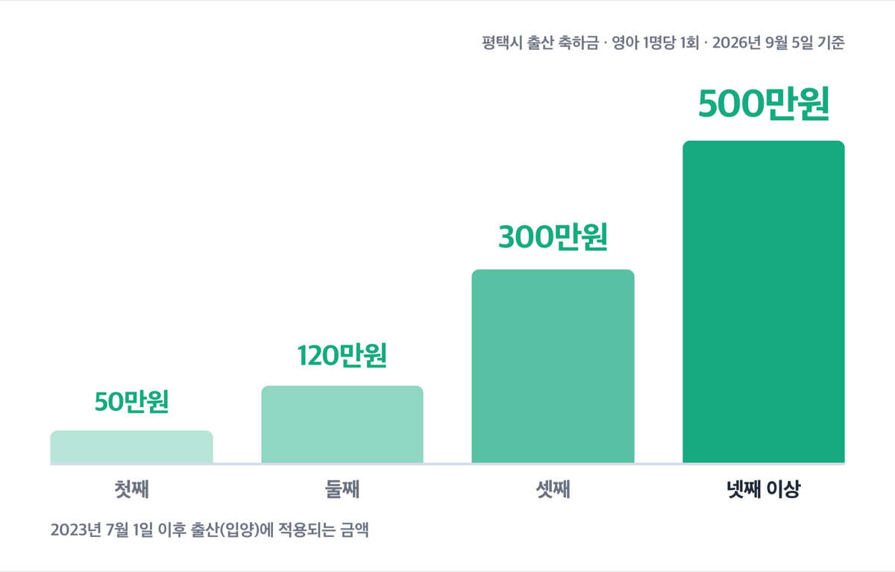
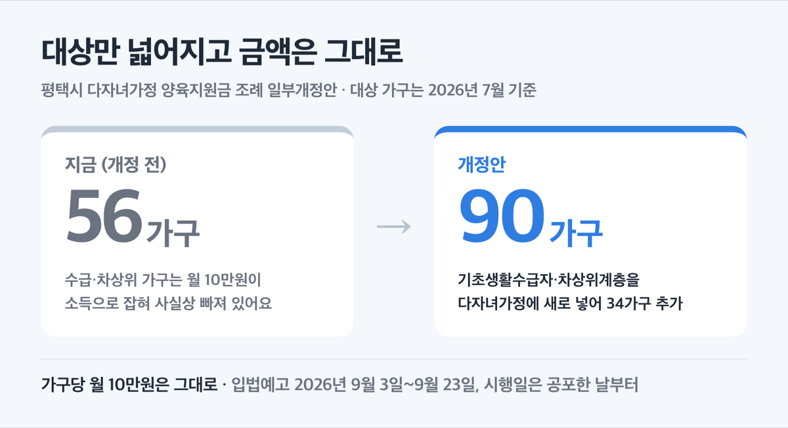
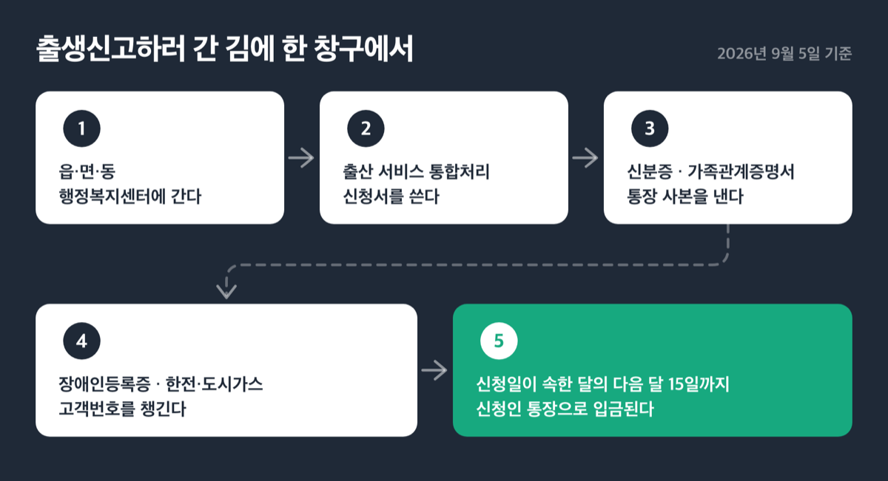
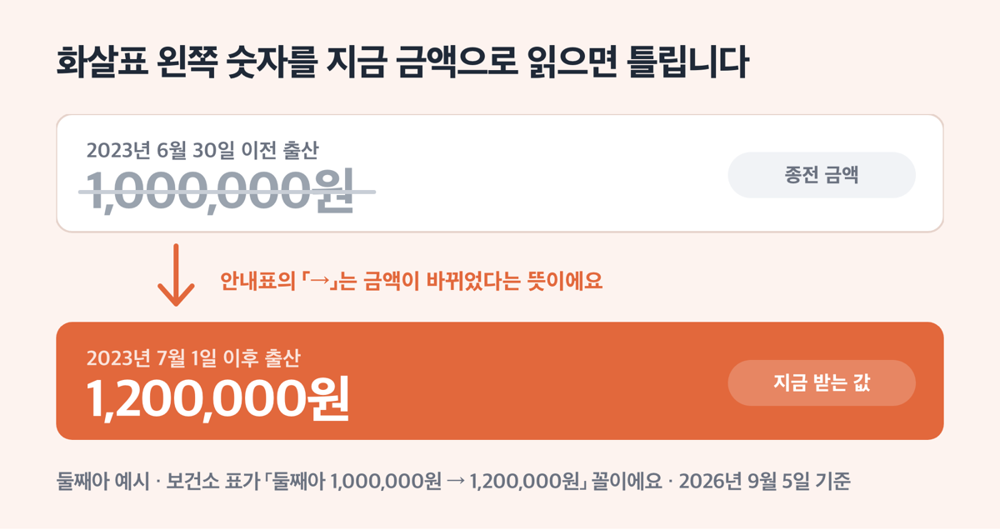

# 평택시 출산지원금 2026, '최대 500만원' 신청은 6개월 안에

📌 2026년 9월 5일 기준

평택시 출산지원금을 검색하면 둘째 100만원, 셋째 200만원이라고 적힌 곳이 유난히 많아요. 그건 2023년 6월 30일 이전에 출산한 사람에게 주던 옛 금액입니다. 지금은 둘째 120만원, 셋째 300만원이에요.

**3줄 요약**

- 평택시 출산 축하금은 첫째 50만원 · 둘째 120만원 · 셋째 300만원 · 넷째 이상 500만원이고, 영아 한 명당 딱 한 번 나와요.
- 2023년 7월 1일 이후 출산부터 이 금액이 적용되고, 같은 날부터 장애인 가정 출산지원금과 중복으로 받을 수 있게 바뀌었어요.
- 먼저 확인할 것은 거주 기간입니다. 출산일 기준 1년 전부터 신청일까지 부모 중 1명이 평택시에 주민등록이 있어야 해요.

평택시가 직접 주는 돈(출산 축하금 · 장애인 가정 출산지원금 · 다자녀 양육지원금)과 평택시 창구에서 신청하는 경기도·중앙 정부 돈을 나눠서 적었어요.

## 출산 축하금 — 첫째 50만원, 넷째 이상 500만원

평택시 출산 축하금은 평택시가 자체 예산으로 주는 현금이고, 자녀 순위에 따라 금액이 네 단계로 나뉩니다.

| 자녀 순위 | 출산 축하금 (영아 1명당, 1회) |
|---|---|
| 첫째 | 50만원 |
| 둘째 | 120만원 |
| 셋째 | 300만원 |
| 넷째 이상 | 500만원 |

*2023년 7월 1일 이후 출산(입양)한 경우에 적용되는 금액입니다. 그 이전 출산은 종전 규정을 따라요.*

쌍둥이 이상이면 영아별로 나눠서 지급해요. 쌍둥이가 첫째·둘째면 50만원과 120만원을 각각 받는 식입니다. 자녀 순위는 가족관계등록부에 올라 있는 순서로 세고, ==사망한 손위 형제자매도 순위에 포함==해요.

가장 많이 걸리는 건 금액이 아니라 거주 요건이에요.

출산일(입양일) 기준으로 **1년 전부터 신청일 현재까지** 부모 중 1명이 평택시에 주민등록을 두고 있어야 하고, 신생아 본인의 주민등록도 평택시에 있어야 합니다. 왜 1년이냐면, 출산 직전에 전입해서 돈만 받고 빠져나가는 것을 막으려고 잡아 둔 기준이기 때문이에요. 그래서 전입 시점이 늦으면 금액이 깎이는 게 아니라 아예 대상이 안 됩니다.

> 😕 이사 온 지 반년밖에 안 됐는데 그냥 못 받는 건가요?

아니에요. 거주 기간이 **1년 6개월을 지나면** 그때 대상이 됩니다. 다만 신청 기한이 달라져요. 원래는 출생·입양일부터 6개월 이내인데, 1년 미만 거주자는 1년 6개월이 지난 날부터 6개월 이내에 신청해야 합니다. 출생 6개월이 지났다고 포기하고 창구에 안 가는 경우가 여기서 나와요.

재혼 가정은 조건이 하나 더 붙어요. 이전 혼인 중에 낳은 자녀는 이번에 출산한 신생아의 출산일 **이전에** 주민등록상 같은 세대원(동거인 포함)으로 올라 있어야 자녀 순위에 들어갑니다. 출산하고 나서 세대를 합치면 순위 계산에 안 들어가요.

조례에 「예산의 범위에서」, 보건소 안내에 「예산 소진 시까지」라고 적혀 있어요. 예산이 걸린 사업이니 출생신고할 때 같이 신청하는 게 가장 안전합니다.

### 장애인 가정은 여기에 100만~150만원을 더 받습니다

신생아의 부 또는 모가 「장애인복지법」 제32조에 따라 등록한 장애인이면, 출산 축하금과 **별개로** 출산지원금이 나와요. 첫째아부터 나옵니다.

| 구분 | 출산지원금 (영아 1명당, 1회) |
|---|---|
| 장애 정도가 심한 장애인 | 150만원 |
| 심하지 않은 장애인 | 100만원 |

부모가 모두 등록 장애인이어도 중복해서 두 번 주지는 않고, 높은 금액 한쪽으로 지급해요. 부와 모가 각각 심한 장애·심하지 않은 장애면 150만원 하나입니다.

핵심은 출산 축하금과 겹쳐 받을 수 있다는 것이에요. 조례가 이렇게 정하고 있습니다.

> 출산지원금은 출산축하금에 추가하여 지원할 수 있으며, 다른 법령이나 조례에 따라 출산지원금 등을 지원받는 사람에게도 지급한다.
> — 평택시 출산축하ㆍ지원금 지원 조례 제4조제4항

그래서 장애인 가정에서 첫째를 낳으면 출산 축하금 50만원에 출산지원금 150만원(심한 장애)을 더해 200만원이 됩니다. 중복 지급은 2023년 7월 1일 출생아부터 적용돼요. 신청할 때 장애인등록증을 함께 내면 됩니다.

## 산후조리비 50만원은 평택시가 아니라 경기도 사업이에요

평택시 보건소 창구에서 신청하지만, 돈을 주는 주체는 경기도예요. 그래서 도내 어느 시·군에서 낳아도 금액이 같고, 지급 수단만 그 시·군 지역화폐로 나옵니다. 평택은 **평택사랑카드**로 들어와요.

| 항목 | 경기도 산후조리비 지원 기준 (2026년 9월 5일 기준) |
|---|---|
| 금액 | 출생아 1명당 50만원 (지역화폐 카드형) |
| 다태아 | 쌍둥이 100만원 · 세쌍둥이 150만원 · 네쌍둥이 200만원 |
| 소득 요건 | 없음 |
| 신청 기한 | 출생일 포함 12개월 이내 |

==소득 기준이 아예 없어요.== 출생일과 신청일 현재 경기도에 주민등록이 있고 실제로 도내에 살고 있으면 됩니다. 부모 중 한 명은 대한민국 국적 소지자여야 하고, 부부 모두 외국인인 경우에는 체류자격 F-5(영주)일 때 예외적으로 지원해요.

신청은 출생등록을 한 읍·면·동 행정복지센터에 가거나 경기민원24(gg24.gg.go.kr)에서 온라인으로 합니다. 온라인은 **본인만** 되고 대리 신청과 외국인 신청은 안 돼요. 조부모가 대신 갈 때는 가족관계증명서와 위임장을 챙겨야 합니다.

### 공공산후조리원과 민간 산후조리원

평택시는 안중읍 송담리 건물을 2025년 6월 11일 매입하고 리모델링 설계에 들어갔어요. 2025년 6월 발표 당시 계획은 2026년 상반기 공사, 하반기 시범 운영, 2026년 12월 정식 개원이었습니다. 규모는 면적 1,500㎡, 산모실 15실이에요. 개원 일정과 이용 요금은 평택시 미래전략과에 확인하세요.

지금 이용할 수 있는 관내 민간 산후조리원은 6곳입니다.

| 산후조리원 | 주소 | 전화 |
|---|---|---|
| 예일퀸스하우스 | 평택시 중앙로 144(합정동) | 031-8054-7337 |
| 지엔 | 평택시 비전5로 3(비전동) | 031-1800-7050 |
| 라헨느 | 평택시 평택5로34번길 6-1(합정동) | 1670-9793 |
| (주)럭셔리포레 | 평택시 비전2로 121(비전동) | 031-651-8279 |
| 더네이쳐 | 평택시 송탄로 260(서정동) | 031-668-3579 |
| 이보리아 | 고덕여염7길 26, 3~4층(고덕동) | 031-664-5222 |

이용 요금은 조리원마다 달라요. 정원이 16명에서 30명까지 차이가 나니 전화로 직접 확인하세요.

## 다자녀 양육지원금 월 10만원, 지금 대상이 넓어지는 중입니다

셋째아 이상 자녀를 둔 가정에 **가구당 월 10만원**을 현금으로 줍니다. 셋째아 이상 자녀가 36개월이 되는 달까지 매달 나와요.

여기서 착각하기 쉬운 게 하나 있습니다. 36개월 이하 자녀가 둘이어도 가구당 단가는 그대로 월 10만원이에요. 아이 수만큼 곱해지지 않습니다.

조건은 셋입니다.

1. 셋째아 이상 자녀를 둔 가정에 36개월 이하 자녀가 있을 것
2. 셋째아 이상 자녀들과 보호자 모두가 신청일 현재 평택시에 주민등록이 함께 되어 있을 것
3. 재혼 가정은 서류로 증명되는 양쪽 자녀를 모두 자녀 수에 포함

학업으로 주민등록이 분리된 자녀는 예외로 인정해 줘요. 전입한 달부터 신청할 수 있고, 평택시를 떠나면 그달로 지원이 중지됩니다. 신청은 연중 아무 때나 주소지 관할 읍·면·동에서 하면 돼요.

> [!WARNING]
> 이 조례의 일부개정조례안이 2026년 9월 3일부터 9월 23일까지 입법예고 중입니다. **금액은 월 10만원 그대로**이고, 기초생활수급자와 차상위계층을 지원대상에 새로 넣는 내용이에요. 아래 내용은 개정 전인 현재 기준입니다.

개정안이 담은 것은 이렇습니다.

| 무엇 | 개정 내용 |
|---|---|
| 지원 대상 | 기초생활수급자·차상위계층을 다자녀가정에 포함 (제3조 제3항 신설) |
| 대상 가구 | 56가구 → 90가구 (34가구 추가, 2026년 7월 기준) |
| 지급 문구 | 「주민등록이 같이 되어 있는」 → 「주민등록상 동일 세대인」 |
| 시행일 | 공포한 날부터 |

추가로 드는 예산은 34가구 × 월 10만원 × 12개월 = 연 4,080만원이에요.

> 🤭 **뒤집어 읽으면** — 지금은 이 월 10만원이 공적이전소득으로 잡혀서 기초생활수급 가구가 사실상 받지 못하고 있어요. 개정안이 고치려는 게 바로 그 대목입니다.

수급·차상위 가구여서 그동안 신청을 미뤄 두셨다면, 저라면 9월 말 이후에 아동복지과(031-8024-2933)로 전화부터 해 보겠습니다. 공포한 날부터 시행이라 통과되면 곧바로 적용돼요.

## 신청은 읍·면·동 한 곳에서 끝납니다

출생신고를 하러 갈 때 「행복 출산 원스톱 서비스」로 한꺼번에 신청하면 됩니다. 부모급여, 출산 축하금, 출산지원금, 다자녀 요금 경감까지 한 창구에서 처리해요.

1. 출생신고 관할 읍·면·동 행정복지센터에 갑니다
2. 출산 서비스 통합처리 신청서를 씁니다
3. 신분증 · 가족관계증명서 · 통장 사본을 냅니다
4. 장애인 가정은 **장애인등록증**을, 다자녀 요금 경감을 함께 신청하려면 한전·도시가스 **고객번호**를 챙깁니다
5. 신청일이 속한 달의 다음 달 15일까지 신청인 통장으로 입금됩니다

입금되면 시에서 전화나 우편으로 알려 줘요. 기한만 다시 정리하면 이렇습니다.

| 지원금 | 신청 기한 |
|---|---|
| 출산 축하금 · 장애인 가정 출산지원금 | 출생(입양)일부터 6개월 이내 |
| 출산 축하금 (거주 1년 미만) | 1년 6개월 경과한 날부터 6개월 이내 |
| 경기도 산후조리비 | 출생일 포함 12개월 이내 |
| 다자녀 양육지원금 | 연중 (전입 월부터) |

중앙 정부와 경기도 지원도 같은 창구에서 이어집니다. 놓치기 쉬운 것만 추렸어요.

| 지원 | 금액 |
|---|---|
| 첫만남이용권 | 첫째 200만원 · 둘째 이상 300만원 (2024년 1월 1일 이후 출생아) |
| 부모급여 | 0~11개월 월 100만원 · 12~23개월 월 50만원 |
| 아동수당 | 월 10만원, 2026년부터 9세 미만(0~107개월)으로 확대 |
| 해산급여 | 생계·주거·의료급여 수급자 1인당 70만원 (쌍둥이 140만원) |
| 경기도 가족돌봄수당 | 아동 1명 월 30만원 · 2명 45만원 · 3명 60만원 |

부모급여와 아동수당은 **출생 후 60일 이내**에 신청해야 출생일이 속한 달부터 소급해 줍니다. 60일을 넘기면 신청한 달부터예요. 두 달치가 그냥 날아가는 구조라 출생신고와 같이 처리하는 게 맞습니다.

경기도 가족돌봄수당은 평택시가 2026년 3월 1일부터 시행한 신설 사업이에요. 생후 24~36개월 아동을 4촌 이내 친인척이나 이웃주민이 월 40시간 이상 돌보는, 중위소득 150% 이하 양육공백 가구가 대상입니다. 신청은 매월 1일부터 15일까지 경기민원24에서 양육자 본인이 해요. 평택시는 신청 2026년 2월~11월, 돌봄활동 지원 2026년 3월~12월 일정입니다.

## 평택시 안내문끼리 어긋나는 곳이 있습니다

평택시 홈페이지 안에서도 안내 문구와 값이 서로 다른 곳이 있습니다.

**첫째, 옛 금액이 화살표로 함께 적혀 있어요.** 보건소 표가 「둘째아 1,000,000원 → 1,200,000원」 꼴로 되어 있습니다. 왼쪽이 2023년 6월 30일 이전 금액이고 지금 값은 오른쪽이에요. 검색 결과 요약이 왼쪽 숫자를 긁어 가면서 「셋째 200만원」이라는 틀린 값이 퍼졌습니다.

**둘째, 「중복 지급 할 수 없으며」라는 옛 문구가 남아 있어요.** 같은 표의 비고 칸에는 「2023.7.1. 출생아부터 출산축하금과 출산지원금 중복지급 시행」이라고 적혀 있어 서로 어긋납니다. 조례 제4조제4항, 평택시가 2026년 3월 16일 낸 보도자료, 경기도가 2026년 7월 1일 기준으로 정리한 시군별 표가 모두 중복 가능이에요. ==중복이 맞습니다.==

**셋째, 아동수당 안내 페이지가 낡았어요.** 시청 페이지는 아직 「만 8세 미만(0~95개월)」로 되어 있는데, 2026년 1월 1일부터 9세 미만(0~107개월)으로 넓어졌습니다.

**넷째, 다태아 배수 지급이 평택시 페이지에 없어요.** 평택 보건소는 산후조리비를 「50만원」으로만 적었고, 쌍둥이 100만원·세쌍둥이 150만원은 경기도 원문에만 나와요. 쌍둥이를 낳고 50만원만 받고 나오면 손해입니다.

**다섯째, 「생애주기별 인구정책 안내」는 2025년 상반기 기준이에요.** 사립유치원 셋째아 교육비(월 최대 5만원), 두 자녀 이상 가구 대학생 행복장학금(1학기 등록금 최대 200만원), 여성장애인 출산비용 지원(태아 1인 120만원)이 그 페이지에 있는데, 2026년 금액은 담당 부서에 확인하고 신청하세요.

창구 직원이 옛 문구를 보고 안내할 수도 있어요. 그럴 때는 「조례 제4조제4항에 추가 지원으로 되어 있다」고 짚으면 됩니다.

## 평택시 출산지원금 관련 궁금증 해결

**Q. 출산 축하금과 경기도 산후조리비를 둘 다 받을 수 있나요?**
A. 두 사업 모두 상대 사업과의 중복을 막는 문구가 없고, 행복 출산 원스톱 서비스에서 함께 신청하도록 안내하고 있어요. 신청할 때 창구에서 두 건으로 접수되는지 확인하세요.

**Q. 셋째를 낳으면 300만원에 다자녀 양육지원금까지 같이 받나요?**
A. 네, 성격이 다른 사업이에요. 출산 축하금 300만원은 한 번 나오고, 다자녀 양육지원금 월 10만원은 그 아이가 36개월이 되는 달까지 매달 따로 나옵니다. 다만 다자녀 양육지원금은 읍·면·동에 별도로 신청해야 해요.

**Q. 첫째를 낳았는데 위에 사망한 형이 있어요. 순위가 어떻게 되나요?**
A. 가족관계등록부 기준이고 사망한 손위 형제자매도 포함해서 셉니다. 이 경우 둘째로 계산돼요.

**Q. 출생 6개월이 지났는데 방법이 없나요?**
A. 평택시 거주가 1년 이상이었다면 기한이 지난 것이 맞습니다. 다만 출산 당시 거주 기간이 1년 미만이었다면 1년 6개월이 지난 뒤에 6개월의 기한이 새로 열려요. 본인이 어느 쪽인지 평택보건소 모자보건팀(031-8024-4357)에 확인하세요.

**Q. 지원 대상이 아닌데 받았으면 어떻게 되나요?**
A. 조례에 시장이 지체 없이 환수한다고 되어 있습니다. 순위 계산이나 거주 기간이 애매하면 받기 전에 물어보는 편이 낫습니다.

정리하면 평택시에서 아이를 낳고 받는 돈은 크게 셋이에요. 평택시가 주는 출산 축하금 50만~500만원, 장애인 가정이면 여기 더해지는 100만~150만원, 경기도가 주는 산후조리비 50만원입니다. 여기에 셋째부터는 월 10만원이 36개월까지 붙어요. 저라면 출생신고하러 가는 날 하루에 다 접수하고 나오겠습니다. 창구를 두 번 가는 것보다 서류 한 번 더 챙기는 게 쉬워요.

기한을 놓치면 되살릴 방법이 없습니다. 지금 달력에 출생일 + 6개월을 표시해 두세요.

참고: 평택시 출산축하ㆍ지원금 지원 조례 · 평택시 다자녀가정 양육지원금 지급 조례 · 평택시 공고 제2026-2777호 입법예고 · 평택시 보건소 출산장려지원 안내 · 평택시 2026년 새해 달라지는 제도 · 경기도 출산장려금 및 양육비 지원현황 · 경기민원24 산후조리비 지원 · 경기도뉴스포털 가족돌봄수당 안내
