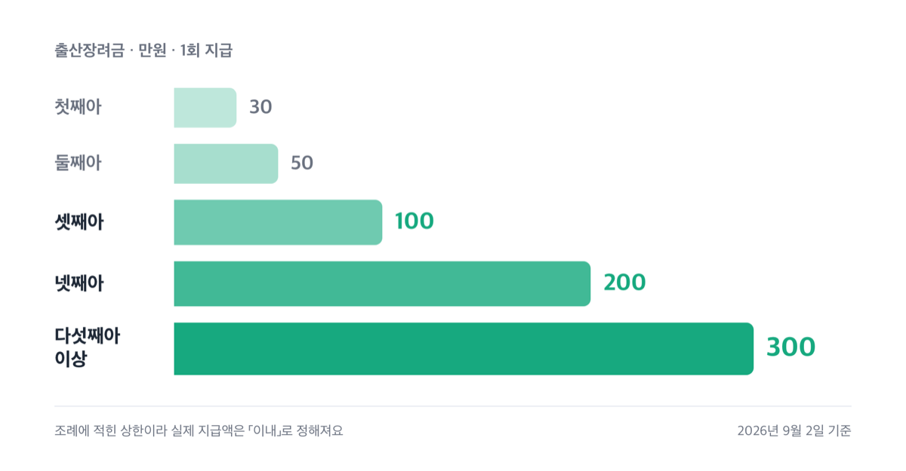
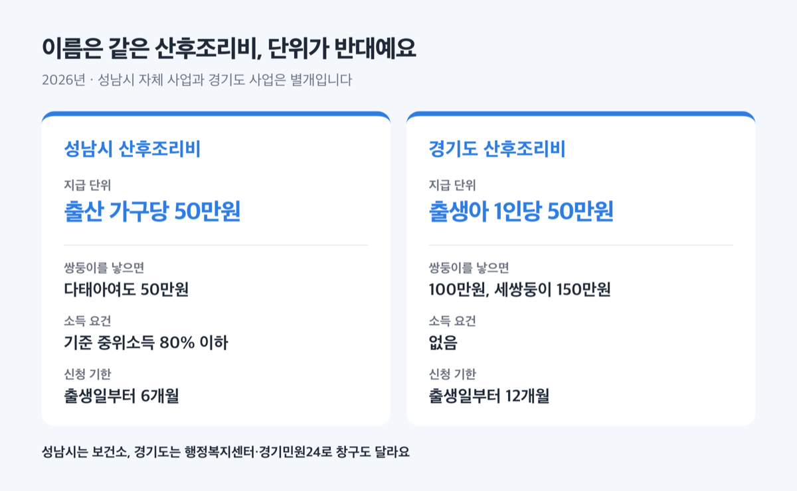
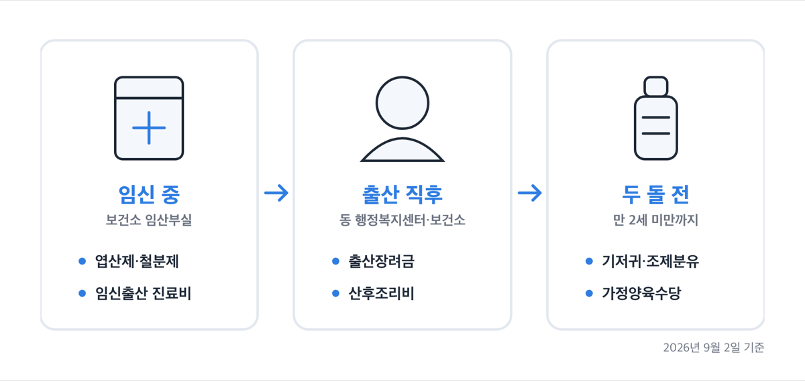
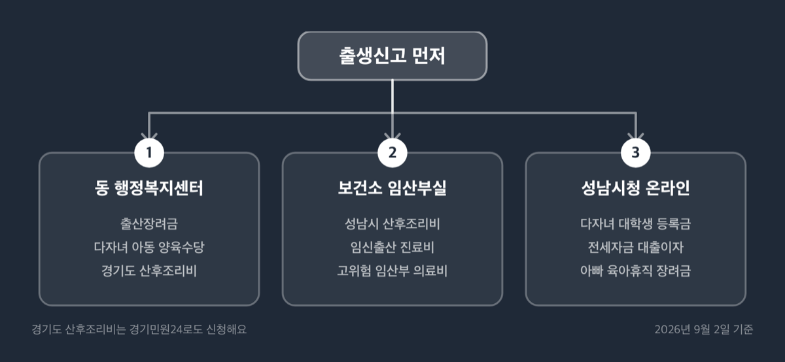
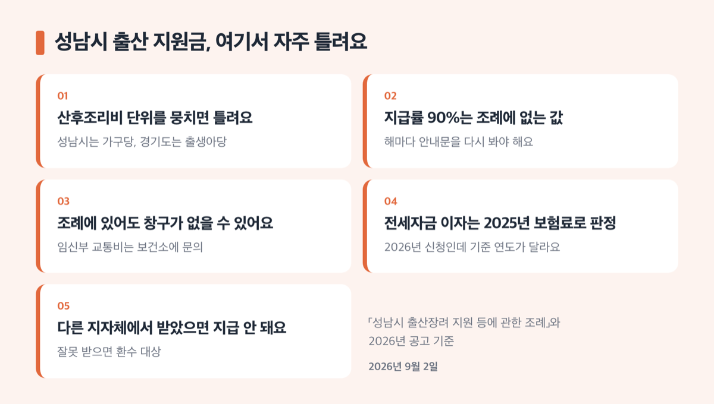

# 성남시 출산 육아 지원금 2026, 최대 300만원 받는 순서

📌 2026년 9월 2일 기준

성남 산후조리비 50만원, 하나인 줄 알았어요. 성남시 지원과 경기도 지원이 따로 있고, 지급 단위가 서로 반대예요. 쌍둥이 가구면 여기서 50만원이 왔다 갔다 합니다.

**3줄 요약**

- 성남시는 출생 순위에 따라 출산장려금을 한 번 주고, 산후조리비와 다자녀 지원을 별도로 운영해요. 첫째 30만원부터 다섯째 이상 300만원까지입니다.
- 출산장려금 금액은 2024년 2월 19일 개정 조례 그대로예요. 2026년에 새로 생긴 것은 백일해 예방접종 지원이고, 아동수당은 9세 미만까지 넓어졌습니다.
- 먼저 확인할 것은 거주 기간입니다. 출산일 기준으로 성남시에 180일 이전부터 주민등록이 있어야 출산장려금 대상이 돼요.

> [!WARNING]
> 2026년 2학기 성남시 다자녀가구 대학생 등록금 지원 접수가 **2026년 9월 30일 24시**에 끝납니다. 주말과 공휴일을 포함한 30일이고, 기간이 지나면 접수 자체가 되지 않아요.

출산장려금·산후조리비·다자녀 혜택·임신 단계별 지원·신청 창구·함정까지 순서대로 적었어요.

## 💰 성남시 출산장려금 — 첫째 30만원, 다섯째부터 300만원

성남시 출산장려금은 출생 순위에 따라 한 번만 주는 현금이에요. 금액은 「성남시 출산장려 지원 등에 관한 조례」 제4조에 있고, 2024년 2월 19일 개정 이후 바뀌지 않았습니다.

| 출생 순위 | 지급액 (성남시 출산장려금, 1회 지급) |
|---|---|
| 첫째아 | 30만원 이내 |
| 둘째아 | 50만원 이내 |
| 셋째아 | 100만원 이내 |
| 넷째아 | 200만원 이내 |
| 다섯째아 이상 | 300만원 이내 |

표의 금액은 조례에 적힌 상한이에요. 조례가 "예산의 범위에서" 지원한다고 정해 두었고 금액도 "이내"로 적어 둔 값이라, 확정 지급액은 신청할 때 동 행정복지센터에서 확인하는 게 맞아요. 첫째아와 둘째아는 시가 발행한 상품권이나 체크카드로 줄 수도 있습니다.

받으려면 출산일 기준으로 신청인이 성남시에 180일 이전부터 주민등록을 두고 계속 살면서 자녀를 출생신고해야 해요.

> 😕 저는 출산 두 달 전에 성남으로 이사 왔는데요?

탈락이 아니에요. 조례 제3조 2항이 180일 미만 거주자를 따로 정해 뒀거든요. 출산일부터 180일이 지날 때까지 성남시에 주민등록을 두고 계속 살면 그때 대상이 됩니다. 거주 기간을 출산 전으로만 세지 않고 '출산 전이든 후든 180일'로 잡아 둔 구조예요. 대신 신청 기한도 함께 밀려서, 이 경우에는 180일이 지난 시점부터 3년 안에 신청하면 됩니다.

신청은 ==출산일부터 3년== 이내에 주소지 동 행정복지센터로 가면 돼요. 필요한 것은 출산 서비스 통합처리 신청서와 신청자 예금통장 사본 1부입니다. 저라면 출생신고하러 가는 날 통장 사본을 같이 챙겨 갑니다. 창구가 같은 동 행정복지센터라서 한 번에 끝나거든요.

입금 시점에는 규칙이 있어요. 동장이 매달 1일부터 말일까지 받은 신청서를 다음 달 10일까지 구청장에게 보내고, 구청장이 그달 20일까지 신청인 계좌로 넣습니다. 그래서 월초에 넣든 월말에 넣든 입금은 다음 달 20일로 모여요.

주의할 조항이 둘 더 있습니다. 다른 지방자치단체에서 같은 성격의 지원금을 이미 받았으면 성남시는 지급하지 않아요. 대상이 아닌 사람이 받은 사실이 확인되면 구청장이 지체 없이 환수해야 합니다.

문의는 성남시 여성가족과 031-729-2916입니다.

그런데 산후조리비로 넘어가면 계산이 한 번 꼬여요.

## 산후조리비 50만원이 두 개예요

성남시 산후조리비와 경기도 산후조리비는 이름이 비슷하지만 별개 사업이에요. 지급 단위, 소득 요건, 신청 기한, 창구가 전부 다릅니다.

| 구분 | 성남시 산후조리비 (2026년, 시 자체 사업) | 경기도 산후조리비 (2026년, 경기도 사업) |
|---|---|---|
| 지급 단위 | 출산 가구당 최대 50만원 | 출생아 1인당 50만원 |
| 다태아 | 다태아여도 가구당 50만원 | 쌍둥이 100만원, 세쌍둥이 150만원 |
| 소득 요건 | 기준 중위소득 80% 이하 | 없음 |
| 신청 기한 | 출생일부터 6개월 | 출생일부터 12개월 |
| 지급 형태 | 현금(계좌), 영수증 심사 | 지역화폐 |
| 창구 | 관할 보건소 | 관할 행정복지센터 또는 경기민원24 |

성남시 것부터 볼게요. ==가구당 50만원==이 상한이고, 산후조리원 본인부담금이나 산모·신생아 건강관리 지원사업 본인부담금의 90%를 줍니다. 실제로 낸 금액을 심사해서 계좌로 넣는 방식이라, 영수증에 적힌 금액이 작으면 50만원을 다 받지 못해요. 산모 이름이 적힌 본인부담금 납부 영수증이 핵심 서류인 이유예요.

거주 요건은 출생일 기준 6개월 전부터 성남시에 계속 주민등록을 두고 신청일 현재 거주하는 부 또는 모입니다. 부부 중 한 명은 대한민국 국적 소지자여야 해요. 소득은 최근 월 건강보험료로 봅니다.

**2026년 성남시 산후조리비 소득 기준 (기준 중위소득 80%, 월 소득과 직장가입자 건강보험료)**

| 가구원수 | 월 소득 기준 | 건강보험료 직장 |
|---|---|---|
| 2인 | 3,360,000원 | 121,170원 |
| 3인 | 4,288,000원 | 153,904원 |
| 4인 | 5,196,000원 | 187,565원 |
| 5인 | 6,046,000원 | 216,335원 |
| 6인 | 6,845,000원 | 248,148원 |

**같은 기준의 지역가입자·혼합 건강보험료 (2026년, 월)**

| 가구원수 | 지역가입자 | 혼합(직장+지역) |
|---|---|---|
| 2인 | 49,863원 | 122,382원 |
| 3인 | 89,039원 | 155,648원 |
| 4인 | 130,472원 | 189,970원 |
| 5인 | 151,065원 | 219,571원 |
| 6인 | 188,592원 | 252,088원 |

두 표 모두 노인장기요양보험료를 뺀 금액이에요. 맞벌이 부부는 건강보험료가 낮은 쪽을 50% 경감해서 합산합니다.

> **솔직히 말하면** — 맞벌이 4인 가구에서 직장 건강보험료 합산 187,565원은 생각보다 빡빡한 선이에요. 경감 규정을 안 보고 단순 합산으로 계산했다가 지레 포기하는 경우가 나올 만한 대목입니다.

신청은 출생일부터 6개월 이내에 산모 주소지 관할 보건소 임산부실에서 해요. 분당구는 모자보건상담실입니다. 산모가 타지역이면 영아 아버지 주소지 관할 보건소로 갑니다. 문의는 수정구 031-729-3845, 중원구 031-729-3907, 분당구 031-729-3775예요.

경기도 산후조리비는 성격이 다릅니다. ==출생아 1인당 50만원==을 지역화폐로 주고 소득 요건이 없어요. 출생일과 신청일 현재 경기도 주민등록이 있고, 신청일 기준 아이가 12개월 미만이면 됩니다. 다태아는 사람 수만큼 곱해서 나와요.

지역화폐라서 쓰는 데도 조건이 붙어요. 해당 지역 가맹점에서만 쓰고, 시·군 사이 교차 사용과 온라인몰 사용은 안 됩니다. 사용 기간은 원칙적으로 카드형 3년, 지류형 5년이에요.

신청은 출생 등록한 관할 행정복지센터를 찾아가거나 경기민원24(https://gg24.gg.go.kr)에서 온라인으로 합니다. 온라인은 출생신고를 마친 뒤 본인만 가능하고 외국인은 안 돼요. 문의는 수정구 031-729-3845, 중원구 031-729-3903, 분당구 031-729-3963입니다.

두 사업을 함께 받을 수 있는지는 신청 전에 관할 보건소에 확인하세요. 창구가 서로 달라서 한쪽에서만 물으면 답이 안 나오는 경우가 있어요.

## 다자녀 가구는 여기서 금액이 커집니다

성남시 다자녀 지원은 매달 들어오는 현금과 해마다 신청하는 목돈으로 나뉘어요. 조례가 시장에게 매년 지원 계획을 세우도록 정해 둬서, 금액보다 공고 시점을 챙기는 쪽이 실속 있습니다.

| 사업 | 얼마 | 요건과 기한 |
|---|---|---|
| 다자녀 아동 양육수당 | 월 10만원 | 셋째 이상 7세(취학 전), 동 행정복지센터 방문 |
| 다자녀사랑 안심보험 | 상해·질병 단체보험, 7년 보장 | 12개월 미만 셋째 이상 영아 |
| 다자녀 자동차 표지 | 공영주차요금 50% 감면 | 막내가 18세 이하인 두 자녀 이상 가정 |
| 대학생 등록금 | 학기별 최대 100만원, 연 200만원 | 최대 8회, 2026년 2학기 접수 9월 30일까지 |
| 전세자금 대출이자 | 대출 잔액의 1.5%, 연 최대 100만원 | 최대 5년, 2026년 접수 12월 18일까지 |

대학생 등록금부터 봅니다. 최대 8회는 소속 학과 정규학기 수를 뜻해요. 자격은 넷입니다. 공고일 기준 학생과 보호자 1명 이상이 1년 이상 성남시 주민등록이 있어야 하고, 2026년 1월 1일 기준 30세 미만 미혼이어야 해요. 재학생은 직전학기 12학점 이상을 이수하고 100점 만점 80점, 즉 B학점 이상이어야 합니다. 신입·편입·재입학생은 첫 학기 성적을 보지 않아요. 대학은 한국장학재단 국가장학금 지원 대학이어야 하고 대학원과 외국 대학은 빠집니다.

등록금 지원 범위도 따로 따져 봐야 합니다. 지원 대상은 국가장학금과 교내외 장학금, 부모 직장 장학금을 뺀 실제 본인 부담액입니다. 입학금과 수업료처럼 학교에 꼭 내야 하는 돈만 해당하고 학생회비 같은 선택경비는 빠져요. 휴학생은 대상이 아닙니다.

접수는 성남시청 홈페이지(https://www.seongnam.go.kr) 통합예약 > 행정복지 > 지원금에서 하고, 서류는 snwf@korea.kr로 보냅니다. 지급은 한국장학재단 중복지원방지시스템 확인을 거쳐 11월 중이에요. 문의는 031-729-2914입니다.

전세자금 대출이자 지원은 조건이 더 촘촘해요. 신청일 현재 부모와 자녀 모두 성남시에 주소를 두고 실제로 살아야 하고, 18세 이하 자녀가 3명 이상이며, 기준 중위소득 180% 이하 무주택 가구여야 합니다. 대출은 제1·2금융권에서 용도가 '임차' 또는 '전세'로 적힌 주택 전세자금 대출만 인정돼요. 신용대출과 일반대출은 안 됩니다.

**2026년 다자녀 전세자금 대출이자 소득 기준 (기준 중위소득 180%, 월 소득과 직장가입자 건강보험료)**

| 가구원수 | 월 소득 기준 | 건강보험료 직장 |
|---|---|---|
| 4인 | 11,691,000원 | 432,308원 |
| 5인 | 13,603,000원 | 490,306원 |
| 6인 | 15,401,000원 | 584,741원 |
| 7인 | 17,128,000원 | 634,423원 |
| 8인 | 18,854,000원 | 712,921원 |

자녀 3명 이상이 요건이라 표가 4인 가구부터 시작해요. 맞벌이는 부부 건강보험료를 합산하고, 함께 사는 직계존속의 건강보험료는 합산하지 않습니다. 장기요양보험료는 뺀 금액이에요.

대상 주택은 성남시에 있는 단독·다가구·다세대·연립·아파트·주거용 오피스텔입니다. 건축물대장상 주택이 아닌 다중주택이나 옥탑층은 안 돼요. 생계·의료·주거급여 수급자, 국민·영구·LH매입·LH전세·공무원 임대 같은 공공임대 거주자, 배우자나 직계혈족과 맺은 임대차, 확정일자 없는 개인 간 계약도 제외입니다.

신청은 2026년 2월 3일부터 12월 18일까지 성남시청 홈페이지에서 하고 서류는 같은 메일로 냅니다. 온라인 접수 뒤 15일 안에 구비서류를 내지 않으면 반려돼요. 지급은 신청일로부터 30일 이내 계좌 입금입니다. 문의는 031-729-2915예요.

## 임신부터 두 돌까지, 성남시 창구에서 더 챙길 것

앞의 셋 말고도 단계마다 붙는 지원이 있어요. 임신 중, 출산 직후, 두 돌 전으로 나눠서 보면 빠뜨리는 게 줄어듭니다.

| 무엇 | 얼마 (2026년 기준, 원) | 언제·어디서 |
|---|---|---|
| 임신출산 진료비 | 본인부담금의 90%, 임신 1회당 최대 20만원 | 바우처 소진 후, 보건소 임산부실 |
| 고위험 임산부 의료비 | 90% 이내, 1인당 300만원 이내 | 분만일부터 6개월 이내 |
| 청소년산모 의료비 | 임신 1회당 120만원 범위 | 만 19세 이하, 전자바우처 온라인 |
| 산모·신생아 건강관리 | 건강관리사 최단 5일~최장 40일 | 출산예정일 40일 전~출산 후 60일 |
| 기저귀·조제분유 | 기저귀 월 9만원, 조제분유 월 11만원 | 만 2세 미만, 출생 60일 내 신청 |
| 가정양육수당 | 월 10만원 | 24~86개월 미만, 기관 미이용 |
| 아빠 육아휴직 장려금 | 최소 월 10만원, 최대 6개월 | 2026년 접수 12월 18일까지 |

임신출산 진료비 지원은 국민행복카드 바우처를 다 쓴 다음에 발생한 비용이 대상이에요. 그래서 바우처가 남아 있으면 신청해도 계산이 되지 않습니다. 고위험 임산부 의료비는 19대 고위험 임신질환으로 입원 치료를 받은 경우이고, e-보건소나 아이마중 앱, 보건소에서 신청해요. 이 둘은 조례 제7조에 따라 중복 지원이 되지 않습니다. 어느 쪽 금액이 큰지 따져 보고 하나를 고르는 구조예요.

기저귀·조제분유는 2026년 7월에 문턱이 낮아졌어요. 기초생활보장·차상위·한부모에 더해, 기준 중위소득 100% 이하 장애인 가구와 자녀 2명 이상 다자녀 가구가 들어왔습니다. 중위소득 100% 기준액은 2인 4,200,000원, 3인 5,360,000원, 4인 6,495,000원, 5인 7,557,000원, 6인 8,556,000원이에요. 출생일부터 60일까지 신청하면 24개월분을 받습니다.

아빠 육아휴직 장려금은 성남시 자체 사업입니다. 「고용보험법」 육아휴직급여 상한액과 실제 받은 급여의 차액을 최대 6개월간 주고, ==최소 월 10만원==은 보장돼요. 육아휴직이 6개월보다 짧으면 실제 휴직한 기간만큼 주고, 나눠 썼으면 6개월까지 합산합니다. 신청 자격은 육아휴직급여 수급자인 남성 성남시민이고, 신청일 기준 1년 이상 성남시 주민등록이 있어야 해요. 신청은 육아휴직 시작 1개월 이후부터 종료 후 12개월 이내이고, 지급은 신청일 다음 달 25일 안에 계좌로 들어옵니다. 문의는 031-729-2916이에요.

2026년에 새로 생긴 것도 있어요. 백일해 예방접종 지원은 임산부 본인뿐 아니라 배우자와 양가 부모까지 대상입니다. 임산부는 임신 27~36주 또는 출산 후 60일 이내, 배우자와 조부모는 임산부 기준 임신 27주부터 출산 후 60일 이내에 받아요. 임산부는 임신할 때마다 되지만, 배우자와 조부모는 최근 10년 안에 접종하지 않은 사람만 됩니다.

등록장애인 가정이면 금액이 크게 올라갑니다. 성남시 장애인가정 출산장려금이 영유아 1인 100만원이고 쌍생아 이상은 50%를 더해 150만원이에요. 여기에 국비로 나오는 여성장애인 출산비용 지원이 신생아 1인당 120만원입니다. 보건복지부 지침상 두 사업은 중복 지급이 되고, 안내 예시로 국비 120만원과 시비 100만원을 합쳐 총 220만원이 적혀 있어요.

물품과 검사, 대여로 나오는 지원도 따로 있습니다. 보건소에 임산부로 등록하면 12주 이내 엽산제와 16주 이상 철분제를 받고, 임신성 당뇨검사와 분만 전 혈액검사가 붙습니다. 임산부 자동차 표지는 공영주차장 요금 50% 감면과 전용주차구역 이용이고, 유효기간은 발급일부터 분만예정일 이후 6개월까지예요. 전동유축기는 출산일부터 3개월 이내 산모에게 30일간 택배로 빌려줍니다. 분당구 출생아는 생애초기 건강관리 방문 서비스를 출생 후 8주 이내에 신청할 수 있어요.

## 신청 절차 — 창구는 셋입니다

성남시 지원금은 사업마다 창구가 달라요. 한 곳에서 다 되지 않습니다. 세 갈래로 외워 두면 헛걸음이 줄어요.

1. **출생신고를 합니다.** 성남시에 출생신고를 해야 뒤의 사업이 전부 연결돼요.
2. **동 행정복지센터에서 현금성 지원을 신청합니다.** 출산장려금, 다자녀 아동 양육수당, 다자녀사랑 안심보험, 경기도 산후조리비가 여기예요. 출산 서비스 통합처리 신청서와 통장 사본을 챙깁니다.
3. **보건소에서 의료·조리 지원을 신청합니다.** 성남시 산후조리비, 임신출산 진료비, 고위험 임산부 의료비, 유축기 대여가 보건소 임산부실 소관이에요. 분당구는 모자보건상담실입니다.
4. **성남시청 홈페이지에서 온라인 사업을 신청합니다.** 다자녀 대학생 등록금, 다자녀 전세자금 대출이자, 아빠 육아휴직 장려금 셋은 통합예약 메뉴로 접수하고 서류를 snwf@korea.kr로 보냅니다.
5. **경기도 사업은 경기민원24도 됩니다.** 경기도 산후조리비는 출생신고를 마쳤으면 온라인으로 넣을 수 있어요.

산후조리비 서류는 미리 모아 두는 편이 낫습니다. 신청인과 배우자 신분증, 신청서와 개인정보 동의서, 영아의 부 또는 모 주민등록등본·초본, 부모의 건강보험증 또는 자격확인서, 건강보험료 납부확인서, 본인부담금 납부 영수증, 통장 사본이 필요해요. 행정정보 공동이용에 동의하면 주민등록과 건강보험 서류는 빼도 됩니다.

## 놓치기 쉬운 것 다섯

1. **산후조리비 단위를 뭉치면 틀립니다.** 성남시는 가구당, 경기도는 출생아당이에요. 쌍둥이 가구에서 이 차이가 그대로 금액이 됩니다.
2. **성남시 산후조리비의 '90%'는 조례에 없는 값이에요.** 조례 제15조는 가구당 최대 50만원까지만 정했고, 지급률 90%는 2026년 안내문과 사업 안내에만 적혀 있습니다. 해마다 안내문을 다시 확인해야 하는 숫자예요.
3. **조례에 있다고 신청이 되는 건 아닙니다.** 「성남시 임신·출산 지원에 관한 조례」 제14조에는 임신부 교통비가 있어요. 의료기관 1회 방문마다 5만원, 총 50만원 이내입니다. 그런데 성남시 복지사업 안내와 보건소 사업 목록, 2026년 고시공고와 새소식 어디에도 이 사업의 신청 창구가 없어요. 신청 가능 여부는 관할 보건소에 문의하세요.
4. **전세자금 대출이자는 2026년 신청인데 2025년 건강보험료로 판정합니다.** 공고문에 그렇게 적혀 있어요. 표 제목이 '2026년 판정 기준표'라서 올해 보험료로 착각하기 쉬운 대목입니다.
5. **다른 지자체에서 출산지원금을 받았으면 성남시 출산장려금은 나오지 않아요.** 조례 제3조 3항입니다. 이사 직후 출산한 경우에 특히 걸리고, 잘못 받으면 환수 대상이 됩니다.

하나 더 덧붙이면, 정부가 같은 사업을 하면서 금액이 조례 금액을 넘으면 시장이 지급을 중단할 수 있고, 모자라면 차액을 줄 수 있어요. 조례 제12조에 있는 조항이라 중앙 제도가 바뀌면 성남시 금액도 움직입니다.

## 성남시 출산 지원금 관련 궁금증 해결

**Q. 쌍둥이를 낳으면 출산장려금은 어떻게 되나요?**

A. 조례 제4조 2항이 태아 출생 순서로 구분해서 지원하도록 정해 뒀어요. 첫 출산이 쌍둥이면 첫째아 기준과 둘째아 기준을 각각 적용합니다. 성남시 산후조리비는 반대로 다태아여도 가구당 최대 50만원이고, 경기도 산후조리비만 출생아 수만큼 곱해서 나와요.

**Q. 출산 전에 이사 와서 180일이 안 됩니다. 못 받나요?**

A. 받을 수 있어요. 출산일부터 180일이 지날 때까지 성남시에 주민등록을 두고 계속 살면 그 시점에 대상이 됩니다. 신청 기한도 그 시점부터 3년이에요.

**Q. 성남시 산후조리비와 경기도 산후조리비를 둘 다 받을 수 있나요?**

A. 조례가 중복을 막아 둔 것은 임신출산 진료비와 고위험 임산부 의료비 사이예요. 두 산후조리비 사이는 조례와 안내문에 규정이 없습니다. 신청 전에 관할 보건소에 확인하세요.

**Q. 산후조리원에 안 가고 산모·신생아 건강관리만 이용했는데 성남시 산후조리비가 되나요?**

A. 됩니다. 지원 범위가 산후조리원 본인부담금 또는 산모·신생아 건강관리 지원사업 본인부담금의 90%예요. 산모 이름이 적힌 본인부담금 납부 영수증을 챙기면 돼요.

**Q. 아빠 육아휴직 장려금은 월에 얼마나 받나요?**

A. 육아휴직급여 상한액과 실제 받은 급여의 차액이고, 2026년 성남시 공고문이 최소 월 10만원으로 적어 뒀어요. 상한액은 「고용보험법 시행령」이 정하고 2024년 12월 24일에 개정됐어요. 본인 기준 금액은 성남시 여성가족과 031-729-2916으로 문의하세요.

---

성남시 지원금을 한 줄로 줄이면, 금액은 조례가 정하고 시점은 공고가 정합니다. 출산장려금처럼 3년이 열려 있는 것도 있지만, 대학생 등록금은 30일이고 산후조리비는 6개월이에요. 저라면 출생신고를 한 날 동 행정복지센터와 보건소 두 곳의 기한부터 적어 놓고 시작합니다. 놓쳐서 못 받는 금액이 조건에 걸려서 못 받는 금액보다 커 보이거든요.

다자녀 가구라면 순서를 바꿔서 보는 게 낫습니다. 한 번 받고 끝나는 출산장려금보다 매달 나오는 양육수당과 해마다 갱신하는 전세자금 대출이자 쪽이 몇 년 단위로 보면 금액이 큽니다. 전세자금 지원은 연 1회씩 최대 5년이라 첫해에 신청 흐름을 만들어 두면 이후가 수월해요.

참고: 「성남시 출산장려 지원 등에 관한 조례」 · 「성남시 임신·출산 지원에 관한 조례」 · 성남시청 복지사업 안내 · 성남시 공고 제2026-2090호 · 성남시 공고 제2026-334호 · 성남시 공고 제2026-494호 · 「2026년 성남시 달라지는 행정제도」 · 경기도청 출산장려금 및 양육비 지원현황('26.7.1. 기준) · 경기민원24 산후조리비 지원
