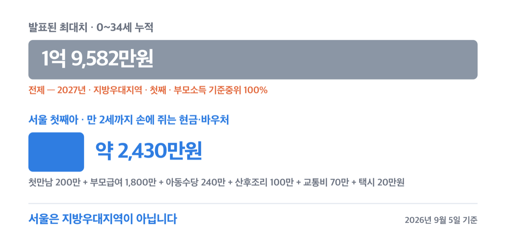
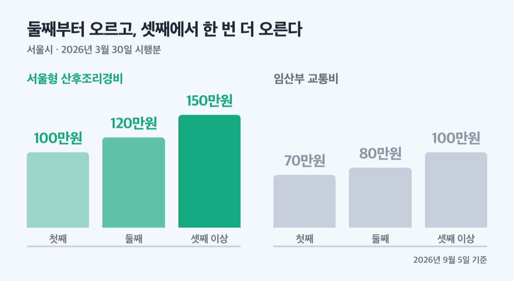
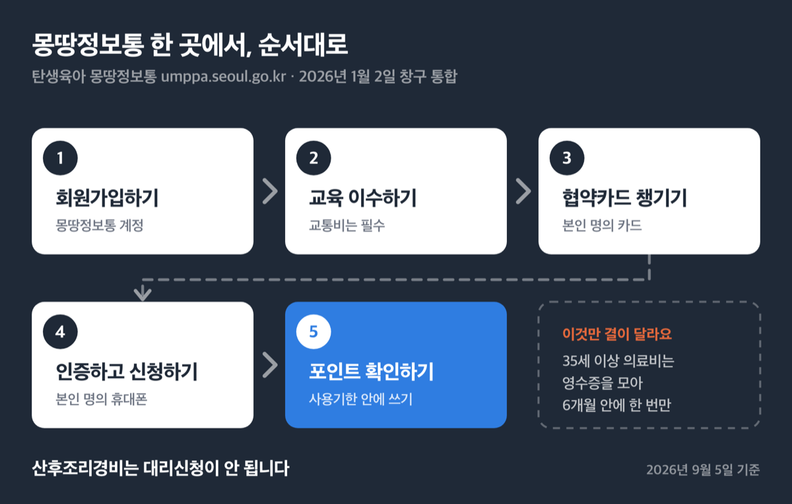
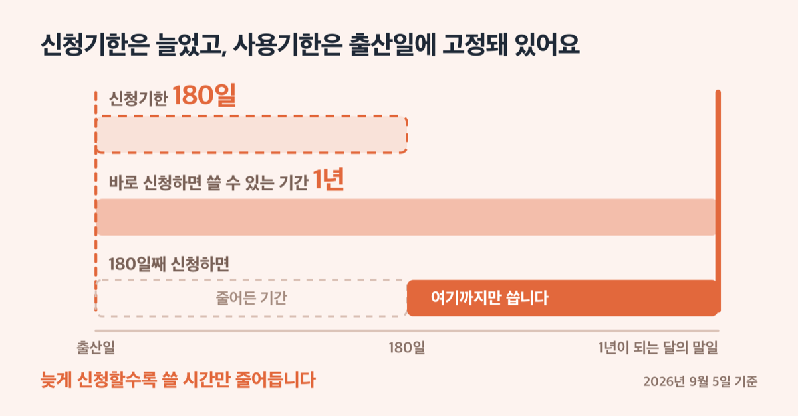

# 서울시 출산지원금 2026년, 2억은 서울 얘기가 아니에요

📌 2026년 9월 5일 기준

1억 9,582만원. 2026년 8월 28일 관계부처 합동 발표에 나온 숫자예요. 그런데 이 값에는 전제가 하나 붙어 있고, 서울은 그 전제에 들어가지 않습니다.

**3줄 요약**

- 서울시가 주는 현금성 지원은 산후조리경비 첫째 100만원·둘째 120만원·셋째 이상 150만원, 임산부 교통비 첫째 70만원·둘째 80만원·셋째 이상 100만원이에요.
- 2026년 3월 30일부터 자녀 수에 따라 금액이 나뉘었고, 7월 1일부터는 신청일 기준 서울 90일 이상 거주해야 신청할 수 있습니다.
- 산후조리경비는 출산일로부터 180일 안에, 교통비는 출산 후 6개월 안에 탄생육아 몽땅정보통에서 신청해야 해요.

아래에서 화제의 숫자부터 정리하고, 서울시가 주는 것과 국가가 주는 것을 나눠 금액·자격·기한을 훑어요.

## 화제의 '2억', 서울에서 태어나면 얼마인가

기획예산처 등 관계부처가 2026년 8월 28일 발표한 「청년 성장단계별 종합투자 추진전략」에 나온 값이에요. 0~34세까지 최대 1억 9,582만원, 0~18세까지는 최대 1억 4,057만원이에요.

문제는 각주예요. 원문은 이 금액을 **"2027년 지방우대지역에서 첫째로 태어나는 경우를 가정(부모소득 기준중위 100%)"**한 값이라고 적어 두었어요.

==서울은 지방우대지역이 아닙니다.== 수도권이라 아동수당 지역 추가분도 0원이에요. 비수도권은 월 5천원, 인구감소지역은 월 1만원 또는 2만원이 얹히지만 서울은 기본 월 10만원 그대로예요.

> 😕 그럼 서울에서는 얼마를 받나요?

서울 거주 첫째아 가정이 출생 전후부터 만 2세까지 실제로 손에 쥐는 현금·바우처를 더하면 **약 2,430만원**입니다. 첫만남이용권 200만원 + 부모급여 1,800만원 + 아동수당 240만원 + 서울형 산후조리경비 100만원 + 임산부 교통비 70만원 + 엄마아빠택시 20만원이에요.

다만 이 2,430만원은 기관이 발표한 총액이 아니라, 기관이 밝힌 단가에 개월 수를 곱해 더한 값이에요. 무주택 요건까지 맞아 주거비를 받으면 720만원이 더 붙어 약 3,150만원이 되고, 중간에 자격을 잃거나 어린이집을 이용하면 이 값이 아니에요.

이 발표에 담긴 혼인지원금 100만원, 아이맞이지원금 1,000만~2,000만원, 아동기본수당(0~1세 월 최대 60만원·2~12세 월 최대 30만원)은 모두 **2027년 7월 시행**으로 발표됐어요. 2026년에 태어난 아이는 이 개편의 대상이 아닙니다.

> 🤭 **솔직히 말하면** — 헤드라인 숫자 하나를 그대로 옮겨 놓은 글이 너무 많아요. 각주 두 줄만 읽으면 서울 이야기가 아니라는 게 바로 보여요.

## 서울시가 주는 돈 — 산후조리경비 150만원까지

서울시가 주는 임신·출산 현금성 지원은 산후조리경비, 임산부 교통비, 무주택 주거비, 35세 이상 의료비, 1인 자영업자 출산급여 다섯이에요. 금액과 기한부터 볼게요.

| 지원 항목 (2026년, 서울시) | 금액 | 신청 기한 |
|---|---|---|
| 서울형 산후조리경비 | 첫째 100만 / 둘째 120만 / 셋째 이상 150만원 | 출산일로부터 180일 이내 |
| 임산부 교통비 | 첫째 70만 / 둘째 80만 / 셋째 이상 100만원 | 임신 확인 후 ~ 출산 후 6개월 |
| 자녀출산 무주택가구 주거비 | 월 최대 30만원, 2년 최대 720만원 | 출산 후 1년 이내 |
| 35세 이상 임산부 의료비 | 임신 1회당 최대 50만원 | 출산(유산) 후 6개월 이내, 1회만 |
| 1인 자영업자 출산급여(서울시분) | 90만원 (다태아 170만원) | 출산일로부터 1년 이내 |

산후조리경비는 현금이 아니라 포인트예요. 산모·신생아 건강관리, 의약품과 건강식품 구매, 한약 조제, 산후운동, 심리상담에 쓸 수 있고 사용기한은 출산일로부터 1년이 되는 달의 말일입니다. 산모와 출생 자녀가 서울에 살고 서울시에 출생신고를 해야 대상이에요.

교통비는 대중교통·택시·철도에 더해 자가용 유류비까지 돼요. 협약카드사 본인 명의 카드에 포인트를 얹어 주는 방식이라, 신한(국민행복카드)·삼성·KB국민·우리·하나·BC 계열 카드가 미리 있어야 해요.

무주택 주거비는 걸리는 곳이 많아요. 기준 중위소득 180% 이하에 부·모 모두 무주택이어야 하고, 공공임대주택에 살면 안 되며, 전세보증금 5억원 이하 또는 보증금 월세 환산액과 월세를 합쳐 229만원 이하, 전용 85㎡ 이하라야 해요. 신혼부부전용 전세자금대출·신생아 특례 버팀목·청년월세지원·주거급여를 받고 있으면 제외돼요.

개정 「서울특별시 출산 및 양육지원에 관한 조례」가 2026년 3월 30일 시행되면서 세 가지가 바뀌었어요.

| 시행 시점 (2026년, 서울시 기준) | 무엇이 달라졌나 |
|---|---|
| 2026년 3월 30일 | 산후조리경비·교통비가 자녀 수에 따라 나뉨. 산후조리경비는 2026-01-01 이후 출생아부터, 교통비는 2026-01-01 이후 신청 건부터 적용 |
| 2026년 1월 2일 | 신청 창구가 「탄생육아 몽땅정보통」으로 통합(서울맘케어는 2025-12-30 종료) |
| 2026년 7월 1일 | 두 사업 모두 신청일 기준 서울 90일 이상 거주 요건 추가, 바우처는 서울에서만 사용 |

산후조리경비 신청기한은 출산 후 60일에서 180일로, 교통비는 3개월에서 6개월로 늘었어요. 출산 후 두 달은 산모가 몸을 추스르다 그냥 지나가는 기간이라, 조례를 고치면서 신청 기간과 사용 기간을 같이 늘린 거예요.

2026년 1월 1일부터 3월 29일 사이에 이미 신청한 사람은 다시 신청하지 않아도 돼요. 추가 지원금이 소급 지급돼요.

여기에 서울형 안심 산후조리원도 2026년에 문을 열었어요. 6월 8일 4개소(양천 팰리스·강서 르베르쏘·도봉 마미캠프·강동 퍼스트스마일), 8월 3일 금천 VIP가 더해져 5개소이고 2027년 5월까지 1년 시범운영이에요.

| 안심 산후조리원 (13박 14일, 일반실) | 본인부담금 |
|---|---|
| 표준이용금액 | 390만원 |
| 1순위(기초·차상위·유공자 등) | 무료 |
| 2순위(다문화·장애인·한부모·셋째아 이상 등) | 125만원 |
| 3·4순위(쌍둥이·둘째아 / 그 외) | 250만원 |

신청일 기준 서울에 1년 이상 살고 있는 임산부만 돼요. 예약금은 순위와 무관하게 39만원 정액이고 1순위는 정산 때 돌려받아요. 시범운영 첫 달에 131명이 이용했고 먼저 연 4개소는 올해 예약 538명이 조기 마감됐어요.

## 국가가 주는 돈 — 서울도 똑같이 받아요

금액의 대부분은 사실 서울시가 아니라 국가에서 나와요. 서울 거주자라고 더 받거나 덜 받지 않아요.

| 국가 지원 (2026년, 서울 거주 기준) | 금액 | 기한·대상 |
|---|---|---|
| 첫만남이용권 | 첫째 200만원 / 둘째 이상 300만원 | 국민행복카드 바우처, 출생일로부터 2년 |
| 부모급여 | 0세 월 100만원 / 1세 월 50만원 | 0~23개월 |
| 아동수당 | 월 10만원 | 2026년부터 9세 미만 |

아동수당은 2026년 3월 20일 「아동수당법」 개정으로 대상이 9세 미만까지 넓어졌고, 2027년 10세, 2028년 11세, 2029년 12세, 2030년 13세 미만으로 매년 한 살씩 올라가요. 2026년 4월 24일에는 지급이 끊겼던 2017년 1월~2018년 3월생 43만 명에게 1~3월분 1,687억원이 소급 지급됐어요.

산모·신생아 건강관리 서비스는 국가 바우처인데, 접수는 거주지 자치구 보건소에서 해요. 기준중위소득 150% 이하가 기본이고, 쌍생아 이상이나 **둘째아 이상**은 소득과 무관하게 예외지원 대상이에요. 신청은 출산예정 40일 전부터 출산일로부터 60일까지, 바우처 유효기간은 출산일로부터 90일입니다.

자치구가 따로 주는 출산축하금은 이 글에 넣지 않았어요. 구마다 금액과 요건이 달라요. ==거주지 구청 출산 지원 안내에서 별도로 확인하세요.==

## 신청은 몽땅정보통 한 곳에서

2026년 1월 2일부터 서울시 임신·출산 지원 창구가 한 곳으로 합쳐졌어요. 순서대로 하면 돼요.

1. 탄생육아 몽땅정보통(umppa.seoul.go.kr)에 회원가입합니다.
2. 온라인 교육을 이수합니다. 임산부 교통비는 교육을 마쳐야 신청 버튼이 열려요. 방문신청도 마찬가지입니다.
3. 협약카드사 본인 명의 카드를 준비합니다. 교통비 포인트가 이 카드에 적립돼요.
4. 본인 명의 휴대폰으로 인증하고 신청합니다. 산후조리경비는 대리신청이 안 됩니다.
5. 포인트 적립을 확인하고 사용기한 안에 씁니다. 남은 금액은 기한이 지나면 사라져요.

35세 이상 의료비는 결이 달라요. 영수증을 모아 출산(유산) 후 6개월 안에 **한 번만** 청구하는 방식이라, 진료비를 낼 때마다 영수증을 챙겨 둬야 해요.

## 자주 걸리는 것 다섯

공식 안내를 그대로 읽어도 놓치기 쉬운 것을 모았어요.

1. **시행일과 출생일은 다릅니다.** 조례 시행은 2026년 3월 30일이지만 산후조리경비 증액은 2026년 1월 1일 이후 출생 자녀부터예요. 3월에 태어났다고 못 받는 게 아니에요.
2. **7월 1일부터 거주 기간을 봅니다.** 서울로 이사한 지 90일이 안 됐으면 산후조리경비도 교통비도 신청이 막혀요. 전입신고 날짜를 먼저 확인하세요.
3. **35세 이상 의료비는 국민행복카드 임산부 바우처와 동시에 쓸 수 없습니다.** 다른 카드로 결제한 뒤 청구해야 해요. 입원비·약제비·제증명 발급비는 대상이 아니에요.
4. **엄마아빠택시는 아이를 태우지 않으면 환수됩니다.** 연 10만원 포인트인데 영아 미동반 탑승이 확인되면 사용액을 돌려내야 해요. 운영업체는 타다와 파파 중 하나를 고르고 이후 변경이 안 돼요.
5. **부모급여 1,800만원이 전부 현금은 아닙니다.** 어린이집을 이용하면 보육료 바우처로 갈음돼 통장에 들어오는 금액이 줄어요.

> [!WARNING]
> 산후조리경비 포인트 사용기한은 출산일로부터 1년이 되는 달의 말일입니다. 신청을 늦게 하면 쓸 수 있는 기간이 그만큼 짧아집니다.

저라면 출산신고를 마치자마자 산후조리경비부터 신청합니다. 신청기한은 180일로 길어졌는데 사용기한은 출산일 기준으로 고정돼 있어서, 늦게 신청할수록 쓸 시간만 줄어들거든요.

## 서울시 출산지원금 관련 궁금증 해결

**Q. 서울에서 아이를 낳으면 정말 2억을 받나요?**
A. 아니에요. 1억 9,582만원은 2027년 지방우대지역에서 첫째로 태어나고 부모소득이 기준중위 100%인 경우를 가정한 값이에요. 서울은 지방우대지역이 아니고, 아동수당 지역 추가분도 없어요.

**Q. 산후조리경비와 임산부 교통비를 둘 다 받을 수 있나요?**
A. 돼요. 별개 사업이라 각각 신청해요. 다만 교통비는 온라인 교육을 마쳐야 신청 버튼이 열리고, 2026년 7월 1일 이후 신청 건은 둘 다 서울 90일 이상 거주 요건을 봐요.

**Q. 서울에 이사 온 지 두 달인데 신청할 수 있나요?**
A. 2026년 7월 1일부터는 신청일 기준 90일 이상 거주가 요건이라 아직 안 돼요. 다만 산후조리경비 신청기한이 출산일로부터 180일이라 90일을 채운 뒤 신청할 여유가 남는 경우가 많아요.

**Q. 우리 구에서 주는 출산축하금은 얼마인가요?**
A. 자치구별로 금액과 요건이 달라요. 거주지 구청 출산 지원 안내나 주민센터에서 확인하세요.

**Q. 난임 시술비는 소득 기준이 있나요?**
A. 서울시 난임부부 시술비 지원은 소득 기준이 없고 사실혼 부부도 돼요. 시술 종류 칸막이 없이 출산당 25회, 1회 상한은 신선배아 110만원·동결배아 50만원·인공수정 30만원이에요.

## 정리 — 먼저 할 일 하나

서울시가 2026년에 손을 댄 것은 금액만이 아니에요. 신청 창구를 몽땅정보통 한 곳으로 합쳤고, 신청 기간을 늘린 대신 거주 요건을 붙였어요. 그래서 지금 확인할 것은 두 가지입니다. 서울 전입 후 며칠이 지났는지, 그리고 출산일로부터 며칠이 지났는지.

이 둘만 확인하면 받을 수 있는지 없는지가 바로 정해집니다. 나머지는 몽땅정보통에서 순서대로 누르면 끝나요.

개별 자격 판정이나 소득·자산 요건 해석이 필요하면 거주지 구청 출산 담당 부서나 관할 보건소에서 확인하세요.

참고: 서울시 임신·출산 정보센터(seoul-agi.seoul.go.kr) · 탄생육아 몽땅정보통(umppa.seoul.go.kr) · 서울시 보도자료 「산후조리경비·임산부 교통비 둘째부터 더 받는다」 · 서울시 「2026 달라지는 서울 생활」 및 「2026 하반기 달라지는 서울 생활」 · 보건복지부 「아동수당 대상·금액 확대」 보도자료 · 관계부처 합동 「청년 성장단계별 종합투자 추진전략」
