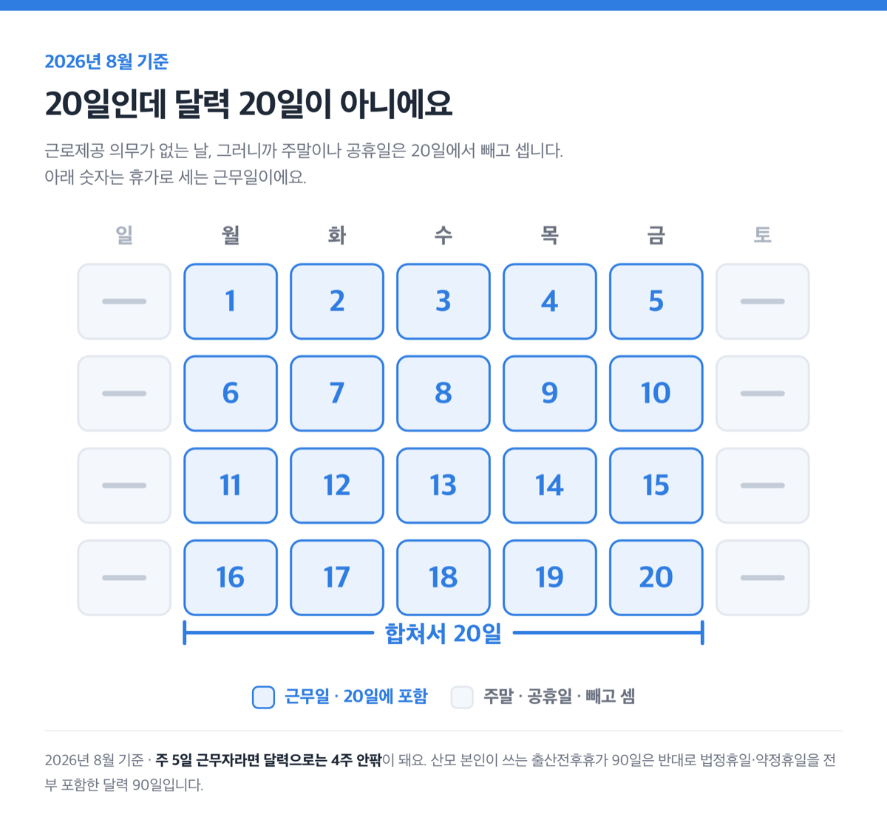
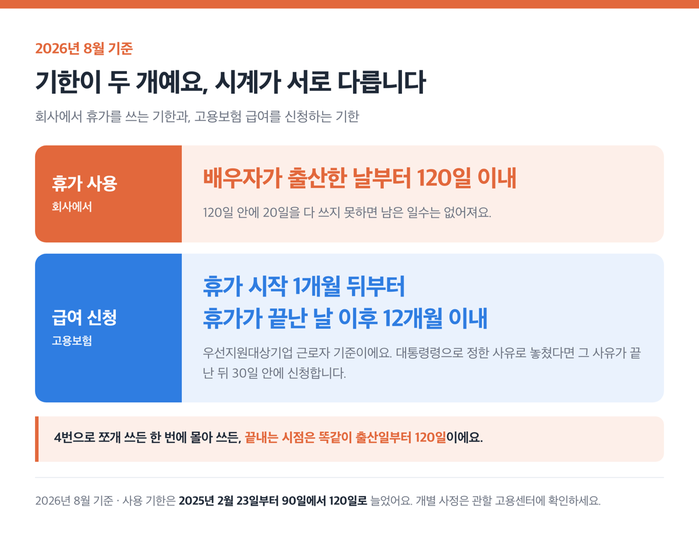
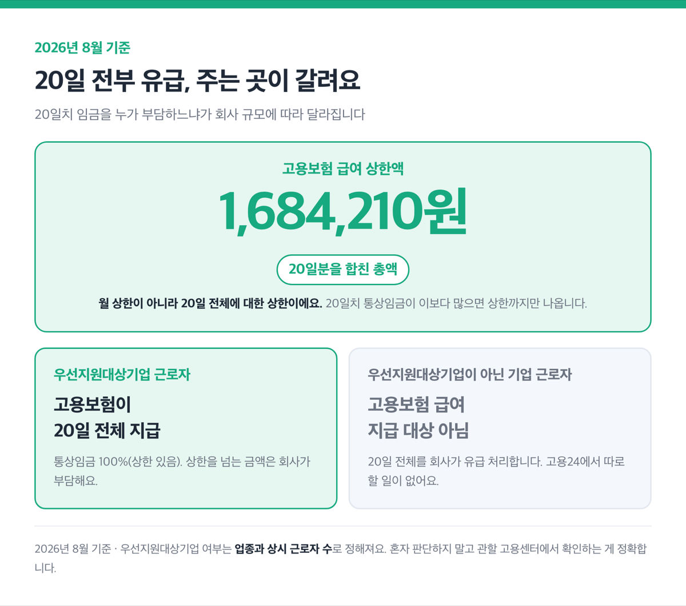
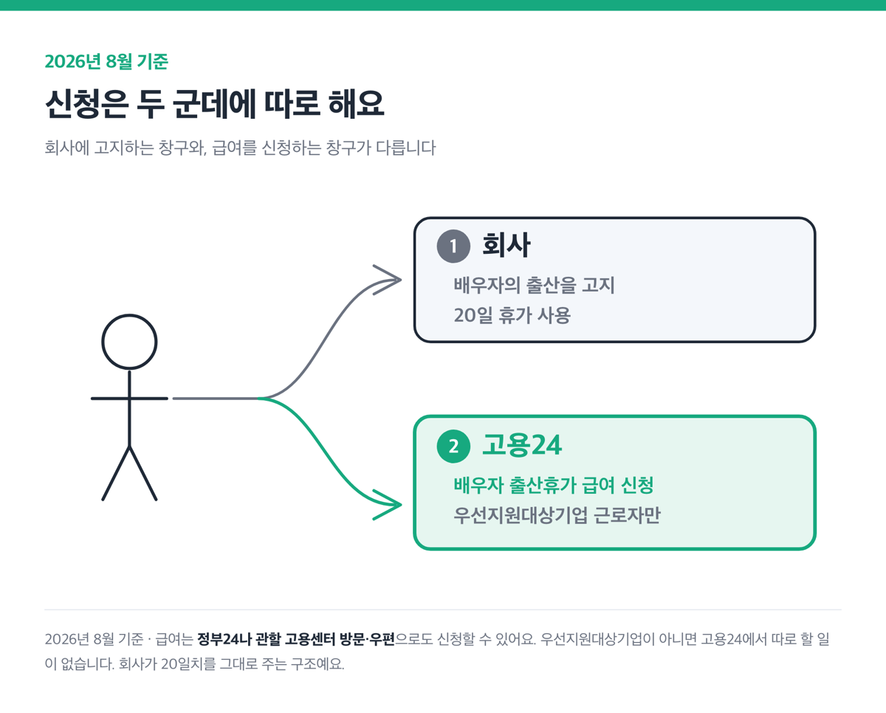
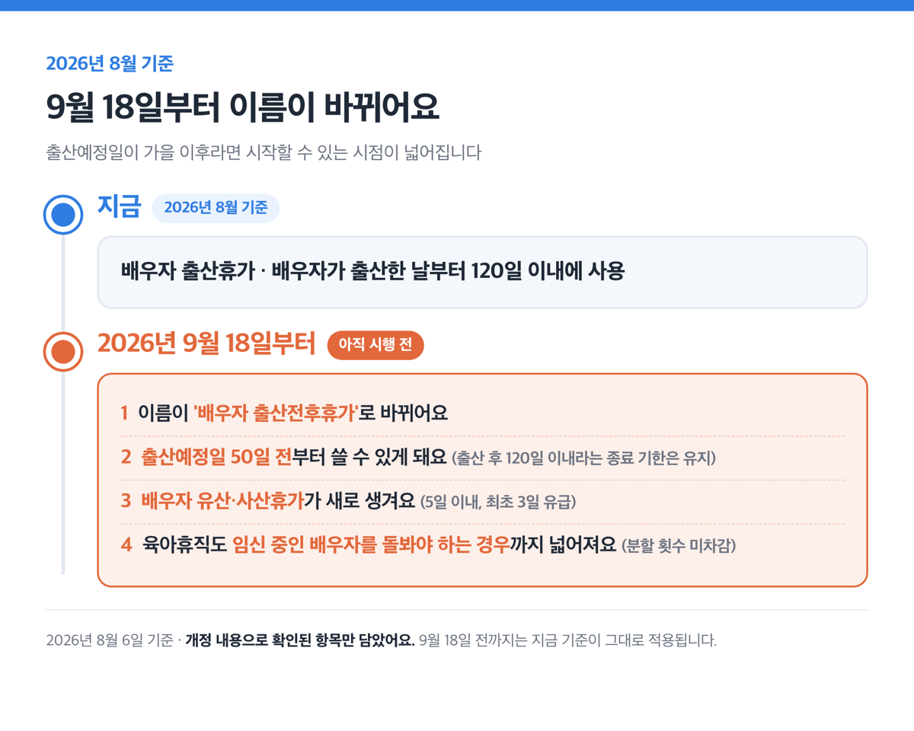
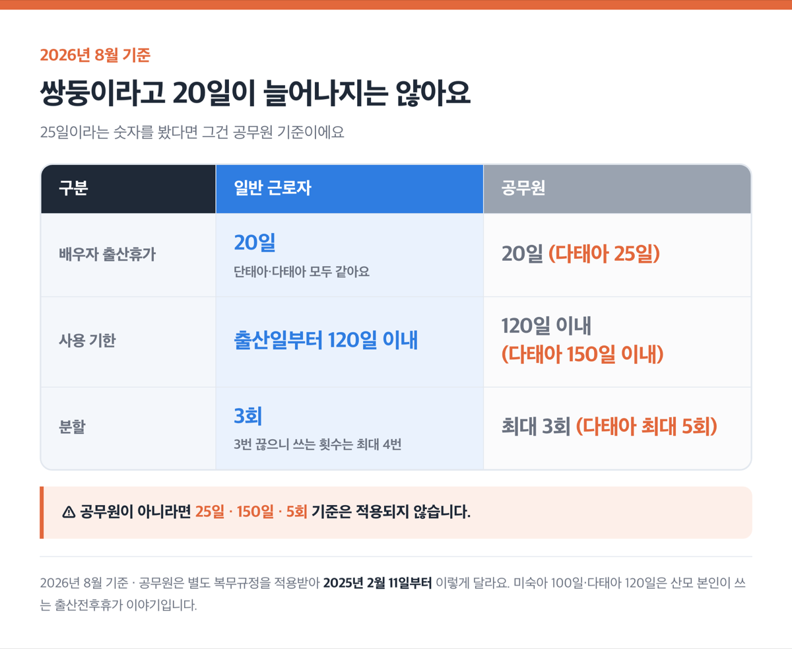
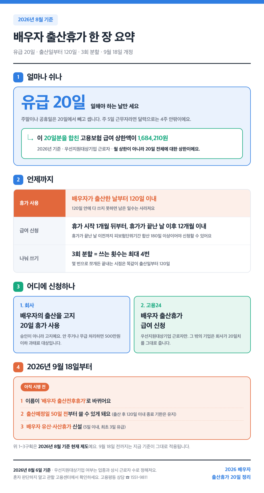

2026년 8월 6일 기준

<!-- 1차 경험 없음: 검색 재조합 글 -->

> [!SUMMARY]
> 결론부터요. 2026년 8월 기준 배우자 출산휴가는 20일이고, ==20일 전부 유급이에요==. 배우자가 출산한 날부터 120일이 지나면 남은 일수는 사라집니다.
>
> 우선지원대상기업(업종별 근로자 수로 정하는 중소기업이에요) 근로자라면 20일치 급여를 고용보험에서 받아요. 2026년 기준 상한액은 20일분을 다 합쳐 1,684,210원이고요.
>
> 근데 출산예정일이 가을 이후라면 확인할 게 하나 더 있어요. 9월 18일부터 제도가 바뀌거든요.

## 20일인데 달력 20일이 아니에요

배우자 출산휴가 20일은 일해야 하는 날만 세요.

근로제공 의무가 없는 날, 그러니까 주말이나 공휴일은 ==20일에서 빼고 셉니다==. 주 5일 근무자라면 달력으로는 4주 안팎이 돼요.

여기서 헷갈리는 지점이 하나 있어요. 산모 본인이 쓰는 출산전후휴가 90일은 반대거든요. 이쪽은 법정휴일·약정휴일을 전부 포함한 달력 90일이에요.

같은 집에서 두 휴가를 같이 쓰는데 계산법이 서로 다릅니다.

신청 방식도 눈여겨볼 만해요. 법 조문은 근로자가 배우자의 출산을 이유로 휴가를 '고지'하면 사업주가 20일을 줘야 한다고 정하고 있어요. 회사가 승인해 주는 구조가 아니에요. 휴가가 10일에서 20일로 늘어난 건 2025년 2월 23일부터고요.

## 기한이 두 개예요, 하나만 지키면 급여를 못 받습니다

기한이 두 개인데 서로 다른 시계로 돌아가요. 회사에서 휴가를 쓰는 기한과, 고용보험 급여를 신청하는 기한이에요.

| 무엇의 기한 | 언제까지 (2026년 8월 기준) |
|---|---|
| 휴가 사용 | 배우자가 출산한 날부터 120일 이내 |
| 급여 신청 | 휴가를 시작한 날 이후 1개월부터, 휴가가 끝난 날 이후 12개월 이내 |

> [!WARNING]
> 120일 안에 20일을 다 쓰지 못하면 남은 일수는 없어져요. 개정 전에는 이 기한이 90일이었는데 2025년 2월 23일부터 120일로 늘었어요.

급여 신청 기한은 천재지변처럼 대통령령으로 정한 사유로 놓친 경우에만 예외가 있어요. 그 사유가 끝난 뒤 30일 안에 신청해야 합니다.

휴가는 3회에 한정해서 나눠 쓸 수 있어요. 3번 끊는다는 뜻이라 쓰는 횟수는 최대 4번이에요. 자료마다 "3회 분할"과 "4번 분할"이 섞여 있는데, 둘은 같은 말이에요.

근데 4번으로 쪼개든 한 번에 몰아 쓰든, 끝내는 시점은 똑같이 출산일부터 120일입니다.

다만 쪼개기 전에 회사와 맞춰 볼 게 하나 있어요. 배우자 출산휴가를 20일 연속으로 준 우선지원대상기업 사업주는 업무분담지원금을 받을 수 있거든요. 2026년 7월 1일 이후 배우자 출산휴가를 쓰는 경우부터 이미 적용되고 있어요.

요건이 '20일간 연속 부여'예요. 분할 없이 한 번에 허용해야 한다는 뜻이라, 휴가를 나눠 쓰면 회사는 이 지원금을 받지 못합니다. 업무를 나눠 맡을 동료를 최대 5명까지 지정하고, 그 동료에게 별도 수당을 주는 것도 요건이고요.

지원 금액은 회사의 고용보험 가입 근로자가 30인 미만이면 최대 60만원, 30인 이상이면 최대 40만원이에요(2026년 기준). ==매달 나오는 돈이 아니라 배우자 출산휴가 한 번에 1회 지원입니다==. 회사가 받는 지원금이라 휴가를 쓰는 본인 통장에 들어오는 돈은 아니에요. 그래도 일정을 협의할 때 연속 20일이 회사에도 이득이라고 말할 근거는 됩니다.

## 회사 규모에 따라 급여를 주는 곳이 갈려요

20일 전부 유급인 건 어느 회사나 같아요. 근데 그 20일치 임금을 누가 부담하느냐가 회사 규모에 따라 갈립니다.

| 구분 | 고용보험 급여 | 회사 |
|---|---|---|
| 우선지원대상기업 근로자 | 20일 전체, 통상임금 100%(상한 있음) | 정부가 지급한 금액만큼 책임 면제, 상한 초과분은 회사 부담 |
| 우선지원대상기업이 아닌 기업 근로자 | 지급 대상 아님 | 20일 전체를 회사가 유급 처리 |

2026년 기준 급여 상한액은 20일분을 합쳐 1,684,210원입니다. 20일치 통상임금이 이보다 많으면 상한까지만 나오고, 통상임금보다 시간급 최저임금이 높으면 최저임금 기준으로 나와요.

여기서 헛걸음이 자주 생겨요. ==우선지원대상기업이 아닌 회사에 다니면 고용보험 급여 신청 대상이 아니에요==. 고용24에서 따로 할 일이 없습니다. 회사가 20일치를 그대로 주는 구조거든요.

우리 회사가 어느 쪽인지는 업종과 상시 근로자 수로 정해져요.

| 업종 | 우선지원대상기업 기준 (상시 근로자 수) |
|---|---|
| 제조업(산업용 기계·장비 수리업 제외) | 500명 이하 |
| 광업, 건설업, 운수·창고업, 정보통신업, 사업시설관리·사업지원 및 임대서비스업(부동산 이외 임대업 제외), 전문·과학 및 기술서비스업, 보건업 및 사회복지서비스업 | 300명 이하 |
| 도매 및 소매업, 숙박 및 음식점업, 금융 및 보험업, 예술·스포츠 및 여가 관련 서비스업 | 200명 이하 |
| 그 밖의 업종 | 100명 이하 |

표에서 괄호로 제외된 산업용 기계·장비 수리업과 부동산 이외 임대업은 대상에서 아예 빠지는 게 아니에요. '그 밖의 업종'으로 보고 100명 이하 기준을 적용합니다.

표의 인원을 넘어도 중소기업기본법상 중소기업이면 우선지원대상기업으로 봐요. 규모가 커져 기준을 벗어난 경우에도 그다음 연도부터 5년간은 우선지원대상기업으로 보고요.

그러니 "300명이 넘으니 우리는 아니겠네"라고 혼자 판단하지 마세요. 최종 판정은 관할 고용센터에서 확인하는 게 정확합니다.

## 신청은 두 군데에 따로 해요

순서는 간단해요.

1. 회사에 배우자의 출산을 알리고 20일 휴가를 씁니다.
2. 우선지원대상기업 근로자라면 [고용24](https://www.work24.go.kr/ei/b/a/1100/openHPEIBA1100M02.do)에서 급여를 신청해요. [정부24](https://www.gov.kr/mw/AA020InfoCappView.do?CappBizCD=14900000302)나 관할 고용센터 방문·우편으로도 됩니다.

고용24 급여 신청 화면은 로그인을 해야 열려요. 실무에서는 휴가가 끝난 뒤 한꺼번에 신청해요. 휴가가 끝난 날 이전까지 고용보험 가입기간(피보험단위기간)이 합산 180일 이상이어야 신청할 수 있어요.

챙길 서류는 네 가지예요.

- 출산전후휴가 급여등 신청서
- 배우자 출산휴가 확인서 — 최초 한 번만 내면 돼요
- 통상임금을 확인할 수 있는 자료(임금대장, 근로계약서 사본 등)
- 휴가 기간에 회사에서 금품을 받았다면 그것을 확인할 수 있는 자료

근데 휴가 기간에 이직하면 ==이직일부터 급여가 나오지 않아요==. 휴가 중에 다른 일을 해서 1주 소정근로시간이 15시간 이상이거나 월 150만원 이상 소득이 생겨도 지급이 제한됩니다.

배우자 출산휴가는 사는 지역이 아니라 다니는 회사가 기준이에요. 거주지 지자체가 따로 운영하는 출산 관련 지원이 있는지는 지자체에 별도로 확인해 보세요.

## 9월 18일부터 이름이 '배우자 출산전후휴가'로 바뀌어요 📅

2026년 9월 18일부터 개정 제도가 시행됩니다.

- 명칭이 '배우자 출산휴가'에서 '배우자 출산전후휴가'로 바뀌어요.
- 출산예정일 50일 전부터 쓸 수 있게 돼요. 출산 후 120일 이내라는 종료 기한은 유지되고요.
- 배우자 유산·사산휴가가 새로 생겨요. 5일 이내이고 최초 3일은 유급이에요.
- 육아휴직도 임신 중인 배우자를 돌봐야 하는 경우까지 넓어져요. 유산·조산 위험이 있을 때인데, 이때 쓴 건 분할 횟수에서 차감하지 않아요.

출산예정일이 가을 이후라면 휴가를 시작할 수 있는 시점이 넓어지는 셈이에요.

그 전에 8월 20일에도 하나가 시작돼요. 연 1회 1주 또는 2주 단위로 쓰는 [단기 육아휴직](/posts/childcare-childbirth/childcare-leave-2026/)이 새로 생깁니다. 배우자 출산휴가 자체가 이날 달라지지는 않아요.

## 쌍둥이라고 20일이 늘어나지는 않아요

일반 근로자는 단태아든 다태아든 배우자 출산휴가가 똑같이 20일이에요. 고용노동부 상담 답변도 같은 내용이고요.

25일이라는 숫자를 봤다면 그건 공무원 기준이에요. 공무원은 별도 복무규정을 적용받아서 2025년 2월 11일부터 이렇게 달라요.

| 구분 | 일반 근로자 | 공무원 |
|---|---|---|
| 배우자 출산휴가 | 20일 | 20일 (다태아 25일) |
| 사용 기한 | 출산일부터 120일 이내 | 120일 이내 (다태아 150일 이내) |
| 분할 | 3회 | 최대 3회 (다태아 최대 5회) |

> [!WARNING]
> 공무원이 아니라면 이 25일·150일·5회 기준은 적용되지 않습니다.

미숙아 100일, 다태아 120일이라는 숫자도 자주 섞여요. 그건 임신 중인 여성, 그러니까 산모 본인이 쓰는 출산전후휴가 이야기예요.

## 안 주거나 무급으로 처리하면 과태료 500만원입니다

근로자가 배우자의 출산을 이유로 휴가를 고지했는데 사업주가 휴가를 주지 않으면 500만원 이하의 과태료 대상이에요.

휴가를 못 쓰게 하는 것만 문제가 되는 게 아니에요. 휴가는 줬는데 무급으로 처리하는 것도 같은 과태료 대상입니다. 배우자 출산휴가를 이유로 해고하거나 그 밖의 불리한 처우를 하는 것도 금지돼 있고요.

회사와 이야기가 풀리지 않으면 고용노동부 고용평등 심층 상담 서비스(1551-9811)에 문의할 수 있어요. 개별 사정 판단은 관할 고용센터나 상담 창구에서 받는 게 정확해요.

> [!TIP]
> 20일을 다 쓴 뒤에 이어서 볼 카드는 육아휴직이에요. [2026 육아휴직 정리](/posts/childcare-childbirth/childcare-leave-2026/)에서 확인해 보세요.

> [!ACTION]
> 오늘 할 일은 두 가지예요. 회사에 출산 예정을 알리고, 우리 회사가 우선지원대상기업인지 확인하세요.

참고: 국가법령정보센터 남녀고용평등법 · 고용노동부 일생활균형 배우자 출산휴가 안내 · 고용24 배우자 출산휴가급여 안내 · 찾기쉬운 생활법령정보(법제처) · 대한민국 정책브리핑
