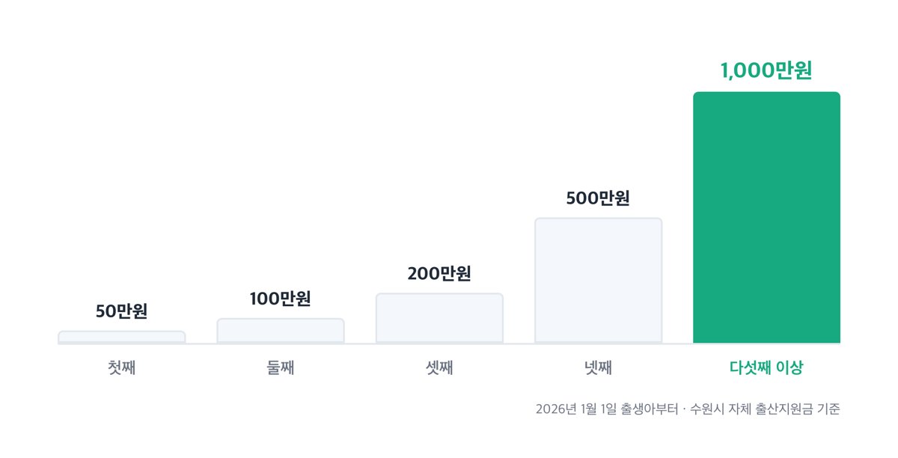
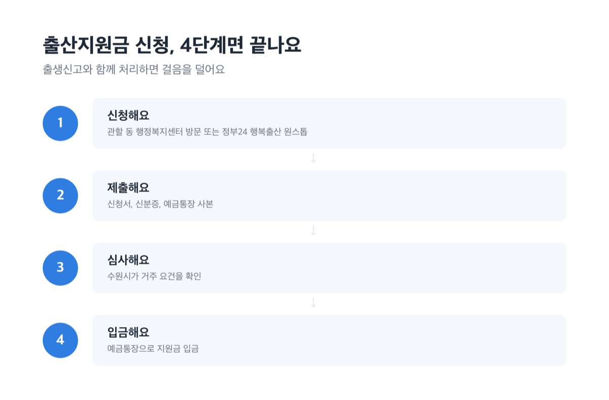
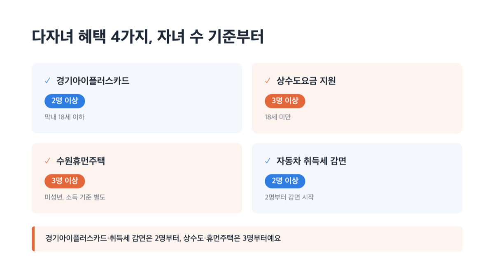
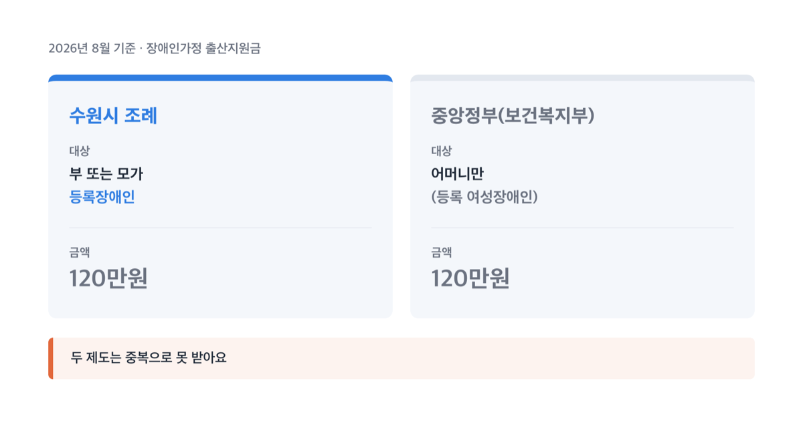

# 수원시 출산지원금 얼마 받나, 2026년부터 첫째도 50만원

📌 2026년 8월 31일 기준

작년까지 수원시 출산장려금은 둘째부터 나왔어요. 2026년 1월 1일 출생아부터는 첫째도 50만원을 받습니다. 그런데 자녀 순위마다 지급 방식이 완전히 달라요.

**3줄 요약**
- 수원시 자체 출산장려금은 첫째 50만원, 둘째 100만원, 셋째 200만원, 넷째 500만원, 다섯째 이상 1,000만원(분할 지급)이에요.
- 2026년 1월 1일 출생아부터 첫째 지원금이 새로 생기고 둘째 지원금이 100만원으로 올랐어요. 그 전 출생아는 종전 규정(둘째부터)을 따릅니다.
- 신청은 출생일부터 1년 이내, 수원시에 180일 이상 주민등록·거주해야 받을 수 있어요.

여기서는 자녀 순위별 지급액과 신청 자격, 산후조리비·다자녀 혜택 차이까지 순서대로 정리했어요.

## 수원시 자녀 출산·입양 지원금이란 — 2026년부터 뭐가 바뀌었나

수원시 자녀 출산·입양 지원금은 수원시가 자체 조례로 주는 현금성 지원금이에요. 국가나 경기도가 아니라 수원시 예산으로 나갑니다.

이 조례는 2025년 11월 13일 개정됐고, 2026년 1월 1일 출생아부터 새 기준이 적용돼요. 첫째자녀 지원금이 새로 생긴 게 가장 큰 변화입니다.

왜 갑자기 첫째부터 주기 시작했을까요. 그동안은 둘째부터만 지원해서 외동이나 첫째만 있는 집은 대상이 아니었는데, 인구 감소 대응 차원에서 대상을 넓힌 거예요.

2025년 12월 31일 이전에 태어난 아이는 이 확대 대상이 아니에요. 종전 규정대로 둘째부터 지원받습니다.

> 저는 작년 12월에 첫째를 낳았는데, 저도 50만원 받나요?

그러면 대상이 아니에요. 조례는 출생일 기준으로 나뉘고, 2026년 1월 1일 0시 출생아부터 적용됩니다.

결론은 하나입니다. 출생일이 1월 1일을 넘겼는지부터 확인하세요.

## 💰 수원시 출산지원금, 자녀 순위별 지급액과 신청 자격

자녀 순위별 금액부터 표로 볼게요.

| 자녀 순위 (2026년 1월 1일 출생아 기준) | 지급액 (수원시 자체 지원) |
|---|---|
| 첫째 | 50만원 |
| 둘째 | 100만원 |
| 셋째 | 200만원 |
| 넷째 | 500만원 |
| 다섯째 이상 | 1,000만원 |

다섯째 이상은 1,000만원을 한 번에 다 주지 않아요. 신청할 때 600만원을 먼저 주고, 신청 1년 뒤부터 분기마다(1·4·7·10월) 100만원씩 나눠서 채워줍니다. 생일 용돈을 한 번에 안 주고 매달 나눠 주는 것과 비슷한 구조예요.

그러니까 다섯째 지원금을 완전히 다 받으려면 신청 시점부터 최소 1년 넘게 수원시에 계속 살아야 해요.

세쌍둥이 이상을 출산했다면 순위별 지원금에 더해 500만원을 추가로 받아요. 이것도 신청할 때 200만원을 먼저 받고, 다음 분기부터 분기마다 100만원씩 나눠 받아요.

입양이면 얘기가 달라요. 첫째~셋째 입양은 지원금이 '없고', 넷째 입양은 300만원, 다섯째 이상 입양은 800만원이에요.

**신청 자격**은 간단해요. 출산·입양일 기준으로 신청인이 수원시에 180일 이상 연속으로 주민등록을 두고 실제로 거주하면 됩니다.

물론 자격 자체는 간단해요. 그러나 180일이라는 기간에서 은근히 걸리는 사람이 많아요. 180일이 안 채워졌다면 신청이 아예 안 되는 게 아니라, 180일을 채운 뒤에 신청하면 돼요.

신청 기한은 출생 또는 입양일부터 1년 이내입니다. 관할 동 행정복지센터에 방문하거나 정부24 행복출산 원스톱 서비스로 온라인 신청할 수 있어요.

> [!WARNING]
> 신청 기한은 출생·입양일부터 1년입니다. 이 기한을 넘기면 지원금을 받을 방법이 없습니다.

결론은 하나입니다. 자격과 기한, 이 둘만 놓치지 않으면 됩니다.

## 신청 방법과 지급 시기, 조례와 보도자료가 다르게 써놨어요

신청은 아래 순서대로 하면 됩니다.

1. 관할 동 행정복지센터를 방문하거나 정부24 행복출산 원스톱 서비스로 온라인 신청해요 *(출생신고와 한 번에 처리하면 걸음을 덜어요)*.
2. 신청서, 신분증, 예금통장 사본을 준비하세요.
3. 접수가 끝나면 시에서 심사한 뒤 예금통장으로 지원금을 입금해 줘요.

지급 시기는 자료마다 표현이 달라요. 조례 원문은 "신청서를 받은 달의 말일까지 입금"이라고 적었고, 수원시 보도자료는 "신청한 다음 달 10일에 입금된다"고 썼어요.

둘 다 틀린 말은 아니지만, 법적 근거는 조례예요. 저라면 원문 표현인 '말일까지'를 원칙으로 봅니다.

조례에는 예산이 없으면 확보되는 대로 준다는 조항도 있어요. 지금(2026년 8월 31일) 예산이 밀리는지 궁금하면 여성정책과 031-5191-3220으로 확인하는 게 빠릅니다.

여기 나온 금액과 조건은 모두 수원시 주민등록 기준이에요. 다른 시·군에 살고 있다면 거주지 확인이 꼭 필요합니다 — 그 지자체 조례를 따로 봐야 해요.

## 산후조리비·한약할인, 수원시 돈과 경기도 돈을 구분해야 해요

산후조리비 50만원은 수원시 단독 사업이 아니에요. 경기도 조례가 만들고 경기도와 수원시가 함께 부담하는 매칭사업입니다.

경기도 전체 공통 제도(경기도 산후조리비, 경기아이플러스카드 등)의 자세한 근거는 이미 화성시 편에서 정리했으니, 여기서는 수원시에서 실제로 어떻게 쓰이는지만 짚을게요.

[화성시 임신·출산·육아 지원금 총정리](https://blog.onioniworks.com/posts/childcare-childbirth/hwaseong-benefits-2026/)

| 항목 (경기도-수원시 매칭 산후조리비) | 내용 |
|---|---|
| 지급액 | 출생아 1인당 50만원(수원페이 카드) |
| 신청 기한 | 출산일부터 12개월 이내 |
| 사용처 | 연매출 10억원 이하 수원시 관내 사업장만 |

수원페이는 아무 데서나 못 써요. 연매출 10억원이 넘는 큰 가게나 백화점, 온라인 쇼핑몰에서는 결제가 막힙니다.

산후조리 한약할인은 산후조리비와 완전히 다른 제도예요. 수원특례시한의사회가 협력하는 수원시 자체 사업으로, 참여 한의원이 할인액을 직접 부담합니다.

25만원 이상 산후조리 한약을 조제받으면 10만원을 할인받아요. 동 행정복지센터에서 할인증서를 발급받아 참여 한의원에 제출하면 됩니다.

> [!WARNING]
> 2026년 9월 1일부터 지원 대상이 넓어집니다. 기존 둘째자녀 이상 출산여성에서 첫째자녀 이상 출산여성과 임신 16주 이상 유산·사산 임산부까지 확대되고, 사용 유효기간도 출산일로부터 2개월에서 3개월로 늘어납니다.

오늘(8월 31일) 기준으로 정확히 어디까지 적용되는지 헷갈리면 여성정책과 031-5191-3220으로 확인하는 게 가장 빨라요.

## ⚠️ 다자녀 혜택 넷, 기준이 다 달라요

수원시에 다자녀 혜택이 넷 있는데, '다자녀'의 기준이 사업마다 달라요. 하나로 뭉뚱그리면 자격이 있는데도 안 되는 줄 알고 넘어가기 쉽습니다.

| 혜택 | 다자녀 기준 |
|---|---|
| 경기아이플러스카드 | 2명 이상(막내 18세 이하) |
| 상수도요금 지원 | 3명 이상(18세 미만) |
| 수원휴먼주택 | 3명 이상(미성년, 소득 기준 별도) |
| 자동차 취득세 감면 | 2명 이상부터 감면 시작 |

경기아이플러스카드는 자녀가 2명만 있어도 되고, 상수도요금 지원과 수원휴먼주택은 3명은 있어야 해요. 자동차 취득세 감면은 2명부터 취득세액의 50%(70만원 한도)를 깎아주고, 3명 이상이면 최대 140만~200만원까지 감면 폭이 커집니다.

제가 보기엔 카드형 할인처럼 예산 부담이 적은 혜택일수록 기준을 넓게 잡고, 현금·주거형 지원일수록 좁게 잡는 것 같아요.

수원휴먼주택은 신청한다고 다 되는 게 아니에요. 입주자 모집공고에 맞춰 경쟁으로 뽑는 방식이라, 자격을 갖췄어도 떨어질 수 있습니다.

결론은 하나입니다. 혜택 이름이 아니라 자녀 수 기준부터 확인하세요.

## 장애인가정 출산지원금, 헷갈리는 두 가지

수원시 홈페이지 한 페이지 안에 "장애인가정 출산지원금"과 "여성장애인 출산비용지원"이 나란히 나와요. 이름이 비슷해서 같은 제도로 보이지만 근거와 조건이 다릅니다.

> 솔직히 말하면 — 이름이 이렇게 비슷하면 만든 사람도 헷갈렸을 것 같아요.

| 구분 | 수원시 조례 | 중앙정부(보건복지부) |
|---|---|---|
| 대상 | 부 또는 모가 등록장애인 | 어머니(등록 여성장애인)만 |
| 금액 | 120만원 | 120만원 |

두 제도는 중복으로 못 받아요. 어머니가 장애인이라 중앙정부 지원(여성장애인 출산비용지원)을 이미 받았다면, 수원시 조례에 따른 지원금은 따로 못 받습니다.

금액을 100만원으로 알고 계신 분이 있는데, 지금 기준은 120만원이에요. 저라면 이런 숫자는 검색 요약만 보지 않고 조례 원문부터 다시 확인합니다.

조례가 "보건복지부 장관이 정하는 여성장애인 출산비용지원 금액과 동일"하게 지급하도록 정해뒀어요. 중앙정부 기준이 오르면 수원시 금액도 자동으로 따라 오르는 구조라서, 예전 100만원 정보가 아직도 돌아다니는 거예요.

## 수원시 출산지원금 관련 궁금증 해결

**Q. 2025년 12월에 태어난 첫째도 50만원을 받을 수 있나요?**
A. 아니요. 출생일이 2025년 12월 31일 이전이면 종전 규정이 적용돼 첫째는 대상이 아니에요. 2026년 1월 1일 이후 출생아부터 적용됩니다.

**Q. 산후조리비와 출산지원금을 둘 다 받을 수 있나요?**
A. 네, 둘 다 받을 수 있어요. 산후조리비는 경기도-수원시 매칭사업(50만원), 출산지원금은 수원시 자체 조례(순위별 차등)라 근거 자체가 달라요.

**Q. 수원시에 이사 온 지 얼마 안 됐는데 신청할 수 있나요?**
A. 출산·입양일 기준으로 180일 이상 연속 거주해야 해요. 못 채웠다면 180일을 채운 뒤 신청하면 됩니다.

**Q. 장애인가정 출산지원금은 부모 중 누가 장애인이어야 하나요?**
A. 아버지나 어머니 둘 중 한쪽이 등록장애인이면 돼요. 다만 어머니가 장애인이라 중앙정부 지원을 이미 받았다면 중복으로 못 받습니다.

**Q. 다자녀 기준이 통일돼 있나요?**
A. 아니요. 경기아이플러스카드는 2명 이상, 상수도요금 지원과 수원휴먼주택은 3명 이상부터 적용되는 등 사업마다 기준이 달라요.

결국 확인할 건 셋이에요.

우리 아이가 몇 번째 자녀인지, 태어난 날이 2026년 1월 1일을 넘겼는지, 수원시에 180일을 채웠는지 이 세 가지만 보면 됩니다. 이 셋만 맞으면 신청 자체는 어렵지 않아요. 서류도 신청서·신분증·통장 사본, 딱 세 가지뿐입니다. 헷갈리는 부분이 남아 있으면 신청 전에 주소지 동 행정복지센터나 여성정책과(031-5191-3220)로 먼저 확인하세요.

참고: 국가법령정보센터 「수원시 자녀 출산·입양 지원금 지급 조례」 · 「수원시 장애인가정 출산 지원금 지급 조례」 · 「경기도 산후조리비 지원 조례」 · 수원특례시청 공식 홈페이지 · 수원시보건소 · 복지로 · 경기도청 공식 홈페이지
