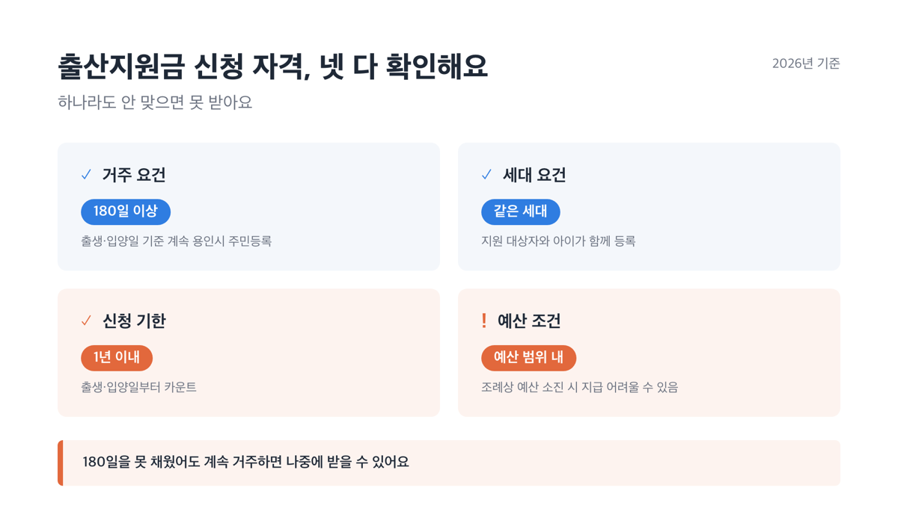
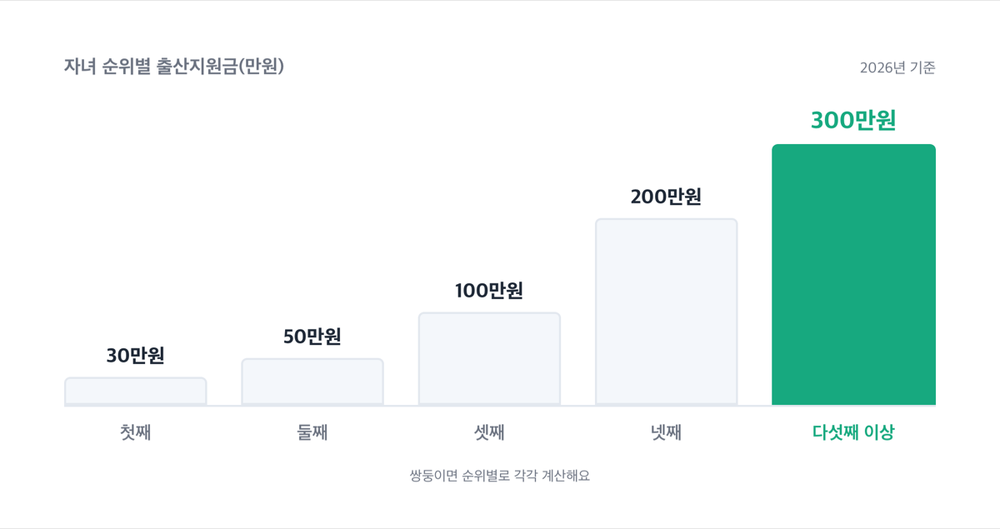
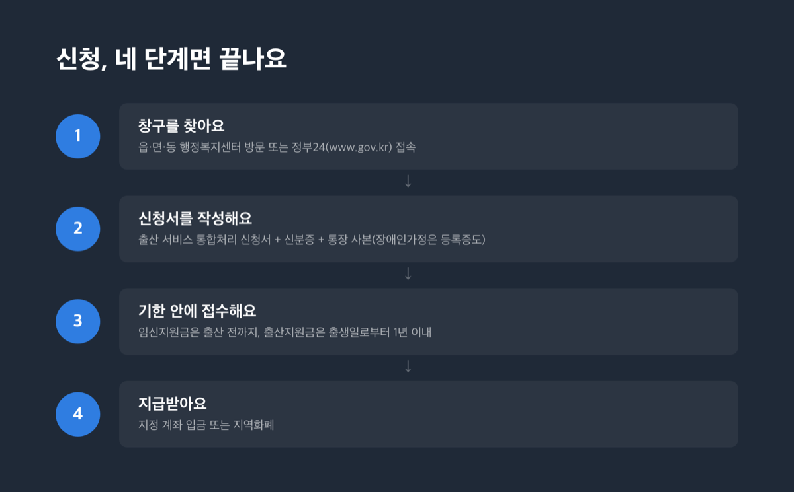
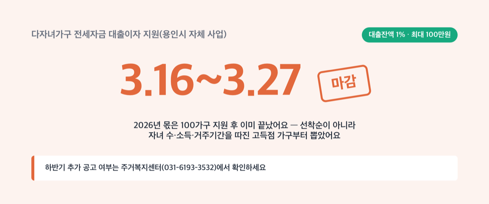

# 용인시 출산지원금 얼마 받나, 2026년 최대 300만원까지

📌 2026년 9월 1일 기준

용인시 출산지원금은 셋째부터라고 알려져 있는데, 사실이 아니에요. 지금은 ==첫째부터 받아요==, 30만원부터 시작해서 둘째는 50만원이거든요.

**3줄 요약**
- 용인시에 살면 임신 20주부터 태아당 30만원, 출산 후엔 첫째 30만원부터 다섯째 이상 300만원까지 시 자체 지원금을 받아요.
- 예전엔 셋째부터만 줬지만 지금은 첫째부터 받도록 바뀌었어요.
- 180일 거주 요건과 1년 신청 기한부터 먼저 확인하세요.

이 글에서는 용인시 자체 임신·출산 지원금과 장애인가정 추가지원, 다자녀가구 혜택, 신청할 때 자주 걸리는 함정까지 정리했어요.

> [!WARNING]
> 용인시 출산지원금·임신지원금은 조례상 ==예산 범위에서== 지급합니다. 신청 전에 여성가족과(031-6193-2608)에 예산이 남아 있는지 먼저 확인하는 게 안전해요.

본격적으로 하나씩 볼게요.

## 💰 용인시 임신·출산 지원금, 뭐부터 봐야 하나

용인시에서 아이를 낳으면 받는 돈은 크게 셋으로 나뉘어요. 중앙정부가 주는 것, 경기도가 주는 것, 용인시가 직접 주는 것입니다. 중앙정부는 전국 공통 기준으로, 경기도는 시·군과 함께하는 매칭사업으로, 용인시는 자체 조례로 지원해서 재원과 조건이 전부 달라요.

| 항목 | 소관 | 금액(2026년 기준, 만원) |
|---|---|---|
| 첫만남이용권 | 중앙정부 | 첫째 200만원, 둘째 이상 300만원 |
| 부모급여 | 중앙정부 | 0세 월 100만원, 1세 월 50만원 |
| 산모·신생아 건강관리 | 중앙정부(소득기준) | 표준형 기준 정부지원 116만 5천원 |
| 경기도 산후조리비 | 경기도+용인시 | 1인당 50만원(용인와이페이) |
| 용인시 임신지원금 | 용인시 | 태아당 30만원 |
| 용인시 출산지원금 | 용인시 | 첫째 30만원~다섯째 이상 300만원 |

경기도 산후조리비나 경기아이플러스카드 같은 경기도 차원 지원은 [화성시 임신·출산·육아 지원금 총정리](https://blog.onioniworks.com/posts/childcare-childbirth/hwaseong-benefits-2026/)에서 자세히 다뤘어요. 여기서는 용인시가 직접 주는 돈 위주로 다룰게요.

첫째를 낳았다고 가정하고 첫만남이용권·용인시 임신지원금·용인시 출산지원금·경기도 산후조리비 넷을 더하면 최대 310만원이에요. 다만 넷 다 신청 기한과 거주 요건이 따로 있어서, 전부 챙긴다는 보장은 아니에요.

결국 소득 기준 없이 받는 돈만 벌써 네 가지예요.

## 임신 중 30만원, 출산 후 최대 300만원

임신지원금과 출산지원금은 이름은 비슷해도 완전히 다른 돈이에요. 임신지원금은 태아 상태를 기준으로 세는 돈이라 출산하고 나면 지급 근거 자체가 사라지고, 출산지원금은 이미 태어난 아이 수를 기준으로 하니 1년이라는 여유를 줍니다.

| 항목 | 내용(2026년 기준) |
|---|---|
| 지원 대상 | 신청일 기준 용인시 주민등록 20주 이상 임신부 |
| 지급액 | 태아 1인당 30만원, 지역화폐 |
| 신청 기간 | 임신 20주부터 출산 전까지 |
| 지급일 | 신청 다음 달 20일 |

> 😕 출산했는데 미처 신청을 못 했어요, 나중에라도 되나요?
> 안 됩니다. 임신지원금은 출산 전까지만 신청받아요. 출산 후엔 아래 출산지원금을 챙기시면 돼요.

출산지원금은 자녀 순위에 따라 금액이 달라져요.

| 자녀 순위 | 지급액(2026년 기준, 만원) |
|---|---|
| 첫째 | 30만원 |
| 둘째 | 50만원 |
| 셋째 | 100만원 |
| 넷째 | 200만원 |
| 다섯째 이상 | 300만원 *(쌍둥이면 순위별로 각각 계산해요)* |

지원 대상은 출생·입양일 기준 180일 이상 계속 용인시에 주민등록을 두고 거주해야 하고, 지원 대상자와 아이가 같은 세대로 등록돼 있어야 해요. 180일을 채우지 못했더라도 그때까지 계속 거주하면 나중에 받을 수 있어요. 신청 기한은 출생·입양일부터 ==1년 이내==이고, 신청 다음 달 25일에 계좌로 입금되거나 지역화폐로 지급돼요.

## 장애인가정이면 추가로 받는 돈

부모 중 한 명이 등록 장애인이면 출산지원금과 별도로 장애인가정 출산지원금을 더 받을 수 있어요. 심한 장애일수록 출산 준비에 드는 품과 비용이 크다고 보고 금액에 차등을 뒀어요.

| 구분 | 지급액(2026년 기준, 만원) |
|---|---|
| 심한 장애를 가진 부모 | 100만원 이내 |
| 심하지 않은 장애를 가진 부모 | 70만원 이내 |

쌍둥이 이상이면 추가 출생아 1명마다 지원액의 50%를 더 받을 수 있고, 부모가 둘 다 장애인이면 중복으로는 못 받아요. 다만 이 지원금은 위에서 본 일반 출산지원금과는 **중복 수령이 가능**해요. 신청 기한은 출생일부터 1년 이내이고, 시는 신청서를 받은 뒤 30일 이내에 지원 여부를 정해서 지급합니다. 문의는 장애인복지과(031-6193-3151)로 하면 돼요.

## 신청은 이렇게 하면 됩니다

임신지원금·출산지원금·장애인가정 출산지원금 모두 신청 창구는 같아요. 온라인이 편한 사람과 서류를 직접 들고 가야 안심되는 사람을 둘 다 받으려고 창구를 나눠 둔 거예요.

1. 주소지 읍·면·동 행정복지센터를 찾거나, 정부24(www.gov.kr)에 접속해요.
2. 출산 서비스 통합처리 신청서를 작성해요. 신분증과 통장 사본을 챙기고, 장애인가정이면 장애인등록증도 함께 준비해요.
3. 임신지원금은 임신 20주 이후 출산 전까지, 출산지원금·장애인가정 출산지원금은 출생일로부터 1년 이내에 접수해요.
4. 지급일에 지정 계좌 입금이나 지역화폐로 받아요.

## 다자녀가구라면 이것도 챙기세요

용인시가 직접 주는 돈 말고도 다자녀가구라서 받을 수 있는 혜택이 몇 가지 더 있어요.

**자동차 취득세 감면**은 전국 공통 지방세 기준이라 용인시 고유 정책은 아니지만, 용인시 차량등록사업소가 접수 창구예요. 만 18세 미만 자녀 2명 이상이면 취득세 50%(70만원 한도), 3명 이상이면 100%(140만원 한도)를 감면받아요. 여기에 2025년부터는 자녀 2명이어도 7~10인승 승용이나 15인 이하 승합, 1톤 이하 화물은 한도 없이 감면해 주는 항목이 따로 생겼어요.

> 솔직히 말하면 — 용인시 공식 페이지에 이름 비슷한 두 감면 항목이 나란히 있어서 헷갈려요. 저라면 표 하나로 정리해 놨을 것 같은데, 지금은 그렇지 않으니 내 차종이 어느 쪽에 해당하는지 차량등록사업소(031-6193-9542)에 직접 물어보는 게 빨라요.

**다자녀가구 전세자금 대출이자 지원**은 전세자금 대출잔액의 1%(==최대 100만원==)를 지원하는 용인시 자체 사업이에요.

2026년 몫은 3월 16일부터 27일까지 100가구만 받고 이미 마감됐어요. 신청자가 많으면 선착순이 아니라 자녀 수·소득·거주기간을 따져 고득점 가구부터 뽑는 방식이었고요. 하반기에 추가 공고가 있는지는 주거복지센터(031-6193-3532)에서 확인하는 게 확실해요.

**경기아이플러스카드**도 용인시에서 그대로 쓸 수 있어요. 경기도 거주에 자녀 2명 이상(막내 만 18세 이하)이면 발급받을 수 있는 카드로, 혜택 폭과 발급 방법은 [화성시 편](https://blog.onioniworks.com/posts/childcare-childbirth/hwaseong-benefits-2026/)에 정리해 놨어요.

## 여기서 자주 걸리는 함정

- **산후조리비는 용인시 사업이 아니에요** *(경기도-용인시 매칭사업)* — 용인시 보건소 페이지에 산후조리비가 임신지원금과 나란히 올라와 있어서 셋 다 용인시 돈처럼 보이지만, 실제 재원은 경기도 예산에서 나가고 용인시는 지역화폐 지급 창구 역할만 해요.
- **임산부 교통비는 용인시가 대상이 아니에요** — 경기도 분만취약지 임산부 교통비 지원(1인당 최대 100만원)은 포천·연천·가평·양평·여주·안성 6개 시·군만 받아요. 용인시는 이 목록에 없어요.
- **소득이 많아도 상관없어요** — 물론 산모·신생아 건강관리 지원은 소득 기준이 있어서 못 받을 수도 있어요. 그러나 용인시 임신지원금·출산지원금·장애인가정 출산지원금은 소득과 상관없이 받아요.

> 다른 시·군은 다자녀 기준이 2명으로 낮아졌다던데, 용인시 출산지원금도 몇 명부터 받을 수 있나요?
> 자동차 취득세 감면은 만 18세 미만 자녀 2명부터 다자녀로 쳐요. 그런데 출산지원금 자체는 자녀 수 제한이 아예 없어서, 첫째부터 바로 받을 수 있어요.

결론부터 말하면, 이름이 비슷해서 헷갈리는 거지 실제로는 전혀 다른 돈이에요.

## 용인시 출산지원금 관련 궁금증 해결

**Q. 용인시에 이사 온 지 얼마 안 됐는데 신청할 수 있나요?**
A. 출생일 기준 180일 이상 계속 거주가 원칙이지만, 180일이 안 됐어도 그때까지 계속 거주하면 나중에 받을 수 있어요. 일단 신청부터 해 두는 걸 추천해요.

**Q. 임신지원금이랑 출산지원금 둘 다 받을 수 있나요?**
A. 네, 서로 다른 지원금이라 둘 다 받을 수 있어요. 다만 임신지원금은 출산 전에만, 출산지원금은 출생 후 1년 이내에만 신청할 수 있으니 시점을 놓치지 마세요.

**Q. 쌍둥이를 낳으면 얼마씩 받나요?**
A. 출산지원금은 출생 순서대로 각각 계산해요. 쌍둥이가 첫째·둘째면 30만원과 50만원을 각각 받고, 경기도 산후조리비는 다태아 기준으로 100만원(50만원의 2배)을 받아요.

**Q. 지역화폐로만 받나요, 현금으로도 받을 수 있나요?**
A. 임신지원금과 경기도 산후조리비는 지역화폐(용인와이페이)로만 나와요. 출산지원금은 계좌 입금이나 지역화폐 중 선택할 수 있어요.

**Q. 신청 기한을 놓치면 어떻게 되나요?**
A. 출산지원금과 장애인가정 출산지원금은 출생일로부터 1년, 임신지원금은 출산 전까지가 끝이에요. 이 기한을 넘기면 다시 받을 방법이 없으니 미리 달력에 표시해 두세요.

정리하면, 용인시에 살면서 아이를 낳으면 최소 두세 가지 시 자체 지원금(임신지원금, 출산지원금, 조건에 따라 장애인가정 출산지원금)을 받을 수 있어요. 여기에 경기도·중앙정부 지원까지 더하면 금액이 꽤 커지지만, 제도마다 신청 기한과 거주 요건이 달라서 하나씩 따로 챙겨야 합니다. 정확한 자격 여부나 예산 소진 상황은 주소지 행정복지센터나 여성가족과(031-6193-2608)에 전화로 확인하는 게 가장 빠릅니다.

참고: 용인시 출산지원에 관한 조례 · 용인시 장애인가정 출산지원금 지원에 관한 조례 · 경기도 산후조리비 지원 조례 · 용인특례시청 임신지원금·출산지원금·취득세감면 안내 페이지 · 용인시 보건소 경기도 산후조리비 안내 · 용인시 수지구청 다자녀가구 전세자금 대출이자 지원 공고 · 경기도청 출산장려금 및 양육비 지원현황
