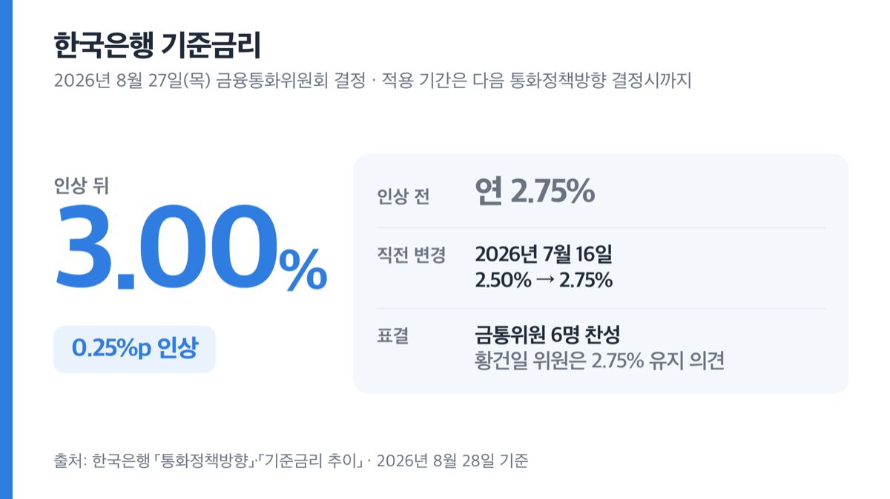
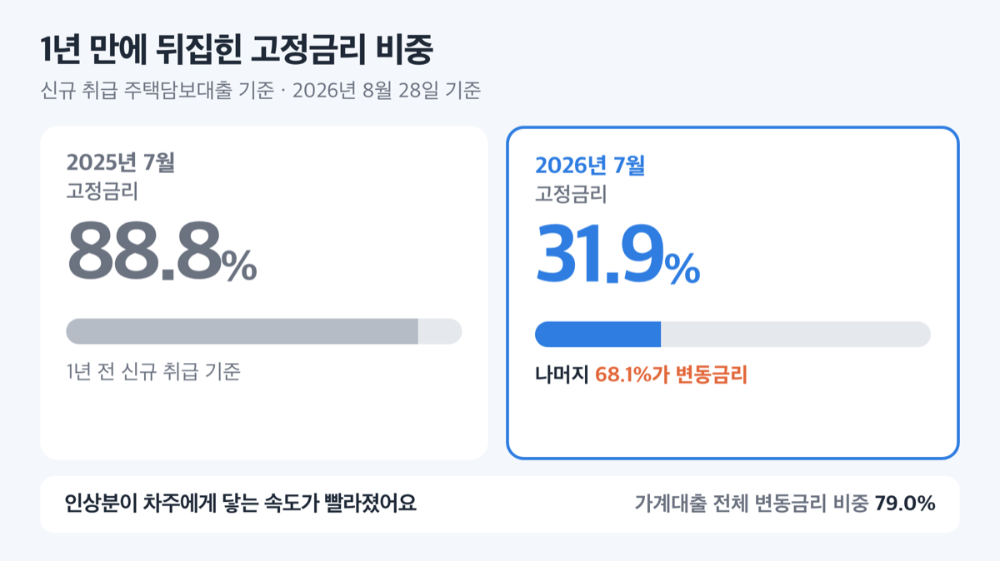

# 기준금리 인상 3.00%, 대출이자 9월 15일부터 반영돼요

📌 2026년 8월 28일 기준

결론부터요. 2026년 8월 27일 한국은행 기준금리가 연 2.75%에서 3.00%로 올랐어요. 그런데 ==대출이자가 오늘 바로 오르는 건 아니에요==. 변동금리는 다음 달 공시부터 움직입니다.

**3줄 요약**

- 한국은행 금융통화위원회가 기준금리를 0.25%p 올려 **연 3.00%** 로 정했어요. 7월에 이어 두 번 연속 인상이에요.
- 한국은행 「기준금리 추이」 표에 나온 변경일자는 **2026년 8월 27일**, 적용 기간은 **다음 통화정책방향을 결정할 때까지**예요.
- 먼저 확인할 건 하나예요. 내 대출이 고정금리인지 변동금리인지, 변동이면 금리가 바뀌는 주기가 언제 돌아오는지.

인상 배경과 이자 계산, 그리고 날짜 세 개를 차례로 적었어요.

## 기준금리 3.00%, 어제 결정된 것

**기준금리는 한국은행이 금융기관과 돈을 주고받을 때 적용하는 금리예요.** 예금금리도 대출금리도 여기서 출발합니다. 그래서 이 숫자 하나가 바뀌면 통장과 상환금이 함께 흔들려요.

결정한 곳은 **금융통화위원회(금통위)** 예요. 한국은행에서 금리를 정하는 회의체고, 통화정책방향 결정회의를 연 8회 엽니다.

| 항목 (2026년 8월 27일 금통위 결정) | 값 |
|---|---|
| 결정일 | 2026년 8월 27일(목) |
| 변동 | 연 2.75% → **연 3.00%** (0.25%p 인상) |
| 적용 기간 | 다음 통화정책방향 결정시까지 |
| 표결 | 금통위원 6명 찬성, 황건일 위원은 2.75% 유지 의견 |
| 직전 변경 | 2026년 7월 16일 2.50% → 2.75% |

*(금융중개지원대출 금리는 연 1.25%로 그대로 뒀어요)*

**왜 올렸나 — 한국은행이 밝힌 이유는 '선제적 대응'입니다.** 금통위는 물가상승률이 상당 기간 목표수준을 웃돌 것으로 보고, 물가 오름세가 번지는 걸 미리 막는 게 중요하다고 판단했어요. 총재는 뒤늦게 대응하면 긴축의 강도와 기간이 오히려 길어진다고 설명했습니다.

숫자로 보면 이렇습니다.

| 지표 (전망은 한국은행, 실적은 2026년 7월) | 값 |
|---|---|
| 2026년 성장률 전망 (한국은행) | 3.3% *(5월 전망 2.6%에서 올렸어요)* |
| 2026년 소비자물가 상승률 전망 (한국은행) | 2.7% |
| 2026년 7월 소비자물가 상승률 | 2.8% *(6월 3.2%)* |
| 2026년 7월 은행 가계대출 증감 | +5.4조원 |
| 2026년 7월 수도권 주택 매매가격 | +0.7% *(전월비, 서울 +1.1%)* |

물가안정목표는 2%예요. 전망치가 목표보다 높고 성장률 전망까지 올라갔으니, 금리를 올릴 명분이 쌓인 셈입니다.

## 💰 대출이자와 예금이자, 얼마나 움직이나

**은행이 0.25%p를 그대로 얹는다고 가정하면** 이렇게 계산됩니다. 한국은행 자료에 금액으로 적혀 있는 값은 아니고, 금리 인상 폭에 원금을 곱한 계산값이에요.

| 대출 원금 | 0.25%p 반영 시 연 이자 증가 | 7·8월 합계 0.50%p 반영 시 |
|---|---|---|
| 1억원 | 25만원 *(월 약 2만원)* | 50만원 |
| 3억원 | 75만원 *(월 6만 2,500원)* | 150만원 *(월 12만 5,000원)* |

예금은 반대예요. **예금 1,000만원이면 연 이자가 세전 2만 5,000원 늘어요.** 이자소득세 15.4%를 떼면 약 2만 1,150원입니다. 5,000만원이면 세전 12만 5,000원, 세후 약 10만 5,750원이에요.

지금 시장 금리는 이 수준입니다. 아래는 2026년 7월 신규취급액 기준이라 **8월 27일 인상분은 아직 들어가 있지 않아요.**

| 구분 (2026년 7월, 예금은행 신규취급액) | 금리 |
|---|---|
| 주택담보대출 | 연 4.48% |
| 일반 신용대출 | 연 5.97% |
| 전세자금대출 | 연 4.07% |
| 저축성수신(예금) | 연 3.21% |

**이번 인상이 유독 빠르게 전달될 이유가 하나 있어요.** 2026년 7월에 새로 나간 주택담보대출 중 고정금리는 31.9%뿐이고 나머지 68.1%가 변동금리예요. 1년 전인 2025년 7월에는 고정금리가 88.8%였어요. 가계대출 전체로 보면 변동금리 비중이 79.0%예요.

==변동금리 비중이 커진 만큼 인상분이 차주에게 닿는 속도도 빨라졌어요.==

> 😕 **"저는 고정금리인데요?"**
> 그럼 만기까지 이자는 그대로예요. 다만 만기가 돌아와 새 조건으로 갈아탈 때는 그때의 금리를 받습니다. 지금 고정금리라고 해서 이 소식이 남 얘기가 되는 건 아니에요.

저라면 오늘 확인할 건 계산기가 아니라 대출약정서라고 봐요. 위 표의 금액은 **인상분이 100% 전가됐을 때의 상한선**이고, 실제로는 내 대출이 어떤 금리에 연동돼 있느냐에서 달라지거든요.

## 날짜 세 개 — 오늘부터 오르는 게 아닙니다

변동금리 주택담보대출 대부분은 **COFIX(코픽스)** 에 연동돼 있어요. 은행들이 예금·은행채로 돈을 조달할 때 든 비용을 모아 만든 지수고, **전국은행연합회가 공시합니다.**

전국은행연합회 공시 기준으로 2026년 7월분 신규취급액기준 COFIX는 **3.18%**, 공시일은 2026년 8월 18일이었어요. 올해 1월 2.89%에서 꾸준히 올라온 값입니다.

| 날짜 | 무슨 일이 |
|---|---|
| 2026년 8월 27일 | 기준금리 3.00%로 변경 (한국은행 추이 표상 변경일자) |
| 2026년 9월 15일 | 8월분 COFIX 공시 *(오후 3시, 전국은행연합회)* · 이번 회의 의사록 공개 |
| 2026년 10월 22일 | 다음 통화정책방향 결정회의 |

**시차가 생기는 이유는 COFIX가 지난달 조달비용을 모아 만드는 지수라서예요.** 8월 27일 인상은 9월 15일 공시되는 8월분에 일부만, 10월 중순 공시되는 9월분에 온전히 담깁니다. 그리고 내 대출금리는 그 공시일이 아니라 **내 금리변동주기(보통 6개월)가 돌아올 때** 바뀝니다.

앞으로는요. 금통위는 물가와 경기, 금융안정 상황을 점검하며 **"추가 인상의 시기와 속도"** 를 결정해 나가겠다고 밝혔어요.

## 지금 확인할 것 넷

이번 인상에 먼저 걸리는 대상은 변동금리로 돈을 빌린 사람이에요. 순서대로 확인하면 되는 것들을 적었어요. 계산보다 확인이 먼저입니다.

1. **대출약정서에서 고정금리인지 변동금리인지 확인하세요.** 고정이면 만기까지 그대로예요.
2. **변동금리면 다음 금리변동일이 언제인지 확인하세요.** 보통 6개월 주기라 사람마다 다릅니다.
3. **COFIX 연동인지 금융채 연동인지 확인하세요.** 연동 지표에 따라 반영 시점이 달라져요. 거래 은행 앱이나 영업점 방문으로 확인할 수 있어요.
4. **9월 15일 오후 3시 이후 COFIX 공시를 확인하세요.** 전국은행연합회 소비자포털(https://portal.kfb.or.kr/fingoods/cofix.php)에 올라옵니다.

예금은 만기가 돌아오는 것부터 보면 돼요. 은행별 정기예금 금리는 같은 소비자포털의 예금상품금리 비교에서 확인할 수 있습니다.

## 여기서 자주 틀립니다

**첫째, 기준금리가 오르면 모든 대출금리가 따라 오른다고 쓰면 데이터와 어긋나요.** 기준금리가 오른 2026년 7월에 예금은행 대출금리 평균은 연 4.27%로 오히려 0.04%p 내렸어요. 기업대출이 0.07%p 내려간 영향이 컸습니다. 같은 달 가계대출은 0.14%p 올랐고요.

은행 가산금리와 우대금리가 따로 움직이기 때문이에요. **기준금리는 출발점일 뿐 도착점이 아닙니다.**

**둘째, 「8월 27일부터 시행」이라는 문장은 한국은행이 쓴 말이 아니에요.** 보도자료는 "다음 통화정책방향 결정시까지 운용하기로 하였음"이라고만 적었고, 변경일자 8월 27일은 「기준금리 추이」 표에 적힌 값입니다. 둘은 다른 이야기예요.

**셋째, 점도표를 사람 수로 읽으면 틀립니다.** 금통위원이 6개월 뒤 적절하다고 보는 금리 수준을 점으로 찍는 게 점도표인데, **위원 한 명이 점을 3개씩 찍어요.** 이번에 나온 점 21개는 3.25%에 10개, 3.50%에 6개, 3.00%에 5개였습니다. "16명이 추가 인상을 전망했다"는 말은 성립하지 않아요.

> [!WARNING]
> 2026년 7월 예대금리차는 1.06%p였어요. 대출금리에서 예금금리를 뺀 차이인데, 인상기에는 대출이 먼저 오르고 예금이 늦게 따라오는 일이 잦습니다. 예금은 지금 금리를 확인하고 만기 시점을 챙기는 편이 낫습니다.

## 기준금리 인상 관련 궁금증 해결

**Q. 언제부터 제 대출이자가 오르나요?**
A. 고정금리면 만기까지 안 바뀌어요. 변동금리면 다음 금리변동일부터고, COFIX 연동이면 9월 15일 공시분부터 일부 반영됩니다.

**Q. 8월 27일부터 바로 시행되는 건가요?**
A. 한국은행 「기준금리 추이」 표의 변경일자가 2026년 8월 27일이에요. 다만 보도자료에 "○일부터 시행"이라는 별도 문구는 없고, "다음 결정시까지 운용한다"고만 적혀 있습니다.

**Q. 예금금리도 같이 오르나요?**
A. 2026년 7월 저축성수신 금리는 연 3.21%로 전월보다 0.13%p 올랐어요. 8월 인상분 반영 여부는 은행마다 달라서, 거래 은행 공시나 전국은행연합회 소비자포털에서 확인하세요.

**Q. 반대 의견을 낸 위원이 있던데 왜죠?**
A. 황건일 위원이 2.75% 유지가 바람직하다는 의견을 냈어요. 그 논거는 2026년 9월 15일 공개되는 의사록에 담깁니다.

**Q. 앞으로 더 오르나요?**
A. 금통위는 "추가 인상의 시기와 속도"를 상황을 보며 결정하겠다고 했어요. 점도표에서는 6개월 뒤 3.25%에 점이 가장 많이 찍혔습니다. 다음 회의는 10월 22일이에요.

## 그래서 내 돈은

정리하면 이렇습니다. **대출이 변동금리면 다음 금리변동일에 최대 0.25%p, 7월분까지 합치면 0.50%p가 얹힐 수 있어요.** 3억원이면 1년에 150만원, 한 달에 12만 5,000원입니다. 반대로 예금 5,000만원은 세후 연 10만원쯤 더 붙을 수 있어요.

저는 이번 인상에서 금액보다 속도가 더 중요하다고 봐요. 새 주택담보대출의 68.1%가 변동금리인 지금은, 1년 전보다 인상분이 훨씬 빨리 상환금에 닿거든요.

오늘 할 일은 하나예요. ==대출약정서를 열어 고정인지 변동인지, 다음 금리변동일이 언제인지 확인하는 것.== 그다음이 계산입니다.

대출 갈아타기나 중도상환수수료처럼 개인 조건이 걸린 판단은 거래 은행이나 금융감독원 금융소비자정보포털에서 확인하세요. 조건에 따라 답이 달라집니다.

참고: 한국은행 「통화정책방향」(2026.8.27) · 한국은행 「2026년 8월 27일 통화정책방향 관련 참고자료」 · 한국은행 총재 기자간담회 모두발언(2026.8.27) · 한국은행 「기준금리 추이」 · 한국은행 「2026년 7월 금융기관 가중평균금리」 · 한국은행 「2026년 금융통화위원회 정기회의 개최 및 의사록 공개 예정일정」 · 전국은행연합회 소비자포털 COFIX 공시
