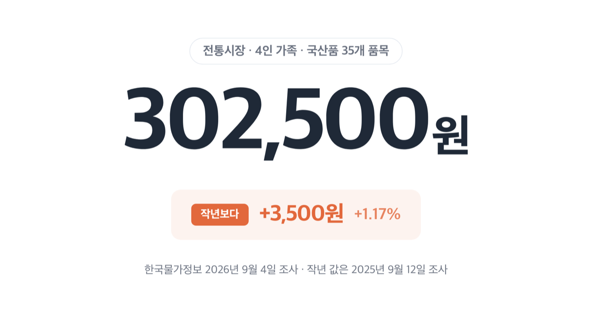
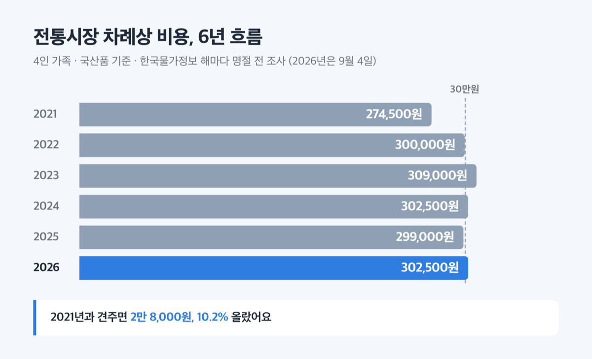
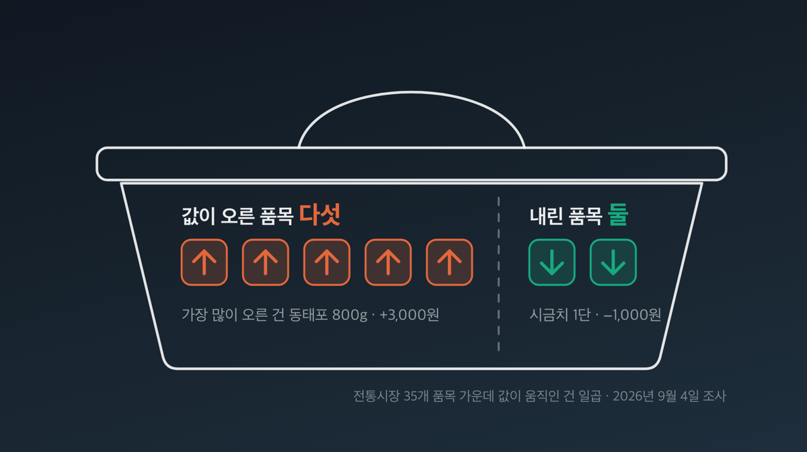
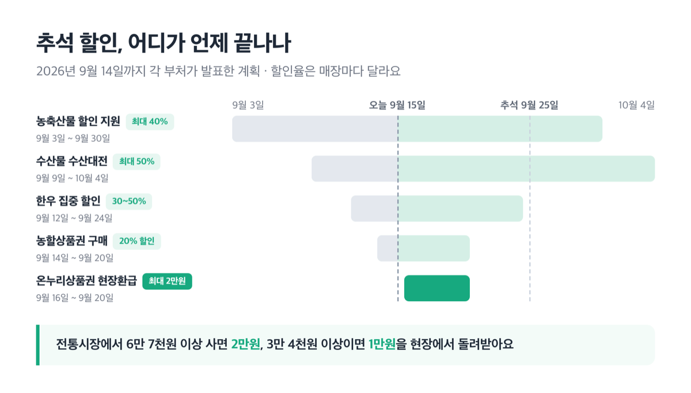

# 추석 차례상 비용 2026년 전통시장 30만 2500원으로 올랐어요

📌 2026년 9월 15일 기준

사과값·배춧값이 내렸다는 소식이 8월 내내 나왔어요. 그래서 올해 차례상은 좀 수월하겠다 싶었는데, 총액은 반대로 올랐습니다. 내린 품목과 오른 품목이 따로 있었거든요.

**3줄 요약**

- 한국물가정보가 2026년 9월 4일 조사한 추석 차례상 비용은 ==전통시장 30만 2500원, 대형마트 39만 7700원==입니다. 4인 가족이 35개 품목을 국산으로 다 담았을 때예요.
- 작년보다 전통시장은 3,500원(1.17%), 대형마트는 6,350원(1.62%) 올랐습니다.
- 전통시장에서 값이 오른 품목은 다섯, 내린 품목은 둘이에요. 나머지 스물여덟 품목은 작년과 값이 같았어요.

어디가 올랐고 어디가 내렸는지, 그리고 지금 남아 있는 할인이 무엇인지 순서대로 적어요.

## 💰 2026년 추석 차례상, 얼마 드나

차례상 차림비용은 사과·배·나물·생선·고기처럼 상에 올릴 재료를 한 번에 다 샀을 때 드는 돈입니다. (사)한국물가정보가 해마다 명절 전에 조사해 내놓는 값이에요.

올해 조사는 2026년 9월 4일에 했어요. 4인 가족, 국산품, 35개 품목이 기준입니다.

| 어디서 사나 | 2026년 비용 (4인 가족·국산품 35개 품목) | 작년 대비 |
|---|---|---|
| 전통시장 | 302,500원 | +3,500원 (+1.17%) |
| 대형마트 | 397,700원 | +6,350원 (+1.62%) |

한국물가정보 2026년 9월 4일 조사. 작년 값은 2025년 9월 12일 조사한 것입니다.

같은 35개 품목을 어디서 사느냐에 따라 9만 5,200원 차이가 나요. 전통시장 상차림 세 번에 한 번꼴로 더 내는 셈입니다.

6년을 놓고 보면 제자리예요. 전통시장 기준으로 최근 흐름은 이렇습니다.

| 연도 | 전통시장 차례상 비용 (4인 가족·국산품) |
|---|---|
| 2021 | 274,500원 |
| 2022 | 300,000원 |
| 2023 | 309,000원 |
| 2024 | 302,500원 |
| 2025 | 299,000원 |
| 2026 | 302,500원 |

2022년에 처음 30만원대로 들어선 뒤로는 30만원 안팎에서 오르내리고 있어요. 올해 값 30만 2,500원은 2024년과 정확히 같은 금액입니다. 2021년과 견주면 2만 8,000원, 10.2% 올랐어요.

**5년째 30만원 언저리에서 움직이는 중입니다.**

## 오른 품목과 내린 품목이 따로 있어요

총액은 3,500원 올랐지만, 전통시장 35개 품목 가운데 값이 움직인 것은 일곱뿐이에요. 다섯이 오르고 둘이 내렸습니다.

| 품목 (전통시장) | 작년 → 올해 | 변동률 |
|---|---|---|
| 애호박 1개 | 1,500원 → 2,000원 | +33.33% |
| 동태포(어전용) 800g | 10,000원 → 13,000원 | +30.00% |
| 무 1개 | 2,500원 → 3,000원 | +20.00% |
| 달걀 10개 | 3,000원 → 3,500원 | +16.67% |
| 닭고기(손질 육계) 1.5kg | 8,000원 → 9,000원 | +12.50% |
| 시금치 1단 | 6,000원 → 5,000원 | -16.67% |
| 배추 1포기 | 9,000원 → 8,000원 | -11.11% |

전통시장 기준, 2025년 9월 12일 조사값과 2026년 9월 4일 조사값을 견준 것입니다.

품목류로 묶으면 수산물이 6.67%, 축산물이 1.69% 올랐고 나물류가 5.13% 내렸어요. 과일류·견과류·채소류·과자류·주류는 소계가 작년과 같습니다. 전을 부치는 동태포 한 품목이 3,000원 올랐어요. 총액 상승분 3,500원의 대부분입니다.

대형마트는 움직인 품목이 더 많았습니다. 달걀 10개가 4,980원에서 5,980원으로 20.08% 올랐고, 돼지고기 앞다리살 600g이 10.10%, 닭고기 1.5kg이 7.62% 올랐어요. 반대로 대파 1단은 3,990원에서 2,980원으로 25.31% 내렸습니다.

> **"과일값이 내렸다면서요?"**
>
> 전통시장에서는 사과 3개 1만원, 배 3개 1만원으로 작년과 값이 같았어요. 대형마트에서는 사과가 0.55%, 배가 2.03% 내렸습니다. 내리긴 했지만 과일류 소계로는 1.29% 하락이라 오른 축산물·수산물을 덮지 못했어요.

여기서 원리가 하나 나옵니다. 차례상 묶음은 값이 내린 품목과 오른 품목을 함께 담는데, 올해는 오른 쪽의 인상폭이 더 컸어요. 동태포가 3,000원 오르는 동안 시금치는 1,000원 내렸거든요.

## 전통시장이 31% 싼데, 전부 그런 건 아니에요

같은 35개 품목을 두 곳에서 각각 담으면 ==대형마트가 전통시장보다 31.47% 비쌉니다==. 다만 품목마다 차이가 크게 달라요.

| 항목 (2026년 9월 4일 조사) | 대형마트가 전통시장보다 |
|---|---|
| 나물류 소계 | +124.86% |
| 닭고기 1.5kg | +115.11% |
| 수산물 소계 | +38.04% |
| 채소류 소계 | +26.63% |
| 축산물 소계 | +26.39% |
| 과일류 소계 | +7.50% |
| 곶감 10개 | -2.54% (마트가 싸다) |
| 애호박 1개 | -6.00% (마트가 싸다) |
| 청주 1병 | -9.09% (마트가 싸다) |
| 식혜 1.5ℓ | -22.40% (마트가 싸다) |
| **35개 품목 합계** | **+31.47%** |

차이를 만드는 곳은 나물이에요. 고사리 400g과 도라지 400g이 각각 165.33% 비쌉니다. 같은 무게인데 전통시장이 6,000원, 대형마트가 15,920원이에요. 닭고기도 1.5kg 한 마리에 9,000원과 19,360원으로 두 배가 넘습니다.

> **솔직히 말하면** — 저라면 고사리·도라지·닭고기만 전통시장에서 사고, 식혜와 청주는 마트 장바구니에 담습니다. 차이가 가장 큰 세 품목만 옮겨도 체감이 달라지거든요.

**전부 한 곳에서 사야 할 이유는 없습니다.**

## 할인은 어디서 어떻게 받나

정부는 9월 9일에 농축산물 할인 지원을 1,490억원으로 늘리고 기간도 9월 30일까지 일주일 연장했어요. 수산물 할인 예산은 440억원입니다.

| 혜택 (2026년) | 기간 | 할인·환급 |
|---|---|---|
| 농축산물 할인 지원 | 9월 3일~9월 30일 | 최대 40% |
| 수산물 「수산대전」 | 9월 9일~10월 4일 | 최대 50% |
| 전통시장 온누리상품권 현장환급 | 9월 16일~9월 20일 | 구매액 약 30%, 1인 최대 2만원 |
| 농할상품권 구매 (일반) | 9월 14일~9월 20일 | 액면가 20% 할인 |
| 한우 집중 할인 | 9월 12일~9월 24일 | 30~50% |

농축산물 최대 40%는 정부 지원 20%에 생산자·유통업체 자체 할인 20%를 얹은 값이에요. 수산물 최대 50%는 정부 20%에 업체 30%를 더한 것입니다.

장을 보기 전에 다섯을 순서대로 확인하세요.

1. 농축산물은 sale.foodnuri.go.kr에서 참여 매장을 먼저 봐요 *(9월 14일 기준 4,000여 곳에서 진행 중이에요)*
2. 수산물은 fsale.kr에서 수산대전 참여처를 확인해요 *(전국 56개 마트·온라인몰이에요)*
3. 전통시장에 갈 날은 ==9월 16일에서 20일 사이==로 잡아요 *(6만 7천원 이상 사면 2만원, 3만 4천원 이상이면 1만원을 현장에서 돌려받아요)*
4. 소고기는 한우 집중 할인 기간에 담아요 *(하나로마트 등에서 9월 24일까지예요)*
5. 계산 전에 1인당 할인 한도를 확인해요 *(수산대전은 주당 2만원, 농축산물은 이 기간 한도를 적용하지 않아요)*

온누리상품권 현장환급은 전국 300개 시장에서만 합니다. 국산 농축산물·수산물을 살 때만 해당해요.

## ⚠️ 추석 차례상 비용, 이 가격이 최종이 아니에요

조사일이 9월 4일입니다. 추석 당일인 9월 25일까지 21일이 남은 시점이었어요.

> [!WARNING]
> 한국물가정보는 추석까지 아직 3주가량 남아 있어 지금 조사된 가격 흐름이 명절 직전까지 이어질지는 지켜볼 필요가 있다고 밝혔습니다. 실제 장을 볼 때 금액은 달라질 수 있습니다.

작년 조사일은 9월 12일로, 2025년 추석까지 24일이 남은 때였어요. 두 해의 '3주 전'이 정확히 같은 간격은 아니라는 뜻입니다.

성수품 공급 일정도 봐야 해요. 정부는 추석 전 3주인 9월 3일부터 23일까지 19대 성수품 18만 3천톤을 푸는데, 이 물량의 34.5%가 추석 1주 전에 몰립니다. 물량이 몰리는 때에 수요도 같이 몰려요. 그래서 마지막 주 가격은 지금 표의 숫자와 다를 수 있습니다.

9월 14일 기준으로 13대 성수품은 계획 대비 109.1%가 공급되고 있어요. 다만 마늘은 생산량이 줄었고, 애호박은 일조량이 부족해 출하량이 적어지면서 값이 높은 수준입니다. 축산물도 사육 마릿수 감소와 가축전염병 영향으로 다소 높아요.

저는 이 숫자를 최종 가격으로 보지 않습니다. 두 주 뒤에 다시 조사하면 달라질 값이에요.

## 추석 차례상 비용 관련 궁금증 해결

**Q. 8월 물가에서 과일·채소가 크게 내렸다던데, 차례상은 왜 올랐나요?**

A. 8월 소비자물가에서 농축수산물은 1년 전보다 2.6% 내렸고 과일은 9.8%, 채소는 9.7% 내렸어요. 소비자물가는 농축수산물 전체에 소비 비중만큼 무게를 실어 평균한 값입니다. 차례상 비용은 그중 35개 품목만 골라 담은 묶음이에요. 이 묶음에는 값이 오른 동태포·닭고기·달걀이 들어 있습니다. 재는 대상이 다른 두 지표라 나란히 놓고 비교하면 안 돼요.

**Q. 4인 가족 기준인데, 상을 간소하게 차리면요?**

A. 35개를 다 담았을 때의 값이라 품목을 빼면 금액이 내려갑니다. 전통시장 기준으로 과자류 소계가 1만 8,000원, 견과류가 2만 9,000원, 주류가 1만 1,000원이에요. 상에 올리지 않는 품목부터 빼 보면 됩니다.

**Q. 전통시장이 늘 더 싼가요?**

A. 35개를 다 담으면 그렇습니다. 합계로 대형마트가 31.47% 비싸요. 품목별로는 다릅니다. 식혜 1.5ℓ는 대형마트가 22.40% 싸고, 청주 1병은 9.09%, 애호박 1개는 6.00% 쌉니다.

**Q. 온누리상품권 환급은 어떻게 받나요?**

A. 9월 16일부터 20일까지 전국 300개 전통시장에서 국산 농축산물·수산물을 사면 구매액의 약 30%를 온누리상품권으로 현장에서 돌려줍니다. 3만 4천원 이상 6만 7천원 미만이면 1만원, 6만 7천원 이상이면 2만원이에요. 1인당 최대 2만원입니다.

**Q. 올해 추석 연휴는 며칠인가요?**

A. 법정 공휴일은 9월 24일 목요일부터 26일 토요일까지 사흘이고, 27일 일요일까지 이어져 실제로는 나흘을 쉬어요. 추석 당일은 9월 25일 금요일입니다. 법정 연휴 마지막 날인 26일이 토요일과 겹치지만 대체공휴일은 붙지 않아요. 고속도로 통행료는 24일부터 27일까지 면제이고, KTX 운임은 10% 내립니다.

## 그래서 내 지갑은

전통시장에서 35개를 다 담으면 30만 2,500원, 대형마트면 39만 7,700원입니다. 작년보다 각각 3,500원, 6,350원을 더 내야 해요. 오른 것은 애호박·동태포·무·달걀·닭고기 다섯이고, 내린 것은 시금치와 배추 둘입니다.

저라면 이번 주에 장을 봅니다. 온누리상품권 현장환급이 9월 16일부터 20일까지 닷새뿐이고, 농할상품권 일반 구매도 20일에 끝나요. 반대로 추석 1주 전에는 성수품 물량의 34.5%와 수요가 같이 몰립니다. 닷새짜리 환급을 놓치고 마지막 주에 몰려 사는 것이 가장 비싼 선택이에요.

품목별 실제 판매가와 할인율은 매장마다 다릅니다. 농축산물은 sale.foodnuri.go.kr, 수산물은 fsale.kr에서 참여 매장과 행사 기간을 먼저 확인하세요.

참고: 한국물가정보 「2026 추석 차례상 물가정보」 · 농림축산식품부 「추석 민생안정대책」 · 농림축산식품부 「농식품부·농협 가용재원을 총동원하여 상차림 품목 반값 할인 추진」 · 농림축산식품부 「추석 성수품 공급 안정에 총력」 · 해양수산부 「추석명절 수산물 성수품 소비자 체감 가격동향 상시 대응한다」 · 재정경제부 「추석 민생안정대책 발표」 · 재정경제부 「8월 소비자물가는 3.1% 상승」 · 한국천문연구원 음양력 변환
