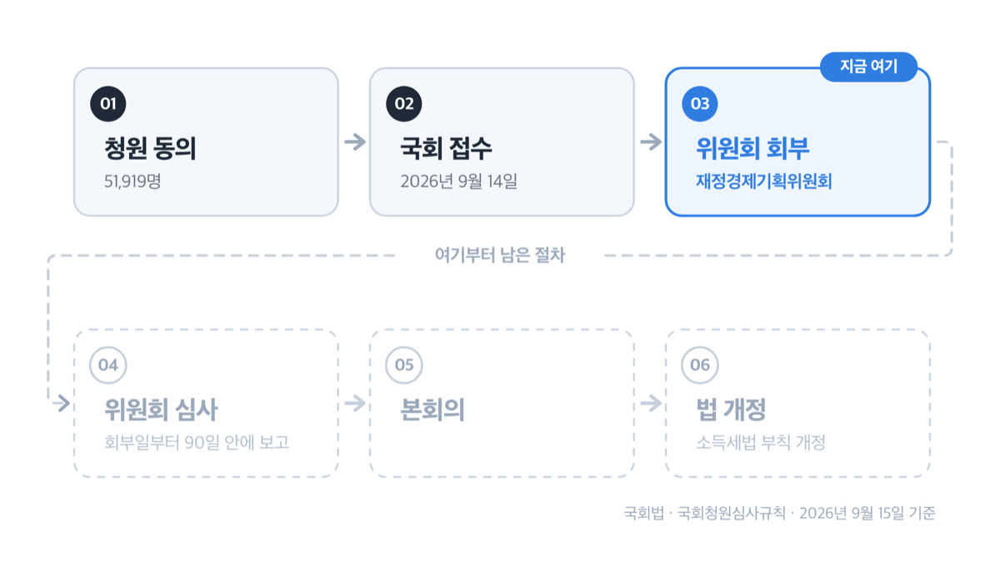
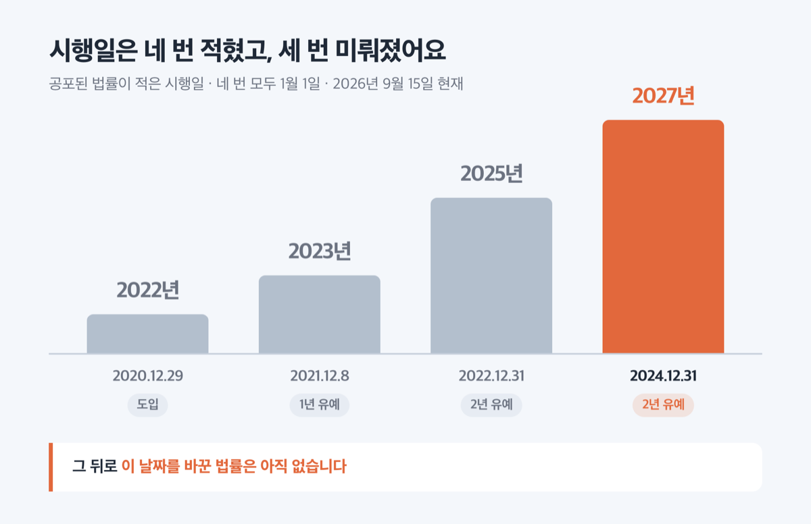
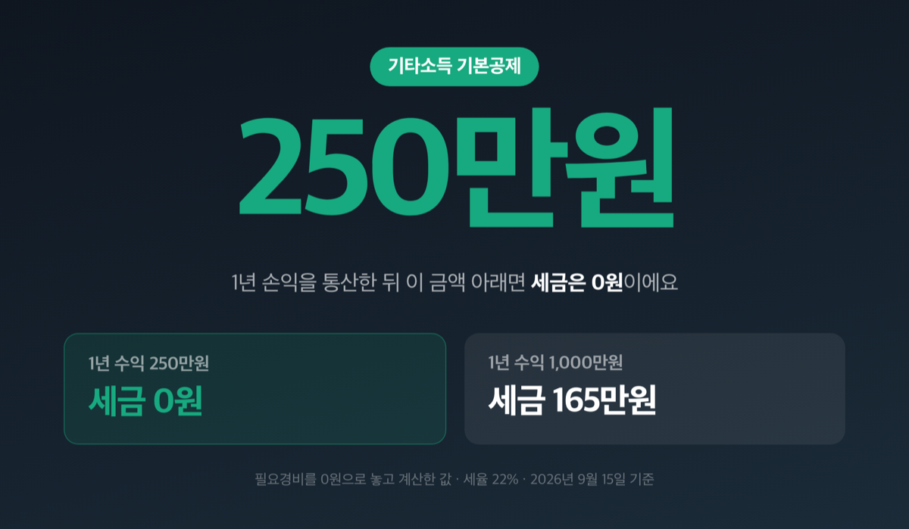
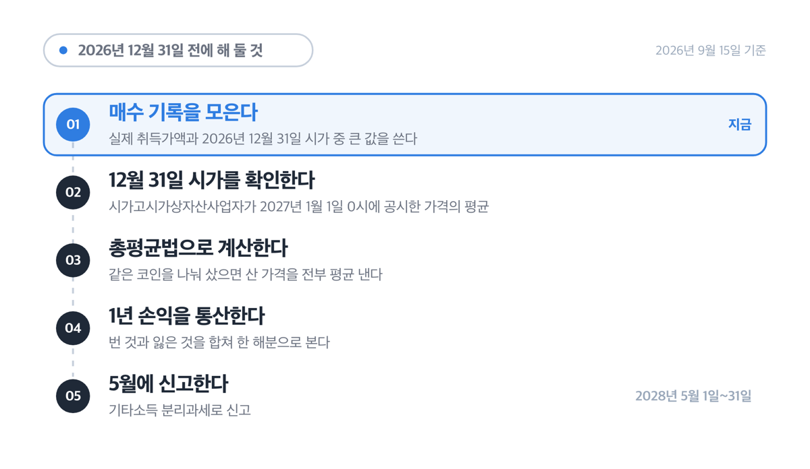
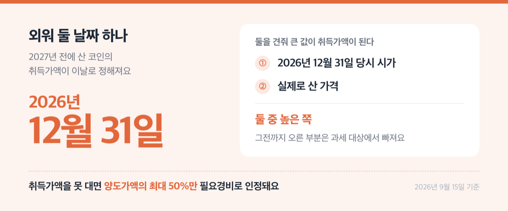

# 가상자산 과세 유예 청원 5만명, 2027년 시행일 그대로예요

📌 2026년 9월 15일 기준

가상자산 과세 유예 청원이 5만명을 넘으면 법이 바뀐다고들 하는데, 아니에요. 5만명은 국회가 청원서를 접수해 소관 위원회에서 심사하게 되는 문턱입니다. 오늘도 소득세법 시행일은 2027년 1월 1일 그대로예요.

**3줄 요약**

1. 가상자산 과세는 코인을 팔거나 빌려줘 번 돈에 세금을 매기는 제도예요. 기타소득으로 따로 떼어 계산하고, 세율은 소득세 20%에 개인지방소득세 2%를 더해 22%입니다.
2. 시행일은 2027년 1월 1일입니다. 2020년에 만들어진 뒤 세 번 미뤄졌지만, 2026년 9월 15일 현재 ==오늘 기준 이 날짜를 바꾼 법률은 없습니다==.
3. 2027년 전에 산 코인은 2026년 12월 31일 당시 시가와 실제 매수가 중 높은 쪽을 취득가액으로 잡아요. 그래서 지금 해야 할 일은 매수 기록 정리입니다.

> [!WARNING]
> 청원 동의는 2026년 9월 20일 23시 59분에 끝나요. 동의수는 그때까지 계속 늘어나니, 이 글에 적은 51,919명은 2026년 9월 15일 12시 42분에 조회한 값입니다.

청원이 지금 어디까지 갔는지, 2027년 시행이 왜 아직 그대로인지, 세금은 얼마이고 12월 31일 전에 무엇을 해 둬야 하는지 순서대로 적었어요.

## 청원 5만명을 넘으면 실제로 무슨 일이 생기나

국민동의청원의 5만명은 국회 접수 요건이자, 소관 위원회로 넘어가는 조건이자, 90일짜리 심사 시계의 출발선입니다.

왜 하필 5만명이냐면, 국회청원심사규칙 제2조의2가 그렇게 정해 뒀어요. 청원서가 공개된 날부터 30일 안에 5만명 이상이 동의하면 국민동의청원으로 **접수된 것으로 본다**고 적혀 있습니다. 접수되면 국회법 제125조에 따라 의장이 청원요지서를 돌리는 동시에 소관 위원회로 넘겨 심사하게 해요. 동의수 채우기와 회부가 한 덩어리로 묶여 있는 구조입니다.

「코인과세 2년 유예에 관한 청원」이 지금 어디에 있는지 정리하면 이래요.

| 항목 | 값 (2026년 9월 15일 조회 기준) |
|---|---|
| 청원 제목 | 코인과세 2년 유예에 관한 청원 |
| 청원서 공개일 | 2026년 8월 21일 17시 04분 |
| 동의 만료일 | 2026년 9월 20일 23시 59분 |
| 동의수 | 51,919명 *(9월 15일 12시 42분 조회값)* |
| 접수·위원회 회부일 | 2026년 9월 14일 09시 00분 |
| 소관 위원회 | 재정경제기획위원회 |
| 현재 상태 | 위원회 회부 / 처리 구분 「위원회심사」 |
| 의결일자·의결결과 | 아직 없음 |

위원회는 회부된 날부터 90일 안에 심사 결과를 의장에게 보고해야 합니다. 회부일이 2026년 9월 14일이니 1차 기한은 2026년 12월 13일쯤이에요. 다만 이건 국회법이 「90일」이라고만 정해 뒀기에 날짜를 세어 본 값이고, 개별 청원의 기한이 따로 공고되지는 않습니다. 특별한 사유가 있으면 위원장이 중간보고를 하고 60일 범위에서 한 차례 연장을 요구할 수 있어요. 그러면 2027년 2월 11일쯤이 됩니다.

그런데 이것도 상한이 아니에요. 장기간 심사가 필요한 청원은 위원회 의결로 추가 연장을 요구할 수 있고, 횟수 제한이 없거든요.

> 😕 **5만명이 넘었으니 국회가 어쨌든 움직이는 것 아닌가요?**
>
> 이미 선례가 있어요. 넉 달 전인 2026년 5월 21일, 「가상자산 과세폐지에 관한 청원」이 최종 동의 58,571명으로 **같은 재정경제기획위원회에 회부**됐습니다. 이번 청원보다 6천명 넘게 많았어요. 그런데 오늘까지 의결일자도 의결결과도 비어 있습니다. 회부는 심사 시작이지 처리 결과가 아니에요.

5만명은 법을 바꾸는 숫자가 아니라 심사를 시작하게 하는 숫자입니다.

## 2027년 1월 1일을 붙들고 있는 것은 부칙입니다

시행일의 근거는 소득세법 본문이 아니라 **부칙**에 있어요. 2020년 12월 29일 공포된 법률 제17757호 부칙 제1조제2호가 가상자산 관련 개정규정의 시행일을 2027년 1월 1일로 적어 뒀습니다. 같은 부칙 제5조는 2027년 1월 1일 이후 가상자산을 양도·대여하는 분부터 적용한다고 정했어요.

이 날짜는 처음부터 2027년이 아니었습니다. 네 번 적혔고 세 번 미뤄졌어요.

| 공포일 | 시행일이 이렇게 바뀌었다 | 법에 적힌 이유 |
|---|---|---|
| 2020년 12월 29일 | 도입 — 2022년 1월 1일 | 가상자산 양도·대여 소득 과세제도 도입 |
| 2021년 12월 8일 | 2022년 → 2023년 1월 1일 (1년) | 과세를 1년 유예 |
| 2022년 12월 31일 | 2023년 → 2025년 1월 1일 (2년) | 금융시장 여건과 소액투자자 보호 고려 |
| 2024년 12월 31일 | 2025년 → 2027년 1월 1일 (2년) | 시행 시기를 2년 유예 |

세 번 미뤄졌으니 네 번째도 미뤄지지 않겠느냐는 기대가 나오는 건 자연스러워요. 그런데 앞선 세 번은 전부 **국회가 법률을 고쳐서** 날짜를 바꾼 것입니다. 특히 2024년 12월 31일 개정은 금융투자소득세를 폐지하는 개정과 한 묶음으로 처리됐어요. 유예는 저절로 되는 게 아니라 개정 법률이 공포돼야 생기는 결과입니다.

소득세법 부칙을 마지막으로 건드린 법률이 그 2024년 12월 31일자 제20615호예요. 그 뒤로 소득세법은 네 번 더 개정됐지만(제21065호·제21221호·제21223호·제21548호) 어느 것도 가상자산 시행일을 손대지 않았습니다.

재정경제부가 2026년 8월 3일 발표하고 9월 1일 국무회의에서 의결한 2026년 세제개편안에는 가상자산 소득세 시행 시기를 다룬 항목이 하나도 없습니다. 대신 이런 것이 들어갔어요.

1. 상속세 및 증여세법 제83조의 금융재산 일괄조회 대상에 **가상자산사업자를 추가** — 적용시기 2027년 1월 1일 이후 일괄조회하는 분부터
2. 같은 법 제84조의 질문·조사권 행사 대상에도 **가상자산사업자를 추가** — 적용시기 2027년 1월 1일 이후 질문·조사하는 분부터

두 항목 모두 적용시기가 2027년 1월 1일입니다. 유예를 준비하는 쪽이 아니라 2027년부터 가상자산 거래 자료를 들여다볼 근거를 미리 만들어 둔 쪽이에요.

여기에 한국경제는 2026년 9월 13일, 이형일 경제부총리 겸 재정경제부 장관 후보자가 국회에 낸 인사청문 자료를 인용해 보도했습니다. 후보자가 「기본공제와 단일세율 등 납세자에게 유리한 세제를 적용하려면 기타소득 분류가 적절하다」고 적었고, 주식도 양도세와 거래세로 과세 중인 만큼 가상자산 과세가 형평에 도움이 된다는 취지를 밝혔다는 내용이에요. 금융투자소득세에 대해서는 「시장 여건이 충분히 안정된 이후 검토될 사안」이라고 했다고 전했습니다. 다만 인사청문회가 오늘 열려 서면답변서 원문과 회의록은 아직 공개 전이에요. 이 부분은 언론이 전한 내용이지 정부가 확정해 공표한 입장문은 아닙니다.

> **솔직히 말하면** — 저라면 유예를 전제로 올해 매도 계획을 세우지 않습니다. 세제개편안 본문에 유예가 없고, 정부가 오히려 2027년 기준으로 조회 근거를 넣었고, 같은 위원회에 넉 달째 계류 중인 선행 청원이 있어요. 세 가지가 같은 방향을 가리키거든요.

## 💰 세금은 얼마나 — 연 250만원까지는 0원

계산 구조부터요. (총수입금액 − 필요경비 − 기본공제 250만원) × 세율입니다. 세율이 두 갈래로 나뉘어 있는데, 소득세법이 20%를 정하고 지방세법 제93조제17항이 따로 2%를 정해요. 합치면 22%입니다.

수익 구간별로 세금이 얼마인지 보면 이래요.

| 1년 가상자산 수익 (필요경비 0원 가정) | 과세 대상 금액 | 세금 (22%) |
|---|---|---|
| 250만원 | 0원 | 0원 |
| 1,000만원 | 750만원 | 165만원 |

*필요경비를 0원으로 놓고 계산한 값이라, 실제 세액은 취득가액과 수수료를 뺀 만큼 줄어들어요.*

==연 250만원까지는 세금이 0원==이에요. 여기서 250만원은 수익 전체가 아니라 **1년치 손익을 통산한 뒤의 금액**입니다. 3월에 500만원 벌고 8월에 300만원 잃었으면 200만원이 기준이 되는 식이에요.

직장인이 가장 많이 걱정하는 건 월급과 합쳐져 세율이 뛰는 경우인데, 가상자산소득은 **기타소득 분리과세**입니다. 쉽게 말하면 다른 소득과 합산하지 않고 따로 떼어 계산해요. 연봉이 얼마든 세율은 22% 하나입니다.

## 2026년 12월 31일 전에 해 둘 것

시행 전에 산 코인에는 취득가액을 따로 잡아 주는 규정이 있어요. 지금부터 준비할 수 있는 것을 순서대로 적었습니다.

1. **매수 기록을 모읍니다.** 2027년 이전 보유분의 취득가액은 ==2026년 12월 31일 당시 시가와 실제 취득가액 중 큰 값==으로 잡아요. 실제로 산 가격이 더 높으면 그 값을 쓰니, 고점에 산 기록일수록 챙겨 둘 이유가 있어요
2. **2026년 12월 31일 당시 시가가 무엇인지 알아 둡니다.** 시가고시가상자산사업자(국세청이 가격을 고시받는 거래소)가 취급하는 코인이면 각 사업장이 2027년 1월 1일 0시에 공시한 가격의 평균이고, 그 밖은 다른 사업자가 같은 시각에 공시한 가격이에요
3. **취득가액을 못 대면 불리해집니다.** 시행 후 취득분 중 실제 취득가액 확인이 곤란하면 양도가액의 최대 50%만 필요경비로 인정받아요. 이 방식을 쓰면 별도 부대비용은 못 빼고, 같은 종류 가상자산 전체에 일괄 적용됩니다
4. **평가 방법은 거주자별 총평균법입니다.** 같은 코인을 여러 번 나눠 샀으면 산 가격을 전부 평균 낸 값이 취득가액이 돼요. 특정 회차만 골라 팔았다고 계산할 수 없습니다
5. **신고는 종합소득세 기간에 합니다.** 1년 손익을 통산해 다음 해 5월 1일부터 31일 사이에 기타소득(분리과세)으로 신고해요. 2027년에 번 소득이면 2028년 5월이 첫 신고입니다

셋 중에 고르라면 저는 1번부터 합니다. 거래소가 폐업하거나 해외 거래소 기록이 끊기면 나중에는 복구할 방법이 마땅치 않은데, 취득가액을 못 대는 순간 양도가액의 절반이 통째로 과세 대상이 되거든요.

## 여기서 자주 틀립니다

숫자와 조문을 옮겨 적다가 어긋나기 쉬운 곳이 넷 있어요.

**첫째, 동의수와 의안 제목의 인원이 다릅니다.** 의안 제2200347호의 제목은 「코인과세 2년 유예에 관한 청원(조상혁외 50,747인)」인데 청원 시스템 동의수는 51,919명이에요. 의안 제목은 접수 시점 값으로 고정되고 동의수는 만료일까지 늘어나기 때문입니다. 두 숫자를 섞어 쓰면 틀려요.

**둘째, 지금 소득세법을 검색하면 근거 조문이 안 나옵니다.** 현행 시행 기준으로 제21조제1항은 제26호까지이고, 가상자산소득을 정한 제27호는 보이지 않아요. 조문이 없는 게 아니라 2020년에 만들어졌지만 시행일이 아직 오지 않은 개정규정이라 그렇습니다.

**셋째, 지방소득세는 소득세의 10%가 아닙니다.** 결과값은 같지만 구조가 달라요. 지방세법 제93조제17항이 1천분의 20, 즉 2%를 **따로** 정하고 250만원 공제도 따로 적어 뒀습니다.

**넷째, 청원 본문의 수치는 청원인 주장입니다.** 두나무 법인세 4,326억원, 투자자 1,400만명, 해외 이동 700조원 같은 값이 청원서에 적혀 있는데 국회가 검증한 숫자가 아니에요. 청원 취지 자체는 과세 반대가 아니라 「2년간 인프라를 정비한 뒤 시행하자」입니다.

## 가상자산 과세 유예 관련 궁금증 해결

**Q1. 청원이 5만명을 넘었으니 2027년 과세는 미뤄지나요?**

A. 청원 접수와 법 개정은 별개입니다. 미루려면 국회가 소득세법 부칙의 시행일을 고쳐 공포해야 해요. 2026년 9월 15일 현재 2027년 1월 1일을 바꾼 법률은 없고, 2026년 세제개편안에도 유예 항목이 없습니다.

**Q2. 위원회 심사는 언제 끝나나요?**

A. 회부일인 2026년 9월 14일부터 90일 안에 결과를 보고하게 돼 있어 12월 13일쯤이 1차 기한이에요. 다만 60일 연장이 가능하고, 위원회 의결로 추가 연장을 요구할 수도 있어서 이 날짜가 상한은 아닙니다.

**Q3. 250만원을 넘기기만 하면 세금을 내나요?**

A. 아니에요. 250만원은 필요경비를 뺀 뒤에 적용하는 기본공제입니다. 1년 손익을 통산하고 취득가액과 수수료를 뺀 금액이 250만원 이하면 세금은 0원이에요.

**Q4. 2026년에 산 코인을 2027년에 팔면 전체 수익에 세금이 붙나요?**

A. 아닙니다. 2026년 12월 31일 당시 시가와 실제 취득가액 중 높은 값을 취득가액으로 잡아요. 그전까지 오른 부분은 과세 대상에서 빠집니다.

**Q5. 세금은 언제 어떻게 내나요?**

A. 2027년에 발생한 소득은 2028년 5월 1일부터 31일까지 종합소득세 신고기간에 기타소득 분리과세로 신고합니다. 개인지방소득세 2%도 같은 소득을 기준으로 계산해요.

## 그래서 내 돈은 어떻게 되나

2027년 1월 1일부터 코인을 팔아 번 돈에는 22%가 붙습니다. 연 250만원까지는 0원이니, 손익 통산 후 250만원 언저리를 오가는 규모면 체감할 변화가 크지 않아요. 문제는 그 위입니다. 1,000만원을 벌었으면 165만원이고, 이 금액은 취득가액을 얼마나 증명하느냐에 따라 더 줄어들 수도 더 늘어날 수도 있어요.

그래서 지금 할 일은 유예 여부를 지켜보는 게 아니라 거래 기록을 챙기는 것입니다. 유예는 국회가 법을 고쳐야 생기고, 취득가액은 오늘 정리해 두지 않으면 나중에 만들 수 없어요. 둘 중 내가 할 수 있는 쪽은 하나뿐입니다.

청원 진행 상황은 국회 국민동의청원 누리집에서, 확정된 과세 기준은 국세청 누리집 「거주자의 가상자산소득 과세 개요」에서 확인하세요.

참고: 국회 국민동의청원 「코인과세 2년 유예에 관한 청원」 · 국회 의안정보시스템 의안 제2200347호 · 국가법령정보센터 소득세법·지방세법·국회법·국회청원심사규칙 · 국세청 「거주자의 가상자산소득 과세 개요」 · 재정경제부 「2026년 세제개편안」 · 한국경제 2026년 9월 13일 보도
