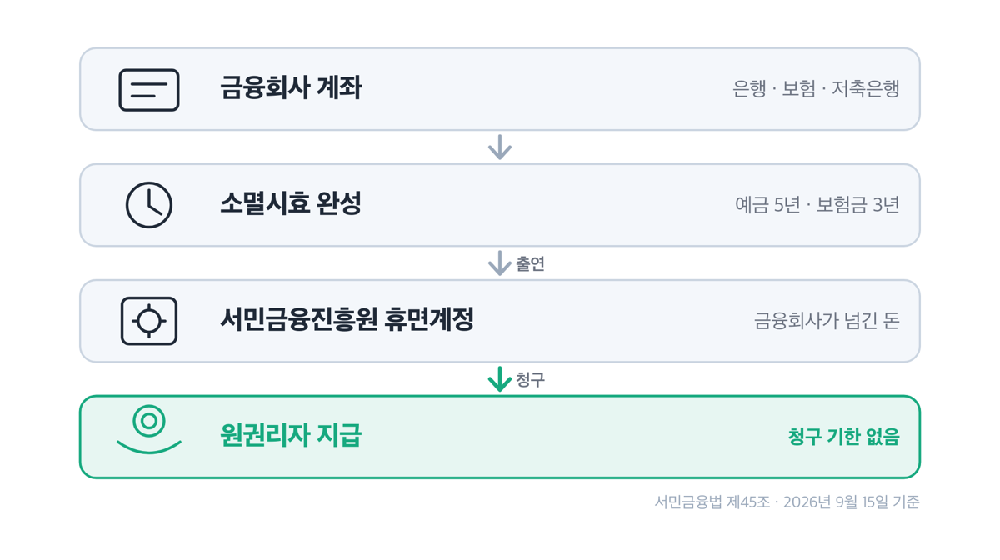
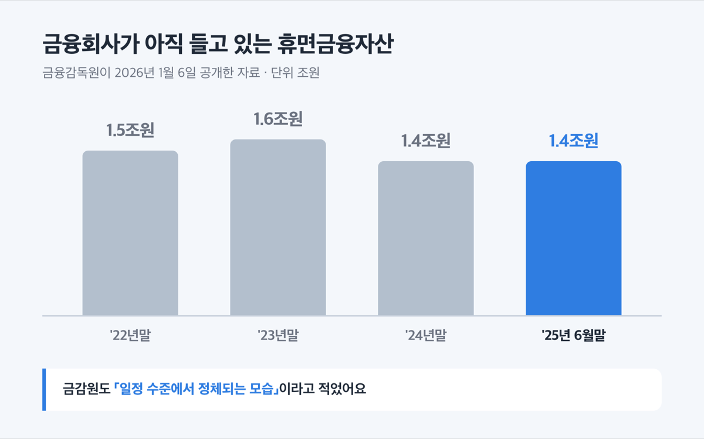
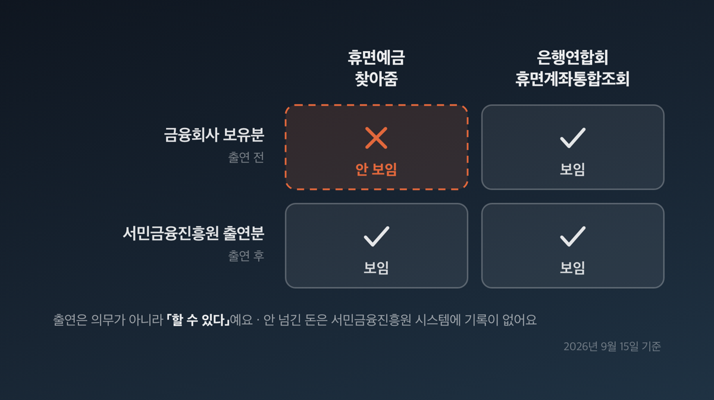
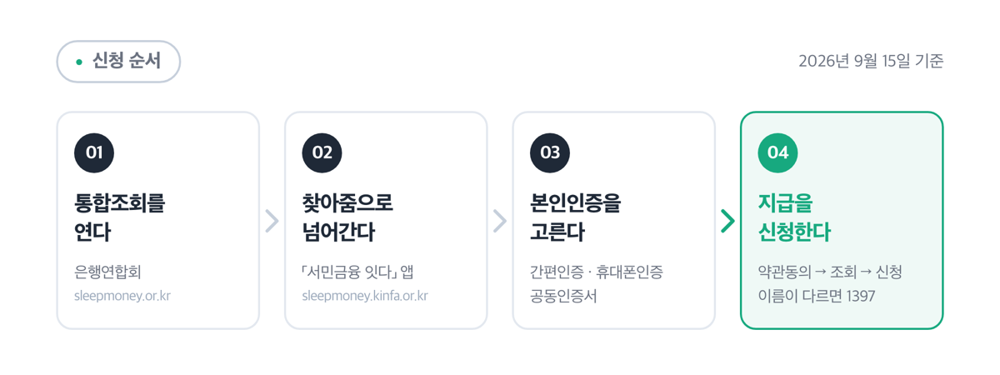
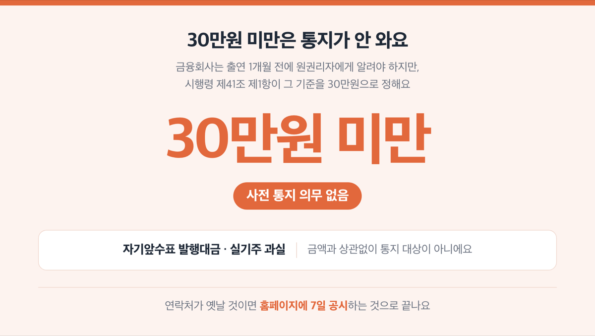

📌 2026년 9월 15일 기준

# '1.4조원' 휴면예금 조회 2026, 한 곳만 보면 못 찾아요

1조 4천억원이에요. 소멸시효가 끝났는데 아직 금융회사에 남아 있는 돈입니다. 이 돈은 「휴면예금 찾아줌」에서 조회해도 안 보여요.

**3줄 요약**

1. 휴면예금은 소멸시효가 끝난 예금·보험금·자기앞수표 발행대금이에요. 시효가 끝나도 돈이 사라지지는 않고, 서민금융진흥원으로 넘어간 뒤에는 청구 기한이 따로 없습니다.
2. 2025년 8월부터 마이데이터 앱에서도 조회와 지급이 되고, 2026년 6월부터는 50만원 이하 소액을 토스페이머니로 바꿔 받을 수 있어요.
3. 「휴면예금 찾아줌」은 서민금융진흥원에 넘어온 돈만 보여줘요. 아직 금융회사에 있는 돈까지 보려면 은행연합회 휴면계좌통합조회를 함께 열어야 합니다.

돈의 갈래와 시효, 창구별로 보이는 범위, 온라인 지급 한도, 그리고 자주 걸리는 것 넷까지 순서대로 짚어요.

## 휴면예금이 뭔가요 — 시효가 끝난 내 돈이에요

휴면예금의 법률상 정의는 「채권 또는 청구권의 소멸시효가 완성된 예금등」입니다. 소멸시효는 권리를 일정 기간 쓰지 않으면 그 권리가 없어지는 제도예요. 쉽게 말하면 은행에 "내 돈 주세요"라고 말할 수 있는 권리가 시간이 지나 없어진 상태입니다.

시효 기간은 갈래마다 달라요.

| 휴면예금등 갈래 | 소멸시효 완성 기간 | 서민금융진흥원에 출연하는 곳 |
|---|---|---|
| 휴면예금 (예금·적금) | 5년 | 은행, 저축은행 |
| 휴면보험금 (환급금·만기보험금·배당금) | 3년 | 생명·손해보험, 우체국보험 |
| 휴면자기앞수표 (발행대금) | 5년 | 은행 |
| 실기주 과실 (배당금) | 10년 | 한국예탁결제원 |

이 숫자는 상법에 나와요. 상법 제64조는 상행위로 생긴 채권의 시효를 5년으로 정하고, 제662조는 보험금청구권을 3년으로 정합니다. 은행 예금이 상행위로 생긴 채권이라 5년이 붙는 거예요.

「실기주 과실」은 말이 어렵습니다. 주식을 샀는데 주주명부에 내 이름을 올리는 절차를 밟지 않아 한국예탁결제원 이름으로 남은 주식이 실기주이고, 거기서 나온 배당금이 과실이에요.

서민금융진흥원으로 넘어가는 대상은 2003년 이후 시효가 끝난 휴면예금·보험금, 2012년 이후 시효가 끝난 자기앞수표 발행대금입니다.

그럼 시효가 끝나면 돈이 사라질까요. 아니에요. 서민금융법 제45조는 「원권리자의 지급청구가 있는 경우에는 지급하여야 한다」고 적고, 이 조문에는 청구 기한이 없습니다. 원권리자는 시효 완성으로 청구권을 잃은 사람을 가리키는 법률 용어예요.

정리하면 이렇습니다. 금융회사에 대한 권리는 없어지지만, 그 돈이 서민금융진흥원 휴면계정으로 넘어간 뒤에는 기한 없이 청구해 받을 수 있어요.

## 얼마나 남아 있나 — 숫자 두 개를 섞으면 안 돼요

휴면예금 규모로 숫자 두 개가 돌아다니는데, 대상이 전혀 다릅니다.

먼저 금융회사가 아직 들고 있는 돈이에요. 금융감독원이 2026년 1월 6일 공개한 자료 기준입니다.

| 시점 | 금융회사 보유 휴면금융자산 |
|---|---|
| '22년말 | 1.5조원 |
| '23년말 | 1.6조원 |
| '24년말 | 1.4조원 |
| '25년 6월말 | 1.4조원 |

4년 동안 줄지를 않아요. 금감원도 「일정 수준에서 정체되는 모습」이라고 적었습니다. 원인으로 짚은 것이 환급률 편차예요. 환급률은 그해 돌려준 계좌 수를 휴면 계좌 수로 나눈 값인데, 은행은 0.3%부터 26.2%까지, 손해보험은 18.6%부터 66.0%까지 벌어집니다. 같은 업권 안에서도 회사별 관리 수준이 달라 생긴 차이라는 게 금감원 설명이에요.

쉽게 말하면 어느 회사 계좌에 묻혀 있느냐에 따라 돌려받을 확률이 백 배 넘게 달라진다는 뜻입니다.

두 번째 숫자는 성격이 반대예요. 서민금융진흥원으로 넘어온 뒤 실제로 주인에게 돌아간 누적 금액입니다.

| 갈래 | 누적 지급액 ('08~'26.6, 억원) |
|---|---|
| 휴면예금 (실기주 과실 포함) | 3,379 |
| 휴면보험금 | 7,143 |
| 휴면자기앞수표 | 14,886 |
| 계 | 25,408 |

가장 큰 갈래가 예금이 아니라 자기앞수표예요. 저는 그래서 수표 쪽을 먼저 의심합니다. 예금은 잔액이 통장에 찍히니까 기억에 남지만, 발행받고 쓰지 않은 자기앞수표는 서랍에 들어간 채로 5년이 지나거든요.

> 😕 저는 거래하는 은행이 한 곳뿐인데 볼 게 있을까요?

거래 은행 수와 별개예요. 위 표에서 보듯 예금보다 자기앞수표와 보험금 쪽이 훨씬 큽니다. 해지한 보험의 환급금, 만기가 지난 보험금, 결혼식이나 전세 계약 때 끊어 둔 수표가 다 대상이에요.

최근 실적도 함께 보면 감이 옵니다. 2026년 상반기에 2,058억원·41.4만건이 지급됐고 건당 평균이 49만 7천원이었어요. 2025년 한 해는 3,732억원·65.8만건에 건당 평균 56만 7천원입니다. 비대면 채널 비중은 금액 기준으로 2025년 55.5%에서 2026년 상반기 63.9%로 올랐어요.

건당 50만원 안팎입니다. 커피값이 아니에요.

## 🔍 어디서 조회하나 — 창구마다 보이는 범위가 달라요

「휴면예금 찾아줌」에서 안 보이는 돈이 은행연합회 창구에서는 보여요. 창구가 열 곳 넘게 있는데 보이는 범위가 같지 않아요.

원리부터 짚을게요. 서민금융법 제40조 제1항은 「금융회사등은 휴면예금등을 휴면계정에 출연할 수 있다」고 적습니다. ==출연은 의무가 아니라 「할 수 있다」예요.== 출연은 금융회사가 그 돈을 서민금융진흥원 휴면계정으로 넘기는 것을 말합니다. 넘기지 않으면 돈은 여전히 금융회사에 있고, 서민금융진흥원 시스템에는 기록이 없어요.

그래서 조회 창구가 「출연 전까지 보이는 곳」과 「출연 후만 보이는 곳」으로 나뉩니다.

| 창구 | 보이는 범위 | 주소 |
|---|---|---|
| 은행연합회 휴면계좌통합조회 | 출연 전 + 출연 후 | sleepmoney.or.kr |
| 생명·손해보험협회 / 내보험찾아줌 | 출연 전 + 출연 후 | cont.insure.or.kr |
| 상호저축은행중앙회 | 저축은행 출연 전 + 출연 후 | sleepmoney.fsb.or.kr |
| 휴면예금 찾아줌 · 「서민금융 잇다」 앱 | 서민금융진흥원 출연분만 | sleepmoney.kinfa.or.kr |
| 어카운트인포 · 정부24 | 서민금융진흥원 출연분만 | payinfo.or.kr · gov.kr |

저라면 「휴면예금 찾아줌」보다 은행연합회 휴면계좌통합조회를 먼저 엽니다. 은행·생명보험·손해보험·우체국의 출연 전 정보에 서민금융진흥원 출연 정보까지 한 번에 나오거든요. 찾아줌부터 열면 「조회 결과 없음」을 보고 끝내기 쉬워요. 그 화면은 「내 휴면예금이 없다」는 뜻이 아니라 「서민금융진흥원에 넘어온 게 없다」는 뜻입니다.

금융감독원 파인에 가면 업권별 창구가 한 화면에 모여 있어요. 새마을금고 휴면예금, 금융투자협회 휴면성증권, 예탁결제원 미수령주식, 보험개발원 자동차보험 과납보험료, 여신금융협회 카드포인트, 정부24 미환급공과금까지 함께 있습니다. 카드포인트는 cardpoint.or.kr에서 따로 봐요.

계좌정보통합관리서비스, 이른바 어카운트인포도 함께 쓸 만합니다. 금융결제원이 운영하고 장기 미거래 계좌와 휴면 금융자산을 한 화면에서 봐요. 이용 시간에 제한이 있으니 미리 알아 두세요.

| 서비스 | 이용 시간 |
|---|---|
| 계좌 조회 | 매일 09:00~22:00 |
| 계좌 해지·잔고이전 | 매 영업일 09:00~17:00 |

잔고가 100만원 이하이고 1년 넘게 입출금이 없으면 여기서 바로 해지하고 잔액을 본인 계좌로 옮길 수 있어요. 만기가 있는 상품은 만기 후 1년이 지나야 합니다. 다만 한 번 처리한 해지와 잔고이전은 취소가 안 됩니다.

## 온라인으로 다 되나 — 2천만원이 경계예요

회사에 알리지 않고 휴대폰으로 끝낼 수 있느냐. 대부분 됩니다. 다만 금액과 이름이라는 두 개의 문턱이 있어요.

먼저 금액입니다.

> [!WARNING]
> 온라인 지급 한도를 두고 서민금융진흥원 문서 두 개가 다르게 적어요. 자주 묻는 질문은 「2천만원 미만」, 2026년 4월 7일 보도자료는 「2,000만 원 이하」입니다. 딱 2,000만원에 걸리면 서민금융콜센터 1397로 확인하세요.

이 선을 넘으면 영업점이나 서민금융통합지원센터를 방문해야 해요. 선 아래라면 평일 24시간 비대면으로 됩니다.

다음은 이름이에요. ==원권리자명과 예금주명이 일치할 때만 온라인 신청이 됩니다.== 개명을 했거나 두음법칙으로 표기가 다르면 화면에서 막혀요. 이때는 출연한 금융회사 영업점이나 서민금융통합지원센터를 방문해 지급신청을 하거나 정보변경을 요청해야 합니다.

받는 방법도 하나 늘었어요. 2026년 6월부터 50만원 이하 소액 휴면예금·보험금은 토스페이머니로 바꿔 받을 수 있습니다. 전자금융거래법을 준용해 소액부터 먼저 시작한 것이고, 지급 추이를 보고 단계적으로 넓힐 예정이에요. 개시 한 달 동안 10.4억원·6만건이 나갔습니다.

신청은 이 순서로 하면 돼요.

1. 은행연합회 휴면계좌통합조회(sleepmoney.or.kr)를 먼저 엽니다. 출연 전과 출연 후가 한 번에 보여요.
2. 서민금융진흥원에 넘어온 돈이 있으면 「휴면예금 찾아줌」(sleepmoney.kinfa.or.kr) 또는 「서민금융 잇다」 앱으로 들어갑니다.
3. 화면은 약관동의 → 조회 → 신청 세 단계예요. 본인인증은 간편인증·휴대폰인증·공동인증서 중 하나를 고릅니다.
4. 카카오뱅크·신한은행·국민은행·우리은행·고려저축은행 앱에서도 되고, 웰컴저축은행·기업은행·농협은행·하나은행 같은 마이데이터 앱에서도 돼요. 마이데이터는 여러 금융사에 흩어진 내 금융정보를 한 앱에 모아 보여주는 서비스입니다.
5. 온라인이 어렵거나 이름이 다르면 서민금융콜센터 1397로 전화하세요. 평일 9시부터 18시까지, 통화료는 무료입니다. 센터를 방문할 때는 1397로 미리 예약해야 합니다.

보험 쪽만 보려면 내보험찾아줌(cont.insure.or.kr)이 빠릅니다. 파산한 금융회사에 돈을 넣어 뒀다면 그건 휴면예금이 아니라 예금보험공사 미수령금이에요. fins.kdic.or.kr에서 통합신청하고, 문의는 1588-0037입니다.

## 놓치기 쉬운 것 넷

**첫째, 30만원 미만은 통지가 안 옵니다.** 금융회사는 출연하기 1개월 전에 원권리자에게 알려야 하는데, 시행령 제41조 제1항이 그 기준을 30만원으로 정해요. ==30만원 미만은 통지 의무가 없습니다.== 자기앞수표 발행대금과 실기주 과실은 금액과 상관없이 통지 대상이 아니고요.

저는 이 조건에서 가장 많이 놓친다고 봐요. 큰돈은 어차피 우편이나 문자가 오지만, 20만원짜리는 아무 연락 없이 조용히 넘어갑니다. 연락처가 옛날 것이면 홈페이지에 7일 공시하는 것으로 끝나요.

**둘째, 파인을 거치는 업권별 조회는 PC용입니다.** 금감원이 직접 붙여 둔 안내문에 「PC기반 인터넷브라우저를 통해 제공되며 모바일 환경에서는 사용에 제약이 있다」고 적혀 있어요. 휴대폰으로 안 열린다고 서비스가 없는 게 아닙니다.

**셋째, 어카운트인포 안의 예금보험공사 링크가 죽어 있어요.** 2026년 9월 15일 기준으로 그 버튼을 누르면 페이지를 찾을 수 없다는 화면이 떠요. 미수령금은 fins.kdic.or.kr로 바로 들어가세요.

**넷째, 상속인은 비대면이 안 됩니다.** 돌아가신 분의 휴면예금은 온라인으로 신청할 수 없고 영업점이나 서민금융통합지원센터를 방문해야 해요. 서민금융진흥원 출연분을 넘어 전 금융권 거래를 보려면 금융감독원 상속인 금융거래조회(cmpl.fss.or.kr)를 따로 이용합니다. 문의는 1332예요.

방문할 때 필요한 서류는 신청 내용과 금융회사마다 달라요. 가기 전에 해당 금융회사나 1397에 확인하세요.

## 휴면예금 조회 관련 궁금증 해결

**Q. 시효가 지났으면 이미 늦은 것 아닌가요?**
A. 아니에요. 서민금융진흥원 휴면계정으로 넘어간 돈은 서민금융법 제45조에 따라 청구하면 지급해야 합니다. 이 조문에 청구 기한이 없어요. 10년 전에 넘어간 돈도 지금 신청하면 받습니다.

**Q. 개명을 했는데 온라인으로 신청되나요?**
A. 원권리자명과 예금주명이 일치할 때만 온라인이 돼요. 다르면 출연한 금융회사 영업점이나 서민금융통합지원센터를 방문해 지급신청 또는 정보변경을 요청하세요.

**Q. 자녀 명의 계좌도 조회할 수 있나요?**
A. 서민금융진흥원 온라인 서비스는 만 14세 미만의 회원가입과 이용을 제한해요. 미성년 자녀 몫은 영업점이나 서민금융통합지원센터에서 처리하는 게 확실합니다. 방문 전에 1397로 예약하세요.

**Q. 카드포인트도 여기서 보이나요?**
A. 휴면예금 창구에는 안 나와요. 카드포인트는 여신금융협회가 운영하는 cardpoint.or.kr에서 따로 조회하고 현금으로 바꿉니다. 금감원 파인에 두 창구가 나란히 모여 있어요.

**Q. 파산한 저축은행에 넣어 둔 돈도 휴면예금인가요?**
A. 다른 항목이에요. 부실화된 금융회사의 예금자가 찾아가지 않은 돈은 예금보험공사 미수령금이고, 예금보험금·개산지급금·정산금·가지급금·파산배당금이 여기 들어갑니다. fins.kdic.or.kr에서 통합신청하세요.

## 그래서 내 돈은요

건당 평균이 49만 7천원입니다. 2026년 상반기에만 41.4만 명이 그 돈을 찾아갔어요.

순서는 하나만 기억하면 됩니다. 은행연합회 휴면계좌통합조회를 먼저 열고, 거기서 서민금융진흥원 출연분이 잡히면 「휴면예금 찾아줌」이나 「서민금융 잇다」 앱으로 넘어가세요. 보험은 내보험찾아줌, 카드포인트는 여신금융협회, 파산 금융회사 돈은 예금보험공사로 갈라집니다.

2026년 4월부터 8월까지 서민금융진흥원이 만 65세 이상이면서 30만원 이상을 보유한 원권리자 8만 명에게 우편을 보냈어요. 행정안전부 협조로 받은 최신 주소로 매주 5천 명씩 나갔습니다. 부모님께 그런 우편물이 갔는지 한 번 여쭤보세요. 2025년부터는 통신사의 최신 번호로 보내는 공인알림문자도 함께 나가고 있어요.

하반기에는 국민연금공단과 협력해 국민연금 수급자 대상 안내를 넓힐 계획이라고 밝혔습니다. 계획 단계예요.

마지막으로 하나만 덧붙일게요. 금융회사가 들고 있는 1.4조원은 4년째 그대로예요. 회사가 알아서 돌려주기를 기다리는 것보다 10분 들여 직접 조회하는 쪽이 빠릅니다. 조회는 공짜예요.

개별 자격이나 서류가 궁금하면 서민금융콜센터 1397, 상속 관련 전 금융권 조회는 금융감독원 1332, 어카운트인포는 1577-5500으로 문의하세요.

참고: 국가법령정보센터 「서민의 금융생활 지원에 관한 법률」 및 같은 법 시행령 · 「상법」 · 서민금융진흥원 「휴면예금 안내」와 자주하는 질문 · 서민금융진흥원 보도자료(2025.8.18 · 2026.1.21 · 2026.4.7 · 2026.6.5 · 2026.7.16) · 금융감독원 보도자료(2026.1.6) · 금융감독원 파인 · 금융결제원 계좌정보통합관리서비스 · 정부24 · 예금보험공사 금융안심포털
