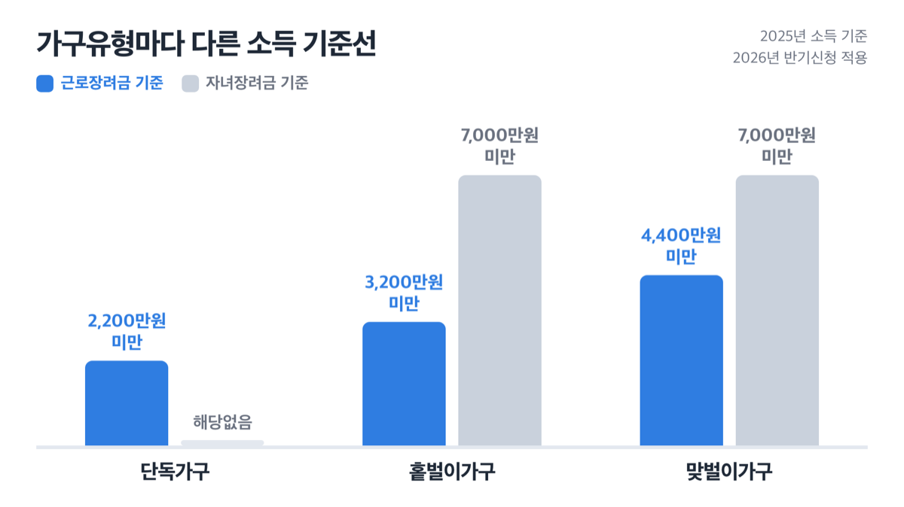
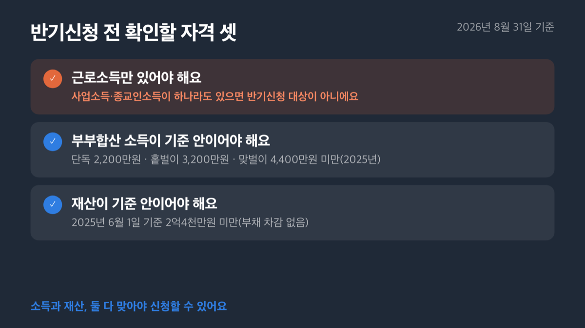
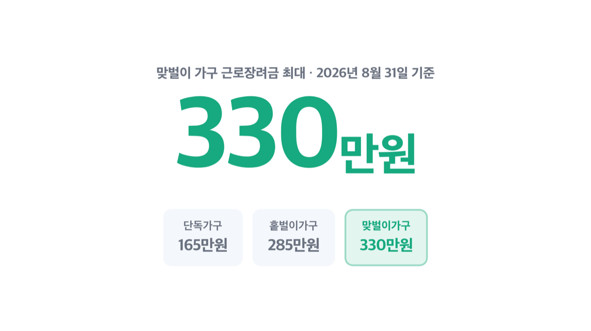
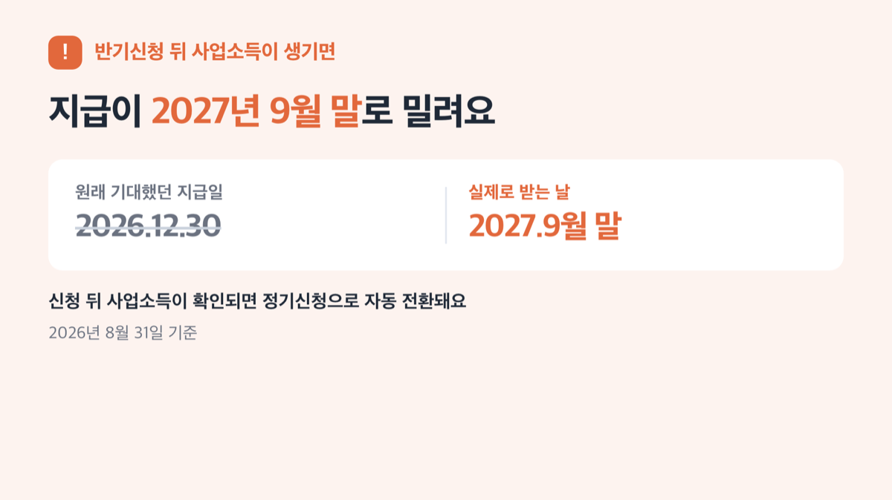

# 2026 근로장려금 반기신청 9월 15일 마감 최대 330만원

📌 2026년 8월 31일 기준

근로장려금은 봄에 한 번만 신청하는 제도인 줄 알았어요. 그런데 근로소득자라면 9월에 한 번 더 기회가 있더라고요. 다만 조건은 봄 신청과 좀 달라요.

**3줄 요약**
- 근로장려금은 국세청이 소득이 적은 근로자에게 현금으로 얹어주는 제도예요.
- 근로소득자만 낼 수 있는 반기신청은 ==9월 1일부터 15일==까지예요.
- 신청 전에 부부합산 소득과 재산이 기준 안에 드는지부터 확인해야 해요.

지급액은 가구유형마다 최대 165만원에서 330만원까지 달라지고, 자격은 소득과 재산 둘 다 봐야 해요.

## 근로장려금이 뭔가요 — 정기냐 반기냐

근로장려금의 신청 방법은 정기신청, 반기신청, 기한후신청, 이렇게 셋입니다. 근로·사업·종교인 소득이 있으면 정기신청만 할 수 있고, 근로소득만 있으면 정기신청과 반기신청 중 하나를 고를 수 있어요.

왜 반기신청이 따로 있을까요. 근로소득자는 매달 급여가 들어오니, 국세청이 상반기 급여만 보고도 1년치 소득을 미리 추정할 수 있기 때문이에요. 그래서 연말까지 안 기다리고 상반기 소득만으로 먼저 심사받을 수 있는 길을 열어둔 거예요.

| 신청 유형 | 신청 대상 | 신청 기간 (연도.월.일) |
|---|---|---|
| 정기신청 | 근로·사업·종교인 소득자 | 2026.5.1~6.1 |
| 반기신청(상반기) | 근로소득자만 | 2026.9.1~9.15 |
| 반기신청(하반기) | 근로소득자만 | 2027.3.1~3.15 |
| 기한후신청 | 정기신청을 놓친 사람 | 2026.6.2~12.1 |

정기신청은 2025년 소득을, 반기신청 상반기분은 2026년 상반기 소득을, 반기신청 하반기분은 2026년 하반기 소득을 봅니다. 사업소득이나 종교인 소득이 하나라도 있으면 이번 9월 반기신청은 대상이 아니에요.

## 자격 요건 — 소득과 재산을 같이 봐요

소득과 재산, 두 가지 조건을 모두 맞추어야 신청할 수 있어요. 하나만 봐도 된다고 생각하면 나중에 재산에서 걸립니다.

가구유형 정의부터 봐야 해요.
- 단독가구: 배우자, 18세 미만 부양자녀, 70세 이상 직계존속이 모두 없는 가구 *(혼자 버는 1인 가구가 여기예요)*
- 홑벌이가구: 배우자 총급여가 300만원 미만이거나, 배우자가 없어도 부양자녀나 70세 이상 직계존속이 있는 가구 *(배우자가 거의 안 벌거나 아이·부모님을 모시는 경우)*
- 맞벌이가구: 거주자와 배우자 각각의 총급여가 300만원 이상인 가구 *(둘 다 어느 정도 버는 부부)*

> 맞벌이라 둘 다 버니까 저희는 해당 안 되겠죠?

맞벌이 기준은 오히려 홑벌이보다 넓어요. 홑벌이는 3,200만원 미만인데 맞벌이는 4,400만원 미만까지 봐줍니다. 각자 버는 돈이 크지 않다면 맞벌이라서 더 유리한 경우도 있어요.

| 가구유형 | 근로장려금 소득 기준(2025년) | 자녀장려금 소득 기준(2025년) |
|---|---|---|
| 단독가구 | 2,200만원 미만 | 해당없음 |
| 홑벌이가구 | 3,200만원 미만 | 7,000만원 미만 |
| 맞벌이가구 | 4,400만원 미만 | 7,000만원 미만 |

2026년 9월에 신청하는데 2025년 소득을 먼저 보는 이유가 있어요. 지금은 2026년 9월인데 왜 2025년 소득을 보냐는 거예요. 2026년 소득은 아직 연말이 안 지나서 확정이 안 됐거든요. 그래서 자격이 되는지는 이미 확정된 2025년 소득으로 먼저 걸러내고, 실제로 얼마를 줄지는 2026년 상반기 급여를 따로 계산해요. 자격 기준 연도와 지급액 계산 연도가 서로 다른 이유가 이거예요.

재산 요건도 따로 있어요.

| 재산요건 항목 | 기준 (2025년 6월 1일 재산 합계액 기준) |
|---|---|
| 기준일 | 2025년 6월 1일 |
| 기본 기준 | ==2억4천만원== 미만 |
| 감액 구간 | 1억7천만원 이상~2억4천만원 미만이면 50%만 지급 |
| 부채 처리 | 차감하지 않음 |

주택·토지·자동차(영업용 제외)·전세금·금융자산·회원권까지 다 더한 값이에요. 부채는 안 빼줘요. 대출 끼고 산 집도 시가 그대로 잡힙니다.

## 신청 기간과 신청 방법 — 9월 15일 안에 이렇게 하세요

> [!WARNING]
> 반기신청 문은 딱 15일만 열립니다. 9월 1일에 열려서 9월 15일에 닫혀요. 이 기간을 넘기면 다음 기회는 내년 3월 반기신청이거나, 감액을 감수하는 기한후신청뿐이에요.

신청은 번호대로 따라가면 됩니다.

1. 내가 근로소득만 있는지 먼저 확인해요. 사업소득이나 종교인 소득이 하나라도 섞여 있으면 반기신청이 아니라 정기신청 대상이에요.
2. 위 표로 부부합산 소득과 재산이 기준 안에 드는지 확인해요.
3. 9월 1일부터 15일 사이에 접수해요. 정확한 접수 화면은 국세청 홈페이지(nts.go.kr)에서 확인하는 게 가장 정확해요.
4. 접수하고 나면 2026년 12월 30일에 예상 연간산정액의 35%를 먼저 받아요.
5. 하반기(2027년 3월) 신청은 따로 안 내도 돼요. 상반기 신청을 했다면 하반기도 신청한 것으로 봅니다.

'상반기 신청'이라는 말 안에는 사실 두 번의 지급이 숨어 있어요. 12월엔 35%만 먼저 오고, 나머지는 다음 해 6월 30일에 실제 2026년 소득으로 다시 계산해 정산합니다.

## 얼마 받나 — 최대 330만원의 진짜 계산

| 가구유형 | 근로장려금 최대 | 자녀장려금(1인당) |
|---|---|---|
| 단독가구 | 165만원 | 해당없음 |
| 홑벌이가구 | 285만원 | 최대 100만원 |
| 맞벌이가구 | ==330만원== | 최대 100만원 |

저라면 이 표의 '최대' 숫자에 기대를 걸지 않아요. 근로장려금은 최소 3만원부터 시작하고, 자녀장려금도 최소 50만원부터라 대부분은 이 사이 어딘가에서 받거든요.

반기신청의 지급액 계산은 상반기 급여를 6개월치가 아니라 1년치로 늘려서 잡는 방식이에요. 상용직으로 계속 일한 사람은 상반기 총급여에 월평균 급여의 6개월치를 더해 1년치 소득으로 환산해요. 일용직이거나 상반기 중에 그만둔 사람은 상반기 총급여를 그냥 2배 합니다.

쉽게 말하면, 반기신청은 월급을 미리 가불받는 것과 비슷해요. 상반기 실적만 보고 1년치를 추정해서 먼저 주고, 다음 해 6월에 실제 2026년 소득으로 다시 맞춰봅니다.

| 구분 | 지급일 | 지급액 |
|---|---|---|
| 상반기분 | 2026.12.30 | 예상 연간산정액의 35% |
| 하반기분(정산) | 2027.6.30 | 연간산정액 − 상반기 기지급액 |

상반기분 지급 때는 근로장려금만 나가요. 자녀장려금은 해당돼도 하반기 정산 때 함께 지급됩니다.

## ⚠️ 자주 걸리는 함정 셋

그런데 여기서 많은 사람이 걸립니다.

**함정 하나 — 반기신청 뒤에 사업소득이 생기면 지급이 다음 해로 밀려요.** 반기신청은 2026년에 근로소득만 있어야 유지됩니다. 신청 뒤에라도 사업소득이 확인되면 정기신청한 것으로 처리되고, 지급도 반기가 아니라 2027년 9월 말로 넘어가요.

**함정 둘 — 12월에 받는 돈은 전부가 아니에요.** 상반기분으로 먼저 나오는 건 예상 연간산정액의 35%뿐이고, 나머지는 다음 해 6월 정산 때 추가로 받거나 반대로 환수될 수 있어요.

**함정 셋 — 기한을 놓쳐도 안전판이 있긴 한데, 온전히는 안 줍니다.** '기한후신청'이라는 제도가 6월 2일부터 12월 1일까지 있어요. 다만 이 안전판은 지급액의 95%만 줍니다. 5%는 그냥 깎이고 끝이에요.

물론 소득이 낮으면 신청 자격 자체는 넉넉한 편이에요. 그런데 재산 기준(2억4천만원)에서 걸리는 가구가 생각보다 많습니다.

허위로 신청하면 불이익이 꽤 큽니다. 지급받은 금액에 하루 22/10만의 가산세까지 얹어 돌려줘야 하고, 고의나 중과실이면 2년, 사기 등 부정행위면 5년 동안 아예 지급이 제한돼요. 체납액이 있으면 환급금의 30%까지 그 체납액에 먼저 충당됩니다.

저라면 소득이 애매하게 걸치는 상황에서는 정기신청부터 챙깁니다. 반기는 나중에 정산 과정에서 다시 계산되는 구조라, 미리 받은 돈을 도로 뱉어낼 수도 있거든요.

## 자녀장려금도 같이 챙기세요

자녀장려금은 총소득 기준(7,000만원 미만)만 다르고, 나머지 요건은 근로장려금과 똑같습니다. 신청서도 따로 안 내요. 같은 신청 절차 안에서 함께 심사됩니다.

다만 반기신청에서는 순서가 달라요. 상반기 지급(12월)에는 근로장려금만 나가고, 자녀장려금분은 하반기 정산(다음 해 6월) 때 함께 지급됩니다. 소득세 신고 때 자녀세액공제와 자녀장려금을 둘 다 신청하면 자녀세액공제금액만큼 차감돼요.

## 근로장려금 반기신청 관련 궁금증 해결

**Q1. 정기신청이랑 반기신청, 둘 다 낼 수 있나요?**
아니요, 근로소득만 있으면 둘 중 하나를 골라야 해요. 사업소득이나 종교인 소득이 있으면 정기신청만 가능합니다.

**Q2. 반기신청 후에 사업소득이 생기면 어떻게 되나요?**
정기신청한 것으로 처리돼서 2027년 9월 말에 지급됩니다. 반기신청 때 받기로 했던 12월 지급은 없던 일이 돼요.

**Q3. 재산이 2억이 넘는데 신청할 수 있나요?**
2억4천만원 미만이면 가능해요. 다만 1억7천만원 이상 2억4천만원 미만 구간이면 계산된 금액의 절반만 나옵니다.

**Q4. 9월 15일을 놓치면 완전히 끝인가요?**
아니요, 6월 2일부터 12월 1일까지 기한후신청이 있어요. 대신 지급액의 5%가 깎여요.

**Q5. 자녀장려금은 따로 신청해야 하나요?**
아니요, 같은 신청 절차 안에서 함께 심사돼요. 다만 반기신청의 상반기분엔 근로장려금만 먼저 나오고, 자녀장려금은 하반기 정산 때 같이 나와요.

그래서 결국 내 돈은 얼마냐는 질문으로 돌아오게 됩니다. 답은 가구유형과 소득·재산에 따라 165만원에서 330만원 사이 어딘가예요. 정확한 액수는 표로 짚어드린 소득·재산 기준에 내 상황을 대입해봐야 나옵니다. 기준에 걸치는 것 같으면 9월 15일 전에 먼저 확인부터 해보시는 게 맞아요.

참고: 국세청 「근로장려금 소개」 · 국세청 「신청자격」 · 국세청 「신청기간 및 방법」 · 국세청 「심사 및 지급」 · 국세청 「자녀장려금 소개」 · 국세청 2026년 근로장려금 반기 신청·지급제도 카드뉴스 · 국세청 2026년 신청 근로장려금 자녀장려금 제도안내 리플릿 · 대한민국 정책브리핑(korea.kr)
