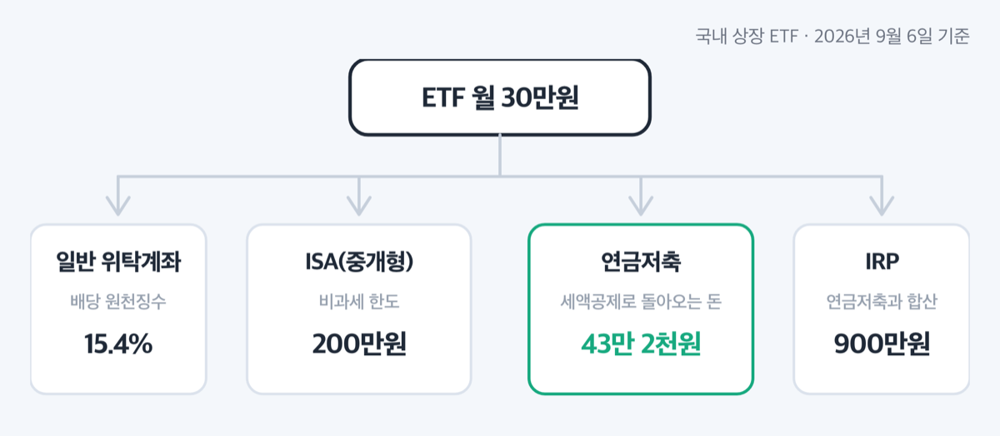
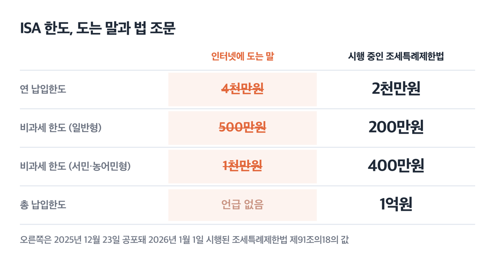
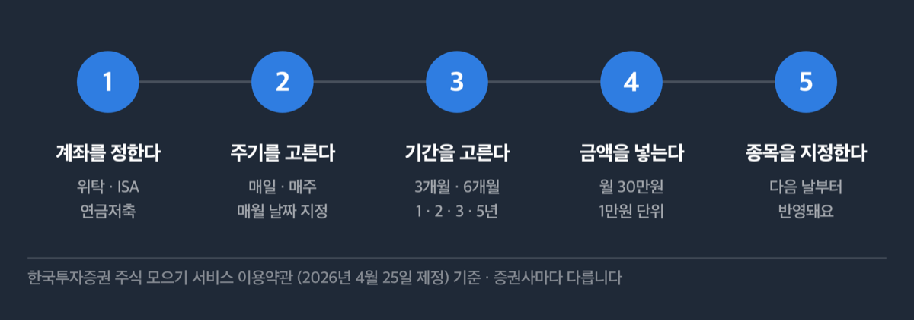

# ETF 적립식 투자 월 30만원, ISA 한도는 2026년에도 2천만원

📌 2026년 9월 6일 기준

ISA(개인종합자산관리계좌) 한도가 2026년부터 연 4천만원이 됐다는 말이 검색창 위쪽에 줄줄이 떠 있어요. 저도 그런 줄 알고 법 조문을 열었는데, 연 2천만원이 그대로였습니다. 월 30만원 적립이면 이 숫자부터 맞춰야 해요.

**3줄 요약**

1. ISA는 이자와 배당에 붙는 세금을 덜 매기는 계좌예요. 2026년 9월 6일 현재 시행 중인 조세특례제한법 기준으로 연 납입한도 2천만원, 총 1억원, 비과세 한도는 일반형 200만원·서민형 400만원입니다.
2. 2026년 세제개편안은 8월 3일 발표돼 9월 1일 국무회의에서 정부안으로 확정됐고, 아직 법률이 아니에요. 8월 초에 퍼진 '일반 ISA 5년 제한, 한도 이월 폐지'는 9월 1일에 철회됐습니다.
3. 월 30만원은 연 360만원이고 ISA 연 한도의 18%예요. 먼저 정할 것은 금액이 아니라 어느 계좌에 담느냐입니다.

계좌 고르기, 도는 말과 실제 법의 차이, 세금 계산, 자동매수 설정, 자주 걸리는 것까지 순서대로 짚어 볼게요.

## ETF 적립식, 계좌를 먼저 고릅니다

국내 상장 ETF(상장지수펀드)를 담을 수 있는 계좌는 일반 위탁계좌, ISA(중개형), 연금저축계좌, IRP(개인형 퇴직연금) 넷으로 나뉘어요. 같은 상품을 같은 금액으로 사도 계좌마다 세금을 매기는 법이 따로 정해져 있어서, 계좌를 정하는 순간 세후 수익이 달라집니다.

ISA는 조세특례제한법에, 연금저축과 IRP는 소득세법에 각각 규칙이 적혀 있어요. 그래서 두 계좌의 한도와 인출 조건이 서로 다른 방식으로 굴러갑니다.

| 계좌 | 세금이 붙는 방식 | 걸리는 조건 |
|---|---|---|
| 일반 위탁계좌 | 배당소득 원천징수 14% *(지방소득세 포함 15.4%)* | 없음 |
| ISA(중개형) | 비과세 200만원, 초과분 9% 분리과세 | 1인 1계좌, 계약 3년 이상 |
| 연금저축계좌 | 납입액에 세액공제 12%, 조건 맞으면 15% | 연 600만원까지 공제 |
| IRP | 연금저축과 합쳐 연 900만원까지 공제 | 위험자산 70% 한도 |

*표의 세율은 2026년 9월 6일 현재 시행 중인 소득세법·조세특례제한법 기준이에요.*

ISA는 아무나 여는 계좌가 아니에요. 가입일 기준 19세 이상이거나, 15세 이상이면서 직전 과세기간에 근로소득이 있어야 합니다. 비과세소득만 있었다면 대상에서 빠져요.

여는 순간 끝이 아니라는 것도 알아 두면 좋아요. 계좌를 열 때는 세무서장이 발급한 소득확인증명서를 내고, 국세청장이 나중에 요건 충족 여부를 확인해 전국은행연합회에 통지해요. 근로소득 요건은 가입 이듬해 8월 31일까지, 소득 요건은 이듬해 2월 말일까지예요. ==요건 미달로 통보되면 통보받은 그 날에 계약이 해지된 것으로 봅니다.==

직전 과세기간에 소득이 처음 생겨 증명서로 확인이 어려우면 소득 지급확인서, 사업자등록증명원, 원천징수영수증으로 대신할 수 있어요.

계좌를 고르기 전에 한도부터 맞춰야 하는데, 인터넷에 도는 ISA 한도가 실제 법 조문과 다릅니다.

## '연 4천만원'이라고 도는 말과 실제 법

검색 상위에 뜨는 여러 정보성 글이 '2026년부터 ISA 납입한도 연 4천만원, 비과세 일반형 500만원·서민형 1천만원, 개정안이 2025년 12월 국회를 통과했다'고 적고 있어요. 국가법령정보센터에서 현행 조세특례제한법 제91조의18을 직접 열어 봤는데, 그런 값이 없습니다.

| ISA 한도 항목 | 인터넷에 도는 말 | 시행 중인 조세특례제한법 (2026년 1월 1일 시행) |
|---|---|---|
| 연 납입한도 | 4천만원 | **2천만원** |
| 비과세 한도 (일반형) | 500만원 | **200만원** |
| 비과세 한도 (서민·농어민형) | 1천만원 | **400만원** |
| 총 납입한도 | 언급 없음 | **1억원** |

*오른쪽 칸은 2025년 12월 23일 공포돼 2026년 1월 1일 시행된 조세특례제한법 조문의 값이에요.*

왜 이런 말이 도는가 하면, 정부가 개편안을 발표한 것과 국회에서 법이 통과된 것을 같은 일로 적은 글이 그대로 복사되며 퍼졌기 때문이에요. 비과세 한도를 정한 항의 마지막 개정일은 2021년 12월 28일입니다. 다섯 해 가까이 그대로였다는 뜻이에요.

**개편안은 아직 법률이 아닙니다.**

2026년 세제개편안은 8월 3일 발표돼 부처협의와 입법예고를 거쳤고, 9월 1일 국무회의에서 정부안으로 확정된 뒤 9월 3일까지 국회에 제출돼 정기국회 심사를 받게 돼요. 심사에서 바뀔 수 있으니 '2027년부터 이렇게 된다'고 단정할 수 없습니다.

==같은 달 안에서 내용이 뒤집혔습니다.==

| 일반 ISA 항목 | 8월 3일 당초안 | 9월 1일 확정 정부안 |
|---|---|---|
| 계약기간 | 총 5년까지만 | **현행 유지** *(최소 3년, 상한 없음)* |
| 연 한도 미사용분 이월 | 폐지 | **현행 유지** *(이월 가능)* |
| 일몰기한 | 2029년 12월 31일 | **현행 유지** *(일몰 없음)* |

8월 초 기사만 보면 '내 ISA가 5년 뒤 닫힌다'고 읽게 돼요. 9월 1일 보도자료가 최신입니다.

신설안도 하나 올라가 있어요. '생산적금융 ISA'는 이자·배당소득 전액 비과세에 연 2천만원·총 2억원 한도, 국내 상장주식과 국내 주식형 펀드 등에 투자하는 계좌로 설계됐고, 적용 시기는 2027년 1월 1일 이후 신규 가입분부터예요. 15~34세이면서 총급여 7,500만원 이하면 납입금의 10%를 소득공제받는 청년형도 함께 들어 있습니다. 다시 말하지만 국회 심사가 남아 있어요.

> 😕 그럼 지금 ISA를 여는 건 손해 아닌가요?

저는 아니라고 봐요. 근거는 두 가지예요. 첫째, ISA 연 납입한도는 못 채운 해의 한도가 최대 4년치까지 이월되고 이 이월 조항은 9월 1일에 현행 유지로 확정됐어요. 둘째, 계약기간이 3년을 넘겨야 비과세가 유지되니 시계는 일찍 돌리는 편이 유리합니다. **저라면 지금 계좌를 열고 월 30만원부터 시작합니다.**

## 💰 월 30만원이면 세금이 얼마나 달라지나

월 30만원은 연 360만원이에요. ISA 연 한도 2천만원의 18%고, 총 한도 1억원을 이 속도로 채우려면 약 27년 9개월이 걸립니다. 한도가 부담스러워 못 여는 금액이 아니라는 뜻이에요.

세금은 이렇게 나뉘어요.

| 어디서 생긴 돈인가 | 세율 | 조건 |
|---|---|---|
| 일반 계좌의 배당 | 15.4% | 소득세 14% + 지방소득세 1.4% |
| ISA 비과세 한도 안 | 0% | 일반형 200만원, 서민형 400만원까지 |
| ISA 비과세 한도 초과분 | 9.9% | 소득세 9% + 지방소득세 0.9%, 종합소득에 합산하지 않아요 |

*소득세율은 법에 적힌 값이고, 지방소득세를 더한 15.4%·9.9%는 원천징수 소득세의 10%를 더해 계산한 값이에요.*

쉽게 말하면 ISA 안에서는 이익에서 손실을 먼저 뺀 다음, 남은 금액에만 세금을 매겨요. 차감 순서는 같은 종류 자산끼리 먼저, 남으면 배당소득에서, 그래도 남으면 이자소득에서입니다. 보수와 수수료도 이자·배당 합계액에서 빼고 계산해요. 계좌 밖에서는 이런 상계가 안 되고 이익이 난 상품에만 그대로 세금이 붙습니다.

ETF 자체에도 규칙이 있어요. 국내 주식 지수를 그대로 따라가는 ETF의 매매차익은 소득세법 시행령상 '집합투자기구로부터의 이익'에 해당하지 않아요. 다만 ==외국 시장 대표지수를 추종하는 ETF는 이 제외 대상에서 빠집니다.== 국내 지수형이냐 해외 지수형이냐에 따라 계좌 선택의 이득 폭이 달라져요.

이자·배당 합계가 연 2천만원을 넘으면 초과분부터 종합과세 대상이 됩니다. 월 30만원 적립 단계에서 곧바로 걸릴 숫자는 아니에요.

연금저축은 계산이 또 다릅니다. 월 30만원을 연금저축계좌에 넣으면 연 360만원이 세액공제 한도 600만원 안에 전부 들어가요.

| 공제율 | 연 360만원 기준 공제액 | 적용 조건 |
|---|---|---|
| 12% | 43만 2천원 | 기본 |
| 15% | 54만원 | 종합소득금액 4,500만원 이하 *(근로소득만 있으면 총급여 5,500만원 이하)* |

*소득세분 세액공제만 계산한 값이에요. 산출세액이 이 금액보다 작으면 그만큼만 공제됩니다.*

여기서 흔한 오해 하나. 세액공제 한도 600만원과 납입한도는 다른 숫자예요. 연금계좌에는 계좌를 여러 개 합쳐 연 1,800만원까지 넣을 수 있고, 그중 공제되는 금액이 600만원(IRP까지 합치면 900만원)까지입니다.

**그래서 내 돈은 어떻게 되나요.** 월 30만원을 일반 계좌에 넣고 배당을 받으면 15.4%를 떼고, ISA에 넣으면 200만원까지는 안 떼고 넘는 부분만 9.9%를 뗍니다. 연금저축에 넣으면 그해 연말정산에서 43만 2천원이나 54만원이 돌아와요. 대신 55세 이후 연금으로 받을 때 3.3~5.5%를 냅니다.

## 자동매수를 거는 순서

여기서부터는 정부나 거래소가 정한 규칙이 아니라 증권사가 만든 서비스예요. 회사마다 다릅니다. 아래는 한국투자증권이 2026년 4월 25일 제정한 주식 모으기 서비스 약관을 기준으로 읽은 것이고, 다른 회사도 같다고 보면 안 돼요.

1. **계좌를 정합니다.** 국내주식 거래가 되는 위탁계좌, ISA계좌, 연금저축계좌에 걸 수 있어요. 퇴직연금 IRP와 DC형(확정기여형) 계좌에는 걸 수 없습니다.
2. **주기를 고릅니다.** 매 영업일, 매주 요일 지정, 매월 날짜 지정 중 하나예요.
3. **기간을 고릅니다.** 3개월·6개월·1년·2년·3년·5년 중에서 선택해요.
4. **금액을 넣습니다.** 1만원 이상 10억원 이하, 1만원 단위입니다. 월 30만원은 조건에 맞아요.
5. **종목을 지정하고 신청합니다.** 신청은 다음 날부터 반영되고, 변경과 해지는 즉시 반영돼요. 다만 그날 주문이 나간 뒤에 넣은 변경·해지는 다음 날부터 적용됩니다.

주문이 실제로 나가는 방식도 알아 둘 값이 있어요. 주문은 10시에서 11시 사이에 나가고, 실패한 건은 당일 14시경에 한 번만 다시 시도합니다. 가격은 주문 직전 체결가의 103% 수준으로 지정가 주문을 내요. 지정한 날이 휴장일이면 매월 투자는 직전 영업일에 주문이 나가고, 매일·매주 투자는 그날 주문이 나가지 않습니다.

거는 것은 5분이면 됩니다. 문제는 걸어 놓은 뒤에 벌어지는 것들이에요.

## 자동매수에서 자주 걸리는 것들

가장 먼저 부딪히는 것은 남는 돈이에요. ==국내 ETF는 소수점 매수를 제공하지 않습니다.== 매수 수량은 투자금액을 매수가격으로 나눈 값의 정수 부분만 잡고 소수점 이하는 버려요. 한 주에 4만원인 ETF라면 30만원으로 7주, 28만원어치만 사고 2만원이 남습니다.

*이 4만원은 계산을 보여 주려고 든 예시 숫자예요.* 실제 가격은 상품마다 다르니 매수 단가에 맞춰 금액을 정하는 편이 낫습니다.

주문이 체결되지 않는 경우도 정해져 있어요.

1. **잔고가 투자단위에 못 미칠 때** — 자동이체 날짜와 매수 날짜가 어긋나면 여기서 걸려요.
2. **거래정지·관리종목·정리매매·상장폐지 종목일 때** — 주문 자체가 나가지 않습니다.
3. **서킷브레이커, 단일가매매, VI(변동성완화장치)가 걸렸을 때** — 시장이 흔들리는 날 주문이 빠질 수 있어요.

체결은 보장되지 않고, ==미체결이 나도 다음 자동매수일에 합산해 주지 않아요.== 한 달을 통째로 건너뛴 채 지나갈 수 있다는 뜻이에요. 그래서 자동매수를 걸어 두더라도 한 달에 한 번은 체결 내역을 열어 봐야 합니다.

매도는 자동이 아니에요. 매수만 자동이고 파는 것은 본인 책임입니다.

IRP에는 담지 못하는 ETF가 따로 있어요. 목표 지수 변화의 1배를 넘거나 음(−)의 배율로 움직이는 상장지수집합투자기구, 그러니까 레버리지와 인버스 ETF는 퇴직연금감독규정이 막고 있습니다. 위험자산은 가입자별 전체 적립금의 70%까지만 담을 수 있어요.

ISA는 인출 규칙이 함정이에요. 계약일부터 3년 안에 해지하면 특례로 받은 소득세를 추징하고, 3년 안에 원금을 넘겨 인출하면 그 인출일에 중도해지된 것으로 봅니다. 다만 일부 인출은 투자원금부터 빼는 것으로 봐요. 그래서 ==원금 범위 안에서 빼는 것은 3년 전이라도 해지가 아니에요.== 사망이나 해외이주법에 따른 해외이주는 추징 사유에서 빠지고 특별해지사유신고서를 냅니다.

중개형 ISA에서는 미수와 신용거래를 할 수 없고, ISA 밖 계좌에 있던 자산을 ISA로 옮기는 것도 제한돼요. 담을 수 있는 상품에서 외국 집합투자증권은 빠집니다.

마지막으로 비용이에요. 매매수수료율과 ETF 총보수는 회사와 상품마다 다르고 이벤트로도 바뀝니다. 계좌를 열기 전에 해당 증권사의 수수료 안내와 상품 투자설명서에서 총보수를 확인하세요. ISA 계좌별 수수료는 금융투자협회 ISA 비교공시(isa.kofia.or.kr)에서 견줘 볼 수 있어요.

## ETF 적립식 투자 관련 궁금증 해결

**Q. ISA 계좌를 두 개 만들어 나눠 넣어도 되나요?**

A. 안 됩니다. 조세특례제한법이 1명당 1개 계좌만 보유하도록 정해 놓았어요. 다만 국회에 올라간 생산적금융 ISA 신설안에는 복수계좌 허용이 들어 있는데, 아직 법률이 아닙니다.

**Q. 올해 월 30만원만 넣으면 남은 한도는 사라지나요?**

A. 사라지지 않아요. 연간 납입한도는 '2천만원 × [1 + 가입 후 경과 연수] − 누적 납입금액'으로 계산해서, 못 넣은 해의 한도가 최대 4년치까지 이월됩니다. 경과 연수는 4년에서 멈춰요. 이 이월 조항을 없애려던 안은 2026년 9월 1일에 철회됐습니다.

**Q. 연금저축에 넣은 돈을 급하게 빼면 어떻게 되나요?**

A. 연금이 아닌 방식으로 빼면 기타소득세 15%를 원천징수하고 분리과세로 끝냅니다. 지방소득세까지 더하면 16.5%예요. 세액공제로 돌려받은 것보다 더 낼 수 있으니, 3년 안에 쓸 돈이면 연금계좌에 넣지 않는 편이 낫습니다.

**Q. ISA 만기 자금을 연금계좌로 옮기면 뭐가 좋은가요?**

A. 계약일부터 3년이 지난 뒤 잔액의 전부나 일부를 연금계좌에 넣으면 ISA 계약기간이 만료된 것으로 보고, 전환금액의 10%와 300만원 중 적은 금액을 세액공제 한도에 더해 줍니다. 기본 한도 600만원 위에 얹히는 금액이에요.

**Q. 연금저축이나 IRP에서 원하는 ETF를 다 살 수 있나요?**

A. 증권사마다 매매 가능 상품 목록이 다릅니다. 계좌를 열기 전에 해당 증권사 연금 상품 목록에서 사려는 ETF가 있는지 확인하세요.

## 그래서 월 30만원을 어떻게 굴리나

정리하면 순서는 이래요. 계좌를 먼저 정하고, 한도를 실제 법에 적힌 숫자로 맞추고, 자동매수를 건 다음, 한 달에 한 번 체결 내역을 확인합니다.

저라면 이렇게 나눕니다. **3년 안에 쓸 가능성이 있는 돈은 ISA에, 55세까지 안 건드릴 돈만 연금저축에 넣어요.** 근거는 위에 쓴 그대로예요. ISA는 원금 범위 안에서 빼면 3년 전에도 해지가 아니지만, 연금저축은 중간에 빼는 순간 16.5%가 붙습니다. 세액공제 43만 2천원을 받자고 유동성을 5년, 10년 묶는 것은 계산이 안 맞는 경우가 많아요.

그리고 한 가지는 확실합니다. **인터넷에 도는 4천만원과 500만원으로 계획을 세우면 그 계획은 지금 법과 어긋납니다.** 2026년 9월 6일 현재 값은 연 2천만원, 비과세 200만원(서민형 400만원)이에요.

국회 심사 결과에 따라 2027년부터 적용될 제도는 달라질 수 있어요. 지금 확인해 볼 것은 두 가지입니다. 본인이 ISA 서민형 요건(직전 과세기간 총급여 5천만원 이하 또는 종합소득금액 3,800만원 이하)에 해당하는지, 그리고 연금저축 세액공제율 15% 구간에 드는지예요. 둘 다 국세청 홈택스에서 소득 자료로 확인할 수 있습니다.

참고: 국가법령정보센터 조세특례제한법 제91조의18 · 소득세법 제59조의3 · 퇴직연금감독규정 제9조 · 재정경제부 「2026년 세제개편안」(2026-08-03) · 재정경제부 「2026년 세제개편안 정부안 확정」(2026-09-01) · 한국투자증권 주식 모으기 서비스 이용약관
