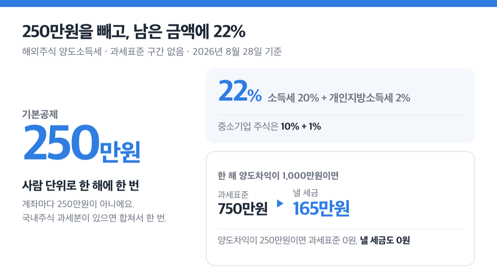
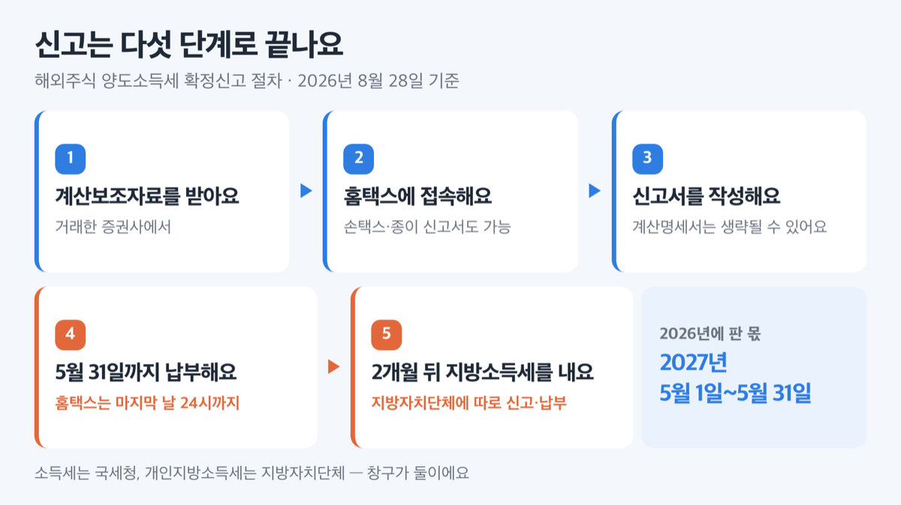

# 2026 해외주식 양도소득세, 250만원 넘으면 22% 냅니다

📌 2026년 8월 28일 기준

해외주식으로 한 해에 1,000만원을 남겼다면 세금은 165만원이에요. 이익 전부가 아니라, 250만원을 먼저 빼고 남은 금액에만 붙거든요. 그리고 국내주식과 달리 이익이 났으면 스스로 신고해야 합니다.

**3줄 요약**

1. 한 해 동안의 해외주식 매매 이익에서 **250만원을 빼고**, 남은 금액에 **소득세 20% + 개인지방소득세 2%가** 붙어요.
2. 예정신고는 없어요. **2026년에 판 몫은 2027년 5월 1일~5월 31일**에 신고하고 납부합니다. 지방소득세는 여기에 **2개월**이 더 붙어요.
3. 2026년 1월 1일 거래부터 **증권사가 국세청 요청을 받으면 해외주식 거래내역을 제출**해요. 안 낸 사람을 찾는 통로가 하나 생긴 겁니다.

세금이 얼마인지, 언제 어디에 내는지, 그리고 매년 같은 데서 걸리는 함정까지 순서대로 적었어요.

## 해외주식 양도소득세는 무엇인가

해외주식 양도소득세는 **외국 증권시장에서 사고판 주식의 이익에 매기는 세금**이에요. 외국 법인이 발행한 주식이 대상이고, 우리나라 회사 주식이라도 해외 증권시장에 상장된 것이면 여기 들어갑니다.

핵심은 '누가 신고하느냐'예요. 국내주식은 대주주이거나 비상장주식일 때만 신고 의무가 생기지만, ==해외주식은 양도소득이 났다면 신고 대상이에요.== 참고로 코스피 대주주 기준이 지분 1% 또는 50억원인데, 해외주식에는 그런 문턱 자체가 없어요.

그래서 대상자가 많습니다. 2025년 귀속 확정신고 안내를 받은 22만 명 중 **국외주식이 18만 2천 명**이었어요. 부동산 1만 명, 국내주식 1만 6천 명, 파생상품 1만 1천 명과 비교하면 차이가 큽니다.

해외주식 계좌를 굴리고 이익을 봤다면 남의 얘기가 아니에요.

## 💰 얼마 내나 — 250만원 빼고 22%

세금은 이 순서로 계산해요. 판 금액에서 산 금액과 필요경비를 빼면 양도차익이 나오고, 거기서 기본공제 250만원을 빼면 과세표준이 됩니다. 그 과세표준에 세율을 곱해요.

필요경비에는 취득가액과 **증권사 매매 수수료처럼 파는 데 직접 든 비용**이 들어가요. 부동산에 있는 장기보유특별공제는 주식에 적용되지 않아요. 10년을 들고 있었어도 세율은 같습니다.

**해외주식 양도소득 세율 (2026년 8월 기준, 과세표준 구간 없음)**

| 구분 | 소득세 | 개인지방소득세 |
|---|---|---|
| 일반 해외주식 | 20% | 2% |
| 중소기업 주식 | 10% | 1% |

흔히 말하는 '22%'가 여기서 나와요. 다만 **뒤의 2%는 성격이 다른 세금**입니다. 소득세 20%는 국세청에, 지방소득세 2%는 지방자치단체에 내고 기한도 달라요. 지방소득세는 지자체가 조례로 표준세율의 50% 범위에서 올리거나 내릴 수 있습니다.

기본공제 250만원은 **사람 단위로 한 해에 한 번**이에요. 계좌마다 250만원이 아니고, 국내주식 과세분이 있다면 그것까지 합쳐서 250만원입니다.

**양도차익별 세금 (한 해 전체 합계, 필요경비 반영 후)**

| 한 해 양도차익 | 과세표준 | 낼 세금 (소득세+지방소득세) |
|---|---|---|
| 250만원 | 0원 | 0원 |
| 1,000만원 | 750만원 | 165만원 |
| 3,000만원 | 2,750만원 | 605만원 |

한 가지 더 있어요. **같은 해에 본 손실은 이익과 상계됩니다.** 해외주식끼리는 물론이고, 국내주식 과세분(대주주 상장분·비상장분)과도 통산돼요. 다만 파생상품과는 통산되지 않고, **다음 해로 이월되지도 않습니다.**

> **솔직히 말하면** — 저라면 12월에 그해 실현 손익을 한 번 계산해 봅니다. 손실은 그 해 안에서만 이익을 깎아 주고 이듬해로 넘어가지 않으니까요. 해가 바뀌면 그 손실은 세금 계산에서 사라집니다.

## 언제까지 내나 — 5월 한 달

해외주식에는 **예정신고가 없어요.** 팔고 두 달 안에 내는 절차가 부동산에는 있지만, 해외주식은 법에서 명문으로 빼 두었습니다. 그러니 팔자마자 뭘 해야 하는 건 아니에요.

대신 다음 해 5월에 **확정신고** 한 번으로 끝냅니다. 한 해 손익을 전부 합쳐서 계산하는 세금이라, 해가 끝나야 금액이 정해지거든요. 그래서 신고 시점이 이듬해로 넘어갑니다.

**신고·납부 기한 (2026년에 판 주식 기준)**

| 무엇 | 언제까지 |
|---|---|
| 소득세 신고와 납부 | 2027년 5월 1일 ~ 5월 31일 |
| 개인지방소득세 신고와 납부 | 소득세 신고기한 + 2개월 |
| 분납 (세액 1천만원 초과 시) | 납부기한이 지난 뒤 2개월 이내 |

신고와 납부는 같은 날까지예요. 기한 마지막 날이 토요일·일요일이나 공휴일이면 그다음 날로 밀립니다. 2025년에 판 몫의 기한이 5월 31일이 아니라 **2026년 6월 1일**이었던 이유가 그거예요. 2027년 5월 31일은 월요일이라 밀리지 않습니다.

세금이 크면 나눠 낼 수 있어요. **낼 소득세가 1천만원을 넘으면** 일부를 납부기한 뒤 2개월 안에 나눠 냅니다. 세액이 2천만원 이하면 1천만원을 넘는 금액을, 2천만원을 넘으면 전체의 50%를 미룰 수 있어요.

저는 카드 납부보다 분납을 먼저 봅니다. 신용카드로 내면 납부세액의 0.7%(체크카드 0.4%)를 본인이 부담하는데, 그 수수료는 그냥 나가는 돈이거든요.

## 어떻게 신고하나

신고는 온라인이 기본이에요. 순서는 이렇습니다.

1. **거래한 증권사에서 「주식양도소득금액 계산보조자료」를 받습니다.** 종목·양도일·양도가액·취득가액·필요경비까지 계산돼 있고, 금융기관장 직인으로 확인된 서류예요.
2. **홈택스(PC) 또는 손택스(모바일)에 접속해 양도소득세 확정신고로 들어갑니다.** 신고서를 종이로 써서 주소지 관할 세무서에 우편이나 방문 접수해도 돼요.
3. **「양도소득세과세표준 신고 및 납부계산서」와 「주식등 양도소득금액 계산명세서」를 작성합니다.** 1번의 계산보조자료를 제출하면 계산명세서와 필요경비 증빙 제출을 생략할 수 있어요.
4. **세액을 확인하고 5월 31일까지 납부합니다.** 홈택스는 5월 마지막 날 24시까지 열려 있어요.
5. **2개월 뒤 개인지방소득세를 지방자치단체에 따로 신고·납부합니다.**

거래 건수가 수십 건이면 3번을 손으로 채우는 게 가장 오래 걸려요. **저는 증권사 계산보조자료를 받아 두는 쪽이 낫다고 봅니다.** 환율 환산과 취득가액 계산이 이미 끝나 있어서, 직접 채워 넣다가 숫자가 어긋날 데가 줄어들거든요.

## 여기서 자주 걸려요

**첫째, 지방소득세를 잊습니다.** 국세청 자료만 보면 20%까지만 보이고, 나머지 2%는 지방세라 안내가 따로 없어요. 기한도 2개월 뒤라 5월에 소득세를 내고 나면 끝난 기분이 듭니다. 저는 여기가 가장 위험하다고 봐요. 다 냈다고 생각한 사람이 안 낸 상태로 남거든요.

**둘째, 환율을 매매일로 잡습니다.** 원화로 바꾸는 기준은 체결일이 아니라 **결제대금이 계좌에 들어오거나 나간 날**의 기준환율이에요. 나눠 받았다면 각각 입금된 날로 계산합니다. 환율은 서울외국환중개(www.smbs.biz)의 기간별 매매기준율에서 확인할 수 있어요.

**셋째, 취득가액을 평균단가로 씁니다.** 원칙은 **선입선출법**, 즉 먼저 산 것부터 팔린 것으로 봅니다. 증권사가 기업회계기준에 따라 계속 적용하는 이동평균법을 쓰는 경우도 있으니, 계산보조자료의 계산 방식을 확인하는 편이 안전해요.

**넷째, 가족에게 받은 주식을 바로 팝니다.** 배우자나 직계존비속에게 증여받은 주식을 **1년 안에 팔면 준 사람의 취득가액**으로 차익을 계산해요. 2025년 1월 1일 이후 증여받은 분부터 적용됩니다. 국세청 예시로는 취득가액이 800만원에서 500만원으로 바뀌면서 세금이 0원에서 50만원이 됐어요.

> 😕 저는 금액이 작은데 그냥 넘어가도 되지 않나요?

넘어가기 어려워졌어요. **2026년 1월 1일 이후 거래분부터, 금융투자업자는 국세청장이 요청하면 해외주식 거래내역을 제출**해야 합니다. 요청한 날이 속한 달의 말일부터 2개월 안에요.

안 냈을 때 붙는 돈은 이렇습니다.

**미신고·미납 가산세 (국세 기준)**

| 어긴 것 | 가산세 |
|---|---|
| 신고를 안 함 | 낼 세금의 20% |
| 숨기려고 안 함 | 40% (역외거래 부정행위 60%) |
| 늦게 냄 | 하루 0.022% |

165만원을 안 냈다면 무신고 가산세만 33만원이에요. 1년을 늦게 내면 납부지연 가산세가 약 13만 2천원 더 붙습니다.

늦었어도 빨리 내는 게 유리해요. 기한이 지난 뒤 신고하면 무신고 가산세를 **1개월 안에 50%, 3개월 안에 30%, 6개월 안에 20%** 깎아 줍니다.

## 해외주식 양도소득세 관련 궁금증 해결

**Q1. 250만원 공제는 증권사 계좌마다 받나요?**

아니요. **한 해에 사람 단위로 한 번**이에요. 계좌가 셋이든 넷이든 다 합쳐서 250만원이고, 국내주식 과세분이 있으면 그것까지 합산해 한 번 뺍니다.

**Q2. 올해 손해를 봤는데 내년 이익에서 빼 주나요?**

빼 주지 않아요. **손실 이월공제가 없습니다.** 같은 해 안에서 상·하반기 손익만 통산돼요.

**Q3. 팔고 나서 두 달 안에 신고해야 하나요?**

아니요. 해외주식은 예정신고 대상이 아니에요. **다음 해 5월 1일부터 31일 사이**에 한 번만 하면 됩니다.

**Q4. 세금이 커서 한 번에 못 내면 어떻게 하나요?**

낼 소득세가 1천만원을 넘으면 분납이 됩니다. 2천만원 이하면 1천만원 초과분을, 2천만원을 넘으면 전체의 50%를 **납부기한 뒤 2개월 안에** 내면 돼요.

**Q5. 작년에 판 걸 아직 신고 안 했으면요?**

기한 후 신고를 하면 됩니다. 2025년에 판 몫의 법정 기한이 2026년 6월 1일이었으니, **9월 1일 전에 내면 무신고 가산세가 30% 깎이는 구간**이에요. 그 뒤로는 감면 폭이 20%로 줄어듭니다.

**Q6. 금융투자소득세는 어떻게 됐나요?**

소득세법에서 해당 조문이 전부 삭제됐어요. 2026년 8월 3일 발표된 2026년 세제개편안에도 관련 내용이 없습니다. 지금 해외주식은 이 글에 적은 양도소득세 체계로 과세돼요.

## 그래서 내 돈은

올해 해외주식을 팔아 이익을 봤다면, 그 세금은 2027년 5월에 한 번에 나갑니다. 지금 할 일은 둘이에요. **연말에 그해 실현 손익을 합쳐 250만원을 넘는지 확인하는 것**, 그리고 **증권사에서 계산보조자료를 받아 두는 것**입니다.

숫자는 매년 바뀌지만 구조는 잘 안 바뀌어요. 한 해 손익을 합산하고, 사람 단위로 250만원을 빼고, 이듬해 5월에 정산한다는 뼈대는 그대로입니다. 이것만 알고 있으면 세율이 바뀌어도 계산 순서는 그대로 따라갈 수 있어요.

개인지방소득세를 홈택스에서 함께 처리할 수 있는지는 위택스나 주소지 관할 지방자치단체에서 확인하세요. 국세와 지방세는 신고 창구가 다릅니다.

참고: 소득세법 · 지방세법 · 국세기본법 · 국세청 「’25년 귀속 양도소득세, 홈택스로 편리하게 신고하세요」(2026년 5월 4일) · 국세청 「2026년 해외주식과 세금(개인투자자용)」 · 재정경제부 「2026년 세제개편안」(2026년 8월 3일)
