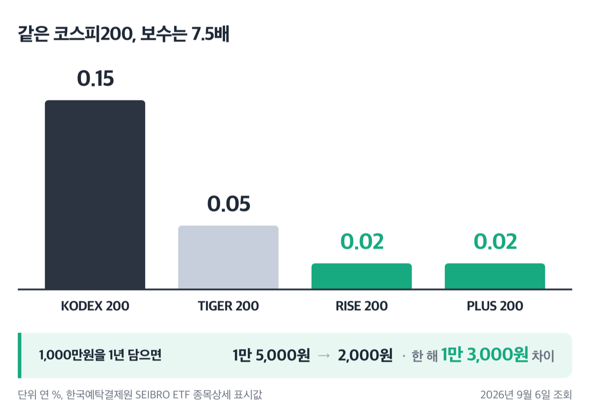
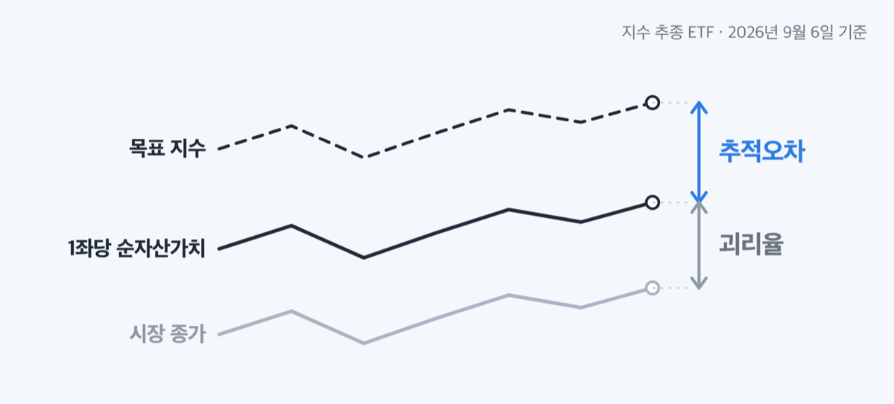
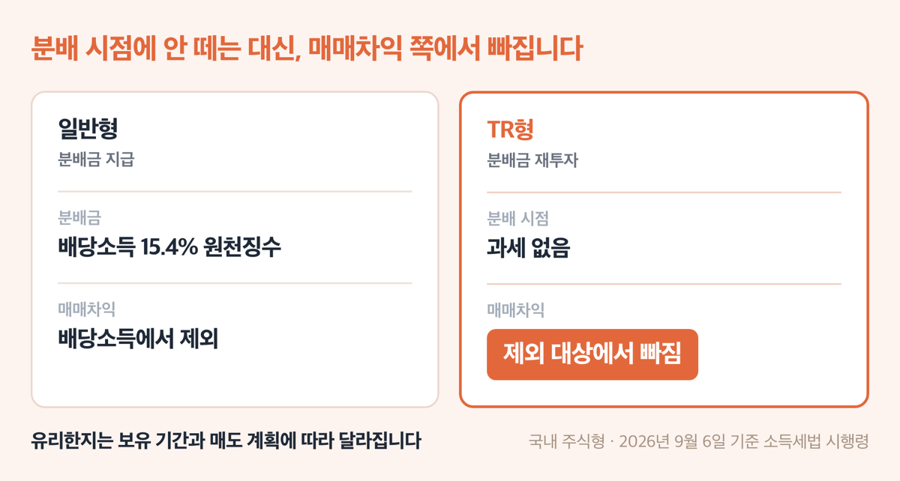
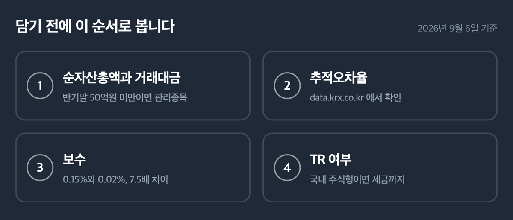

# 지수 추종 ETF 고르는 법 4가지, '보수만 7.5배' 2026년 기준

📌 2026년 9월 6일 기준

0.15%와 0.02%예요. 같은 코스피200 지수를 따라가는 ETF 네 종목의 보수인데, 비싼 쪽과 싼 쪽이 7.5배 차이가 납니다. 고르는 순서를 네 가지로 정리했어요.

**3줄 요약**

- 지수 추종 ETF(상장지수펀드)는 코스피200 같은 목표 지수를 그대로 따라가도록 만들어 증권시장에 올린 상품이에요.
- 2026년 8월말 기준 국내 상장 ETF는 1,163종목, 순자산가치총액은 450조 1,193억원입니다.
- 고를 때 보는 것은 보수, 추적오차, 순자산총액과 거래대금, 분배금 처리 네 가지예요.

이 네 가지를 순서대로 보고, 마지막에 표시 숫자가 사실과 어긋나는 두 대목을 짚습니다.

## 지수 추종 ETF, 무엇을 얼마나 따라가나

지수 추종 ETF의 뼈대는 목표 지수, 그 지수를 담는 비율, 매일 공고되는 순자산가치 셋입니다.

한국거래소 유가증권시장 상장규정은 증권 지수를 따라가는 ETF에 두 가지 문턱을 둡니다. **시가총액 기준으로 지수 구성종목의 95% 이상**, **종목 수 기준으로 50% 이상**을 담아야 해요. 목표가 되는 지수 자체에도 조건이 있어서, 주식으로만 이뤄진 지수는 10종목 이상이어야 하고 한 종목 비중이 30%를 넘으면 안 됩니다.

왜 100%가 아니라 95%일까요? 이 대목이 바로 규정의 핵심이에요. 구성종목을 하나도 빠짐없이 사들이면 거래비용이 커지고, 소형주는 사고 싶어도 물량이 없습니다. 그래서 ==일부는 빼고 담되 지수에서 벗어나지 못하게 하한선을 그은 것==이 95%와 50%예요.

쉽게 말하면 지수를 통째로 복사하는 게 아니라, 큰 종목 위주로 거의 같게 만들어 놓고 나머지는 비중으로 맞춥니다.

## 💰 첫째, 보수 — 같은 지수인데 7.5배

한국예탁결제원 SEIBRO의 2026년 9월 6일 자 종목상세 화면 기준이에요.

**코스피200 추종 ETF 보수 (%, 연 기준·한국예탁결제원 표시값)**

| 종목 | 보수(%) |
|---|---|
| KODEX 200 | 0.15 |
| TIGER 200 | 0.05 |
| RISE 200 | 0.02 |
| PLUS 200 | 0.02 |

네 종목 모두 같은 코스피200을 따라갑니다. 그런데 0.15%와 0.02%는 7.5배 차이예요. 1,000만원을 1년 담으면 **1만 5,000원과 2,000원**, 한 해에 1만 3,000원이 달라집니다.

금액만 보면 작아 보여요. 그런데 이 돈은 청구서로 오지 않습니다. 자본시장법 시행령은 판매보수를 **매일의 집합투자재산 규모에 비례해 펀드에서** 떼도록 정하고 있어요. 따로 결제하는 절차가 없으니 낸 줄도 모르고 지나갑니다.

법이 정한 상한도 있습니다. 판매수수료는 납입금액 또는 환매금액의 **100분의 2**, 판매보수는 집합투자재산 연평균가액의 **100분의 1**이 상한이에요.

> 😕 그럼 제일 싼 걸 고르면 끝 아닌가요?

다만 **법에는 「총보수」라는 낱말이 없어요.** 법령이 나누는 것은 운용보수, 판매수수료·판매보수, 그리고 **그 밖의 비용** 셋입니다. 시행령은 투자설명서에 이 셋을 모두 적으라고 요구하고 있어요. 즉 보수율 표의 숫자만으로 실제 부담이 끝나지 않습니다.

한국거래소도 ETF 월간 자료마다 같은 문구를 붙입니다. "투자설명서를 반드시 읽고 투자대상, 보수(제비용), 투자위험 등에 대하여 숙지하시기 바랍니다."

**표시 숫자의 함정 — 0.00%는 0이 아닙니다**

미국S&P500을 따라가는 ETF 쪽에서는 보수가 **0.00**으로 보이는 종목이 셋 나옵니다. ACE 미국S&P500, SOL 미국S&P500, RISE 미국S&P500이에요.

이건 보수가 없다는 뜻이 아닙니다. 화면이 **소수점 아래 두 칸까지만** 보여주니 0.005% 미만이면 0.00으로 찍혀요. 같은 표에서 TIGER·KODEX 미국S&P500은 0.01, PLUS 미국S&P500은 0.07, KIWOOM 미국S&P500은 0.02로 나옵니다.

> [!WARNING]
> 화면에 0.00%로 보여도 보수가 0원인 상품은 아닙니다. 소수점 셋째 칸부터 잘린 값이에요. 정확한 값은 그 ETF의 투자설명서에서 확인하세요.

저는 이 대목에서 보수 순위를 소수점 두 칸까지로 매기는 게 무의미해진다고 봅니다. 0.00과 0.01의 차이는 1,000만원 기준 연 500원 안쪽이에요. ==그 정도 차이보다 그 밖의 비용과 추적오차가 훨씬 큽니다.==

## 둘째, 추적오차 — 얼마나 벌어지는지 재는 숫자

보수를 봤으면 다음은 "지수를 제대로 따라가는가"입니다.

추적오차율은 자본시장법 시행령이 정의한 법정 지표예요. ETF 1좌(1주)당 순자산가치 변동률과 목표 지수 변동률을 견주는 비율이고, 산출 기준은 금융투자업규정에 있습니다. **최근 1년간 1좌당 순자산가치의 일간변동률과 목표 지수 일간변동률의 차이, 그 차이의 변동성(표준편차)**이에요.

쉽게 말하면 하루하루 지수와 얼마나 어긋났는지를 1년치 모아 흔들림의 크기로 잰 숫자입니다.

숫자를 볼 기준선이 하나 있어요. 금융투자업규정은 다른 펀드가 담을 수 있는 ETF의 조건으로 **설정 후 6개월 이상 경과**와 **최근 6개월 추적오차율 연 100분의 5 이내**를 요구합니다. 기관이 담아도 되는 문턱이 연 5%라는 뜻이에요.

**상관계수 0.9 — 3개월 계속되면 상장폐지**

추적오차율과 상관계수는 다른 숫자입니다. 추적오차율은 "얼마나 벌어지나"의 표준편차이고, 상관계수는 "같은 방향으로 움직이나"를 봅니다.

상장한 지 1년이 지난 ETF에서는 1좌당 순자산가치와 목표 지수, 두 일간변동률의 상관계수를 봅니다. 이 값이 **0.9 미만인 채로 3개월이 지나면 상장폐지**예요. 액티브 ETF는 이 기준이 0.7이에요.

종목별 추적오차율은 거래소가 매일 1회 이상 공고하게 돼 있습니다. **한국거래소 정보데이터시스템(data.krx.co.kr)에서 종목을 찾아 확인하세요.**

**괴리율 — 시장가격과 순자산가치의 차이**

추적오차와 자주 헷갈리는 게 괴리율입니다. 산식은 유가증권시장 업무규정에 있어요.

**괴리율(%) = (종가 − 1좌당 순자산가치) ÷ 1좌당 순자산가치 × 100**

이 숫자는 LP(유동성공급자)가 관리합니다. 괴리율 절대값이 **국내 기초자산 2%, 해외 기초자산 5%**를 넘지 않도록 호가를 내야 해요. 호가스프레드비율도 국내 기초자산만 담으면 2% 이내, 해외 기초자산을 포함하면 3% 이내를 넘길 때 **5분 이내**에 유동성공급호가를 제출해야 합니다.

2026년 9월 6일 조회 기준으로 코스피200 계열은 −0.01%에서 −0.12% 사이, 미국나스닥100 계열은 0.40%에서 0.45% 사이였어요. 해외 지수를 따라가는 쪽이 더 벌어지는데, 시차 때문입니다. 국내 장이 열려 있을 때 미국 주식은 멈춰 있으니 순자산가치가 실시간으로 움직이지 않아요.

## 셋째, 순자산총액과 거래대금 — 규모가 왜 문제인가

작은 ETF를 피하라는 말은 감이 아니라 규정에 근거가 있어요.

**상장규정이 정한 규모 문턱 (유가증권시장 ETF)**

| 단계 | 기준 |
|---|---|
| 신규상장 | 신탁원본액 70억원 이상, 수익증권 10만좌 이상 |
| 관리종목 지정 | 상장 1년 경과 후 반기말에 신탁원본액·순자산총액 모두 50억원 미만 |
| 상장폐지 | 위 관리종목 상태가 다음 반기말에도 계속될 때 |

판정 시점이 반기말이라 한 번 걸려도 다음 반기말까지 시간이 있어요. 반대로 말하면 규모가 작은 종목은 반년 단위로 상장폐지 가능성을 다시 판정받습니다.

규모 말고도 상장폐지 사유가 더 있어요. LP와의 계약이 없거나, 모든 LP가 교체기준에 해당한 날부터 **1개월 이내**에 다른 LP와 계약하지 못하면 상장폐지입니다. 목표 지수를 산출하거나 이용할 수 없게 돼도 마찬가지예요.

시장 전체 숫자는 2026년 8월말 기준으로 이렇습니다.

**2026년 8월말 기준 ETF 시장 (한국거래소 집계)**

| 항목 | 2026년 8월말 기준 값 (한국거래소 집계) |
|---|---|
| 순자산가치총액 | 450조 1,193억원 |
| 상장 종목 수 | 1,163개 (국내 642, 해외 521) |
| 일평균거래대금 | 17조 6,241억원 |

순자산 상위는 KODEX 200이 25조 333억원, TIGER 미국S&P500이 20조 3,906억원, TIGER 미국나스닥100이 11조 4,572억원이었어요. 일평균거래대금 1위도 KODEX 200으로 2조 827억원입니다.

다만 거래대금 숫자는 한 달치만 떼어 보면 흐름을 잘못 읽습니다. 8월 일평균거래대금 17조 6,241억원은 **7월 33조 2,909억원에 견주면 47.1% 줄어든 값**이에요. 그런데 2025년말 297조 1,401억원이던 순자산은 8개월 만에 450조원을 넘었습니다.

저라면 순자산 100억원 미만이면서 하루 거래가 거의 없는 지수 추종 ETF는 담지 않습니다. 규정상 상장폐지 문턱이 50억원인데, 그 두 배 안쪽이면 반기말마다 신경을 써야 하거든요.

## 넷째, 분배금과 TR형 — 세금까지 이어집니다

여기가 이 글에서 가장 오해가 많은 대목이에요.

ETF가 담은 주식에서 배당이 나오면 두 갈래로 처리됩니다. 하나는 투자자에게 분배금으로 주는 것, 다른 하나는 지수를 더 잘 따라가려고 그 배당을 다시 사들이는 것이에요. 뒤쪽이 **TR형(분배금을 재투자하는 형태)**입니다.

자본시장법은 운용에서 생긴 이익금을 금전이나 새로 발행하는 집합투자증권으로 분배하도록 정하되, 대통령령이 정하는 집합투자기구는 규약에 따라 **분배를 유보할 수 있게** 열어 놨어요. 소득세법 시행령도 국내 주식 지수를 그대로 추종하는 ETF가 지수를 따라가려고 배당이익을 구성종목 비중대로 재투자하는 경우, 거기서 생긴 이자수입과 배당이익은 유보할 수 있다고 적고 있습니다.

분배금을 안 받으니 그때 떼는 세금도 없어요. 배당소득 원천징수는 소득세 14%에 지방소득세가 그 10%로 붙어 **합계 15.4%**입니다. 여기까지만 보면 TR형이 유리해 보여요.

**국내 주식형 TR형은 매매차익 비과세에서 빠집니다**

물론 세금을 미루는 효과는 실제로 있어요. 그런데 국내 주식형에서는 다른 문이 하나 닫힙니다.

소득세법 시행령은 집합투자증권을 거래해서 생긴 이익을 배당소득에 넣되, **국내 주식 가격만으로 만든 지수를 그대로 따라가는 ETF는 뺍니다**. 국내 주식형 ETF의 매매차익이 사실상 과세되지 않는 근거가 이 조항이에요.

문제는 그다음입니다. **위에서 본 배당이익 분배 유보 조항을 쓴 ETF, 그러니까 국내 주식형 TR형은 이 제외 대상에서 다시 빠져요.**

> [!WARNING]
> 분배금을 안 받는 대신 매매차익 쪽에서 과세 대상이 됩니다. 국내 주식형 ETF에서 TR형이 유리한지는 보유 기간과 매도 계획에 따라 달라집니다.

TR형과 일반형이 같은 지수를 따라가도 세금 경로가 다른 것을 표로 정리하면 이렇습니다.

**국내 주식형 지수 추종 ETF의 과세 경로 (2026년 9월 6일 기준 법령)**

| 구분 (국내 주식형) | 과세 방식 (2026년 9월 6일 기준 소득세법 시행령) |
|---|---|
| 일반형 (분배금 지급) | 분배금에 배당소득 15.4% 원천징수, 매매차익은 배당소득에서 제외 |
| TR형 (분배금 재투자) | 분배 시점 과세 없음, 대신 매매차익 제외 대상에서 빠짐 |

한 가지 더요. 소득세법 시행령은 집합투자기구로부터의 이익을 **각종 보수·수수료를 뺀 금액**으로 계산하도록 정하고 있습니다. 앞에서 본 보수는 세금을 매기기 전에 이미 빠져 있다는 뜻이에요.

국내 주식형이 아닌 ETF, 그러니까 해외 지수를 따라가는 상품의 과세는 국세청이나 세무 전문가에게 확인하세요. 상품 구조에 따라 적용 조항이 달라집니다.

## 지수 추종 ETF 고르는 법 관련 궁금증 해결

**Q1. 보수가 가장 싼 종목을 고르면 되나요?**

보수는 네 가지 중 하나예요. 화면에 보이는 보수 밖에 **그 밖의 비용**이 따로 있고, 이건 투자설명서에 적히도록 시행령이 정하고 있습니다. 보수 차이가 0.01%p 안쪽이면 순자산총액과 거래대금을 먼저 보는 편이 낫다고 봅니다.

**Q2. 추적오차율은 어디서 보나요?**

거래소가 순자산가치와 추적오차율을 매일 1회 이상 공고하도록 시행령이 정하고 있어요. 한국거래소 정보데이터시스템(data.krx.co.kr)에서 종목별로 확인하세요.

**Q3. 괴리율이 0.4%면 문제가 있는 건가요?**

해외 기초자산은 LP가 5%까지 관리하게 돼 있어요. 국내 기초자산은 2%입니다. 미국 지수를 따라가는 ETF가 0.4%대인 것은 이 한도 안쪽이에요.

**Q4. 순자산이 얼마 아래면 피해야 하나요?**

규정상 관리종목 문턱은 반기말 기준 50억원 미만입니다. 상장폐지가 되면 남은 순자산은 정산돼 돌아오지만, 원하지 않는 시점에 정리되는 것 자체가 부담이에요.

**Q5. TR형과 일반형 중 무엇이 유리한가요?**

국내 주식형이라면 단정할 수 없습니다. 분배 시점 과세는 없지만 매매차익 쪽에서 제외 대상에서 빠지기 때문이에요. 보유 기간과 매도 계획에 따라 결과가 바뀌니 세무 전문가와 상담하세요.

## 그래서 내 돈은

1,000만원을 코스피200 추종 ETF에 1년 담을 때, 보수만으로 1만 5,000원과 2,000원이 나뉩니다. 커피 두 잔 값이에요.

그런데 이 글에서 확인한 네 가지 중 돈에 가장 크게 걸리는 것은 보수가 아니라 마지막 항목이었습니다. 국내 주식형 TR형은 분배 시점에 15.4%를 안 떼는 대신 매매차익 제외 대상에서 빠져요. 금액 규모가 커질수록 이쪽이 보수 차이를 넘어섭니다.

그래서 순서를 이렇게 잡았어요. **① 순자산총액과 거래대금으로 걸러내고 ② 추적오차율을 거래소 화면에서 확인하고 ③ 보수를 견주고 ④ 국내 주식형이면 TR 여부를 세금까지 따져 봅니다.** 보수를 3번에 둔 이유는, 같은 지수를 따라가는 종목끼리 보수 차이가 0.1%p 안팎인데 규모와 세금은 그보다 큰 폭으로 움직여서예요.

확인하는 창구는 이렇게 나뉩니다. 보수와 괴리율은 한국예탁결제원 SEIBRO(m.seibro.or.kr) ETF 종목상세에서, 추적오차율과 순자산총액은 한국거래소 정보데이터시스템(data.krx.co.kr)에서, 그 밖의 비용은 그 상품의 투자설명서에서 봅니다. 지금 담고 있는 ETF의 순자산총액과 종목 유형부터 확인해 보세요.

참고: 자본시장과 금융투자업에 관한 법률 및 같은 법 시행령 · 금융투자업규정 · 한국거래소 유가증권시장 상장규정 · 한국거래소 유가증권시장 업무규정 · 한국거래소 「KRX ETF·ETN Monthly」 2026년 9월호 · 한국예탁결제원 SEIBRO ETF 종목상세 · 소득세법 및 같은 법 시행령 · 지방세법 · 금융위원회 2026년 4월 21일 보도자료
