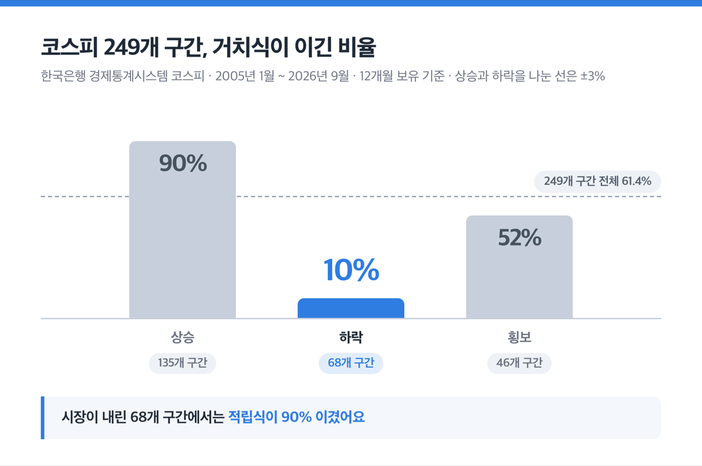
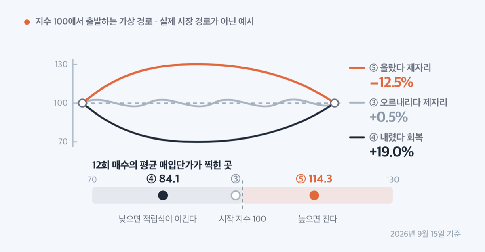
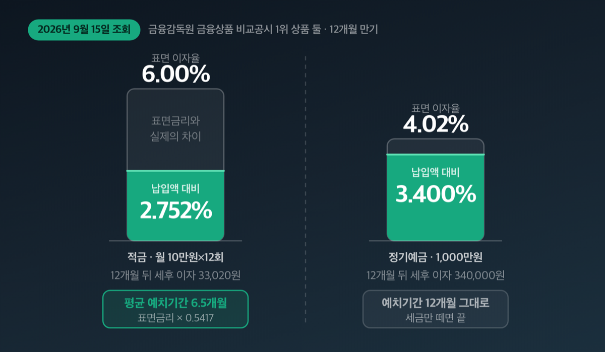
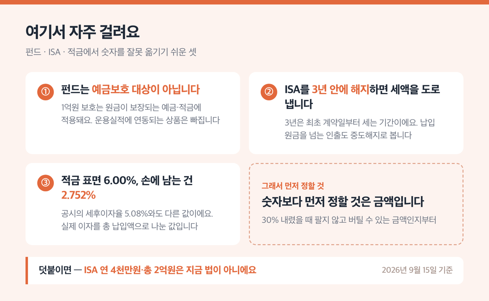

# '적립식 거치식 차이 830만원' 2026년 코스피로 따져봤어요

📌 2026년 9월 15일 기준

830만원이에요. 같은 1,200만원을 최근 12개월 코스피에 넣었는데 한 번에 넣은 쪽은 2,342만원이 됐고, 매달 100만원씩 나눠 넣은 쪽은 1,512만원이 됐어요. 수수료와 세금을 빼고 계산한 값입니다.

**3줄 요약**

- 거치식은 목돈을 한 번에 넣는 방식, 적립식은 기간에 걸쳐 나눠 넣는 방식이에요. 금융투자협회 표준약관이 둘을 이렇게 나눕니다.
- 2005년 1월부터 2026년 9월까지 코스피 12개월 구간 249개를 겹쳐 세어 보니 거치식이 153번, 61.4% 이겼어요. 그런데 시장이 내린 68개 구간만 보면 적립식이 90% 이겼습니다.
- 먼저 확인할 것은 하나예요. 지금 손에 목돈이 있는지, 아니면 매달 월급에서 떼어 넣는지. 둘은 다른 이야기입니다.

> [!WARNING]
> 아래 계산은 전부 **수수료·세금을 반영하지 않았고, 아직 넣지 않은 현금에는 이자를 0%로 놓았습니다.** 코스피 값은 한국은행 경제통계시스템에 수록된 2026년 9월 14일 종가까지를 썼어요. 실제 계좌 숫자는 판매보수와 세금만큼 낮아집니다.

약관이 정한 구분부터 보고, 249개 구간 실제 승률과 적립식이 이기는 조건 하나, 그리고 적금 이자가 예금의 절반인 이유까지 차례로 적습니다.

---

## 거치식과 적립식, 약관이 정한 구분은 이래요

거치식과 적립식을 가르는 기준은 납입 횟수, 저축기간 약정, 그리고 저축기간 중 인출 조건 셋입니다. 2025년 5월 13일 시행된 금융투자협회 수익증권저축약관이 이 셋으로 나눠 놓았어요.

큰 구분은 먼저 두 가지예요. 인출 요건이나 기간·금액을 정하지 않고 넣는 '임의식', 그중 하나 이상을 정해 넣는 '목적식'이에요. 거치식과 적립식은 둘 다 목적식 아래에 들어갑니다.

| 방식 (수익증권저축약관 기준) | 어떻게 넣나 | 저축기간 중 인출 |
|---|---|---|
| 거치식 — 수익금 인출식 | 일정금액을 한 번에 넣고 일정기간 이상 둔다 | 수익금 범위 안에서 인출 |
| 거치식 — 일정금액 인출식 | 일정금액을 한 번에 넣고 일정기간 이상 둔다 | 미리 정한 금액을 매월 인출 |
| 적립식 — 정액적립식 | 기간을 3년·5년처럼 정하고 매월 일정금액을 넣는다 | 약관에 인출 방식 없음 |
| 적립식 — 자유적립식 | 기간만 정하고 금액 제한 없이 수시로 넣는다 | 약관에 인출 방식 없음 |

금융감독원이 대중에게 설명하는 말은 더 짧아요. "거치식은 목돈을 일시에 가입, 적립식은 특정기간 분할 납입"입니다.

왜 굳이 약관에까지 이렇게 적어 두었을까요. 환매수수료 때문이에요. 저축기간이 1년 이상인 목적식 저축은 기간이 끝난 뒤 환매하면 환매수수료가 면제됩니다. 거치식은 기간 중이라도 수익금에 해당하는 금액을 환매할 때 수수료를 면제해 줘요.

다만 여기 걸리는 것이 하나 있습니다. ==환매수수료를 받는 기간 중에 원금의 전부나 일부를 환매하면, 앞서 면제해 준 환매수수료를 도로 받아 갑니다.== 수익금만 빼 쓰다가 원금에 손을 대는 순간 계산이 달라져요.

'목돈이면 거치식, 월급이면 적립식'은 관행적인 설명이에요. 약관이 보는 기준은 납입 횟수와 인출 조건입니다.

그럼 어느 쪽이 실제로 돈을 더 벌었는지 봐야겠죠.

---

## 249개 구간을 겹쳐 세어 보니 거치식이 61.4%

세 자료를 따로 세어 봤는데 방향이 같았어요. 한국은행 경제통계시스템에 수록된 코스피, 미국 세인트루이스 연방준비은행이 제공하는 S&P 500(미국 대표 500개 종목 주가지수), 그리고 밴가드가 MSCI 세계지수(전 세계 선진국 주식을 담은 지수)로 낸 연구입니다.

| 자료와 기간 (12개월 보유 기준) | 12개월 구간 수 | 거치식이 이긴 비율 |
|---|---|---|
| 코스피 2005년 1월 ~ 2026년 9월 | 249개 | **61.4%** |
| S&P 500 2016년 9월 ~ 2026년 9월 | 109개 | **82.6%** |
| MSCI 세계지수 1976년 ~ 2022년 | 롤링 전 구간 | **68%** |

세 줄의 숫자가 다른 이유는 기간 때문이에요. 코스피 표본에는 2008년과 2022년 하락장이 들어 있고, S&P 500 표본은 2016년부터라 상승장 비중이 큽니다. MSCI 세계지수 수치는 목돈을 3개월에 나눠 넣고 1년 뒤 평가한 기준이에요.

밴가드 연구는 자산운용사가 낸 자료입니다. 다만 거치식이든 적립식이든 같은 펀드를 파는 회사라 결론이 상품 판매 쪽으로 기울 이유가 크지 않고, 데이터 기간(1976~2022년)과 발행 시점(2023년 2월)이 자료에 적혀 있어 그대로 인용했어요.

### 시장이 내린 68개 구간에서는 거치식이 10%였어요

61.4%만 보고 끝내면 절반을 놓칩니다. 코스피 249개 구간을 12개월 동안 시장이 어느 쪽으로 움직였는지로 나눠 보면 이렇게 달라져요.

| 12개월 코스피 방향 (전체 249개 구간) | 구간 수 | 거치식이 이긴 비율 |
|---|---|---|
| 상승 (+3% 초과) | 135개 | **90%** |
| 하락 (−3% 미만) | 68개 | **10%** |
| 횡보 (±3% 이내) | 46개 | **52%** |

하락 구간 68개에서 거치식이 이긴 비율이 10%라는 말은, ==같은 구간에서 적립식이 90% 이겼다는 뜻입니다.== S&P 500도 같은 모양이었어요. 하락한 13개 구간에서 적립식이 77% 앞섰습니다.

실제 숫자로 보면 이렇습니다. 1,200만원을 같은 날 넣었다고 놓고 계산한 값이에요.

| 12개월 구간 (1,200만원 투입, 세금·수수료 미반영) | 거치식 | 적립식 |
|---|---|---|
| 2007년 10월 → 2008년 10월 | 646만원 (−46.1%) | 780만원 (−35.0%) |
| 2008년 5월 → 2009년 5월 | 904만원 (−24.6%) | **1,286만원 (+7.1%)** |
| 2025년 5월 → 2026년 5월 | **3,770만원 (+214.2%)** | 2,582만원 (+115.2%) |

두 번째 줄을 다시 봐 주세요. 코스피는 그 12개월 동안 24.6% 내렸는데 적립식은 7.1%를 벌었습니다. 격차가 31.8%p예요. 반대로 2025년 5월 구간에서는 격차가 99.0%p로 거치식이 앞섰습니다.

물론 확률로만 보면 한 번에 넣는 쪽이 유리합니다. 그런데 그 확률은 '12개월이 지난 뒤에야' 확인되는 값이에요.

> 😕 지금 코스피가 6월 고점에서 26% 넘게 내려왔는데, 그럼 지금은 한 번에 넣을 때 아닌가요?

2026년 9월 14일 코스피는 6,684예요. 6월 22일 고점 9,114보다 26.7% 낮고, 7월 30일 저점 5,594보다는 19.5% 높습니다. 문제는 앞으로 12개월이 위 표의 상승 135개에 들어갈지 하락 68개에 들어갈지를 이 숫자가 말해 주지 않는다는 점이에요. 61.4%라는 승률은 249번을 다 해 봤을 때 나오는 값이고, 한 번만 하는 사람에게는 그 한 번이 전부입니다.

그 한 번에서 어느 쪽이 이겼는지를 정하는 것은 평균 매입단가 하나입니다.

---

## 적립식이 이기는 조건은 딱 하나예요

적립식이 거치식을 이기는 조건은 하나뿐입니다. ==12회 매수의 평균 매입단가가 처음 시점의 지수보다 낮을 때.== 그 외에는 없어요.

평균 매입단가는 열두 번 나눠 산 가격을 매수 금액으로 평균 낸 값이에요. 쉽게 말하면 '내가 실제로 산 평균 가격'입니다. 이 값이 첫날 지수보다 낮으면 적립식이 이기고, 높으면 집니다.

지수가 100에서 출발하는 가상의 경로 다섯을 계산해 봤어요. 실제 시장 경로가 아니라 원리를 보이려고 만든 예시입니다.

| 12개월 지수 경로 (1,200만원 투입) | 거치식 | 적립식 |
|---|---|---|
| ① 100 → 130 쭉 오름 | **+30.0%** | +15.0% |
| ② 100 → 70 쭉 내림 | −30.0% | **−18.0%** |
| ③ 100 → 100 오르내리다 제자리 | 0.0% | **+0.5%** |
| ④ 100 → 70 → 100 내렸다 회복 | 0.0% | **+19.0%** |
| ⑤ 100 → 130 → 100 올랐다 제자리 | **0.0%** | −12.5% |

③④⑤를 나란히 봐 주세요. 끝값이 셋 다 100으로 같은데 적립식 결과는 +0.5%, +19.0%, −12.5%로 다릅니다. ④는 평균 매입단가가 84.1까지 내려갔고 ⑤는 114.3까지 올라갔기 때문이에요.

중간 경로가 결과를 정합니다.

### 최근 12개월이 ⑤번이었어요

글 맨 앞의 830만원 차이가 왜 났는지가 여기서 풀립니다. 2025년 9월 말 코스피는 3,425였고 2026년 9월 14일은 6,684예요. 그 사이 열두 번 나눠 산 평균 매입지수는 **5,304**였습니다.

처음 지수 3,425보다 평균 매입지수가 1,879포인트 높았어요. 적립식이 질 수밖에 없는 조건이었습니다.

2026년 안쪽만 떼어 보면 격차가 줄어듭니다. 1월 말부터 9월 14일까지 900만원을 기준으로 계산하면 한 번에 넣은 쪽은 1,152만원(+27.9%), 아홉 번 나눠 넣은 쪽은 926만원(+2.9%)이에요. 이때 평균 매입지수는 6,499였습니다.

> **솔직히 말하면** — 이 계산을 돌리기 전에는 저도 '나눠 사면 평균이 낮아진다'고 막연히 생각했어요. 낮아지는 게 아니라, 낮아질 수도 있고 높아질 수도 있는 것이었습니다.

그런데 이 원리는 투자에만 있는 게 아니에요. 적금 이자에 똑같이 들어 있습니다.

---

## 적금 금리 6%인데 손에 남는 건 2.75%예요

금융감독원 금융상품 비교공시에서 2026년 9월 15일 기준 1위 상품 둘을 그대로 가져왔습니다. 적금은 월 10만원씩 12개월, 예금은 1,000만원 12개월이 공시의 기본 검색 조건이에요.

| 항목 (2026년 9월 15일 조회, 12개월 만기) | 적금 월 10만원×12회 | 정기예금 1,000만원 |
|---|---|---|
| 상품 | 청주저축은행 단비 정기적금 | 참저축은행 비대면 회전정기예금(단리) |
| 세전 이자율 (최고우대 포함) | **6.00%** | **4.02%** |
| 공시된 세후 이자율 | 5.08% | 3.40% |
| 12개월 뒤 세후 이자 | 33,020원 | 340,000원 |
| 총 납입액·예치액 | 120만원 | 1,000만원 |
| 납입액 대비 세후 수익률 | **2.752%** | **3.400%** |

표면금리는 적금이 1.98%p 높습니다. 그런데 넣은 돈 대비 손에 남는 비율은 적금이 0.648%p 낮아요. 공시에 '세후이자율'이라고 적힌 5.08%는 6.00%에서 이자소득 원천징수세 15.4%(소득세 14% + 지방소득세 1.4%)를 뺀 값일 뿐이고, 실제로 받는 33,020원을 120만원으로 나누면 2.752%가 나옵니다.

이유는 예치 기간이에요. 첫 달에 넣은 10만원은 12개월 내내 이자가 붙지만 마지막 달에 넣은 10만원은 한 달치만 붙습니다. 12개월 적금의 평균 예치기간은 **6.5개월**이에요.

==적금 표면금리에 0.5417을 곱하면 실제 수익률에 가까워집니다.== 금리가 3%든 6%든 이 배수는 같아요. 24개월 만기는 평균 12.5개월, 36개월 만기는 18.5개월입니다.

그리고 이것이 적립식 투자가 거치식에 뒤지는 원리와 같아요. 돈이 시장이나 이자에 머무는 평균 기간이 절반이기 때문입니다. 코스트 애버리징, 그러니까 나눠 사는 것은 이 절반의 노출을 평균 매입단가가 낮아질 가능성과 맞바꾸는 거래예요.

그럼 실제로 어떻게 넣어야 할지 정리해 볼게요.

---

## 그래서 내 돈은 어떻게 넣나 — 순서 다섯

아래는 목돈이 있든 월급에서 떼든 공통으로 밟는 순서예요. 계좌를 먼저 정하는 것이 세 번째가 아니라 네 번째인 이유는, 넣는 방식이 정해져야 한도 계산이 되기 때문입니다.

1. **지금 그 돈이 목돈인지 월급인지 먼저 가릅니다.** 위의 승률은 전부 '이미 손에 있는 목돈'을 나눠 넣을 때 이야기예요 *(월급에서 떼는 돈은 애초에 그때 생긴 돈이라 비교 대상 자체가 없어요)*.
2. **목돈이면 나눠 넣더라도 기간을 짧게 잡습니다.** 밴가드는 나눠 넣는 기간이 길수록 기회비용이 커진다고 적고, 적립식을 택하더라도 3개월처럼 짧게 유지하라고 권고해요 *(10만달러 1년 기준 1만 회 시뮬레이션에서 3개월 분할은 거치식보다 504달러, 6개월 분할은 1,491달러 적었습니다)*.
3. **월급이면 돈이 생긴 즉시 넣습니다.** 연금계좌에 연초에 몰아 넣는 방식이 중앙값 기준 잔고를 높였어요 *(미루지 않는 것만으로 효과가 있다는 뜻이에요)*.
4. **계좌를 정합니다.** 같은 상품이라도 어느 계좌에 담느냐로 세금이 달라져요. 아래 표를 보세요.
5. **원금이 보장돼야 하는 돈은 예금보호 한도를 확인합니다.** 2025년 9월 1일부터 예금·적금은 원금과 이자를 합해 1억원까지 보호됩니다 *(가입 시점과 관계없이 적용되고 따로 신청할 것은 없어요)*.

| 계좌 | 납입 한도 | 요건 |
|---|---|---|
| ISA(개인종합자산관리계좌) | 연 2천만원×(1+가입 후 경과연수, 최대 4년) − 누적 납입액, 총 1억원 | 계약기간 3년 이상, 1명당 1개 |
| 연금저축 | 세액공제 대상 연 600만원 | 퇴직연금 합산 시 연 900만원 |
| 연금계좌 전체 납입 | 연 1,800만원 | 계좌가 2개 이상이면 합계 기준 |

세액공제율은 12%이고, 종합소득금액 4,500만원 이하(근로소득만 있으면 총급여 5,500만원 이하)는 15%입니다. 지방소득세는 별도예요. ISA는 이자·배당 200만원까지 비과세이고, 직전 과세기간 총급여 5천만원 이하나 종합소득금액 3천8백만원 이하면 400만원까지 비과세입니다. 한도를 넘는 금액은 9% 분리과세라 종합소득에 합산되지 않아요.

ISA 한도에서 오해가 많은 대목이 하나 있습니다. 산식이 `2천만원 × (1+경과연수) − 누적 납입액`이라 **한도가 이월돼요.** 3년째까지 한 번도 넣지 않았다면 그해에 6천만원을 한 번에 넣을 수 있습니다. 'ISA는 연 2천만원뿐이라 목돈이 있어도 나눠 넣을 수밖에 없다'는 말은 사실이 아니에요.

상품별 금리와 조건은 금융감독원 금융상품 통합비교공시 '금융상품 한눈에'(finlife.fss.or.kr)에서 직접 비교할 수 있어요. 오늘 통장 금리부터 한 번 확인해 보세요.

저라면 목돈이 생겼을 때 나눠 넣더라도 3개월 안에 끝냅니다. 근거는 위 세 자료가 같은 방향을 가리켰다는 것과, 나눠 넣는 기간이 길수록 기회비용이 커진다는 밴가드 계산이에요.

---

## ⚠️ 여기서 자주 걸려요

이 글을 쓰면서 자료끼리 어긋났던 것과, 숫자를 잘못 옮기기 쉬운 것을 모았습니다.

**첫째, 적금 표면금리와 실제 수익률을 섞지 않습니다.** 공시의 '세후이자율'은 표면금리에서 세금만 뺀 값이에요. 실제로 받는 이자를 총 납입액으로 나눈 값과 2%p 가까이 다릅니다.

**둘째, ==펀드는 예금보호 대상이 아닙니다.==** 1억원 보호는 예금·적금처럼 원금이 보장되는 상품에 적용돼요. 지급액이 운용실적에 연동되는 상품은 보호되지 않습니다. ISA와 퇴직연금도 예금 등 보호상품으로 운용되는 부분만 보호돼요. 여기서 퇴직연금은 DC형(확정기여형)과 IRP(개인형퇴직연금) 둘입니다.

**셋째, ISA를 3년 안에 해지하면 감면받은 세액을 도로 냅니다.** 납입 원금 합계액을 넘는 금액을 인출해도 중도해지로 봅니다. 3년은 최초 계약일부터 세는 기간이에요.

**넷째, ISA 연 4천만원·총 2억원은 지금 법이 아닙니다.** 2026년 7월 1일 시행 조세특례제한법 조문은 연 2천만원 산식, 총 1억원, 비과세 200만원이에요. 언론 기사와 기관 안내가 서로 달라 법령 원문을 확인했습니다.

**다섯째, 밴가드의 68%를 월급 적립에 갖다 붙이면 잘못된 인용이에요.** 그 연구는 '지금 당장 쓸 수 있는 목돈을 어떻게 할 것인가'만 다루고, 급여에서 일정액을 넣는 것과 다르다고 자료에 직접 적어 두었습니다.

**여섯째, 손실회피 성향은 숫자보다 먼저입니다.** 밴가드가 손실회피를 반영해 계산했더니 '보통 보수적'과 '매우 보수적' 성향은 적립식을 선호하는 결과가 나왔어요. 같은 사람이 손실회피를 뺐을 때는 거치식을 선호했습니다. 중간에 못 버티고 파는 쪽이 승률보다 비싼 대가예요.

---

## 적립식 거치식 차이 관련 궁금증 해결

**Q1. 거치식이 61.4% 이긴다면 그냥 한 번에 넣으면 되나요?**

A. 아니에요. 코스피가 내린 68개 구간에서는 적립식이 90% 이겼고, S&P 500 하락 13개 구간에서도 적립식이 77% 앞섰습니다. 밴가드도 손실회피 성향이 큰 투자자에게는 적립식을 권해요.

**Q2. 월급에서 매달 떼어 넣는데, 그럼 저는 손해 보는 방식인가요?**

A. 아니에요. 그 승률은 이미 손에 있는 목돈을 나눠 넣을 때 나오는 숫자입니다. 월급은 그달에 생긴 돈이라 '한 번에 넣었을 경우'라는 비교 대상이 존재하지 않아요.

**Q3. 소액으로 비싼 주식을 나눠 사려면 어떻게 하나요?**

A. 국내주식 소수단위 거래가 2022년부터 혁신금융서비스로 운영돼 왔고, 금융위원회가 2025년 5월 8일 제도화를 추진한다고 밝혔어요. 8개 증권사가 내놨고 2025년 1분기말 기준 누적 이용자는 약 17.1만명, 누적 매수 체결금액은 약 1,228억원입니다. 신탁잔고 상위는 삼성바이오로직스·엘지에너지솔루션·삼성전자 순이에요. 취급 종목과 수수료는 거래하려는 증권사에서 확인하세요.

**Q4. 적금보다 예금이 항상 나은가요?**

A. 비교 대상이 다릅니다. 이미 목돈이 손에 있으면 예금 쪽 수익률이 높게 나와요. 매달 떼어 모으는 돈이라면 예금에 넣을 원금 자체가 없으니 적금이 맞는 상대입니다. 금융감독원은 자유적립식 적금 금리가 정기예금보다 높은 경우를 활용하라고 안내해요.

**Q5. 지금처럼 고점에서 내려온 시장은 어떻게 보나요?**

A. 2026년 9월 14일 코스피 6,684는 6월 22일 고점 9,114보다 26.7% 낮고, 7월 30일 저점 5,594보다 19.5% 높습니다. 여기서 다음 12개월이 어느 쪽인지는 위 249개 구간 어디에도 답이 없어요. 셋 중에 고르라면 저는 방향을 맞히려 하는 대신 넣는 기간을 짧게 잡는 쪽을 고릅니다.

---

그래서 내 돈은 어떻게 되나. 1,200만원이 손에 있다면 코스피 249개 구간 중 153개에서는 한 번에 넣은 쪽이 앞섰고, 68개 하락 구간에서는 나눠 넣은 쪽이 90% 앞섰어요. 어느 쪽이 될지는 12개월이 지나야 드러납니다.

바꿀 수 있는 것은 방향이 아니라 기간이에요. 나눠 넣는 기간을 3개월로 줄이면 기회비용이 줄고, 12개월로 늘리면 적금에서 본 6.5/12처럼 노출이 절반으로 줄어듭니다. 그리고 매달 월급에서 떼는 돈이라면 이 계산 자체가 해당되지 않아요. 그 돈은 생긴 즉시 넣는 것이 최선입니다.

숫자보다 먼저 정할 것은 금액입니다. 30% 내렸을 때 팔지 않고 버틸 수 있는 금액인지부터 따져 보세요.

참고: 금융투자협회 「수익증권저축약관」 · 금융감독원 파인 「펀드 상품 어떤게 있나요」 · 금융감독원 「금융상품 한눈에」 정기예금·적금 비교공시 · 금융감독원 파인 「금융꿀팁」 · 금융위원회·예금보험공사 「'25.9.1일부터 예금을 1억원까지 보호합니다」 · 금융위원회 「자본시장 분야 주요 혁신금융서비스의 제도화를 추진합니다」 · 한국은행 경제통계시스템 코스피지수 · FRED S&P 500(원 제공처 S&P Dow Jones Indices) · Vanguard 「Cost averaging: Invest now or temporarily hold your cash?」 · 국가법령정보센터 소득세법 제59조의3 · 소득세법 시행령 제40조의2 · 조세특례제한법 제91조의18
