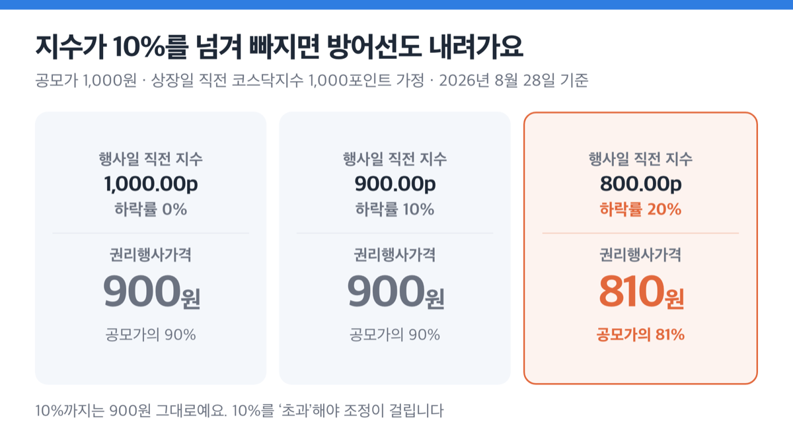
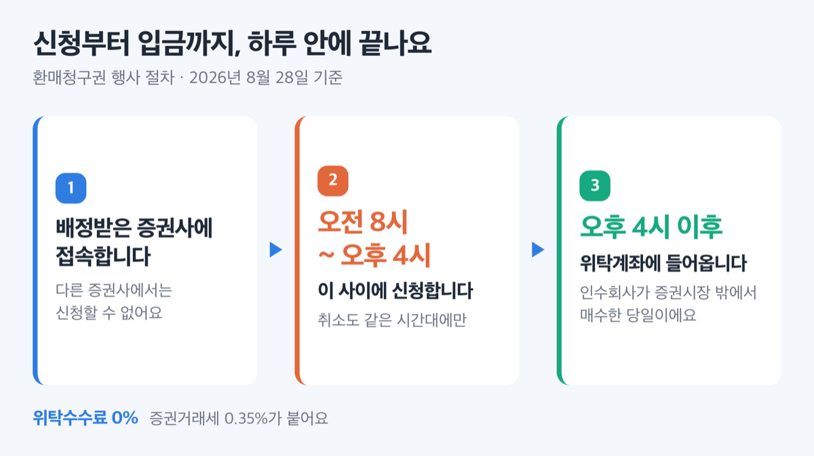
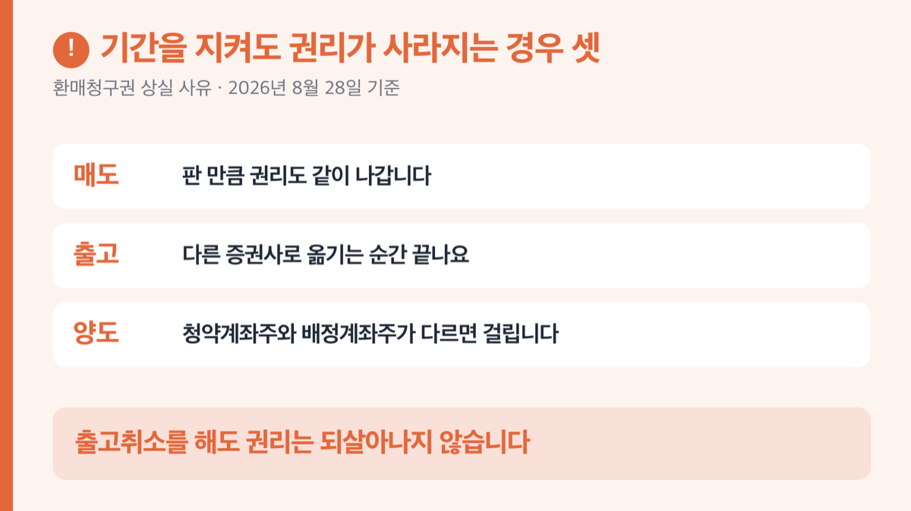

# 공모주 환매청구권 1·3·6개월, 90% 방어선도 밀려요

📌 2026년 8월 28일 기준

공모주 환매청구권은 3개월짜리 하나가 아니에요. 부여 사유에 따라 1개월·3개월·6개월로 갈립니다. 되사 주는 값도 공모가의 90%로 고정된 게 아니라 더 내려갈 수 있어요.

**3줄 요약**

- 공모주 환매청구권은 배정받은 공모주를 인수회사에 되팔 수 있는 권리예요.
- 행사 기간은 부여 사유에 따라 상장일부터 1개월·3개월·6개월로 갈리고, 근거는 금융투자협회 「증권 인수업무 등에 관한 규정」 제10조의3(현행 2026년 3월 12일 개정)이에요.
- 되사 주는 값은 공모가의 90% 이상이지만, 지수가 10% 넘게 빠지면 그 값도 함께 내려갑니다.

기간이 왜 셋으로 갈리는지, 90%가 언제 무너지는지, 신청은 어디서 어떻게 하는지를 순서대로 적었어요.

## 환매청구권은 공모주를 되팔 수 있는 권리예요

공모주 환매청구권의 내용은 셋입니다. 배정받은 일반청약자가, 인수회사에, 정해진 기간 안에 공모주를 되파는 것이에요. 흔히 풋백옵션이라고 부르는 그 권리가 이겁니다.

사 주는 쪽은 증권시장이 아니라 인수회사예요. 규정에 인수회사가 **증권시장 밖에서** 매수하도록 못 박혀 있거든요. 그래서 이건 주식을 시장에 파는 것과 다른 절차이고, 신청 창구도 따로 있어요.

> 😕 그럼 공모주는 다 이 권리가 붙는 건가요?

아니에요. 붙는 자리가 정해져 있습니다. 공모가를 정하는 방식이 통상과 다르거나, 아직 이익이 안 나는 회사거나, 주관사가 최근에 사고 친 이력이 있을 때예요. 쉽게 말하면 **공모가를 그대로 믿기 어려운 자리에 붙는 장치**라고 저는 봅니다.

## 1개월·3개월·6개월, 사유가 다르면 기간도 달라요

규정 제10조의3 제1항이 부여 사유를 다섯 가지로 나눠 놨어요. 그 사유마다 행사 가능 기간이 다릅니다.

| 부여 사유 (규정 제10조의3 제1항) | 행사 가능 기간 (상장일 기준) |
|---|---|
| 공모예정금액 50억원 이상이면서 공모가를 제5조제1항제1호 방법으로 정한 경우 | 상장일부터 **1개월** |
| 창업투자회사등을 수요예측에 참여시킨 경우 | 상장일부터 **1개월** |
| 공모가격 산정근거를 증권신고서에 적지 않은 경우 | 상장일부터 **1개월** |
| 사업모델기업으로 코스닥에 상장한 경우 | 상장일부터 **6개월** |
| 이익미실현 기업으로 코스닥에 상장한 경우 | 상장일부터 **3개월** |

기준은 청약일도 납입일도 아닌 **상장일**입니다. 청약하고 상장까지 일주일 넘게 비는 일이 흔한데, 그 기간은 셈에 들어가지 않아요.

여기에 하나가 더 있어요. 2023년 12월에 들어온 제5항이에요. 혁신기술기업을 코스닥에 올리는 주관회사가 최근 3년 안에 주관한 기술성장기업이 상장 2년 안에 투자주의 환기종목·관리종목으로 지정됐거나 상장폐지 사유가 생겼다면, 그 주관사는 환매청구권을 **반드시** 붙여야 합니다. 기간은 6개월이에요.

> 🤭 **솔직히 말하면** — 저는 이 6개월짜리를 주관사 성적표로 읽어요. 의무가 아닌데 붙은 게 아니라, 최근 실적이 나빠서 붙은 것이거든요.

기술특례상장이면 반드시 붙는다는 말도 반은 틀렸어요. 코스닥 기술성장기업은 기술평가로 들어온 혁신기술기업과 상장주선인 추천으로 들어온 사업모델기업으로 갈리는데, **6개월 의무가 걸리는 건 사업모델기업 쪽**입니다. 혁신기술기업은 제1항 각 호에 없어서 원칙적으로 대상이 아니고, 위에 적은 주관사 페널티에 걸릴 때만 붙어요.

## 되사 주는 값은 90%, 그런데 더 내려갈 수 있어요

매수가격은 공모가격의 90% 이상입니다. 여기까지가 흔히 아는 내용이에요.

그런데 단서가 붙어 있어요. 행사일 직전 매매거래일의 주가지수가 상장일 직전 매매거래일보다 **10%를 초과해 하락**하면, 그 초과분만큼 매수가격도 깎입니다. 산식은 `공모가격의 90% × [1.1 + (행사일 직전 지수 − 상장일 직전 지수) ÷ 상장일 직전 지수]`이고, 원 미만은 절상해요. 어떤 지수를 쓸지는 코스피지수·코스닥지수·산업별주가지수 중에서 대표주관회사가 정합니다.

투자설명서에 실린 공식 예시로 보면 이렇습니다. 공모가 1,000원, 상장일 직전 코스닥지수 1,000포인트를 가정한 값이에요.

| 행사일 직전 지수 (하락률) | 권리행사가격 |
|---|---|
| 1,000.00p (0%) | 900원 |
| 900.00p (10%) | 900원 |
| 800.00p (20%) | **810원** |

10%까지는 900원 그대로예요. 10%를 '초과'해야 조정이 걸리거든요. 대신 20% 빠지면 방어선은 공모가의 90%가 아니라 **81%**로 내려갑니다.

==90%가 하한선이라는 말은 시장 전체가 버텨 줄 때만 맞습니다.== 개별 종목이 무너질 때는 90%가 지켜지고, 시장이 통째로 무너질 때는 그 방어선도 같이 밀려요. 저는 이 구조를 알고 청약하는 것과 모르고 청약하는 것의 차이가 크다고 봅니다.

### 2026년 채비 사례로 금액을 넣어 보면

2026년 4월에 코스닥에 상장한 채비 주식회사가 이 제도를 그대로 적용받았어요. 이익미실현 기업 상장이라 제1항 제5호에 걸렸고, 기간은 상장일인 2026년 4월 29일부터 3개월인 2026년 7월 29일까지였습니다. 지수는 코스닥지수를 기준으로 삼았어요. 이 기간은 이미 끝났습니다.

확정 공모가는 밴드 하단인 12,300원이었어요. 공모 주식수는 900만 주, 공모 총액은 1,107억원이었습니다. 아래는 그 공모가에 위 비율을 곱한 값이라 **계산으로 얻은 추정치**예요.

| 항목 (채비 공모가 12,300원 기준) | 값 |
|---|---|
| 기본 권리행사가격 | 11,070원 |
| 코스닥지수 20% 하락 시 | 9,963원 |
| 코스닥지수 30% 하락 시 | 8,856원 |

100주를 받았다면 배정금액이 1,230,000원이에요. 기본 가격으로 전량 행사하면 1,107,000원을 받고, 증권거래세 0.35%인 약 3,874원을 빼면 실수령은 약 1,103,126원입니다. 차액은 약 126,874원, 비율로 10.3%예요.

정리하면 이 권리는 손실을 없애는 장치가 아니라 **손실을 10% 언저리에서 끊는 장치**입니다.

## 신청은 배정받은 증권사에서, 오후 4시까지

절차 자체는 하루 안에 끝나요. 순서는 이렇습니다.

1. 공모주를 **배정받은 그 증권회사**에 접속합니다. 다른 증권사에서는 신청할 수 없어요.
2. 행사 가능 기간 안에, **오전 8시부터 오후 4시 사이**에 신청합니다.
3. 마음이 바뀌면 신청 당일 오전 8시~오후 4시 사이에만 취소할 수 있어요.
4. 인수회사가 증권시장 밖에서 매수하고, 대금은 **매수 당일 오후 4시 이후** 위탁계좌에 들어옵니다.

전산 문제 등으로 당일 결제가 안 되면 권리행사일부터 3영업일째 되는 날까지 지급돼요. 위탁수수료는 0%이고, 증권거래세 0.35%가 붙습니다. 기간 마지막 날이 비영업일이면 다음 영업일까지 신청할 수 있어요.

증권사마다 화면 위치와 메뉴 이름이 달라요. 신청 경로는 배정받은 증권사 공지사항이나 고객센터에서 확인하세요.

## 여기서 권리가 날아갑니다

기간을 지켜도 권리가 사라지는 경우가 따로 있어요. 규정 제1항 단서에 그 경우 셋이 적혀 있습니다.

- **매도**한 경우 *(판 만큼 권리도 같이 나갑니다)*
- 배정받은 계좌에서 **출고(인출)**한 경우 *(다른 증권사로 옮기는 순간 끝나요)*
- **타인으로부터 양도받은** 주식인 경우 *(청약계좌주와 배정계좌주가 다르면 여기 걸립니다)*

특히 두 번째가 무서워요. 출고했다가 출고취소를 해도 권리는 되살아나지 않습니다.

> [!WARNING]
> 계좌를 옮기면 권리가 사라집니다. 수수료가 싼 계좌로 주식을 모으는 습관이 있다면, 환매청구권이 붙은 공모주는 기간이 끝날 때까지 배정받은 계좌에 그대로 두세요.

사고파는 것 자체가 문제는 아니에요. 갈림길은 **배정분이 팔려 나갔느냐**입니다. 그 종목을 사고팔았다면 계속기록에 의한 후입선출법으로 행사 가능 수량을 계산해요. 배정 후에 추가로 산 주식이 먼저 팔린 것으로 본다는 뜻이에요.

투자설명서에 실린 예시가 이걸 잘 보여 줍니다. 1월 3일에 100주를 배정받은 경우예요.

| 무엇을 했나 (1월 3일 100주 배정 기준) | 남는 권리 (행사 가능 수량, 주) |
|---|---|
| 배정분 30주를 매도 | 70주 |
| 30주 매도 후 당일 30주 매수, 이틀 뒤 30주 매도 | 70주 |
| 30주 매수 후 당일 30주 매도 | 100주 전부 |

세 번째가 핵심이에요. 추가로 산 30주를 그날 다 팔았으니 배정분은 손대지 않았고, 권리는 100주가 그대로 남습니다.

## 공모주 환매청구권 관련 궁금증 해결

**Q. 공모주 환매청구권은 3개월 아닌가요?**
A. 사유에 따라 다릅니다. 공모가 산정 방식이나 수요예측 참여자로 붙으면 1개월, 이익미실현 기업이면 3개월, 사업모델기업이면 6개월이에요. 주관사 페널티로 붙는 경우도 6개월입니다.

**Q. 기술특례상장이면 반드시 붙나요?**
A. 아니에요. 상장주선인 추천으로 들어온 사업모델기업은 6개월 의무가 있지만, 기술평가로 들어온 혁신기술기업은 원칙적으로 대상이 아닙니다. 개별 종목의 부여 여부는 그 회사 증권신고서와 투자설명서에서 확인하세요.

**Q. 주식을 다른 증권사로 옮긴 뒤에 신청해도 되나요?**
A. 안 됩니다. 배정받은 계좌에서 출고하는 순간 권리가 사라지고, 출고를 취소해도 되살아나지 않아요. 신청도 배정받은 그 증권사에서만 됩니다.

**Q. 수수료와 세금은 얼마나 드나요?**
A. 위탁수수료는 0%이고 증권거래세 0.35%가 붙어요. 2026년 4월 공모의 투자설명서에 적힌 기준입니다.

**Q. 마지막 날이 주말이면 어떻게 되나요?**
A. 기간이 끝나는 날이 비영업일이면 다음 영업일까지 신청할 수 있어요.

## 청약 전에 두 줄만 확인하세요

확인할 건 두 줄입니다. 그 종목 투자설명서에 환매청구권이 붙었는지, 붙었다면 기간이 상장일부터 며칠까지인지예요. 둘 다 증권신고서와 투자설명서에 적혀 있고, 배정받은 뒤에는 증권사 공지에도 올라옵니다.

그리고 상장일 기준가격은 공모가격이고 가격제한폭은 기준가격의 60%~400%예요. 상장 첫날 공모가의 60%까지 빠질 수 있다는 뜻입니다. 환매청구권이 붙은 종목이라면 그 아래가 아니라 90% 선에서 한 번 막힌다는 것, 그게 이 제도의 전부예요.

참고: 금융투자협회 「증권 인수업무 등에 관한 규정」 제10조의3(2026-03-12 개정) · 금융감독원 전자공시 채비㈜ 증권신고서·증권발행실적보고서 · 채비㈜ 투자설명서 · KB증권·삼성증권 환매청구권 안내 공지 · 한국거래소 「2026 코스닥 상장심사 이해와 실무」
