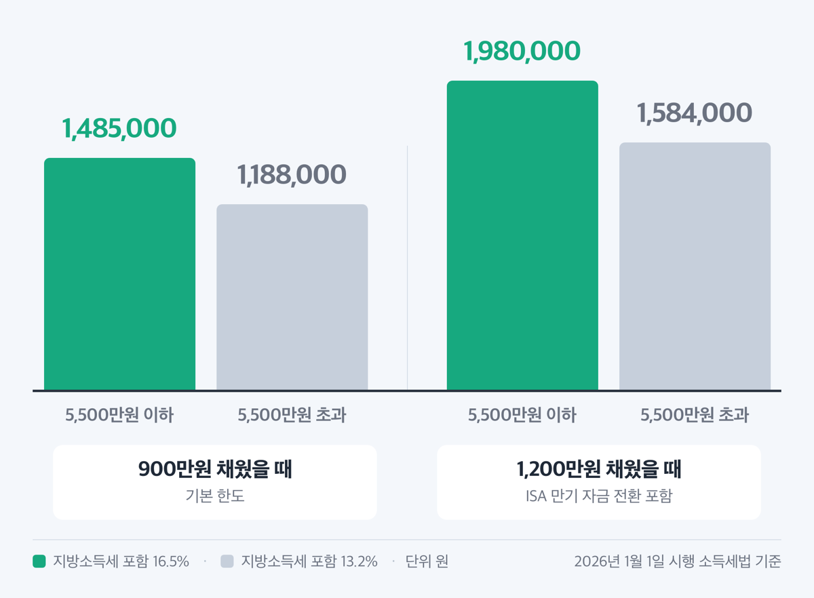
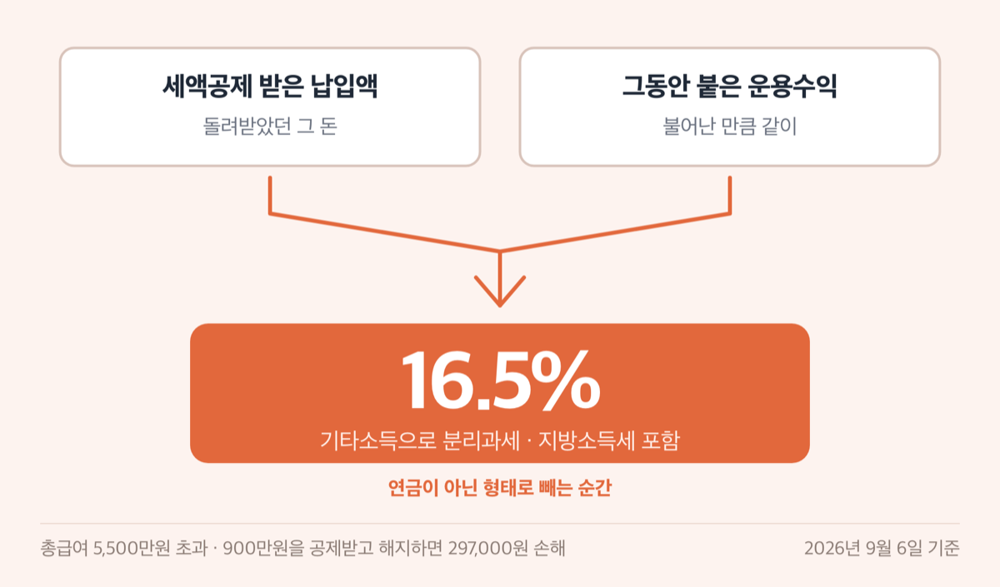
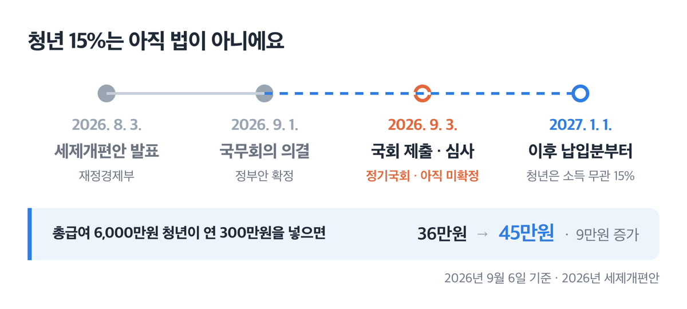

# IRP 세액공제 한도 900만원, 2026년 최대 148만원 환급

📌 2026년 9월 6일 기준

IRP 세액공제 한도가 700만원이라는 말이 아직 돌아다녀요. 지금은 900만원입니다. 국세청 상담센터 페이지 위쪽 안내 상자에도 옛 한도가 그대로 남아 있어서 헷갈릴 만해요.

**3줄 요약**

- IRP(개인형퇴직연금)는 개인이 자기 돈으로 만들어 노후에 연금으로 받는 계좌예요. 연금저축과 합쳐 연 900만원까지 세액공제를 받아요.
- 2026년 1월 1일 시행 소득세법 기준으로 공제율은 총급여 5,500만원 이하 15%, 초과 12%예요. 지방소득세를 포함하면 16.5%와 13.2%가 됩니다.
- 총급여를 먼저 확인하세요. 5,500만원을 기준으로 돌려받는 돈이 30만원 가까이 달라져요.

한도가 얼마인지, 실제로 통장에 얼마가 들어오는지, 중간에 깼을 때 얼마를 토해내는지 순서대로 적었어요.

## 한도는 900만원 하나만 기억하면 돼요

IRP 세액공제의 기준은 계좌 종류, 납입 금액, 총급여 셋입니다. 근거는 소득세법 제59조의3 제1항이에요.

| 무엇 | 세액공제 되는 연간 한도 |
|---|---|
| 연금저축계좌만 넣을 때 | 600만원 |
| IRP만 넣을 때 | 900만원 |
| 연금저축 + 퇴직연금(IRP·DC(확정기여)형) 합산 | 900만원 |
| 계좌에 넣을 수 있는 돈 자체 (공제와 별개) | 1,800만원 |

여기서 순서가 있어요. 연금저축 납입액은 600만원까지만 먼저 인정하고, 거기에 퇴직연금 납입액을 더해 900만원이 넘으면 초과 금액은 공제 대상에서 빼요. ==연금저축은 600만원이 천장이고, 그 위 300만원은 IRP로만 채울 수 있어요.==

같은 900만원을 넣어도 어디에 넣었느냐로 공제 금액이 달라집니다. 국세청이 안내한 조합을 그대로 옮겨요.

| 연금저축 납입액 (연간) | IRP 납입액 (연간) | 세액공제 대상 금액 (연 900만원 한도) |
|---|---|---|
| 200만원 | 700만원 | 900만원 |
| 600만원 | 300만원 | 900만원 |
| 900만원 | 0원 | **600만원** |
| 0원 | 900만원 | **900만원** |

세 번째 줄이 함정이에요. 연금저축에만 900만원을 몰아넣으면 300만원은 공제 없이 묶입니다.

> 😕 **900만원을 다 넣을 여유가 없는데요?**

한도는 채워야 하는 목표가 아니라 넘으면 안 되는 선이에요. 900만원을 12개월로 나누면 월 75만원인데, 이 돈은 만 55세 전에는 법이 정한 사유가 아니면 꺼낼 수 없어요. 넣은 만큼 비율대로 공제되니 300만원만 넣으면 그만큼만 돌려받습니다.

## 총급여 5,500만원 위아래로 공제율이 달라져요

공제율은 소득 기준선 하나로 나뉩니다. 근로소득만 있으면 총급여 5,500만원, 다른 소득이 섞여 있으면 종합소득금액 4,500만원이 기준이에요.

| 총급여 (근로소득만 있을 때) | 소득세 공제율 | 지방소득세 포함 |
|---|---|---|
| 5,500만원 이하 | 15% | 16.5% |
| 5,500만원 초과 | 12% | 13.2% |

여기서 한 번 짚고 갑니다. **소득세법이 직접 적어 둔 숫자는 15%와 12%뿐입니다.** 흔히 쓰는 16.5%와 13.2%는 지방세법 제103조의13이 정한 지방소득세, 곧 소득세의 10%를 더한 값이에요. 쉽게 말하면 국세 15%에 지방세 1.5%가 붙어 16.5%가 되는 구조입니다.

그래서 900만원을 다 채우면 이렇게 됩니다.

| 채운 금액 | 총급여 5,500만원 이하 (지방소득세 포함 16.5%) | 총급여 5,500만원 초과 (지방소득세 포함 13.2%) |
|---|---|---|
| 900만원 | 1,485,000원 | 1,188,000원 |
| 1,200만원 (ISA 전환 포함) | 1,980,000원 | 1,584,000원 |

소득세만 따지면 900만원 기준 135만원과 108만원이에요. 나머지가 지방소득세로 함께 줄어드는 몫입니다.

> [!WARNING]
> 이 금액은 받을 수 있는 상한이지 넣기만 하면 들어오는 돈이 아니에요. 세액공제는 낼 세금에서 빼 주는 것이라 산출세액이 공제액보다 적으면 남는 만큼은 돌려받지 못합니다. 연말정산 전에 홈택스에서 예상 산출세액을 먼저 확인하세요.

> 🤭 **솔직히 말하면** — 총급여 5,500만원 초과 구간에서 900만원을 꽉 채우는 분을 저는 잘 못 봤어요. 월 75만원을 55세까지 묶어 두는 결정이라서요.

## ISA 만기 자금을 옮기면 한도가 300만원 더 붙어요

ISA(개인종합자산관리계좌)는 하나의 계좌에서 예금·펀드·주식을 굴리고 이자와 배당에 세금 혜택을 주는 계좌예요. 만기가 된 ISA 잔액을 연금계좌로 옮기면 그 해에 한해 공제 한도가 늘어납니다.

- 추가 한도는 **전환금액의 10%와 300만원 중 적은 금액**이에요 *(3,000만원을 옮겨야 300만원이 꽉 찹니다)*
- 기본 900만원에 **더해집니다**. 합치면 최대 1,200만원이에요
- **옮긴 그 해에만** 붙어요 *(다음 해로 이월되지 않아요)*

그해에만 적용되는 이유는 이 한도가 납입 시점을 기준으로 계산되기 때문이에요. 12월에 만기가 되는 ISA를 다음 해 1월에 옮기면 그 해 한도로 넘어갑니다.

## 중간에 깨면 16.5%를 토해냅니다

여기가 IRP에서 가장 비싼 대목이에요.

연금이 아닌 형태로 돈을 빼면 그 돈은 기타소득으로 분리과세됩니다. 세율은 소득세 15%, ==지방소득세를 포함하면 16.5%==예요. 국세청이 안내문에 직접 "16.5%(지방소득세 포함)"라고 적어 둔 숫자입니다.

과세 대상은 계좌에 들어 있는 돈 전부가 아니에요. 세액공제를 받은 납입액과 운용수익 전부에 붙어요. 세액공제를 안 받은 돈은 빠지는데, 그러려면 홈택스에서 「연금·보험료등 소득·세액공제확인서」를 발급받아 금융회사에 내야 합니다.

총급여 5,500만원 초과인 분이 900만원을 공제받고 나중에 해지하면 이렇게 됩니다.

| 돌려받은 것 | 토해내는 것 | 차액 |
|---|---|---|
| 900만원 × 13.2% = 1,188,000원 | 900만원 × 16.5% = 1,485,000원 | **297,000원 손해** |

총급여 5,500만원 이하면 받은 비율과 내는 비율이 16.5%로 같아 본전처럼 보여요. 그런데 운용수익에도 똑같이 16.5%가 붙습니다. 오래 굴려 잘 불어났을수록 해지 손해가 커지는 구조예요.

그리고 애초에 아무 때나 뺄 수도 없어요. 근로자퇴직급여 보장법 시행령 제18조가 정한 사유만 중도인출이 됩니다.

1. 무주택자가 본인 명의로 주택을 사는 경우
2. 무주택자가 주거 목적 전세금이나 임차보증금을 부담하는 경우
3. 본인·배우자·부양가족이 6개월 이상 요양이 필요한 질병이나 부상의 의료비를 부담하는 경우
4. 재난으로 피해를 입은 경우
5. 신청일부터 거꾸로 5년 안에 파산선고를 받은 경우
6. 신청일부터 거꾸로 5년 안에 개인회생절차개시 결정을 받은 경우
7. 퇴직연금 담보대출의 원리금을 갚는 경우 *(인출액은 원리금 이하로 제한돼요)*

상시 근로자 10명 미만 사업장의 특례 IRP는 조건이 더 좁아요. 2번은 한 사업장에서 일하는 동안 1회로 한정되고, 3번은 본인 연간 임금총액의 12.5%를 넘는 의료비만 인정됩니다.

물론 천재지변, 사망, 해외이주, 3개월 이상 요양, 파산선고 같은 부득이한 사유가 확인되면 세율이 낮아져요. 다만 그 사유를 안 날부터 6개월 안에 증빙을 금융회사에 내야 연금소득으로 봅니다.

| 연금 받을 때 나이 | 소득세율 | 지방소득세 포함 |
|---|---|---|
| 70세 미만 | 5% | 5.5% |
| 70세 이상 80세 미만 | 4% | 4.4% |
| 80세 이상 · 종신계약 | 3% | 3.3% |

종신계약 3%는 2026년 1월 1일 이후 연금수령분부터 적용돼요. 그전에는 4%였습니다.

## 2027년부터 청년 공제율은 소득과 상관없이 15%로 바뀔 예정이에요

재정경제부가 2026년 8월 3일 세제개편안을 발표하면서 소득세법 제59조의3을 고치겠다고 했어요. 청년은 소득 수준과 관계없이 15%를 적용하겠다는 내용입니다.

**아직 법이 아닙니다.** 9월 1일 국무회의에서 정부안이 의결됐고, 9월 3일까지 국회에 제출해 정기국회에서 심사할 예정이에요.

| 구분 | 지금 적용되는 법 | 개편 예정안 |
|---|---|---|
| 청년 공제율 | 소득 기준 그대로 (15% 또는 12%) | 소득 무관 15% |
| 청년의 범위 | — | 15~34세 + 군복무기간 최대 6년 가산 |
| 한도 | 900만원 | 900만원 (그대로) |
| 적용 시점 | — | 2027년 1월 1일 이후 납입분부터 |

정부가 든 예시를 그대로 옮기면, 총급여 6,000만원인 청년이 IRP에 연 300만원을 넣을 때 지금은 12%를 적용해 36만원입니다. 개편안대로면 15%가 적용돼 45만원이 되고, 9만원이 늘어요.

여기서 시제를 정확히 봐야 해요. ==2026년에 넣는 돈에는 이 규정이 적용되지 않습니다.== 올해 IRP에 넣은 돈은 나이와 상관없이 총급여 5,500만원을 넘으면 12%, 지방소득세를 포함해 13.2%예요.

함께 나온 연금계좌 항목이 둘 더 있어요. 생산적금융 ISA 만기 전환금액을 연금계좌 추가납입 대상에 넣는 안, 그리고 세액공제 추가한도 계산에 생산적금융 ISA 전환금액의 10%를 더하는 안입니다. 300만원 상한은 그대로고, 추가한도 쪽은 2027년 1월 1일 이후 납입분부터예요. 반대로 기초연금 수급자의 부동산 양도금액 연금계좌 납입 특례는 2027년 12월 31일 적용기한이 오면 종료하는 것으로 정리됐어요.

## IRP 900만원 채우는 순서

세액공제는 계좌에 쌓인 총액이 아니라 그 해에 넣은 금액으로 계산해요. 순서를 잘못 잡으면 같은 돈을 넣고 덜 받습니다.

1. **총급여부터 확인하세요.** 근로소득만 있으면 5,500만원, 다른 소득이 섞이면 종합소득금액 4,500만원이 기준선이에요.
2. **올해 연금저축에 넣은 금액을 확인하세요.** 600만원을 넘겼다면 그 위는 공제가 안 되니, 남은 한도는 IRP로 채웁니다.
3. **회사가 넣어 준 DC형 부담금은 빼고 계산하세요.** 사용자부담금은 공제 대상이 아니에요. 근로자가 추가로 넣은 돈만 잡힙니다.
4. **12월 31일까지 입금하세요.** 1월로 넘어가면 내년 공제분이 됩니다.
5. **한도를 넘겨 넣었다면 금융회사에 「납입액 전환특례」를 신청하세요.** 공제받지 않은 금액을 올해 납입한 연금보험료로 전환해 달라고 하면, 그날 다시 납입한 것으로 보아 공제받아요. 다만 전환한 금액도 신청일에 납입한 것으로 보니 납입 요건을 다시 갖춰야 합니다.

IRP는 퇴직급여 일시금을 받은 사람, DB(확정급여)형·DC(확정기여)형·중소기업퇴직연금기금 가입자, 자영업자, 퇴직금제도를 적용받는 근로자, 공무원·군인·사립학교 교직원·별정우체국 직원이 만들 수 있어요. 계속근로 1년 미만이거나 주 소정근로시간이 15시간 미만이어서 퇴직급여제도가 없는 근로자도 됩니다. 사실상 소득이 있으면 대부분 열려 있어요.

## IRP 세액공제 한도 관련 궁금증 해결

**Q. 연금저축에 900만원을 다 넣으면 900만원을 공제받나요?**
A. 아니에요. 600만원까지만 인정됩니다. 나머지 300만원은 공제 없이 계좌에 남아요. 300만원을 IRP로 옮겨 넣었다면 900만원 전부 공제 대상이 됐을 돈입니다.

**Q. 회사가 넣어 준 퇴직연금도 세액공제 되나요?**
A. DC형 퇴직연금의 사용자부담금, 곧 회사가 넣은 돈은 공제 대상이 아니에요. 근로자가 자기 돈으로 추가 납입한 금액만 공제됩니다.

**Q. 지금 34세인데 15%를 적용받나요?**
A. 2026년에 넣는 돈에는 적용되지 않아요. 청년 15% 규정은 개편 예정안이고, 국회를 통과하면 2027년 1월 1일 이후 납입분부터입니다. 올해는 총급여 기준을 그대로 따라요.

**Q. 1,800만원까지 넣으라던데 그럼 다 공제되나요?**
A. 1,800만원은 계좌에 넣을 수 있는 납입 한도이고, 세액공제는 900만원까지입니다. 두 숫자를 섞으면 안 돼요. 나머지 900만원은 공제 없이 굴러가는 돈이에요.

**Q. 급하게 돈이 필요하면 일부만 뺄 수 있나요?**
A. 법이 정한 중도인출 사유에 해당해야 합니다. 세액공제를 받지 않은 자기부담금만 골라 부분 인출할 수 있는지는 금융회사 약관에 따라 다르니, 계좌를 연 금융회사에 직접 확인하세요.

저라면 900만원부터 채우지 않아요. 총급여 5,500만원 이하 구간이면 같은 돈을 넣고 16.5%(지방소득세 포함)를 받으니 먼저 채울 이유가 분명하고, 초과 구간이면 13.2%(지방소득세 포함)를 받자고 55세까지 묶는 셈이라 계산이 달라집니다. 그리고 어느 쪽이든 산출세액을 넘는 만큼은 돌려받지 못하니, 연말정산 전에 홈택스에서 예상 세액을 먼저 확인하는 것이 순서예요. 세부 판정이 필요하면 국세청 국세상담센터(126)로 문의하세요.

결론은 하나입니다. 총급여와 연금저축 납입액 두 숫자만 적어 보면 오늘 넣을 금액이 나옵니다.

참고: 소득세법 제59조의3 · 소득세법 시행령 제40조의2 · 근로자퇴직급여 보장법 및 같은 법 시행령 · 지방세법 제103조의13 · 국세청 「근로소득 세액공제 — 연금계좌세액공제」 안내 · 국세청 「연금소득 원천징수 방법」 안내 · 국세청 국세상담센터 상담사례 · 재정경제부 「2026년 세제개편안」
