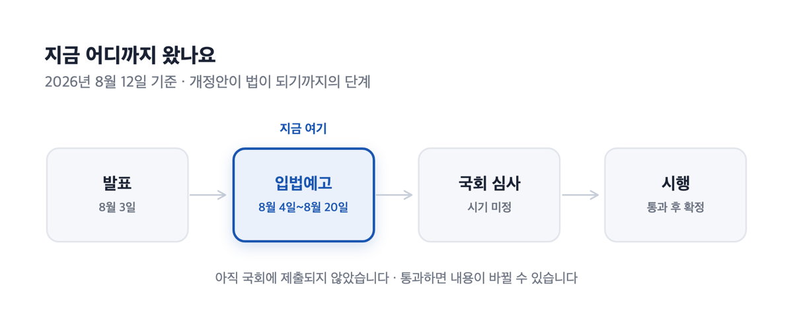
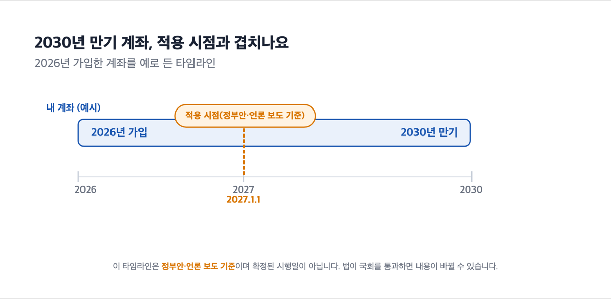
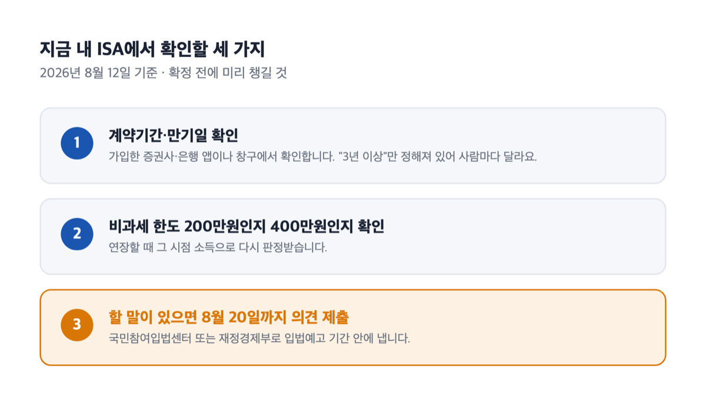

> [!SUMMARY] 2026년 8월 12일 기준
> ISA 만기를 5년으로 제한한다는 내용은 **정부가 낸 안이고, 아직 국회에 제출되지 않았습니다.**
>
> 제 ISA는 만기가 2030년으로 되어 있어요. 그런데 ISA 개편으로 만기가 5년으로 제한된다는 뉴스를 보고 한참 헷갈렸어요. 제 계좌는 2030년까지 그대로인 건지, 5년으로 잘리는 건지요.
>
> 결론부터 적으면 이래요. **지금 확정된 것은 아무것도 없어요.** 재정경제부가 2026년 8월 3일 발표한 세제개편안에 담긴 내용이고, 8월 20일까지 입법예고를 받았고요.

## 확정이 아니에요 — 입법예고는 8월 20일에 끝났습니다

지금 이 개편안은 법이 되기 전 단계예요.

ISA를 규정하는 법은 조세특례제한법이에요. 재정경제부는 그 개정안을 2026년 8월 4일부터 ==8월 20일까지== 입법예고했어요. 기준일인 8월 12일 현재 국회에 제출되지도 않았습니다.

근데 여기서 한 가지가 더 겹쳤어요. 언론 보도에 따르면 발표 나흘 뒤인 8월 7일, 대통령이 ISA 개편 방안을 두고 "정확하게 준비도 하지 않고 왜 그렇게 한 것이냐"며 전면 재검토를 지시했다고 합니다.

그 뒤로 한 단계가 더 있었어요. 언론 보도에 따르면 8월 10일 구윤철 경제부총리 겸 재정경제부 장관이 본인 SNS에 개인종합자산관리계좌 개편안에 대한 여당 제안에 공감한다는 뜻을 밝히고, 국민 여러분의 의견까지 수렴해 제도 보완 필요성을 적극 검토할 예정이라고 전했다고 해요. 같은 무렵 재정경제부가 일반 ISA의 5년 상한과 미사용 한도 이월 폐지를 개편안 이전으로 되돌리는 방안을 검토 중이라는 보도도 나왔어요.

그렇다고 개편안이 없어진 것은 아니에요. 다만 8월 12일 기준 입법예고문은 그대로입니다. 주요내용에 5년·2천만원·2029년이 그대로 적혀 있고, 입법예고도 8월 20일에 끝났고요.

> [!WARNING]
> 개정안은 국회 심사를 거쳐 내용이 바뀔 수 있습니다. 저는 확정 전에 계좌를 정리할 이유는 없다고 봐요.

## 지금 법은 "3년 이상"만 정해 놨어요. 상한이 없습니다

만기를 길게 잡을 수 있었던 이유가 여기 있어요.

현행 조세특례제한법은 ISA 계약기간을 "3년 이상"으로만 정해 놨어요. 상한을 정한 문구가 조문에 없습니다. 그리고 계좌보유자는 계약기간 만료일 전에 계약기간을 연장할 수 있어요. 그래서 만료 전에 연장을 반복하면 계좌를 계속 굴릴 수 있었죠.

그 밖의 현행 규정은 이래요.

- 총납입한도는 1억원 이하예요.
- 비과세 한도는 200만원, 조건에 맞으면 400만원이고요.
- 한도를 넘긴 이익에는 소득세 9%가 분리과세돼요. 지방소득세를 더하면 실제 부담은 9.9%입니다.
- 계좌는 1명당 1개만 보유할 수 있어요.

## 정부안이 바꾸겠다는 건 셋이에요 — 5년, 2천만원, 2029년

입법예고된 개정안의 '주요내용'에 적힌 문장은 짧아요. 계약기간은 최대 5년, 연간 납입한도는 2천만원, 적용기한은 2029년 12월 31일까지로 하는 내용이에요.

| 항목 | 현행 법률 (2026년 8월 12일 기준) | 일반 ISA 정부안 (2026년 8월 3일 발표, 국회 심사 전) |
|---|---|---|
| 계약기간 | 3년 이상, **상한 없음** | 최대 **5년** |
| 연간 납입한도 | 법 조문의 계산식으로 정함 | **2천만원** |
| 가입 기한 | 조문에 기한 규정이 없음 | **2029년 12월 31일** |
| 총납입한도 | 1억원 이하 | 개정안 주요내용에 없음 |

근데 표에 없는 항목이 하나 더 있어요. 언론 보도에 따르면 정부안은 ==못 채운 연간 한도를 다음 해로 넘기는 것도 없애고==, 이건 기존 가입자까지 2027년 1월 1일 이후 납입분부터 적용된다고 합니다.

저는 올해 계좌를 시작해서 연간 한도를 한참 못 채우고 있어요. 이 대목이 저한테는 5년 제한보다 더 크게 다가왔어요.

그리고 일반 ISA의 비과세 한도 200만원·400만원과 9% 세율은 이번 개정안 주요내용에 들어 있지 않아요.

## "5년 뒤 계좌가 강제 종료된다"는 개정안에 없는 말이에요

이게 제가 가장 오래 헷갈린 지점이에요.

개정안 주요내용에 적힌 것은 "계약기간을 최대 5년으로 한다"까지예요. 만기가 되면 계좌가 자동으로 해지되는지, 그때 과세 정산을 어떻게 하는지는 그 문장에 없어요. 이 부분은 법안이 국회를 통과하면 그때 확정됩니다.

기존 계좌에 대해서는 언론 보도가 이렇게 전해요. 2027년 1월 1일 이후 신규 가입 및 계약 연장하는 계좌부터 적용되고, 이미 장기간으로 계약된 계좌의 만기가 시행일과 동시에 5년으로 줄어드는 것은 아니라고요. 대신 기존 3년 계약자는 2년까지만 연장할 수 있다는 설명도 함께 나왔어요.

제 계좌를 두고 지금 말할 수 있는 건 여기까지예요. 계약기간과 만기일은 가입한 금융회사 앱이나 창구에서 확인할 수 있고, 만기 처리 방식은 법이 확정되면 그 회사 안내로 확인하는 게 맞아요.

주변 반응은 부정적이었어요. "세금을 더 걷으려는 거 아니냐"는 말이 먼저 나왔거든요. 언론 보도로 전해진 정부 설명은 달라요. 장기·적립식 투자를 장려하고, 연간 한도를 이월할 수 없게 설계된 생산적금융 ISA와 형평을 맞추려는 조치라는 것이고요.

## 연장할 때 소득이 달라지면 비과세 한도가 200만원으로 내려갑니다

이건 개편안과 무관하게 지금도 적용되는 규정이에요.

현행법은 비과세 한도를 ==가입일 또는 연장일을 기준으로== 판정해요. 400만원을 받는 쪽은 총급여 5천만원 이하 근로자, 종합소득금액 3천8백만원 이하 거주자, 대통령령으로 정하는 농어민이고요. 여기에 들지 않으면 200만원이에요.

숫자로 보면 차이가 이렇게 나요. ISA는 계좌 안의 손익을 통산한 뒤 순이익에만 세금을 매기는 구조예요. 순이익이 500만원 났다고 해 볼게요.

- **비과세 한도 400만원인 경우**: 과세 대상 100만원 × 9.9% = **9만 9천원**. 세후 490만 1천원.
- **비과세 한도 200만원인 경우**: 과세 대상 300만원 × 9.9% = **29만 7천원**. 세후 470만 3천원.

같은 500만원인데 ==세금이 19만 8천원 차이==예요. 그리고 이 판정은 가입할 때 한 번만 받는 게 아니라 연장할 때 다시 받습니다.

> [!TIP]
> 연장하기 전에 그 시점의 총급여와 종합소득금액을 먼저 확인하는 편이 낫다고 봐요.

")

## 정부안은 생산적금융 ISA에 배당까지 전액 비과세를 주겠다고 합니다 — 대신 국내 자산 위주예요

같은 발표에 새 계좌를 하나 만들겠다는 안도 들어 있어요. 이름은 생산적금융 개인종합자산관리계좌, 줄여서 생산적금융 ISA예요.

혜택이 커 보이지만 조건부터 봐야 해요.

| 항목 | 생산적금융 ISA 정부안 (2026년 8월 3일 발표, 국회 심사 전) |
|---|---|
| 가입 제한 | 직전 3개 과세기간 중 한 번 이상 금융소득종합과세 대상이었으면 가입 불가 |
| 담을 수 있는 것 | 국내 상장주식, 국내 주식형 펀드, 국민성장펀드, 기업성장집합투자기구(BDC) 등 |
| 세제 혜택 | 계좌에서 생긴 이자·배당소득을 한도 없이 전액 비과세 |
| 가입 대상 | 19세 이상 거주자, 15세 이상 근로자 |
| 납입한도 | 연 2,000만원 · 총 2억원 |
| 계약기간 | 최초 3년, 총 10년까지 연장 |
| 청년형 요건 | 15~34세이면서 총급여 7,500만원 또는 종합소득금액 6,300만원 이하 → 납입액의 10% 소득공제 |
| 가입 시기 | 2027년 1월 1일 이후 신규 가입분부터, 2029년 12월 31일까지 가입한 경우로 한정 |

==직전 3개 과세기간 중 한 번이라도== 금융소득종합과세 대상이었으면 못 들어가요. 목돈이 크지 않은 쪽에는 대개 걸리지 않는 조건이지만, 조건 자체는 알고 있어야 합니다.

중간에 깨는 경우도 짚어야겠어요. 언론 보도에 따르면 3년 안에 원금을 초과해 인출하거나 계좌를 해지하면 비과세 혜택이 환수된다고 합니다. 환수 요건은 법이 통과되면 금융회사 약관으로 다시 보는 게 맞아요.

## 의견 제출 기간은 끝났습니다 — 이제 무엇을 보나

지금 할 수 있는 일은 셋이에요.

> [!ACTION]
> 첫째, 내 ISA 계약기간과 만기일을 확인해요. 현행법이 계약기간을 "3년 이상"으로만 정해 놔서 사람마다 다르게 잡혀 있어요.
> 둘째, 내 비과세 한도가 200만원인지 400만원인지 봐요. 연장할 때 다시 판정받는 값이니까요.
> 셋째, 의견 제출 기간은 8월 20일에 끝났어요. 다음 개정안이 예고되면 같은 창구에서 냅니다. [국민참여입법센터의 해당 입법예고 페이지](https://opinion.lawmaking.go.kr/gcom/ogLmPp/87946)나 재정경제부로 8월 20일까지고요.
>
> 저도 입법예고에 의견을 낸 적은 없어요. 그런데 이번 건은 5년 상한이라는 문장 하나가 계좌 설계 전체를 바꾸는 내용이라, 저라면 마감 전에 한 줄이라도 넣어 보겠습니다.

계약기간과 만기일은 가입한 증권사·은행 앱에서 몇 분이면 확인할 수 있어요. 그것부터 보시고, 나머지는 국회 심사 결과를 기다리면 돼요.

## 자주 묻는 것

### Q. 개편안이 재검토된다는데 없던 일이 되는 건가요?

언론 보도로 전면 재검토 지시가 전해졌고, 8월 10일에는 재정경제부가 일반 ISA의 5년 상한과 한도 이월 폐지를 개편안 이전으로 되돌리는 방안도 검토 중이라고 전해졌어요. 같은 날 구윤철 경제부총리 겸 재정경제부 장관이 국민 의견까지 수렴해 제도 보완 필요성을 적극 검토할 예정이라고 밝혔다는 보도도 있었고요. 다만 8월 12일 기준 입법예고문은 그대로이고, 입법예고도 8월 20일까지 진행 중이에요. 확정 여부와 최종 내용은 국회 심사를 거쳐 정해집니다.

### Q. 제 계좌 만기가 2030년인데 5년으로 줄어드나요?

개정안 주요내용에 있는 것은 "계약기간을 최대 5년으로 한다"는 문장까지예요. 언론 보도는 2027년 1월 1일 이후 신규 가입·연장분부터 적용되고 기존 장기 계약의 만기가 시행일과 동시에 줄어드는 것은 아니라고 전해요. 확정 조건은 법이 통과되면 금융회사 안내로 확인하시면 돼요.

### Q. 생산적금융 ISA는 지금 가입할 수 있나요?

정부안 기준으로 2027년 1월 1일 이후 신규 가입분부터 적용되고, 2029년 12월 31일까지 가입한 경우로 한정돼요. 지금 만들 수 있는 계좌가 아니고요.

### Q. 비과세 한도를 넘긴 이익에는 세금이 얼마 붙나요?

현행법상 소득세 9%가 분리과세돼요. 종합소득과세표준에 합산하지 않고요. 지방소득세를 더하면 실제 부담은 9.9%예요.

### Q. 금융소득이 많았던 해가 있으면 생산적금융 ISA에 못 들어가나요?

정부안은 직전 3개 과세기간 중 한 번 이상 금융소득종합과세 대상이 된 사람은 가입할 수 없도록 하고 있어요. 한 해만 걸려도 해당돼요.

참고: 재정경제부 「2026년 세제개편안」(2026.8.3.) · 조세특례제한법 제91조의18 · 국민참여입법센터 「조세특례제한법 일부개정법률안」 입법예고(재정경제부공고 제2026-211호) · 대한민국 정책브리핑
