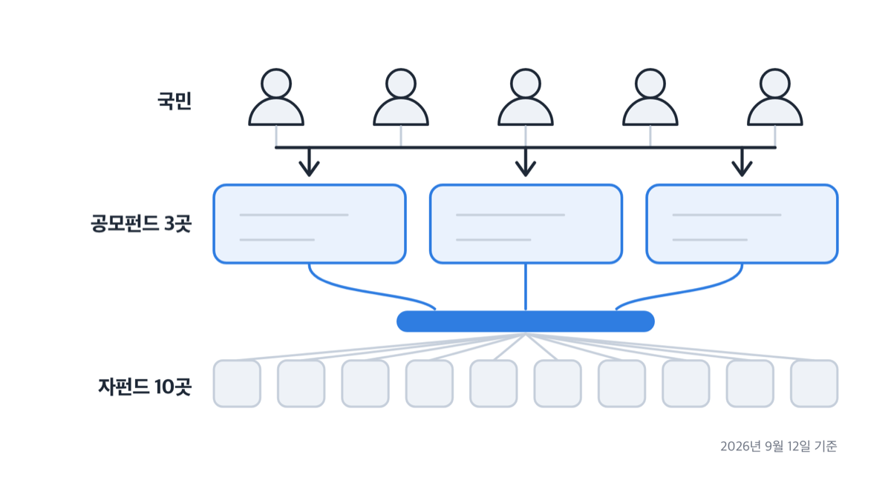
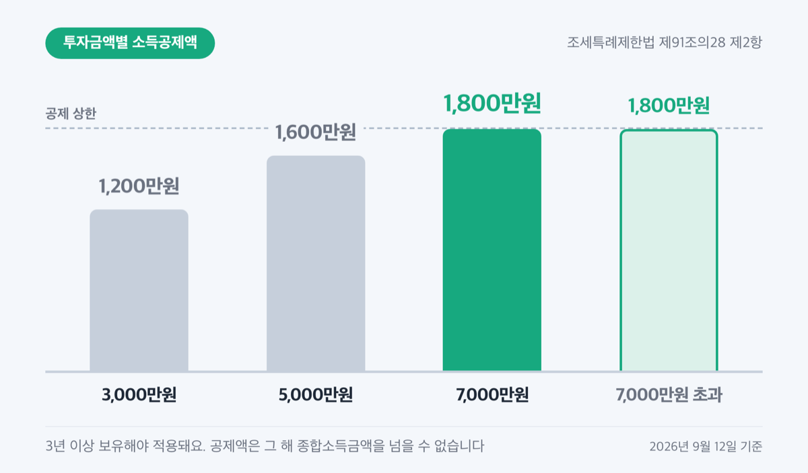
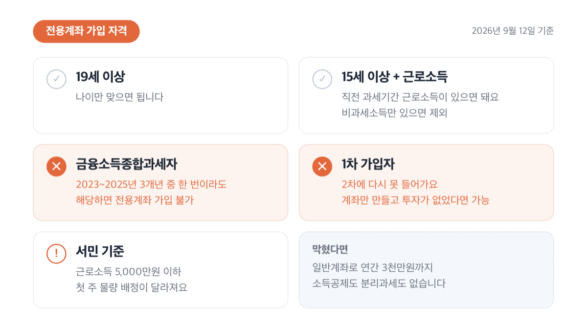
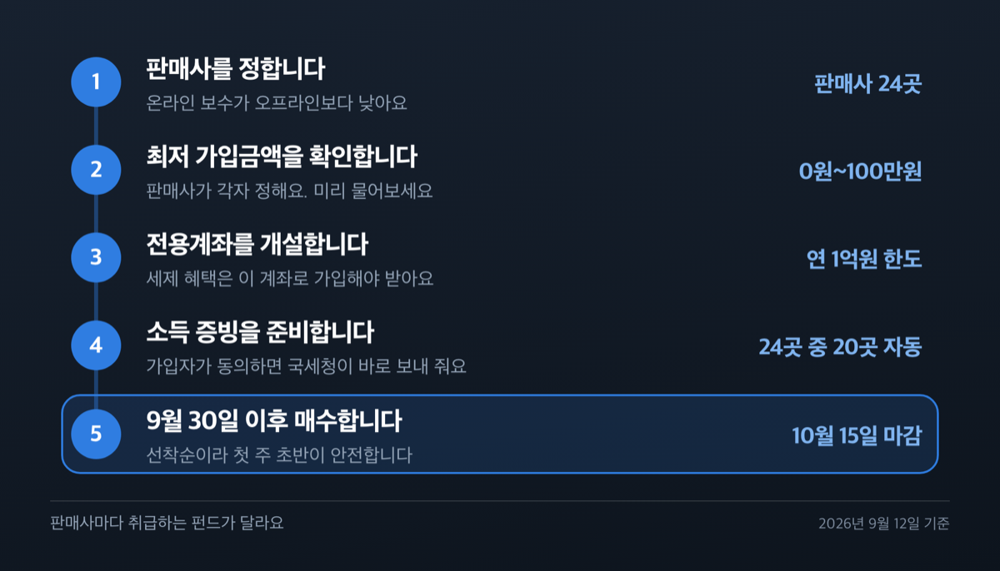
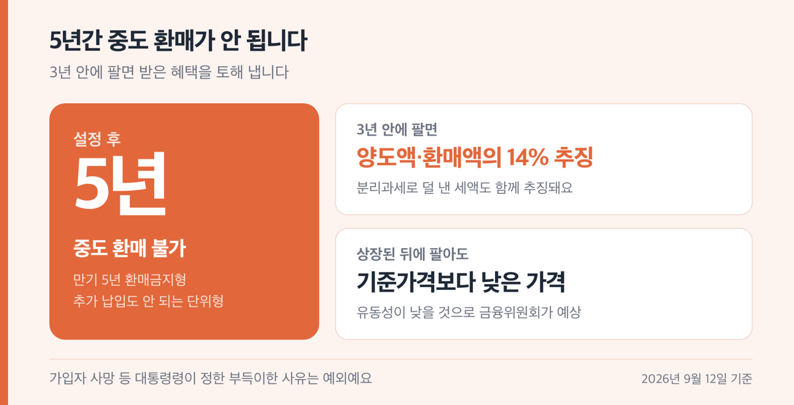

# 국민참여성장펀드 2차 운용사 3곳, 2026년 9월 30일 선착순

📌 2026년 9월 12일 기준

국민참여성장펀드 2차는 운용사 셋 중에서 골라야 하는 상품이라고들 하는데, 셋은 내용물이 같아요. 금융위원회가 어느 펀드에 가입하더라도 같은 포트폴리오에 투자하고 투자수익률도 동일하다고 밝혔습니다. 정말 달라지는 것은 어디서 가입하느냐예요.

**3줄 요약**

- 첨단전략산업에 투자하는 정책 펀드로, 소득공제와 배당소득 분리과세를 함께 주는 대신 5년간 돈이 묶입니다.
- 2차 모집은 2026년 9월 30일(수)부터 10월 15일(목)까지 6,000억원을 선착순으로 팔아요. 1차는 6영업일 만에 끝났습니다.
- 운용사가 아니라 판매 창구를 먼저 정해야 해요. 온라인이 보수가 낮고, 첫 주에는 서민 물량이 따로 배정됩니다.

아래에서 세 운용사가 같은 이유, 세금이 얼마나 줄어드는지, 어디서 어떻게 신청하는지, 그리고 놓치면 손해인 조건 셋을 차례로 봅니다.

> [!WARNING]
> 투자위험등급 1등급(매우 높은 위험) 고위험 상품이고, 설정 후 5년간 중도 환매가 되지 않습니다. 원금 손실이 날 수 있어요.

## 운용사 세 곳, 비교할 게 없어요

국민이 직접 가입하는 공모펀드의 운용사는 미래에셋자산운용, 삼성자산운용, KB자산운용 셋입니다. 그런데 ==셋 중 무엇을 골라도 수익률이 같습니다==. 금융위원회가 세 펀드가 같은 포트폴리오에 투자하고 투자수익률도 동일한 구조라고 원문에 적었어요.

이 상품은 '사모재간접공모펀드'라서 그렇습니다. 쉽게 말하면 우리가 넣은 돈이 공모펀드에 모였다가, 실제 투자를 집행하는 사모펀드 10곳으로 다시 내려가는 2층 구조예요. 그런데 그 10곳을 세 운용사가 각자 뽑은 게 아니라, 한국성장금융투자운용과 산업은행, 공모펀드 운용사 3개사가 함께 만든 컨소시엄이 한 번에 뽑았습니다. 위층 이름만 셋이고 아래층은 하나라는 뜻이에요.

실제로 투자를 집행하는 자펀드 운용사 10곳은 2026년 9월 8일에 정해졌어요.

| 규모 구분 | 자펀드 1개당 결성금액 | 운용사 |
|---|---|---|
| 대형 (2곳) | 1,200억원 | 디에스자산운용, 한국투자밸류자산운용 |
| 중형 (4곳) | 800억원 | 브레인자산운용, 케이비자산운용, 쿼드자산운용, 트러스톤자산운용 |
| 소형 (4곳) | 400억원 | 디비자산운용, 엔에이치헤지자산운용, 토러스자산운용, 하나자산운용 |

*2026년 9월 8일 선정 기준. 서류접수 7월 20일 이후 서류평가·현장실사·구술심사를 거쳤어요.*

1차 때와 견주면 명단이 거의 바뀌었습니다. 10곳 중 그대로 남은 곳은 디에스자산운용 하나예요. 한국투자밸류자산운용은 중형에서 대형으로, KB자산운용은 소형에서 중형으로 옮겨 갔고요. 1차에서 대형이던 미래에셋자산운용은 2차 자펀드 명단에 없습니다.

이 돈이 어디로 가는지도 규칙으로 묶여 있어요. 자펀드 결성금액의 60% 이상을 반도체, 이차전지, 백신, 디스플레이, 수소, 미래차, 바이오, AI, 방산, 로봇, 컨텐츠, 핵심광물 등 12개 첨단전략산업 기업에 넣어야 합니다. 결성금액의 30% 이상은 기업에 들어가는 신규 자금이어야 하고요. 비상장기업에 10% 이상, 코스닥 기술특례상장사에 10% 이상이 들어갑니다. 코스피 상장사 투자는 10% 이내로 제한돼요.

이미 상장돼 활발히 거래되는 주식이 아니라 비상장사와 기술특례상장사에 새 돈을 넣는 구조입니다. 5년을 묶는 이유가 여기 있어요.

> 🤭 **솔직히 말하면** — 세 운용사 공시를 다 열어 보수율을 견줘 봤는데, 소수점 아래까지 똑같았어요. 1차 기준이긴 하지만 「운용사 비교」의 답은 그때 이미 나와 있었습니다.

그러면 진짜 고를 것은 무엇인지, 돈 이야기부터 보겠습니다.

## 얼마 넣고 세금은 얼마나 줄어드나

세제 혜택을 받으려면 전용계좌로 가입해야 하고, 그 계좌에는 한도가 붙습니다. 조세특례제한법 제91조의28이 정한 값이에요.

| 한도·기한 항목 | 기준값 (1인당, 2026년 9월 12일 기준) |
|---|---|
| 전용계좌 연간 한도 | 1인당 1억원 |
| 전용계좌 총 한도 | 5년간 2억원 |
| 최저 가입금액 | 0원~100만원 사이에서 판매사가 정함 |
| 일반계좌 한도 | 1인당 연간 3천만원 (세제 혜택 없음) |
| 가입 기한 | 2030년 12월 31일까지 |

*전용계좌 한도는 모든 금융회사 납입액을 합친 금액이에요. 여러 곳에 나눠 넣어도 합계로 셉니다.*

혜택은 둘입니다. 하나는 소득공제, 다른 하나는 배당소득 분리과세예요.

소득공제액은 법에 표로 정해져 있고, 투자금액이 커질수록 공제율이 낮아집니다.

| 1명당 투자금액 | 공제액 |
|---|---|
| 3천만원 이하 | 투자금액의 40% |
| 3천만원 초과 5천만원 이하 | 1,200만원 + 초과분의 20% |
| 5천만원 초과 7천만원 이하 | 1,600만원 + 초과분의 10% |
| 7천만원 초과 | 1,800만원 |

*조세특례제한법 제91조의28 제2항 기준. 3년 이상 보유해야 적용됩니다.*

표의 마지막 줄이 정액이라, 7,000만원을 넣으면 공제액이 1,800만원으로 최대가 되고 그보다 더 넣어도 공제는 늘지 않아요. 3,000만원이면 1,200만원, 5,000만원이면 1,600만원입니다.

> 😕 소득공제 1,800만원이면 1,800만원을 돌려받는 건가요?

아니에요. 소득공제는 세금을 깎아 주는 게 아니라 세금을 매기는 기준 금액을 줄여 주는 것입니다. 실제로 줄어드는 세금은 본인 세율에 달렸어요.

과세표준이 5,000만원 초과 8,800만원 이하 구간(세율 24%)에 있고 공제 후에도 그 구간에 머문다고 놓고 계산하면, 1,800만원 공제로 줄어드는 세금은 지방소득세를 포함해 약 475만원입니다. 과세표준 1,400만원 초과 5,000만원 이하 구간(세율 15%)이라면 1,200만원 공제로 약 198만원이고요. 둘 다 구간이 바뀌지 않는다고 가정하고 계산한 것이라, 공제 후 과세표준이 아래 구간으로 내려가면 절감액도 줄어듭니다. 법은 공제액이 그 해 종합소득금액을 넘을 수 없다고도 선을 그었어요.

두 번째 혜택인 배당소득 분리과세는 세율이 정해져 있습니다. 소득세 9%, 지방소득세를 더하면 9.9%예요. 종합소득 과세표준에 합산하지 않고, 투자일부터 5년 이내에 받는 배당소득까지만 적용됩니다.

그래서 세전 수익률이 아니라 세후로 따져야 해요. 보수도 마찬가지입니다. 금융위원회는 2차 펀드의 보수·수수료를 연간 약 1.2% 수준, 온라인은 약 1.0% 수준이라고 밝혔어요. 1차 펀드 공시값은 오프라인 총보수·비용 1.148%, 온라인 0.958%였습니다.

저라면 온라인으로 가입합니다. 5년을 보유하는 상품에서 연 0.2%포인트 차이는 그냥 넘길 크기가 아니에요.

## 누가 가입할 수 있나

가입 자격은 나이와 소득, 두 방향에서 걸러집니다. 기본은 19세 이상이면 되고, 15세 이상이어도 직전 과세기간에 근로소득이 있으면 됩니다. 비과세소득만 있는 사람은 제외예요.

여기까지는 넓은데, 걸러지는 조건이 셋 있어요.

1. **금융소득종합과세자** — 2023년부터 2025년까지 3개년 중 한 번이라도 금융소득종합과세자였다면 전용계좌에 가입할 수 없습니다.
2. **1차 가입자** — ==1차 가입자는 2차에 다시 못 들어갑니다==. 다만 계좌만 만들고 실제 투자가 없었다면 2차 가입이 가능하고, 올해 투자 이력이 있어도 내년 상품에는 가입할 수 있어요.
3. **서민 여부** — 못 들어가는 조건은 아니지만 첫 주 물량 배정이 달라집니다. 근로소득 5,000만원 이하(근로소득 외 종합소득이 있으면 종합소득 3,800만원 이하)면 서민에 해당해요. ISA(개인종합자산관리계좌) 서민형 요건과 같습니다.

전용계좌 가입이 막혀도 길이 아예 없지는 않아요. 세제 혜택을 포기하면 일반계좌로 연간 3천만원까지 넣을 수 있습니다. 다만 소득공제도 분리과세도 없이 5년 묶이는 조건만 남으니, 저라면 그 경우엔 넣지 않습니다.

자격이 됐다면 이제 창구를 정할 차례입니다.

## 9월 30일, 국민참여성장펀드 어디서 신청하나

판매는 2026년 9월 30일(수)에 시작해 10월 15일(목)에 끝납니다. 2주간 10영업일이고 선착순이에요. 물량이 소진되면 조기에 마감됩니다. 1차는 3주 예정이었는데 6영업일 만에 6,000억원이 다 팔렸어요.

판매사는 24곳입니다. 영업점과 온라인에서 동시에 팝니다.

| 판매사 구분 (2026년 9월 8일 기준) | 판매사 이름 (총 24곳) |
|---|---|
| 은행 (10곳) | 국민, 기업, 농협, 신한, 아이엠뱅크, 우리, 하나, 경남, 광주, 부산 |
| 증권 (14곳) | KB, NH, 대신, 메리츠, 미래에셋, 삼성, 신한투자, 아이엠, 유안타, 하나, 한국투자, 한화투자, 우리투자(온라인 전용), 키움(온라인 전용) |

*2026년 9월 8일 금융위원회 발표 기준. 우리투자증권과 키움증권은 온라인으로만 팝니다.*

신청 순서는 이렇습니다.

1. **판매사를 정합니다.** 온라인 보수가 오프라인보다 낮으니 창구 방문이 꼭 필요한 게 아니면 온라인이 유리해요.
2. **최저 가입금액을 확인합니다.** 0원에서 100만원 사이로 판매사가 각자 정해요. 가입할 곳에 미리 물어보세요.
3. **전용계좌를 개설합니다.** 세제 혜택을 받으려면 이 계좌여야 하고, 국민성장집합투자기구의 증권에만 투자할 수 있어요.
4. **소득 증빙을 준비합니다.** ISA 가입용 소득확인증명서 또는 증명서 발급번호가 가입하려는 모든 사람에게 필요해요.
5. **9월 30일 이후 매수합니다.** 선착순이라 첫 주 초반이 안전합니다.

4번이 2차에서 편해졌어요. 가입자가 동의하면 국세청이 가진 소득 증빙을 공공마이데이터 시스템으로 판매사에 바로 보내 줍니다. 홈택스나 정부24에서 직접 뗄 필요가 없어요. 다만 24곳 전부는 아닙니다. 은행 10곳 전부와 증권 10곳(KB, NH, 대신, 메리츠, 미래에셋, 삼성, 하나, 한국투자, 한화투자, 키움)에서 되고, 신한투자증권·아이엠증권·유안타증권·우리투자증권 네 곳은 스크레이핑 방식이에요. 그중 신한투자증권과 유안타증권은 영업점을 방문해 가입할 때 소득 증빙 서류를 직접 내야 합니다.

가입하려는 판매사가 세 운용사 중 어느 펀드를 파는지는 해당 판매사에 확인하세요. 판매사마다 취급하는 펀드가 다릅니다.

## 놓치기 쉬운 셋 — 첫 주 물량, 5년 환매, 추징

**첫 번째, 첫 주와 2주차의 규칙이 다릅니다.** 이걸 모르면 살 수 있는 물량을 놓쳐요.

| 구분 | 첫 주 | 2주차 (10.8~10.15) |
|---|---|---|
| 서민 배정 | 판매액의 50%인 3,000억원을 서민 전용으로 | 서민 물량이 남으면 구분 없이 판매 |
| 온라인 비중 | 은행 40%, 증권 60%로 제한 | 제한 없음 |

*2026년 9월 8일 금융위원회 발표 기준. 2주차는 10월 8일(목)부터 10월 15일(목)까지입니다.*

==첫 주에는 판매액의 절반인 3,000억원이 서민 전용==이에요. 1차 때는 이 비중이 20%(1,200억원)였으니 2.5배로 늘었습니다. 왜 늘렸냐면, 1차에서 서민 판매액 비중이 35% 수준으로 배정치 20%를 크게 넘겼거든요. 가입자 수로는 38.8%였고요. 국회는 세제 혜택을 심의하면서 판매액의 20% 이상을 서민 전용으로 배정할 것을 요구했습니다.

서민 기준에 해당한다면 첫 주가 유리하고, 해당하지 않는다면 첫 주 일반 물량이 그만큼 줄어든다는 뜻이에요.

**두 번째, ==5년간 중도 환매가 안 됩니다==.** 만기 5년의 환매금지형 펀드이고 추가 납입도 안 되는 단위형이에요. 설정 후 거래소에 상장되면 파는 것 자체는 가능하지만, 금융위원회는 유동성이 낮아 거래가 안 되거나 되더라도 기준가격보다 낮은 가격이 적용될 것으로 예상한다고 밝혔습니다. 상장돼 있으니 언제든 팔 수 있다고 읽으면 안 돼요.

**세 번째, 3년 안에 팔면 받은 혜택을 토해 냅니다.** 투자일부터 3년이 되는 날 전에 제3자에게 양도하거나 환매하면(일부 환매도 포함) 양도액 또는 환매액의 14%를 추징당해요. 분리과세로 덜 낸 세액도 함께 추징됩니다. 실제로 감면받은 세액이 추징세액보다 적다는 것을 증명하면 실제 감면액만 냅니다. 가입자 사망 등 대통령령이 정한 부득이한 사유는 예외예요.

여기서 한 가지 더 짚습니다. 재정이 자펀드에 후순위 출자자로 들어가 자펀드별로 20% 범위에서 손실을 우선 부담하는데, 이건 원금의 20%가 보전된다는 뜻이 아니에요. 운용사 투자설명서도 이 보강이 개별 사모펀드 단위로 이뤄지므로 공모펀드 전체 손실을 기준으로 계산하면 안 된다고 명시했습니다. 완충 장치가 있을 뿐이고, 투자위험등급 1등급 상품이라 원금 손실은 그대로 가입자 몫입니다.

5년 못 뺀다는 조건 하나로, 저는 비상금이나 1~2년 안에 쓸 돈은 여기 넣지 않습니다.

## 국민참여성장펀드 관련 궁금증 해결

**Q. 운용사 세 곳 중 어디가 수익률이 높나요?**
A. 같습니다. 금융위원회가 세 펀드 모두 동일한 포트폴리오에 투자하고 투자수익률도 동일한 구조라고 밝혔어요. 고를 것은 운용사가 아니라 판매 창구입니다.

**Q. 1차에 가입했는데 2차도 되나요?**
A. 안 됩니다. 다만 계좌만 만들고 실제 투자가 없었다면 2차 가입이 가능해요. 올해 투자 이력이 있어도 내년 상품에는 가입할 수 있습니다.

**Q. 중간에 돈이 필요하면 뺄 수 있나요?**
A. 5년간 중도 환매가 되지 않습니다. 상장 후 양도는 가능하지만 기준가격보다 낮은 가격이 적용될 것으로 금융위원회는 예상했어요. 3년 안에 팔면 양도액의 14%를 추징당합니다.

**Q. 소득확인증명서를 미리 떼어 가야 하나요?**
A. 대부분은 아니에요. 판매사 24곳 중 20곳이 공공마이데이터로 처리합니다. 신한투자증권·유안타증권에서 영업점 방문으로 가입할 때만 서류를 직접 내야 해요.

**Q. 온라인과 영업점 중 어디가 나은가요?**
A. 보수는 온라인이 낮습니다. 금융위원회 기준으로 연간 약 1.2% 대 약 1.0% 수준이에요. 다만 판매 첫 주에는 온라인 비중이 은행 40%, 증권 60%로 제한되니 물량 확보만 놓고 보면 첫 주 영업점이 덜 붐빌 수 있어요.

## 그래서 내 돈은

3,000만원을 넣는다고 해 보겠습니다. 소득공제 1,200만원을 받고, 과세표준이 1,400만원 초과 5,000만원 이하 구간에 그대로 머문다면 세금이 약 198만원 줄어요. 대신 그 3,000만원은 2031년까지 손댈 수 없고, 배당이 나오면 9.9%로 분리과세됩니다. 보수로는 연 1.0~1.2%가 나가고요.

정리하면 계산은 이렇게 나뉩니다. 소득공제와 낮은 분리과세율이 들어오는 쪽이고, 5년 잠금과 원금 손실 가능성, 연 1% 남짓의 보수가 나가는 쪽이에요. 투자위험등급 1등급 상품이라 나가는 쪽의 폭이 얼마나 될지는 아무도 못 정합니다.

저는 이 상품을 세금 혜택으로 보지 않고 5년짜리 고위험 투자로 봅니다. 소득공제가 크다는 이유만으로 들어가면, 3년 차에 돈이 필요해졌을 때 14% 추징을 맞고 나오게 돼요.

가입 전에 본인 과세표준 구간부터 확인해 보세요. 같은 1,800만원 공제라도 세율 구간에 따라 돌려받는 금액이 달라집니다. 정확한 절세액과 연말정산 처리는 세무 전문가나 국세청 상담센터(126)에서 확인하시고, 상품 구조와 위험은 가입할 판매사의 투자설명서를 직접 읽어 보시는 게 좋습니다. 납입증명서는 연말정산이나 종합소득 확정신고 때 금융회사에서 발급받아 제출하면 돼요.

9월 30일까지 2주 남짓 남았습니다.

참고: 금융위원회 「제2차 국민참여성장펀드가 9.30일(수)부터 2주간(10영업일) 일반국민을 대상으로 판매됩니다」 · 금융위원회 「국민참여형 국민성장펀드 전체 모집금액 6,000억원 완판」 · 금융위원회 「국민참여성장펀드의 청년 가입기회를 확대할 계획입니다」 · 국가법령정보센터 조세특례제한법 제91조의28 · 국가법령정보센터 소득세법 제55조 · 금융감독원 전자공시(DART) 간이투자설명서
